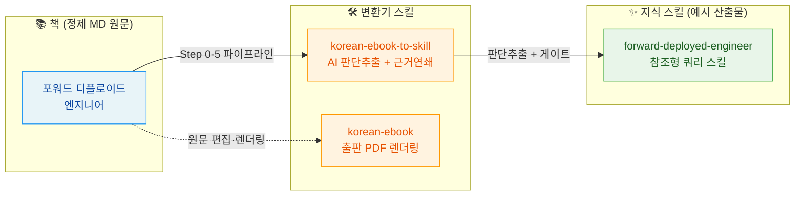

# KLIC BOOK

책·강의·출판 스킬을 모아두는 저장소. 각 자원은 폴더 하나에 독립적으로 담긴다.

## 📚 책

| 책 | 한줄 소개 | 완성본 |
| --- | --- | --- |
| [포워드 디플로이드 엔지니어](books/forward-deployed-engineer/) | AI 시대에 고객 가치를 직접 전달하는 직무, FDE의 전 과정을 정리 | [PDF 다운로드](books/forward-deployed-engineer/FDE_포워드_디플로이드_엔지니어_한국어판_최종편집본.pdf?raw=1) |
| [GitHub 협업 실무 가이드](books/github-guide/) | AI 코딩 시대, 협업 기준점을 GitHub에 두는 issue·branch·PR 실무 가이드 | [PDF 다운로드](books/github-guide/GitHub_협업_실무_가이드.pdf?raw=1) |
| [실전 시스템 설계 2026](books/practical-system-design-2026-book/) | 분산·데이터·프로덕션·AI 네이티브까지, 2026년 시스템 설계 38장 종합 (System Design Primer 한국어 개정 초고) | [PDF 다운로드](books/practical-system-design-2026-book/build/실전_시스템_설계_2026_practical-system-design-2026-ko.pdf?raw=1) |
| [AI 에이전트 깊이 이해하기](books/ai-agent-book-ko/) | Agent = LLM + 컨텍스트 + 도구. 10장으로 끝내는 AI 에이전트 설계·실전 (chemark 《深入理解 AI Agent》 한국어 번역판, Apache 2.0) | [PDF 다운로드](books/ai-agent-book-ko/build/AI_에이전트_깊이_이해하기_ai-agent-book-ko.pdf?raw=1) |
| [NHN FactoryX 실전 설계](books/factoryx-ai-infrastructure/) | GPU 데이터센터에서 AI 에이전트 실행 환경까지, 공개 근거로 설계하는 AI 인프라 실무서 | [PDF 다운로드](books/factoryx-ai-infrastructure/build/NHN_FactoryX_실전_설계_nhn-factoryx-ai-infrastructure-ko.pdf?raw=1) |
| [대규모 언어모델(LLM) 강좌 2025](books/llm-lecture-2025/) | 동경대 마츠오·이와사와 연구실 LLM 강좌(8일) 한국어 번역판. pdf-to-md 변환→번역→재구성→출간 파이프라인. CC BY-NC-ND 4.0 | [PDF 다운로드](https://raw.githubusercontent.com/klic-co-kr/KLIC-BOOK/main/books/llm-lecture-2025/LLM_강좌_2025_한국어번역판.pdf) |

## 🎓 강의

(추가 예정)

## 🛠 스킬

| 스킬 | 설명 |
| --- | --- |
| [korean-ebook](skills/korean-ebook/) | 한국어 원고를 출판형 A4 PDF로 편집·렌더링·검수 + 요약본(용어집·챕터 요약) 생성하는 에이전트 스킬. Codex·Claude 양쪽 호환 |
| [korean-ebook-to-skill](skills/korean-ebook-to-skill/) | 한국어 책에서 AI가 진짜 가치를 판단해 추출(방법론·연구·해결책·원칙·안티패턴)하는 근거-chained 쿼리 지식층 스킬. 부록C 사례 회상율로 품질 검증. Claude 호환 |
| [forward-deployed-engineer](skills/forward-deployed-engineer/) | FDE 책에서 추출한 참조형 쿼리 스킬 1개(통찰 55개, 회상 28.3%). korean-ebook-to-skill 변환기의 첫 예시 산출물 |
| [pdf-to-md](skills/pdf-to-md/) | PDF 책(텍스트·스캔 혼합)을 챕터별 정제 Markdown으로 변환. pymupdf + PaddleOCR PP-Structure. korean-ebook 역방향 입력층(외부 PDF → MD → korean-ebook-to-skill). Claude 호환 |

## 🔗 연계도

책장의 자원이 어떻게 연결되는가. 책 원문 → 변환기 스킬 → 지식 스킬(예시 산출물) 흐름.



- **책 원문**(`books/`)이 **변환기 스킬**(`skills/korean-ebook-to-skill`)로 들어가 **지식 스킬**(참조형 쿼리 스킬)로 산출된다. FDE가 첫 예시.
- `korean-ebook`(출판 PDF)은 같은 책 원문의 다른 산출 경로(지식 추출 아님).
- 변환 파이프라인 상세는 변환기 [README](skills/korean-ebook-to-skill/README.ko.md#파이프라인-연계도) 참고.

## ⬇️ 예시 스킬 다운로드

`forward-deployed-engineer` 스킬 — `korean-ebook-to-skill` 변환기로 FDE 책에서 추출한 **첫 예시 산출물**. 통찰 55개(방법·원리·연구·해법·안티), 부록C 회상 28.3%.

**zip 직접 다운로드**:
👉 [forward-deployed-engineer-skill-v1.0.zip](https://github.com/klic-co-kr/KLIC-BOOK/releases/download/v1.0-fde-skill/forward-deployed-engineer-skill-v1.0.zip)

**설치**:
```bash
# Claude Code 스킬 디렉토리에 풀기
unzip forward-deployed-engineer-skill-v1.0.zip -d ~/.claude/skills/
```
또는 이 저장소를 `git clone` 한 뒤 `skills/forward-deployed-engineer/` 참조.

**사용**: FDE 주제 질문 시 SKILL.md 색인에서 항목 식별 → `insights/<카테고리>.md` 본문 로드 → 항목 + 근거(부록C 사례 / 원문 §)로 응답.

> 이 스킬은 **참조형**(발동형 아님). 능동 트리거 없이 쿼리에만 응답. 변환 과정은 [`skills/korean-ebook-to-skill/`](skills/korean-ebook-to-skill/) 참조.

## 폴더 규칙

- `books/<책-슬러그>/` — 책 한 권 단위. 자체 `README.md`(소개+목차), 챕터, 표지, 통권 PDF.
- `lectures/<강의-슬러그>/` — 강의 단위.
- `skills/<스킬-슬러그>/` — 재사용 가능한 에이전트 스킬. `SKILL.md`(Claude)와 `agents/openai.yaml`(Codex)을 함께 두어 양쪽 호환.
- 루트 `README.md`는 색인만 담당. 본문은 각 폴더로.
