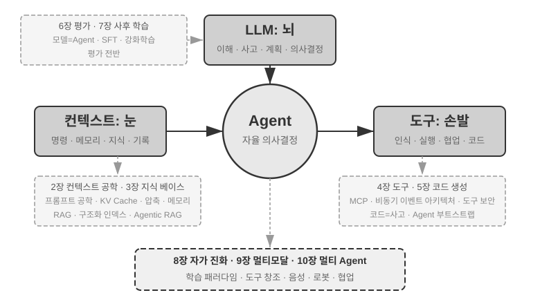
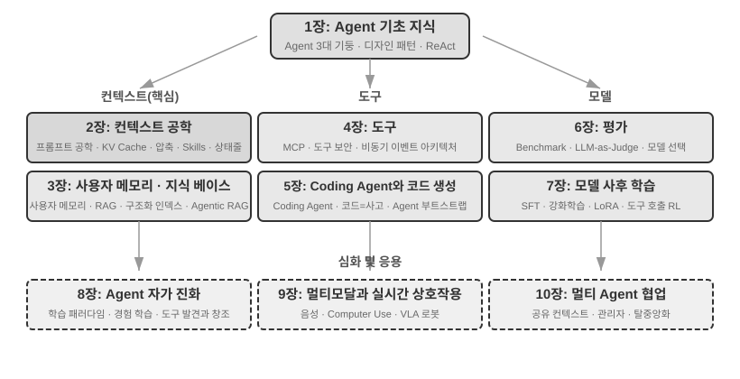

# 들어가며

2025년 8월부터 10월까지, 나는 튜링의 《AI Agent 실전 캠프》에서 일련의 기술 강의를 진행했다. 강의의 출발점은 단순했다. AI Agent의 설계를 '감정 주도'에서 '원칙 주도'로 바꾸는 것. 단순히 데모 하나를 돌려보는 것에 그치지 않고, Agent를 왜 이렇게 설계해야 하는지, 각 아키텍처 결정 뒤에 있는 트레이드오프를 깊이 이해하는 것을 목표로 했다. 이 책은 바로 그 강의의 원고와 실험에서 출발해 정리하고 확장한 결과다.

한 가지 덧붙이자면, 이 책은 초기 아이디어에서 최종 완성에 이르기까지 **whisper coding**(구술 협업)이라 부를 만한 방식으로 만들어졌고, 내가 구술할 때 사용한 도구는 바로 우리 Pine 자체의 음성 Agent였다. 강의 원고를 준비할 때마다 나는 먼저 대략적인 개요를 음성으로 불러 주고, 그것이 조사(survey)를 수행한 뒤 초안을 정리하도록 했다. 강의가 끝나면 AI Agent 실전 캠프 수강생들의 피드백을 반영해 그것과 거듭 논의하고 다듬기를 반복했고, 그렇게반복해 나간 끝에 지금의 책으로 확장하고 편성했다. 과정 전체를 통틀어 나는 대부분의 시간을 타이핑하지 않고 생각을 음성으로 전달했다. 음성의 대역폭은 타이핑보다 훨씬 넓다(정상적인 말하기 속도는 타이핑의 약 네 배다). 그 덕에 '구술-조사-논의-수정'의 루프는 매우 빠르게 돌아갔다. 어떤 의미에서 이 책은 Agent를 다루면서도, 동시에 Agent가 참여해 만들어낸 작품이기도 하다.

2025년 초 DeepSeek R1이 발표된 이래, AI 분야는 단순한 파운데이션 모델(범용 대규모 언어 모델의 기반)에서 한 걸음 더 나아가 공학적 적용의 심해로 진입했다. 모델 계층의 진전은 두 방향에서 살펴볼 수 있다. 한편으로는 에이전트 환경에서의 강화학습(Agentic Reinforcement Learning)을 통해 도구 호출 능력을 모델 파라미터 안에 학습시킴으로써, 모델이 코딩·수학·그래픽 인터페이스 조작(computer use) 등 여러 영역에서 범용 능력을 갖추게 되었다. 모델의 반복 속도도 갈수록 빨라져, GPT-5.2에서 GPT-5.5로, Claude Opus 4.5에서 4.8로 넘어가는 데 단 반년이 채 걸리지 않았다. 제품 계층에서는 Manus, Claude Code, OpenClaw 같은 범용 Agent가 인간-기계 상호작용의 방식을 재정의하며 '코드 생성 + 파일 시스템'이라는 아키텍처 패러다임을 주류의 시야로 끌어올렸다.

거의 1년 전 강의에서 정리했던 Agent 아키텍처 설계 원칙들을 되돌아보았을 때, 한 가지 사실이 나를 다행스럽게도, 그리고 놀랍게도 만든다. **이 원칙들은 전혀 구식이 되지 않았을 뿐 아니라, 오히려 갈수록 더욱 고전으로 자리 잡고 있다.** 이후 Agent 업계에 Skill, harness, loop engineering 같은 새 명칭들이 차례로 등장했지만, 실제 순서는 정반대다. Anthropic 같은 회사들이 먼저 이 개념들을 발명하고 수많은 Agent가 뒤따라 사용한 것이 아니라, 수많은 Agent가 이미 오래전부터 그렇게 하고 있었기에 Anthropic이 그것을 추려 내고 정리해 아키텍처 설계 원칙으로 삼은 것이다. 실천이 앞서고, 명명은 뒤따른다.

이 원칙들의 근거는 Agent를 실제로 장기적이고 고위험인 시나리오까지 밀어붙인 실전에서 나온다. Pine AI의 수석 과학자로서 나와 팀은 Pine을 만들었다. 내가 아는 한, Pine은 실제 사람과 자율적으로 상호작용하며, 돈을 다루는 민감하고 복잡하고 장기적인 과업을 신뢰성 있게 혼자 처리하는 최초의 범용 Agent다. Pine은 사용자를 대신해 통신사에 전화를 걸어 청구서를 협상하고, 업체와 환불 및 불만을 교섭하며, 구독을 취소한다. 전 과정에 사람의 개입이 필요 없다. 이런 과업은 수십 라운드의 교섭이 오가는 일이 드물지 않고, 어느 한 단계라도 잘못되면 실제 돈이 날아간다. 바로 이 신뢰성에 대한 거의 가혹할 정도의 요구가, 이 책이 거듭 강조하는 아키텍처 원칙들을 하나하나 역으로 끌어내게 만들었다. 아래의 몇 가지 사례는 모두 그 실전에서 온 것이다.

- Skill이라는 개념이 널리 알려지기 훨씬 전부터, 우리는 프롬프트가 무한히 부풀어 오르는 문제를 동적 로딩 방식으로 해결했고, 도구 목록이 무한히 늘어나는 문제를 명령줄에서 도구를 실행하는 방식으로 해결했으며, Agent가 실행 환경과 사용자의 시간·작업 상태를 인식하지 못하는 문제를 시스템 상태 표시줄 기술로 해결했다.
- harness라는 개념이 널리 알려지기 전부터, 우리는 Claude Code와 비슷한 방식으로 모델의 도구 호출이 불안정한 문제, 환각, 위험한 조작, 권한을 넘어선 조작, 지시 미준수 등의 문제를 다루었다.
- loop engineering이라는 개념이 유행하기 전(이 명칭은 2026년 중반에 이르러서야 업계에서 다듬어져 명명되었다)부터, 우리는 이 책에서 '제안자-검토자(proposer-reviewer)'라 부르는 방법으로 모델이 과업을 너무 일찍 완료되었다고 믿어버리는 문제를 다루었다. 여기에는 한 가지 길이 막히면 곧장 "할 수 없다"고 선언해 버리는 조기 포기도 있고, 닫힌 루프를 다 돌기도 전에 "끝났다"고 선언하는 거짓 성공도 있다. 이 방법의 핵심은, Agent가 자신이 내놓은 산출물(artifact)을 스스로 검토하고 반복 개선하게 만들고, 검증이—not 모델 자신의 느낌이—과업 종료 시점을 결정하게 하는 것이다.

그리고 이는 우리만의 독자적 발명이 아니다. 내가 아는 한 대부분의 선두 모델 및 Agent 기업도 스스로 비슷한 방법을 찾아냈다. 이것이 내가 2025년 8월 튜링에서 《AI Agent 실전 캠프》 과정을 열고, 2024-2026년 내내 국과대(중국과학원대학)에서 AI Agent 실습 과정을 지속해 온 이유이기도 하다. 이 책을 폐쇄적으로 묶어 인세를 받기보다 오픈소스로 공개하는 것 역시, 이 지식이 더 많은 실무자에게 퍼지기를 바라기 때문이다.

**실천이 앞서고, 명명은 뒤따른다.** 이 순서는 기업용 Agent 개발에 대해 아주 현실적인 함의를 갖는다. **업계에서 어떤 Agent 명칭이 유행할 때마다 그제야 실천에 나선다면, 당신은 이미 한 발 늦은 것이다.** 명칭이 유행할 무렵이면, 선두 기업들은 대개 이미 그에 해당하는 문제를 한바퀴 다 겪고 난 뒤다. 그렇다면 어떻게 명칭이 유행하기도 전에 무엇을 해야 할지 알 수 있을까? 나는 두 가지가 가장 핵심적이라고 본다.

**첫째, Agent의 능력 상한에 대해 극히 높은 요구를 갖는 실제 비즈니스를 보유하고, 그로부터 지속적으로 진짜 비즈니스 피드백을 받을 것.** Pine을 예로 들면, 한 가지 일을 처리하는 데 수시간에서 수주까지 걸리는 경우가 많고, 그 과정에서 여러 이해관계자와 반복적으로 소통해야 할 수 있다. 그 사이에 몇 시간씩 전화를 걸어야 할 수도 있고, 컴퓨터에서 여러 페이지에 걸친 복잡한 양식을 작성해야 할 수도 있으며, 수통의 이메일을 주고받아야 할 수도 있다. 그 모든 과정에서 어느 하나의 숫자도 틀려서는 안 되며, 동시에 소통 과정에서는 늘 신중을 기해 사용자의 이익을 지켜야 한다. 오직 이렇게 충분히 복잡한 시나리오에 몸을 담아야만, 실전이 자연스럽게 당신을 밀어붙여 harness를 구축하게 만들고, 모델 자체가 지금으로서는 해내지 못하지만 비즈니스 상 반드시 완수해야 하는 일들을 해결하게 만든다. 반대로, 비즈니스가 능력 상한을 크게 요구하지 않아 모델이 한두 단계 업그레이드되는 것만으로 충분하다면, 이런 아키텍처 원칙을 다듬을 동기도 생기지 않는다.

**둘째, 반드시 평가(Evaluation) 체계를 세울 것.** 이 역시 이 책이 거듭 강조하는 점이다. 평가 없이는 발전도 없다. 평가가 있어야 한 번의 변경이 정말로 나아진 것인지 아니면 단순한 운인지를 가릴 수 있고, 그제야 Agent의 반복 방향이 직관에만 의존하지 않게 된다. 결국 우리가 주장하는 것은, 공학을 할 때, Agent를 만들 때 과학적 방법론을 쓰자는 것이며, 평가는 그 방법론의 토대다. 6장에서 이 방법론을 별도로 다룬다.

기저 모델이 어떻게 업그레이드되든, 제품 형태가 어떻게 혁신되든, 거의 모든 성공적인 Agent 시스템은 동일한 아키텍처 패턴을 따른다. 이는 우연이 아니다. **좋은 설계 원칙은 애초에 모델의 반복 주기를 가로질러야 한다.** 그 원칙들이 서술하는 것은 어떤 모델 하나의 사용법이 아니라, 지능 시스템이 세계와 상호작용하는 기본 패턴이기 때문이다.

튜링상 수상자이자 강화학습의 아버지 Richard Sutton은, 우주의 진화가 먼지에서 항성으로, 항성에서 생명으로, 생명에서 에이전트(원문은 '설계된 실체', designed entities)로 이르는 4단계를 거쳤다고 말한 적 있다. 생물의 진화는 맹목적이다. 무작위 변이, 자연선택. 대부분의 생물은 자기 작동 원리를 이해하지 못하며, 스스로 생물을 설계하거나 개조하지도 못한다. 그러나 에이전트(Agent)는 우주 진화 역사상 전혀 새로운 존재다. 그는 코드를 생성함으로써 부트스트랩(bootstrap)과 자기 진화를 실현한다. 한 프로그래머가 다른 프로그래머를 작성하고, 그 새 프로그래머가 또다시 다음 프로그래머를 작성하는 것과 같다. 즉 Agent는 자기 자신의 작동 메커니즘을 이해하고, 목표에 따라 전혀 새로운 지능체를 창조하며, 심지어 자기 자신을 개선할 수 있다. 이 책의 사명은 바로, 이런 창조의 원칙을 이해하고 익히도록 돕는 데 있다.

이 책의 핵심 공식은 단 한 문장이다. **Agent = LLM + 컨텍스트 + 도구**. 셋 중 어느 하나라도 빠져서는 안 된다.

더 직관적으로 말하면, **뇌 + 눈 + 손발**이다. 뇌(LLM)은 생각과 의사결정을 맡고, 눈(컨텍스트)은 Agent가 어떤 정보를 볼 수 있는지를 결정하며, 손발(도구)은 Agent가 어떤 일을 할 수 있는지를 결정한다. (엄밀히 말하면 '눈'은 대략적인 비유일 뿐이다. 컨텍스트는 환경 정보와 대화 기록뿐 아니라 도구 정의 등도 함께 포함한다. 다시 말해 Agent가 '보는' 정보 안에는 '사용할 수 있는 손발이 무엇인지'도 들어 있다. 이 은유가 전달하려는 핵심 직관은, 컨텍스트가 모델이 지각할 수 있는 모든 정보라는 점이다.)

강화학습에 익숙한 독자라면, 이 세 가지를 RL의 형식 언어로 대응시킬 수도 있다. 구체적으로, LLM은 정책(Policy)에, 컨텍스트는 관측 공간(Observation Space)에, 도구는 행동 공간(Action Space)에 대응한다. 세 표현은 모두 같은 대상을 가리키며, 단지 표현의 층위가 다를 뿐이다.

하지만 이 세 단어 각각의 의미는 글자 그대로의 뜻보다 훨씬 풍부하다. 1장에서는 실전에서 출발해 이들을 하나씩 해체하고, 직관적 이해에서 학술적 개념에 이르는 완전한 대응을 세운다.

## 전체 구조

이 책은 모두 10장으로, 세 부분으로 나뉜다(그림 0-1, 그림 0-2). 1장은 기초로, Agent에 대한 전역적 인식을 세운다. 2~7장은 차례로 세 기둥을 펼친다. 컨텍스트(2~3장), 도구(4~5장), 모델(6~7장, 평가와 사후 훈련)이다. 8~10장은 심화와 응용으로, Agent의 자기 진화, 멀티모달과 실시간 상호작용, 그리고 멀티 에이전트 협업을 다룬다.

- **1장(Agent 기초 지식)**은 여러 실제 Agent 제품을 도입부로 삼아 Agent에 대한 직관적 이해를 세운다. Agent의 핵심 공식을 깊이 분석한다. 구현 계층의 'LLM + 컨텍스트 + 도구'에서, 직관 계층의 '뇌 + 눈 + 손발'을 거쳐, 학술 계층의 정책(Policy), 관측 공간(Observation Space), 행동 공간(Action Space)에 이르기까지. 동시에 실험을 통해 ReAct 루프, 즉 '생각→행동→관찰'의 반복 과정이 작동하는 메커니즘을 분해해 보여 주고, Agent의 세 가지 학습 패러다임인 사후 훈련(Post-training), 컨텍스트 내 학습(In-Context Learning), 외부화 학습(Externalized Learning)을 소개한다. 마지막으로 워크플로에서 자율 Agent에 이르는 오케스트레이션 설계 패턴을 논의하며, 이후 장들의 통일된 개념 틀을 마련한다.
- **2장(컨텍스트 엔지니어링)**은 이 책 전체에서 가장 핵심적인 장으로, Agent의 '눈'인 컨텍스트를 체계적으로 다룬다. 먼저 API 메시지 구조와 Agent의 핵심 루프에서 출발해 '컨텍스트는 곧 메시지 리스트'라는 토대를 세우고, KV Cache(대규모 모델 추론 과정에서 과거 계산 결과를 재사용하는 메커니즘)의 하부 원리를 깊이 파헤친다. 그런 뒤 차례로 프롬프트 엔지니어링(Prompt Engineering, 절차적 설계·도구 설명·비즈니스 규칙의 정교화를 포함)과 프롬프트 인젝션(Prompt Injection) 공방, Agent Skills의 필요 시 로딩 메커니즘, Agent 상태 표시줄 기술, 그리고 컨텍스트 압축(Context Compression) 전략을 펼친다. 각 용어의 완전한 정의는 본문에서 처음 등장하는 지점에 제시된다.
- **3장(사용자 기억과 지식 베이스)**은 컨텍스트 관리를 세션을 가로지르는 영속적 지식 체계까지 확장해, Agent가 현재 대화의 내용뿐 아니라 여러 대화에 걸쳐 지식을 축적하고 호출할 수 있게 만든다. 사용자 기억의 네 가지 점진적 전략, RAG(검색 증강 생성, 즉 관련 문서를 먼저 검색한 뒤 모델이 답을 생성하게 하는 기법)의 완전한 기술 스택(다양한 텍스트 검색 방법과 검색 결과 정렬 최적화를 포함), 멀티모달 정보 추출, 더 고급스러운 지식 조직 방법, 그리고 에이전트화된 RAG(Agentic RAG, 즉 Agent가 언제 검색할지, 무엇을 검색할지 스스로 결정하는 방식)을 다룬다.
- **4장(도구)**은 Agent와 외부 세계가 상호작용하는 다리를 다룬다. 도구는 Agent의 '손발'과 같아서, 웹 페이지 검색, API 호출, 데이터베이스 조작 등을 가능하게 한다. MCP 도구 상호운용 표준과 다섯 부류의 도구 설계 원칙(인식·실행·협업·이벤트 트리거·사용자 소통)을 소개하고, 실행 도구의 안전 메커니즘과 이벤트 구동의 비동기 Agent 아키텍처를 중점적으로 다룬다.
- **5장(코딩 에이전트와 코드 생성)**은 코딩 에이전트(Coding Agent)에 파일 시스템이 더해질 때, 이것이 모든 범용 Agent의 가장 핵심적인 기술 기반이 된다는 점을 논증한다. OpenClaw 아키텍처를 주축으로 코딩 에이전트의 작업 흐름과 구현 기법을 해부하고, 코드 생성이 프로그래밍을 넘어 갖는 넓은 가치를 보여 준다. 생각 보조, 지식 베이스 구축에서, 동적으로 새 도구를 만들어 내고 에이전트를 부트스트랩하는 데 이르기까지.
- **6장(Agent의 평가)**은 과학적인 평가 방법론을 세운다. 평가 환경(도구 호출형과 인간-기계 상호작용형 두 가지 핵심 패러다임, 그리고 장 말미에 별도로 논의하는 시뮬레이션 환경), 데이터셋의 설계 원칙, LLM-as-a-Judge 자동 평가 방법, 평가 기반의 모델 선택, 그리고 평가 결과를 시스템 개선으로 바꾸는 완전한 폐루프를 다룬다.
- **7장(모델 사후 훈련)**은 SFT(감독 미세조정, 즉 라벨링된 데이터로 모델에 '본떠 학습'시키는 것)와 RL(강화학습, 즉 모델이 시행착오와 보상 피드백을 통해 스스로 향상되는 것)이라는 두 가지 사후 훈련 기술을 깊이 다룬다. 'SFT는 기억, RL은 일반화'와 '알고리즘보다 데이터와 환경이 더 중요하다'는 핵심 논제를 축으로, 사전 훈련/SFT/RL 3단계의 전체 풍경, 고전 RL 이론, 보상 신호 설계(이진 보상에서 과정 보상을 거쳐 '결과에 보상, 과정엔 제약'이라는 검증 경로 패널티까지), 단턴 및 멀티턴 강화학습 알고리즘, 그리고 샘플 효율 최적화 같은 최전선의 탐색을 망라한다.
- **8장(Agent의 자기 진화)**은 모델 가중치를 수정하지 않은 채로 Agent가 어떻게 지속적으로 강해질 수 있는지를 다룬다. 두 가지 큰 진화 경로가 있다. 하나는 경험으로부터 학습하는 것(전략 요약, 워크플로 녹화, 시스템 프롬프트 자동 최적화, Skills의 지식 외부화)이고, 다른 하나는 능동적으로 도구를 발견하고 창조하는 것(MCP-Zero, 오픈소스 도구 통합, 코드로 새 도구 만들기)이다.
- **9장(멀티모달과 실시간 상호작용)**은 Agent가 텍스트 세계에서 물리 세계로 나아가는 전망을 다룬다. 음성 Agent(직렬 파이프라인에서 종단간 모델까지), 컴퓨터 사용(Computer Use, Agent가 사람처럼 그래픽 인터페이스를 조작하게 하는 것), 로봇 조작(VLA(시각-언어-행동 모델) 제어와 Sim2Real 전이)을 다루며, 멀티모달과 실시간성이 가져오는 공통된 아키텍처 과제를 드러낸다.
- **10장(멀티 에이전트 협업)**은 AI Agent 시스템의 궁극적 형태를 논의한다. 여러 Agent가 어떻게 역할을 나누고 협력하는가. 멀티 에이전트 협업의 분류 틀(컨텍스트 공유/독립 × 동등/관리자/탈중앙화)을 체계적으로 서술하고, 번역 Agent, 전화+컴퓨터 Agent 같은 사례를 통해 협업 아키텍처의 설계 방법을 보여 주며, 에이전트 사회와 에이전트 경제라는 최전선 방향을 전망한다.

## 이 책을 읽는 법

이 책의 각 장은 비교적 독립적이므로, 자신의 필요에 따라 다양한 읽기 경로를 선택할 수 있다.

- **당신이 Agent 개발자라면**, 순서대로 전체를 통독하기를 권한다. 1~5장은 핵심 지식 체계를 이루고, 6장의 평가 방법론 역시 건너뛰면 안 된다. 7장은 모델을 직접 다뤄야 하는 독자를 위한 것이고, 8~10장은 심화 방향을 보여 준다.
- **시간이 부족하다면**, 우선 1장(전역적 인식 세우기)과 2장(가장 핵심적인 컨텍스트 엔지니어링 익히기)부터 읽자. 2장의 KV Cache 하부 원리는 다소 기술적이라, 첫 읽기에서는 원리 부분은 건너뛰고 처음에 제시한 세 가지 핵심 결론만 기억해도 이후의 이해에 지장이 없다.
- **모델 훈련에 관심이 있다면**, 7장(모델 사후 훈련)을 바로 읽어도 된다. 다만 평가 방법(6장)이 훈련의 전제이므로 함께 읽기를 권하며, 전체적 인식을 세우기 위해 1~2장을 먼저 읽는 것이 좋다.

각 장에는 다수의 **실험**과 **생각 문제**가 들어 있으며, 번호 형식은 '실험 X-Y'(X는 장 번호, Y는 장 안의 순서)다. 실험과 생각문제의 제목에는 난이도를 별 표시로 달았다. ★는 입문 수준으로 모든 독자에게 적합하고, ★★는 중간 난이도로 어느 정도의 공학 실무 기초가 필요하며, ★★★는 심화 과제로 대개 열린 문제나 복잡한 시스템 설계를 다룬다. 대부분의 실험에는 완전한 실행 가능 코드가 딸려 있으며, 부록의 오픈소스 저장소에 정리되어 있다.

> **부록 코드 저장소**: [https://github.com/bojieli/ai-agent-book](https://github.com/bojieli/ai-agent-book)

저장소의 프로젝트 이름은 책 속의 실험과 일대일로 대응하며, 각 프로젝트는 실행 방법과 의존성 설정을 완전하게 담고 있다. 이 실험들을 직접 한 번씩 돌려 보기를 강력히 권한다. AI Agent는 실전적 성격이 매우 강한 분야로, 설계상의 직관 가운데 상당수는 손으로 직접 디버깅하는 과정 속에서야 비로소 자리 잡는다.

**용어에 관한 한 가지 약속**: 어떤 영어 기술 용어를 우리말로 직역하면 오해가 생긴다. 이 책은 빈도가 높은 두 단어를 특별히 구분한다. reasoning(모델이 중간 추론을 전개하는, '생각하는' 과정)은 통일하여 '사고'로 옮기고, inference(모델의 순방향 계산과 배포·실행)는 통일하여 '추론'으로 옮긴다. 두 개의 다른 우리말 단어를 쓰는 것은, '추론'이라는 한 단어가 두 개념을 한꺼번에 떠안아 독자가 구분하지 못하게 되는 일을 피하기 위해서다. 따라서 모델의 사고 체인(Chain-of-Thought), 사고형 모델(OpenAI o 시리즈, DeepSeek-R1 등으로, 이 책에서는 '사고 모델', '사고자'라 한다), 사고 토큰, 사고 과정을 가리키는 곳에서는 모두 '사고'를 쓴다. 반면 모델의 실행과 배포(추론 시, 추론 비용, 추론 스택, 추론 시 확장 등)를 가리키는 곳에서는 '추론'을 쓴다. 한 가지 예외로, 이미 우리말에 굳어진 합성어가 몇 있다. **논리 추론, 다중 홉 추론, 공간 추론, 시계열 추론** 및 '추론 게임' 같은 일상 용법이 그것으로, 이 책은 관행적 번역을 따라 '추론'이라는 두 글자를 보존한다. 독자는 문맥에 따라 이들이 inference의 기술적 의미가 아니라 연역적 추론이라는 일반적 의미를 가리킴을 이해해 주기 바란다. 그 밖의 핵심 용어는 본문에서 처음 등장하는 자리에 한국어와 영어를 함께 제시한다.

## 사전 지식

이 책은 어느 정도의 기술적 배경을 가진 독자를 대상으로 하지만, 특정 분야의 전문가여야 한다는 요구는 없다. 아래에 '필수'와 '권장' 두 단계로 사전 지식을 정리해 두었으니, 자신의 준비 정도를 가늠해 보기 바란다.

**필수: 책 전체를 읽기 위한 기초**

- **Python 프로그래밍**: 이 책의 실험은 거의 모두 Python에 기반한다. Python의 기본 문법, 자주 쓰는 자료구조, 패키지 관리(pip) 등 기본 개념에 익숙해야 한다. 정통할 필요는 없지만, 중간 수준의 복잡도를 갖는 Python 코드를 읽고 수정할 수 있어야 한다.
- **LLM의 기본 사용 경험**: ChatGPT, Claude 또는 비슷한 제품을 사용해 봤으며, '프롬프트(Prompt) → 모델 응답'이라는 기본 상호작용 패턴을 이해해야 한다.
- **AI 보조 코딩 도구 하나**: Claude Code, Codex, Cursor, Trae 같은 AI 보조 코딩 도구를 최소 하나는 설치하고 익숙해지기를 강력히 권한다. 한편으로 이런 도구들은 실험의 개발 효율을 크게 높여 준다. 이 책의 실험에는 대량의 코드 작성과 디버깅이 따른다. 다른 한편으로 이런 코딩 도구들은 그 자체로 성숙한 코딩 에이전트다. 그것을 사용하는 과정에서 ReAct 루프, 도구 호출, 컨텍스트 관리 등 이 책이 거듭 다루는 핵심 메커니즘을 직관적으로 체험하게 되며, 이런 일차 체험이 Agent 설계 원칙을 이해하는 데 매우 귀중하다.
- **소프트웨어 엔지니어링 상식**: 명령줄 조작, Git 버전 관리, JSON 데이터 형식, REST API 등의 기본 개념에 익숙해야 한다. 이는 실험을 실행하고 Agent의 도구 호출 메커니즘을 이해하는 토대가 된다.

**권장: 특정 장의 독서 경험을 높이는 지식**

- **머신러닝 기초**(7장): 훈련과 추론, 손실 함수, 경사 하강법, 과적합 등 기본 개념을 알면 모델 사후 훈련을 이해하는 데 도움이 된다.
- **기초 수학**(2~3장, 7장): 선형대수에 대한 직관적 이해(예를 들어 벡터가 방향과 크기를 나타내고 행렬이 배치 연산을 수행한다는 정도)는 임베딩과 어텐션 메커니즘을 이해하는 데 도움이 되고, 기초적인 확률과 통계 지식은 평가 지표와 강화학습의 기대 보상을 이해하는 데 도움이 된다. 책 속의 수학은 복잡한 유도를 다루지 않고 직관적 설명에 집중한다.
- **웹 개발 기초**(4장, 9장): HTTP, WebSocket, 프런트엔드-백엔드 분리 아키텍처 등의 개념을 알면 이벤트 구동의 비동기 Agent 아키텍처와 음성 Agent의 실시간 통신 실험을 이해하는 데 도움이 된다.
- **Transformer 아키텍처에 대한 기본 이해**(2장, 7장): Transformer는 현재 거의 모든 대규모 언어 모델의 기반 아키텍처이다. 대규모 모델의 기초를 체계적으로 보충하려는 독자에게는 《그림으로 보는 대규모 모델》(튜링 출간)을 권한다. 그 책은 직관적인 그림으로 Transformer 아키텍처와 사전 훈련·미세조정 같은 핵심 개념을 설명하며, 이 책의 Agent 공학 시각과 좋은 보완 관계를 이룬다.

사전 지식 가운데 부족한 부분이 있다 해서 주저할 필요는 없다. 이 책의 핵심 가치는 **아키텍처 설계 원칙과 공학적 실전의 방법론**에 있으며, 특정 알고리즘이나 기법 자체에 있지 않다. 7장의 사후 훈련을 제외하면, 책 전체가 수학과 머신러닝에 대해 요구하는 수준은 낮아, 출발점으로 삼아도 무방하다.

Agent 기술은 여전히 빠르게 진화하고 있다. 하지만 **좋은 아키텍처 설계 원칙은 시간을 가로지르는 힘을 지닌다**. '왜 이렇게 설계해야 하는가'를 익히고 나면, 기술 물결의 변화 속에서도 또렷한 판단력을 유지할 수 있다. 이 책이 당신이 AI Agent를 구축하는 믿을 만한 안내서가 되기를 바란다.

## 사의

튜링의 멍거 선생님과 류메이잉 선생님의 부지런한 편집, 그리고 튜링 《AI Agent 실전 캠프》 과정을 조직하기 위해 들이신 수고에 감사드린다. 국과대에서 AI Agent 실전 과정을 열어 주신 류쥔밍 선생님께도 감사드린다. 아울러 튜링 《AI Agent 실전 캠프》의 모든 수강생, 그리고 국과대 AI Agent 실전 과정의 모든 학생들에게도 특별한 감사를 전한다. 이 과정들을 가르치는 동안 여러분이 많은 귀중한 피드백과 조언을 보내 주었고, 덕분에 나 자신도 이 개념들에 대해 더 또렷한 이해를 갖게 되었다.

Pine AI의 모든 동료에게 감사드린다. Pine AI 같은 훌륭한 제품과 그것이 던져 준 온갖 도전이 아니었다면, 나는 Agent 영역에서 이토록 깊은 이해와 실전을 얻을 수 없었을 것이다. 끊임없는 생각의 충돌 속에서 동료들은 또한 많은 귀중한 영감을 쏟아 내 주었다.

AI 업계의 많은 친구들(일일이 이름을 올리지 못해 죄송하다)에게도 감사드린다. 다양한 업계 토론에서 여러분은 내 관점에 대해 솔직한 피드백을 주었고, 내 잘못된 판단 가운데 상당수를 바로잡아 주었으며, 모델과 Agent에 대한 내 인식을 한 단계 끌어올려 주었다.

무엇보다 감사한 분은 나의 가족, 특히 아내 멍자잉이다. 그는 내가 이 책의 집필을 마무리하도록 늘 곁에서 응원해 주었고, 이 책에 대해 많은 귀중한 의견을 제시해 주었다.
