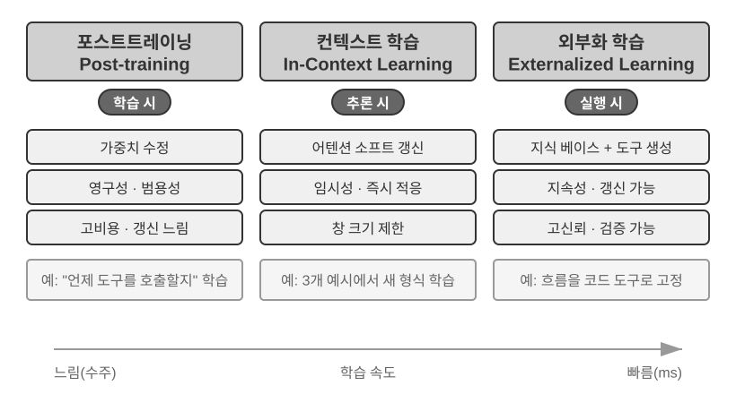
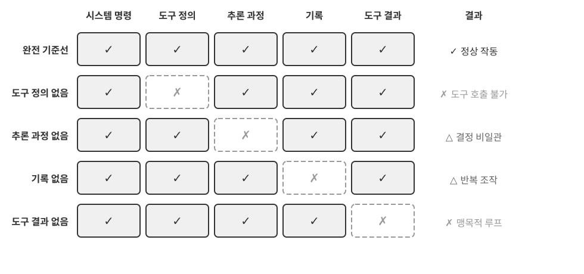
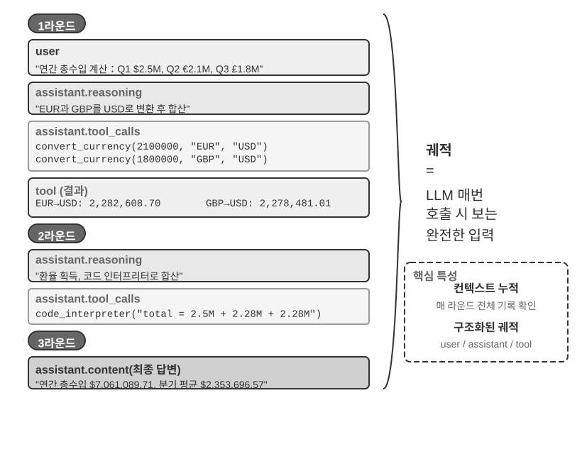
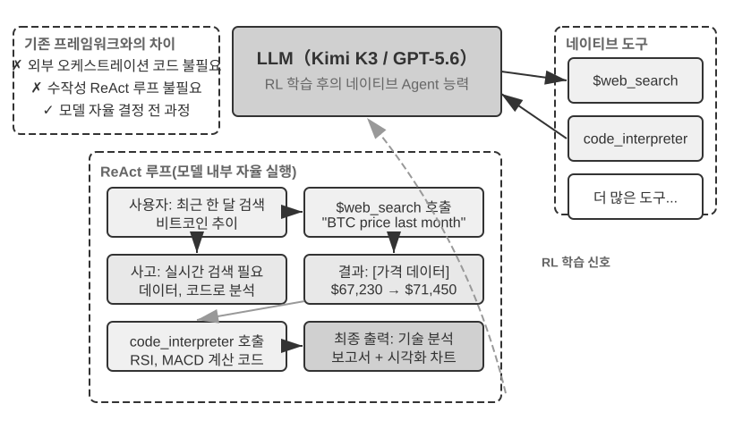
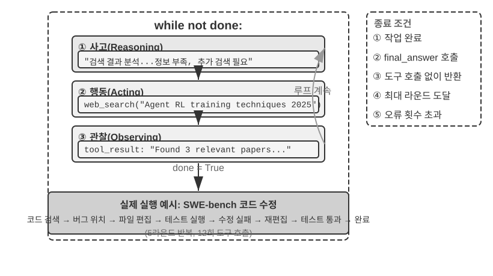

# AI 에이전트 입문

Cursor로 코드를 작성해 본 적이 있다면, 코드베이스를 검색하고 여러 파일을 편집하며 테스트가 통과할 때까지 실행하는 모습을 봤을 것이다. Deep Research로 주제를 조사하며 반복적으로 검색하고 읽고 정리해 하나의 완성된 보고서를 만들어 본 적이 있을 것이다. Manus가 브라우저를 조작해 온라인 작업을 대신해 주거나, AI 폰 어시스턴트가 폰에서 티켓을 예매하고 메시지를 보내주거나, Pine AI가 통신사에 전화를 걸어 청구서를 깎아 준 적도 있을 것이다. 이미 그런 제품들을 써 봤다면, 당신은 AI 에이전트를 사용하고 있는 것이다.

이 제품들은 형태는 각각 다르지만 한 가지 공통점이 있다. 더 이상 "한 마디 묻고 한 마디 대답하는" 수동적 대화가 아니라, 실행 단계를 스스로 계획하고 각종 도구를 호출해 작업을 수행하며, 결과에 따라 전략을 끊임없이 조정하는 지능 시스템이라는 점이다. AI 에이전트는 이미 우리가 컴퓨터와 소통하는 완전히 새로운 방식이 되어 가고 있다.

이 장에서는 실전에서 출발해 AI 에이전트의 핵심 구성을 이해한다. 현대 에이전트의 능력에 직접 손을 대 보고, 그 배경의 아키텍처 원리를 이해하며, 에이전트 시스템을 구축하는 설계 패턴과 모범 사례를 익힌다.

> **읽기 팁**: 이 장은 책 전체의 개념 지도다. 에이전트의 핵심 공식과 실행 루프, 엔지니어링 프레임워크, 설계 패턴을 빠르게 소개해서 이후 장들을 위한 통일된 용어와 좌표를 제공한다. 첫 읽기에서는 모든 개념을 하나하나 기억할 필요는 없다. 먼저 전체 그림을 그려 두기를 권한다. 이후 각 장에서 이 장이 언급한 어느 한 측면을 전개하므로, 그때마다 돌아와 대조하면 된다.

## 현대 에이전트 = LLM + 컨텍스트 + 도구

현대 에이전트 시스템의 본질은 간결한 하나의 공식으로 표현할 수 있다. **에이전트 = LLM(대언어모델, Large Language Model) + 컨텍스트(Context) + 도구(Tools)**. 이 공식은 간결하면서도 실용적이지만, 각 단어는 넓은 의미로 이해되어야 한다.

- **LLM은 에이전트의 뇌다**: LLM은 단순한 모델 파라미터 묶음이 아니라 에이전트의 전체 의사결정 핵심이다. 의도를 이해하고, 계획을 세우고, 판단을 내린다. 인간의 뇌가 단순한 뉴런의 집합이 아니라 경험을 통해 형성된 사고방식까지 포함하듯, LLM의 능력도 두 부분에서 나온다. 하나는 **사전학습(Pre-training)**이 축적한 세계 지식과 언어 능력이고, 다른 하나는 **사후학습(Post-training)**으로 굳혀진 의사결정 전략이다. 후자의 구체적 기술(지도 미세조정, 강화학습 등)은 7장에서 다룬다.
- **컨텍스트는 에이전트의 눈이다**: 컨텍스트는 모델에 입력되는 텍스트 그 이상이다. 에이전트가 매 의사결정 지점에서 볼 수 있는 모든 정보, 즉 환경 정보, 사용자 기억, 도메인 지식, 자신의 상태와 작업 진행 상황을 아울러 말한다. 인간이 결정을 내릴 때 현재 상황을 살피고 관련 경험을 떠올리며 참고 자료를 찾아보듯, 에이전트의 컨텍스트 창은 그 순간 에이전트가 볼 수 있는 전부다.
- **도구는 에이전트의 손발이다**: 도구는 몇 개의 호출 가능한 API 함수 그 이상이다. 에이전트가 할 수 있는 모든 일의 집합이다. 미리 정의된 도구 호출부터 필요에 따라 불러오는 전문 기술(Skill)까지, 동적으로 코드를 생성해 새 능력을 만들어 내거나 하위 에이전트에게 위임해 협업하는 것까지, 사용자와 능동적으로 소통하고 외부 이벤트에 반응하는 것까지 포함한다.

좀 더 직관적으로 표현하면, **에이전트 = 뇌 + 눈 + 손발**이다. 뇌는 생각하고 결정을 내리고, 눈은 생각에 필요한 모든 정보를 제공하고, 손발은 결정을 현실 세계에 대한 변화로 바꾼다.

이 세 구성 요소는 강화학습(RL, 7장 참조)의 세 가지 핵심 개념과 정확히 대응된다. 다음 표는 **선택 읽기**다. RL 배경이 없다면 건너뛰어도 이후 이해에 지장이 없다. 다만 RL 배경이 있는 독자가 이미 갖고 있는 지식을 이 책의 용어와 연결하는 데 도움이 될 뿐이다.

| 직관적 이해 | 구현 구성 요소 | 학술 개념(선택) | 의미 |
|-----------|-----------|----------------------------|----------------------------------------------|
| **뇌** | LLM | **정책**(Policy) | 에이전트가 "다음에 무엇을 할지"를 결정하는 논리. 현재 보이는 정보 앞에서 선택 가능한 행동 중 가장 적절한 하나를 고른다 |
| **눈** | 컨텍스트 | **관측 공간**(Observation Space) | 에이전트가 볼 수 있는 모든 정보. 무엇을 볼 수 있고, 무엇을 읽을 수 있고, 무엇을 기억하며, 어느 시스템에 접근할 수 있는지 |
| **손발** | 도구 | **행동 공간**(Action Space) | 에이전트가 할 수 있는 모든 일의 집합. 메시지 발송부터 코드 실행, 인터페이스 조작까지 어떤 "수단"을 쓸 수 있는지 |

이 세 가지의 역할과 상호 관계를 이해하는 것이 효과적인 에이전트 시스템을 구축하는 기초다. 가장 구체적인 손발(도구)부터 시작해, 점차 뇌(LLM)와 눈(컨텍스트)으로 깊이 들어간다. 먼저 다양한 유형의 에이전트가 이 세 차원에서 어떻게 펼쳐지는지 살펴보자.

| 에이전트 제품 | 눈(인식) | 손발(행동) | 전략 |
|----------------|----------------------|----------------------------|------------------------------|
| **Cursor 등 코딩 에이전트** | 요구사항 문서, 코드베이스, 터미널 환경 | 개방형(내부 사고, 코드 검색, 파일 읽기/쓰기, 명령 실행 등) | 점진적 개발: 요구사항 이해 → 관련 코드 검색 → 코드 편집 → 테스트 검증 → 디버그/수정 |
| **Deep Research 등 검색 에이전트** | 웹 자원, 학술 데이터베이스, 로컬 파일 | 개방형(내부 사고, 검색 쿼리, 웹페이지 읽기, 요약 생성) | 반복적 심화: 기존 정보에 따라 검색 방향을 조정하며 점진적으로 완성된 보고서를 종합 |
| **Manus 등 컴퓨터 조작 에이전트** | 컴퓨터 화면, 브라우저 페이지, 파일 시스템 | 개방형(내부 사고, 클릭, 입력, 스크롤, 스크린샷, 코드 실행 등) | 시각 인식 + 조작: 화면 관찰 → 목표 요소 식별 → 조작 실행 → 결과 검증 |
| **폰 어시스턴트 에이전트** | 폰 화면, 설치된 앱 | 개방형(내부 사고, 클릭, 스와이프, 입력, 앱 열기 등) | 의도 이해 + 앱 조작: 사용자 요구 이해 → 목표 앱 위치 → 조작 실행 → 완료 확인 |
| **Pine AI 등 개인 심부름 에이전트** | 사용자 계정 정보, 과거 청구서, 서비스 제공자 지식베이스 | 개방형(내부 사고, 전화, 이메일, 양식 작성, 사용자 확인) | 다단계 작업 실행: 정보 수집 → 협상 전략 수립 → 서비스 제공자 연락 → 협상 → 결과 보고 |

이 에이전트 시스템에는 몇 가지 공통 특성이 있다. 모두 **개방형 행동 공간**을 사용한다. 제한된 버튼 몇 개에서 선택하는 게 아니라 임의의 자연어와 코드를 생성할 수 있다. 모두 **내부 사고**가 가능하다. 행동에 앞서 먼저 생각하고 계획한다. 모두 **지속적 상호작용**이 가능하다. 환경 피드백에 따라 전략을 끊임없이 조정한다. 이런 능력은 바로 뇌, 눈, 손발, 즉 LLM과 컨텍스트, 도구가 함께 작용한 결과다.

### 도구: 에이전트의 손발

도구는 에이전트가 외부 세계와 상호작용하는 다리다. 인간의 손발처럼, 에이전트를 수동적 관찰자에서 능동적 실행자로 바꾼다. 도구가 없다면 에이전트는 그저 "종이 위에서 병법을 논할" 뿐이고, 도구가 있어야 비로소 세상을 실제로 바꿀 수 있다.

도구를 체계적으로 논의하기 위해, 에이전트가 외부와 상호작용하는 방향에 따라 도구를 다섯 유형으로 나눌 수 있다. 먼저 각 유형의 대표적 사례를 빠르게 훑어 전체 인상을 잡고, 이후 장에서 하나씩 전개한다.

**인식 도구**는 에이전트가 정보에 접근하게 한다. 검색 엔진은 실시간 웹 데이터를 제공하고, 파일 시스템은 로컬 문서를 읽어 들이며, API와 데이터베이스는 외부 서비스와 기업의 핵심 데이터를 연동한다.

**실행 도구**는 에이전트가 세상을 바꾸게 한다. 코드 실행, 파일 조작, 시스템 명령, 외부 API 호출. 의사결정이 여기서 실제 행동으로 바뀐다.

**협업 도구**는 에이전트가 다른 에이전트와 분업하게 한다. 하위 에이전트에게 전문 작업을 위임하거나, 핵심 의사결정 지점에서 사람의 확인을 요청하거나, 다중 에이전트 시스템에서 행동을 조율한다.

**이벤트 트리거 도구**는 앞의 세 유형과 호출 방식에서 본질적 차이가 있다. 에이전트가 능동적으로 호출하는 게 아니라, 외부 입력으로서 에이전트가 작업을 시작하도록 구동한다. 예컨대 새 이메일 수신, 예정된 시점 도달, 다른 시스템의 웹훅(Webhook) 콜백 같은 이벤트가 에이전트를 활성화해 이후의 사고와 행동을 시작하게 한다. 이벤트 트리거 자체는 에이전트가 능동적으로 호출하지 않지만, 에이전트와 외부 세계가 상호작용하는 통로 중 하나이므로 넓은 의미의 도구 체계에 포함된다.

**사용자 소통 도구**는 에이전트가 사용자와 능동적으로 연결을 맺고 정보를 전달하는 채널이다. 실행 도구가 외부 세계를 바꾸는 데 집중한다면, 사용자 소통 도구는 정보 전달과 상호작용에 집중한다. 문자 메시지, 음성 통화, 이메일 등으로 에이전트의 실행 진행 상황이나 능동적 안내를 사용자에게 전한다.

이 다섯 유형의 도구에 대한 완전한 분류 체계와 설계 원칙은 4장에서 전개한다. 도구 설계의 품질은 에이전트가 얼마나 멀리 갈 수 있는지를 직접 결정한다. 인터페이스 정의가 불명확하면 모델은 도구를 잘못 쓰게 된다. 오류 처리가 빠져 있으면 도구가 한 번 실패할 때 에이전트는 교착 상태에 빠진다. 권한 통제가 지나치게 느슨하면 에이전트가 한 번 실수했을 때 결과를 되돌릴 수 없다. MCP(Model Context Protocol, 모델 컨텍스트 프로토콜) 표준의 보급은 도구 연결을 마치 플러그인을 설치하듯 만들어 가고 있다. 생태는 빠르게 확장되지만, 설계 원칙은 유효하다.

**도구 호출**(Tool Calling, 함수 호출(Function Calling)이라고도 함)은 현대 LLM 에이전트의 핵심 능력 가운데 하나로, 모델이 구조화된 방식으로 외부 도구를 호출할 수 있게 한다. 이 능력은 LLM을 순수한 텍스트 생성기에서 실제 조작을 수행하는 지능 시스템으로 바꾼다. 이 책 이후에서는 "도구 호출"이라는 용어로 통일한다.

도구 호출 흐름은 네 단계다. 먼저 컨텍스트에 어떤 도구가 쓸 수 있는지(이름, 용도, 매개변수) 알려 준다. 그다음 모델이 도구를 호출할지, 어느 도구를, 어떤 매개변수로 호출할지 스스로 판단한다. 이어서 도구가 실행을 마치면 그 결과가 컨텍스트에 추가된다. 마지막으로 모델이 이를 토대로 다음 행동을 결정한다. 이 순환이 바로 뒤에 소개할 ReAct의 기초다.

날씨 조회 사례로 네 단계 흐름을 API 수준에서 단순화하면 다음과 같다.

```
1단계: 도구 선언                    2단계: 모델이 호출 결정
tools: [{                          assistant: {
  name: "get_weather",               tool_calls: [{
  parameters: {                        function: "get_weather",
    city: "string"                     arguments: {city: "서울"}
  }                                  }]
}]                                 }

3단계: 결과를 컨텍스트에 추가         4단계: 모델이 결과를 토대로 응답
tool: {                            assistant: {
  tool_call_id: "call_1",            content: "서울은 오늘 28°C, 맑음."
  content: '{"temp":28,"sky":"맑음"}'  }
}
```

개발자는 도구를 정의하고 도구 호출을 실행하기만 하면 된다. "호출할지, 어느 도구를, 어떤 매개변수로"라는 결정은 모델이 스스로 내린다. 2장에서 이 API 구조를 자세히 전개한다.

에이전트용 도구를 설계할 때는 도구의 범용성을 최대한 유지해 LLM에 더 큰 활용 공간을 주어야 한다. 예컨대 전용 계산기 도구를 만들기보다 파이썬 코드 인터프리터를 제공하고, 에이전트를 위한 안전한 샌드박스 실행 환경을 만들어 주는 쪽이 낫다. 업무 일지를 기록하는 전용 도구를 만들기보다 파일 읽기/쓰기 도구를 제공하고, 에이전트를 위한 가상 파일 시스템을 만들어 주는 쪽이 낫다. 범용 도구는 에이전트가 기초 능력을 조합해 창의적으로 문제를 풀 수 있게 한다.

### LLM: 에이전트의 뇌

대언어모델(Large Language Model, LLM)은 에이전트의 의사결정 핵심이다. 사용자의 요청을 받으면, 먼저 진짜 의도를 파악한다(사용자가 말하는 것은 보통 진짜 원하는 것과 다르다). 그다음 모호하거나 복잡한 작업을 실행 가능한 단계로 쪼갠다. 실행 도중에도 끊임없이 판단한다. 다음엔 무엇을 할지, 도구를 호출할지, 어느 도구를, 어떤 매개변수로 할지. 이런 "이해-계획-실행" 능력은 사전학습이 축적한 지식에서 나오며, 워크플로와 자율 에이전트 모두가 의존하는 기초다.

LLM 에이전트만의 고유한 능력이 **내부 사고**다. 실제 행동에 앞서 에이전트가 먼저 계획과 추론을 수행할 수 있다. 이 과정은 외부 환경을 바꾸지 않지만 이후 행동의 질을 크게 높인다. LLM이 효과적인 내부 추론을 할 수 있는 것은 사전학습(Pre-training. 대규모 인터넷 텍스트에서 초기 학습을 수행해 언어 규칙과 세계 지식을 익히는 단계)에서 얻은 능력 덕이다. 모델이 추론에서 따르는 것은 인류 지식에 이미 가라앉은 논리 규칙, 즉 수학 법칙, 인과 관계, 문제 분해 전략 등이다. 그래서 에이전트의 추론은 맹목적 무작위 탐색이 아니라 구조화된 지식 체계 위에서 전개된다.

이런 구조화된 추론 능력 덕에 LLM 에이전트는 처음 보는 작업에서도 바로 시작할 수 있다. 제로샷(Zero-shot)과 퓨샷(Few-shot) 두 개념으로 각각 설명하자. 이 능력의 직접적 발현이 **제로샷 일반화**(Zero-shot Generalization)다. 한 번도 본 적 없는 작업이라도 LLM 에이전트는 기존 지식을 조합해 처리할 수 있다. 예컨대 양자 물리에 대한 시를 쓰라고 가르쳐 준 적은 없지만, 모델은 기존의 언어와 물리 지식으로 그럴듯한 작품을 만들어 낸다.

나아가, LLM 에이전트는 극히 적은 예시로 **퓨샷 적응**(Few-shot Adaptation)을 구현할 수 있다. 프롬프트에 서너 개의 보기만 보여 주면 모델은 새 작업 패턴을 파악한다. 예컨대 "사용자 리뷰 → 감정 라벨"의 예를 몇 개 보여 주면, 모델은 새 리뷰에 감정 분류를 할 수 있게 된다. 단순히 말하면, 제로샷은 "예시가 없어도 할 수 있다"이고, 퓨샷은 "예시 몇 개만 보면 배운다"다.

#### 모델이 곧 에이전트: 모델 자체가 제품이 될 때

"모델이 곧 에이전트"(Model as Agent)라는 새 패러다임은 AI 에이전트 발전의 최신 방향을 대표한다. 선진 모델은 사후학습(특히 강화학습)을 통해 도구 호출 능력을 고유 능력으로 내재화한다. 언제 도구를 호출할지, 어느 도구를, 어떤 매개변수로 할지를 모델 스스로 결정하며, 사람이 일일이 오케스트레이션할 필요가 없다. 그렇다고 프레임워크 계층이 덜 중요해지는 건 아니다. 오히려 반대다. 모델이 강할수록 그 모델을 둘러싼 Harness가 더 중요해진다. Harness는 원래 마구(말의 굴레)에서 온 말이다. 말에게 씌운 고삐와 마구는 말의 달리기 능력을 제한하려는 게 아니라, 그 힘을 올바른 방향으로 인도하려는 것이다. 에이전트 맥락에 옮기면, 모델은 그 강력하지만 예측 불가능한 말이고, Harness는 그 능력을 신뢰할 수 있는 작업 수행으로 인도하는 엔지니어링 외피다. 레이싱 카 드라이버를 둘러싼 전체 지원 시스템으로 상상해 봐도 된다. 안전벨트, 서킷 가드레일, 피트 크루. 드라이버(모델)가 빠를수록 이 시스템은 더 중요해진다. 에이전트에서 Harness는 컨텍스트 관리, 도구 인터페이스, 안전 제약, 검증과 교정 등의 인프라(이 장 끝 절 참조)를 아울러 말한다.

모델이 스스로 결정하는 영역이 넓어질수록, 잘못될 때의 영향 범위도 커진다. 그래서 신뢰성을 보장하기 위해 더 정밀한 제약, 검증, 교정 메커니즘이 필요하다. 모델 개발사의 진짜 강점은 "프레임워크를 얇게 만드는" 게 아니라, 모델과 외곽 Harness를 함께 최적화하고 지속적으로 반복 개선하는 데 있다.

하지만 여기엔 더 깊은 질문 하나가 매달려 있다. 모델이 계속 강해진다면, 오늘날의 이런 Harness는 결국 모델이 "흡수"하지 않을까? 리치 서튼(Rich Sutton)은 《쓰디쓴 교훈》(The Bitter Lesson)에서 AI 연구 70년에 걸쳐 반복된 장면을 회고한다[^ch1-1]. 연구자들은 반복적으로 자신의 분야에 대한 이해를 시스템에 부호화했다. 단기엔 효과가 있었지만, 장기엔 늘 연산력과 데이터 규모에 따라 지속 확장되는 범용 방법인 탐색과 학습에 밀렸다. 이 기준으로 보면, Harness 안의 제약과 검증, 교정 가운데 얼마나 많은 부분이 "사람의 사전 지식"에 해당하며, 결국 모델이 내재화하게 될 것인가? 이 책의 입장은 여덟 글자로 요약된다. **방향은 동의하되, 속도는 현실적으로**. 방향에서, 이 책은 모델이 계속 Harness를 흡수하리라 의심하지 않는다. 도구 호출과 장기 계획 모두 한때 외부 오케스트레이션에 의존했지만, 지금은 이미 모델의 고유 능력이 되었다. 하지만 속도에서, 이 "흡수"는 직관보다 훨씬 느리다. 학습은 월 단위로 측정되고, 모델이 실제 비즈니스의 모든 제약과 선호를 한 번에 내재화할 수는 없다. 모델의 현재 능력 경계가 곧 Harness의 현재 가치다. 따라서 Harness 엔지니어링은 쓰디쓴 교훈에 대한 저항이 아니라, 그 교훈을 엔지니어링 시간 규모에서 실천하는 것이다. 모델이 아직 안정적으로 못 하는 일을 Harness가 먼저 보완하고, 모델이 한 층을 내재화할 때마다 Harness는 그 층을 내려놓고 새 능력 최전선을 떠받친다. 이 주선은 책 전체를 관통한다. 2장은 컨텍스트 엔지니어링 관점에서 현실적 답을 내놓고, 8장은 에이전트가 스스로 지식과 능력의 구조를 발견하는 문제를 다루며, 후기에서 "모델이 Harness를 흡수할 것인가"라는 전체 답으로 되돌아온다.

[^ch1-1]: Sutton, Rich. "The Bitter Lesson", 2019. http://www.incompleteideas.net/IncIdeas/BitterLesson.html

#### 에이전트의 학습 메커니즘: 사후학습, 컨텍스트 학습, 외부화 학습

앞에서 모델이 강화학습을 통해 도구 호출의 의사결정 전략을 고유 능력으로 내재화하는 방법을 논의했다. 하지만 에이전트의 학습은 학습 단계에서만 일어나는 게 아니다. 독자 가운데는 에이전트가 경험으로부터 학습한다 하면 곧 모델을 학습시켜야 한다고 생각하는 이가 있다. 사실 사후학습이 에이전트가 경험으로부터 학습하는 유일한 방법은 아니다. 에이전트의 학습 메커니즘은 세 개의 상호 보완적 패러다임으로 정리할 수 있다(그림 1-1).



- **사후학습(Post-training)**: 강화학습으로 경험을 모델 파라미터에 굳혀, 가장 강력한 과제 간 일반성을 제공한다. 단, 갱신 비용이 높다(7장 참조).
- **컨텍스트 학습(In-Context Learning)**: 어텐션 메커니즘(Attention Mechanism. 입력을 처리할 때 "어느 정보에 주의를 기울일지"를 결정하는 메커니즘)을 통해 컨텍스트 안에서 패턴 검색 형태의 빠른 적응을 수행한다. 예컨대 프롬프트에서 고객 문의 응대 예시 몇 개(예: "사용자 항의 → 위안 + 보상 방안")를 보여 주면, 모델은 비슷한 방식으로 새 고객 문의를 처리한다. 이것이 컨텍스트 학습이다. 빠르게 적응하지만 일시적이라 세션이 끝나면 사라진다. 덧붙여, 이름은 "학습"이지만 내부 메커니즘은 **진짜 학습보다 패턴 매칭에 가깝다**. 비유하자면, 같은 유형의 수학 문제와 답을 세 개 보여 준 뒤 네 번째 문제를 주면, 대부분의 사람은 견본을 따라 풀어 낸다. 이것이 컨텍스트 학습이 하는 일이다. 하지만 네 번째 문제가 전혀 새로운 풀이를 요구한다면, 앞의 세 문제의 답만 보고는 부족하다. 다시 말해 컨텍스트 학습은 모델이 **이미 본 패턴을 적용**하게 하지만, **새로운 규칙을 발견**하지는 못한다. 이 점에서 사후학습과 본질적 차이가 있다(2장이 어텐션 메커니즘 관점에서 이 논증을 자세히 전개한다).
- **외부화 학습(Externalized Learning)**: 지식과 절차를 지식베이스와 실행 가능한 도구 코드로 외부화하여 지속성과 해석 가능성을 함께 가진다.

이 세 패러다임은 서로 다른 시간 규모에서 보완된다. 사후학습은 기초 능력을, 컨텍스트 학습은 빠른 적응을, 외부화 학습은 신뢰성과 효율을 보장한다. 8장에서 세 패러다임의 협업 관계를 체계적으로 비교한다.

비유하자면, 사후학습은 체계적으로 교과서를 공부하는 것과 같다. 다 배우고 나면 능력이 영구히 오르지만 학습 비용이 높다. 컨텍스트 학습은 그때그때 참고 자료를 찾아보는 것과 같다. 자료가 있으면 잘할 수 있지만 덮으면 잊는다. 외부화 학습은 개인 노트를 정리하는 것과 같다. 정보가 영구 저장되고 언제든 찾아볼 수 있지만 따로 정리가 필요하다.

### 컨텍스트: 에이전트의 눈

컨텍스트는 에이전트가 매 의사결정 지점에서 볼 수 있는 모든 정보다. 사람이 결정을 내릴 때 책상 위에 펼쳐진 모든 자료(작업 지시, 참고 매뉴얼, 이전 소통 기록, 최신 데이터)를 봐야 하듯, 에이전트의 컨텍스트 창이 바로 그 "시야"다. API 관점에서(2장 참조) LLM을 호출할 때마다 컨텍스트는 다음 다섯 부분으로 구성된다.

- **시스템 프롬프트**(System Prompt): 사용자가 매번 입력하는 프롬프트와 달리 시스템 프롬프트는 개발자가 작성하고, 대화 전체에 걸쳐 변하지 않는다. 에이전트의 "직무 기술서"에 해당한다. 정체성, 권한, 행동 원칙을 정의한다. 프롬프트 엔지니어링(Prompt Engineering)으로 시스템 프롬프트를 정교하게 설계하면 에이전트의 작업 방식을 형성할 수 있다. 시스템 프롬프트에는 세션 간 보존되는 **사용자 메모리**(사용자 선호, 과거 행동, 배경 설정 등 개인화 정보. 3장 참조)와 동적으로 주입되는 환경 상태도 포함된다.
- **도구 정의**(Tool Definitions): 에이전트가 쓸 수 있는 도구의 이름, 기능 설명, 매개변수 형식을 선언한다. 도구 정의가 없으면 에이전트는 어떤 도구도 인식하거나 호출할 수 없다. 이 점은 ablation 실험(실험 1-1)이 검증한다. 도구 정의는 시스템 프롬프트와 함께 대화에서 변하지 않는 **정적 접두부**(Static Prefix)를 구성한다(기초 모드다. 2026년 이후 생산 프레임워크에서는 도구의 완전한 스키마도 접두부를 깨지 않고 컨텍스트 끝에 동적으로 불러 올려 넣을 수 있다. 2장 도구 정의 절과 4장 참조).
- **사용자 메시지**(User Messages): 사용자로부터 오는 입력이다. 사용자 메시지에는 RAG(검색 증강 생성, Retrieval-Augmented Generation. 3장 참조)로 동적 검색해 들여온 **외부 지식**이 포함될 수 있다. 학습 데이터 이후의 최신 정보나 비공개 도메인 지식을 덮는다.
- **모델 응답**(Assistant Messages): 모델이 이전에 생성한 응답으로, 최대 세 부분을 포함한다. 사고 과정(`reasoning`. 내부 사고 사슬로 사고의 일관성과 의사결정의 해석 가능성을 유지), 텍스트 내용(`content`. 사용자에 대한 응답), 도구 호출 요청(`tool_calls`. 에이전트가 행동하는 방식). 구체적 응답 하나에서 셋이 항상 같이 나오는 건 아니다. 예컨대 에이전트가 도구를 호출할 때는 보통 `reasoning` + `tool_calls`뿐이고, 최종 답을 낼 때는 보통 `reasoning` + `content`뿐이다.
- **도구 실행 결과**(Tool Results): 에이전트 프레임워크가 도구를 실행하고 돌려주는 결과다. 이 결과는 에이전트가 다음 사고의 직접적 근거가 되며, 실행 결과에서 학습하고 같은 실수를 반복하지 않게 해 준다.

앞의 두 항목(시스템 프롬프트 + 도구 정의)은 정적 접두부고, 뒤의 세 항목(사용자 메시지 + 모델 응답 + 도구 실행 결과)은 상호작용에 따라 계속 늘어나는 동적 메시지 이력이다. 이 다섯 부분이 함께 LLM이 매 추론에서 쓰는 컨텍스트를 구성한다.

각 구성 요소가 정말 필수적인지 검증하는 가장 직접적 방법은 **ablation 실험**(Ablation Study)이다. 의사가 진단할 때 원인을 하나씩 배제하듯, A 구성 요소를 빼고 시스템이 정상인지 보고, 다음엔 B를 빼는 식으로 각 구성 요소의 기여를 판정한다. 실험 1-1은 바로 이 방식으로 앞의 다섯 구성 요소를 체계적으로 테스트했다. 결과는 다음과 같다. 도구 정의를 빼면 에이전트는 행동 능력을 완전히 상실한다. 도구 실행 결과가 빠지면, 이전 단계의 피드백을 볼 수 없어 에이전트는 같은 도구를 반복 호출하며 무한 루프에 빠진다. 모델 응답 가운데 사고 과정이 떼어지면, 전후 의사결정이 서로 모순되기 시작한다. 이력 메시지가 없으면 에이전트는 기억을 잃어 작업 흐름을 처음부터 다시 시작하며, 이미 끝낸 단계를 반복한다. 각 구성 요소의 역할은 이론적 추론이 아니라 실험적 증거로 뒷받침된다.

### 실험 1-1 ★★: 컨텍스트의 핵심 역할

체계적인 **ablation 실험**(Ablation Study)을 통해, 우리는 다양한 컨텍스트 구성 요소가 에이전트 행동에 미치는 영향을 탐구했다. 실험은 앞의 다섯 부분 가운데 네 구성 요소를 테스트했다. 시스템 프롬프트는 에이전트의 기본 정체성 정의라 ablation에서 제외했다. 시스템 프롬프트가 없으면 에이전트는 기본적 역할 인식조차 없기 때문에 테스트 자체가 의미가 없다. 그림 1-2처럼 다섯 그룹 대조 실험에는 모든 구성 요소를 갖춘 완전한 기준선 한 그룹과 각각 한 구성 요소가 빠진 네 그룹의 대조가 포함된다. 이렇게 각 구성 요소가 에이전트 성능에 미치는 영향을 관찰한다.



실험 결과는 각 컨텍스트 구성 요소의 대체 불가능한 역할을 드러낸다. **도구 정의**(Tool Definitions, 정적 접두부의 일부)는 에이전트 행동 능력의 기초다. 도구 정의가 없으면 에이전트는 어떤 도구도 인식하거나 호출할 수 없다. **도구 실행 결과**(Tool Results)는 폐루프 제어의 핵심이다. 이것이 빠지면 에이전트는 "눈 먼" 채로 실행에 들어가 무한 루프에 빠진다. **사고 과정**(모델 응답의 reasoning 부분)은 에이전트가 이전 의사결정을 내린 이유를 보존해 사고 흐름을 더 매끄럽게 하고, 모순적 결정을 피하게 한다. **이력 메시지**(이전 라운드의 사용자 메시지, 모델 응답, 도구 실행 결과)는 중복 행동을 막고, 작업 실행의 일관성을 유지하며, 같은 실수의 반복을 피하게 한다.

이 실험의 핵심 통찰은 이렇다. **컨텍스트가 에이전트가 무엇을 볼 수 있는지를 결정하고, 에이전트는 오직 자기가 보이는 정보에 기반해 결정을 내린다**. 눈을 가린 사람이 합리적 판단을 내릴 수 없듯, 어느 하나의 컨텍스트 구성 요소라도 빠지면 에이전트의 의사결정 능력은 크게 퇴화한다. 도구 정의가 보이지 않으면 쓸 수 있는 도구가 무엇인지 모르고, 이전 실행 결과가 보이지 않으면 이미 한 일이 무엇인지 모른다.

### ReAct 루프

에이전트의 세 구성 요소를 이해한 뒤에 Naturally 떠오르는 질문이 있다. 그것들은 어떻게 함께 작동하는가? ReAct 루프가 바로 LLM과 컨텍스트, 도구를 한 줄로 꿰는 핵심 메커니즘이다. 에이전트가 어떻게 단계적으로 생각하고 행동하는지 살펴보자.

에이전트가 작업을 수행하는 핵심 패턴을 **ReAct**(Reasoning + Acting)라 부른다. 이름에는 사고(Reasoning)와 행동(Acting) 두 단어만 드러나지만, 실제 루프는 세 단계를 포함한다. 모델이 먼저 지금 무엇을 해야 할지 **사고**하고, 이어서 도구를 호출해 **행동**하고, 다음 도구의 결과를 **관찰**한 뒤 다음 단계를 계속 사고한다. 이 "생각하 → 행동 → 관찰 → 생각하 → 행동 → 관찰" 루프가 작업이 끝날 때까지 반복된다.

다통화 소득 요약이라는 구체적 사례로 에이전트의 **궤적**(trajectory)을 이해해 보자. 궤적은 에이전트가 작업을 수행하며 계속 축적되는 메시지 이력이다. 사용자 메시지, 모델 응답(사고 과정과 도구 호출 포함), 도구 실행 결과. LLM을 호출할 때마다 받는 전체 컨텍스트는 **정적 접두부**(시스템 프롬프트 + 도구 정의)와 **궤적**(동적 메시지 이력) 두 부분으로 구성된다(그림 1-3). 이는 핵심 사실 하나를 드러낸다. **에이전트의 컨텍스트 = 정적 접두부 + 궤적**. 구체적으로, 정적 접두부는 앞의 다섯 구성 요소 가운데 앞의 두 항목(시스템 프롬프트 + 도구 정의)에 해당하고, 궤적은 뒤의 세 항목(사용자 메시지 + 모델 응답 + 도구 실행 결과, 상호작용에 따라 계속 증가)에 해당한다. 이 전체 컨텍스트를 기반으로 LLM이 다음 단계 응답을 생성하고, 그 응답이 다시 궤적에 추가되어 다음 호출에 쓰인다.



의사코드로 에이전트 궤적의 구조를 살펴보자.

```
궤적 = [
  {role: "user" , content: "회사 분기별 소득에 따라: Q1 2.5M USD, Q2 2.1M EUR, Q3 1.8M GBP, Q4 380M JPY. 회사 연간 총소득과 분기 평균 소득을 계산하라" },

  # 첫 번째 반복 - LLM이 위 궤적을 보고 응답 생성
  {role: "assistant" ,
   reasoning: "모든 통화를 USD로 환산해야 한다..." ,
   content: "" ,  # 사용자에게 직접 회신하지 않음
   tool_calls: [
     {name: "convert_currency" , args: {amount: 2100000, from: "EUR" , to: "USD" }},
     {name: "convert_currency" , args: {amount: 1800000, from: "GBP" , to: "USD" }},
     {name: "convert_currency" , args: {amount: 380000000, from: "JPY" , to: "USD" }}
   ]},

  # 에이전트 프레임워크가 도구를 실행하고 결과를 궤적에 추가
  {role: "tool" , content: "EUR->USD: 2282608.7" },
  {role: "tool" , content: "GBP->USD: 2278481.01" },
  {role: "tool" , content: "JPY->USD: 2541806.02" },

  # 두 번째 반복 - LLM이 도구 결과를 포함한 전체 궤적을 봄
  {role: "assistant" ,
   reasoning: "환산 결과를 얻었으니 이제 합산 계산을 한다..." ,
   content: "" ,
   tool_calls: [
     {name: "code_interpreter" , args: {code: "total = 2500000 + 2282608.7 + ..."}}
   ]},

  {role: "tool" , content: "Total: $9,602,895.73, Average: $2,400,723.93..." },

  # 세 번째 반복 - LLM이 전체 궤적을 보고 최종 답을 생성
  {role: "assistant" ,
   reasoning: "모든 계산이 끝났으니 결과를 정리한다..." ,
   content: "FINAL ANSWER: 총소득 $9,602,895.73..." }
]
```

궤적에는 시스템 프롬프트와 도구 정의가 표시되지 않았음에 주의하자. 둘은 정적 접두부로, LLM을 호출할 때마다 궤적 앞에 자동으로 이어 붙인다.

우리의 실험에서 이 루프는 생생하게 드러났다. 첫째 라운드, 에이전트는 작업을 분석한 뒤 세 개의 통화 환산 도구를 병렬로 호출한다. 둘째 라운드, 환산 결과에 기반해 코드 인터프리터를 호출해 복잡한 계산을 수행한다. 셋째 라운드, 모든 계산이 끝났음을 확인하고 최종 답을 생성한다. 전체 과정은 복잡한 다단계 작업을 단 3회 반복, 4회 도구 호출로 마쳤다.

이 설계의 정묘함은 **컨텍스트의 누적성**에 있다. 매 LLM 호출은 전체 궤적을 볼 수 있으므로, 현재 작업의 어느 단계에 있는지, 이전에 무엇을 시도했고 어떤 결과를 얻었는지 이해할 수 있다. 인간이 문제를 풀 때 끊임없이 되돌아보고 정리하듯, 에이전트는 궤적으로 전체 작업에 대한 전역 인식을 유지한다. 동시에 궤적의 구조화된 특성은 시스템에 높은 해석 가능성과 디버깅 가능성을 부여한다. 사용자 메시지, 모델 응답(사고 과정 + 도구 호출), 도구 실행 결과가 명확히 구분된다.

궤적은 실행 기록일 뿐 아니라 에이전트 능력의 발현이다. 대량의 궤적을 분석하면 에이전트의 행동 패턴을 발견하고, 의사결정 경로를 최적화하며, 도구 설계를 개선할 수 있다. 궤적 데이터는 지식베이스로 정리될 수도 있고, 강화학습으로 더 나은 에이전트 모델을 학습시키는 데 쓰일 수도 있어, 경험으로부터 학습하는 폐루프 최적화를 실현한다.

에이전트의 실행 루프를 이해했으니, 이제 두 실험으로 각기 다른 모델이 이 루프를 어떻게 구동하는지 살펴보자.

#### 실험 1-2 ★: Kimi K3의 고유 에이전트 능력

이 실험은 **Kimi K3**의 고유 에이전트 능력을 보여 주며, "모델이 곧 에이전트"라는 새 패러다임을 구현한다. Kimi K3는 Moonshot AI가 2026년에 발표한 약 2조 8천억 파라미터 규모의 혼합 전문가(MoE, Mixture of Experts) 모델이다. MoE를 하나의 전문가 팀으로 상상해 보자. 유형이 다른 문제에 직면하면 시스템이 자동으로 가장 적합한 전문가 몇 명을 골라 답하게 한다. 모든 전문가가 한꺼번에 나설 필요가 없어 능력은 유지하면서도 효율은 높인다. Kimi K3는 100만 토큰의 컨텍스트 창, 고유 시각 이해 능력, 그리고 항상 켜져 있는 "사고 모드"(thinking mode)를 갖췄다. 모델은 강화학습으로 학습되어, 도구 호출의 **의사결정 전략**을 고유 능력으로 내재화했다. 언제 도구를 호출할지, 어느 도구를, 어떤 매개변수로 할지를 모델이 스스로 결정하며, 웹 검색 같은 작업을 자율적으로 수행할 수 있다. 덧붙여, 내재화되는 것은 "언제, 어떻게 호출할지"라는 의사결정이지, `web_search`, `code_runner` 같은 도구 자체는 여전히 API 수준의 내장 도구로 서버 측에서 실행된다(Kimi는 Formula라는 서버 측 스크립트 엔진으로 이 공식 도구들을 실행한다).

핵심 관찰은 다음과 같다. 모델은 RL 학습으로 언제 어떻게 도구를 쓸지 자연스럽게 익혔고, 클라이언트는 더 이상 도구 호출의 오케스트레이션 논리를 사람이 작성할 필요가 없다. 모델이 스스로 언제 검색할지, 무엇을 검색할지 결정하는 모습은 진정한 자율성을 보여 준다. 모델은 검색 결과에 따라 동적으로 전략을 조정하고, 정보가 충분한지 자율적으로 판단한다. 여기서 흔한 오해 하나를 정리해야 한다. 핵심은 두 가지의 소재를 구분하는 것이다. **강화학습이 모델에게 부여하는 것은 결정 능력이다**. 언제 도구를 호출할지, 어느 도구를, 어떤 매개변수를 넘길지, 결과를 받은 뒤 계속할지, 수십~수백 번의 호출을 어떻게 연결된 추론으로 엮을지. 이런 "쓸지 말지, 어떻게 쓸지"의 판단이 모델 파라미터에 쓰인다. **도구 자체와 그 실행은 에이전트 프레임워크(또는 API 내장 도구)가 제공한다**. `web_search`, `code_runner`의 실제 구현, 코드 샌드박스 환경, 호출의 시작과 결과 회수는 모두 모델 밖의 인프라에서 이루어진다. RL이 최적화하는 것은 의사결정 전략이지, 검색 엔진이나 코드 샌드박스를 모델 가중치에 "집어넣는" 것이 아니다. 그래서 오케스트레이션 루프는 사라지지 않았다. 클라이언트에서 서버 측으로 옮겨갔을 뿐이며, 동시에 결정권은 모델에 넘어갔다[^ch1-2].

[^ch1-2]: 독자 asdlem이 GitHub Issue #30을 통해 "RL이 내재화하는 것은 도구 호출 의사결정 전략이지, 도구 실행 메커니즘이 아니다"라는 구분을 지적하고 정리해 주었다. https://github.com/bojieli/ai-agent-book/issues/30

Kimi K3의 에이전트 작업에서 두드러진 강점은 **긴 사슬 도구 호출의 안정성**이다. 200~300회의 도구 호출을 연속으로 수행하면서도 사고의 일관성을 유지한다. 수십 회 호출 뒤면 성능이 떨어지기 시작하는 대부분의 모델을 크게 웃돈다. K3는 장주기 코딩과 에이전트 워크로드에 맞게 최적화되었으며, 발표 시점에 K3 Max(대화와 에이전트 작업용)와 K3 Swarm Max(대규모 병렬 처리용) 두 사양을 제공한다. 오픈소스 모델로서, 소프트웨어 엔지니어링과 에이전트 벤치마크에서 최첨단 폐쇄형 시스템과 견줄 만한 성능을 보여, 강화학습으로 모델에 고유 에이전트 능력을 부여하는 노선의 유효성을 입증했다.

#### 실험 1-3 ★: GPT-5.6의 고유 Deep Research 능력

두 번째 실험은 **OpenAI GPT-5.6**을 사용해, 선진 모델이 API 내장 도구로 서버 측에서 Deep Research의 "검색-읽기-분석" 오케스트레이션 루프를 어떻게 폐루프로 닫는지 보여 준다. GPT-5.6은 세 가지 사양을 제공한다. Sol(플래그십 프런티어 모델), Terra(일상 업무용 균형 모델), Luna(빠르고 경제적인 경량 모델). 세 사양 모두 도구 호출의 결정을 모델이 고유하게 수행하며, 클라이언트가 직접 오케스트레이션 프레임워크를 짤 필요는 없다. 편리한 특성 하나는 **자유 형식 도구 호출**(Freeform Tool Calling)이다. 전통 방식에서는 모델이 도구를 호출할 때 모든 매개변수를 엄격한 JSON 형식(구조화 데이터 형식의 한 종류)으로 포장해야 했다. 마치 양식을 채우듯 많은 형식 제약이 있다. 자유 형식 도구 호출(API에서 `type: "custom"` 도구 유형으로 선언)은 모델이 도구에 직접 원시 텍스트(예: 파이썬 코드 한 조각, SQL 질의 한 줄)를 보낼 수 있게 해 준다. JSON 이스케이프의 번거로움이 사라진다. 분명히 둘은, 이것은 API 매개변수 형식의 진화일 뿐 모델 아키텍처의 혁신이 아니다. 클라이언트의 도구 호출 루프(`tool_calls` 검출 → 실행 → 결과 회수) 논리는 그대로이고, 바뀌는 것은 매개변수가 JSON 문자열에서 원시 텍스트로 바뀌는 것뿐이다. GPT-5.6은 또한 Verbosity 매개변수(출력의 자세함 정도)와 Reasoning Effort 매개변수(사고의 깊이를 조정. Sol은 가장 충분한 추론 시간을 위한 max 트리거를 새로 추가)를 도입해, 개발자가 작업 복잡도에 맞게 모델의 행동을 정밀하게 통제할 수 있게 했다.

GPT-5.6은 Responses API의 **웹 검색과 코드 인터프리터** 내장 도구와 짝을 이룬다. 이것이 바로 Deep Research의 핵심이다. 모델이 자율적으로 웹을 검색해 실시간 정보를 얻고, 코드를 작성해 깊이 분석하며, "검색 → 읽기 → 분석 → 재검색"의 반복 연구 과정을 실현한다. 예컨대 "아세안 10개국 수도 가운데 가장 가까운 한 쌍의 거리는?" 같은 질문에 GPT-5.6은 각국 수도의 지리 좌표를 자동으로 검색한 뒤, 파이썬 코드로 모든 수도 쌍 간의 대권거리를 계산하고, 마침내 가장 가까운 한 쌍을 찾아낸다. 또 "최근 한 달 비트코인 추이를 검색해 기술 분석을 하라"는 작업에서는 여러 금융 데이터 소스에서 실시간 가격 데이터를 가져오고, 전문 기술 분석 라이브러리로 이동평균선, RSI, MACD 같은 기술 지표를 계산하며, 시각화 차트를 생성하고 거래 조언을 제시한다.

더 중요하게, GPT-5.6은 **OpenAI Deep Research** 제품의 설계 이념을 모델 층에 내재화해, **의도 명확화 과정**을 도입했다. 사용자가 연구 요구를 제시하면 GPT-5.6은 곧바로 실행에 들어가지 않고 먼저 일련의 질문으로 사용자의 진짜 의도를 명확히 한다. "최근 한 달 비트코인 추이를 검색해 기술 분석을 하라"의 경우, "어느 데이터 소스를 선호하시나요? 어떤 기술 지표를 분석할까요?"라고 먼저 묻는 식이다. 이런 대화형 의도 명확화를 통해 GPT-5.6은 더 정확하고 사용자 요구에 맞는 연구 보고서를 생성할 수 있다.

GPT-5.6은 "모델이 곧 에이전트" 개념의 성숙한 실례다. 웹 검색과 코드 인터프리터가 Responses API의 내장 도구로 서버 측에서 폐루프로 실행되고, 오케스트레이션 루프가 클라이언트에서 API 서버 측으로 옮겨가 클라이언트 구현이 단순해진다. 모델은 여전히 표준적인 도구 호출을 출력하지만, 클라이언트가 더 이상 "검색-읽기-분석"의 오케스트레이션 프레임워크를 직접 짜지 않아도 된다. 여기서 가장 주목할 것은 의도 명확화 메커니즘이다. 모델은 작업을 받자마자 즉시 실행에 들어가는 게 아니라 먼저 질문으로 사용자의 진짜 요구를 확인한 뒤 연구 전략을 수립한다. 이는 "사용자가 말한 것"과 "사용자가 진정 원하는 것" 사이의 간극을 작업 실행 이전에 메운다.

그림 1-4는 "모델이 곧 에이전트" 패러다임 아래 고유 도구 호출의 완전한 아키텍처와, Kimi K3 / GPT-5.6이 실제 작업에서 보이는 ReAct 실행 과정을 보여 준다.



## Harness 엔지니어링: 모델 너머의 경쟁력

이쯤에서 에이전트의 핵심 작동 원리를 이해했다. LLM이 ReAct 루프를 통해 컨텍스트의 도움으로 도구를 사용해 작업을 완수하는 것. 앞선 실험들은 이 기본 메커니즘이 효과적임을 보여 줬지만, 동시에 뚜렷한 취약점도 드러냈다. 모델은 환각(존재하지 않는 도구나 매개변수를 지어 냄)을 일으킬 수 있고, 도구를 잘못 고를 수 있으며, 오류를 만났을 때 스스로 회복하지 못할 수 있다. 돌아가는 데모와 신뢰할 수 있는 제품 사이에는 여전히 커다란 간극이 있고, 이 간극의 취약점들을 다루는 것이 바로 Harness 엔지니어링이 해결할 문제다. 이 장 전반부는 에이전트가 무엇인지를 답했고, 후반부는 에이전트가 생산 환경에서 어떻게 신뢰성 있게 실행되는지를 답한다.

앞의 절들은 **에이전트 = LLM + 컨텍스트 + 도구**라는 핵심 공식을 세웠다. 이 공식은 에이전트의 **내부 구성**, 즉 뇌·눈·손발이 각각 무엇인지를 기술한다. Harness 엔지니어링 관점에서는 여기에 **엔지니어링 구현** 수준의 관점이 하나 더 필요하다. LLM을 핵심 구성 요소(Model)로 보고, 그 주변에 구축한 모든 지원 코드를 통틀어 Harness라 부르는 것이다. 두 관점은 서로를 대체하는 게 아니라, 같은 시스템을 다른 추상 단계에서 기술한 것이다. 보다 범용적인 "Model"이라는 낱말로 바꾼 이유는, Harness 엔지니어링의 원칙이 추론과 도구 호출 능력을 갖춘 어떤 모델에나 적용되기 때문이다. 특정 모델 유형에 국한되지 않는다. Harness의 핵심은 원래 공식의 "컨텍스트 + 도구"에 더해 세 층의 보장 메커니즘이다. **제약**(에이전트가 무엇을 할 수 있고 무엇을 할 수 없는지 한정), **검증**(에이전트가 옳게 했는지 점검), **교정**(잘못했을 때 어떻게 수습할지).

생산 형태의 완전한 구성을 식으로 펼치면 이렇다.

> **에이전트 = LLM + [컨텍스트 + 도구 + 제약 + 검증 + 교정] = Model + Harness**

최소한으로 작동하는 에이전트는 LLM과 컨텍스트, 도구만으로도 돌아간다. 반면 생산 환경에서 장기간 신뢰성 있게 운영하려면 제약, 검증, 교정이라는 세 층의 엔지니어링 외피까지 보탤 필요가 있다. 제약은 이탈을 막고, 검증은 오류를 발견하며, 교정은 이상을 회복한다. 이 세 층은 새로운 "독립 모듈"이 아니라, "컨텍스트 + 도구"를 둘러싸 구축한 보장 층이다. 다시 말해, 최소 공식은 데모 관점이고 확장 공식은 생산 관점이다. 후자는 전자를 완전히 포함하고, 그 밖에 안전망을 한 겹 더 둘렀다.

예를 들어 보자. 컨텍스트에 환불 정책을 박아 넣는 것은 "컨텍스트" 범주에 속하지만, 환불 금액이 주문 금액을 넘지 않는지 검증하는 것은 "제약"에 속한다. 도구가 API 호출을 수행하는 것은 "도구" 범주에 속하지만, API가 타임아웃된 뒤 자동으로 재시도하는 것은 "교정"에 속한다. 모델은 기초적 이해와 추론 능력을 제공하고, Harness는 이 능력을 안내하고 제약하고 증폭해 신뢰할 수 있는 작업 수행로 바꾼다. 이렇게 모델 밖의 인프라를 설계하고 최적화하는 엔지니어링 실천이 바로 **Harness 엔지니어링**(Harness Engineering)이다.

구체적 사례로 Harness의 가치를 이해해 보자. 에이전트가 사용자를 위해 3일 전 주문을 취소해 준다고 하자. **Harness가 없을 때**: 모델은 환불 정책을 볼 수 없고(컨텍스트 부족), 어느 API를 호출해야 할지 모르며(도구 부족), 환불 결과를 그냥 지어 내서 사용자에게 회신한다(검증 부족). 사용자는 환불이 실제로 일어나지 않았음을 발견한다(교정 부족). **Harness가 있을 때**: 시스템 프롬프트는 7일 환불 정책을 명시하고(컨텍스트), 에이전트는 `query_order`와 `process_refund` 도구로 조작을 완수하며(도구), 프레임워크는 환불 금액이 주문 금액을 넘지 않는지 검증하고(제약), 데이터베이스 상태를 검증해 환불이 성공했는지 확인하며(검증), API 호출이 타임아웃되면 자동으로 재시도한다(교정). 같은 모델인데 Harness 유무에 따라 결과가 하늘과 땅이다.

이 장 앞에서 든 마구 비유로 돌아가자. Harness가 없는 모델은 고삐 풀린 야생마와 같다. 능력은 놀랍지만, 작업을 신뢰성 있게 완수할 수는 없다.

더 정확히 말하면, 모델 밖의 모든 인프라가 Harness에 속한다. Harness의 핵심은 컨텍스트와 도구이며, 그 주변에 세 유형의 엔지니어링 보장 메커니즘이 자리한다.

| 기능 | 한 줄 책임 | 컨텍스트/도구와의 관계 |
|--------------------|----------------------------------------|-----------------------------------|
| **Context(컨텍스트)** | 모델에 인식 정보를 제공 | 핵심 능력 |
| **Tools(도구)** | 모델에 행동 수단을 제공 | 핵심 능력 |
| **Constrain(제약)** | 행동 경계 설정 — 할 수 있는 일, 없는 일 | 컨텍스트와 도구 주변에 구축한 안전 경계 |
| **Verify(검증)** | 조작 결과의 옳고 그름을 자동 판정 | 도구 실행 결과 주변에 구축한 점검 메커니즘 |
| **Correct(교정)** | 문제가 발견되면 자동으로 수정하거나 되돌림 | 도구 호출 실패 주변에 구축한 회복 메커니즘 |

컨텍스트와 도구는 에이전트가 "일을 할 수 있게" 한다. 작업을 이해하고 행동한다. 제약, 검증, 교정은 에이전트가 "틀리지 않게" 한다. 이 셋은 컨텍스트와 도구 밖에 따로 있는 무언가가 아니라, 컨텍스트와 도구가 생산 환경에서 신뢰성 있게 운영되도록 보장하는 엔지니어링 실천이다. 에이전트 제품의 성숙도 곡선에서 두 축의 중요성은 비대칭적이다.

초기 에이전트 프레임워크는 주로 컨텍스트와 도구에 집중했다. 모델에 도구를 주고 컨텍스트를 주어 "일을 할 수 있게" 만드는 데 집중했다. 반면 생산급 에이전트 시스템의 무게중심은 이미 제약, 검증, 교정으로 옮겨갔다. 도구 호출이 안전한지, 컨텍스트가 관리되고 있는지, 오류가 회복 가능한지를 보장하는 데 집중한다.

Claude Code를 예로 들면, Harness에서 대부분의 코드는 제약, 검증, 교정이지, 컨텍스트와 도구가 아니다. 도구 자체(파일 읽기/쓰기, 명령 실행, 검색)는 극히 일부에 불과하고, 이 도구들 주변에 구축한 보장 메커니즘이 진짜 핵심이다. 이 메커니즘에는 다음이 포함된다.

- **흐름 상태 관리**: 에이전트가 현재 어느 단계까지 실행했는지 추적
- **다층 컨텍스트 압축**: 정보가 너무 많을 때 자동으로 간추림
- **권한 분류**: 어느 조작이 사용자 확인을 필요로 하는지 통제
- **서킷 브레이커**(Circuit Breaker): 오류가 연속으로 발생하면 자동으로 "전원을 끊어" 재시도를 멈춘다. 집안 회로가 단락되면 퓨즈가 자동으로 트립되듯, 시스템 전체가 무너지는 것을 막는다
- **오류 회복 메커니즘**: 예외를 잡고, 이전 안정 상태로 되돌리고, 재시도하거나 사람에게 넘긴다

**업계는 "할 수 있게"에서 "신뢰성 있게 할 수 있게"로 전환하고 있으며, 그 결과 Harness 엔지니어링이 에이전트 시스템의 핵심 경쟁력이 되었다.**

### 프롬프트 엔지니어링에서 Loop 엔지니어링으로: 엔지니어링 패러다임의 진화

AI 응용 엔지니어링의 발전을 돌아보면, 선명한 진화 호(arrc)가 보인다.

**소프트웨어 엔지니어링**(Software Engineering)은 기초다. 전통적 시스템 설계, 아키텍처, 테스트, 배포 실천을 말한다. **프롬프트 엔지니어링**(Prompt Engineering)은 첫 번째 혁신이다. 모델에 주는 자연어 명령을 최적화해 출력 품질을 높인다. **컨텍스트 엔지니어링**(Context Engineering)은 두 번째 물결이다. 단순히 프롬프트를 최적화하는 것만으로는 부족하다는 인식에서 출발해, 모델이 볼 수 있는 모든 정보(시스템 지시, 도구 정의, 대화 이력, 외부 지식)를 체계적으로 관리한다. **Harness 엔지니어링**은 세 번째 물결이다. 시야를 "모델이 무엇을 볼 수 있는가"에서 "모델이 어떤 시스템 안에서 실행되는가"로 한 단계 더 넓힌다. 제약 메커니즘, 검증 수단, 피드백 루프, 오류 회복 등 모델 밖의 모든 인프라를 포괄한다. 가장 최근의 물결은 **Loop 엔지니어링**(Loop Engineering)이다. 시야를 단일 실행에서 라운드를 가로지르는 지속적 자율 운영으로 다시 넓힌다. 누가 다음에 해야 할 일을 발견할지, 언제 검증할지, 언제 비로소 완료로 볼지(10장이 다중 에이전트 협업 시스템과 결합해 전개).

이 다섯 단계는 대체 관계가 아니라 겹겹이 포함되는 관계다. 프롬프트 엔지니어링은 컨텍스트 엔지니어링의 부분집합이고, 컨텍스트 엔지니어링은 Harness 엔지니어링의 부분집합이며, Harness 엔지니어링은 Loop 엔지니어링의 부분집합이다. 각 층은 앞선 층 위에서 엔지니어의 관심 범위와 영향력을 확장한다. **각사 모델의 능력이 점점 비슷해져 결정적 차이 요소가 아니게 될 때, 경쟁 우위는 모델 밖의 엔지니어링 실천으로 옮겨 간다**. 이 판단은 최근 엔지니어링 실천에서 검증된다. LangChain이 Terminal Bench 2.0(에이전트가 터미널 환경에서 복잡한 작업을 완수하는 능력을 평가하는 벤치마크)에서 보여 준 실천이 강력한 실례다. 그들의 코딩 에이전트는 52.8%에서 66.5%로 올랐고(리더보드 30위 밖에서 5위 안으로 도약), 바뀐 것은 모델이 아니라 Harness였다. 에이전트가 자기 실행 결과를 자동으로 점검하고, 반복 루프에 빠졌는지 검출하고, 사고 전략을 최적화하는 엔지니어링 수단을 적용한 것이다. OpenAI 엔지니어링 팀도 비슷한 경험을 공개 공유했다. 3명의 엔지니어가 5개월간 약 100만 줄의 코드와 약 1,500개 PR을 완수해 전통적 개발 속도의 약 10배에 도달했다. 이 효율의 이면은 모델이 얼마나 강한지가 아니라 Harness를 옳게 한 것이다.

### Harness 다섯 기능의 핵심 원칙

앞의 표는 Harness의 다섯 기능을 나열했다. 아래 표는 각 기능의 핵심 설계 원칙과 이 책의 대응 절을 더 펼쳐 보여 준다. 개념에서 실천으로의 사상을 돕는다.

| 기능 | 핵심 원칙 | 실제 사례 | 자세한 내용 |
|------|-----------------------------------------------|-----------------------------------|-------|
| **컨텍스트** | 정보 충분성: 에이전트가 매 의사결정 지점에서 충분한 정보로 판단하게 | 시스템 프롬프트, 지식베이스, 에이전트 상태 표시줄, Sidecar 우회 질의 | 제2, 3장 |
| **도구** | 인터페이스 명확성: 도구 이름이 직관적, 매개변수에 예시, 경계에 설명 | MCP 도구, 코드 인터프리터, 검색 도구 | 제4장 |
| **제약** | 안전 기본값 실패: 모든 능력은 기본 꺼짐, 반드시 명시적으로 열어야(휴대폰 앱 권한 관리와 유사) | Claude Code에서 모든 도구는 기본적으로 사용자 승인을 필요 | 제4장 |
| **검증** | 입력 격리: 안전 점검은 모델이 자유롭게 생성한 텍스트가 아니라 구조화 데이터(예: 도구가 반환한 JSON 필드)만 본다(공격자가 프롬프트 주입으로 모델 출력을 조작할 수 있기 때문) | 린터 검사, 타입 시스템, 도구 호출 결과 검증 | 제5, 6장 |
| **교정** | 회복 불가능을 확인하기 전에는 중간 상태를 노출하지 않는다(예: 도구 호출이 실패하면 먼저 조용히 재시도하고, 반쪽짜리 결과를 사용자에게 보여 주지 않는다) | 조용한 재시도, 이어서 생성, 연속 실패 시 사람의 판단으로 회귀(서킷 브레이커) | 제2, 5장 |

다섯 기능은 하나의 폐루프를 이룬다. 컨텍스트와 도구는 의사결정을 떠받치고, 제약은 오류를 예방하며, 검증은 편차를 발견하고, 교정은 루프를 닫는다. 어느 하나라도 빠지면 시스템에 신뢰성 빈틈이 생긴다. 구체적 오케스트레이션 패턴과 가드레일 설계로 들어가기 앞서, 먼저 에이전트 구축의 핵심 원칙과 모델 선택 전략을 명확히 하자. 그것들이 이후 모든 설계 결정의 기초다.

### 효과적 에이전트 구축의 핵심 원칙

Anthropic의 경험에 따르면, 성공적인 에이전트 시스템은 세 가지 핵심 원칙을 따른다.

**단순하게 유지하라**. 가장 단순한 해법에서 시작하고, 정말 필요할 때만 복잡도를 더한다. 복잡한 프레임워크보다 직접 API 호출이 낫고, 영리한 추상보다 명확한 코드가 낫다. 추상 층이 하나 더 늘어날 때마다 그것은 이후 디버깅에서 새로운 맹점이 된다.

**투명하게 유지하라**. 에이전트의 계획 단계, 실행 로그, 의사결정 궤적을 명확히 보여 준다. 이는 디버깅만을 위한 게 아니라 사용자가 신뢰를 형성하기 위한 전제다. 검은 상자 안의 오류는 한 번 발생하면 외부 관찰자가 위치를 찾을 수도 교정할 수도 없기 때문이다.

**도구 인터페이스를 잘 설계하라(ACI, Agent-Computer Interface)**. ACI가 강조하는 것은 에이전트 관점에서 인터페이스를 설계하는(에이전트가 이해하고 쓰기 쉽게) 것이지, 전통적 API처럼 프로그래머 관점에서 설계하는 게 아니다. 도구의 이름과 매개변수는 직관적이어야 하고, 오용하기 쉬운 부분에는 능동적 방지가 있어야 하며, 설계 단계에서 오류가 일어나지 않게 해야 한다. USB 포트가 한 방향으로만 꽂히게 돼 있어 사용자가 거꾸로 꽂는 실수를 원천 차단하는 것처럼. 이런 "설계로 오류를 제거하는" 사고는 제조업에 전문 용어가 있다. 도요타 생산 시스템에서 비롯된 **방채(Poka-yoke)**다. 잘 설계되지 않은 도구는 아무리 강한 모델도 잦은 실수를 낳게 한다. 모델과 도구 사이의 유일한 소통 통로가 인터페이스 자체이기 때문이며, 모호한 인터페이스는 모델에 의해 시스템적 오류로 증폭된다.

이어지는 세 절은 Harness 엔지니어링에서 서로 독립적이지만 중요한 주제 세 가지를 펼친다. 모델 선정, 오케스트레이션 패턴, 가드레일과 보안. 이 셋은 Harness 다섯 요소 자체에 속하지는 않지만, 엔지니어링 실천에서 결코 피할 수 없는 결정이다.

### 모델을 선택하는 방법

오케스트레이션 패턴을 논의하기 전에, 먼저 실무적 질문 하나를 답하자. 에이전트를 구동할 모델로 어떤 모델을 골라야 하는가?

모델은 에이전트의 지능 기반이다. 모델을 잘 고르는 것이 프롬프트 최적화보다 종종 더 효과적이다. 모델은 반복이 매우 빠르므로, 이 절은 구체적 모델 버전을 추천하지 않고 선택의 방향을 제시한다.

**"3대 메이저"를 알자.** 현재 에이전트 개발에서 가장 자주 쓰이는 3대 폐쇄형 모델 개발사는 OpenAI(GPT/o 시리즈), Anthropic(Claude 시리즈), Google(Gemini 시리즈)다. 각각 중점이 다르다. Claude는 복잡한 추론, 코딩, 도구 호출에서 두드러지며 현재 에이전트 개발의 인기 선택이다. Gemini는 초장문 컨텍스트 창과 강력한 멀티모달 능력을 갖춰 장문 텍스트와 이미지·비디오 등 멀티미디어 장면에 적합하다. GPT/o 시리즈는 각 방면 능력이 균형 잡혀 있고 사용자 수가 가장 많다. 모델을 고를 때 랭킹만 보지 말라. **반드시 자신의 작업에서 평가를 수행하라**(6장 참조).

**중국 모델.** 애플리케이션이 중국에 배포되거나 비용 예산이 비교적 엄격하다면, 중국 모델이 현실적 선택이다. 일부 중국 음성 모델은 국내 지연이 매우 낮아 실시간 상호작용에 적합하다. Moonshot AI의 Kimi는 중국에서 에이전트 능력이 비교적 강한 모델이다. Qwen과 DeepSeek 등 오픈소스 모델은 비용과 맞춤화 가능성 측면에서 우위가 있다. 주의할 점은, 모델마다 도구 호출 능력 편차가 크므로 선정 전에 반드시 구체적 장면에서 테스트해야 한다. 중국 모델은 보통 Volcano Engine(바이트댄스 계열), SiliconFlow(오픈소스 모델) 등 플랫폼의 API로 접근하고, 해외 모델은 OpenRouter로 통일 접근할 수 있다.

**오픈소스와 폐쇄형.** 폐쇄형 모델은 보통 능력에서 앞서지만 비용이 높고 개발사의 API 정책에 제약된다. 오픈소스 모델은 비용이 낮고 사설 배포가 가능하며 미세조정 맞춤화를 지원해, 비용에 민감하거나 데이터 컴플라이언스 요건이 있는 장면에 적합하다.

**대부분의 에이전트는 사고(Reasoning)를 지원하는 모델이 필요하다.** 에이전트는 다단계 사고, 도구 선택 등 복잡한 결정을 수행해야 하므로, 사고 능력이 없는 모델은 이런 작업에서 종종 부진하다. 예외인 장면은 극히 드물다. 예컨대 단일 단계의 단순 작업만 수행하거나, Computer Use에서 고정 위치를 클릭하는 단순 GUI 조작만 필요한 경우. 이때는 사고 능력이 없는 모델도 감당할 수 있다. 하지만 다단계 사고나 동적 결정이 관련되는 한, 반드시 사고를 지원하는 모델을 선택해야 한다.

**출력 속도와 멀티모달 능력에 주의하라.** 비용 외에 간과되기 쉬운 차원이 두 가지 있다. 하나는 **출력 토큰의 속도**다. 에이전트는 종종 여러 라운드의 추론이 필요하고, 매 라운드마다 모델 출력이 끝나기를 기다려야 다음 단계로 넘어갈 수 있다. 그래서 출력 속도는 엔드투엔드 응답 지연을 직접 결정한다. 한 에이전트 작업이 20라운드 추론을 필요로 한다면, 매 라운드가 2초 느려지면 총 40초를 더 기다려야 한다. 다른 하나는 **멀티모달 지원**이다. 에이전트가 이미지, 오디오, 비디오를 이해해야 한다면 멀티모달 능력은 필수 요구사항이며, 모델마다 이 측면 차이가 크다.

### 오케스트레이션 패턴: 워크플로와 자율

오케스트레이션 패턴은 Harness 가운데 "컨텍스트와 도구" 수준의 조직 방식이다. 컨텍스트가 LLM 호출 사이에 어떻게 흐르는지, 도구가 어떻게 스케줄되는지, 에이전트의 실행 경로가 미리 정해지는지 동적으로 생성되는지를 결정한다. 에이전트 시스템의 오케스트레이션 방식은 단순에서 복잡으로의 진화 과정을 겪었고, 각 패턴은 저마다 적용 장면과 함께 트레이드오프가 있다. Anthropic이 수십 개 팀과 협업해 LLM 에이전트를 구축한 경험에 따르면, 가장 성공적인 구현은 종종 복잡한 프레임워크를 쓰는 게 아니라 단순하고 조합 가능한 패턴을 채택한다.

LLM 응용을 구축할 때는 "단순에서 복잡으로"의 원칙을 따라야 한다. 먼저 단일 LLM 호출을 고려한다. 프롬프트와 컨텍스트 예시를 최적화하는 것만으로 문제가 풀린다면, 에이전트 시스템을 도입하지 않는다. 다단계 처리가 필요할 때, 명확히 고정된 하위 작업으로 쪼갤 수 있는 장면이라면 워크플로를 고려한다. 동적 결정과 유연한 실행 경로가 필요할 때만 자율 에이전트를 쓴다. 기억해야 할 점은, 에이전트 시스템은 보통 더 나은 작업 성능을 얻는 대가로 지연과 비용을 지불한다는 것이다. 이 교환이 가치가 있는지 신중히 저울질해야 한다.

#### 워크플로 패턴: 결정론적 오케스트레이션

**워크플로**(Workflow)는 미리 정의된 코드 경로로 LLM과 도구를 오케스트레이션하는 시스템이다. 실행 경로는 결정론적이며, 개발자가 미리 설계한다. 매 단계에서 무엇을 할지, 다음은 어디로 갈지 모두 코드로 굳혀진다. LLM은 각 노드 내부에서 이해와 생성만 담당한다.

항공권 예매 에이전트를 예로 들면, 워크플로는 네 개의 고정 노드로 설계할 수 있다.

1. **사용자 신원 확인** — 인증 API를 호출해 사용자가 누구인지 확인
2. **이용 가능 항공편 검색** — 사용자 요구에 따라 항공편 데이터베이스 질의
3. **결제 완료** — 결제 인터페이스를 호출해 결제
4. **예약 확정** — 예약 API를 호출해 좌석을 확정하고 사용자에게 확인 정보를 발송

각 노드 내부에서 LLM을 사용할 수 있다(예: 자연어로 사용자의 출장 요구를 이해). 단, 노드 간 이동 순서는 코드로 고정되어 있다. 시스템은 결제가 완료되기 전에 좌석을 예약하지 않으며, 신원 확인 전에 항공편 검색을 시작하지도 않는다.

워크플로 패턴은 두 가지 핵심 장점이 있다. 첫째는 **엄격한 흐름 통제**다. 개발자는 핵심 단계가 건너뛰어지거나 순서가 뒤바뀌지 않도록 보장할 수 있다. "결제 전에는 예약할 수 없다" 같은 비즈니스 규칙을 코드로 강제하고, LLM의 판단에 의존하지 않는다. 둘째는 **보안**이다. 실행 경로가 결정론적이므로 프롬프트 주입이나 모델의 실수가 영향을 미칠 수 있는 범위는 현재 노드 내부로 제한된다. 에이전트가 실행하지 말아야 할 분기로 튀는 일은 없다. 공격면이 단일 노드 안으로 한정된다.

워크플로의 주된 한계는 **임기응변 부족**이다. 미리 설정된 흐름이 덮지 않는 상황(예: 결제 단계에서 사용자가 갑자기 항공편을 변경하고 싶다거나, 항공편이 갑자기 취소돼 대안을 추천해야 하는 경우)이 생기면, 고정된 노드 경로는 유연하게 대응하지 못한다. 미리 설정된 예외 처리 분기로 가거나 제어권을 사람에게 돌려줄 수밖에 없다.

#### 자율 에이전트: 동적 자율 결정

워크플로의 고정 경로가 요구를 충족하지 못할 때, 우리는 **자율 에이전트**(Autonomous Agent)가 필요하다. 자율 에이전트와 워크플로의 핵심 차이는, 실행 경로가 미리 정의되는 게 아니라 에이전트가 **환경 피드백**에 따라 실시간으로 결정한다는 점이다.

항공권 예매로 다시 보자. 자율 에이전트는 미리 정의된 네 고정 노드가 필요 없다. 사용자가 "다음 주 수요일 상하이 가는 항공권을 예매해 줘"라고 하면, 에이전트는 스스로 먼저 항공편을 검색하고, 로그인이 필요함을 발견해 먼저 신원을 확인하고, 다시 검색하고, 가장 저렴한 항공편이 환승이 필요함을 알아채고, 사용자에게 환승 여부를 능동적으로 묻고, 사용자가 환승은 싫다고 하자 검색 조건을 조정한다...

이는 자율 에이전트가 자율적 계획 능력을 갖춰야 함을 뜻한다. 실행 단계를 스스로 결정하고, 실패를 알아채고, 전략을 조정해야 한다. 단순히 오류가 났을 때 멈추는 게 아니라. 그렇다고 자율성이 무제한을 뜻하지는 않는다. 명확한 **정지 조건**(작업 완료, 최대 반복 횟수 도달, 회복 불가능한 오류 발생)을 설계해야 한다. 그렇지 않으면 에이전트는 쉽게 무한 루프에 빠지거나 과도하게 실행한다.

구현 관점에서 보면, 자율 에이전트는 본질적으로 루프 안에서 도구를 사용하는 LLM이며, 환경 피드백을 지속적으로 얻어 작업을 추진한다. 이는 바로 앞서 소개한 ReAct 루프다. 흔한 종료 조건에는 최종 출력 도구 호출, 모델이 도구 호출 없는 응답을 반환, 오류 발생, 최대 라운드 수 도달 등이 있다.



자율 에이전트는 개방형 문제에 특히 적합하다. 이런 문제는 필요한 단계 수를 예측하기 어렵거나 불가능하다. 전형적 응용 장면으로는, 코딩 에이전트가 SWE-bench(Software Engineering Benchmark. 에이전트가 실제 GitHub 이슈를 자동 수정하는 능력을 평가하는 벤치마크) 작업을 풀거나, "컴퓨터 사용"(Computer Use) 에이전트가 인간처럼 컴퓨터 인터페이스를 조작하거나, 반복적 검색과 분석이 필요한 연구 작업 등이 있다.

다만 자율성은 더 높은 비용과 복합 오류의 잠재적 위험도 함께 가져온다. 그래서 자율 에이전트를 배포할 때는 반드시 샌드박스 환경에서 충분한 테스트를 수행하고, 적절한 가드레일과 모니터링 메커니즘을 설정하며, 핵심 의사결정 지점에 인간-기계 협업 검사점 추가를 고려해야 한다.

#### 두 패턴의 선택과 혼합

실천에서 워크플로와 자율 에이전트는 둘 중 하나를 택하는 게 아니다. 많은 시스템이 두 패턴을 혼합해 쓴다. 핵심이고 엄격한 컴플라이언스 요건이 있는 흐름은 워크플로로 신뢰성을 확보하고, 유연한 결정이 필요한 부분은 자율 모드로 전환한다. 예컨대 n8n은 성숙한 워크플로 자동화 오픈소스 프레임워크로, 개발자가 시각적 인터페이스에서 기능 구성 요소를 끌어다 놓아 에이전트를 구축한다. 동일한 시스템 안에서 워크플로 노드와 자율 에이전트 노드를 함께 쓸 수 있다.


#### 주류 에이전트 프레임워크 간략 비교

아래 표는 현재 주류인 에이전트 프레임워크/플랫폼을 정리한 것으로, 장면별로 빠르게 위치를 잡을 수 있게 돕는다.

| 프레임워크/플랫폼 | 핵심 포지션 | 오케스트레이션 패턴 | 개발 방식 | 적용 장면 |
|---------------|---------------|-------------------|---------------|--------------------------------|
| **OpenAI Agents SDK** | 경량 에이전트 개발 라이브러리 | 자율(도구 루프) | 코드 우선 | 빠른 프로토타입, 단일 에이전트 응용 |
| **Claude Agent SDK** | 생산급 에이전트 개발 프레임워크 | 자율(도구 루프 + 하위 에이전트) | 코드 우선 | 복잡한 자율 작업, 코딩 에이전트 |
| **LangChain / LangGraph** | 범용 LLM 응용 프레임워크 | 워크플로 + 자율 | 코드 우선 | 복잡한 사슬식 사고, 다단계 워크플로 |
| **n8n** | 시각적 워크플로 자동화 | 워크플로 + 자율 | 저코드(시각적 드래그) | 비즈니스 자동화, 비기술 팀 |
| **Dify** | LLM 응용 개발 플랫폼 | 워크플로 + 대화형 | 저코드(시각적 + API) | 기업급 RAG, 지식베이스 응용 |
| **CrewAI** | 역할화 다중 에이전트 오케스트레이션 | 멀티 에이전트 협업 | 코드 우선 | 팀식 작업 분해와 실행 |
| **OpenClaw** | 오픈소스 올라운드 개인 에이전트 | 자율 + 이벤트 구동 | 설정 + 코드(셀프 호스팅) | 개인 비서, Deep Research, Computer Use, 다중 플랫폼 메시지 통합 |

"모델이 곧 에이전트"라는 트렌드가 깊어지면서, 프레임워크의 핵심 가치는 더 이상 "LLM 호출 오케스트레이션"에만 있지 않게 되었다. 모델이 점점 더 자율적으로 결정하지만, 모델을 둘러싼 컨텍스트 관리, 도구 생태, 안전 제약, 오류 회복 등의 Harness 엔지니어링이 오히려 더 중요해진다. 프레임워크를 고를 때 핵심 고려사항은 프레임워크 자체의 복잡도가 아니라, 최소의 추상 층으로 비즈니스 논리에 집중하게 해 주는가이다.

앞서 논의한 오케스트레이션 패턴은 Harness에서 컨텍스트와 도구의 조직 문제를 해결한다. LLM 호출과 도구, 데이터 흐름을 어떻게 한 줄로 꿰는지. 하지만 일을 할 수 있기만 해서는 부족하다. 옳게, 안전하게 해야 한다. 이어서 컨텍스트와 도구를 둘러싸 구축한 제약, 검증, 교정 메커니즘이 실천에서 가장 핵심인 실전 적용 수단인 가드레일을 논의한다.

### 가드레일과 보안

이 절은 가드레일을 높은 수준에서 개괄해 전체 인식을 돕는다. 구체적 구현 세부와 실천 방법은 2장(프롬프트 주입 방어), 4장(도구 권한 통제), 5장(코드 실행 보안)에서 각각 전개하므로, 첫 읽기에서는 한 가지씩 깊이 파고들 필요는 없다.

가드레일은 Harness의 "제약, 검증, 교정" 수준에서의 핵심 구현 수단이다. 에이전트 행동을 안전하고 통제 가능하게 보장하는 분층 방어선을 구성한다. 정교하게 설계된 **가드레일**(Guardrails)은 데이터 프라이버시 위험(예: 시스템 프롬프트 유출 방지)이나 평판 위험(예: 모델의 행동이 브랜드 이미지와 일치하게)을 관리하는 데 도움이 된다. 먼저 이미 식별된 위험에 대해 가드레일을 설정하고, 새 취약점이 발견될 때마다 점진적으로 새 가드레일을 추가할 수 있다.

가드레일을 분층 방어 메커니즘으로 이해할 수 있다. 단일 가드레일이 충분한 보호를 제공하기는 어렵지만, 여러 전문 가드레일을 조합하면 더 회복탄력성 있는 에이전트 시스템을 구축할 수 있다.

#### 가드레일 유형

방어 위치에 따라 세 유형으로 나눌 수 있다. 입력 측, 실행 측, 출력 측.

**입력 측** 가드레일은 요청이 에이전트에 도달하기 전에 차단한다. 보통 네 가지 메커니즘을 포함한다. **관련성 분류기**는 주제를 벗어난 질의를 표시한다. 예컨대 프로그래밍 보조가 "엠파이어 스테이트 빌딩은 높이가 얼마야?" 같은 무관한 질문을 받은 경우. **안전 분류기**는 탈옥(Jailbreak. 모델의 안전 제한을 우회하도록 유도)과 프롬프트 주입(Prompt Injection. 입력에 악의적 지시를 끼워 넣음)을 탐지한다. 둘의 핵심 차이는, 탈옥은 사용자 자신이 모델의 안전 제한을 우회하려는 것이고, 프롬프트 주입은 공격자가 외부 데이터(웹 콘텐츠, 문서 등)를 통해 간접적으로 모델 행동을 조종하려는 것이라는 점이다. **콘텐츠 모더레이션**은 폭력적이거나 차별적 콘텐츠 같은 유해하거나 부적절한 입력을 표시한다. **규칙 기반 보호**는 결정론적 조치를 채택한다. 블랙리스트, 입력 길이 제한, 정규식 필터를 포함하며, SQL 주입 같은 알려진 위협을 방어한다.

**실행 측** 가드레일은 도구 호출 시점에 검증한다. 핵심은 **도구 위험 등급 평가**다. 조작이 가역적인지, 권한 등급은 어떤지, 재무 영향은 어떤지에 따라 각 도구에 위험 등급(저/중/고)을 매기고, 고위험 조작은 추가 심사나 사람 확인이 필요하게 한다.

**출력 측** 가드레일은 응답이 사용자에게 돌아가기 전에 점검한다. **PII 필터**는 출력에서 개인 식별 정보(예: 주민번호, 휴대폰 번호)를 검토해 불필요한 노출을 막는다. **출력 검증**은 콘텐츠 점검으로 회신이 브랜드 가치와 일치하는지 확인한다.

주의할 점은, 어떤 메커니즘(예: 규칙 기반 정규 필터)은 입력 측과 출력 측 모두에 쓰일 수 있으며, 위에서는 가장 흔한 배치 위치에 따라 분류했다.

분류기 가드레일의 대표적 산업 실천으로 Anthropic의 Constitutional Classifiers[^ch1-3]가 있다. 핵심 메커니즘은 세 가지다. 첫째 **규칙 구동** — 자연어로 쓰인 "헌법"(어떤 콘텐츠가 허용되고 어떤 것이 금지되는지 명시)으로 합성 학습 데이터를 생성해, 입출력 분류기를 학습시킨다. 둘째 **컨텍스트 공동 판정** — 신세대 시스템은 사용자 질문과 모델 답을 함께 검사한다. 어떤 답은 단독으로 보면 아무 문제 없어 보이지만(예: "식품 조미료를 어떻게 쓰나요?"), 질문과 대조해야만 "식품 조미료"가 사실은 화학 시약의 은어임을 알 수 있다. 셋째 **2단 선별** — 먼저 아주 가벼운 프로브(모델 내부 활성을 직접 읽어 거의 영비용)로 모든 대화를 검사하고, 의심스러운 부분이 발견되면 더 강력한 분류기로 재심한다. 즉시 거부하지 않는다. 이렇게 하면 1단에서 오탐이 많아도 사용자 경험에 영향을 주지 않고 비용도 크게 줄어든다.

[^ch1-3]: Anthropic. "Next-generation Constitutional Classifiers: More efficient protection against universal jailbreaks", 2026. https://www.anthropic.com/research/next-generation-constitutional-classifiers；논문: Cunningham et al., "Constitutional Classifiers++: Efficient Production-Grade Defenses against Universal Jailbreaks", arXiv:2601.04603

#### 인간 개입

**인간 개입**(Human in the loop, "사람이 루프 안에"라고도 함)은 핵심 보호 조치로, 에이전트가 사용자 경험을 해치지 않으면서 실제 성능을 끌어올리게 해 준다. 배포 초기에 특히 중요하며, 실패 패턴을 식별하고 엣지 케이스를 발견하며 견고한 평가 주기를 세우는 데 도움이 된다.

인간 개입 메커니즘을 구현하면, 에이전트가 작업을 완수하지 못했을 때 우아하게 제어권을 넘길 수 있다. 고객 서비스에서는 문제를 사람 상담원에게 에스컬레이션하는 것을 의미하고, 코딩 에이전트에서는 제어권을 개발자에게 돌려주는 것을 의미한다.

보통 인간 개입을 트리거하는 주된 상황은 두 가지다.

**실패 임계값 초과**
에이전트의 재시도 횟수나 조작 횟수에 상한을 설정한다. 에이전트가 이 한계를 넘으면(예: 여러 번 시도한 후에도 고객 의도를 이해하지 못함), 인간 개입으로 에스컬레이션해야 한다.

**고위험 조작**
민감하거나, 되돌릴 수 없거나, 고위험인 조작이 관련될 때, 적어도 팀이 에이전트 신뢰성에 충분한 확신을 가질 때까지는 사람 감독을 트리거해야 한다. 전형적 사례로는 사용자 주문 취소, 대규모 환불 승인, 결제 등이 있다.

Harness 다섯 요소의 주선으로 돌아가자. 이 책의 각 장이 이 프레임워크 안에서 어떻게 전개되는지 살펴보자.

### Harness 엔지니어링 실천 지침서로서의 이 책

Harness 엔지니어링 관점에서 이 책의 구조를 다시 보면, 각 장이 체계적으로 Harness의 어느 한 구성 요소를 구축하고 있음을 알 수 있다. 동시에 보안은 어느 한 장의 독립 주제가 아니라 책 전체를 관통하는 횡단 관심사(Cross-cutting Concern. 시스템의 여러 부분에 영향을 미치는 문제로, 소프트웨어 엔지니어링의 로깅이 매 모듈에 스며들어야 하는 것과 유사)다. 아래 표는 Harness 기능과 보안 층면, 대응 절을 함께 보여 준다.

| Harness 중점 | 대응 장 | 핵심 내용 | 보안 관심사 |
|---------------|-----------------|------------------------------------|---------------------------|
| 컨텍스트 설계 | 제2장(컨텍스트 엔지니어링) | 프롬프트 엔지니어링, 에이전트 상태 표시줄, 컨텍스트 압축, Agent Skills | 프롬프트 주입과 정보 유출 |
| 컨텍스트 확장(지식 영속화) | 제3장(지식베이스) | 사용자 메모리, RAG, 구조화 색인, 에이전트화 RAG | 민감 정보 노출, 프라이버시 보호 |
| 도구 설계와 안전 제약 | 제4장(도구 설계) | 도구 분류, 권한 통제, MCP 표준, 비동기 아키텍처 | 오조작, 미승인 접근, 비가역 조작 |
| 도구의 검증과 교정 | 제5장(코드 생성) | 코딩 에이전트의 Harness, 테스트 주도, 코드화 규칙 | 신원 사칭, 책임 귀속 |
| 시스템 수준 검증 | 제6장(평가) | 평가 환경, 데이터셋, 자동화 평가, 관측 가능성 | — |
| 모델 수준 교정 | 제7장(사후학습) | SFT(지도 미세조정), 강화학습 — Harness에 축적된 피드백 신호를 모델 파라미터에 써 넣어, Harness 엔지니어링의 연장으로 볼 수 있음 | 목표 이탈, 정렬과 견고성 |
| 시스템 수준 교정 | 제8장(자기 진화) | 외부화 학습, 도구 창조, 경험 축적 | — |
| 멀티모달 컨텍스트와 도구 | 제9장(멀티모달과 실시간 상호작용) | 음성 에이전트, Computer Use, 로봇 조작 | 멀티모달 입력의 안전 필터, 실시간 상호작용에서의 권한 통제 |
| 다중 에이전트 간의 제약과 교정 | 제10장(다중 에이전트 협업) | 협업 아키텍처, 실패 모드, 에이전트 사회 | 에이전트 간 신뢰 경계 위반, 공유 자원 충돌 |

Anthropic이 장시간 실행 에이전트를 구축할 때 보여 준 실천은, Harness 설계가 모델 자체가 풀 수 없는 문제를 어떻게 해결하는지 보여 준다. 그들은 복잡한 작업을 "초기화 에이전트"(환경 설정, 작업 목록 분해)와 "실행 에이전트"(매 세션에서 점진적으로 추진하며 명확한 인계 산물을 남김)로 쪼갠다. 구조화된 Harness로 장시간 작업에서 에이전트가 겪는 "컨텍스트 고갈"과 "조기 완료 선언" 문제를 해결한다. 이후 장들이 하나씩 Harness의 각 구성 요소로 깊이 들어간다. 2장은 가장 핵심인 컨텍스트 엔지니어링에서 시작하고, 5장은 코딩 에이전트에서의 Harness 엔지니어링 완전한 실천을 전용으로 전개한다.

## 이 장의 요약

이 장은 실전에서 출발해, AI 에이전트를 이해하고 구축하는 기초 프레임워크를 세웠다.

**에이전트 = 뇌 + 눈 + 손발**: LLM은 뇌(결정 핵심)이고, 컨텍스트는 눈(무엇을 볼 수 있는지 결정)이며, 도구는 손발(무엇을 할 수 있는지 결정)이다. 셋 중 어느 하나라도 빠질 수 없다.

**눈(컨텍스트)이 결정적 요인**: 컨텍스트는 정적 접두부(시스템 프롬프트 + 도구 정의)와 동적 궤적(메시지 이력)으로 구성된다. ablation 실험은 어느 한 구성 요소라도 빠지면 시스템이 크게 퇴화함을 보여 준다. ReAct 루프의 본질은 궤적을 계속 추가하며 모델이 작업을 계속 추진하게 하는 것이다.

**Harness가 경쟁력이 있는 곳**: 모델 능력은 상품화되고 있으며, 진짜 차이는 Harness에 있다. 컨텍스트와 도구를 둘러싸 구축한 제약, 검증, 교정 메커니즘이 에이전트가 "신뢰성 있게 일"하도록 보장한다. 생산급 에이전트 시스템에서 Harness 코드의 대부분은 이런 보장 메커니즘이지, 단순히 컨텍스트와 도구 자체가 아니다.

**워크플로에서 자율 에이전트로**: 먼저 프롬프트를 최적화하고, 그다음 워크플로를 고려하고, 마지막으로 자율 에이전트를 도입한다. 이것이 예기치 못한 리스크를 낮추는 가장 실용적 순서다. 각 오케스트레이션 패턴은 저마다 적용 장면이 있으며, 범용 최적해는 존재하지 않는다.

**보안은 아키텍처 문제**: 가드레일, 인간 개입, 정렬(alignment. 모델의 행동을 인간 의도에 일치시키는 것). 보안 문제는 첫 줄 코드부터 고려해야 하지, 출시 전 패치가 아니다. 보안 문제는 모델, 컨텍스트, 도구, 협업, 사회 다섯 층면을 관통한다.

다음 장은 Harness에서 가장 핵심인 구성 요소인 컨텍스트 엔지니어링으로 깊이 들어간다. 에이전트 개념의 강화학습에서의 학술 연원, 그리고 전통적 RL과 현대 LLM 에이전트의 깊은 비교는 7장에서 체계적으로 전개한다.

다음 사고 문제는 독자가 이 장의 핵심 개념을 더 깊이 탐구하는 데 도움을 주기 위한 것이다.

## 사고 문제

1. ★★ 에이전트 시스템에 능력을 하나만 더할 수 있다면 — 더 강한 모델, 더 풍부한 컨텍스트, 더 많은 도구 중 — 어느 것을 택하겠는가? 어떤 조건에서 선택이 바뀌겠는가?
2. ★★★ ReAct 루프에서 에이전트의 매 LLM 호출은 전체 이력 궤적을 본다. 궤적이 길어지면서 이 설계의 비용은 이차함수로 증가한다. 핵심 정보를 잃지 않으면서 이 이차성을 깰 방법이 있는가?
3. ★★ "모델이 곧 에이전트" 패러다임은 모델이 도구 호출 결정에서 점점 자율적임을 뜻한다. 하지만 이 장은 반대로 Harness 엔지니어링의 중요성이 커진다고 논증했다. 이 두 추세는 어떻게 공존하는가? 에이전트 프레임워크의 미래 핵심 가치는 어디에 나타날까?
4. ★★ ablation 실험에서 "도구 결과 피드백"이 빠지면 에이전트가 무한 루프에 빠졌다. 생산 환경에서는 도구 결과 결핍 외에 어떤 상황이 에이전트를 무한 루프에 빠뜨릴 수 있는가? 어떤 검출과 종료 메커니즘을 설계하겠는가?
5. ★ 이 장은 인식, 행동, 전략 세 차원으로 다섯 에이전트 제품을 분석했다. 일상에서 쓰는 AI 제품 하나를 골라 이 세 차원으로 분석해 보라. 아키텍처 설계가 합리적인지도 사고해 보라. 당신이 이 AI 제품을 설계한다면 개선 여지는 어디인가?
6. ★★ 항공권 예매를 전담하는 고객 서비스 시스템을 설계한다면, 워크플로 모드를 택하겠는가, 자율 에이전트 모드를 택하겠는가? 같은 시스템 안에서 두 모드를 혼합해 쓸 수도 있는가?
7. ★★★ 가드레일 절에서 도구 위험 등급 평가를 언급했다. 어떤 도구가 대부분의 상황에서는 저위험이지만 특정 매개변수 조합에서는 고위험이 되는 경우(예: `delete_file`이 일반 파일을 삭제 vs 시스템 파일을 삭제), 동적 위험 평가를 어떻게 설계하겠는가?
8. ★★ 이 장의 에이전트 제품 표에서, 모든 에이전트의 행동 공간은 "개방형"이다. 제한된 행동 공간(예: 미리 정의된 선택지에서만 고르는)이 어떤 장면에서는 오히려 개방형보다 나을 수 있는가?
9. ★★ 인간 개입 메커니즘은 에이전트가 "우아하게 제어권을 인계"할 것을 요구한다. 하지만 실전에서 사용자는 오프라인일 수도, 응답이 느릴 수도, 애매한 지시를 줄 수도 있다. 이때 에이전트는 어떻게 해야 하는가?
10. ★★★ 서문은 "좋은 설계 원칙은 모델의 반복 주기를 가로질러 유효해야 한다"고 지적했다. 모델의 발전과 함께 시대에 뒤떨어질 가능성이 있는 현재의 에이전트 설계 원칙 하나를 들고, 이유를 설명하라.
