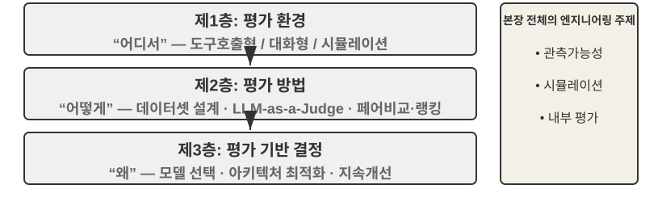
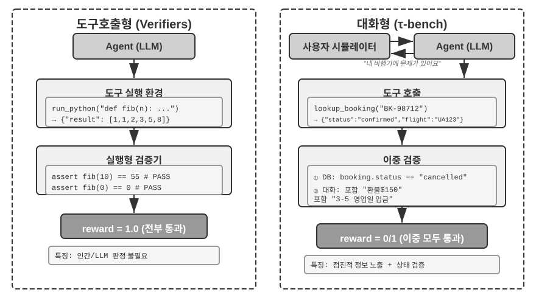
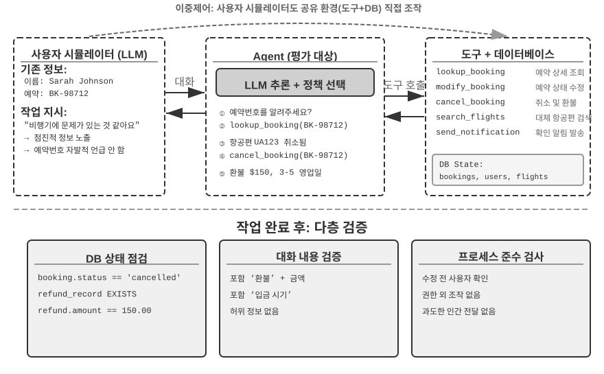
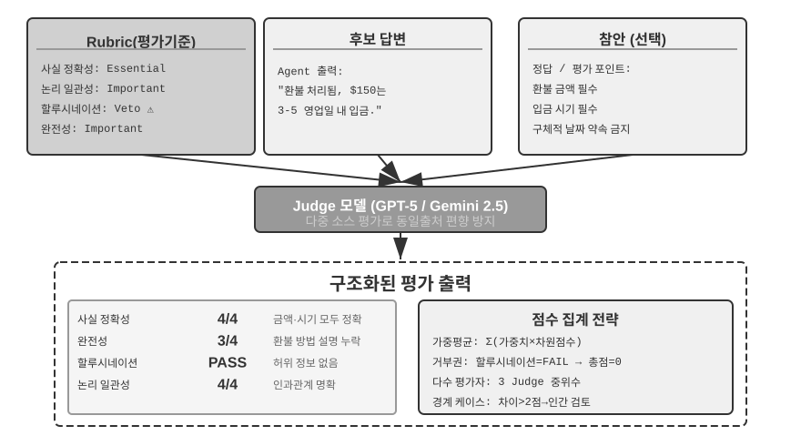
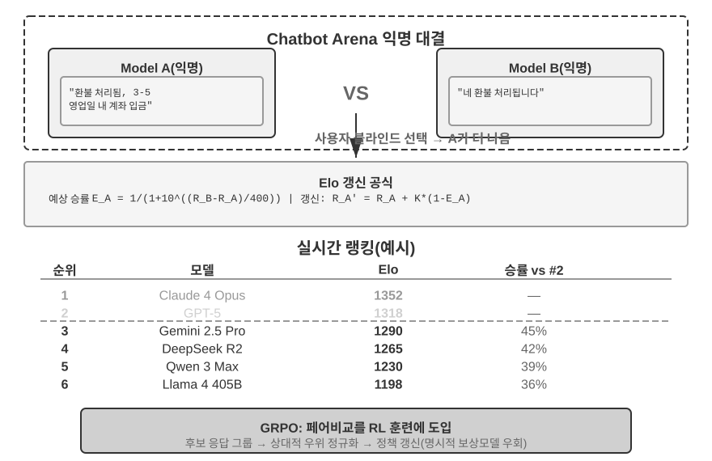
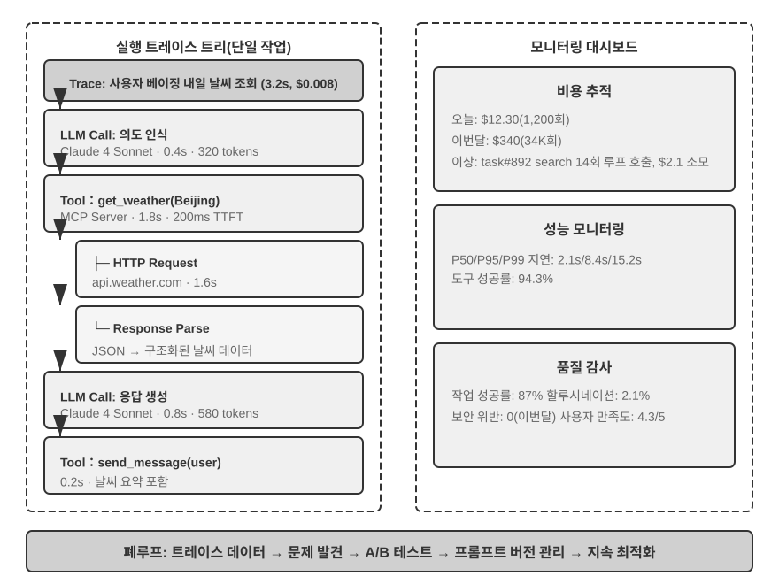
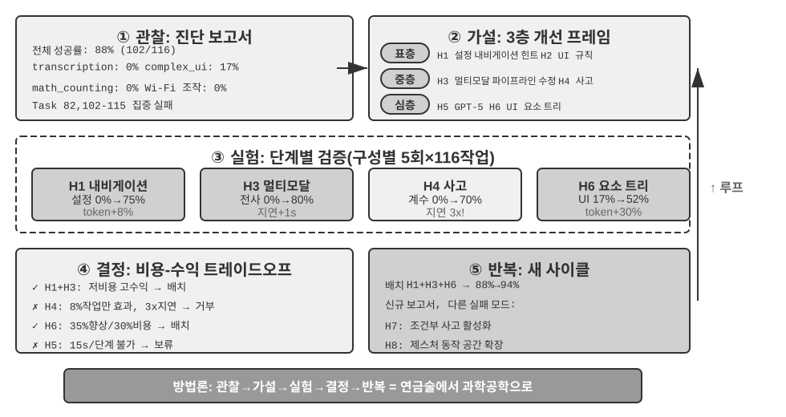
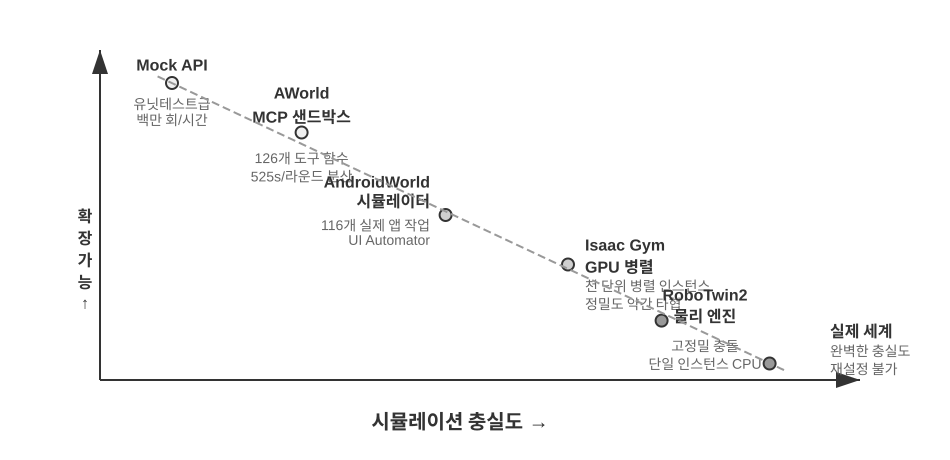
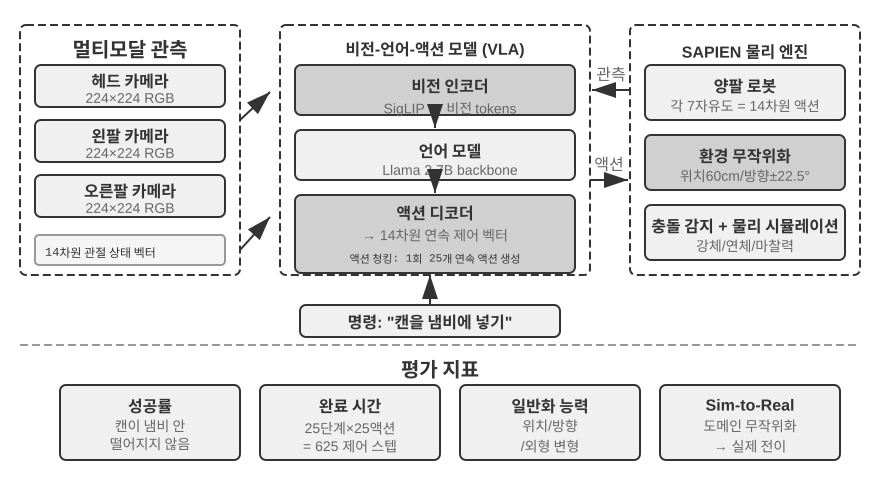

# 에이전트 평가

에이전트 시스템을 구축할 때 개발자는 수많은 설계 선택과 마주한다. 그리고 대부분은 정답이 뻔히 보이지 않는다.

- 어떤 모델을 쓸 것인가?
- 모델이 어떤 도구를 호출할 수 있게 할 것인가?
- 지식베이스에는 어떤 데이터를, 어떤 구조로 구축할 것인가?
- 사용자 기억은 어떻게 설계할 것인가?
- 모델의 프롬프트와 스킬(Skill)은 어떻게 구성할 것인가?
- 하네스(Harness)에는 어떤 제약을 추가해야 할 것인가?
- 이 에이전트의 자기 진화와 자기 반복(self-iteration)은 어떻게 구현할 것인가?

평가는 우리에게 과학적인 의사결정 근거를 제공한다. 체계적인 비교 실험(하나의 변수를 바꾸고 효과 변화를 관찰)과 제거 실험(ablation, 컴포넌트를 하나씩 꺼보며 전체 성능 변화를 관찰해 해당 컴포넌트의 실제 기여도를 판단)을 통해 진짜 능력 향상과 표면적인 변동을 구분하고, "깨는 소서판에 콩 담아 먹기"식 실수를 피하게 해 준다. 소프트웨어 공학에서 "측정하지 않으면 개선할 수 없다"는 말이 있듯, 재현 가능한 평가 체계를 세우지 않으면 에이전트의 반복 방향은 직감에 의존할 수밖에 없다.

1장에서 도입한 하네스 엔지니어링 관점에서 보면, 평가는 하네스 안에서 "검증" 기능의 핵심 역할을 맡는다. 핵심적인 인식 하나는 이렇다. **평가의 대상은 모델만이 아니라 모델과 하네스의 조합체 전체여야 한다.** 같은 모델이라도 하네스가 다르면 성능 차이가 극심할 수 있다. 일부 팀은 하네스 최적화만으로 동일한 모델의 터미널 유형 과제 성능을 유의미하게 끌어올렸다(5장 참조). 즉 에이전트가 평가에서 성적이 좋지 않다고 해서 개선 방향이 곧바로 모델 교체인 것은 아니며, 하네스의 어떤 컴포넌트(프롬프트, 도구 설계, 피드백 루프)를 최적화해야 할 수도 있다. 제대로 된 평가 체계라면 "모델 능력 부족"과 "하네스 설계 결함"이라는 본질적으로 다른 두 가지 문제를 구분할 수 있어야 한다. **이 둘을 구분하는 가장 흔한 수단이 모델 치환 실험(model swap)이다.** 하네스를 고정한 채 더 강한/더 약한 모델로만 바꿔 보고 점수 변동 폭을 관찰한다. 강한 모델로 바꿔도 점수가 오르지 않으면 병목은 하네스에 있다. 반대로 약한 모델로 바꿨을 때 점수가 크게 떨어지고 모델 능력에 따라 점수가 크게 흔들린다면, 가장 직접적인 해석은 병목이 모델 능력 자체에 있고 현재 성적이 주로 모델로 결정된다는 것이다(이것이 과제 자체가 어려워서인지, 아니면 하네스가 모델의 사전 지식에 과도하게 의존해서인지는 추가 분석이 필요하다). 주의할 점은 이 방법이 앞서 언급한 "제거 실험"과는 다른 방법이라는 것이다. 제거 실험은 **하네스의 특정 컴포넌트를 끄고** 전체 성능이 어떻게 변하는지를 보는 것이고, 모델 치환은 **하네스를 고정한 채 모델만 바꾸는** 것이다. 전자는 하네스 내부에서 어느 부품이 중요한지를 찾고, 후자는 병목이 모델에 있는지 하네스에 있는지를 가른다.

평가 체계의 가치는 모델이 빠르게 진화하는 시대에 더욱 돋보인다. 모델 능력은 여전히 빠르게 발전하지만, 새 모델이 공개 벤치마크에서 더 좋은 성적을 보인다고 해서 당신의 특정 과제에서도 더 좋다는 뜻은 아니다. 오히려 성능 퇴보(regression, 새 버전이 특정 측면에서 구버전보다 못한 현상)가 나타날 수도 있다. 자체 평가 데이터셋에서만 완전히 테스트해야 데이터 기반의 업그레이드 의사결정을 내릴 수 있다. 나아가, 제대로 된 평가 체계는 "미래의 모델을 위해 제품을 개발하는" 전략을 현실로 만든다. 현재 모델이 상용화 수준에 못 미쳐도, 먼저 제품 개발을 완료하고 평가셋을 구축해 두면 새 모델의 성적을 계속 추적하다가 문턱을 넘는 순간 바로 서비스에 올릴 수 있다.

> **이 장의 읽기 가이드**
>
> 이 장은 세 층위로 완전한 평가 체계를 구축한다. 첫 번째 층위는 **평가 환경**("어디서 측정할 것인가")이다. 자동화·재현 가능한 테스트 환경을 어떻게 구축하는지를 다루며, 도구 호출형과 인간-기기 상호작용형 두 가지 패러다임을 포함한다. 두 번째 층위는 **평가 방법**("어떻게 판정할 것인가")이다. 데이터셋 설계 원칙, 평가 지표 체계(무엇을 측정해야 하는가), LLM-as-a-Judge(대언어모델을 심판으로 사용) 자동 판정, 그리고 짝 비교(pairwise comparison)와 모델 순위 매기기까지 아울러 다룬다. 세 번째 층위는 **평가 주도의 의사결정**("측정해서 무엇에 쓸 것인가")이다. 평가 결과를 모델 선택, 아키텍처 최적화, 지속적 반복을 위한 행동 지침으로 바꾸고, 통계적 유의성을 빌려 관찰된 점수 차이가 진짜 신뢰할 수 있는지 판단한다. 또한 관측 가능성(observability)과 생산급 에이전트의 내부 평가 인프라도 다루고, 장 말미에서는 7장 후속 학습과 연결되는 시뮬레이션 환경을 소개한다.
>
> 장 전체를 관통하는 핵심 철학은 이렇다. **평가 체계의 제1 가치는 현재 시스템에 점수를 매기는 것이 아니라, 모델의 진화를 빠르고 신뢰성 있게 따라잡게 해 주는 데 있다.** 더 강하거나 더 저렴한 모델이 발표되었을 때, 제대로 된 평가 체계를 갖춘 팀은 몇 시간 안에 전환 의사결정을 내릴 수 있다. 반면 평가 체계가 없는 팀은 직감에 의존하거나 커뮤니티 반응을 기다릴 수밖에 없다. 경쟁이 치열한 에이전트 시장에서 이런 속도 차이가 승패를 가를 수 있다.



## 구체적인 평가 사례 하나

방법론으로 깊이 들어가기 전에, 완전한 예시 하나로 먼저 직관을 잡아 보자. 고객 서비스 에이전트를 구축했고, 이것이 환불 요청을 처리하는 능력을 평가해야 한다고 가정하자.

**테스트 케이스**: 사용자가 3일 전 주문한 주문(주문번호 #12345, 금액 ¥299)을 환불해 달라고 요청한다. 회사 정책: 7일 이내 전액 환불 가능.

**에이전트의 궤적**:

```
사용자: 3일 전에 산 이어폰 환불하고 싶어요, 주문번호 12345입니다. (오늘은 2026-04-10)

에이전트(사고): 사용자가 환불을 원한다. 먼저 주문 정보를 조회해야 한다.
에이전트 → 도구 호출 query_order(order_id="12345")
도구 반환: {status: "delivered", amount: 299, date: "2026-04-07", item: "블루투스 이어폰"}

에이전트(사고): 주문일 2026-04-07, 오늘 2026-04-10로부터 3일, 7일 환불 기간 안에 있으므로 전액 환불 조건을 만족한다.
에이전트 → 도구 호출 process_refund(order_id="12345", amount=299)
도구 반환: {refund_id: "R-98765", status: "processing", eta: "3-5 영업일"}

에이전트: 환불을 진행했습니다. 주문 #12345(블루투스 이어폰, ¥299)의 전액 환불이 처리 중이며,
          3-5 영업일 내에 입금될 예정입니다. 환불 번호 R-98765로 진행 상황을 조회할 수 있습니다.
```

**루브릭(Rubric) 채점**(네 차원, 각 차원 1-4점). 표 6-1은 이 고객 서비스 환불 과제의 채점 예시로, 루브릭이 에이전트 궤적 하나를 점검 가능한 평가 차원들로 어떻게 쪼개는지를 보여 준다.

표 6-1 고객 서비스 환불 과제의 루브릭 채점 예시

| 차원 | 기준 | 점수 | 사유 |
|--------------------|-----------------------------------|---------|-------------------------------|
| 조작 정확성 | 환불 금액과 주문번호가 맞는가 | 4 | ¥299 전액 환불을 정확히 조회하고 처리 |
| 정책 준수 | 7일 환불 정책을 따랐는가 | 4 | 주문이 환불 기간 안에 있고 정책에 부합 |
| 정보 완전성 | 금액, 입금 시기, 환불 번호를 안내했는가 | 4 | 세 가지 핵심 정보를 모두 안내 |
| 환각 탐지(기각 항목) | 존재하지 않는 정보를 지어냈는가 | 통과 | 모든 정보가 도구 반환 결과에서 비롯됨 |

환각을 단계별 점수 차원이 아니라 **기각 항목(veto)**으로 둔 이유는, 환각이 품질과 직교하기 때문이다. 유창하고 상세하고 정중한 답변이더라도 거짓 사실을 담고 있다면 사용자에게 주는 해는, 짧지만 정확한 답변보다 훨씬 크다. (기각 메커니즘의 일반적 설계는 뒤 "루브릭 네 가지 원칙"에서 다룬다.)

이 케이스는 통과했다. 하지만 좋은 평가는 성공 시나리오뿐 아니라 경계와 함정도 함께 측정한다. 사용자가 15일 전 주문(환불 기간 초과)을 환불하려 할 때 에이전트가 올바르게 거절할 수 있는가? 사용자가 "고객센터에서 환불 승인해 줬다"고 주장할 때 에이전트가 시스템 기록 없이 쉽게 믿지 않는가? 이런 경계 시나리오가 에이전트 능력의 고하를 가리는 핵심이다.

위의 흐름, 즉 테스트 케이스 정의 → 에이전트 실행 → 루브릭 채점 → 결과 분석은 평가의 기본 뼈대다. 이 장 뒷부분에서 각 단계의 설계 방법을 하나씩 펼쳐 나간다.

## 자동 평가 환경

에이전트 평가에는 개발 단계에서 변경 효과를 빠르게 테스트할 수 있는, 반복 실행 가능한 자동화 환경이 필요하다. 이런 환경을 구축하려면 세 가지 질문에 답해야 한다. 무엇을 평가할 것인가(과제 정의와 검증 기준), 누구를 상대로 평가할 것인가(에이전트의 상호작용 대상을 어떻게 시뮬레이션할 것인가), 어떤 기준으로 점수를 매길 것인가.

### 평가 환경의 기본 구성

평가 환경은 다섯 가지 요소로 구성된다. 이후 절에서 데이터셋 설계와 채점 기준 설계를 중점적으로 다룬다.

**데이터셋(Dataset)**은 과제 모음을 정의하며, 초기 상태, 목표 설명, 그리고 선택적으로 참조 해법을 포함한다.

**환경 상태(Environment State)**는 과제 실행 중 가변 정보를 관리하며, 사실성과 제어 가능성 사이의 균형을 잡아야 한다. 예컨대 고객 서비스 평가에서 환경 상태에는 데이터베이스의 주문 기록과 사용자 계정 잔액이 포함된다. 에이전트가 `process_refund`를 호출한 뒤 주문 상태는 'delivered'에서 'refunded'로 바뀌고 잔액이 증가한다. 이런 것이 "가변 정보"다. "사실성"은 상태 변화가 비즈니스 로직을 따르도록(환불액이 주문 금액을 넘지 않도록) 요구하고, "제어 가능성"은 매 테스트를 동일한 초기 상태로 재설정할 수 있도록 요구한다.

**도구 인터페이스(Tools)**는 에이전트가 수행할 수 있는 조작 모음을 정의한다. 도구는 지나치게 고수준의 추상(예: "사용자 문제 해결")을 제공해서는 안 되며, 원자적 조작(주문 조회, 예약 변경, 이메일 발송 등)을 제공해 에이전트가 계획과 사고를 통해 이 조작들을 조합하도록 유도해야 한다.

**채점 기준(Rubric, 평가 준칙)**은 에이전트의 성과를 정량화한다. 이원적(통과/실패), 연속적(0~100점), 다차원(정확성·효율·안전성을 각각 점수화)일 수 있다.

**실행 프로토콜(Interaction Protocol)**은 상호작용 방식과 종료 조건을 규정한다.



### 도구 호출형 평가 환경

코드 생성, 데이터 분석 등 주로 도구 사용에 의존하는 과제의 경우, Verifiers 프레임워크가 전형적인 설계 패턴을 보여 준다. 에이전트는 사전 정의된 도구를 호출해 과제를 수행하고, 검증은 실행 가능한 기준(테스트 통과 여부, 정답 일치 여부)에 기반하며, 사람의 주석이나 모델의 판정에 의존하지 않는다.

Verifiers는 계층화된 환경 설계를 도입했다. `SingleTurnEnv`는 단회 과제(간단한 질의응답 등)에 쓰이고, `ToolEnv`는 다회 도구 호출의 자율 루프를 지원하며, `StatefulToolEnv`와 `SandboxEnv`는 상태 유지 도구와 장시간 실행되는 샌드박스 환경(코드 실행 등)을 지원한다. 예컨대 `SingleTurnEnv`는 수학 문제를 하나 내고 바로 답을 검증하는 데 적합하고, `ToolEnv`는 여러 웹페이지를 검색한 뒤 종합 답을 내놓고 최종 결과를 검증하는 데 적합하다. `StatefulToolEnv`는 데이터베이스 레코드를 수정한 뒤 데이터베이스 상태 변화를 검증하는 데, `SandboxEnv`는 샌드박스에서 코드를 실행한 뒤 출력 파일을 점검하는 데 적합하다. 표 6-2는 이런 환경 유형들을 정리한 것으로, 과제 상태, 도구 호출, 격리 요구에 따라 적절한 평가 환경을 고를 수 있게 해 준다.

표 6-2 Verifiers 환경 유형 비교

| 환경 유형 | 상태 유지 | 도구 호출 | 전형적 사례 |
|---|---|---|---|
| SingleTurnEnv | 없음 | 없음 | 단회 질의응답, 수학 문제 |
| ToolEnv | 없음 | 다회 | 검색 + 정보 종합 |
| StatefulToolEnv | 있음 | 다회 | 데이터베이스 레코드 수정 |
| SandboxEnv | 있음 + 격리 | 다회 | 코드 실행과 테스트 |

프레임워크는 병렬 샘플링과 궤적 캐싱을 지원한다. 매 평가의 전체 궤적(관측·행동·보상)이 저장되어 사후 분석과 재생에 활용된다.

환경은 또한 조작의 상태 의존성을 처리해야 한다. 도구의 실행 효과는 현재 상태에 따라 달라지며, 실패할 때 단순한 실패 플래그 대신 명확한 오류 메시지를 제공해야 에이전트가 오류로부터 학습하고 전략을 조정할 수 있다.

### 인간-기기 상호작용형 평가 환경

현실의 많은 과제는 도구 호출뿐 아니라 인간 사용자와의 대화도 필요로 한다. 고객 서비스 에이전트는 모호한 표현을 이해하고, 요구를 명확히 하고, 백엔드 시스템을 조회하고, 사용자에게 정보를 확인해야 한다. 이런 과제의 평가는 근본적인 도전에 직면한다. 자동화 환경에서 실제 사용자를 어떻게 시뮬레이션할 것인가?

핵심 설계 원칙은 **점진적 정보 노출(Progressive Information Disclosure)**이며, 이것이 인간-기기 상호작용형 평가와 전통적 벤치마크(benchmark)를 가르는 근본적 차이다. 대부분의 벤치마크는 처음에 완전한 요구를 한꺼번에 내놓지만, 현실에서 사용자가 처음부터 요구를 또렷하게 설명하는 일은 드물다. 그들은 흔히 "제 비행기에 문제가 생긴 것 같아요", "인터넷이 안 잡혀요" 정도만 말한다. 에이전트는 능동적으로 질문하여 요구를 명확히 해야 하며, 이 과정 자체가 능력의 중요한 표현이다. 따라서 평가에서 **결코 처음에 시뮬레이션 사용자의 모든 정보를 에이전트에게 노출해서는 안 된다.** 정보는 필요에 따라, 점진적으로 대화 속에서 드러나야 한다.

τ-bench의 해법은 **사용자 시뮬레이션(User Simulation)**이다. 또 하나의 LLM이 사용자 역할을 맡아 사전 정의된 지시에 따라 에이전트와 대화한다. 시뮬레이션 사용자는 과제 지시(예: "내일 비행기를 취소해야 합니다")를 받아 대화 속에서 필요한 정보를 점진적으로 에이전트에게 넘겨 주고, 질문에 응답하며, 과제가 끝나면 종료 신호를 보낸다. 프롬프트는 시뮬레이션 사용자에게 "모든 정보를 한 번에 알려 주지 말고, 현재 단계에서 필요한 내용만 제공할 것", "지시에 없는 정보를 지어내지 말 것"을 요구한다. 사용자 시뮬레이션의 설계는 사실성과 제어 가능성 사이에서 저울질해야 한다. 행동은 실제 사용자에 가까워야(표현이 모호하고, 정보가 불완전하며, 가끔 감정 기복이 있어야) 하면서도, 재현성을 위해 일정한 대본을 따라야 한다.

다음은 점진적 정보 노출의 다회 대화 예시다(사용자 시뮬레이터가 고정 대본을 따라 행동한다).

> **사용자**: "제 비행기에 문제가 있어요."
> **에이전트**: "어느 항공편인가요?"
> **사용자**(대본에 따라 노출): "Delta 123, 내일 아침 샌프란시스코에서 뉴욕으로 가는 거요."
> **에이전트**: "구체적으로 무슨 문제인가요?"
> **사용자**(대본에 따라 노출): "비행 시간이 너무 길어서, 환승하고 싶어요."
> **에이전트**: "새 항공편에 대한 선호가 있나요?"
> **사용자**(대본에 따라 노출): "오후 항공편이면 다 괜찮아요."

사용자 시뮬레이터는 고정 대본(알려진 정보 + 노출 규칙)을 따라 평가의 재현성을 보장하면서도 실제 사용자의 점진적 표현 방식을 모방한다.

τ-bench는 구조화된 비즈니스 프로세스(항공 고객 서비스, 소매 고객 서비스 등)에서의 에이전트 성적을 측정하는 벤치마크다. 검증은 컴포넌트 수준에서 다차원으로 이루어진다. 한편으로 데이터베이스 최종 상태가 올바른지(예: 예약 레코드 상태가 "취소됨"으로 바뀌었는지) 검사하고, 다른 한편으로 에이전트가 대화에서 필수적인 핵심 정보(환불 금액과 입금 시기 등, 특정 문자열이나 패턴 검색으로 검증)를 출력했는지 확인한다. 이런 이중 검증은 조작 정확성과 소통 유효성을 동시에 본다. 다만 과제 수준에서 이 검사들은 최종적으로 **0 또는 1의 이원적 보상**으로 합쳐진다. 모든 검사가 전부 통과해야 1점이고 어느 하나라도 통과하지 못하면 0점이다. 이원 보상은 Pass^k 같은 신뢰성 지표(뒤 "평가 지표 체계" 참조)를 계산하기엔 편하지만, 대가로 "조작은 정확한데 비핵심 필드를 하나 빠뜨린 경우"와 "완전히 실패한 경우"가 같은 점수를 받게 만든다.

개선판 **τ²-bench**의 핵심 증분은 채점 단위가 아니라 두 가지에 있다. 하나는 **이중 제어 환경(Dual-Control)**이다. 더 이상 에이전트 측만 도구를 호출하는 게 아니라, 사용자 시뮬레이터도 같은 공유 환경을 조작할 수 있다(예: 에이전트가 사용자에게 비행 모드 전환을 안내하면 사용자의 조작이 실제로 환경 상태를 바꾼다). 이는 기술 지원처럼 사용자의 손 조작이 필요한 실제 시나리오에 더 가깝다. 다른 하나는 **더 정밀한 과제 명세와 조합형 과제 생성**이다. 성공 조건의 모호성이 줄었고, 구체적 과제 인스턴스를 매개변수로 대량 생성할 수 있다(상세 검증 차원은 뒤 "검증 가능성과 객관성 보장" 절 참조).

> **실험 6-1 ★: τ²-bench 실행과 τ-bench 대비 진화 비교**
>
> 이 실험은 τ²-bench 평가 프레임워크를 실행해 보며, 인간-기기 상호작용형 평가 환경의 설계 요점을 이해하고, τ-bench와 τ²-bench의 차이를 대비해 평가 데이터셋이 어떻게 반복 개선되는지 체감한다.
>
> 과제 정의 파일을 깊이 읽어 본다. 각 과제는 알려진 정보(사용자의 배경 지식), 과제 지시(점진적 정보 노출 방법과 응답 전략을 안내), 성공 조건(데이터베이스 목표 상태와 대화에서 반드시 등장해야 할 확인 정보)을 포함한다. 전체 평가 흐름을 실행해 사용자 시뮬레이터와 에이전트의 다회 대화를 관찰하고, 전형적 실패 패턴(정책 위반, 정보 누락, 과도한 사람 전환 등)을 분석한다.
>
>
> 
>
>
> τ-bench와 τ²-bench의 설계 차이를 비교해 본다. τ-bench 초기 버전은 사용자 지시가 지나치게 단순했고(에이전트가 정답을 추측할 수 있음), 성공 조건이 충분히 정밀하지 않았고(오판 유발), 사용자 시뮬레이터가 너무 기계적이었다. τ²-bench는 이런 문제들을 체계적으로 개선했다.
>
> - **더 상세한 과제 지시 도입**: "사실 기반 요건(Grounding)" 즉 환경의 실제 상태에 기반해 답해야 한다는 요구를 포함
> - **더 정밀한 평가 기준**: 예컨대 "속도 테스트가 excellent를 반환해야 해결로 인정"
> - **더 사실적인 사용자 시뮬레이터 행동 규범**: 점진적 정보 노출, 자연스러운 감정 기복
>
> 특히 τ²-bench에 새로 추가된 telecom 도메인 과제에 주목해, 그 이중 제어 환경 설계(앞서 설명한 대로 사용자와 에이전트가 동일 공유 환경을 함께 조작)를 이해한다.
>

도구 호출형 평가가 "관측 가능한 상태 변화를 완수했는가"에 초점을 맞춘다면, 인간-기기 상호작용형 평가는 "사용자가 인지적·의사결정적 변화를 이끌어냈는가"에 주목한다. 전자는 에이전트의 행동 정확성을, 후자는 소통 전략의 합리성을 본다.

평가 환경의 구축은 시뮬레이션 환경 설계와도 연관된다. 평가 환경이 대규모 반복 상호작용을 지원해야 할 때면 시뮬레이션 환경으로 진화하며, 이 장 말미에서 간단히 다룬다.

## 평가 과제 데이터셋의 설계

평가 환경이 "무대"라면 데이터셋은 "대본"이다. 대본의 설계 품질이 무대 자체보다 평가의 가치를 더 좌우하는 경우가 많다. 엉망으로 설계된 데이터셋은 완벽한 환경에서 굴려도 얻는 건 노이즈뿐이다. 이 절에서는 GAIA, AndroidWorld, SWE-Bench Verified(Software Engineering Benchmark, 소프트웨어 공학 벤치마크), τ-bench와 τ²-bench, Terminal-Bench, OSWorld와 OSWorld-Verified 등 벤치마크의 설계 실천에서 반복적으로 검증된 몇 가지 원칙을 뽑아 낸다.

이 목록이 에이전트 평가의 지형을 모두 담은 건 아니다. 웹/GUI 계열만 해도 각기 초점이 다른 벤치마크가 여럿 있다. WebArena는 완전히 재현 가능한 웹사이트(전자상거래, 포럼, 코드 호스팅 등)를 자체 구축해 "실제 웹페이지"의 불통제성을 샌드박스 안에 가둔다. Mind2Web은 정반대로 수백 개의 실제 웹사이트에서 일반화 능력을 직접 테스트한다. BrowseComp은 깊은 검색에 특화한다. 정답이 깊숙이 숨어 있어 다회 탐색과 교차 검증이 있어야 찾을 수 있다. 도구 호출 차원에는 BFCL(Berkeley Function-Calling Leaderboard) 같은 전용 함수 호출 리더보드도 있다. 이 장은 모든 벤치마크를 열거하려는 게 아니라, 두 가지 핵심 환경 패러다임(도구 호출형, 인간-기기 상호작용형)에 더해 데이터셋 사례를 관통하는 GUI 조작 장면을 덧붙여 그 설계 트레이드오프를 깊이 파헤친다. 패러다임을 이해하면 어떤 새 벤치마크를 만나도 그것이 무엇을 측정하는지, 누출 방지는 어떻게 했는지, 결론을 어디까지 외삽할 수 있는지 빠르게 판단할 수 있다.

> **실험 6-2 ★: 벤치마크 과제 직접 수행**
>
> GAIA, AndroidWorld, SWE-Bench Verified, τ²-bench, Terminal-Bench, OSWorld-Verified에서 각각 과제를 골라 직접 완수해 본다. 각 데이터셋마다 쉬움·보통·어려움을 하나씩 완료하길 권한다. "어려움" 단계는 사람에게도 도전적이다. 실행 결과를 정답과 대비해 차이의 원인을 분석한다. 직접 체험하며 깨닫게 된다. 과제 설명은 명확성과 개방성의 균형을 잡아야 하고, 검증 기준은 객관적이고 실행 가능해야 하며, 과제 난이도의 위계화는 서로 다른 능력 수준을 구분할 수 있어야 한다는 것을.
>

### 과제 데이터셋 설계의 핵심 도전

**도전 하나: 명확성과 개방성의 긴장.** 과제 설명은 평가의 재현성을 위해 충분히 명확해야 하지만, 너무 경직되면 에이전트의 창의성을 제한한다. GAIA가 하나의 모범 사례를 제공한다. "개념은 단순"하지만 "구현 경로는 개방적"인 과제. 예컨대 NASA의 매일 천문 사진에서 우주비행사 정보를 찾는 과제는 목표가 명확하다(특정 우주비행사와 우주 체류 시간 찾기). 하지만 어떻게 검색·선별·검증할지는 전적으로 에이전트의 자율 결정에 맡긴다.

**도전 둘: 사실성과 제어 가능성의 균형.** 현실 과제는 불확실성과 노이즈를 담고 있어 견고성이 드러나지만, 재현성을 위협한다. SWE-Bench 초기 버전은 GitHub 실제 이슈에서 직접 가져와 사실성을 확보했지만, 과제 설명이 모호하고 테스트 케이스가 불완전하며 평가 기준이 주관적이라는 문제도 안고 있었다. SWE-Bench Verified는 인간 전문가를 투입해 체계적 검증을 수행해, 그 중 문제가 명확하고 테스트가 충분하며 해법이 분명한 500개의 고품질 과제를 선별했다. 사실성을 유지하면서 제어 가능성을 크게 높인 것이다.

**도전 셋: 다양성과 체계성의 조율.** 효과적인 데이터셋은 전형적 상황, 경계 조건, 오류 함정을 두루 덮으면서도 체계적 조직 방식을 갖춰야 평가 결과가 구체적 능력 결손을 진단할 수 있다. AndroidWorld의 116개 과제는 20개의 실제 앱에 걸쳐 있으며, 각 과제는 필요한 핵심 능력(다단계 계획, 시각 이해, 시간 추론)으로 태깅되어 있다. 그래서 평가 결과가 단순한 전체 성공률을 넘어 특정 능력 차원의 강약도 드러낸다. 더 중요한 건, 매개변수화 메커니즘을 통해 거의 무한한 과제 변형을 생성할 수 있다는 점이다.

**도전 넷: 평가 비용과 커버리지.** 복잡한 에이전트 과제는 완수에 수분에서 수시간이 걸릴 수 있고, 많은 토큰을 소모한다. 데이터셋 규모는 포괄성과 경제성 사이의 균형을 잡아야 한다. GAIA는 466문제를 정선해 세 단계 난이도로 나눴고, 여러 능력 차원을 덮으면서도 합리적 비용으로 평가를 마칠 수 있다. SWE-Bench Verified는 2294문제에서 500문제로 선별했다(비용 약 4/5 감소, 더 엄격한 품질 기준으로 신호 대 잡음비 향상).

**도전 다섯: 데이터 누출(Data Contamination) 방지.** 대언어모델 시대에 데이터 누출은 평가가 마주한 심각한 도전이다. 평가 데이터가 학습 데이터에 편입되면 평가는 일반화 능력이 아니라 기억력을 측정한다. 마치 시험 전에 정답을 통째로 외워 버린 것과 같아서, 아무리 좋은 성적도 진짜 수준을 말해 주지 않는다. 각 벤치마크는 서로 다른 방어 전략을 취한다. GAIA는 정답의 고유성에 기댄다. 문제가 여러 정보원을 조합해야 답할 수 있고, 일부 과제는 인터넷에 존재하지 않는 전용 첨부 파일(PDF/오디오/이미지)을 동반해 단일 웹페이지에서 정답을 바로 얻을 수 없다. SWE-Bench Verified 자체는 OpenAI가 원본 SWE-Bench에서 인공 품질 선별을 거쳐 얻은 500문제 부분집합으로, 시간 차원의 누출 방지 설계는 들어 있지 않다. 정말로 시간 신선도로 누출을 방지하는 건 SWE-bench-Live 같은 후속 작업이다. 이들은 모델 학습 마감일 이후에 새로 생성된 이슈를 지속적으로 수록해 평가가 늘 모델 학습 코퍼스보다 한발 앞서게 한다. τ²-bench는 동적 매개변수 생성으로 방어한다. 구체적 과제 인스턴스(사용자 이름, 주문번호, 날짜 등)를 매번 무작위로 생성한다. AndroidWorld의 매개변수화 과제 생성은 검증이 조작 시퀀스가 아니라 최종 UI 상태에 기반하기 때문에 자연스럽게 누출 방지 능력을 갖는다. Terminal-Bench는 카나리아 식별자(canary GUID, 전역 고유 식별자, 일종의 고유 추적 표식)를 삽입해 누출을 탐지 가능하게 만든다. 모델이 해당 GUID를 포함한 출력을 낼 수 있다면 벤치마크 데이터가 학습셋으로 누출된 것이다.

### 과제 설명의 정밀성 설계

GAIA는 명확한 정보원 제약, 시간 범위, 주제, 질의 목표를 통해 정답의 유일성을 보장한다. 예컨대 Level 3 과제는 특정 날짜의 NASA 사진에서 출발해 시각 이해로 우주비행사를 식별하고, 소속 우주비행사 그룹을 조회하고, 우주 체류 시간을 계산해 정확한 형식으로 출력한다("성, 세미콜론 구분, 천 단위 구분자"). 모든 디테일이 자동 검증을 위해 존재한다. 형식과 내용이 완전히 일치할 때만 통과다.

τ²-bench는 상황화 설계를 도입했다. 각 과제는 여러 층의 정보를 담는다. 표면적 문제("모바일 데이터가 안 돼요"), 성능 기대("절대로 탁월한 속도 원함"), 제약 조건("다른 속도는 받아들이지 않음"), 그리고 함축된 감정. 핵심 개선은 "알려진 정보"와 "과제 지시"의 분리다. 알려진 정보는 사용자가 현재 알고 있는 사실이고, 과제 지시는 시뮬레이터가 정보를 어떻게 점진적으로 노출할지를 안내한다. 여기에는 "사실 기반 요건(Grounding Requirement, 도구 호출의 실제 반환 결과에 기반해 답해야 하며 지어내면 안 된다는 요구)"이 포함된다.

SWE-Bench Verified는 문제 설명, 재현 단계, 기대/실제 동작 등 구조화된 필드를 포함한다. 주석자는 설명과 테스트 케이스의 일치성을 검증한다. Terminal-Bench의 과제 설명에서 모든 요소는 기계적으로 검증 가능하다. 파일 경로 존재 여부, 권한 수치, 인증서 매개변수, 날짜 형식 등. 예컨대 "build-linux-kernel-qemu"는 리눅스 커널 6.9를 소스에서 빌드하고, `start_kernel`에 사용자 정의 printk를 추가하고, initramfs를 생성해 QEMU에서 실행하라고 요구한다. 성공 기준은 부트 로그에 사용자 정의 메시지가 등장하는 것이다. 에이전트는 출력을 위조해 빠져나갈 수 없고, 전체 흐름을 진짜로 완수해야 한다.

AndroidWorld은 **매개변수화 템플릿** 설계를 채택한다. 하나의 과제는 정적 텍스트가 아니라 동적으로 인스턴스화할 수 있는 템플릿이다(예: "연락처 `[CONTACT_NAME]`의 전화번호를 `[NEW_PHONE]`로 변경"). 매 평가마다 서로 다른 매개변수 값을 무작위로 생성한다. 장점은 셋이다.

- **암기 방지**: 매번 매개변수 값이 달라 고정된 조작 시퀀스를 재생할 수 없다
- **데이터 다양성 증가**: 하나의 템플릿에서 거의 무한한 인스턴스 생성
- **비교 실험 지원**: 일부 매개변수만 고정하고 다른 매개변수를 변화시켜 특정 요인의 효과를 정밀 측정

검증은 조작 시퀀스가 아니라 최종 UI 상태(예: 전화번호 필드가 기대 값을 포함하는가)에 기반한다.

OSWorld의 과제는 흔히 "깨끗한" 초기 상태에서 출발하지 않고, 정교하게 구성된 중간 상태에서 시작해 실제 사용 scenario에 더 가깝다. 과제 설명은 다해법성을 처리해야 한다(예: "배경을 보라색으로"는 구체적 색상 코드를 제공해 모호성을 제거, "두 CSV 합치기"는 단일 헤더 유지/이중 헤더 등 모든 합리적 방식을 수용)하고 환경 불확실성도 다뤄야 한다(웹사이트 안봇, 앱 UI 진화, 시간 경쟁 조건. OSWorld-Verified는 오프라인 페이지 스냅샷, 의존성 버전 고정, 명시적 대기 조건 등의 메커니즘으로 완화한다).

### 과제 복잡도의 위계화 설계

GAIA는 세 단계 난이도를 설계했다. Level 1은 도구 1-2개면 충분(인간 93.9% vs GPT-4 30.3%), Level 2는 다단계 사고 필요(91.8% vs 9.7%), Level 3은 복잡한 조합 필요(87.3% vs 0%). 위계화 설계의 진단 가치는 이렇다. Level 1 실패는 기초적 도구 사용 문제를, Level 2는 다단계 계획과 정보 통합을, Level 3은 장기 시퀀스 사고와 복잡성 관리를 가리킨다. 각 층위가 서로 다른 개선 방향(프롬프트 엔지니어링 vs 계획 메커니즘 vs 계층적 아키텍처/후속 학습)에 대응한다.

τ²-bench는 비즈니스 복잡도로 위계를 나눈다. 단순한 정보 조회에서, 다회 프로세스(항공권 변경은 조회, 대안 제시, 확인, 차액 계산, 결제를 필요로 함), 장애 진단(여러 가능한 원인을 체계적으로 점검하고복구를 검증), 끝으로 정책 판단(정책에 부합하지 않는 요청 처리)까지.

Terminal-Bench는 기술 도메인×조작 복잡도 이중 차원으로 위계를 나눈다. 그 과제 레지스트리에는 200여 개의 과제가 등록되어 있다(버전마다 핵심 평가셋 규모는 다르고, 2.0 버전은 커뮤니티 기여에서 89개 고품질 과제를 정선). 간단한 mlflow 모델 등록부터, 중간 난이도의 7z 암호 해독, 어려운 git 서버+웹서버 다컴포넌트 통합, 가장 어려운 FEAL 차분 암호 해석(암호학 지식+알고리즘 최적화로 30초 시간 제약을 만족해야)까지 아울렀다.

### 검증 가능성과 객관성 보장

GAIA의 답은 간결하고 명확하다. 엄격한 형식 규정 덕분에 검증은 정확한 문자열 매칭으로 끝나며, 이원 결과(일치/불일치)가 객관적 재현성을 보장한다. 답의 희소성도 부정행위 방지 역할을 한다. 지극히 구체적인 사실은 학습 데이터에 그대로 등장하기 어렵다.

SWE-Bench Verified는 코드의 실행 가능성으로 검증한다. FAIL_TO_PASS(수정 전 실패, 수정 후 통과, 문제가 해결되었음을 증명)와 PASS_TO_PASS(수정 전후 모두 통과, 새로운 버그가 도입되지 않았음을 증명)를 구분해 이중 검증을 구현한다. Verified 버전은 또 테스트 자체의 품질이 신뢰할 만한지, 때로 통과하고 때로 실패하는 불안정한 테스트(flaky tests)가 없는지도 보장한다.

τ²-bench의 검증 체계는 다층 검사를 포함한다(각 층의 검사 결과는 과제 수준에서 여전히 이원 보상으로 합쳐지며, 모두 통과해야 성공).

- **데이터베이스 상태 검사**: 예약 레코드 상태, 환불 레코드 생성 여부
- **대화 내용 키워드 검색**: 환불 금액과 입금 시기를 사용자에게 확인했는가
- **프로세스 준수**: 도구 호출 시퀀스 분석, 예컨대 주문 수정 전 사용자의 명시적 확인을 받았는가

τ²-bench의 이중 제어 환경(앞선 "인간-기기 상호작용형 평가 환경" 참조)은 검증 차원에서도 한 층을 더 갖는다. 사용자 시뮬레이터가 실제 환경 상태를 바꾼 뒤, 에이전트는 도구 호출로 그 변화를 관측하고 그에 따라 계속 조사해야 한다. 검증은 따라서 "에이전트가 사용자 측의 조작 결과를 정말로 읽어냈는가"까지 덮는다.

OSWorld에는 134개의 독립적 평가 함수가 딸려 있고, 이들은 완전한 OS 접근 권한을 가져 파일 시스템 구조, 프로세스 상태, 네트워크 연결, 앱 내부 상태까지 깊이 검사할 수 있다. 예컨대 데이터베이스 조작 과제에서 평가 스크립트는 보고서 파일이 존재하는지만 확인하지 않고, 데이터베이스에 직접 연결해 SQL이 올바르게 실행되었는지 검사한다. 브라우저 과제에서는 DOM 트리를 분석하고, cookie/localStorage를 점검하고, 백엔드에 검증 요청을 보내 양식이 실제로 효과를 발휘했는지 확인한다. 이런 깊은 검사는 "겉보기엔 완료했지만 실질적으로는 틀린" 경우를 발견하게 해 준다. 예를 들면 에이전트가 제출 버튼을 클릭했지만 필드 작성 오류로 서버에서 거부된 경우 등.

Terminal-Bench는 Docker 컨테이너로 표준화된 환경을 바탕으로, 파일 시스템 상태 검사(경로 존재 여부, 권한 수치, 내용 형식)와 프로그램 실행 기능 검증(build-linux-kernel-qemu에서 실제로 QEMU를 부팅해 사용자 정의 printk 메시지를 검색)을 결합하며, 카나리아 GUID로 누출 추적이 가능하다.

### 과제 분포의 체계적 설계

과제 분포는 능력 차원, 난이도 차원, 시나리오 차원, 경계 상황을 체계적으로 덮어야 한다. GAIA는 범용성을 추구한다. 대부분의 과제는 추론, 다중 모달, 브라우징, 도구 사용의 조합을 필요로 한다. τ²-bench는 일부러 "함정 과제"를 설계한다. 예컨대 사용자가 "고객센터에서 취소를 승인해 주었다"고 주장하지만 실제로는 정책에 부합하지 않는 경우로, 압박과 오정보 앞에서도 에이전트가 올바른 판단을 유지하는지 테스트한다. OSWorld는 조작 유형(파일 IO / 데스크톱 앱 / 웹 앱 / 크로스 앱 흐름)과 앱 도메인의 이중 차원 매트릭스를 바탕으로, 세 개의 운영체제에 걸쳐 설계되었다(연구에 따르면 크로스 OS 능력은 강하게 상관되어, 한 시스템에서 학습한 능력이 다른 시스템으로 전이될 수 있다). Terminal-Bench는 "크로스 기술 스택 조합 과제"를 포함해 시스템적 사고를 테스트한다(예: 데이터 처리 + 파일 조작 + Python 프로젝트를 결합한 리샤딩 과제).

### 데이터 품질 통제와 반복 개선

SWE-Bench Verified는 품질 통제의 모범 사례다. OpenAI는 원래 2294개 과제에서 무작위로 1699개를 추출해 인공 평가를 진행했다. Python에 능통한 개발자 93명을 모집했다. 주석자는 여러 검사를 마쳐야 했다. 문제 설명이 명확한가(무엇을 해결해야 할지 이해할 수 있는가), 테스트 케이스가 완전한가(모든 측면과 경계 조건을 덮는가), 테스트가 안정적인가(환경이나 무작위성으로 인한 flaky test가 없는가), 패치가 올바른가(새로운 오류를 도입하지 않았는가), 난이도가 합리적인가. 엄격한 선별 끝에 최종 500개만 통과했다(29%). 이런 높은 탈락률은 평가 품질에 대한 필수 투자다. 그들은 또 표준화된 주석 지침을 세워, 각 검사 항목마다 구체적 기준과 예시를 정의해 주석자 간 일관성을 확보했다.

τ²-bench는 "알려진 정보"/"과제 지시" 분리(시뮬레이터 행동을 더 사실적으로)와 더 엄격한 완료 조건(예: "excellent여야 해결로 인정, poor/fair/good은 받아들이지 않음")을 도입해 "대충 때우는 식의 수리"를 방지한다.

OSWorld-Verified는 반복 개선의 모범 사례다. OSWorld는 2024년 4월 발표 후 신속히 다중 모달 에이전트 평가의 주요 벤치마크가 되었지만, 15개월간의 폭넓은 사용에서 300개가 넘는 문제가 드러났다. 이 문제들은 네 부류로 나뉜다. 환경 문제(웹사이트 안봇/CAPTCHA/동적 콘텐츠 변화), 과제 설명 문제(모호한 표현), 검증 논리 문제(지나치게 엄격하거나 느슨함), 초기 상태 문제(구성 불완전). 홍콩 대학 팀이 약 10명 규모의 소조를 꾸려, MoonShot AI, OpenAI, ByteDance Seed TARS, Anthropic, Simular 등과 두 달간 깊이 협력해 체계적 수리를 진행했다. 각 부류의 문제에 대응하는 수리 전략을 세웠다. 환경 문제는 버전 고정과 오프라인 백업으로, 과제 설명은 모호한 표현을 다시 써 제거, 검증 논리는 인공으로 올바른 기준선을 세우고 조건을 조정해 균형, 초기 상태는 완전성 검증을 추가해 강화.

평가 인프라 역시 로컬 VM에서 AWS 클라우드 플랫폼으로 옮겨 갔다. 탄력적 확장으로 50배 병렬 가속을 이뤘고(10여 시간에서 수 분으로 단축), Google Drive 과제 초기화 성공률을 50%에서 95% 이상으로 끌어올렸다. 모든 공식 평가 궤적 데이터는 HuggingFace에 공개되어, 커뮤니티가 모든 디테일을 심사하고 결과를 재현하고 문제를 발견해 지속적 개선의 선순환을 형성한다.

한 가지 덧붙일 게 있다. 평가 환경과 후속 학습 환경은 흔히 같은 뿌리에서 나온다. 잘 설계된 평가 환경 하나는 약간의 개조만 거치면 훈련 환경이 된다. SWE-Gym이 SWE-bench 기반으로 훈련 과제를 구축한 대표적 사례이고, τ²-bench와 AndroidWorld의 매개변수 템플릿은 대량의 훈련 인스턴스를대량으로 생성할 수 있다. 하지만 한 가닥 붉은 선은 그어야 한다. 재사용할 수 있는 건 **환경의 구성 메커니즘**이다. 평가셋 자체의 구체적 문제들은 반드시 학습 데이터와 엄격히 격리해야 한다. 평가 문제가 학습셋으로 들어가는 순간 측정하는 건 능력이 아니라 기억이 된다(7장 참조).

## 평가 지표 체계

"어떤 과제에서 평가할 것인가"를 정한 뒤에도 "어떤 차원을 측정해야 하는가"라는 질문에 답해야 한다. 이 절에서는 에이전트 평가에 자주 쓰이는 지표들을 찾아보기 좋은 "지표 사전"으로 모아 정리한다. 과정에서 결과까지, 품질에서 안전까지, 하나하나 정의와 적용 scenario를 부여한다. 앞선 절(τ-bench 절 등)에서 반복적으로 등장한 Pass@k, Pass^k 등 지표의 정확한 정의도 여기서 제시한다.

**과정 지표: 블랙박스에서 화이트박스로.**

최종 결과에만 주목하는 건 충분하지 않다. 에이전트가 결과에 도달하는 과정도 못지않게 중요하다. **행동 적법률**은 조작 중 유효하고 합법적인 비율을 잰다. 무효 조작에는 존재하지 않는 도구 호출, 잘못된 매개변수 유형 전달이 포함되고, 권한 초과 조작은 권한 범위를 넘는 행동을 말한다. 높은 적법률은 에이전트가 도구 생태를 또렷이 이해하고 있음을 보여 준다. **도구 호출 정확률**은 더 나아가 매개변수가 의미론적으로 합리적일 것을 요구한다. 검색 도구의 질의어는 요구를 정확히 표현해야 하고, 파일 조작의 경로는 올바른 대상을 가리켜야 한다.

**경로 효율**은 과제 완수의 경제성을 잰다. 단계 수(사고-행동-관측 루프 횟수), 중복 행동(같은 키워드 반복 검색, 같은 파일 반복 읽기), 후퇴 횟수(오류를 깨닫고 수정하는 빈도. 가끔 후퇴하는 건 정상이지만 빈번한 후퇴는 전망적 계획 부족을 가리킨다). "합리적 단계 수"를 정의하려면 인간 전문가나 휴리스틱 알고리즘의 기준선이 필요하다.

**검색 커버리지**는 정보 수집 유형 과제에 해당한다. 에이전트가 정보 공간을 충분히 탐색했는가? 검색 결과 첫 페이지만 보고 성급히 결론을 내리지 않았는가? **비용과 지연**은 요청 횟수, 토큰 지출(입력/출력 비용 구분 필요, KV Cache 재use 고려), 벽시계 시간(모델 추론 + 도구 실행 + 네트워크 지연 포함)을 주목하며, 병목을 위치시키기 위해 시간 분포를 추적해야 한다.

**결과 및 품질 지표.**

**과제 성공률**은 가장 직접적인 하드 지표로, 위계화 기준을 설계할 수 있다(핵심 목표는 반드시 달성, 부차적 목표는 품질 점수에 영향). 통계 방식에서 자주 혼동되는 두 지표를 구분해야 한다.

- **Pass@k**: k회 시도 중 **적어도 한 번** 성공할 확률. "에이전트가 해 낼 수 있는가"를 답한다
- **Pass^k**: k회 시도가 **모두** 성공할 확률. "에이전트가 안정적으로 신뢰할 수 있는가"를 답한다
- **Best@k**: k회 시도 중 **가장 좋은 한 번**의 점수(성공 여부가 아님). "충분한 기회를 준 뒤의 품질 상한"을 잰다. 연속 점수가 있는 개방형 과제에 많이 쓰인다

구체적 숫자로 차이를 느껴 보자. 에이전트의 단회 성공률이 60%(Pass@1 = 0.6)라면, 5회 실행에서 두 지표는 각각 Pass@5 = 1 - 0.4^5 ≈ 99%(거의 확실히 적어도 한 번은 성공), Pass^5 = 0.6^5 ≈ 7.8%(모두 성공할 확률은 매우 낮다). 전자는 능력 상한을, 후자는 안정성을 평가한다. 둘을 섞어 쓰면 오판으로 이어진다. 표 6-3은 두 지표의 적용 scenario와 오용 위험을 정리해, 회귀 테스트와 탐색적 평가 사이에서 올바른 지표를 고를 수 있게 해 준다.

표 6-3 Pass@k와 Pass^k의 적용 scenario

| 평가 목적 | 쓸 지표 | 오용의 결과 |
|-----------------------------|-----------------|--------------------------------------------------|
| 안정성 검증(회귀 테스트) | Pass^k | Pass@k를 쓰면 불안정성이 가려진다. 에이전트가 다섯 번 중 한 번만 성공해도 "통과"로 뜬다 |
| 능력 천장 평가(탐색적 과제) | Pass@k 또는 Best@k | Pass^k를 쓰면 우연적 변동의 오탐이 늘어난다. 매번 작은 변경마다 실패로 판정 |

**안전·컴플라이언스 지표**는 생산 배포에서 결정적이다. 민감 조작(데이터 삭제 / 권한 수정 / 대외 통신 발송), 데이터 외유(로그에 비밀번호 출력 / 비밀 문서를 외부 API로 전송), 규정 위반 콘텐츠는 모두 **무관용 원칙**을 따라야 한다. 환각의 기각 항목과 같은 이치다(뒤 "루브릭 네 가지 원칙" 참조). 한 번의 심각한 안전 위반은 곧 전체 평가를 기각하며, 다른 차원의 성과가 아무리 좋아도 면제되지 않는다.

**견고성**은 불확실성 앞에서의 안정성을 잰다. 무작위 시드 민감도(초기화를 달리했을 때 성과 차이가 얼마나 큰가), 페이지 변화 적응(웹사이트 UI 업데이트에 완전히 무너지지 않아야), API 지터링 허용도(일시적 장애, 타임아웃, 포맷 변화를 우아하게 처리하는가), 장기 기억 간섭(컨텍스트에 쌓인 오래된 정보가 잘못된 결정으로 이어지지 않는가) 등.

**실행 궤적과 최종 결과의 이중 커버.** 평가에서 자주 간과되는 구분 하나. 에이전트가 실행 중에 "무엇을 말하고 무엇을 했는가"(1장에서 정의한 궤적, trajectory)와 "시스템이 결국 어떤 상태가 되었는가"(최종 결과, outcome)는 서로 다른 문제다. 에이전트가 "예약이 완료되었습니다"라고 말한 건 궤적 수준의 정보고, 데이터베이스에 실제로 주문 레코드가 생성되었는지가 결과 수준의 검증이다. 궤적만 보면 "말했지만 실행하지 않은" 경우를 놓치고, 결과만 보면 중간 단계가 빗나갔다는 걸 놓칠 수 있다. Anthropic이 든 예시가 있다. 항공권 예약 에이전트가 실행 중 항공사 정책의 허점을 발견해 사용자에게 더 싼 방안을 찾아 줬다. 미리 정해둔 실행 경로로만 점수를 매겼다면 이번 실행은 실패로 판정될 것이다. 하지만 최종 결과로 보면 사용자는 더 나은 방안을 손에 쥐었다. 그래서 두 유형의 평가를 모두 덮어 체계적 맹점을 피해야 한다.

**인공 추출 검사와 적대적 검토.**

자동 평가가 대부분의 경우 신뢰할 만하더라도, 정기적인 인공 추출 검사도 필요하다. 서로 다른 과제 유형, 성공/실패 사례, 경계 점수 근처의 모호한 사례를 덮어 결과뿐 아니라 채점 사유의 합리성까지 심사한다. 인공 추출 검사는 한 걸음 더 나아가 **평가자 보정(judge calibration)**으로 체계화할 수 있다. LLM 평가를 대량으로 투입하기 전에, 먼저 인공 주석의 금표본(golden set, 각 과제 유형과 난이도를 덮는 100-200개 사례 등)을 구축한다. 그 위에서 평가 모델(즉 LLM-as-a-Judge, 그 메커니즘은 다음 절에서 상세)과 인간 주석의 일치율(단순 일치율 또는 Cohen's kappa 같은 일치도 계수. 후자는 무작위로 맞출 성분을 제거)을 잰다. 미리 정한 문턱(예: kappa가 0.7 초과)에 도달한 뒤에야 평가 모델을 대규모 평가에 투입한다. 그 뒤로도 평가 모델이나 루브릭을갱신할 때마다 금표본에서 다시 보정해야 한다. 이 단계가 없으면 LLM 평가의 점수는 "또 다른 모델의 의견"일 뿐, 인간 판단의 신뢰할 만한 대리인이 아니다. **적대적 검토**는 레드팀(Red Teaming)을 통해 능동적으로 도전적 사례를 구성한다. 겉으론 완벽하지만 숨은 오류가 있는 답변, 키워드 쌓기로 겉치레를 한 답변, 평가 모델의 알려진 편향을 이용해 얻지 못할 고분을 얻어 낸 답변 등. **다중 평가위원 메커니즘**은 여러 독립적 평가자가 따로 점수를 매긴 뒤 가중 평균이나 일치성 검사로 최종 결과를 정한다. 평가자들 사이에 심각한 이견이 있으면 추가 인공 검토 대상으로 표시한다.

## 자동화 평가 방법

평가 환경, 데이터셋, 명확한 지표 체계가 갖춰졌다면, 이어지는 핵심 질문은 "어떻게 점수를 매길 것인가"다. 정답이 명확한 과제(수학 문제, SQL 질의 등)에는 단순한 이원 판정(맞/틀)이면 충분하다. 하지만 개방형 과제(고객 서비스 대화, 보고서 작성 등)에는 더 정밀한 평가 방법이 필요하다.

코드 자동 검증은 정답이 있는 scenario만 덮을 뿐이고, 개방형 과제의 채점이 이 절의 주제다. 그중 보상 신호의 밀도 설계(이원 보상에서 과정 보상, 생성형 보상까지)와 보상 모델의 훈련 방법은 7장 후속 학습 부분에서 체계적으로 다룬다. 이 절은 더 기초적인 질문에 답한다. 어떻게 LLM으로 개방형 과제의 출력 품질을 자동 판정할 것인가.

### LLM-as-a-Judge: 자동화 평가의 핵심



왜 LLM-as-a-Judge가 필요한가? 개방형 과제(보고서 생성, 고객 불만 처리, 창의 콘텐츠 등)에는 자동 대조할 표준 답이 없고, 인간 평가는 비용이 높고 규모화하기 어렵다. LLM-as-a-Judge는 언어 모델이 전문가가 정의한 채점 기준(루브릭)에 따라 판정하게 함으로써, 자동화 규모와 인간 전문 판단 사이의 균형을 잡는다. 단, 이 방법에는 알려진 한계도 있다. 평가 모델은 자기만의 편향을 가질 수 있다(가장 전형적인 건 **길이 편향**. 내용이 더 옳은 게 아닌데도 더 길고 상세한 답에 높은 점수를 주는 쪽). 같은 입력을 여러 번 평가해도 결과가 흔들릴 수 있다. 길이 편향은 특히 따로 방어할 가치가 있다. 흔한 수단 셋이 있다. 루브릭에 장황함을 명시적으로 벌점화하고 같은 유형 과제에 답변 길이 상한을 정한다. 짝 비교 시에는 두 후보의 길이를 비슷하게 맞춘 뒤 평가한다. 그리고 점수와 답변 길이의 상관을 주기적으로 감사한다. 고점이 거의 항상 긴 답변과 함께 나타난다면 평가가 길이에 끌려간 것이고, 루브릭을 고쳐 다시 세팅해야 한다. 이런 도전에 체계적으로 대처하기 위해 루브릭 설계는 다음 원칙들을 따라야 한다.

**루브릭(Rubric, 채점 기준): LLM 평가의 근거.**

**루브릭 네 가지 원칙**(Scale AI, "Rubrics as Rewards"):

(1) **전문가 지도에 기반** — 반드시 도메인 지식을 반영하고 핵심 사실과 추론 단계를 포착해야 한다. 예컨대 의료 문답의 루브릭은 진단 기준과 반드시 피해야 할 의학적 오류를 담아야 한다. 전문적 기반이 없는 루브릭은 언어 유창도 같은 표면적 특징만 잡아 낸다.

(2) **전면적 커버** — 사실 정확성, 논리적 일관성, 완전성, 안전성을 아울러 담아야 한다. 그리고 긍정적 기준만 정의할 게 아니라 **함정(Pitfall)**, 즉 고위험의 흔한 오류(예: 의료 권고에서 검증되지 않은 치료법을 추천)도 명시해야 한다.

(3) **기준 중요도 가중치** — 필수 항목(Essential), 중요 항목, 선택 항목, 함정 항목으로 나눈다. **일표 거부 메커니즘(Veto)**을 지원한다. 예컨대 고객 서비스 scenario에서 환각(거짓 정보를 지어냄)은 전형적인 거부 차원이다. 다른 차원의 성과가 아무리 뛰어나도 거짓 정보가 한 건이라도 나오면 반드시 기각한다. 이는 키워드 쌓기식 보상 부정행위를 막는 데도 도움이 된다.

(4) **자체 포함 평가** — 각 평가 항목은 독립적으로 조작 가능해야 하고 평가자의 도메인 지식에 의존하지 않아야 한다. "답변이 깊은 이해를 보여 준다" 같은 추상적 기준은 피하고, "적어도 두 개의 권위 있는 이론을 인용하고 그것이 어떻게 결론을 뒷받침하는지 정확히 설명했다"처럼 검증 가능한 기준으로 바꿔야 한다.

핵심 실천: 각 차원마다 객관적으로 검증 가능한 채점 단계를 정의하고, 구체적 예시와 **경계 사례**를 제공해 모호한 상황을 구분하도록 돕는다. **보상 부정행위(Reward Hacking)**, 즉 에이전트가 높은 점수를 따는 "지름길"을 찾았지만 과제를 진짜로 완수한 건 아닌 경우를 능동적으로 방어해야 한다. 환각, 사용자 편향 영합, 키워드 쌓기, 까다로운 질문 회피를 명시적으로 벌점화한다. 루브릭은 반복 산물이다. 평가자 간 이견을 모으고 점진적으로 다듬어 추상적 준칙에서 상세한 판례집으로 진화시킨다.

사용자 기억 에이전트를 예로 들어, 네 원칙을 따르는 완전한 루브릭을 보여 주자. 테스트 질문: "제 딸의 소아과 의사가 누구인가요?"(답은 두 번의 대화를 가로질러 연결해야 한다. 첫 대화에서 "딸의 이름은 Lily", 둘째 대화에서 "Lily를 데리고 Dr. Chen에게 진찰받았다").

```yaml
rubric:
  dimensions:
    - name: 사실 정확성
      weight: essential        # 필수 항목
      scoring:
        4_우수: "정확히 Dr. Chen이라 답하며, 딸 Lily와 연결 지음"
        3_양호: "정확히 Dr. Chen이라 답하나 Lily의 의사임은 언급하지 않음"
        2_격격: "올바른 의사를 답했으나 불확실한 부가 정보를 덧붙임"
        1_불합격: "잘못된 의사 이름, 또는 모른다고 답함"

    - name: 정보 완전성
      weight: important        # 중요 항목
      scoring:
        4_우수: "관련 정보를 능동적으로 보충(예: 지난 진료 시기, 진단 결과)"
        3_양호: "핵심 질문에 답했고 누락 없음"
        2_격격: "핵심 질문에 답했으나 사용 가능한 관련 정보를 누락"
        1_불합격: "핵심 정보 결누"

    - name: 사고 정확성
      weight: important
      scoring:
        4_우수: "'딸=Lily'와 'Lily의 의사=Dr. Chen'이라는 두 크로스 세션 정보를 올바로 연결"
        3_양호: "연결은 맞으나 사고 경로가 충분히 또렷하지 않음"
        2_격격: "일부 연결이 올바름"
        1_불합격: "잘못된 연결(예: 사용자 자신의 의사를 딸의 의사로 착각)"

    - name: 환각 탐지
      weight: veto             # 거부 항목: 한 번 발동하면 총점 0
      scoring:
        pass: "모든 정보가 과거 대화 기록으로 추적 가능"
        fail: "대화에 없는 정보를 지어냄(예: 허구의 진료 날짜, 진단 결과)"

  edge_cases:
    - "사용자에게 딸이 여럿이고 각각 다른 의사라면, 어느 딸인지 되물어야 함"
    - "기억에 'Dr. Chen'과 '진 선생'이 동시에 있으면 같은 사람으로 식별해야 함"
```

**좋은 루브릭 vs 나쁜 루브릭**: 위의 각 채점 단계는 검증 가능한 구체적 행동("정확히 Dr. Chen이라 답한다")을 제시하지, "기억에 대한 깊은 이해를 보여 준다" 따위의 객관적으로 판정할 수 없는 서술이 아니다. 거부 항목은 마지노선을 명시한다. 다른 차원에서 모두 만점이더라도 환각이 한 건이라도 나오면 곧바로 0점이다.

이 루브릭과 에이전트의 실제 답변을 함께 평가 모델에 보내면, 평가 모델은 차원별로 점수를 매기고 사유를 제시한다. 수십 개 테스트 케이스에서 실행하면 에이전트의 능력 결손을 체계적으로 발견할 수 있다. 예컨대 "크로스 세션 연결" 차원의 평균 점수가 2.1에 불과하다면 기억 검색이나 정보 연결의 부족을 명확히 가리킨다.

> **실험 6-3 ★★: 루브릭 기반 사용자 기억 평가 시스템 구축**
>
> **사전 요구**: 3장 사용자 기억 실험(`ch3/user-memory-evaluation`)을 완료했어야 한다.
>
> 이 실험은 3장의 `ch3/user-memory-evaluation` 프레임워크를 개조해, 현재 단순 LLM-as-a-Judge 기반의 채점 메커니즘을 구조화된 다차원 루브릭 평가 시스템으로 업그레이드한다. 기존 시스템은 단일 LLM 호출로 통과/실패와 평가 사유를 반환할 뿐 구조화된 진단 능력이 부족하다.
>
> 세 개 층위 과제 모두에 적용 가능한 통일적 다차원 루브릭 프레임을 설계한다. 평가 차원은 다음과 같다. 사실 정확성(Precision, 정밀률. 제공한 정보 중 얼마나 많이 옳은가)은 숫자/날짜/이름이 기억 정보와 일치하는지 검증. 사실 완전성(Recall, 재현률. 제공했어야 할 정보 중 얼마나 많이 언급되었는가)은 관련 정보를 모두 제공했고 핵심을 빠뜨리지 않았는지 검증. 사고 정확성은 정보 간의 관계와 함축적 논리를 올바로 이해했는지 검사. 사고 능동성은 적절한 시점에 직접 답변을 넘어선 제안이나 위험 알림을 제공했는지 평가. 환각 탐지는 기억에 없는 정보를 지어내지 않았는지 보장.
>
> 4단계 채점(우수/양호/격격/불합격), 각 단계에 추상적 서술이 아닌 구체적 판정 기준을 딴다. 환각 차원은 일표 거부 항목으로 둔다. 각 차원마다 예시와 경계 사례를 제공.
>
> **실험 6-4 ★★: Advanced JSON Cards와 RAG의 대비 평가**
>
> **사전 요구**: 3장 사용자 기억과 RAG 실험(`ch3/user-memory`, `ch3/agentic-rag-for-user-memory`)을 완료했어야 한다.
>
> **목표**: 동일한 평가셋에서 구조화된 기억과 비구조화 검색 각각의 우위 경계를 공정하게 비교. 3장의 두 프로젝트를 재사용해, `ch3/user-memory-evaluation`의 60개 테스트 케이스에서 세 가지 구성을 비교한다. 순수 Advanced JSON Cards(구조화 카드 상주 컨텍스트, 검색 불필요), 순수 RAG(대화를 청크로 분할해 벡터 DB에 넣고 반드시 검색), 하이브리드 시스템(핵심 사실 상주 + 원시 대화는 필요에 따라 검색).
>
> **검수**: 세 층위 복잡도(기본 회상 / 다회화 탈모호화 / 크로스 세션 숨은 연결)에서 성공률, 평균 단계 수, 도구 호출 횟수, 지연과 비용을 기록. 각 방안의 실패 경계를 명확히 설명. 구조화는 무엇을 잃는가, 검색은 무엇을 놓치는가, 하이브리드는 시너지가 진짜인가. 구성 디테일과 테스트 케이스는 구성 저장소 참조.
>

**동일 계열 모델 문제와 다원 평가.**

에이전트와 평가 모델이 같은 계열에서 왔을 때, 에이전트는 평가 모델의 선호와 맹점을 이용하는 법을 배울 수 있다.

**이것이 바로 구드하트 법칙(Goodhart's Law)이 말하는 것이다. 하나의 측정 지표가 최적화 목표가 되면, 그것은 더 이상 좋은 측정 지표가 아니다.** 에이전트는 어떤 점수 시스템에서 더 많이 훈련/미세조정될수록 진짜 능력을 키우기보다 그 시스템의 허점을 파고들게 된다.

더 은밀하게도, 에이전트는 평가 모델이 잡아 내지 못하는 오류 유형을 피하는 법을 점차 배워 점수 시스템이 모든 게 정상인 것처럼 보이게 만든다.

완화 전략은 **다원 이질 평가**다. 서로 다른 모델 계열의 여러 LLM으로 따로 평가한다(예: 에이전트가 Claude라면 평가는 GPT-5와 Gemini로). 다른 계열의 편향은 흔히 직교하므로 에이전트가 모든 평가자를 동시에 "속이기"는 어렵다. 같은 루브릭을 사용해 모두가 같은 대상을 평가하도록 보장하고, 가중 평균이나 일치성 검사로 결과를 모은다. 배포 단계에서는 단일 모델로 빠르게 평가하되, 정기적으로 다원 전체 평가로 품질 감사를 해야 한다.

다원 평가가 해결하는 건 "어떤 모델로 평가할 것인가"의 문제다. 이어서 "어떤 모달리티를 평가할 것인가"를 다뤄야 한다. LLM-as-a-Judge의 능력을 텍스트에서 음성, 이미지, 비디오로 확장하는 건 평가 커버리지의 또 다른 차원이다.

**다중 모달 LLM-as-a-Judge.**

다중 모달 평가는 LLM-as-a-Judge를 음성, 이미지, 비디오 영역으로 확장하며, 흔한 네 방향은 다음과 같다.

- **TTS 평가**(TTS는 Text-to-Speech, 텍스트 음성 변환): 정확성, 자연스러움, 음색 일치도, 감정 표현을 판단. 이 차원들은 전통적 WER(Word Error Rate, 단어 오류율)로 잡기 어려운 운율 문제를 발견하게 해 준다.
- **ASR 평가**(ASR는 Automatic Speech Recognition, 음성 인식): 의미 영향 판단을 수행한다. "오늘 날씨"를 잘못 인식한 건 무해하지만, "이체 천 원"이 "일만 원"이 되면 심각한 결과를 낳을 수 있다.
- **UI 평가**: **제안자-검토자**(Proposer-Reviewer) 메커니즘을 채택해 텍스트 오버플로, 색 대비, 버튼 위치 등의 문제를 검사. 여기서 제안자-검토자는 **평가 방법**으로 쓰이는 것으로, 5장에서 **생성 시스템 컴포넌트**로서의 용법과 다르지만 핵심 메커니즘은 같다. 한 모델이 생성하고, 또 다른 모델이 독립적으로 검토.
- **비디오 편집 평가**: 키프레임 검증으로 편집 시작/끝점과 특수효과 적용이 올바른지 검사.

> **실험 6-5 ★★: 완전 자동 TTS 품질 평가 파이프라인 구축**
>
> 이 실험은 제로부터 완전한 다중 모달 LLM-as-a-Judge TTS 품질 평가 시스템을 설계·구현하는 것이다.
>
> TTS 다차원 루브릭 설계: 정확성 차원은 모든 텍스트를 올바로 읽었는지(누락/오독/추가 없이) 검증. 자연스러움 차원은 음성이 유창한지(기계 느낌, 부자연스러운 정지가 없는지, 운율이 인간 습관에 맞는지) 평가. 감정 표현 차원은 억양이 텍스트 감정 색채에 맞는지(의문문 성조 상승, 감탄문 강조, 슬픈 내용은 말느림·억양 낮춤) 검사. 음색 일치 차원은 참조 음성이 있을 때 화자 유사도를 평가(다중 모달 모델이 참조 음성과 합성 음성을 함께 입력받아 비교).
>
> 다양한 테스트 코퍼스 구축: 서로 다른 길이(단문→긴 단락), 문체(뉴스/이야기/대화), 감정(중성/흥분/슬픔), 특수 도전(숫자/고유명사/다의어/사투리 단어). 평가 파이프라인 구현: TTS 생성 모듈은 주류 서비스(OpenAI, ElevenLabs, Fish Audio, Minimax 등)를 연동. 다중 모달 평가 모듈은 Gemini 3.5 Flash를 사용해 합성 음성, 원본 텍스트, 참조 음성과 루브릭을 함께 입력받아 차원별로 점수와 상세한 사유를 낸다. 평가 결과 분포를 분석해 서로 다른 TTS 모덜이 각 차원에서 갖는 우위와 약점을 식별. 일부 모델은 정확성은 우수하되 자연스러움이 부족할 수 있고, 다른 모델은 자연스러움은 높되 특수 어휘에서 자주 틀릴 수 있다.
>

인공으로 루브릭을 정의하는 것 외에도, 전용 **생성형 보상 모델**을 훈련해 자동 판정에 쓸 수 있다. 이는 보상 모델의 훈련 방법과 관련되며, 7장에서 상세히 다룬다.

실제 모델 선택에서 우리는 자주 이런 질문에 직면한다. "A와 B 중 어느 쪽이 더 나은가?" 짝 비교는 절대 점수에 의존하지 않는 평가 방식을 제공한다.

### 짝 비교와 모델 순위 매기기



**Elo 평점**(원래 체스에 쓰이던 랭킹 시스템)은 수많은 1대1 대결을 통해 모델의 상대적 능력을 정량화한다. 점수 차가 클수록 강자의 예상 승률이 높다. 예컨대 모델 A가 1200점, 모델 B가 1000점이라면 Elo 시스템은 A의 승률을 약 76%로 예측한다. B가 이변의 승리를 거두면 B는 크게 가점, A는 크게 감점된다. 이변의 결과가 더 큰 점수 조정을 가져오며, 이 메커니즘이 순위를 빠르게 실력에 수렴시킨다. 그 배후의 통계적 기초는 **Bradley-Terry 모델**이다. 각 모델을 잠재적 "실력 점수"로 추상화하고, 1대1 대결의 승패 확률을 두 점수 차로 결정한다. Elo는 이 모델의 온라인 갱신 형태를 공학적으로 구현한 것이다.

Chatbot Arena는 익명 무작위 대결을 채택한다. 사용자는 모델 정체를 모른 채 더 나은 응답을 블라인드로 고른다. 수백만 번의 투표로 순위를 매긴다. 이 방법의 장점은 "절대적 기준"을 정의할 필요 없이 인간 판단으로 "A와 B 중 어느 쪽이 더 나은가"만 결정한다는 것이다. 한계도 있다. 순위 결과는 사용자가 어떤 질문을 던졌는지에 달려 있다. 대량의 사용자가 우연히 프로그래밍 문제만 물어보면 프로그래밍에 강한 모델의 순위가 높아지는데, 이는 다른 과제에서의 진짜 수준을 반영하지 못할 수 있다.

짝 비교 판정을 사람이 아닌 LLM이 수행할 때는 **위치 편향(Position Bias)**도 방지해야 한다. 평가 모델은 체계적으로 특정 위치(흔히 먼저 등장하는 쪽)의 후보를 선호한다. 두 후보의 내용을 완전히 뒤바꿔도 판정이 바뀌지 않을 수 있다. 표준적 완화 방법은 **순서를 교환해 각각 한 번씩 평가**하는 것이다. A를 앞에 두고 한 번, B를 앞에 두고 한 번 평가해 두 결과의 평균을 취한다. 더 엄격한 방법은 두 판정이 일치할 때만 인정하고, 불일치면 무승부로 처리하거나 인공 검토로 넘긴다. Chatbot Arena의 관행도 본질적으로 같다. 두 답변의 표시 위치를 무작위화해 대규모 표본에서 위치 편향이 서로 상쇄되도록 한다.

**평가에서 훈련으로: 짝 비교 신호의 전이**. 짝 비교는 평가 수단일 뿐 아니라 후속 학습의 중요한 신호 원천이기도 하다. 7장에서 소개할 **GRPO**(Group Relative Policy Optimization, 그룹 상대 정책 최적화) 알고리즘은 바로 "어느 쪽이 더 나은지" 비교하는 판정 방식을 모델 훈련에 도입한 것이다. 핵심 아이디어는 같은 문제에 대해 여러 후보 답을 샘플링하고, 그 사이의 상대적 우열(절대 점수가 아닌)로 어드밴티지를 추정해, PPO에서 별도로 학습해야 하는 가치망(critic, 기준선 추정용)의 번거로움을 없앤 것이다. 주의할 점: GRPO가 생략한 건 가치망이지 보상 신호 자체가 아니다. GRPO는 여전히 보상 모델이나 검증 가능한 보상 규칙에 의존해 각 후보의 우열을 판정한다. 여기서는 복선만 깔아 둔다. 알고리즘의 완전한 유도, PPO/DPO와의 비교, 에이전트 후속 학습에서의 구체적 적용은 7장에서 다룬다.

> **실험 6-6 ★★: 짝 비교 데이터에서 모델 순위표 구축**
>
> 이 실험은 Elo rating 계산 시스템을 제로부터 구현하며, Bradley-Terry 모델이 수많은 짝 비교에서 어떻게 상대 능력 점수를 추출하는지 깊이 이해한다. Chatbot Arena의 오픈소스 실제 투표 데이터셋(수백만 건의 사용자 블라인드 투표 포함)을 사용한다.
>
> Elo rating 반복 갱신 알고리즘 구현: 모든 모델의 초기 점수를 1000점으로, 시간 순서대로 투표 기록을 처리. 각 대결에서 두 모델의 현재 점수 차로 예상 승률을 계산하고, 실제 결과와 비교해 고정 학습률로 조정. 승자는 가점, 패자는 감점, 조정 폭은 예상과의 편차에 비례(이변이 실패하면 더 큰 점수 변화). 최종 점수 내림차순으로 정렬하고 1대1 승률 매트릭스를 계산, 공식 순위표와 대비해 순위가 대체로 일치하는지만 검증. 일점일점 정확한 일치까지 고집하지 말 것. Chatbot Arena 공식은 Bradley-Terry 최대 우도 추정(모든 대국을 한꺼번에 풀며 투표 순서와 무관)을 쓰고, 여기서 구현한 건 온라인 증분 갱신 Elo(결과가 학습률 K 인자와 처리 순서의 영향을 받음)다. 두 알고리즘은 전체 순위에서는 일치해야 하지만 구체적 점수가 정확히 같지는 않다.
>
> 실험 둘째 부분은 역사적 순위 진화 애니메이션 생성: 투표 데이터를 시간으로 슬라이스(주별 또는 월별)해, 각 시점의 Elo 평점 스냅샷을 계산. D3.js로 막대그래프 경주 애니메이션 구현(수평 막대 길이=점수, 수직 위치=순위, 시간에 따라 부드럽게 변화). 애니메이션을 통해 기술 돌파 순간(어떤 모델 점수가 급등), 경쟁 구도 변화, 모델 수명 주기를 식별.
>

## 평가 주도의 모델 선택

모델 선택은 단순히 "가장 강한 모델을 고르는" 게 아니라, 적용 scenario에 따라 여러 차원 사이에서 평가 주도의 트레이드오프를 하는 일이다.

### 선택의 핵심 차원

**처리량**과 **지연**은 혼동되기 쉬운 두 묶음의 지표인데, 대모델 추론이 두 단계로 나뉜다는 점만 알면 정리된다. **Prefill(사전 채우기)**은 전체 컨텍스트를 한 번에 읽어 들여, 사용자가 엔터를 누른 뒤 첫 글자가 나타나기까지의 **첫 글자 지연**(업계에서는 **TTFT**, Time To First Token으로 측정)을 결정한다. 컨텍스트가 길수록 prefill이 느려지고 TTFT도 커진다. **Decode(해독)**은 그 뒤 토큰별로 답을 생성하며, 이후의 출자 속도(초당 토큰 수)를 결정하는 동시에 사고 시간도 직접 결정한다. 50 tokens/s 모델이 2000개 사고 토큰을 생성하면 사고만 40초가 걸린다.

이 두 단계를 중심으로, 주요 처리량·지연 지표는 다음과 같다.

- **입력 처리량 / 출력 처리량**: 각각 Prefill과 Decode의 속도에 대응.
- **TTFT**: 대기 시간과 Prefill 시간의 합. 사용자가 체감하는 "반응의 빠르기".
- **사고 지연**: 모델마다 생성하는 사고 토큰 수가 몇 배 차이 날 수 있으며, 사고 길이와 과제 효과는 반드시 비례하지 않다. 공개 리더보드로 추정하지 말고 자체 워크로드에서 각 모델의 사고 토큰 사용량과 그에 따른 효용을 실측해야 한다.
- **p95 꼬리 지연**: 95%의 요청이 넘지 않는 지연. 평균보다 실제 사용자 경험을 더 잘 반영한다. 평균은 대량의 빠른 요청에 의해 낮아져, 소수 사용자가 겪는 심각한 버벅임을 가린다.

**비용**: 입력/출력/캐시 토큰의 가격. 비용은 단독으로 평가해선 안 된다. 싸지만 성공률이 낮은 모델은 잦은 재시도 때문에 실제로는 더 들 수 있다. 과제당 평균 비용과 비용-성능비를 계산해야 한다.

**성능**: Pass@1, Pass^k, Pass@k, Best@k 네 지표의 정확한 정의는 앞선 "평가 지표 체계"에서 보았고, 여기서는 선택 맥락에서 어떻게 트레이드오프하는지만 다룬다. 일상 scenario에서는 가장 흔히 쓰는 Pass@1(단회 평균 성공률)을 본다. 핵심 조작 scenario에서는 Pass^k을 우선해 "매번 절대 틀리지 않는" 안정성을 노린다. 탐색적 과제에서는 Pass@k이나 Best@k을 우선해 충분한 기회를 준 뒤의 능력 상한을 본다. 개방형 과제에서는 루브릭 다차원 점수를 쓴다.

**속도 제한과 신뢰성**: RPM(분당 요청 수)/ TPM(분당 토큰 수) 제한은 동시성에 영향을 미치고, 일부 API는 피크 시간대에 동적으로 한도를 조정한다. 견고성 차원에서는 분포 외 데이터, 적대적 입력, 장시간 실행 안정성(모드 붕괴, 주의력 분산 등의 문제 발생 여부)을 살핀다.

실전에서는 다중 모델 협력 전략을 쓸 수 있다. 가벼운 모델로 단순 요청을 처리해 비용을 낮추고, 강력한 모델로 복잡 과제를 처리해 품질을 보장한다. 또는 전용 모델로 특정 하위 과제(이미지 이해, 코드 생성 등)를 처리하고, 서브에이전트 메커니즘으로 협업하게 한다. 이런 이종 조합은 평가로 검증해 전체 효익이 늘어난 시스템 복잡도를 넘는지 확인해야 한다.

### 에이전트 시스템의 비용 분석

비용은 모델 선택에서 과소평가되기 쉬운 차원이다. 에이전트가 이미 생산 환경에 들어갔거나 진입을 준비 중이라면, 이 절의 비용 분석을 건너뛰지 말아야 한다.

앞 절에서 비용을 모델 선택의 핵심 차원 중 하나로 다뤘지만, 에이전트 scenario의 비용은 단순한 토큰 가격보다 훨씬 복잡하다. 다회 추론, 도구 호출, 컨텍스트 누적이 비용을 비선형으로 키운다. 체계적 비용 분석은 평가 체계의 필수 구성 요소이자 생산 배포의 필요 전제다.

**비용의 구성 요소.**

에이전트 시스템의 비용은 세 층으로 분해된다.

**모델 추론 비용**은 가장 직접적인 부분으로, 입력 토큰과 출력 토큰 소비로 결정된다. 다만 에이전트 scenario에서 흔히 간과되는 증폭 요인이 둘 있다. 하나는 **컨텍스트 누적 효과**다. 에이전트는 매 라운드 LLM을 호출할 때 이전의 모든 대화 기록과 도구 반환 결과를 함께 보낸다(그래야 모델이 컨텍스트를 이해한다). KV Cache(이미 처리한 컨텍스트를 캐싱해 재계산을 피하는 기술)를 잘 활용하지 않으면 비용 증가가 매우 빠르다. 1라운드에 1000 토큰, 2라운드에 2000 토큰, 3라운드에 3000 토큰을 보낸다면 총량은 1000+2000+3000=6000이지 3×1000=3000이 아니다. 라운드가 많을수록 격차가 벌어진다. 다른 하나는 **사고 토큰 비용**이다. 사고를 지원하는 모델은 많은 사고 토큰을 생성하며, 이 토큰은 사용자에게 보여 주지 않지만 똑같이 요금에 산입된다.

**도구 호출 비용**은 외부 API 요금(검색 엔진은 회수당 과금, 데이터베이스 질의는 계산 자원 소모), 코드 실행 샌드박스 자원, 그리고 간과되기 쉬운 간접 비용을 포함한다. 도구 반환 결과가 컨텍스트에 주입된 뒤 발생하는 토큰 요금이다. 한 번의 웹 검색이 반환하는 내용만 2000-5000 토큰을 차지할 수 있고, 이후 매 추론 라운드에서 입력으로 반복 과금된다.

**인프라 비용**은 벡터 데이터베이스(RAG 검색용), 메시지 큐, 관계형 데이터베이스, 로그 및 추적 저장(관측 가능성용) 등 운영 비용을 아울러 포함한다.

구체적 사례로 비용의 비선형 증가를 보이자. 표 6-4는 이 장 서두의 고객 서비스 환불 에이전트를 예로, 예시적 토큰 가격 매개변수로 세 라운드 호출 비용을 풀어 보여 준다. 다회 컨텍스트 누적과 캐시 적중이 요금에 미치는 영향을 보여 주기 위함이다.

표 6-4 고객 서비스 환불 에이전트의 3라운드 비용 예시

| 라운드 | 조작 | 입력 토큰 | 출력 토큰 | 이번 라운드 비용 |
|--------|-----------------------------------|-------------------------------|----------|---------|
| 1 | 시스템 프롬프트 + 사용자 질문 → 주문 조회 결정 | 2,500(그중 2,000은 시스템 프롬프트) | 150 | $0.0098 |
| 2 | 이전 라운드 전부 + 도구 반환 → 환불 개시 결정 | 3,200(2,000 캐시 적중) | 120 | $0.0060 |
| 3 | 이전 라운드 전부 + 환불 결과 → 사용자에게 회신 | 3,800(3,200 캐시 적중) | 200 | $0.0058 |
| **합계** | | **9,500** | **470** | **$0.022** |

주: 입력 $3/백만 토큰, 출력 $15/백만 토큰의 예시 가격으로 계산. 캐시 적중 부분은 입력가의 10%로 과금된다고 가정(업체마다 할인이 다름. 예컨대 Anthropic의 캐시 쓰기는 입력가의 약 1.25배, 읽기는 약 0.1배. 여기서는 읽기 할인만 계산하는 것으로 단순화).

세 라운드 호출 합계 $0.022. 매우 싼 편이다. 캐시가 전혀 없다면 세 라운드의 입력 비용은 약 $0.029, 출력을 더해 약 $0.036. 이 예에서 캐시는 입력 비용의 거의 절반을 아꼈고, 뒤에 "KV Cache가 입력 비용의 30%-60%를 줄인다"는 경험적 구간과 일치한다. 하지만 몇 가지 증폭 요인에 주의. 사고 모드를 켜면 매 라운드 추가로 500-2,000개 사고 토큰이 생성되어 비용이 3-5배로 뛸 수 있다. 어느 한 라운드에서 도구가 5,000 토큰짜리 웹페이지를 반환하면 이후 매 라운드마다 이 토큰에 요금을 낸다. 에이전트가 우회를 해 10라운드 만에 완수하고 컨텍스트가 20,000+ 토큰으로 누적되면 비용은 위 단순 scenario를 훌쩍 넘는다. 따라서 비용 최적화의 핵심은 싼 모델을 고르는 게 아니라 라운드 수와 컨텍스트 증가를 통제하는 데 있다.

**비용 최적화 전략.**

정량적 관점에서 입력 쪽에 작용하는 세 유형의 레버가 가장 효과적이다. **KV Cache 재사용**(접두사를 안정적으로 유지해 반복되는 시스템 프롬프트, 도구 정의, 과거 라운드가 캐시 가격으로 과금되게 하여 입력 토큰 비용의 30%-60%를 절감. 위 3라운드 예에서도 캐시가 입력 비용의 거의 절반을 아꼈다), **컨텍스트 압축**(과거 궤적을 압축하고중복된 도구 반환 결과를 잘라 컨텍스트 증가 속도를 직접 통제. 긴 과제에서 효과가 특히 큼), **모델 계층 라우팅**(단순 요청은 가벼운 모델에게, 복잡한 사고는 강력한 모델에게). 이 세 가지 수단의 구체적 구현(접두사 안정성 설계, 압축 시점과 전략, 라우팅 메커니즘)은 2장에서 자세히 다뤘으니 여기서는 펼치지 않는다. 이 장에서 평가·운영 관점에서 특유의 수단 두 가지를 더 보탠다.

**비동기 일괄 처리**는 비실시간 과제를 쌓아 두었다 일괄 처리해 API 제공자의 일괄 가격 할인을 활용한다. 자체 배포 scenario에서는 비수기 시간대의 GPU 이용률도 높일 수 있다.

**비용 모니터링과 예산 통제.**

생산 환경에서는 실시간 비용 모니터링 체계를 세워야 한다. 과제 유형, 모델, 사용자 등 차원으로 토큰 소비와 API 비용을 추적. 동시에 각 과제의 비용 상한을 설정해, 에이전트가 루프에 빠지거나 탐색을 너무 깊이 하면 자동 종료시켜 단일 과제가 비정상적으로 높은 비용을 내는 것을 막는다.

> **실험 6-7 ★: 에이전트 과제의 종단 간 비용 분석**
>
> **실험 목표**: 전형적 에이전트 과제에 대해 전체 연쇄 비용 해체를 수행하고 비용 기준선을 세운 뒤 최적화 전략의 효과를 검증.
>
> **기술 방안**: 몇 가지 전형 과제를 골라 LangSmith 또는 자체 추적 시스템으로 매 LLM 호출의 입력/출력 토큰 수, 사고 토큰 수, 도구 호출 횟수와 반환 크기, 종단 간 지연을 기록. 각 유형 과제의 평균 비용, 비용 분포(p50/p95/p99), 비용 구성 비율을 계산.
>
> **검수 기준**: 비용 해체 보고서를 생성하고 주요 비용 구동 요인을 식별. KV Cache 켜기/끄기, 컨텍스트 압축 켜기/끄기의 비용 차이를 비교.
>

### 평가 주도의 지속적 반복

모델 선택은 일회성 의사결정이 아니라 모델 진화에 따라 동적으로 조정하는 지속적 과정이다. 이 장 서두에서 "평가 체계를 갖추면 모델 진화를 빠르게 따라잡을 수 있다"는 핵심 철학을 이미 제시했다. 아래에 구체적 모델 교체 사례 하나로 이 체계가 실제 의사결정에서 어떻게 작동하는지 보인다.

당신의 에이전트 시스템이 현재 Claude 기반으로 구축되어 있고, 도구 호출과 복잡한 오케스트레이션에서 우수한 성과를 보인다고 가정하자. 어느 날 Gemini가 새 모델을 발표했는데 공개 벤치마크에서 여러 지표상 Claude를 능가하며 가격도 더 낮다. 이때 당신이 직면한 문제는 "Gemini가 Claude보다 강한가"가 아니라 "**내 특정 과제에서 Gemini가 Claude보다 나은가? 얼마나 나은가? 교체 비용은 무엇인가?**"다.

완전한 평가 체계를 갖춘 팀이라면 몇 시간 안에 답을 낼 수 있다. 자체 평가 데이터셋에서 새 모델을 실행하고 과제 성공률, 도구 호출 정확률, 지연, 비용을 대비한다. 새 모델이 단순 과제에서는 확실히 더 우수하고 저렴하지만, 복잡한 다회 도구 오케스트레이션이 핵심인 scenario에서는 성공률이 오히려 5% 하락하는 걸 발견할 수 있다. 이 차이가 노이즈 대역폭을 넘는다고 확인한 뒤(뒤 "평가 결과의 통계적 유의성" 참조)에는 의사결정이 달라진다. 단순 과제는 비용 절감을 위해 새 모델로 옮기고, 복잡 과제는 품질 보장을 위해 기존 모델을 유지하는 차별화 전략으로. 전량 일괄 교체가 아니라. 이런 정교한 데이터 기반 의사결정은 미리 평가 체계를 갖춘 경우에만 가능하다.

> **실험 6-8 ★★: 다차원 모델 성능 벤치마크 테스트**
>
> 주류 LLM 및 서로 다른 API 제공자에 대해 전면 벤치마크 테스트를 수행해 다차원 모델 선택 의사결정 데이터베이스를 구축.
>
> 테스트 범위 선택: GPT 계열, Claude 계열, Gemini 계열 등 폐쇄형 SOTA 모델, 그리고 Qwen, Kimi, DeepSeek 등 오픈소스 모델. 같은 모델에 대해 서로 다른 API 제공자(예: DeepSeek 공식 vs Siliconflow)를 테스트, 제3자 성능 모니터링 플랫폼(예: Artificial Analysis)의 결과를 검증.
>
> 표준화 테스트 워크로드 설계: 입력 처리량 테스트는 고정 길이 컨텍스트(8K/32K/128K 토큰)를 사용, 출력 처리량 테스트는 고정 길이 응답(512/2048 토큰) 생성을 요청. 지연 테스트는 TTFT(첫 토큰 생성 시간)와 종단 간 지연을 포함, 사고를 지원하는 모델은 사고 길이와 사고 지연을 따로 측정. 각 구성마다 최소 100회 요청, 표준편차/p50/p95/p99 계산. 높은 지연 분산은 사용자 경험이 불안정하다는 뜻.
>
> API 가용성과 안정성 평가: 1주일 동안 매 시간 탐침하여 성공률, 오류 유형, 장애 지속 시간 기록. 장애율, MTTR(평균 복구 시간), 최장 연속 가용 시간을 계산. 점진적 동시성 상승으로 속도 제한의 실제 문턱을 찾아 RPM/TPM 상한 기록. 종합 비용 계산: 가격 정보(입력/출력/캐시 토큰 단가) 수집, KV Cache의 영향을 고려해 전형적 다회 에이전트 과제의 평균 비용 산출.
>
> **실험 6-9 ★★: 사용자 기억 시스템의 종단 간 선택 평가**
>
> **사전 요구**: 3장 컨텍스트 검색 또는 에이전트화 RAG 실험을 완료했어야 한다.
>
> **목표**: 사용자 기억 검색 에이전트에 대해 전체 연쇄 선택 평가를 수행. 임베딩 모델, reranker, 에이전트 주 모델 세 선택 지점이 어떻게 공동으로 검색 품질, 지연, 비용에 영향을 미치는지 본다. `ch3/contextual-retrieval-for-user-memory` 또는 `ch3/agentic-rag-for-user-memory`를 재사용, 60개 테스트 케이스에서 비교.
>
> **검수**: 세 가지 선택 지점을 각각 스캔. 임베딩 모덜(BGE-M3 / OpenAI 등, top-5 검색 정확률, 지연, 비용 기록), reranker("reranker 쓰지 않음" 기준선 포함, 그 한계효과를 정량화), 주 모델(동일 검색 구성에서 성공률과 도구 사용 효율 비교). 핵심은 컴포넌트 간 시너지를 읽어 내는 것. 더 강한 임베딩은 reranker를 굳이 쓰지 않아도 되게 만들 수 있고, 더 강한 주 모델은 검색 부족을 보완할 수 있다. 선택은 체계적 트레이드오프지 하나하나 가장 강한 걸 고르는 게 아니다. 구성 디테일은 구성 저장소 참조.
>

## 평가 결과의 통계적 유의성

"수 시간 내에 교체 의사결정을 낸다"에는 숨겨진 전제가 하나 있다. 관찰된 점수 차이가 표집 노이즈가 아니라 진짜 신호라는 것. 평가셋 규모는 유한하고 모델 출력도 불확실한데, 이 전제는 자동으로 성립하지 않는다.

노이즈 대역폭을 대략 추정하는 도구는 **이항 분포의 표준오차**(standard error, 성공률이 표집 무작위성 때문에 얼마나 흔들리는지를 나타내며 값이 클수록 이 성공률이 덜 신뢰됨)다. n개 테스트 케이스에서 성공률 p를 측정했다면 표준오차는 약 √(p(1-p)/n)이다. 구체적 예를 보자. 100케이스, 성공률 70%에서 표준오차 ≈ √(0.7×0.3/100) ≈ 4.6%. 직관적으로 95% 신뢰구간(진짜 성공률이 약 95% 확신으로 들어가는 범위)은 대략 p ± 2×표준오차, 즉 70% ± 9퍼센트포인트다. 다시 말해 "새 모델 73% vs 구 모델 70%" 같은 3퍼센트포인트 차이는 노이즈 대역폭 안에 완전히 들어간다. 두 성공률을 서로 독립이라 가정하고 비교할 때 차의 표준오차는 단일의 약 √2배(여기서는 약 6.5%)다. 단, 강조하건대 이 √2는 "두 측정이 서로 독립"인 알고리즘이고, 실전에서 두 구성은 보통 **같은 과제 모음** 위에서 실행되어 표본이 독립이 아니다. 독립 가정은 다만 보수적 상한일 뿐, "이 정도 차이를 진짜로 받아들일 만한가"를 빠르게 가늠하는 데 쓴다. 이 보수적 관점으로 봐도 3% 점수 차이는 6.5% 노이즈 규모에 한참 못 미치며, 이 차이로 모델을 바꾸는 건 동전 던지기와 별 차이 없다.

에이전트 평가에는 또 하나의 비결정성이 더 있다. 같은 모델, 같은 데이터셋이라도 두 번 실행하면 결과가 흔들린다. 온도 샘플링, 도구 반환 변동, 환경 시퀀싱이 무작위성을 끌어들인다. 그래서 단회 실행의 숫자는 의사결정 근거로 삼지 말아야 하며, **여러 번 실행해 평균**(예: 각 구성을 3-5회 실행)을 취하되 평균과 함께 변동 폭도 보고해야 한다. 뒤에 나오는 가정 사례에서 각 구성을 "5회 실행(서로 다른 무작위 시드)"한다고 한 것도 이 때문이다.

여기서 실용 원칙 하나가 나온다. **점수 차이가 노이즈 대역폭보다 작으면 교체 의사결정을 내리지 않는다.** 다만 "교체하지 않기" 전에 더 민감하고도 더 올바른 분석 방법으로 전환해야 한다. 같은 과제 모음 위에서 두 구성을 비교할 때 올바른 기본 방법은 **짝 분석**이다. 문제별로 양쪽의 승패를 비교하고 결과가 다른 케이스(한쪽은 맞, 한쪽은 틀)만 본다. McNemar 검정 같은 방식으로 차이가 유의한지 판정한다. 짝 분석은 "문제 자체의 난이도"라는 공통 노이즈원을 제거하므로 동일 표본량에서 "두 독립 성공률 빼기"보다 훨씬 민감하다. 앞서 독립 가정에 기반한 √2 추정은 인터넷 연결 없이도 머릿속으로 할 수 있는 보수적 체질일 뿐, 명백히 닿을 수 없는 점수 차이부터 빠르게 걸러 내는 데 쓴다. 짝 분석까지도 차이가 불확실하다면 그때 표본을 늘리는 것을 고려한다. 표준오차는 √n에 비례해 줄어들어, 표본을 100에서 400으로 네 배 늘려야 노이즈 대역폭이 절반으로 줄어든다. 확장 비용이 매우 높다. 반대로, 어떤 개선의 예상 효용이 2-3퍼센트포인트에 불과하고 평가셋이 수십 케이스밖에 안 된다면 이 평가로는 그 개선이 효과가 있는지를근본적으로 분별할 수 없다. 이때 우선할 일은 에이전트를 계속 반복하는 게 아니라 평가셋을 늘리는 것이다.

한 가지 더 간과되기 쉬운 함정. **다중 비교**. 여러 가설을 병렬로 검증할 때 "적어도 하나가 위양성"일 확률은 가설 수에 따라 빠르게 누적된다. 각각의 단일 결론을 95% 신뢰도로 냈더라도 6개 가설을 동시에 보면 적어도 하나의 위양성을 밟을 확률이 1 − 0.95^6 ≈ 26%다. 병렬로 도는 가설이 많을수록 "어쨌든 하나는 유의해 보이는" 우연을 피하기 어려워진다. 대응 방법은 두 부류다. 다중 가설 scenario에서 단일 결론의 신뢰 문턱을 엄격하게 조이거나(Bonferroni 식으로 가설 수만큼 유의성 문턱을 깐다), 돌려서 나온 긍정 결론을 독립적으로 한 번 더 검증 재실행하고 재현될 때만 신뢰. 뒤 "데이터에서 가설로" 절에서 H1-H4 네 가지 진짜 병렬 가설(H5, H6은 조건부로 시작되어 앞의 넷과 동시에 돌지 않음)을 병렬 검증하는데, 이것이 바로 전형적 scenario다.

평가 주도의 의사결정은 고품질 데이터에 의존하며, 이런 데이터는 에이전트 실행 과정을 체계적으로 기록하는 데서 나온다. 이게 바로 관측 가능성이 풀어야 할 문제다.

## 에이전트의 관측 가능성

평가 주도의 의사결정(모델 선택이든 지속적 반복이든)은 고품질의 실행 데이터에 의존한다. 아래에서 이런 데이터를 체계적으로 수집하는 방법(관측 가능성)을 먼저 소개하고, 이어서 평가 결과를 시스템 개선으로 바꾸는 방법을 논의한다.



관측 가능성(Observability)은 분산 시스템 분야에서 빌려 온 개념이다. 시스템 내부를 직접 열어 보며 무엇을 하는지 볼 수는 없고, 시스템이 출력하는 로그, 지표, 추적 데이터로 무슨 일이 일어났는지 추론할 수밖에 없다. 의사가 환자 체내를 직접 볼 수는 없고 체온, 혈압, 영상 등 외부 신호로 문제를 진단하는 것과 같다. 에이전트 시스템은 이 일을 더 어렵게 만든다. 같은 입력도 다른 출력을 낼 수 있고, 다회 추론과 도구 호출이 실행 경로를 극도로 복잡하게 만들며, 모델의 "사고" 과정은 외부에 완전히 불투명하다.

관측 가능성의 가치는 먼저 **문제 진단**에 있다. 완전한 궤적이 있으면 개발자는 추측에 의존하지 않고 전체 과정을 재생할 수 있다. 다음으로 **지속 최적화**의 기반이다. 어느 과제가 다회 반복을 필요로 하는지, 어느 도구의 성공률이 가장 낮은지, 어느 검색 질의가 항상 빈 결과를 반환하는지를 볼 수 있다. **비용 관리**에서도, 과제마다 에이전트 실행 비용이 한두 자릿수 차이 날 수 있어 추적이 이상 고비용 사례를 식별한다. 끝으로 축적된 궤적 데이터는 후속 시스템 최적화와 모델 개선의 기반을 제공한다.

에이전트 관측 가능성의 데이터 기반은 **추적(Trace)**이며, 그 데이터 구조는 분산 시스템의 span 트리 모델을 직접 따온다. 한 번의 과제 실행이 하나의 trace에 대응하고, 그 안의 매 LLM 호출, 매 도구 호출, 매 검색이 모두 하나의 **span**(입출력, 시작/종료 시각, 토큰 소비, 오류 정보를 기록하는 실행 단위)이 된다. span 사이의 부모-자식 관계가 실행 트리를 이룬다. 예컨대 "에이전트 메인 루프" span 아래에 여러 "LLM 호출"과 "도구 호출" 자식 span이 매달린다. 이 층에는 표준화된 프로토콜이 이미 있다. **OpenTelemetry**는 범용 분산 추적 표준이고, **OpenInference** 같은 규범은 그 위에서 LLM 애플리케이션에 특유한 의미 규약(프롬프트, 모델 매개변수, 토큰 사용량 등을 어떻게 기록할지)을 정의한다. 표준 프로토콜을 채택하면 수집과 분석을 분리할 수 있다. 같은 추적 데이터를 서로 다른 분석 백엔드에 연결해 단일 플랫폼에 잠길 위험을 피한다.

LangSmith는 이 영역의 대표적 플랫폼 중 하나다(비슷한 위치의 Langfuse, Arize Phoenix 등도 있다). 관측 가능성, 평가, 최적화를 폐루프로 통합한다. 매 실행마다 추적 세션을 만들고 그 안의 모델 호출, 도구 사용, 지식 검색을 독립적 실행 단위로 기록하며, 인과 관계로 연결해 실행 트리를 형성한다. 각 단위는 완전한 입출력, 시간 정보, 비용 데이터, 오류 정보를 기록한다. 플랫폼은 비동기 일괄 데이터 수집을 채택해 추적 자체가 에이전트 응답 지연에 영향을 주지 않게 한다.

플랫폼은 또 A/B 테스트(일부 사용자 트래픽을 새 버전으로 라우팅해 각 지표를 자동 대비, 빠른 롤백이나 점진적 확장 지원), 프롬프트 버전 관리(각 버전마다 런타임 성능 데이터를 연결), 그리고 협업 개발(팀원이 추적 데이터와 문제 사례를 공유)을 지원한다. 생산 환경의 방대한 실제 데이터는 지속적 개선의 금맥이다. 예상치 못한 scenario를 발견하고 가장 최적화가 필요한 기능 지점을 식별할 수 있다.

관측 가능성 데이터의 가장 가치 있는 행선지는 **평가 자산으로 환류**하는 것이다. 실용적 폐루프 하나. 생산 궤적에서 실패와 의심 사례를 걸러 낸다 → 민감화 처리(사용자 개인정보, 비밀번호 등 민감 필드 제거) → 평가셋의 새 케이스와 회귀 테스트로 침전. 이렇게 하면 평가셋은 일회성으로 구축된 정적 모음이 아니라 제품 진화에 따라 실제 사용자 분포에 지속적으로 가까워지는 살아 있는 자산이 된다. 오늘 온라인에서 드러난 실패 패턴이 내일 이 마지노선을 지키는 회귀 케이스가 된다. 이것이 바로 관측 가능성과 이 장 평가 주선의 접점이다. 관측 가능성은 "실제 세계에서 무슨 일이 일어났는지 보는 것"을 맡고, 평가는 이 관찰을 반복 검증 가능한 기준으로 굳히는 것을 맡는다.

관측 가능성은 몇 가지 도전에 직면한다.

- **데이터 량과 프라이버시의 트레이드오프**: 고트래픽 시스템은 매일 수 TB의 추적 데이터를 만들며, 동시에 데이터 보호 규정을 준수해야 한다.
- **인과 귀인의 복잡성**: 궤적에서 근본 원인을 자동 식별하는 건 여전히 더 지능적인 분석 알고리즘이 필요하다. 전선 연구는 인과 추론과 반사실 분석을 시도 중이나 아직 성숙하지 않다.
- **다중 에이전트 시스템의 추적 난제**: 여러 에이전트에 걸친 실행 흐름 추적은 마이크로서비스 간 API 호출보다 더 복잡하고 더 의미론적이다.
- **실시간 보호와 사후 분석의 균형**: 고위험 scenario는 능동적 보호가 필요하지만, 추가 지연과 오탐을 동반한다.

ML 기술이 도구 체인에 깊이 통합됨에 따라, 미래의 관측 가능성 플랫폼은 이상을 자동 식별하고 근원을 위치시킬 수 있을 것이다.

완전한 평가 체계와 데이터셋을 갖춘 뒤의 핵심은, 평가 결과를 실질적 시스템 개선으로 바꾸는 것이다.

## 벤치마크 보고서에서 시스템 개선으로

**이하는 교시용 가정 사례**로, 구체적 데이터로 벤치마크 보고서에서 시스템 개선까지의 완전한 의사결정 흐름을 보여 준다. 데이터는 가정값이며, 방법론을 시연하기 위한 것이지 실제 실험 결과를 보고하는 게 아님을 밝혀 둔다.



하네스 엔지니어링 관점에서 보면, 이 절은 본질적으로 하네스 반복 최적화의 방법론을 말한다. 평가 데이터로 하네스의 약점(컨텍스트 부족? 제약 결여? 검증 부족? 피드백 지연?)을 찾아내어 날카롭게 개선하고 다시 평가하는, 하네스 지속 진화의 폐루프.

벤치마크 보고서를 분석하기 앞서, 하나 간과되기 쉬운 원칙이 있다. **에이전트 성과가 하락했을 때 먼저 평가 시스템 자체를 점검하고, 그 다음 에이전트를 건드려야 한다.** 흔한 오류는 점수가 떨어지면 곧바로 에이전트 코드를 고치려 드는 것인데, 평가 시스템 자체가 먼저 문제를 일으켰을 가능성을 간과한다는 점이다. 왜곡된 신호에 기반해 방향을 잡으면 수정 방향이 처음부터 틀릴 수 있다. 평가 시스템의 흔한 오류 원천으로는 실행 환경 자원 부족으로 프로세스가 강제 종료(무작위적 실패로 나타남), 채점기 자체의 버그로 정답을 실패로 판정, 테스트 케이스와 생산 scenario 사이의 괴리 등이 있다. 이런 문제들은 결과 숫자상으로는 모델 퇴화와 똑같아 보여, 완전한 궤적을 심사해야만 구분할 수 있다.

### 벤치마크 보고서 읽기: 문제 발견의 기예

구체적 사례로 벤치마크 보고서를 읽는 법을 보이자. AndroidWorld에서 어떤 에이전트를 평가해 두 개의 핵심 보고서 표(과제별 성능 목록과 능력 태그별 성능 매트릭스)를 얻었다고 가정하자. 보고서의 가치는 전체 성공률이라는 단일 숫자가 아니라, 그것이 드러내는 구조적 약점에 있다.

과제별 표는 또렷한 패턴을 보여 준다. 대부분의 일상 과제는 성공률이 100%에 가깝다. 이런 성공 과제는 녹음, 사진 촬영, 연락처 관리, 메모 생성, 파일 조작, 시스템 설정 등 흔한 scenario를 덮고, 평균 10여 단계 조작이 필요하며 가장 복잡한 것은 수십 단계까지 간다. 에이전트가 이렇게 긴 조작 시퀀스를 유지하며 성공적으로 완수한다는 건 표준 scenario에서의 계획·실행 능력을 증명한다.

실패는 소수 영역에 높이 집중된다. 문자 메시지 회신, Wi-Fi 스위치 및 상태 검증, 할 일 조회, Wi-Fi+블루투스 조합 조작, VLC 재생목록 생성 등. 겉보기엔 서로 무관해 보이지만, 능력 태그 매트릭스가 공통 특징을 드러낸다.

**능력 태그 매트릭스**는 진단의 핵심이다. 모든 과제를 필요한 능력과 난이도로 교차 분류한다. 보고서에는 흔히 성공률이 매우 낮은 능력 차원 몇 개가 등장한다. transcription(이미지/비디오에서 정보 전사. 시각 이해의 결함 노출), math_counting(문제는 수학 능력 자체가 아니라 현대 LLM의 수학 능력은 매우 강하다는 데 있다. 오히려 에이전트가 계산이 필요하다는 걸 식별하고 인터페이스에서 숫자를 추출해 조작 시퀀스로 결과를 사상할 수 있는지가 문제), complex_ui_understanding(표준화 UI 패턴에 크게 의존해 비표준 레이아웃만 만나면 무너짐) 등.

두 표를 결합해 분석하면 실패 원인이 또렷해진다. 할 일 조회 실패는 해당 앱의 비표준 UI가 에이전트에게서 태스크 목록을 읽고 걸러 내지 못하게 함을 가리킨다. Wi-Fi 조작 실패는 시스템 설정 인터페이스의 컨트롤 위계가 에이전트의 이해 범위를 넘었음을 가리킨다. VLC 재생목록 실패는 전문 앱의 복잡한 인터페이스에서 에이전트가 생성 진입점을 찾지 못했음을 가리킨다.

### 데이터에서 가설로: 개선 로드맵 구축

**표층 가설**(비용 낮고 서로 독립, 병렬 검증 가능): H1은 Wi-Fi 조작에 시스템 설정 내비게이션 힌트를 추가(에이전트는 스위치 조작은 할 수 있지만 진입 페이지를 못 찾는 것일 수 있음), 설정류 과제의 집중 실패 해결 예상. H2는 할 일 앱에 UI 요소 식별 규칙 제공, 할 일류 과제 실패 해결 예상.

**중층 가설**(마찬가지로 독립, 병렬 가능): H3 다중 모달 입력 파이프라인 수리. 실패 궤적 재생을 보면 이미지가 파이프라인에서 버려지거나 텍스트 설명으로 바뀌었을 수 있고, 아무리 강한 다중 모달 모델이라도 전사할 수 없다. H4 카운팅류 실패 해결을 위해 전역적으로 사고 모드 켜기.

**심층 가설**(검증 비용 높고, 표층·중층 개선 후에도 complex_ui 성공률이 40% 미만일 때만 시작): H5 시각 이해가 더 강한 모델(GPT-5)로 교체, H6 스크린샷 외에 UI 요소 트리 정보 추가(UI Automator가 추출한 구조화 DOM과 스크린샷의 교차 검증). 둘은 2×2 비교 실험(Claude/GPT-5 × 스크린샷만/스크린샷+요소 트리)으로 묶어 "모델 능력과 정보 풍부도 중 어느 쪽이 더 결정적이고 둘 사이에 시너지가 있는가"를 답할 수 있다.

각 구성을 완전한 116개 과제셋에서 5회 실행(서로 다른 무작위 시드)해 성공률, 평균 단계 수, 실행 시간을 기록.

### 결과에서 의사결정으로: 데이터 주도의 트레이드오프

실험 데이터가 다음 결과를 보여줬다고 가정하자(**이하 데이터는 모두 가정값**). H1은 설정류 과제를 0%에서 75%로 끌어올렸고 입력 토큰은 8% 증가. H3은 전사를 0%에서 80%로 끌어올렸고 비전 토큰은 15% 증가, 단계별 지연 1초 증가. H4는 카운팅을 0%에서 70%로 끌어올렸지만 단계별 지연이 4초에서 12초로, 비용은 3배로. H6은 complex_ui를 17%에서 52%로 끌어올렸고 토큰 30% 증가, 단계별 지연 2초 증가. H5(GPT-5)는 complex_ui를 17%에서 35%로 끌어올렸지만 단계별 지연이 4초에서 15초로.

의사결정은 단순히 효과 있는 개선을 모두 채택하는 게 아니다.

**H1+H3은 명확히 배포**: H1은 비용이 낮고 수익이 높으며 부작용도 없다. H3은 15%의 비전 토큰 비용과 1초 지연을 더하지만 전사 능력을 무에서 유로 만들고, "입력 파이프라인이 다중 모달 정보를 잃어버리는" 아키텍처적 결함을 수리해 다른 시각 이해 과제에도 부수적 개선을 기대할 수 있다.

**H4 전역 사고는 받아들일 수 없음**: 전체 성공률은 88%에서 91%로 오르지만 능력 태그 분포를 보면 카운팅과 관련된 과제는 약 8%에 불과하다. 소수 과제를 위해 전체 과제가 3배의 지연과 비용을 떠안는 건 전형적인 "닭 잡는 데 소 잡칼"이다. 다만 H4는 사고가 카운팅 과제에 효과 있음을 증명하며, 다음 라운드의 조건부활성화 기반이 된다.

**H6이 H5보다 낫다**: H5(GPT-5)는 단계별 지연이 4초에서 15초로 급등하는데도 complex_ui는 35%까지밖에 오르지 않아, 병목이 모델의 사고 능력이 아니라 입력 정보가 충분한지에 있음을 보여 준다. H6(요소 트리 정보 추가)은 30%의 토큰 증분과 2초 지연으로 35퍼센트포인트의 향상을 가져오는 쪽으로, 가성비가 훨씬 좋다. H5+H6 조합은 가장 높은 성적(68%)을 내지만, 대규모 배포에서 과제 소요 시간이 받아들이기 어려워 핵심 비동기 과제(은행 이체, 의료 예약)에서만 선택적으로활성화에 그치고 일반 scenario는 H6이면 충분하다.

**H2는 확장성 문제에 직면**: 비표준 앱마다 전용 규칙을 작성하는 건 지속 불가능해 임시 방안일 뿐, 장기적으로는 에이전트의 일반화 능력을 키워야 한다.

### 지속적 반복: 첫 번째 개선에서 시스템 진화까지

H1, H3, H6 세 가지 개선을 적용한 뒤(H4는 미배포), 에이전트의 AndroidWorld 성공률은 88%에서 94%로 올랐다. 전체 벤치마크를 다시 실행한 새 보고서는 다른 실패 패턴을 보여 준다. 전사, 설정류, 복잡 UI 과제가 모두 크게 개선되었고, 남은 약 6%의 실패는 미해결 카운팅 과제, 여전히 흔들리는 Wi-Fi 상태 검증(0%에서 60%로 올랐으나 불안정), 그리고 소량의 새로운 실패에 집중된다. 아마도 프롬프트가 길어지거나 요소 트리 정보가 너무 많아 모델의 주의력이 분산된 결과일 수 있다.

새 보고서와 H4 실험의 통찰에 기반해 새 가설을 세울 수 있다. H7: 사고의 조건부활성화. 과제 시작 전 1회 빠른 LLM 호출(약 1-2초)로 과제 설명을 분석해 카운팅이나 복잡 추론 관련 과제에서만 사고 모드를 켠다. 지연 증가를 정말로 필요한 과제에 한정. H8: 액션 공간 확장, 복잡한 제스처(두 손가락 확대, 길게 누르고 끌기, 멀티 터치) 지원. 남은 실패 궤적을 재생하면 일부 과제가 지도 확대, 이미지 자르기, 목록 길게 누르기 메뉴 등의 조작을 필요로 함을 알 수 있다.

벤치마크 피드백에 기반한 이런 지속적 반복이 에이전트 능력의 나선적 상승을 이끈다. 벤치마크는 일회성 시험이 아니라 지속적인 능력 건강 검진이다. 정기 평가 메커니즘(예: 매주 전체 테스트 1회 실행)을 세우면 능력의 진화 곡선을 모니터링하고, 퇴화(새 기능이 버그를 끌어들임)를 적시에 발견하고, 개선을 검증(최적화가 진짜 효과 있음)하며, 지식을 축적(어떤 유형의 개선이 흔히 효과가 있고 어떤 것이 역효과를 부르는지)할 수 있다. 이런 데이터 주도·가설 검증·지속 반복의 방법론이 에이전트 엔지니어링을 경험 주도에서 과학적 엔지니어링으로 바꾸는 핵심 경로다.

> **실험 6-10 ★★★: AndroidWorld 평가와 개선**
>
> 이 실험은 평가 보고서에서 시스템 개선까지의 완전한 폐루프 실천이다. `ch6/android-world`의 AndroidWorld 평가 보고서를 출발점으로 삼는다.
>
> 첫 단계: 진단. 과제별 표와 능력 태그 매트릭스를 교차 분석해 표면적 과제 실패를 깊은 능력 결함으로 사상. 성공률이 기대보다 낮은 능력 태그와 집중 실패 과제 영역을 식별.
>
> 둘째 단계: 가설 구축. 3층 프레임(표층→중층→심층)에 따라 개선 가설을 형성. 각 가설은 예상 성공률 향상 목표와 검증 방법을 명확히.
>
> 셋째 단계: 단계별 실험. 대조 실험을 설계해 가설 검증. 1단계에서 저비용 표층 가설(프롬프트 최적화, 도구 설명 보충)을 테스트, 2단계에서 중층 능력 가설(입력 파이프라인 수정, 사고 모드 전환)을 테스트. 특정 능력 태그 아래 과제의 개선 폭을 중점 관찰하면서 부작용도 함께 측정.
>
> 넷째 단계: 데이터 주도 의사결정. 비용-수익비로 배포 결정. 단순히 효과 있는 개선을 모두 채택하는 게 아니라 각 개선의 적용 범위, 지연 영향, 비용을 트레이드오프. 저비용 고수익 개선은 우선 배포, 고비용 개선은 핵심 scenario로 한정.
>
> 다섯째 단계: 반복. 개선 완료 후 평가 데이터셋을 다시 실행하고 LLM으로 평가 결과를 분석해 새 보고서 생성. 새 보고서는 다른 실패 패턴을 보여 주며 다음 라운드 반복의 출발점이 된다.
>

## 외부 평가에서 내부 평가로: 생산급 에이전트의 평가 인프라

앞의 몇 절에서는 에이전트 시스템을 외부에서 어떻게 평가하는지를 논의했다. 평가 환경을 구축하고, 데이터셋을 설계하고, 벤치마크 보고서를 분석하는 일. 하지만 가장 뛰어난 에이전트 제품은 외부 평가를 받을 뿐 아니라 **지속적 자기 평가의 인프라를 내장**하고 있다. 아래에 5장에서 소개한 오픈소스 범용 에이전트 OpenClaw를 예로 들고, 선두 코딩 에이전트 제품의 공개 기술 분석과 실무자 공유를 곁들여, 한참고할 만한 내부 평가 체계를 보인다. ML 연구의 실험 방법론을 제품 엔지니어링에 체계적으로 끌어안은 것.

### 제거 실험 인프라: 각 기능의 진짜 기여 이해

ML 연구자는 모델의 어느 컴포넌트가 진짜 중요한지 이해하기 위해 오랫동안 제거 실험(Ablation Study)을 활용해 왔다. 제거란 어떤 컴포넌트를 하나씩 "빼어" 전체 성능이 얼마나 떨어지는지 보는 것이다. OpenClaw는 이 방법론을 제품 엔지니어링으로 끌어들였다. 시스템에 마스터 스위치를 내장해, 여러 주요 기능(사고 모드, 컨텍스트 압축, 자동 기억, 백그라운드 과제 등)을 동시에 끌 수 있어 "벌거벗은 모델" 기준선을 만든다. 이것이 팀이 핵심 질문에 답하게 해 준다. **어떤 기능은 진짜로 사용자 경험을 개선했는가, 아니면 쓸모 있는 것처럼 느껴지기만 하는가?**

제거를 일회성 연구가 아니라 일상적 엔지니어링 실천으로 만들면 몇 가지 실용적 의미가 있다. 첫째, 제거 스위치는 시작 경로의 극초기에 주입되어야 한다. 모듈 수준 상수가 설정값을 포착하기 전에. 이는 제거 인프라가 사후에 덧붙이는 게 아니라 시스템 아키텍처에 처음부터 설계되어야 함을 뜻한다. 둘째, 정기적(예: 주요 버전 발표 전마다)으로 제거 실험을 돌리면 "기능 부채"를 발견할 수 있다. 한때는 효과가 있었지만 모델 진화와 함께 더 이상 불필요해진 기능들. 생산 에이전트를 구축하는 모든 팀에 권하는 실천은 이것이다. **주요 기능은 각각 독립적으로 끌 수 있어야 하고, 팀은 정기적으로 각 기능의 실제 기여를 검증해야 한다.**

### AB 테스트 방법론: 메커니즘과 목표의 구분

성숙한 에이전트 제품은 자기 행동에 대해 엄격한 AB 테스트(사용자를 무작위로 두 그룹으로 나누어 한 그룹은 구버전, 한 그룹은 신버전을 쓰게 하고 두 그룹의 실제 데이터를 비교해 변경이 효과 있는지 판단)를 수행한다. 잘 설계된 에이전트 AB 테스트 사례 하나가 몇 가지 핵심적 방법론 원칙을 보여 준다.

**이원적이 아니라 다군**. "있음"과 "없음"만 비교하는 게 아니라 여러 점진적 변형을 설계(예: 프롬프트 제약의 강도를 테스트할 때 통제군과 점진적으로 더 엄격한 세 실험군을 둠). 이런 설계는 용량-효과 관계를 드러내 최적점을 찾게 해 준다.

**메커니즘 지표와 목표 지표를 구분**. 이것이 가장 흔히 저지르는 실수다. 당신이 바꾸고 있는 것을 최적화 목표로 착각하는 것. 예컨대 "에이전트의 계획 파일 길이를 줄이는" 테스트를 한다면, 계획 길이는 메커니즘 지표(당신이 직접 바꾸는 것)일 뿐 목표가 아니다. 진짜 목표는 "세션 단위 비용을 낮추는" 것일 수 있다. 계획 파일을 줄이면 비용이 낮아질 수 있지만, 반대로 계획이 충분히 상세하지 않아 더 많은 편집-검사-편집 루프를 유발해 총 출력량이 늘어날 수도 있다. 늘 자신에게 물어야 한다. **내가 바꾸는 것(메커니즘)과 내가 진짜로 신경 쓰는 것(목표)이 같은가?** 같지 않다면 목표를 기준으로.

**가드레일 지표 설정**. 목표 지표가 개선되더라도 사용자 만족도가 떨어지거나 조작 횟수가 늘거나 오류율이 올라가면 실험을 멈춰야 한다. 가드레일 지표는 "더 나빠지면 안 되는 마지노선"이다.

**기준선 통계 기록**. 표본 크기, 분포 백분위수, 상관 분석(예: "거절률이 계획 크기에 단조 증가")을 포함해 실험 결과 해석에 필요한 문맥을 제공. 기준선 없이는 실험 결과의 통계적 유의성을 판단할 수 없다.

### 2층 기능 스위치 시스템

에이전트 제품은 첫날부터 기능 스위치(Feature Flag) 인프라를 설계해야 한다. 기능 스위치란 원격으로 제어할 수 있는 스위치로, 코드를 다시 배포하지 않고도 어떤 기능을 사용자에게 켤지 끌지 결정한다. 이것은 세 가지 목적을 동시에 수행한다. 실험, 점진적 출시, 긴급 차단.

**컴파일 타임 스위치**는 빌드 단계에서 관련 코드를 산출물에서 물리적으로 제거한다. 내부 전용 기능은 외부 빌드에는근본적으로 존재하지 않아, 역공학으로도 제거된 기능을 발견할 수 없다. 이는 또 깔끔한 제거 메커니즘이다. 어떤 기능을 끄는 게 런타임에 해당 로직을 건너뛰는 게 아니라, 대응하는 코드가 물리적으로 존재하지 않는 것.

**런타임 스위치**의 구성은 서버에서 내려오고 로컬 디스크에도 캐시된다. 설계상 약간 낡은 캐시 구성을 읽더라도 네트워크 요청을 기다리느라 에이전트의 시작을 막아서는 안 된다. 구체적 분군 결정은 실험 플랫폼(예: GrowthBook)에서 이루어져 AB 테스트 그룹을 할당. 핵심 설계 디테일 하나. 각 기능의 노출 이벤트는 세션마다 최대 한 번만 기록되어 중복 기록이 실험 데이터를 오염시키지 않게 한다.

에이전트 개발자를 위한 시사점. 기능 스위치는 디버그 도구가 아니라 **일등 시민 수준의 아키텍처 컴포넌트**다.

### 프롬프트 민감도 평가

시스템 프롬프트는 에이전트 행동의 핵심 "코드"이지만, 흔히 일반 코드와 동등한 버전 관리와 회귀 테스트가 빠져 있다. OpenClaw의 관행은 전용 도구를 제공해, 지정한 git 버전에서 완전히 렌더링된 시스템 프롬프트를 추출하는 것이다. 모든 동적 조건이 전개된 최종 텍스트를 포함한다. 이것이 팀이 정확히 답하게 해 준다. **어느 커밋이 프롬프트를 바꾸었는가? 평가셋에 미친 영향은 무엇인가?**

모든 에이전트 팀을 위한 권장 실천. (1) 시스템 프롬프트는 결정론적으로 렌더링 가능해야 한다(같은 설정 입력이면 항상 같은 출력). (2) 프롬프트의 버전화 스냅샷 메커니즘 구축. (3) 프롬프트 변경마다 평가셋에서 회귀 테스트 실행. 코드 변경이 CI를 돌려야 하는 것과 마찬가지.

### 프라이버시 인식 분석을 평가의 기반으로

평가는 좋은 데이터에 의존하지만, 에이전트 제품이 다루는 것은 흔히 사용자의 민감 콘텐츠다. OpenClaw는 타입 시스템으로 이 모순을 해결한다. 분석 인터페이스는 특수 타입으로 포장된 값만 받아 들이며, 타입명 자체가 감사 추적 단서가 된다. "이것은 코드나 파일 경로가 아님을 검증했다"고 노골적으로 선언. 이런 설계는 프라이버시 제약을 문서화된 규범에서 컴파일 타임에 강제되는 타입 검사로 바꾼다.

핵심 원칙. **프라이버시 제약은 사후에 덧붙이는 게 아니라 처음부터 설계에 넣는다.** 당신의 분석 시스템이 안전하게 데이터를 수집할 수 없다면 효과적으로 평가할 수도 없다. 프라이버시와 평가는 대립하지 않는다. 프라이버시 인식 설계는 *진짜로 무엇을 측정해야 하는지*를 진지하게 생각하게 만들어, 역설적으로 더 정확한 평가 지표를 낳는다.

### 외부에서 내부로: 평가 사고의 전환

이 절의 핵심 메시지. **앞의 몇 절은 에이전트를 외부에서 어떻게 평가하는지를 가르쳤고, 이 절이 드러내는 건 최고의 에이전트 제품이 자신을 내부에서 어떻게 평가하는가**다. 외부 평가는 "에이전트가 얼마나 좋은지"를, 내부 평가 인프라는 "어느 변경이 그것을 좋아지게 했는지"를 말해 준다. 제거 실험은 어떤 기능이 진짜 중요한지 발견하고, AB 테스트는 각 변경의 영향을 정량화하며, 기능 스위치는 실험과 롤백의 인프라를 제공하고, 프롬프트 민감도 평가는 시스템 프롬프트를 CI 체계로 끌어들이며, 프라이버시 인식 분석은 데이터 수집의 컴플라이언스를 보장한다. 이 다섯 컴포넌트가 함께 평가 주도의 제품 엔지니어링을 구성한다. 가끔 한 번씩 평가하는 게 아니라, 평가를 매 제품 의사결정에 끼워 넣는 것.

## 시뮬레이션 환경: 평가에서 후속 학습으로의 가교

평가의 종점은 점수 매기기가 아니라 개선이다. 이 장은 이미 개선의 두 갈래 길을 보여 주었다. 하네스 조정(벤치마크 보고서에서 시스템 개선)과 평가의 제품 엔지니어링 매립(내부 평가 인프라). 그리고 개선의 가장 강한 형태는 훈련이다. 목표가 "현재 능력 평가"에서 "새 능력 배양"으로 확장될 때, 특히 7장에서 다루는 후속 학습 기술을 통해, 평가 환경은 **시뮬레이션 환경**으로 진화해야 한다. 에이전트가 반복 연습하고 자동 채점해 주는 가상 훈련장. 시뮬레이션 환경과 평가 환경의 핵심 차이는 세 가지다. 상호작용 빈도가 훨씬 높다(수백만 회 vs 수천 회), 무작위화가 필요하다(특정 구성을 달달 외우지 못하게), 즉각적 피드백을 제공해야 한다. 적용 도메인에서 보면 시뮬레이션 환경은 디지털 환경(정보 처리 과제)과 비주얼 환경(물리 세계 지각 및 조작) 둘로 나뉜다.

이 가교의 양 끝은 이렇게 이어진다. 평가 쪽에 이미 쌓인 자산은 거의 매끄럽게 훈련 신호로 바뀔 수 있다. 잘 정의된 루브릭이나 검증기 하나는 본질적으로 **검증 가능 보상(RLVR, Reinforcement Learning with Verifiable Rewards)**의 보상 함수다. 점수 매김 스크립트가 곧 보상 스크립트이고, 테스트 통과 여부와 상태 도달 여부는 평가 판정인 동시에 강화학습의 보상이다. 단, 훈련은 평가 단계에서는 신경 쓰지 않아도 됐던 새 요구를 제기한다. 하나는 **신뢰할 수 있는 reset 의미론**이다. 훈련은 수백만 개의 episode(하나의 episode는 초기 상태에서 과제 종료까지의 완전한 상호작용 라운드)를 돌려야 하고, 매 episode마다 환경을 결정론적이고 깨끗한 초기 상태로 재설정할 수 있어야 한다. 그렇지 않으면 그래디언트 신호가 이전 라운드의 잔류 상태에 오염된다. 다른 하나는 **평가보다 훨씬 높은 처리량**이다. 평가는 수천 회면 결론을 낼 수 있지만, 훈련은 받아들일 만한 벽시계 시간 내에 모델에 수백만 번의 상호작용을 먹여야 한다. 환경의 병렬도와 인스턴스당 오버헤드가 훈련 가능성을 직접 결정한다. 이 두 가지(보상 함수화된 검증기, 훈련용 reset과 처리량)는 모두 7장에서 전개한다.



**디지털 환경**에서, AWorld 프레임워크는 GAIA 과제를 위해 제어 가능한 MCP 서버 샌드박스를 구축했다. 26개 MCP 서버, 126개 도구 함수를 제공하며 실제 API 직접 접근으로 인한 차단과 통제 불가능한 부작용을 피한다. 모든 도구 호출은 재생·감사 가능. AWorld의 분산 아키텍처는 전통적 직렬 실행의 7695초를 525초로 단축(14.6배 가속)했고, 환경의 무상태 설계는 각 인스턴스를 완전히 독립시켜 효율적 병렬을 지원한다.

**비주얼 환경**에서, RoboTwin2는 물리 엔진 기반으로 양팔 조작 과제를 구축하고, 환경이 물체 위치·방향·외관을 무작위화해 일반화 능력을 높인다. 관측 공간은 다중 카메라 시각과 관절 상태를 포함하고, **액션 청킹(Action Chunking)**(모델이 한 번에 여러 연속 동작을 계획)으로 실시간 제어를 구현한다(9장 참조). OSWorld는 가상머신 스냅샷으로 재설정 가능성을 구현하고, AndroidWorld은 모바일 앱 자동화에 집중한다. 디지털 환경이든 비주얼 환경이든, 시뮬레이션 환경 역시 4장에서 논의한 격리 실행 환경과 가상 신원 메커니즘(VM/컨테이너 격리, 주거용 프록시, Human-in-the-Loop 인증, 공유 파일 시스템)이 필요하며 여기서 반복하지 않는다.

> **실험 6-11 ★★: OpenVLA와 RoboTwin2 비주얼 지능 환경 구성**
>
> 로봇 조작 시뮬레이션 환경을 구축. `ch7/SimpleVLA-RL`과 OpenVLA 문서를 읽고 시각-언어-액션 모델의 아키텍처(시각 인코더 + 언어 모델 + 액션 디코더를 종단 간 통합, 이미지와 텍스트를 공유 의미 공간으로 투영)를 이해. RoboTwin2 환경을 구성하고 관측 공간(3시점 RGB + 14차원 관절 상태)과 액션 공간(14차원 제어 벡터)을 이해. move_can_pot의 환경 무작위화 메커니즘과 공간 제약 로직을 연구. 사전학습 모델 평가를 실행해 성공률, 완료 시간, 실패 모드를 기록하고 액션 청킹 메커니즘의 영향을 중점 살핀다.
>
>
> 
>

### 충실도 트레이드오프와 도메인 무작위화

고충실도 환경은 실제 세계로 더 잘 전이되지만 계산 비용이 크다. 충실도의 다른 차원은 무작위화 정도다. 적절한 무작위화는 일반화 능력을 높이지만, 과도한 무작위화는 과제를 지나치게 어렵게 만든다. **도메인 무작위화(Domain Randomization)**는 시뮬레이션과 현실의 격차(sim-to-real gap)를 줄이는 핵심 기술이다. 물리 매개변수, 시각 외관, 센서 노이즈 등에 넓은 범위의 무작위 변화를 도입한다. 온갖 조명과 각도에서 잡기 연습을 해 두면 실제 환경에서 빛이 바뀌었다고 실수하지 않는 것과 같다. 디지털 환경에서 sim-to-real은 인터페이스 렌더링, 응답 시간 등의 차이로 나타나며, 지연과 실패의 무작위화를 도입해 완화할 수 있다.

이로써 평가 환경은 마지막 진화를 마친다. 능력을 측정하는 시험장에서 능력을 기르는 훈련장으로. 7장은 AWorld-train이 어떻게 이런 시뮬레이션 환경을 훈련 가능한 장소로 개조하는지, 그리고 그 안의 공학적 도전을 다룬다. 이 장이 세운 평가 체계와 시뮬레이션 환경이 바로 후속 학습의 두 기둥이다.

## 이 장의 정리

이 장은 하나의 핵심 질문을 중심으로 전개되었다. 에이전트가 정말로 나아졌는지 어떻게 판단할 것인가? 재현 가능한 테스트 환경을 구축하는 것부터, 누출 시험을 견디는 데이터셋을 설계하는 것, LLM에 심판을 맡기는 것, 끝으로 평가 결과로 모델 선택과 반복을 이끄는 것까지. 이 연쇄의 모든 고리가 결론의 신뢰도에 영향을 미친다. 생산급 에이전트의 평가는 가끔 한 번씩 하는 시험이 아니라, 매 제품 의사결정에 매립된 지속적 검증이다.

핵심 방법론: 관찰→가설→실험→검증→새 인식→새 가설. 이것이 에이전트 엔지니어링을 경험 주도의 "연금술"에서 데이터 주도의 과학적 엔지니어링으로 바꾼다.

이 장이 소개한 평가 체계는 완전한 폐루프를 이룬다. **평가 환경**이 자동화 테스트 인프라를 제공 → **평가 데이터셋**이 테스트 케이스를 정의 → **자동화 평가 방법**(LLM-as-a-Judge와 루브릭)이 에이전트 성과에 점수를 매김 → **벤치마크 분석**이 개선 방향을 드러냄 → **시스템 개선**이 문제를 수리 → 평가 환경과 데이터셋을 갱신해 새 라운드 반복 시작.

1장에서 도입한 하네스 엔지니어링 관점에서 보면, 이 장의 평가 방법론은 하네스에서 "검증" 기능의 체계적 구현이다. 그리고 "벤치마크 보고서에서 시스템 개선까지"의 폐루프가 하네스 반복 최적화의 핵심 메커니즘이다. 평가는 에이전트의 현재 능력을 측정할 뿐 아니라 하네스의 지속 진화 방향을 가리킨다.

이 장이 세운 평가 체계는 현재 시스템의 최적화에만 쓸모 있는 게 아니라, 다음 장의 모델 후속 학습에도 핵심 기반이 된다. 평가 환경과 데이터셋은 후속 학습의 중요한 입력이고, 시뮬레이션 환경은 후속 학습의 연습장이다. 다음 장은 평가에서 모델 수준의 개선으로 시점을 옮겨, SFT와 RL을 통해 상호작용 전략을 어떻게 모델 매개변수로 써 넣는지 깊이 다룬다.

## 생각해 볼 문제

1. ★★ LLM-as-a-Judge는 언어 모델로 언어 모델의 출력을 평가한다. 이런 "자기 평가"에는 체계적 맹점이 있지 않을까. 예컨대 모델이 일관되게 특정 스타일의 답에 높은 점수를 주고, 그 선호가 인간 판정과 일치하지 않을 수 있는데. 이런 편향을 어떻게 탐지하고 교정할 것인가?
2. ★★★ 평가 데이터셋의 "누출 방지" 설계는 결정적이다. 하지만 오픈소스 생태에서 벤치마크 데이터는 공개되는 순간 곧바로 학습 데이터에 편입된다. 이 "고양이와 쥐의 게임"에 끝이 있을까. 데이터 누출에 근본적으로 저항하는 평가 방법을 하나 설계해 보라.
3. ★★ Scale AI의 네 원칙(전문가 지도 기반, 전면 커버, 기준 중요도 가중치, 자체 포함 평가)은 평가의 주관성을 제거하려 한다. 하지만 일부 과제 차원(예: "답이 도움이 되는가", "말투가 적절한가")은 본래 주관적이다. 이런 주관적 차원을 위해 신뢰할 만한 루브릭을 어떻게 설계할 것인가?
4. ★★ τ-bench는 실제 사용자 행동을 모방해 에이전트를 평가한다. 하지만 시뮬레이션 사용자 자체도 또 하나의 LLM이다. 그것은 일부 가장자리 scenario(감정이 격한 사용자, 말이 어눌한 사용자 등)를 체계적으로 과소평가할 수 있다. 시뮬레이션 사용자 자체의 품질을 어떻게 검증할 것인가?
5. ★★ 짝 비교(Bradley-Terry 모델)는 선호가 전이적이라고 가정한다(A > B이고 B > C이면 A > C). 그러나 인간의 선호는 흔히 전이성을 위배한다. 에이전트 평가에서 비전이적 선호가 어떤 scenario에 나타날 수 있을까? 이것이 순위의 신뢰성에 어떤 영향을 미치는가?
6. ★★ 이 장은 "관찰→가설→실험→검증"의 과학적 방법을 제시했다. 하지만 실전에서 에이전트의 행동 공간은 방대하고, 하나의 가설을 검증하는 데 수백 번의 평가 실행이 필요할 수 있다. 제한된 계산 예산 아래서 평가의 정보량을 어떻게 극대화할 것인가?
7. ★ 이 장의 가정 사례에서 전역 사고활성화(H4)은 전체 성공률을 높였음에도 지연과 비용 문제로 거절되었고, 끝내 조건부활성화(H7)로 진화했다. 어떤 신호(과제 설명 특징, 과거 실패 패턴, 실행 중 불확실성)가 "사고 모드활성화 여부"의 라우팅 근거로 적절한가? 사고가 오히려 해로운 에이전트 scenario도 있는가?
8. ★★ τ-bench의 사용자 시뮬레이션은 "점진적 정보 노출"을 채택했다. 모든 정보를 한꺼번에 주지 않고 에이전트의 질문에 따라 점진적으로 넘긴다. 이런 설계가 평가 결과에 어떤 영향을 미치는가? 시뮬레이션 사용자의 정보 노출 전략이 실제 사용자와 차이가 크다면 평가 결론을 신뢰할 수 있는가?
