# 모델 포스트트레이닝

이 책의 핵심 공식은 Agent = LLM + 컨텍스트 + 도구이다. 이 장은 LLM이라는 '두뇌'를 최적화하는 데 초점을 맞춘다. 포스트트레이닝(post-training)을 통해 모델이 컨텍스트와 도구를 더 잘 활용하도록 만들어, 에이전트 시스템 전체의 능력을 끌어올리는 것이다. 6장 마무리에서 평가 체계와 시뮬레이션 환경이 포스트트레이닝의 두 기초석이라고 지적했다. 평가 환경은 훈련에 연습장을 제공하고, 평가 지표는 훈련에 목표를 정의한다. 이 장은 바로 이 두 기초석 위에 세워져, 어떻게 실제로 모델 가중치를 바꾸고 능력을 파라미터에 가라앉히는지를 논한다.

이 장은 강화학습이나 모델 훈련 배경이 전혀 없는 독자를 대상으로 한다. 독자가 기울기나 정책 최적화를 안다고 전제하지 않고, '모델이 어떻게 훈련되는가'라는 사실 자체에서부터 출발해, 각 단계의 목적·원리·그리고 그것이 해결하는 문제를 하나하나 설명한다. 이 장을 다 읽고 나면 다음을 답할 수 있어야 한다. 모델의 능력은 몇 단계로 만들어지는가, 각 단계는 무엇을 하는가, 왜 반드시 이 순서여야 하는가, 그리고 자신의 프로젝트에서는 어느 단계에 공을 들여야 하는가.

**먼저 가장 중요한 지도를 하나 세우자. 현대 모델의 능력은 세 단계를 거쳐 만들어진다.** 이 세 단계는 서로 맞물려 있어 어느 하나 빠뜨릴 수 없다.

1. **사전훈련(Pre-training)**: 인터넷의 방대한 텍스트에서 '다음 토큰 예측' 훈련을 한다. 이 단계에서 모델은 언어의 규칙, 세계 지식, 기본적 추론을 배운다. 마치 한 사람이 도서관의 책을 전부 읽은 것과 같다. 박식하지만 아직 제대로 된 답변은 하지 못한다. 가장 비용이 드는 단계(수천만 달러가 흔히 든다)이자 능력의 기초다.
2. **감독 미세조정(SFT, Supervised Fine-Tuning. 즉 라벨링된 '입력-출력' 쌍으로 모델을 훈련시키는 것으로, 선생님이 정답을 보여주고 학생이 따라 하게 하는 것과 비슷하다)**: 수천에서 수만 건의 '질문-표준 답변' 시범 데이터로 모델에게 '어떤 형식, 어떤 스타일, 어떤 절차로 답해야 하는지'를 가르친다. 이 단계는 박식한 모델을 지시를 이해하고 출력이 단정한 조수로 바꾼다. 저렴하고, 빠르고, 안정적이어서 현재 배포되는 거의 모든 모델이 거치는 단계다.
3. **강화학습(RL, Reinforcement Learning. 즉 모델이 반복해 시도하고 결과의 좋고 나쁨에 따라 보상과 벌점을 주어 행동을 개선하는 것으로, 강아지 훈련과 비슷하다. 맞으면 간식을 주고, 틀리면 주지 않는다)**: 더 이상 모델에게 정답을 보여주지 않고 스스로 시도하게 한다. 잘한 행동의 확률은 높이고, 못한 행동의 확률은 낮춘다. 이 단계에서 모델은 **본 적 없는 상황**에서도 합리적 결정을 내리는 법을 배운다. 이 장에서 가장 분량이 많고 공학적 역량이 가장 필요한 단계다.

직관적 비유 하나. 사전훈련은 '책 만 권 읽기'(지식 축적)이고, SFT는 '선생님이 손수 표준 풀이를 가르치기'(시범 모방)이며, RL은 '직접 문제를 풀어보고 맞고 틀림에 따라 갈고닦기'(시행착오 향상)다. 셋의 관계는 셋 중 하나를 고르는 것이 아니라 파이프라인이다. 먼저 책을 읽고, 다음 시범을 보고, 마지막에 실전을 치른다.

**이 장에는 끝까지 관통하는 두 가지 메인 라인이 있다. 먼저 기억해두자. 뒤의 모든 내용은 이 둘을 위해 존재한다.**

- **메인 라인 1: SFT는 기억하고, RL은 일반화한다.** 같은 과제, 같은 예산에서 SFT는 훈련 데이터 안의 정답을 **기억**하는 쪽으로 기울고, 배포 환경이 훈련과 달라지면 쉽게 무너진다. 반면 RL은 전이 가능한 전략을 **학습**하는 쪽으로 기울어, 본 적 없는 상황에서도 더 안정적이다. 이것은 구호가 아니라 측정 가능한 현상이며, 이 장에서는 대조 실험을 통해 이를 반복해서 검증한다. 7.1절에서 이 구분의 **근본 원인**을 한 절을 할애해 설명한다.
- **메인 라인 2: 알고리즘보다 데이터와 환경이 더 중요하다.** 이것은 산업계에서 가장 직관에 반하고도 가장 값진 교훈이다. 있는 RL 알고리즘(PPO, GRPO 등)을 어떻게 쓰는지만 알면 충분하고, 진짜 성패를 가르는 두 가지는 **시뮬레이션 환경**(모델이 연습하는 장이 얼마나 현실적인가)과 **훈련 데이터**(시범과 보상 신호의 질이 얼마나 높은가)다. 많은 상황에서 SFT 데이터 품질만 제대로 갖춰지면 RL을 할 필요조차 없다. 이 장은 계속해서 독자의 주의를 '어떤 알고리즘을 고를까'에서 '데이터와 환경이 제대로 됐는가'로 끌어돌린다.

> **읽기 안내**: 이 장의 내용은 독자의 배경에 따라 두 경로로 나뉜다.
>
> - **에이전트 애플리케이션 개발자**(직접 모델을 훈련할 필요가 없는 독자): 먼저 서두의 '사전훈련, SFT, RL: 3단계 전경'을 읽어 전체 인식을 세운 뒤, 이어지는 두 절의 `[선택 읽기]`(고전 RL과 사전훈련 배경)는 건너뛰고 SFT 절부터 이어가도 좋다. 'SFT와 RL의 본질적 차이', '언제 SFT를 고르고 언제 RL을 고를까'의 의사결정 프레임, 그리고 '데이터와 환경이 알고리즘보다 중요하다'는 판단에 중점을 두라. 이런 인식은 하네스(Harness) 공학에서의 설계 결정에 영향을 준다(언제 프롬프트로 해결하고 언제 미세조정이 가치 있는지).
> - **모델 훈련 엔지니어**: 처음부터 순서대로 읽어라. 두 절의 `[선택 읽기]`는 강화학습과 사전훈련의 배경을 제공하고, 이어지는 실험들은 재현 가능한 훈련 방안을 제공한다.

## 사전훈련, SFT, RL: 3단계 전경

서두에서 3단계 지도를 제시했으니, 이 절에서는 각 단계의 메커니즘을 속까지 파헤친다. 세 단계가 쓰는 **데이터**, **최적화 목표**, **비용**이 각기 다르고, 그 같은 점과 다른 점을 이해하는 것이 장 전체를 읽는 열쇠다. 표 7-1이 먼저 총관을 제시하고, 이어 하나하나 펼친다.

표 7-1 모델 능력이 만들어지는 세 단계

| 단계 | 어떤 데이터를 쓰는가 | 최적화 목표 | 무엇을 배우는가 | 전형적 비용 |
|------|---------------------|-----------------------|------------------------|---------------------|
| **사전훈련** | 방대한 원시 인터넷 텍스트 | 다음 토큰 예측 | 언어 규칙, 세계 지식, 기본 추론 | 극히 높음(수백만~수천만 달러) |
| **SFT** | 수천~수만 건의 '입력-출력' 시범 쌍 | 다음 토큰 예측(답변에만 손실 계산) | 지시 준수, 출력 형식, 스타일, 절차 프로토콜 | 낮음(몇 시간~며칠) |
| **RL** | 과제 + 보상 함수(정답 없음) | 기대 보상 최대화 | 전이 가능한 결정 전략, 탐색으로 발견한 새 풀이 | 높음(보통 SFT의 수십~수백 배) |

### 사전훈련이 하는 일: 다음 토큰 예측

현대 대규모 모델의 모든 '지능'은, 놀랍도록 단순한 한 과제 위에 세워져 있다. **다음 토큰 예측(Next Token Prediction, NTP)**이 바로 그것이다.

모델에게 어떤 텍스트의 앞부분을 보여주고, 다음 토큰이 무엇일지 맞히게 한다. 예를 들어 입력이 "중국의 수도는"이라면, 모델은 "베이징"에 높은 확률을 줘야 한다. 모델은 맞힐 때마다 자신의 예측과 실제 다음 토큰을 비교하고, 차이(손실 Loss라고 부른다)가 클수록 더 강하게 파라미터를 조정해, 다음에 비슷한 문맥에서는 더 정확히 맞히도록 한다. 수조 토큰의 인터넷 텍스트에서 이 일을 반복하면, 모델은 어쩔 수 없이 문법과 사실과 논리, 나아가 기본 추리까지 배우게 된다. 방대한 문맥에서 계속 다음 토큰을 맞히려면 지름길이 없고, 오직 텍스트 속의 규칙을 진짜로 '소화'하는 수밖에 없기 때문이다.

한 가지 핵심을 기억두자. 이것은 SFT와 RL에까지 줄줄이 이어진다. **모델의 출력은 본질적으로 확률 분포다.** 주어진 앞문장에 대해, 모델은 어휘집의 가능한 모든 토큰에 확률을 하나씩 부여한다. 이른바 '훈련'이란 결국 **이 확률 분포를 조정하는 것**이다. 원하는 토큰의 확률은 높이고, 원하지 않는 토큰의 확률은 낮춘다. 세 단계의 차이는 오직 '무엇을 원하는가', 그리고 '원하는 것을 무슨 신호로 정의하는가'에만 있다.

사전훈련을 마치면 모델은 박식하지만 쓰기 어렵다. 질문하면 답하기보다 또 다른 질문을 이어 쓸 수 있다. 인터넷 텍스트에서 하나의 질문 뒤에는 흔히 또 다른 질문이 따라붙기 때문이다. 모델은 아직 '질문을 받으면 답해야 한다'는 프로토콜을 배우지 못했다.

### SFT의 본질: 데이터만 바꾼 '다음 토큰 예측'

이것이 이 장에서 처음으로 뚫어야 할 핵심 인식이다. **SFT는 수학적으로 사전훈련과 같은 과제다. 둘 다 다음 토큰을 예측하고, 같은 손실 함수를 최소화한다.** 많은 초보자가 SFT를 전혀 새로운 방법이라고 생각하지만, 그렇지 않다. SFT와 사전훈련의 차이는 단 두 가지다.

1. **데이터가 다르다.** 사전훈련은 원시 인터넷 텍스트(구조 없고 뭐든 있는)를 쓰고, SFT는 사람이 정성 들여 준비한 '입력-출력' 쌍을 쓰는데, 그 형식이 '사용자 질문 → 이상적 답변'으로 통일돼 있다. 모델이 이 시범들에서 계속 '다음 토큰 예측'을 하다 보면, '질문을 받았을 때 답을 어떻게 구성해야 하는가'라는 프로토콜을 몸에 익힌다.
2. **손실은 '답변'에만 계산한다(loss masking, 손실 마스킹).** SFT 샘플 하나에는 질문과 라벨링된 답변이 함께 들어 있다. 모델에게 '질문하는 법'은 배우지 않기를 바라고, '답변하는 법'만 배우기를 바란다. 그래서 손실을 계산할 때는 질문 부분의 토큰을 마스킹해 빼고, 답변 부분에만 그래디언트를 역전파한다. 이것이 사전훈련과 SFT의 공학적 차이에서 사실상 유일한 본질적 차이다.

이것을 이해하면 'SFT는 기억한다'가 자연스레 나온다. SFT의 최적화 목표는 **라벨링된 답변의 토큰마다 확률을 최대한 높이는 것**이다. 드러내 말하면 '이 표준 답안을 통째로 외우라'는 것이다. 같은 질문이 주어지면, 시범을 한 글자 틀리지 않게 재현하도록 훈련받는다. 이것은 목표가 명확하고 형식이 고정된 과제에서는 극히 효율적이다(수천 건의 예시만으로 효과가 난다). 그러나 능력의 경계도 시범 데이터에 못 박힌다. 시범에 없는 상황은 배우지 못했고, 시범의 답안이 더 이상 통하지 않게 되면(환경이 바뀌면) 여전히 그대로 외워서 답한다.

SFT의 본질을 한 줄로 요약하자. **높은 샘플 효율로, 안정적인 '입력→출력' 매핑과 프로토콜을 파라미터에 고정하는 것.** 고정되는 것은 '형식·스타일·절차' 같은 **프로토콜적 지식**(어떻게 말할지, 어떻게 할지)이지, 다량의 **사실적 지식**(무엇을 아는지)이 아니다. 후자는 사전훈련이나 RAG에 의존해야 한다(장 말미에서 이 구분으로 돌아온다).

> **훈련 비용: LoRA 파라미터 효율적 미세조정**. 앞의 SFT와 뒤의 RL은 모두 모델 파라미터를 갱신해야 하는데, 전 파라미터 미세조정은 메모리 요구량이 크다(수십억 파라미터마다 그래디언트와 옵티마이저 상태를 저장해야 한다). **LoRA**(Low-Rank Adaptation, 저랭크 적응)가 가장 널리 쓰이는 돈 아끼기 수단이다. 원래의 큰 가중치 행렬은 건드리지 않고, 옆에 아주 작은 '패치'(저랭크 행렬) 하나만 매달아 과제를 학습시킨다. 파라미터 수는 원래의 1%~5%에 불과하지만, 전 파라미터 미세조정에 가까운 효과를 낸다. 원래 가중치가 동결돼 있어 LoRA는 기반 모델의 기존 능력을 교란하는 정도도 작고, 치명적 망각(catastrophic forgetting)의 위험도 더 낮다. 검증된 실천 경험 몇 가지[^ch7-1]: LoRA는 **반드시** 모든 주요 가중치 행렬에 적용해야 한다(특히 파라미터 비중이 가장 큰 MLP 층). 주의력(attention) 층에만 더하면 점수가 떨어진다. **최적 학습률은 전 파라미터 미세조정의 약 10배**다(SFT·RL 모두에서 성립하는, 매우 실용적인 전이 규칙). SFT는 중간~높은 rank(64~256)를, RL은 매 라운드 정보량이 작으므로 작은 rank(8~32) 심지어 rank=1이면 충분하다. 배포 시 추론 서버 한 대에 여러 LoRA 어댑터를 동시에 올려 멀티테넌트 서비스를 할 수 있다. 이 책은 LoRA를 모든 포스트트레이닝 방법에 깔리는 공학적 기본 항목으로 다루고, 따로 더 펼치지는 않는다.

### 왜 반드시 먼저 SFT, 그 다음 RL인가. 순서를 바꾸면 안 되는가

3단계의 순서는 마음대로 정한 게 아니다. 사전훈련이 맨 앞에 오는 건 이견이 없다. 언어와 지식의 기초를 먼저 놓지 않으면 그 뒤를 논할 수조차 없다. 진짜 설명이 필요한 것은 이것이다. **왜 SFT가 RL보다 앞서야 하는가?**

답은 RL의 작동 방식에 숨어 있다. RL은 정답을 보지 않고, 모델이 **스스로 생성한** 답변을 평가해 좋고 나쁨으로 보상과 벌점을 준다. 그런데 좋고 나쁨을 판정하려면, 우선 모델의 출력을 **파싱해낼 수 있어야** 한다. 과제가 JSON 한 덩어리나 도구 호출을 요구하는데 모델이 형식이 뒤죽박죽인 텍스트를 뱉는다면, 보상 함수는 어디서부터 계산할 수도 없다(성공인지 실패인지조차 판정 못 한다). RL은 배울 수도 없다.

그래서 SFT는 여기서 '**먼저 말을 단정하게 하는**' 역할을 맡는다. 적은 수의 시범으로 출력 형식을 안정시키고, 신뢰 가능하게 파싱할 수 있게 만들어야, RL이 비로소 점수를 매길 수 있는 출발점을 얻는다. 이것이 업계에서 가장 견고한 **'먼저 SFT, 그 다음 RL'** 2단계 패러다임이다. 거꾸로 먼저 RL, 그 다음 SFT는 통하지 않는다. 안정적 출력이 없으면 보상 신호는 노이즈일 뿐이다. 중국화의 말을 빌리자면, SFT는 먼저 '**형**'(형식, 구조)을 세우고, RL은 그 위에서 '**신**'(전략, 일반화)을 추구한다. 즉 **먼저 형, 그 다음 신**이다.

중요한 경계 하나. '반드시 먼저 SFT'라는 것은 '**비교적 작은 기반 모델 + 엄격한 구조적 출력**'이라는 설정에서 성립하는 말이다(실험 7-11에서 보듯, Llama-3.2-Vision-11B급 크기는 SFT 없이 곧바로 RL 하면 완전히 실패한다). 그러나 기반 모델이 충분히 강하면, 처음부터 그럴듯한 출력을 내놓을 수 있어 SFT를 건너뛸 수도 있다. DeepSeek-R1-Zero는 강한 기반 모델이 SFT 없이 직접 RL로 성공할 수 있음을 보였고, 스스로 반성과 긴 사슬 사고가 출현했다. 대가는 출력 가독성이 떨어지고, 중국어·영어가 뒤섞인다는 것이다. 그래서 DeepSeek은 결국 R1에 '콜드스타트 SFT'를 다시 넣어 '형'을 다시 단단히 세웠다. R1이 Zero에서 콜드스타트로 돌아갔다가 온 이 왕복은, '먼저 형, 그 다음 신'의 가장 좋은 주석이다.

### SFT와 RL의 본질적 차이(이 장에서 가장 중요한 표 하나)

앞에서 'SFT는 기억하고, RL은 일반화한다'를 거듭 말했다. 이제 근본 원인을 한자리에서 속까지 파헤친다. 둘의 모든 차이는 **최적화 목표가 다르다**는 데서 비롯된다.

- **SFT가 최적화하는 것은 '정답과 닮았는가'다.** 목표는 라벨링된 답안의 확률을 최대화하는 것이다(최대가능도). 주어진 질문에 '맞는' 출력은 오직 하나, 시범 답안뿐이며, 모델은 이 하나로 끌려간다. '이런 입력을 보면 저런 출력을 뱉어라'는 고정 매핑을 배운다. 그래서 **기억**한다. 훈련 시에 J/Q/K를 모두 10으로 취급하면, 'J/Q/K를 보면 10으로 쓴다'는 고정 패턴을 굳게 기억한다. 테스트 시에 J가 11로 바뀌어도 여전히 10으로 계산해서, 어김없이 틀린다.
- **RL이 최적화하는 것은 '결과가 좋은가'다.** 목표는 기대 보상을 최대화하는 것이다. 주어진 질문에, 높은 보상을 받을 수 있는 출력은 **어느 것이든** 좋다. 한 가지가 아니다. 모델이 스스로 여러 경로를 탐색하고, 어느 경로의 결과가 좋은지 그 경로를 강화한다. '어떤 과정을 거치면 올바른 결과를 얻을 수 있는가'라는, 더 보편적인 **전략**을 배운다. J가 11로 바뀌면, RL 모델은 기억 속의 답을 갖다 쓰는 게 아니라 같은 전략으로 다시 계산한다. 이것이 **일반화**다.

표 7-2 SFT와 RL의 본질적 비교

| 차원 | SFT(감독 미세조정) | RL(강화학습) |
|----------|-----------------------------------------|--------------------------------------------|
| 최적화 목표 | 라벨링된 답안의 확률 최대화(최대가능도) | 기대 보상 최대화 |
| 훈련 신호 | 유일한 정답(토큰마다 감독) | 스스로 생성한 여러 답변 + 보상(각 답변에 성패 신호 하나씩) |
| 데이터 형태 | '입력-출력' 시범 쌍 | 과제 + 보상 함수(정답 불필요) |
| 배우는 것 | 고정된 '입력→출력' 매핑(기억) | 전이 가능한 결정 전략(일반화) |
| 분포 변화 하에서 | 환경이 바뀌면 옛 답안을 갖다 쓰고 성능이 떨어진다 | 같은 전략으로 다시 풀어서 더 안정적이다 |
| 샘플 효율 | 높음(수천 건으로 효과) | 낮음(보통 SFT의 수십~수백 배) |
| 훈련 안정성 | 높고 빠르게 수렴 | 낮고 진동하기 쉬워 조심스럽게 조절해야 |
| 가장 적합한 곳 | 형식/스타일/절차 고정, 고품질 시범 보유, 환경 안정 | 새 상황으로 일반화, 최적 전략 탐색, 라벨링 비용 과다 |

더 깊지만 알아둘 만한 메커니즘이 하나 있다. **mode-seeking(최빈 탐색)**이라고 부르며, RL이 왜 '소수의 몇 가지 좋은 전략으로 수렴하는지'를 설명한다. 모델이 어떤 질문에 대해 낼 수 있는 모든 답변은 하나의 확률 분포를 이루고, 이 분포에는 '봉우리'가 여럿 있을 수 있다(각 봉우리는 합리적인 답변 방식의 한 부류다). SFT가 쓰는 최대가능도는 **mass-covering(덮기식)**이다. 시범에 등장하는 모든 패턴을 덮으려 애쓰고, 일부 패턴의 질이 평벽해도 확률을 나눠준다('골고루 나눠 갖기'). 반면 RL(특히 KL 제약이 붙은 정책 최적화, 그 수학적 형태는 **역방향 KL 발산**에 해당하며, 뒤 RLHF 절에서 자세히 다룬다)은 **mode-seeking**이다. 보상이 가장 높은 소수의 봉우리 몇 개를 찾아 그쪽으로 확률을 집중시키고, 나머지는 과감히 버린다('승자 독식'). 이것이 RL을 거친 모델의 답변이 더 '확신에 차 있고' 고품질 전략에 집중되는 이유이며, RL이 다양성을 희생하기 쉬운 이유이기도 하다. mass-covering과 mode-seeking, 이 한 쌍의 개념을 기억두자. KL 발산 절에서 이것으로, 겉보기엔 지루하지만 사실은 핵심인 설계 선택 하나를 설명한다.
**왜 RL의 상한이 SFT보다 높은가? RL이 '온라인'이기 때문이다.** 이것이 SFT와 RL의 더 깊은 차이이며, RL이 그토록 비쌀 만한 근본 이유다. SFT는 **오프라인(offline)** 방법이다. 고정된 시범 데이터에서만 배우고, 데이터 너머의 세상은 영영 보지 못한다. RL은 **온라인(online)** 방법이다. 모델이 스스로 답변을 만들고, 그 피드백에 따라 개선한다. 시도하면서 배운다. ('온라인/오프라인'과 더 엄격한 '온폴리시/오프폴리시, on-policy / off-policy' 용어는 7.8절에서 공식으로 구분한다. 여기서는 직관만 세우자.) '온라인'은 SFT가 태생적으로 가질 수 없는 세 가지 이점을 가져오고, 이들이 함께 상한을 끌어올린다.

- **첫째, 오프라인의 천장은 데이터이고, 온라인의 천장은 과제다.** SFT의 최선의 결과는 시범을 '완벽하게 재현'하는 것이다. 그래서 상한은 **시범 작성자의 수준**이며, 기껏 다가갈 뿐 거의 넘어설 수 없다. 60점짜리 선생님이 라벨링한 데이터로는 90점짜리 학생이 나오지 않는다. RL은 시범을 보지 않고 결과 보상만 본다. 더 높은 보상을 받을 수 있는 행동은 **어느 것이든** 강화된다. 아무도 시범을 보여주지 않았더라도 말이다. 그래서 RL은 시범에 아예 존재하지 않는 더 나은 전략을 스스로 **발견**할 수 있다. 이 장 뒤의 실험 7-13 SimpleVLA에서 모델이 스스로 만들어낸 '밀어 자르기(pushcut)' 동작은 인간 시범에 한 번도 등장하지 않은 것으로, '시범을 넘어선다'는 직접적 증거다. RL의 상한은 과제 자체(보상이 무엇을 인정하는가)가 결정하지, 데이터에 우연히 무엇이 들어 있었는지가 결정하지 않는다.
- **둘째, '검증'이 '생성'보다 쉽다. 이것이 RL이 높이 도달할 수 있는 근본 이유다.** SFT는 누군가 **먼저 좋은 답안을 써서** 시범으로 내놓아야 한다. RL은 답안이 좋은지 나쁜지 **판정**할 수 있기만 하면 된다(보상 하나 준다). 많은 과제에서 '옳고 그름을 판정하기'는 '올바른 답안을 쓰기'보다 훨씬 쉽다. 수학 문제의 답은 대조할 수 있고, 코드는 테스트로 돌려볼 수 있고, 정리 증명기는 검증할 수 있다. '좋은 걸 알아보기'가 '좋은 걸 만들기'보다 쉽기만 하면, RL은 어떤 기존 시범자보다도 강한 모델을 훈련해 낼 수 있다. 모델이 스스로 제멋대로 시도하면, 환경이 좋은 것을 골라 강화하는 식이다. 이 '검증-생성 비대칭'이 RLVR 같은 검증 가능 보상 방법의 위력의 원천이다.
- **셋째, 온라인은 모델이 자기가 실제로 갈 길 위에서 연습하며, 자기 오류에서 스스로 기어오르는 법을 배우게 한다.** 오프라인 모방에는 **공변량 시프트(covariate shift)**라는 고전적 병이 있다. 학생이 스스로 나가면 시범을 벗어나, 데이터에 없던 상태로 들어서는데, 그 상태에서 어떻게 제자리로 돌아오는지는 배운 적이 없다. 그래서 궤적을 따라 갈수록 오차가 눈덩이처럼 불어난다(이론적으로, 순수 모방의 오차는 궤적 길이 T에 대해 대략 $T^2$로 자라지만, 온라인 데이터로 훈련하면 이를 약 $T$까지 누를 수 있다). 온라인 방법은 정반대다. 모델이 훈련할 때 걷는 분포가 배포할 때 걷는 분포와 같다. 매 단계의 피드백이 모델의 현재 진짜 약점에 정확히 꽂힌다. 데이터는 언제나 '신선'하다. 오프라인 데이터처럼 남(교사)의 행동을 묘사하다가 모델이 발전할수록 점점 더 무관해지는 일이 없다. 이 장 뒤의 On-Policy Distillation(7.12절)이 강한 이유의 본질도, 이 '온라인'의 이점과 SFT의 '조밀한 감독' 이점을 함께 가져갔기 때문이다.

비유 하나. **SFT는 남이 그려놓은 지도를 베끼는 것이어서 기껏해야 지도만큼 좋고, RL은 스스로 나침반(보상)을 들고 길을 찾는 것이라 지도 바깥까지 나갈 기회가 있다.** 이것이 '먼저 SFT로 바탕을 깔고, 그 다음 RL로 높이 도달한다'는 주류 레시피가 된 이유다.

이 전경 그림을 가지면, 뒤의 매 절이 제자리를 찾는다. 바로 이어지는 두 절의 `[선택 읽기]`, 즉 '고전 RL 에이전트에서 현대 에이전트로'와 '모델 사전훈련 기초'는 깊이 들어가려는 독자에게 강화학습과 사전훈련의 배경을 보충한다. 포스트트레이닝을 바로 다루고 싶은 독자는 이 둘을 건너뛰고 SFT 절부터 시작해도 좋다.

## 고전 RL 에이전트에서 현대 에이전트로 `[선택 읽기]`

### 에이전트와 환경의 상호작용

**강화학습(Reinforcement Learning, RL)**의 핵심은, 현재 상황에 따라 동작을 선택해 최대의 **누적 보상(Cumulative Reward)**을 얻는 법을 학습하는 데 있다. 장기를 두는 법을 배우는 AI를 상상해 보자. 한 수 둘 때마다 하나의 동작이고, 이기면 정의 보상, 지면 부의 보상을 받으며, 누적 보상은 한 판 전체의 총득이다. 에이전트와 환경은 계속 상호작용한다. 매 단계, 에이전트는 현재 상태를 관측하고 동작 하나를 고르며, 환경은 새 상태를 내고 보상을 준다.

이 상호작용을 더 직관적으로 잡기 위해, 표준 RL 루프를 그린 그림이 있다. 에이전트는 매 시간 단계에서 환경 상태를 관측하고, 동작을 출력하면, 환경이 그에 따라 보상을 주고 새 상태로 전이한다.

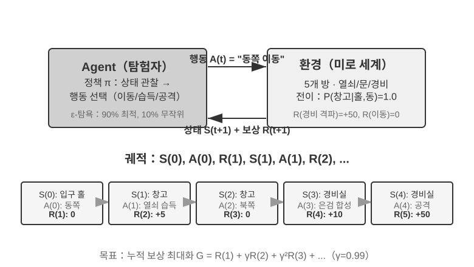

상호작용은 **궤적(trajectory)**을 만든다. 즉 '상태→동작→보상→새 상태→동작→보상...'의 완전한 기록이며, 정책의 우열은 결국 궤적의 질로 나타난다. **가치 함수(Value Function)**가 답하는 질문은 이것이다. "지금 이 상태에 있다면, 현재 정책을 따라 계속 행동하면 결국 총 얼마의 보상을 얻을 수 있는가?" 이것은 경험 많은 기사가 한 판의 국면을 보면 끝까지 안 두어도 직감적으로 승률을 짐작하는 것과 같다. (여기서 '현재 정책'을 '최적 정책'으로 바꾸면 최적 가치 함수가 되며, 뒤의 벨만 최적 방정식에서 쓴다.) 에이전트와 환경의 경계는 간결한 원칙을 따른다. **에이전트가 마음대로 바꿀 수 없는 것은 모두 환경에 속한다.**

강화학습이 감독 학습(정답 라벨이 필요)과 비감독 학습(데이터 속 숨은 패턴 발견)과 구별되는 두 가지 고유한 특징은 **시행착오 탐색**(에이전트가 스스로 어떤 동작이 좋은지 더듬어야 하고, 정답을 직접 알려주는 선생님은 없다)과 **지연 보상**(동작의 영향이 여러 단계 뒤에야 나타날 수 있다. 한 수의 가치가 종반에 가서야 드러나듯이)이다. 이로 인해 **탐험-이용 트레이드오프(Exploration-Exploitation Tradeoff)**라는 고유한 딜레마도 생긴다. 늘 익숙한 길만 가면 새로운 것을 배우지 못하고, 늘 제멋대로 시도하기만 하면 영원히 끝에 닿지 못한다.

강화학습 시스템은 다섯 가지 핵심 요소를 담는다.

- **동작 공간**: 에이전트가 취할 수 있는 모든 동작의 집합을 정의한다. 동작은 이산적일 수도(장기에서 '어디로 둘까', 선택이 유한) 있고, 연속적일 수도(로봇의 '관절을 몇 도 돌릴까', 연속값) 있다.
- **정책**: 에이전트의 행동 규칙으로, 주어진 상태에서 어떻게 해야 하는지를 규정한다. 정책은 아주 단순할 수도(조회표 하나: 상태 A를 보면 동작 X를 실행) 있고, 아주 복잡할 수도(심층 신경망 하나) 있다.
- **보상 신호**: 환경이 주는 즉각적 피드백. 그러나 에이전트의 목표는 즉각이 아닌 장기적 보상을 최대화하는 것이다. 이 차이가 결정적이며, 마치 투자를 오늘의 등락만 보지 않고 장기 수익으로 봐야 하는 것과 같다.
- **가치 함수**: 어떤 상태에서 출발해 앞으로 총 얼마의 누적 보상을 얻을 수 있는지 추정하며, 즉각적 피드백이 없을 때 현명한 결정을 돕는다. 지난 60년 RL 연구의 가장 중요한 인식 하나는 가치 추정의 핵심적 지위다.
- **환경 모델**(선택): 동작에 대한 환경의 응답을 예측한다. 환경 모델이 있는 방법을 **모델 기반 방법**(환경이 어떻게 변하는지 먼저 예측하는 법을 배우고, 그에 따라 계획)이라 하고, 환경 모델이 없는 방법을 **비모델 방법**(환경을 예측하려 하지 않고 경험에서 직접 배운다)이라 한다.

표 7-3은 여러 에이전트 시스템의 핵심 구성 요소를 비교해, 에이전트 개념의 보편성을 보여주고, 전통적 RL 에이전트와 현대 LLM 에이전트가 동작 공간에서 어떻게 다른지 한눈에 보여준다.

표 7-3 다양한 에이전트 시스템의 핵심 요소 비교

| 에이전트 유형 | 환경 | 동작 공간 | 보상 신호 |
|---------------|---------------------|----------------------------------|-------------------------|
| **갓 태어난 영양** | 지형, 중력, 몸 자세 | 연속 고차원(각 근육군 수축) | 균형(+), 넘어짐(-) |
| **로봇 청소기** | 방 구조, 배터리 | 이산(방향, 흡입, 충전) | 청소 면적(+), 방전(-) |
| **체스 마스터** | 보드 상태, 시간 제한 | 이산 유한(합법 수) | 승리(+1), 패배(-1) |
| **고객 서비스 에이전트** | 대화 이력, 지식베이스 | 개방형(사고, 말하기, API 호출) | 문제 해결(+), 처리 시간(-) |
| **코드 도우미 에이전트** | 요구사항 문서, 코드베이스 | 개방형(사고, 검색, 편집, 실행) | 테스트 통과(+), 버그 유발(-) |

이 표는 중요한 통찰 하나를 드러낸다. 전통적 RL 에이전트(장기, 로봇)의 동작 공간은 닫혀 있고, LLM 기반 현대 에이전트(고객 서비스, 코드 도우미)의 동작 공간은 열려 있어 거의 무한하며, 능력을 끌어올리는 특수 동작으로 '내면 사고'를 끌어다 쓸 수 있다는 점이다.

### 두 가지 에이전트 패러다임: MDP에서 LLM+RL로

둘의 가장 근본적 차이는 동작 공간에 있다. MDP는 동작 공간이 유한하고 닫혀 있다고 가정하고(위/아래/잡기/놓기), LLM의 동작 공간은 열려 있고 조합 폭발하는 자연어 시퀀스이다. 이 차이는 두 부류의 패러다임이 알고리즘 설계·샘플 효율·일반화 능력에서 근본적으로 갈리는 것을 결정한다. 아래에 각각을 펼친다.

**전통적 패러다임: MDP와 Q-learning.**

MDP(Markov Decision Process, 마르코프 결정 과정)는 강화학습의 수학적 틀이고, 상태·동작·보상 같은 핵심 요소를 정의한다. 핵심 가정은 **마르코프 성질**이다. 미래는 오직 현재 상태에만 의존하고, 더 이전의 과거와는 무관하다는 것이다. 비유하자면, 장기를 둘 때 현재의 바둑판 국면만 보면 최적의 수를 결정하기에 충분하고, 그 전 매 수를 어떻게 두었는지 되짚을 필요가 없다는 식이다. 이 가정은 문제를 단순화하지만, 과거 의존을 모델링하는 능력을 제한하기도 한다.

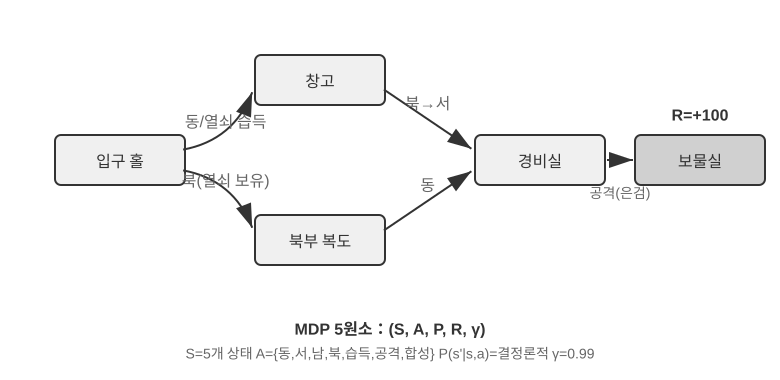

전통적 RL 에이전트의 핵심 특징은 **닫힌 동작 공간**이다. 에이전트가 취할 수 있는 모든 동작이 미리 정의된 유한 집합을 이룬다. **고전 보드게임 에이전트**가 가장 전형적 예다. 바둑의 361개 착점은 거대하지만 완전히 결정적이고 유한하고, 체스는 각 기물의 이동 규칙을 고려해도 동작을 나열할 수 있으며, 아타리 게임은 몇 개에서 열몇 개의 이산 동작만 있다. **로봇 에이전트**는 연속적이되 유계인 동작 공간의 사례다. 관절 각도, 속도, 잡기 힘은 연속값이지만 모두 명확한 물리적 경계가 있다(최대 회전 각도, 최대 토크, 속도 제한), 차원은 로봇의 자유도로 정해진다.

이런 닫힘 성질은 계산상의 이점을 가져온다. 모든 동작을 나열해 하나하나 평가할 수 있어 동적 계획법과 몬테카를로 트리 탐색에 유리하고, 동작 가치 함수를 표나 단순한 함수로 근사할 수 있다. 그러나 표현력과 일반화 능력을 제한하기도 한다. 전통적 RL 에이전트는 영점에서 출발해 순전히 시행착오로 배운다. 무작위 정책에서 시작해 경험을 모으고, 가치 함수나 정책을 갱신하기를 수렴할 때까지 반복한다.

이 틀 아래에서 가장 기초적이면서도 가장 중요한 알고리즘의 하나가 **Q-learning**이다. Q-learning은 '상태-동작' 조합마다 가치 추정을 유지한다. 상태 s에서 동작 a를 취한 뒤, 계속 최적 정책을 따라간다면 총 얼마의 보상을 받을 수 있는가? 직관적으로, 동작 하나가 좋은지 나쁜지는 그 동작이 가져오는 즉각적 보수에, '그 동작이 데려다놓는 다음 상태가 얼마나 좋은가'를 더해 결정된다.

이 직관을 식으로 쓰면, RL 교과서에 유명한 **벨만 방정식**(Bellman equation)의 핵심인 재귀 관계가 나온다. **하나의 동작의 진짜 가치 = 이 단계에서 받는 즉각적 보상 + 도착한 다음 상태에서 얻을 수 있는 최대의 미래 가치**.

$$Q^*(s, a) = r + \gamma \max_{a'} Q^*(s', a')$$

여기서 $r$은 즉각적 보상, $s'$는 동작을 실행한 뒤 도착하는 다음 상태(직관을 위해 여기서는 결정론적 형태로 썼다. 확률적 환경에서는 다음 상태 $s'$에 대해 기댓값을 취해야 한다), $\gamma \in [0, 1)$는 **할인 인자**다. 에이전트가 미래를 얼마나 중시하는지를 결정한다. $\gamma$가 1에 가까울수록 장기 수익을 중시하고, 0에 가까울수록 눈앞의 것만 챙긴다. 앞서 거듭 등장한 '누적 보상'은 바로 각 단계의 보상을 $\gamma$로 단계별 할인해 더한 총합 $\sum_{t} \gamma^{t} r_t$이다. 알고리즘은 매 동작 뒤, 옛 추정치를 '실제로 일어난 결과' 쪽으로 조금씩 옮긴다. 이런 '한 단계의 실제 결과로 옛 추정을 수정하는' 패러다임을 **시간차 학습**(Temporal-Difference Learning, TD learning)이라 부르며, 수천·수만 번의 시행착오를 거치면 추정값이 진짜값에 서서히 다가간다.

아래의 두 그림은 각각 그리드월드에서 Q-learning이 탐색하는 과정과 Q값이 점차 수렴하는 모습을 보여준다.

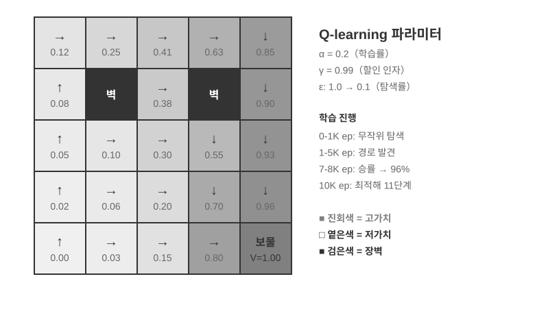

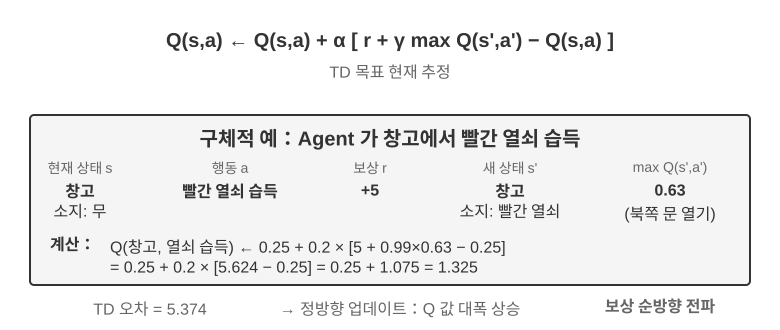

Q-learning은 특수한 **오프폴리시(Off-Policy)** 방법에 속한다. 임의의 정책(무작위 탐색 포함)이 만든 데이터로 최적 정책을 배울 수 있다. 온폴리시/오프폴리시 정책의 엄밀한 정의와 LLM 포스트트레이닝에서의 대응 관계는 뒤의 '강화학습 알고리즘 비교' 절에서 다룬다.

> **실험 7-1 ★: 보물찾기 게임에서 Q-learning의 활약**
>
> Q-learning의 특성과 한계를 검증하기 위해 **보물찾기 게임 환경**을 설계했다. 이 환경은 몇 가지 핵심 난제를 품고 있다. **숨겨진 기제**는 에이전트가 스스로 열쇠와 문의 대응 관계, 무기 효과, 아이템 조합 규칙을 발견하게 한다. **다단계 의존**은 과제 완수에 올바른 동작 시퀀스가 필요함을 뜻한다(최적해 11수). **희소 보상**은 핵심 동작과 최종 승리에만 눈에 띄는 보상이 있고, 중간 단계 대부분은 어떤 피드백도 받지 못함을 뜻한다.
>
> Q-learning 에이전트는 표준 파라미터 설정을 쓰고, ε-탐욕 탐색 전략을 쓴다(대부분의 시간에는 현재 최적인 동작을 고르고, 가끔 무작위로 시도하며, 훈련이 진행되면서 무작위 탐색 비중을 서서히 줄인다).
>
> 학습 곡선은 전형적 특징을 보여준다(episode는 한 판의 완전한 게임을 뜻하고, 시작에서 클리어나 실패까지를 1회로 센다).
> - **처음 1000 episodes**: 승률 0%, Q 표는 124개 상태, 에이전트는 맹목적으로 탐색 중
> - **처음 5000 episodes**: 여전히 안정적 승리 없음, Q 표 133개 상태
> - **7000~8000 episodes**: 승률이 34%에서 점차 96%로 상승
> - **10000 episodes**: 승률 100%, Q 표 145개 상태, 11수 최적해 발견
>
> 전체 훈련은 10초도 안 걸린다(시뮬레이션 효율이 극히 높다). 그러나 거의 10000번의 완전한 시도가 필요하다. 이것은 Q-learning의 핵심 특징을 보여준다. 방대한 무작위 탐색이 있어야 우연히 완전한 경로를 뚫을 수 있고, 가치 신호의 전파가 느려 거듭 강화해야 한다. 사전 지식 없는 순수 기호 학습은 상태 공간을 무식하게 뒤지는 수밖에 없다.
>
> 게임 시뮬레이터에서 10000번의 시행착오는 10초면 끝나 비용이 거의 없다. 그러나 현실의 에이전트 상황에서는 매 전화에 비용이 있고, 매 브라우저 조작에 지연이 있으며, 매 잘못된 결정이 되돌릴 수 없는 결과를 낳을 수 있다. 여기서 10000번의 시행착오는 완전히 받아들일 수 없다. 이것이 바로 현대 에이전트가 LLM 기반 방법으로 전환한 이유다. 사전훈련으로 쌓은 지식을 이용해, 아주 적은 상호작용만으로도 유효한 결정을 내린다.
>
> MDP의 근본적 한계는 셋이다. 샘플 효율이 낮고(단순한 과제를 배우는 데도 방대한 상호작용이 필요), 일반화 능력이 떨어지며(한 환경에서 배운 지식이 다른 환경으로 옮겨가기 어렵고), 사전 지식을 활용하지 못한다(새 과제마다 처음부터 다시 배워야 한다). 자연어나 고차원 시각 같은 복잡한 상태 공간에 맞닥뜨리면, 이런 한계가 특히 두드러진다.
>

**현대 패러다임: LLM+RL 기반 에이전트.**

대언어모델은 새로운 에이전트 패러다임을 가져왔고, 에이전트를 구축하는 방식을 근본적으로 바꿨다. 특히 동작 공간 설계가 그렇다.

전통적 RL의 에이전트는 환경을 바꿔야만 피드백을 얻을 수 있었다. 한 수 두기, 미로 한 걸음 가기. 그러나 LLM은 새로운 유형의 동작을 가져왔다. 내면 사고다. 사고는 외부 세계를 바꾸지 않지만, 최종 동작의 질을 눈에 띄게 끌어올린다. 이 전환은 모든 것을 바꿔놓았다. 에이전트의 동작 공간은 더 이상 '무엇을 할까'만이 아니라 '얼마나 오래, 무엇을 생각할까'까지 아우르게 되었다.

가장 중요한 혁신은 **사고(Thinking)를 하나의 특수 동작으로** 동작 공간에 편입한 것이다. 전통적 RL에서 에이전트는 환경 상태를 바꾸는 외부 동작(이동, 공격, 줍기)만 실행할 수 있었다. LLM 에이전트에서는 **내면 사고가 동작 공간의 핵심 구성**이 된다. 외부 환경을 직접 바꾸지 않고, 즉각적 보상이 없으며, 횟수가 거의 제한 없고, 비용도 비교적 낮다.

전통적 RL이 이런 동작을 다루기 어려운 까닭은, 탐색 공간이 너무 크고 구조가 없다는 데 있다. 영점에서 배우는 에이전트는 눈을 가린 채 사막에서 보물을 찾듯, 무작위로 부딪힐 수밖에 없다. LLM은 다르다. 방대한 텍스트 사전훈련을 통해 인류가 쌓아온 사고 규칙을 이미 내면화했다. 수학 문제를 풀 때는 '조건 파악 → 공식 회상 → 단계별 계산'을 따르고, 코드를 쓸 때는 '요구사항 이해 → 구조 설계 → 디테일 구현'을 따른다. 이 덕에 LLM의 사고는 구조가 있는 경로를 따라 나아가고, 탐색 공간을 크게 압축한다. 그래서 별도의 RL 훈련이 없어도, 사전훈련을 마친 LLM은 기본적 논리를 갖춘 사고 사슬(Chain of Thought, CoT)을 만들어낸다. 이런 기본 논리는 사전훈련 말뭉치에 셀 수 없이 많은 인간 사고 과정(수학 풀이, 코드 주석, 논밭 응답 등)에서 왔으며, 모델은 next-token prediction으로 '다음은 어떤 추리 형태여야 하는가'를 암묵히 배웠다.

RL 포스트트레이닝은 외부 보상을 통해 LLM에게 특정 과제에서 이런 규칙을 더 효율적으로 쓰는 법을 가르친다. 언어의 구조 자체도 일종의 숨은 내부 보상을 제공한다. 논리가 일관된 사고 사슬(예: '외화를 달러로 환산해야 하니, 첫 단계로 환율을 조회하자')은 생성 확률이 높고, 논리가 뒤죽박죽인 것(예: '환전하려면 날씨부터 알아야지')은 확률이 극히 낮아, 자연스럽게 합리적 경로를 선호하도록 모델을 유도한다.

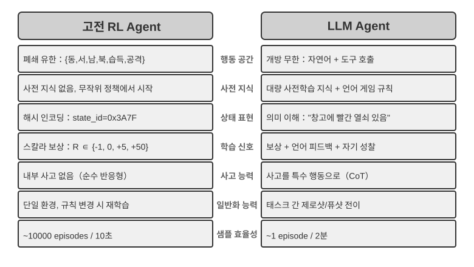

이렇게 언어의 본래 규칙에 기반한 사고 능력 덕에, LLM 에이전트는 한 번도 본 적 없는 지시를 이해할 수 있고(제로샷 일반화), 극히 적은 예시만으로도 새 과제를 익힐 수 있다(퓨샷 적응). 이것은 전통적 MDP 에이전트가 반드시 대량의 시행착오를 거쳐야 하는 패러다임과는 완전히 다르다. 게다가 새 패러다임은 조합 일반화(이미 아는 개념을 다시 조합해 새 상황에 대처), 컨텍스트 내 학습(프롬프트와 예시로 빠르게 적응), 다모달 이해(시각·언어·동작 등 모달리티를 자연스럽게 통합) 같은 능력도 갖추고 있다. 주의할 점: 컨텍스트 내 학습의 **효과**(제로샷 일반화, 퓨샷 적응)와 그 **내부 메커니즘**은 별개 문제다. 2장에서 분석했듯, 주의력 메커니즘의 작동 방식은 추리라기보다 검색에 가깝지만, 그렇다고 해서 과제 적응에서 강력한 실용적 효과를 내는 것을 방해하지는 않는다.

닫힌 동작 공간에서 열린 동작 공간으로의 진화는 AI 에이전트 패러다임의 근본적 전환을 반영한다. 내면 사고 외에도, 도구 파라미터의 다양성(자연어 질의, 프로그램 코드, 복잡한 JSON, 다모달 콘텐츠)이 실제 동작 공간을 사실상 무한에 가깝게 만든다. 코드 인터프리터는 이론상 계산 가능한 모든 과제를 실행할 수 있고, 검색 도구는 인터넷 전체의 정보 공간을 탐색할 수 있다. 이것은 새 기회(에이전트가 전례 없는 과제를 처리하고, 기초 도구들을 조합해 복잡한 문제를 해결)를 가져오는 동시에 새 도전(열린 환경에서 보상 함수를 어떻게 정의·최적화할 것인가, 무한한 동작 공간에서 어떻게 효율적으로 탐색할 것인가)도 가져온다.

Kimi K3처럼 도구 호출과 긴 사슬 사고에 최적화된 모델을 예로 들면, LLM+RL 패러다임의 전형적 방향을 볼 수 있다. 대규모 언어 사전훈련 위에, 포스트트레이닝으로 문제 분해·도구 호출·자기 교정 능력을 강화한다. **OpenVLA**(자세는 9장)는 LLM 시대의 VLA(시각-언어-동작) 아키텍처 패러다임을 보여준다. 시각 인코더가 환경 관측을 처리하고, 언어 모델이 지시를 이해하며 추론하고, 동작 디코더가 제어 신호를 만들어, 언어 조건부 제어와 과제 간 일반화를 구현한다. 분명히 해둘 것: OpenVLA 자체는 근 백만 건의 로봇 **시범 궤적**에서 모방 학습(행동 복제)으로 훈련된 것으로, SFT적 성격이지 RL이 아니다. 로봇에 RL을 진정으로 끌어들여, 이런 VLA 아키텍처 위에서 보상으로 더 최적화한 대표적 사례는 이 장 뒤의 실험 7-13 SimpleVLA-RL이다.

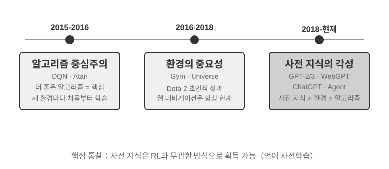

**OpenAI의 탐험 여정**(야오순우·프린스턴대 조교수·ReAct 논문 저자가 《The Second Half》에서 상세히 기록)은 인식의 변화를 드러낸다. **제1단계(2015~2016) 알고리즘 중심주의**: 더 나은 알고리즘이 핵심이라 믿었고, 아타리 같은 표준 환경에서 진전을 이뤘지만, 환경을 바꾸면 처음부터 다시 훈련해야 했다. **제2단계(2016~2018) 환경의 중요성**: Gym이 각종 과제를 표준화했고, Universe와 World of Bits는 인터넷 전체를 RL의 훈련 환경으로 만들려 했으며, Dota 2는 특정 복잡한 환경에서 초인적 성과를 추구했다. 발상은 명확했지만, 범용 컴퓨터 사용과 웹 탐색은 끝내 돌파하지 못했다.

**제3단계(2018~현재) 사전 지식의 각성**: GPT-2/GPT-3이 언어 사전훈련의 강력한 힘을 보여주었고, WebGPT·ChatGPT가 이런 사전 지식을 실용적 에이전트로 바꿀 수 있음을 증명했다. 가장 중요한 발견은, **사전 지식은 RL과 완전히 무관한 방식으로 얻어질 수 있다**는 것이다. 이것은 직관에 반하는 진실이다. 수십 년간 RL 연구자의 우선순위가 완전히 뒤집혀 있었을 수 있다. 알고리즘 > 환경 > 사전 지식이 아니라, 사전 지식 > 환경 > 알고리즘이다.

> **실험 7-2 ★★: 전통적 RL과 LLM 에이전트의 비교 연구**
>
>
> 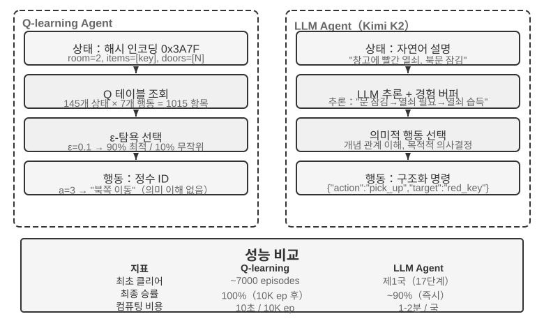
>
>
> 같은 보물찾기 게임에서 Q-learning과 LLM 에이전트(Kimi K3, 최대 50건의 경험을 유지하는 버퍼)를 비교했다. 결과는 놀랍다. **LLM 에이전트가 첫 판에 18수 안에 클리어**했다.
>
> **전기(목적 있는 탐색)**: 녹슨 칼을 집고('무기는 맨손보다 낫다'), 체계적으로 지도를 탐색하며, 북문이 잠긴 것을 발견하고 '열쇠를 찾아야겠다'고 추론한 뒤 저장실로 돌아가 빨간 열쇠와 마법 수정을 차례로 얻는다. **중기(기제 이해와 능동적 합성)**: '열쇠는 자동으로 쓰인다'는 규칙을 이해하고, 녹슨 칼로는 수호자를 상대하기 부족하다고 미리 짚어 8수째에 은 칼을 능동적으로 합성한다. **후기(실행과 교정)**: 은 칼을 들고 북상, 13수째에 강한 수호자를 격파하는 사이 한두 수의 헛된 시도(반복해서 치기/후퇴)가 섞이고, 마침내 18수째에 거대한 용의 보물을 손에 넣는다.
>
> 이것은 의미 이해와 기호 매핑의 근본적 차이를 보여준다. LLM 에이전트는 게임의 개념 구조를 이해했고, 매 수에 목적과 논리가 깔려 있다. 반면 Q-learning에게는 '문''열쇠''칼'이 무의미한 기호 조합일 뿐이고, 대량의 통계적 학습으로 서서히 그 사이의 관계를 발견할 수밖에 없다.
>
> 계산 비용은 흥미로운 역설을 만든다. Q-learning은 10000판을 10초에 돌리지만, LLM 에이전트는 한 판에 1~2분이 든다. 그러나 현실의 과제에서는 매 상호작용의 시간·비용·위험 비용이 순수 계산 비용을 훨씬 넘어선다. 그래서 GPU 시간만 보는 것은 공정하지 않다. 더 핵심적인 통찰은, LLM 에이전트의 성공이 더 나은 '학습 알고리즘'을 가져서가 아니라, 방대한 사전 지식을 싣고 있기 때문이라는 것이다. 게임 규칙이 바뀌면 Q-learning은 완전히 다시 훈련해야 하지만, LLM 에이전트는 추론으로 곧바로 적응한다. 여기서 실용적 설계 원칙을 뽑을 수 있다. 시뮬레이션 비용이 저렴하고 대량 반복이 가능한 상황에서는 전통적 RL이 여전히 가치가 있고, 상호작용 비용이 높고 빠른 적응이 필요한 현실 상황에서는 LLM 에이전트의 샘플 효율이 더 실용적이다.
>

컨텍스트 내 학습, 외부화 학습, 파라미터화 학습(포스트트레이닝)이라는 세 학습 패러다임 각각의 위치와 시너지는 1장에서 이미 체계적으로 대조했고, 장 말미의 '완전한 그림'에서도 이 화제로 돌아온다. 이 장의 메인 라인은 그 중 포스트트레이닝이다. 상호작용 전략을 모델 파라미터에 써 넣는 것.

## 모델 사전훈련 기초 `[선택 읽기]`

포스트트레이닝 기술이 왜 효과가 있는지 이해하려면, 먼저 사전훈련이 무엇을 세우는지 알아야 한다. 포스트트레이닝(SFT와 RL)은 본질적으로 사전훈련이 세운 표현 공간 안에서의 최적화다. 사전훈련이 놓은 지식 구조가 포스트트레이닝의 천장을 결정한다. 그래서 우리는 세 실험으로 사전훈련의 핵심 고리를 살핀다. 영점에서 소규모 언어 모델 훈련, 시각 능력 확장, 새 언어 지식 주입이다. 이 절의 세 실험은 보조 내용으로, 독자에게 사전훈련(Pretraining. 즉 대규모 데이터에서 초기 훈련을 해, 모델에게 언어의 기본 규칙과 세계 지식을 가르치는 것)에 대한 직관을 쌓게 한다. 사전훈련 흐름에 이미 익숙한 독자는 건너뛰어도 좋다.

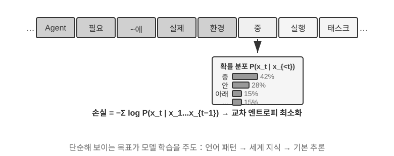

언어 모델 훈련은 '토큰화 — 사전훈련 — 포스트트레이닝'의 3단계 흐름을 따른다. 토큰화(Tokenization)는 텍스트를 이산 단위로 자르는 것이다. 예컨대 '나는 프로그래밍을 좋아한다'는 '나''는'' 프로그래밍''을 좋아한다'처럼 네 토큰으로 잘릴 수 있다. 이 토큰들이 모델이 텍스트를 처리하는 최소 단위다. 사전훈련의 과제는 개념상 아주 단순하다. 텍스트의 앞부분을 보여주고 다음 토큰이 무엇인지 예측하게 하는 것이다. 모델은 자기 예측과 정답의 차이(이 차이를 손실(Loss)이라 부르고, 손실이 작을수록 예측이 정확한 것이다)로 자기 파라미터를 계속 조정한다. 방대한 텍스트에서 반복 훈련한 뒤, 모델은 언어 규칙, 세계 지식, 기본 추론 능력을 서서히 갖춘다. 사전훈련을 마치면 모델은 유창한 텍스트를 만들어내지만, 출력에 구조가 없고 지시를 따르기 어렵다. 포스트트레이닝은 SFT(라벨링된 입력-출력 쌍으로 훈련)와 선호 최적화(예: DPO, 모델이 인간이 더 선호하는 답을 만들게 하는 것)를 통해 이를 실용적 조수로 바꾼다.

> **실험 7-3 ★★: 영점에서 LLM 훈련하기 — 알고리즘 개선의 위력**
>
> MiniMind 2(1억 파라미터)를 사례로, 소비자용 GPU에서 전체 훈련 흐름을 마쳤다. 두 가지 알고리즘 최적화(QK Norm과 Muon 옵티마이저)를 도입해 수렴 속도를 3배 끌어올렸고, 생성 품질도 눈에 띄게 개선했다. 구현 비용은 극히 낮아 전체 훈련 약 14시간, 비용 약 34달러였다.
>
> 각 훈련 단계의 효과. 사전훈련 뒤 모델은 '세계에서 가장 높은 산' 같은 사실적 질문에 답할 수 있지만, 형식이 단정하지 않다. SFT 뒤에는 지시 준수와 출력 형식이 눈에 띄게 개선돼, 바라는 방식으로 답을 조직한다. 선호 최적화는 사실적 오류와 어색한 표현을 더 줄여준다. 1억 파라미터 모델엔 여전히 뚜렷한 한계가 있지만(복잡한 문제에서 오류 잦음), 시사하는 바는 명확하다. **고정된 소규모 예산 아래서는, 알고리즘 개선이 단순히 규모를 키우는 것보다 가성비가 좋다.**
>
> **실험 7-4 ★★: VLM 직접 훈련하기**
>
>
> 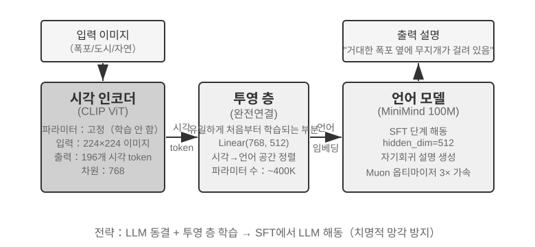
>
>
> VLM은 시각 지각과 언어 이해를 한 모델 안에 통합한다. 핵심 난제는 모달리티 간 정렬, 즉 '본 것'과 '말한 것'을 대응시키는 것이다. 아키텍처는 세 구성 요소로 이루어진다. **시각 인코더**(예: CLIP, 파라미터 고정)가 이미지의 의미적 특징을 뽑는다. **투영층**(경량, 유일하게 영점에서 훈련하는 부분)이 시각 특징과 언어 모델 사이의 '번역가'를 맡아, 시각 특징을 언어 모델이 이해할 수 있는 표현 공간으로 옮긴다. **언어 모델**이 묘사 텍스트를 만든다. 훈련은 'LLM 동결 + 투영층만 훈련' 전략을 써서 치명적 망각(Catastrophic Forgetting. 새 기술을 배우고 나서 예전 기술을 잊는 것)을 피한다. 사전훈련 정렬 뒤에 LLM을 다시 풀고, 고품질 이미지-묘사 쌍으로 SFT하면 묘사의 상세함과 정확도가 눈에 띄게 개선된다.
>
> 이 실험은 다모달 모델 훈련의 기본 패러다임을 드러낸다. 단일 모달리티 사전훈련의 성과를 재사용하고, 경량 투영층 하나를 훈련해 모달리티 간 정렬을 구현한다. 효율적이고 확장성이 있지만, 투영층의 표현력이 제한돼 모달리티 간 깊은 이해의 병목이 될 수 있다. 같은 '시각 인코더 + 투영층 + LLM' 뼈대를 한 단계 더 나아가 모델이 동작까지 출력하게 만들면, 9장에서 펼치는 VLA(시각-언어-동작) 모델이 된다.
>
> **실험 7-5 ★★: 계속 사전훈련으로 새 언어 배우기**
>
> Mistral 7B v0.3을 바탕으로(주로 영어로 사전훈련돼 한국어 이해력이 거의 없음), 한국어 위키백과로 계속 사전훈련해 한국어 능력을 주입했다. 이미 사전훈련을 마친 모델에 새 언어 데이터로 비감독 훈련을 이어 하는 것으로, 모델은 범용 언어 모델링 능력을 이미 갖췄기에 새 데이터 분포에 적응하기만 하면 돼, 영점 훈련보다 비용이 훨씬 낮다. 핵심 공학 포인트는 혼합 데이터(약 80% 한국어 + 20% 영어)로 치명적 망각을 완화하는 것이다. 목표 언어 비중이 너무 높으면 원래 언어가 퇴화하고, 너무 낮으면 학습 효율이 부족하다. 마지막에 한국어 지시 데이터로 SFT해 실용적 한국어 대화 능력을 얻는다. 이 실험의 결론은 장 말미의 완전한 그림에서 다시 쓰인다. 모델이 대량의 새 영역 지식을 기억하게 하려면, SFT가 아니라 계속 사전훈련에 의존해야 한다.
>

세 사전훈련 실험은 하나의 규칙을 함께 드러낸다. 예산이 제약될 때, 알고리즘 개선과 아키텍처 혁신이 단순한 규모 확대보다 가성비가 좋다는 것이다. 더 중요하게, 사전훈련이 모델에 부여하는 것은 기술적 지식과 언어 모델링 능력이지, 구조화된 지시 준수와 과제 지향적 행동은 아니다. 바로 이 빈 칸을 SFT가 메워야 한다.

사전훈련의 기초 능력을 갖췄으니, 다음은 포스트트레이닝을 통해 범용 모델을 실용적 에이전트로 바꾸는 것이다. 포스트트레이닝의 첫 단계는 감독 미세조정(SFT)이다.

## SFT(감독 미세조정)

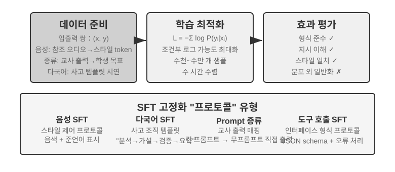

7.1절에서 SFT의 본질(데이터만 바꾸고, 답변에만 손실을 계산하는 '다음 토큰 예측')을 속까지 다뤘다. 이 절에서는 네 실험으로, 이 '안정적 매핑과 프로토콜을 파라미터에 써 넣는' 메커니즘이 서로 다른 과제에서 구체적으로 무엇을 고정하는지 살핀다. SFT의 핵심 가치는 새 지식을 주입하는 데 있지 않고 **프로토콜 고정**에 있다. 매핑 관계, 상호작용 형식, 스타일 규범을 파라미터에 써 넣어, 추론 시 길고 장황한 프롬프트 없이도 기대에 맞는 출력을 내게 한다. 보통 수천에서 수만 건의 고품질 예시만으로 기본적 대화 능력과 지시 준수를 세울 수 있다.

이 효율성의 대가는 훈련 분포에 대한 강한 의존이다. SFT는 일반화보다 기억에 기울어, 테스트에서 훈련 때 본 적 없는 상황을 만나면 성능이 자주 눈에 띄게 떨어진다. 이어지는 실험들은 다양한 각도에서 이 '프로토콜 고정' 과정을 보여준다.

SFT를 직접 하기 전에 피해 갈 수 없는 실무 문제 하나. **SFT 데이터는 어디서 오는가?** 산업계의 답은 대체로 세 길이다. **사람 전문가 시범**은 품질 천장이 가장 높지만, 비싸고 느려 형식과 스타일을 정의하는 '시드 데이터'에 어울린다. **교사 모델 생성**, 즉 합성 데이터는 강한 모델이 '입력-출력' 쌍을 대량으로 만들게 하고, 거른 뒤 학생에게 증류하는 것이다(실험 7-8, 7-9가 모두 이 길이다). **모델 셀프부트스트래핑**은 모델이 같은 질문에 여러 후보를 샘플링하고, 검증기로 맞는 샘플을 골라 다시 자기를 훈련하는 것이다. 거부 샘플링 미세조정이라 하며 실험 7-9에서 자세히 다룬다. 세 길은 흔히 조합해 쓴다. 먼저 소수의 인간 시드로 형식을 세우고, 교사 모델로 규모를 키운 뒤, 마지막에 거부 샘플링으로 품질을 맞춘다. 어떤 길을 가든, 구축 흐름은 대동소이하다. 먼저 과제 분포와 출력 스키마를 정의하고, 후보를 대량 생성한 뒤, 규칙 검증과 형식 검사, 인간 표본 검수로 품질 필터링을 하고, 마지막에 중복을 빼고 비율을 맞춰 다양성을 보장한다. 양은 욕심부리지 않아도 된다. 수천에서 수만 건의 고품질 샘플이면 프로토콜 고정엔 대개 충분하다. 십만 건의 더러운 데이터를 쌓기보다, 만 건의 깨끗한 데이터를 정제하는 편이 낫다. 데이터 속의 잡음 하나하나를 SFT는 성실하게 파라미터에 써 넣는다.

> **실험 7-6 ★★★: 음성 SFT — '목소리 복제'에서 '준언어 모델링'으로 `[확장 실험]`**
>
> Orpheus(컨텍스트 프롬프트 기반 음성 복제)와 Sesame(준언어 토큰 모델링)을 대상으로, '목소리 스타일과 표현 습관'을 파라미터에 쓰는 법을 보여준다. 둘은 발상이 다르다.
>
> - **Orpheus**: 음성 파형을 토큰 시퀀스로 압축하고, 같은 화자의 참고 음성을 이어 붙여 모델이 '이 사람 목소리로 말하는 법'을 배우게 해, 문장을 넘어선 음색 일관성을 구현한다.
> - **Sesame**: 웃음, 한숨 같은 준언어 현상을 `<laugh>`, `<sigh>` 같은 특수 토큰으로 추상화하고, '토큰을 보면 해당 소리를 낸다'는 법을 모델에게 훈련시킨다.
>
> 표현형 과제에서 SFT가 고정하는 것은 스타일 제어 프로토콜과 구조화된 표현 습관이지, 사실 지식이나 복잡한 사고가 아니다. 핵심은 훈련 데이터의 다양성과 라벨링 품질에 있다. 흔한 실패 모드: 훈련 데이터의 화자가 너무 적으면 모두가 같은 톤으로 들리고, 토큰 과적합(Overfitting. 모델이 훈련 샘플의 디테일을 죽 외워서 새 상황에서 오히려 더 못하게 되는 것)이 '기계적인 웃음'을 만들어낸다.
>
> **실험 7-7 ★★★: 다언어 사고 — 모델이 임의 언어로 사고하게 하기 `[확장 실험]`**
>
> 대부분의 사고 모델은 영어로만 '생각'한다. 어떤 언어로 질문하든 모델 내부의 사고 사슬은 거의 영어다. 훈련 데이터에서 질 높은 사고 시범이 기본적으로 영어로 쓰여 있기 때문이다. 이 실험의 목표는 단순하다. 모델이 지정한 언어로 사고하게 만드는 것.
>
> 방법은 gpt-oss-20b에 SFT하는 것이다. 시스템 지시에 `reasoning language: German`(또는 다른 언어) 한 줄을 넣고, 영어·스페인어·프랑스어 등 몇 언어의 사고 예시로 훈련한다. 훈련 데이터에는 **중국어가 전혀 없다**. 그런데 훈련을 마치고 reasoning language를 Chinese로만 설정하면, 모델이 중국어로 완전한 사고 사슬을 전개한다. 이 제로샷 교차 언어 일반화가 이 실험의 가장 흥미로운 발견이다. 주의: 이것이 SFT 자체의 일반화 능력은 아니다. 다언어 사전훈련이 이미 모델 안에 교차 언어 공유 표현 공간을 세워두었고, SFT는 사전훈련 때 이미 있던 이 교차 언어 능력을 활성화만 한 것이다.
>
> **실험 7-8 ★★: 프롬프트 증류 — 더 작은 비용으로 쓸 만한 능력 재현하기**
>
> 실제 응용에서, 모델이 복잡한 과제를 수행하게 하려면 흔히 장황한 시스템 프롬프트(수천, 심지어 수만 토큰)를 설계해야 하고, 매 호출마다 지연과 비용이 늘어난다. 사고형 대모델을 쓰면 내면 사고 토큰이 비용을 더 키운다. 프롬프트 증류의 발상은 '긴 프롬프트 + 사고형 교사'의 행동을 '짧은 프롬프트/프롬프트 없음 + 비사고형 학생'으로 압축하는 것이다. 교사는 전체 프롬프트와 사고 모드에서 고품질 답을 만들고, 훈련 데이터에는 사용자 입력과 최종 결론만 남기며, 장황한 프롬프트와 중간 사고 과정은 버린다. 학생은 '곧바로 결론을 낸다'는 것을 배운다. 증류 뒤 같은 입력에서 교사의 출력 품질에 가까워지면서도, 장황한 프롬프트와 사고 토큰을 처리할 필요가 없어 지연과 비용이 눈에 띄게 줄어든다.
>
> 증류는 두 차원에서 이뤄질 수 있다. '크에서 작으로'(중소형 모델로 대형 모델을 대체해 비용과 품질 사이의 타협)와 '사고형에서 비사고형으로'(같은 규모에서 명시적 CoT를 암묵적 파라미터 지식으로 접어 20~30배의 응답 속도 향상). 둘은 충돌하지 않고, 운영 환경에서 자주 함께 쓰인다. 주의: 증류는 교사의 경계를 물려받는다. 교사가 긴 꼬리 분포에서 체계적 오류를 가지면 학생은 그 오류를 더 굳건히 하드코딩하고, 교사가 정확성을 위해 도구에 의존하면 단순한 출력 증류는 도구가 주는 견고성을 잃는다. 공학적 시사: 제품 형태가 안정되고 입력 분포가 예측 가능하며 비용 제약이 뚜렷할 때, 프롬프트 증류는 훌륭한 최적화 수단이다. 반면 탐색기나 과제가 아직 굳어지지 않은 단계에서는, 명시적 사고와 편집 가능한 프롬프트 공학을 남겨두는 것이 빠른 시행착오의 핵심이다.
>
> **실험 7-9 ★★★: 사고 사슬(Chain of Thought, CoT) 증류 `[확장 실험]`**
>
> 프롬프트 증류가 사고 과정을 버린다면, CoT 증류는 반대다. 강한 교사 모델의 **완전한 사고 궤적**을 학생 모델에 전이한다. 능력이 강한 교사 모델에 CoT 증류를 하면, 같은 파라미터 수에서 교사 능력의 70%~80%를 회복할 수 있다. 최첨단 능력 경신을 노리기보다, 자체 통제 가능한 모델을 원하는 팀에는 가장 실용적인 팔로워 전략이다. DeepSeek-R1이 발표될 때 동시에 오픈소스로 풀린 일련의 증류 소형 모델(R1의 사고 궤적으로 Qwen, Llama 계열에 SFT)이 바로 이 노선의 대표 사례다.
>
> **배경: '사고의 담장' 현상**. 일부 폐쇄형 사고 모델(OpenAI o 시리즈, Gemini 시리즈 등)은 사고할 때 내면 사고 사슬을 만들지만, 사용자에게 보이는 것은 원본 사고 과정이 아니다. 제조사는 증류 방지, 안전, 제품 경험 등을 이유로, 출력 전에 CoT를 다시 쓰거나 요약하는 게 보통이고, 가장 가치 있는 원본 사고 과정은 API 너머에 감춰진다. 그래서 이 실험은 오픈소스 사고 모델을 교사로 고른다. DeepSeek V4, Kimi K3, GLM 5.2 같은 모델은 완전한 사고 사슬을 직접 공개해, 기술적으로나 라이선스로나 증류가 가능하다(사용 전에는 모델 라이선스가 증류 결과물에 대한 허가 조항을 확인해야 한다).
>
> 여기에 더 실용적이고 더 중요한 판단 하나. **포스트트레이닝을 하는 대다수에게, 폐쇄형 모델의 사고 사슬을 증류할 필요가 전혀 없다.** 현재 가장 진보한 오픈소스 모델과 SOTA 폐쇄형 모델의 격차는 생각보다 크지 않다. 교사 모델은 '학생보다 확실히 위'면 되지, '세계 1위'일 필요는 없다. 포스트트레이닝하려는 모델이 200B 이하 규모라면, 오픈소스 SOTA 모델을 교사로 쓰면 충분하다.
>
> **실험 설계**: 세 단계 흐름. 첫째, **궤적 수집**: 목표 과제 분포(수학, 코드 등)에서 문제를 샘플링하고, 오픈소스 교사 모델로 '사고 + 답'의 완전한 궤적을 만든다. 그리고 규칙 검증기로 최종 답이 틀린 궤적을 걸러낸다. 그렇지 않으면 틀린 사고 과정까지 학생이 모방한다. 이 '후보 생성 → 검증 필터 → 맞는 궤적만 남기기'에는 전용 이름이 있다. **거부 샘플링(Rejection Sampling)**이다. 이렇게 구축한 데이터로 SFT하면, 그것이 바로 **거부 샘플링 미세조정(Rejection Sampling Fine-Tuning, RFT)**이다. RFT는 순수 SFT와 RL 사이에 있다. 보상 모델은 훈련하지 않고, 정책 경사도 하지 않으며, 오직 '여러 샘플 중 틀린 것은 거르고 맞는 것만 남기는' 것으로 데이터 품질을 끌어올린다. 검증 가능한 과제에서 가성비가 아주 높은 데이터 구축 수단이다. 둘째, **SFT 훈련**: '문제 → `<think>` 사고 궤적 `</think>` + 최종 답'을 훈련 쌍으로 삼아 소형 모델(예: 7B급)에 표준 SFT를 한다. 셋째, **비교 평가**: 같은 벤치마크에서 증류 전후의 학생 모델과 교사 모델을 비교해, 능력 회복 비율을 잰다.
>
> **수락 기준**: 증류 뒤 학생 모델이 수학/코드 벤치마크에서 증류 전보다 눈에 띄게 향상되고, 사고 궤적에 교사식 반성·역추적·검산 행동이 나타난다. 동시에 증류의 대가도 잊지 말 것. 학생은 교사의 체계적 오류와 장황한 사고 습관을 물려받는다(후자는 실험 7-10의 AdaptThink 발상과 결합해 2차 최적화할 수 있다).
>

이 네 실험에는 공통 특징이 있다. '안정적인 매핑과 프로토콜을 파라미터에 쓴다'는 것. 음성 SFT는 스타일 제어 프로토콜을, 다언어 SFT는 사고 조직 템플릿을, 증류 SFT는 입력에서 출력으로의 직접 매핑을 고정한다. 공통점은 목표가 명확하고, 형식이 또렷하고, 평가 기준이 안정적이라는 것이다. 그래서 SFT는 극히 높은 샘플 효율로 수익을 낸다. 반면 분포가 변하면 기억 성향이 성능 저하로 드러난다. 이것이 7.1절 'SFT와 RL의 본질적 차이'에서 다룤 기억-일반화의 분리가 실험 차원에서 구현된 것이다.

## 언제 SFT를 고르고, 언제 RL을 고를까

7.1절에서 SFT와 RL의 **본질적 차이**를 다뤘다. 이 절은 더 실무적인 질문에 답한다. **구체적 과제 앞에서, 대체 어느 쪽을 써야 하는가?** 아래의 의사결정 프레임의 일부 결론은 뒤의 RL 실험(실험 7-10, 실험 7-11)에서 다시 검증된다. 독자는 먼저 초기 판단을 세우고, RL 부분을 읽고 나서 다시 돌아와 대조해도 좋다.

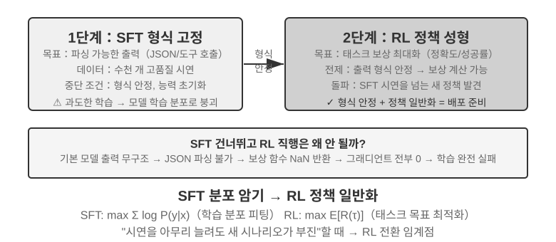

**SFT에 적합한** 것은 형식 고정(JSON 출력, 대화 스타일), 고품질 전문가 시범 보유, 훈련 환경과 배포 환경의 높은 일치 같은 상황이다. **RL이 개입해야 하는 상황**은 다르다. 실제 배포 환경과 훈련 환경에 체계적 차이가 있을 때(예: 훈련 때 J/Q/K를 모두 10으로 취급했는데 배포 때 11/12/13으로 바뀌면 규칙이 변한 것이고, 훈련 때 검은 색 무늬를 썼는데 배포 때 빨간 색 무늬를 만나면 외양이 변한 것이다), 최적 전략을 탐색해야 할 때(전문가 시범 자체가 반드시 최적인 것은 아니다), 라벨링 비용이 너무 높아 각 경로마다 시범을 제공할 수 없을 때, RL이 필요하다.

가장 견고한 전략은 **'먼저 SFT, 그 다음 RL'**의 2단계 흐름이다. SFT의 주된 목표는 과제 성능의 극치를 노리는 것이 아니라, 출력의 **형식 안정성**을 세우는 것이다. 모델이 파싱 가능한 JSON과 올바른 도구 인터페이스 호출을 만들어내게 보장하는 것이다. 출력 형식이 안정되고 나서야, RL의 보상 신호가 신뢰 가능하게 계산된다. SFT를 거치지 않은 기반 모델에 곧바로 RL을 하면, 흔히 출력 형식이 뒤죽박죽이라 보상을 계산할 수 없어 훈련이 실패한다. 단 이 결론에는 경계 조건이 있다. '비교적 작은 기반 모델 + 엄격한 구조적 출력 요구'라는 설정(뒤의 실험 7-11)에서 온 것이다. DeepSeek-R1-Zero는 충분히 강한 기반 모델이 SFT를 건너뛰고 직접 RL로 성공할 수 있음을 보였고, 반성과 긴 사슬 사고 능력이 출현했다. 대가는 출력 가독성이 떨어지고 여러 언어가 뒤섞인다는 것이다. 이것이 바로 DeepSeek이 결국 R1에 '콜드스타트 SFT'를 다시 넣은 이유다. R1이 Zero에서 콜드스타트로 갔다가 온 이 왕복은 '먼저 형, 그 다음 신'의 가장 좋은 예증이다. RL은 스스로 '신'(전략과 추론 능력)을 키울 수 있지만, '형'(형식과 가독성)은 SFT가 빠르고 안정적으로 세워준다.

둘은 각기 대가가 있다. SFT는 샘플 효율이 높고 수렴이 빠르지만 일반화가 제한되고, RL은 전이 가능한 전략을 배우지만 샘플 효율이 낮고 훈련이 불안정하다. 실용적 판단 기준 하나. '시범 데이터를 아무리 늘려도 새 상황에서의 성능이 더 오르지 않을 때'가 바로 RL로 전환해야 할 임계점이다. 문제의 근원은 시범의 양이 아니라 SFT의 최적화 목표 자체에 있다.

실제 의사결정에서는 다음 순서로 고려할 수 있다.

1. **먼저 묻기: 포스트트레이닝이 필요한가?** 하네스 공학(프롬프트 최적화, 도구 설계, 컨텍스트 관리)으로 문제를 풀 수 있다면, 모델을 훈련할 필요가 없다. 대부분의 에이전트 응용이 여기에 해당한다.
2. **훈련이 필요하다면: 먼저 SFT를 시도.** 출력 형식 고정(JSON 스키마, API 호출 형식), 프로토콜적 지식 고정(용어 사용법, 출력 형식, 절차 습관, 즉 '어떻게 말할지, 어떻게 할지'), 스타일 통일(어조, 길이)에 적합하다. 단, SFT는 다량의 사실적 지식('무엇을 아는가')을 주입하는 데는 적합하지 않다. 그것은 계속 사전훈련이나 RAG에 맡겨야 한다(장 말미 '완전한 그림' 참조). SFT는 비용이 낮고 효과가 빠르다.
3. **SFT로 부족하다면: RL을 추가.** 새 상황으로 일반화, 최적 전략 탐색, 라벨링 비용 과다 같은 상황에 적합하다. 반드시 먼저 SFT로 출력 형식을 안정시킨 뒤, 그 위에서 RL을 해야 한다.

## 단일 라운드 강화학습: 기억과 일반화의 대조

'단일 라운드'는 과제가 한 번의 상호작용으로 끝난다는 뜻이다. 모델이 입력을 받아 출력을 내고 보상을 받으며, 단계 간 상태를 유지할 필요가 없다. 이 단순화된 설정 덕에 SFT와 RL의 학습 메커니즘에서의 근본적 차이에, 다중 라운드 상호작용의 복잡함에 방해받지 않고 집중할 수 있다. 단일 라운드 상황은 깔끔한 대조 실험 조건을 제공한다. 같은 과제, 같은 기반 모델, 같은 계산 예산, 유일한 변수는 훈련 방법이다. 첫 번째 실험은 RL이 '언제 사고해야 하는가'라는 메타 전략을 어떻게 배우는지 보여주고, 두 번째 실험은 산술 추론 카드 게임으로 'SFT는 기억하고 RL은 일반화한다'를 체계적으로 정량화한다.

실험에 들어가기 전에, RL 알고리즘에 대한 **최소 직관**을 하나 세워두자. 뒤의 실험에서 등장하는 용어를 이해하기 위함이고, 완전한 공식과 비교는 장 뒤의 '강화학습 알고리즘 비교' 절로 미룬다. 이 장의 RL 훈련은 대부분 **정책 경사(Policy Gradient)**에 기반한다. 모델이 같은 문제에 대해 답변을 여러 개 만들게 하고, 보상이 높은 답변은 확률을 높이고 보상이 낮은 답변은 확률을 낮추는 식이다. '보상이 높은 쪽으로 더 가고, 보상이 낮은 쪽으로는 덜 간다'. 한 번의 갱신 폭이 너무 커서 모델을 엉뚱한 곳으로 데려가지 않도록, 주류인 **PPO** 알고리즘은 매 단계의 갱신 폭을 자른다(뒤의 실험에서 '가치망을 동반한 PPO'가 바로 이것이며, 가치망은 기준선을 추정해 더 정치한 어드밴티지를 계산한다). 또 다른 **GRPO**는 가치망을 훈련하지 않고, '같은 문제의 여러 답변을 서로 비교'해 각 답의 상대적 우열을 판정한다. 이 직관 하나만 기억하면, 이어지는 두 실험을 읽기에 충분하다.

> **실험 7-10 ★★: AdaptThink — '언제 사고하지 않을까' 배우기**
>
> 대형 사고 모델(OpenAI o1, DeepSeek-R1 등)은 모든 문제에 장황한 사고 사슬을 만들어내, 단순한 문제에서 불필요한 비용을 낳는다. 실험은 먼저 한 직관을 검증한다. **NoThinking 모드**(`<think></think>`로 사고를 건너뜀)는 단순한 문제에서 성능이 비슷하거나 더 좋고, 어려운 문제에서만 Thinking의 우위가 드러난다는 것이다.
>
> AdaptThink는 RL로 모델이 모드를 적응적으로 고르게 훈련한다. 두 핵심 구성 요소:
>
> - **제약 최적화 목표**: NoThinking을 장려하면서도 전체 성능이 떨어지지 않도록 보장.
> - **중요도 샘플링 전략**: Thinking/NoThinking 샘플의 균형을 맞춰, 초기 모델이 거의 항상 Thinking을 고르는 데서 오는 **콜드스타트**(Cold Start. 여기서는 훈련 초기에 모델이 거의 Thinking 샘플만 만들고 NoThinking 가지 샘플이 너무 적어 학습이 안 되는 문제를 특히 가리킨다. 앞서 DeepSeek-R1이 소수의 시범 데이터로 '콜드스타트 SFT'를 한 것과는 다른 맥락의 쓰임이다) 문제를 푼다.
>
> 여기 등장하는 '중요도 샘플링'은 통계학의 단골 방법이다. 샘플링 분포가 어느 한 부류로 치우치면, 샘플에 가중치를 줘 분포를 '교정'해 학습 신호가 모든 부류에 공평히 미치게 하는 것이다. 이 책 뒤에서 논의하는 PPO, DAPO 등 RL 알고리즘이 이 아이디어를 반복해 쓴다.
>
> 평가 결과: 여러 수학 벤치마크에서 응답 길이 45%~64% 감소, 정확도는 오히려 상승. 모델은 문제 특성에 따라 선택하는 법을 배웠다. 구조가 또렷한 단순 문제는 곧바로 답하고, 여러 단계 추론이 필요한 어려운 문제는 완전한 사고 사슬을 남기며, 본 적 없는 과제 유형에서도 난이도를 올바르게 판정한다.
>
> 프롬프트 증류와 보완적으로 '빠름-느림 이중 시스템'을 이룬다. 증류는 사고가 필요한 과제의 비율을 낮추고, AdaptThink는 남은 과제의 트리거 전략을 최적화해 함께 사고 효율을 극대화한다.
>
> **실험 7-11 ★★: GeneralPoints — 단일 라운드 RL의 '기억과 일반화' 대조**
>
>
> 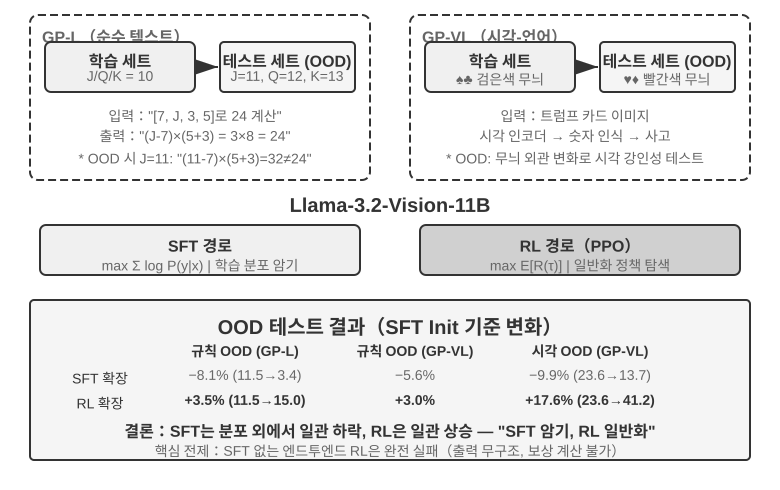
>
>
> GeneralPoints는 Chu 등(2025, 《SFT Memorizes, RL Generalizes》, arXiv:2501.17161)이 제안한 산술 사고 카드 게임으로, 모델의 일반화 능력을 평가하기 위해 특별히 설계됐다. 과제 목표는 '24 만들기' 게임과 비슷하다. 네 장의 카드 숫자를 사칙연산으로, 각 숫자를 정확히 한 번씩 써서 목표 숫자 24를 만드는 것이다. 실험은 순수 텍스트 GP-L과 이미지 GP-VL 두 변형을 설계해, 같은 틀 안에서 규칙 일반화와 시각 일반화를 각각 살필 수 있게 했다.
>
> **규칙 변형**: 훈련 때 J/Q/K를 모두 10으로 계산하고, 테스트 때 각각 11/12/13으로 계산해, 테스트셋에 훈련에서 보지 못한 숫자 조합(11, 12, 13을 포함한 연산)이 등장하게 해, 일반화 능력을 엄격히 평가한다. **시각 변형**: 훈련은 검은 색 무늬(♠♣), 테스트는 빨간 색 무늬(♥♦)로, 시각 외양 변화 아래의 견고성을 평가한다. Llama-3.2-Vision-11B에 기반해, 표준 포스트트레이닝 흐름을 따른다. 먼저 SFT로 초기화해 기본적 지시 준수 능력을 심고, 같은 계산 예산 아래 SFT와 RL 훈련을 각각 확장(RL 부분은 가치망을 동반한 PPO 알고리즘), 단일 규칙(J/Q/K=10) 데이터로 훈련해, 분포 내(ID)와 분포 외(OOD) 테스트셋에서 평가한다.
>
> 결과는 근본적 차이를 또렷이 드러낸다. **규칙 OOD**: RL은 GP-L에서 +3.5%(11.5%→15.0%), SFT는 **8.1% 하락**(11.5%→3.4%); GP-VL에서는 RL +3.0%, SFT 5.6% 하락. **시각 OOD**: RL은 GP-VL에서 **+17.6%**(23.6%→41.2%), SFT는 9.9% 하락(23.6%→13.7%).
>
> 시각 인식 정확도를 추적해 보니, RL은 결과 지향적 최적화로 기반 시각 인코더를 개선했고, 이 개선이 전체 성능 향상과 고도로 상관됐다. 반면 SFT는 사고 과정의 토큰 패턴에 과잉 적합해 시각 토큰 학습을 홀시해, 인식 정확도가 오히려 떨어졌다.
>
> 실험은 또 SFT가 RL에 대한 필요성도 드러낸다. 이 실험의 설정(Llama-3.2-Vision-11B급 기반 모델 + 엄격한 구조적 출력 요구)에서, SFT 없이 직접 종단 간 RL을 하면 완전히 실패한다. 기반 모델이 구조적 출력을 만들어내지 못해 보상을 계산할 수조차 없다. 주의: 이것은 특정 설정에서의 결론이지 보편적 법칙이 아니다. 충분히 강한 기반 모델은 SFT를 건너뛰고 직접 RL로 성공할 수 있다(앞서 DeepSeek-R1-Zero 논의 참조). 또 주목할 발견 하나: 검증 반복 횟수가 많을수록 일반화가 좋다. 10회 +5.99% vs 1회 +0.48%. 사고 시 계산 확장이 RL 일반화의 열쇠임을 보여준다.
>
> 왜 SFT는 분포 변화에서 성능이 무너지는데 RL은 오히려 더 나은가? SFT가 배우는 것은 '이런 입력을 보면, 저런 답을 출력하라'는 매핑이다. 훈련 때 J/Q/K가 모두 10이라, 모델은 'J/Q/K를 보면 10으로 쓴다'는 고정 패턴을 기억한다. 테스트 때 J=11이어도 여전히 10으로 계산해서 자연스레 틀린다. RL이 배우는 것은 '어떤 계산 과정이 올바른 답을 이끌어내는가'라는 더 보편적 전략이다. J가 11로 바뀌면 RL 모델은 기억 속 답을 갖다 쓰는 게 아니라 같은 전략으로 다시 계산한다. 이것이 '기억'과 '일반화'의 본질적 차이다.
>
> 이 실험의 핵심 기여는 'SFT는 기억하고 RL은 일반화한다'는 현상을 체계적으로 정량화한 데 있다. 이 법칙이 순수 언어와 시각-언어 두 모달리티 모두에서 성립함을 증명하고, SFT와 RL의 시너지 관계를 드러낸다. SFT는 형식 안정성을 제공하고, RL은 그 위에서 기억의 경계를 돌파한다. 둘 중 하나도 빼놓을 수 없다. 이 '먼저 형, 그 다음 신'의 훈련 패러다임 — 중국화의 용어를 빌려, 먼저 겉모습(형식, 구조)을 정확히 그리고, 다음 내면의 신운(일반화, 전략)을 추구하는 — 은 이어지는 다중 라운드·다모달 과제의 방법론 기초가 된다.

## RLHF: 인간 선호에서 보상 모델로

앞의 실험에는 공통 전제가 하나 있었다. 과제에 검증 가능한 옳고 그름이 있다는 것. 수식이 맞는지, 형식이 규격에 맞는지, 규칙 검증기가 점수를 매길 수 있다. 그런데 현재 배포되는 대화 모델이 '예의 바르고 안전한 조수 같다'인 것은, 더 일찍 성숙한 다른 노선에 힘입은 바 크다. 바로 **RLHF**(Reinforcement Learning from Human Feedback, 인간 피드백 기반 강화학습)다. RLHF를 이해하는 것은, ChatGPT 같은 제품의 대화 품질과 안전 정렬이 어디서 왔는지 이해하는 것이기도 하고, 뒤의 각 알고리즘에서 등장하는 KL 벌점, reward hacking 같은 개념을 이해하는 전제이기도 하다.

**InstructGPT의 3단계 파이프라인.** OpenAI의 InstructGPT[^ch7-4]가 지금까지 통용되는 표준 흐름을 세웠다.

1. **SFT**: 인간 시범의 '지시-답변' 쌍으로 사전훈련 모델을 미세조정해, 기본적 지시 준수 능력을 세운다. 앞서 'SFT(감독 미세조정)' 절에서 논의한 내용이다.
2. **보상 모델(Reward Model, RM) 훈련**: 같은 프롬프트에 대해 모델이 여러 답을 만들면, 인간 라벨러가 둘을 비교해 어느 쪽을 더 선호하는지 표시한다. 이 선호 쌍으로 점수 매기기 모델을 훈련한다. 훈련 목표는 Bradley-Terry 모델에 기반한다.

   $$\mathcal{L}_{\text{RM}} = -\log \sigma\big(r(x, y_w) - r(x, y_l)\big)$$

   여기서 $y_w$는 선호된 답, $y_l$은 거부된 답, $\sigma$는 시그모이드 함수다. 직관은 아주 단순하다. **RM이 선호된 답에 더 높은 점수를 주게 하는 것.** 점수 매기기 대신 비교를 수집하는 이유는, 인간이 일관되게 절대점수를 주기 어렵기 때문이다('이 답은 7.3점'은 거의 일관되게 라벨링할 수 없다). 그러나 'A와 B 중 어느 쪽이 더 나은가'라는 판정은 훨씬 신뢰할 만하다. **'보상 모델'이라는 역할을 기억두자. 이것은 이 장의 한 암선이다.** 여기서는 인간 선호에서 학습된 점수 매기기이다. 7.10절의 보상 설계에 이르면, 이것의 여러 변형(최종 결과만 보는 ORM, 단계별로 점수를 매기는 PRM, 자연어로 이유를 말하는 생성형 보상 모델)과 한 특례를 보게 된다. 옳고 그름을 규칙으로 곧바로 판정할 수 있을 때는, '보상 모델'이 아예 결정론적 코드 한 덩어리로 퇴화한다(이것이 곧 아래의 RLVR이다). 이들이 모두 같은 질문에 답한다. **보상은 어디서 오는가.**
3. **RM 점수로 PPO**: RM의 점수를 보상 신호로 삼아, SFT 모델에 PPO 훈련을 한다(PPO의 메커니즘은 다음 절 참조). 모델이 RM이 '인간이 더 좋아할' 답이라고 여기는 것을 만들게끔 가르친다.

**KL 벌점: 출발점에서 너무 멀어지지 말 것(KL 발산을 속까지 파헤치기).** RLHF에서 모델이 실제로 최적화하는 보상은, 보통 RM 점수 자체가 아니라 거기서 하나의 벌점 항을 뺀 것이다.

$$r = r_{\text{RM}} - \beta \cdot \mathrm{KL}\big(\pi_\theta \,\|\, \pi_{\text{ref}}\big)$$

이 한 식에는 초보자가 자주 묻는 질문 네 가지가 들어 있다. 하나하나 풀어 설명한다.

**(1) KL 발산이란 무엇이고, 벌점은 어디에 더하는가?** KL 발산(Kullback-Leibler Divergence)은 두 확률 분포의 차이를 잰다. 두 분포가 비슷할수록 KL은 작아지고, 완전히 같으면 0이며; 다를수록 KL은 커진다. 여기서의 두 분포는 **현재 정책** $\pi_\theta$(훈련 중인 모델)과 **참조 정책** $\pi_{\text{ref}}$(훈련 출발점, 보통 바로 그 SFT 모델)이 같은 앞문장에 대해 내놓는 '다음 토큰 확률 분포'다. $\beta$는 벌점 강도를 결정한다. 훈련 스크립트에서 흔히 보는 `kl_coef` 하이퍼파라미터가 바로 이것이다. 공학적으로 이 벌점은 **토큰마다 자리에서 계산돼 보상에 더해진다**(per-token KL). 모델이 토큰을 하나 생성할 때마다, 그 자리에서의 확률 차이를 참조 모델과 비교하고, 많이 벗어날수록 그 단계의 보상에서 더 많이 깎인다. 즉 KL은 따로 떨어진 하나의 손실이 아니라 **보상 신호에 섞여 들어가**, PPO/GRPO의 어드밴티지 계산을 그대로 통과한다. 이것이 KL이 작용하는 정확한 위치다.

**(2) 왜 방향이 '현재 정책이 앞, 참조 정책이 뒤'인가?** KL 발산은 비대칭이라 $\mathrm{KL}(P\|Q)\neq\mathrm{KL}(Q\|P)$이며, 방향은 마음대로 쓴 게 아니다. 여기서 $\mathrm{KL}(\pi_\theta\|\pi_{\text{ref}})$, 즉 현재 정책이 앞에 온다. 수학적으로 **역방향 KL(reverse KL)**이라 한다. 역방향 KL이 벌하는 것은 '$\pi_\theta$가 어느 자리에서는 높은 확률을 줬는데, $\pi_{\text{ref}}$는 그 자리에서 거의 0'인 경우다. 즉 **모델이 참조 모델이 '가면 안 된다'고 여기는 곳으로 가는 것을 벌한다**. 이것이 바로 우리가 바라는 것이다. 참조 모델(SFT 모델)은 '사람 말 같고, 형식이 정상인' 안전 구역을 대표하고, 역방향 KL은 현재 정책을 이 안전 구역 근처에 눌러 두어 마음대로 흩날리지 않게 한다. 거꾸로 **정방향 KL** $\mathrm{KL}(\pi_{\text{ref}}\|\pi_\theta)$을 쓰면, 벌받는 것은 '참조 모델은 있는데 현재 모델이 빠뜨린' 패턴이 된다. 그러면 모델이 참조 모델의 온갖 표현 방식을 다 덮어야 한다고 강요받게 되는데, 이것은 결코 RLHF의 목적이 아니다.

**(3) 왜 이렇게 설계했는가? — mode-seeking의 유래.** 역방향 KL에는 핵심적 성격이 하나 있다. **mode-seeking(최빈 탐색)**이라는 것이다. 7.1절에서 복선을 깔아두었다. 역방향 KL은 모델이 **소수의 보상이 높은 '봉우리' 몇 개만 남기고 나머지 패턴은 과감히 버리게** 허용한다. SFT의 최대가능도(mass-covering, 덮기식)처럼 골고루 나눠 갖지 않아도 된다. RLHF에 이것을 놓으면, 바로 우리가 원하는 효과가 된다. RM이 인정하는 고품질 답 방식 중 한두 가지를 골라 안정적으로 출력하고, 가능한 모든 답을 다 배우는 일은 하지 않는 것이다. 이것은 또 RL 뒤의 모델이 왜 더 '확신에 차 있고' 다양성이 더 낮은지를 설명한다. 역방향 KL의 mode-seeking + 모델을 참조 분포 근처에 눌어붙게 한다. 둘을 합친 것이 RLHF의 안정성 비결이다.

**(4) 안 더하면 어떻게 되는가?** 직관은 한 줄이다. **출발점에서 너무 멀어지지 말라. 그렇지 않으면 보상 모델의 점수를 믿을 수 없다.** RM은 참조 정책 근처의 출력 분포에서 훈련된 것이어서, 모델이 RM이 본 적 없는 분포로 최적화되면 RM 점수는 근거 없는 외삽이 되고, 고득점이 더 이상 고품질과 같지 않게 된다. 그래서 KL 벌점은 두 가지를 동시에 막는다. **reward hacking**(모델이 보상의 허점을 파고들어 진짜로 과제를 잘하는 대신 고득점만 노리는 것. 다음 단락 참조)과 **분포 붕괴**(출력이 반복·난수 같은 극단적 형태로 퇴화하는 것). 검증 가능 보상의 RLVR 훈련에서도 KL 정칙은 흔히 훈련 안정화를 위해 남겨둔다(DAPO, Open-Reasoner-Zero 등 소수 연구가 의도적으로 이를 뺀다. 단 DeepSeek-R1-Zero의 GRPO 자체는 여전히 KL 항을 명시적으로 포함한다).

**보상 모델은 '과잉 최적화'된다.** RM은 결국 인간 선호의 대리 지표(proxy)다. 구드하트 법칙은 이렇게 말한다. 하나의 지표가 최적화 목표가 되면, 그것은 더 이상 좋은 지표가 아니다. 대리 지표를 극단까지 밀어붙이면, 진짜 목표와의 상관성이 왜곡된다. OpenAI의 연구[^ch7-5]는 이 **보상 모델 과잉 최적화(reward model over-optimization)** 현상을 체계적으로 측정했다. RL 훈련이 진행됨에 따라, 대리 보상(RM 점수)은 단조 상승하는 반면, 진짜 품질(인간 평가)은 먼저 오르다가 나중에 떨어진다. 모델이 점차 배우는 것은 '더 잘 답하기'가 아니라 'RM에게 고득점 받기'다. 장황하고, 아첨하고, 겉보기엔 엄밀해 보이는 빈말. 이것이 바로 reward hacking이 RLHF 맥락에서 취하는 구체적 형태이며, KL 벌점과 조기 종료가 가장 흔한 완화 수단이다. 장 말미 '흔한 함정'의 보상 해커 문제도 같은 뿌리다.

**DPO: 명시적 보상 모델 건너뛰기.** DPO(Direct Preference Optimization, 직접 선호 최적화)[^ch7-6]의 출발점은 이렇다. 'RM 훈련 + PPO' 조합이 결국 이끌어내는 효과가 '선호된 답의 확률을 높이고, 거부된 답의 확률을 낮추되, 참조 모델에서 너무 멀어지지는 않는 것'이라면, 차라리 명시적 RM을 건너뛰고 선호 쌍을 직접 암시적 보상이 있는 분류 손실로 바꾸는 게 낫겠다. 수학적으로 이것이 KL 제약이 붙은 오프라인 선호 최적화와 동등함을 증명할 수 있고, 보상 모델은 정책 자체 안에 암시적으로 숨겨진다. DPO 훈련은 SFT처럼 단순하다. 온라인 샘플링이 필요 없고, 가치망도 필요 없고, 별도의 RM을 유지할 필요도 없다. 대가는 완전히 오프라인이라는 것이다. 선호 데이터 바깥의 새 행동을 탐색할 수 없고, 성능의 천장은 선호 데이터의 품질과 커버리지로 결정된다.

**RLHF와 RLVR의 관계.** 정리하면, 두 노선의 차이는 **보상이 어디서 오는가**에 있다. RLHF의 보상은 학습된 RM(그 뒤는 인간 선호 데이터)에서 오고, **RLVR**(Reinforcement Learning with Verifiable Rewards, 검증 가능 보상 강화학습)의 보상은 규칙 검증기(테스트 통과 여부, 답의 정확성)에서 온다. 에이전트 과제는 대부분 검증 가능하다. 그래서 이 장은 RLVR을 메인 라인으로 삼는다. 단 둘은 택일 관계가 아니다. 실제로 배포되는 모델은 둘을 겹쳐 쓴다. RLHF가 대화 품질과 안전 정렬을 맡고, RLVR이 추론과 에이전트 능력을 맡는다. 뒤의 '보상 패러다임의 진화'에서 논의하는 생성형 보상 모델은 두 노선이 합류하는 지점으로 볼 수 있다. 학습 가능한 보상 모델로 규칙이 덮지 못하는 개방적 과제를 끌어안는 것이다.

## 강화학습 알고리즘 비교

앞의 단일 라운드 실험은 RL의 일반화 우위를 증명했고, 바로 앞 절은 RLHF의 선호 최적화 노선을 끌어들였다. 그러나 이 연구들이 쓰는 구체적 알고리즘은 저마다 다르고, 또 많은 선택지 중 일부일 뿐이다. 더 복잡한 다중 라운드 과제로 들어가기 전에, 주류 알고리즘의 특징과 적용 상황을 체계적으로 정리할 필요가 있다.

> **가장 중요한 말 한마디 먼저 하자. 독자가 공식에 빠지지 않도록.** 이 절에 알고리즘 이름과 공식이 적지 않게 나오지만, 이 장의 메인 라인 2를 기억하자. **산업계에서는, 있는 RL 알고리즘(PPO, GRPO 등)을 어떻게 쓰는지 알고 고를 줄만 하면 충분하다. 진짜 성파를 가르는 것은 알고리즘이 아니라 데이터와 환경이다.** 이들 알고리즘은 이미 veRL, TRL 같은 성숙한 프레임워크에 포장돼 있어, 호출은 대개 설정 몇 줄만 바꾸면 된다. 그래서 이 절의 목표는 독자가 공식을 유도할 줄 있게 하는 것이 아니라, '어떤 상황에 어떤 알고리즘을 쓸까'의 선택 지도를 세우는 것이다. 공식 부분(훈련 엔지니어 대상)은 이해가 안 가면 건너뛰어도 뒤의 읽기에 영향을 주지 않는다. 다음 절에서 '왜 데이터와 환경이 알고리즘보다 중요한가'를 정면으로 다룬다.

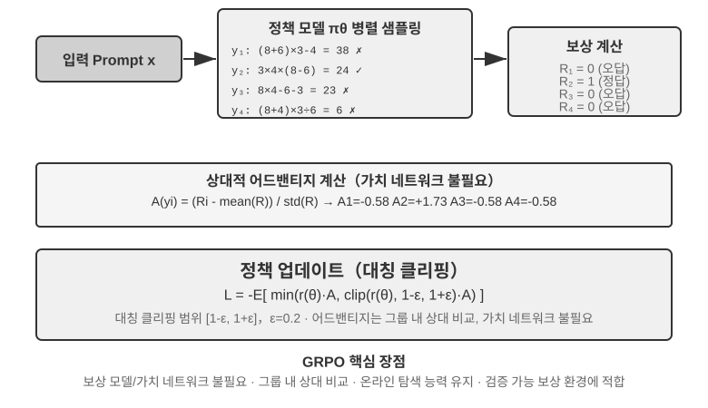

현대 LLM 에이전트의 RL 상황은 전통적 RL과 본질적 차이가 있다. 에이전트는 다중 라운드 대화 속에서 사용자 의도를 이해하고, 도구를 호출하며, 구조화된 출력을 만들고 긴 사슬 사고를 해야 한다. 이런 다목적·다단계 결정은 '알고리즘을 잘 고르는 것'이 어느 정도 영향을 주게 하지만, 그 영향은 데이터와 환경에 미치지 못한다.

구현 경로로 보면, RL 알고리즘은 **온라인 탐색 방법**(환경과 상호작용하며 새 전략을 탐색)과 **오프라인 최적화 방법**(이미 있는 데이터로 최적화, 더 안정적이고 직접적)으로 나뉜다. 여기서 앞서 약속한 한 쌍의 엄격한 용어를 짚고 넘어가자. **온폴리시 정책(On-Policy)** 방법은 현재 정책이 새로 샘플링한 데이터로만 자기를 갱신하고, **오프폴리시 정책(Off-Policy)** 방법은 다른 정책(또는 옛 버전 정책)이 만든 데이터로도 학습할 수 있다(앞서 Q-learning이 그렇다). 이 기준으로 이 장에서 논의한 방법들을 맞춰 보자. SFT는 오프폴리시적 모방 학습이다. 데이터가 모델 자신이 아닌 교사나 인간 시범에서 온다. PPO, GRPO의 LLM 훈련에서의 표준 형태는 온폴리시다. 매 라운드 현재 모델이 새로 샘플링한 rollout(모델이 과제를 끝까지 한 번 완전히 돌아 처음부터 끝까지의 궤적을 만드는 것)으로 갱신한다. DPO는 오프라인 선호 최적화로, 온라인 샘플링도 하지 않고 엄밀한 의미의 정책 반복도 하지 않는다.

이들 알고리즘은 대부분 **정책 경사(Policy Gradient)**라는 같은 아이디어 위에 세워져 있다. '기대 보수를 높여 주는 방향으로' 정책 파라미터 $\theta$를 조정하는 것이다. 가장 기본적 형태(REINFORCE)는 이렇다.

$$\nabla_\theta J(\theta) = \mathbb{E}\big[\nabla_\theta \log \pi_\theta(a \mid s)\, G\big]$$

여기서 $\pi_\theta(a\mid s)$는 정책(상태 $s$에서 동작 $a$를 고를 확률), $G$는 이 궤적(또는 이 단계 이후)의 누적 보수다. 보수가 높을수록 그 동작을 낼 확률을 더 강화한다. 궤적 전체의 보수 $G$를 곧바로 가중치로 쓰면 편향은 없지만 분산이 크다. 그래서 기준선 $b$를 도입하고, **어드밴티지**(Advantage) $\hat{A}=G-b$(이 동작이 평균보다 얼마나 나은가)를 가중치로 써 분산을 낮춘다. 이어지는 PPO와 GRPO는 본질적으로 '어드밴티지 $\hat{A}$를 어떻게 안정적으로 추정해 쓸까'에서 출발한 두 부류의 개선이다.

**PPO**는 '자르기'로 매 갱신의 폭을 제한해, 정책이 한 번에 빗나가지 않게 한다.

$$L^{\text{CLIP}}(\theta) = \mathbb{E}\Big[\min\big(\rho\,\hat{A},\ \operatorname{clip}(\rho,\, 1-\epsilon,\, 1+\epsilon)\,\hat{A}\big)\Big],\quad \rho = \frac{\pi_\theta(a\mid s)}{\pi_{\theta_{\text{old}}}(a\mid s)}$$

여기서 $\rho$는 새 정책과 옛 정책의 확률 비, $\epsilon$(예: 0.2)는 한 단계에서 조정할 수 있는 폭의 한계다. 뒤의 'Clip-Higher'는 바로 이 $1+\epsilon$ 상한을 완화한 것이다.

**GRPO**는 가치망(value network. PPO에서 추가로 훈련하는 보조 신경망으로, 궤적의 각 단계마다 가치 함수를 따로 추정해 더 정치한 어드밴티지를 냄)을 아예 빼고, '그룹 내 상대 비교'로 어드밴티지를 추정한다. 같은 문제에 $N$개 궤적을 샘플링해 보수 $r_1,\dots,r_N$을 얻고, 각 궤적의 어드밴티지를 그룹 내에서의 상대적 우열로 정의한다.

$$\hat{A}_i = \frac{r_i - \operatorname{mean}(r_1,\dots,r_N)}{\operatorname{std}(r_1,\dots,r_N)}$$

즉 '같은 그룹의 평균보다 나으면 양수, 못하면 음수'로, 가치망이 필요 없다. 이것이 비용이 더 낮은 이유다. 밝혀둘 것: 위 식은 KL 정칙 항을 생략했고, 실제 훈련에서는 보통 앞 절에서 소개한 per-token KL 벌점을 더해, 정책을 참조 모델 근처에 묶어 둔다.

표 7-4는 주류 방법의 핵심 특징을 정리한다. 읽을 때 자주 뒤섞이는 두 가지를 구분하자. **보상이 어디서 오는가**(규칙 검증기, 학습된 보상 모델, 인간 선호 데이터)와 **어떤 알고리즘으로 최적화하는가**. PPO와 GRPO는 보상 출처를 가리지 않는다. 규칙 검증기(RLVR)에도, 보상 모델(RLHF)에도 연결할 수 있다. 둘의 진짜 차이는 어드밴티지 추정 방식(가치망 vs 그룹 내 상대 기준선)에 있다.

표 7-4 포스트트레이닝 및 추론 시 최적화 방법 비교

| 방법 | 유형 | 핵심 발상 | 장점 | 단점 | 적용 상황 |
|--------------|-----|-------------------|---------------|--------------------|----------------------|
| **REINFORCE** | 온라인 RL 알고리즘 | 궤적 전체의 최종 보상으로 정책 갱신 | 구현 단순 | 분산 크고 훈련 불안정 | 이론 기준; 원시 형태는 거의 직접 안 쓰지만, 기준선을 붙인 변형(RLOO, REINFORCE++ 등)이 현재 주류 중 하나이며, GRPO는 본질적으로 그룹 내 기준선을 붙인 REINFORCE다 |
| **PPO** | 온라인 RL 알고리즘 | 매 갱신 폭을 제한해 정책이 '빗나가'지 않게 | 안정적, 가치망이 더 정치한 신용 할당 제공 | 가치망을 별도로 훈련·저장해야, 하이퍼파라미터에 민감 | 다중 라운드 에이전트, 긴 궤적의 신용 할당 |
| **GRPO** | 온라인 RL 알고리즘 | 같은 문제에 여러 궤적 샘플링, 그룹 내 상대 비교로 '어느 쪽이 더 나은가' | 가치망 불필요, 비용 낮음 | 어드밴티지를 답 전체에 균분, 신용 할당이 거칠다; 그룹 내 보상에 구분도가 있어야 | 단일 라운드/짧은 궤적 과제, 보상 구분도가 좋은 상황 |
| **DPO** | 오프라인 선호 최적화 | 선호 쌍을 직접 암시적 보상이 있는 분류 손실로 | 극히 단순·효율, 온라인 샘플링 불필요 | 새 전략 탐색 불가, 오프라인 선호 데이터의 품질·커버리지에 제한 | 고품질 선호 데이터가 있는 상황 |
| **KTO** | 오프라인 선호 최적화 | 단일 샘플에 '좋음/나쁨' 라벨만 있으면 됨 | 라벨링 비용 극히 낮음 | 신호가 거칠다 | 라벨링 자원이 극히 제한된 상황 |
| **Best-of-N** | 추론 시 방법 | 추론 시 N개 출력을 만들어 최적을 고름 | 모델을 안 바꿈, 구현 단순 | 추론 비용이 배로, 능력이 파라미터에 가라앉지 않음 | 초기의 빠른 품질 향상, RL의 수익 상한 추정치 제공 |

이 장의 실험으로 돌아가, 각각의 알고리즘을 사실대로 밝힌다. GeneralPoints와 V-IRL(실험 7-11, 7-12)은 같은 연구에서 나왔고 가치망을 동반한 PPO를 쓴다. AdaptThink(실험 7-10)는 정의한 제약 최적화 목표에 중요도 샘플링을 더한 것이다. 뒤의 ReTool(실험 7-15)은 veRL 기반으로 개조한 PPO를 쓰고(훈련 데이터는 DAPO-Math-17k에서 따오되, 최적화 알고리즘은 여전히 PPO), SimpleVLA(실험 7-13)와 RLVP(실험 7-14)는 GRPO에 기반한다. 다중 라운드 상황에서는 신용 할당 문제가 더 복잡해져, 각 알고리즘마다 장단이 있다.

실천에서의 선택 경로: 신뢰할 보상 신호가 있고 계산 자원이 있으면 → GRPO(간결) 또는 PPO(유연, 긴 궤적 신용 할당이 더 정치). 고품질 선호 데이터가 있으면 → DPO/KTO(저비용). 초기 탐색 단계 → Best-of-N으로 빠른 출발.

이 표를 보고 나면 '그럼 대체 어느 알고리즘을 정밀 튜닝해야 할까'라고 생각할 수 있다. 답은 뜻밖일 수 있다. **대부분의 경우, 어느 것이든 괜찮다. 알고리즘에서 일단 고민하지 말라.** 다음 절이 바로 이것을 전담해 다룬다.

## 데이터와 환경: 알고리즘보다 더 중요한 것

이것이 장 전체에서 필자가 독자에게 가장 기억해 주었으면 하는 절이며, 이 장의 메인 라인 2를 정면에서 서술한 것이다. 앞에서 알고리즘 이야기에 적지 않은 지면을 썼지만, 산업계 일선의 경험은 정반대다. **알고리즘의 중요성은, 세 가지 더 기초적인 요소에 미치지 못한다. 시뮬레이션 환경의 충실도, 훈련 데이터의 품질, 기반 모델의 능력.** 있는 알고리즘을 쓸 줄만 알면 되고, 진짜 격차를 가르는 것은 환경과 데이터를 얼마나 잘 갖추느냐다. 이것은 6장의 결론(평가와 시뮬레이션 환경이 포스트트레이닝의 기초석)과도, 이 장 7.2절에서 언급한 OpenAI의 인식 역전에도 부합한다. 수십 년의 RL 연구가 우선순위를 거꾸로 정했다. 진짜 순서는 **사전 지식(기반 모델) > 환경 > 알고리즘**이다.

### 환경: 모델이 연습하는 장

RL의 본질은 '시행착오 학습'이고, 시행착오에는 반드시 **시행착오할 장**이 있어야 한다. 그것이 시뮬레이션 환경(simulation environment)이다. 모델은 환경 안에서 과제를 반복해 돌고, 피드백을 받고, 전략을 조정한다. 환경의 **충실도**(실제 배포 상황과 얼마나 닮았는가)가 훈련된 전략이 쓸모 있는지를 직접 결정한다.

- **환경이 틀리면 전략도 망가진다.** 시뮬레이션의 고객 서비스가 늘 정해진 방식으로만 답하고 오류 메시지가 운영 환경과 맞지 않으면, 모델은 시뮬레이션에서만 통하는 '시험 대비 전략'을 배우고, 실서비스에 올라가자마자 들통난다. 이것이 RL 프로젝트의 가장 흔한 전복 방식이다. 알고리즘이 못해서가 아니라, 연습장이 시험장과 딴판이어서 그렇다.
- **고충실도 환경 구축이, 흔히 훈련 자체보다 더 비싸고 더 어렵다.** 대규모 병렬이 가능하고, 재현 가능하고, 피드백이 진짜인 환경 하나에는, 모델을 조정하는 것보다 훨씬 더 많은 공학을 쏟아야 한다. 이 장 뒤의 도구 호출 실험(AWorld의 MCP 샌드박스, ReTool의 코드 인터프리터 샌드박스)이 환경 구축에 공을 들이는 이유가 바로 이것이다. **실제 API는 속도 제한이 있고, 계정이 정지되고, 부작용이 있어, 그대로 훈련에 쓸 수 없다.** 먼저 안정적이고 통제 가능하고 되돌릴 수 있는 '그림자 세계'를 지어야 한다.
- **환경의 나머지 절반은 보상 함수다.** 환경은 '세상이 어떻게 변하는가'만 모방하는 게 아니라, '얼마나 잘했는가'도 판정할 수 있어야 한다. 이것이 보상 신호의 출처다. 보상 설계는 환경 공학의 일부이며, 다음 절에서 전담해 펼친다.

한 줄 요약. **알고리즘을 손대기 전에 먼저 자문하라. 내 시뮬레이션 환경은 정말로 현실 세계와 닮았는가?** 이 질문의 답이 PPO를 고를까 GRPO를 고를까보다 훨씬 중요하다.

### 데이터: 가장 핵심적인 한 고리, 그리고 품질이 모든 것을 이긴다

환경이 장이라면, **데이터는 교재이며, 3대 요소 중 가장 핵심적인 한 고리**다. 여기서 말하는 '데이터'는 SFT 단계에서는 시범 샘플(입력-출력 쌍)을, RL 단계에서는 과제 분포와 보상 신호를 가리킨다. 어느 단계든 한 가지 철칙이 있다.

> **데이터 품질이 알고리즘을 이긴다.** 아무리 정교한 알고리즘도, 더러운 데이터, 커버리지가 부족한 데이터, 체계적 편향이 있는 데이터를 넣으면 배워 나오는 것도 더러운 전략뿐이다. SFT는 데이터 속의 잡음과 편견을 한 글자 틀림없이 파라미터에 고정한다. RL은 편향된 보상을 향해 죽어라 최적화해, 잘못된 방향으로 갈수록 더 멀리 간다(이것이 reward hacking의 온상이다). **Garbage in, garbage out**은 포스트트레이닝에서 유감없이 발휘된다.

더 나아가, 많은 팀이 아직 통과하지 못한, 그러나 돈을 엄청나게 아껴주는 판단 하나가 있다.

> **많은 상황에서, SFT 데이터 품질만 제대로 갖춰지면 RL을 아예 할 필요가 없다.** RL은 비싸고 불안정하다(비용이 보통 SFT의 수십에서 수백 배). 그런데도 사람들은 흔히 처음부터 RL을 올리려 한다. 하지만 과제 분포가 예측 가능하고, 충분히 다양하고 충분히 고품질인 시범 데이터를 손에 넣을 수 있다면, 튼튼한 SFT 하나로 요구를 충족하는 경우가 많다. RL이 진짜로 대체 불가능한 상황은 한정돼 있다(7.5절 참조). 배포 분포가 체계적으로 표류하고, 전문가 시범 자체가 최적이 아니거나, 라벨링 비용이 너무 커 각 경로마다 시범을 대기 어려울 때. **먼저 SFT 데이터를 잘 만들고, 그 다음 정말 RL이 필요한지 판단하라.** 이 순서가 컴퓨팅 자원과 시간을 크게 아껴준다.

한 가지 설득력 있는 업계 사례는 Anthropic이다. 2025년 이전에, 그것의 포스트트레이닝 레시피는 주로 두 축이었다. **방대한 고품질 데이터로 SFT**, 그리고 **RLAIF**(Constitutional AI의 'AI 피드백 기반 강화학습', Bai 등 2022, 한 부의 '헌법'으로 모델이 스스로 답에 점수를 매우게 해 정렬하는 것). 그런데 **오늘날 코드·추론에서 표준이 된 RLVR(검증 가능 보상 강화학습)에는 별로 의존하지 않았다**. 그럼에도 당시 코딩 모델 품질이 이미 매우 뛰어났다. 원인은 상당 부분 알고리즘이 아니라 SFT와 RLAIF 두 축의 데이터 품질을 극치까지 끌어올린 데 있다. 이것이 위의 판단을 뒷받침한다. **SFT 데이터가 충분히 좋으면, 그다지 화려하지 않은 레시피로도 톱급 모델을 훈련할 수 있다. 복잡한 검증 가능 보상 RL이 반드시 필요한 것은 아니다.** 물론 RL이 쓸모없다는 뜻은 아니다. 2025년 이후 Anthropic도 RL 투자를 눈에 띄게 늘렸다. 데이터라는 기초 위에서 RL이 능력의 상한을 한 단계 더 끌어올려 주는 것이다. **데이터가 어디까지 갈 수 있는지를 정하고, RL이 그 위에서 얼마나 더 높일 수 있는지를 정한다.**

데이터 품질이 구체적으로 무엇을 뜻하는가? 적어도 세 차원이 있다. **커버리지**(배포 때 만날 다양한 상황, 특히 긴 꼬리와 경계 상황을 덮는가), **다양성**(시범 속의 화자·스타일·풀이가 충분히 풍부한가, 그렇지 않으면 모델이 단일 패턴으로 무너진다. 예: 실험 7-6에서 '모두가 한 톤'), **라벨링 정확도**(시범 답안 자체가 옳은가. 사고 사슬 증류에서는 특히 틀린 사고 과정까지 학생이 모방하므로, 실험 7-9에서 규칙 검증기로 답이 틀린 궤적을 먼저 걸러 낸다). 이 세 가지에 투자한 대비 효과는, 보통 더 화려한 알고리즘으로 갈아타는 것보다 훨씬 높다.

실행 차원에서, **거부 샘플링이 바로 '라벨링 정확도'를 최대한 끌어올리는 표준 동작**이다. 흐름은 정해져 있다. 각 프롬프트마다 후보 k개를 샘플링(실제로 k는 4~16이 흔함) → 규칙 검증기, 단위 테스트 또는 정답으로 옳고 그름을 판정(자동 검증기가 없는 과제에서는 보상 모델이나 강한 모델의 점수로 대체) → 검증을 통과한 궤적만 남기고, 중복을 빼고 같은 프롬프트에서 너무 많이 남기지 않아, 데이터가 소수의 단순 문제로 무너지지 않게 → 남긴 데이터로 SFT 한 라운드. 모델이 강해지면 다시 샘플링하고 거르기를 반복. 이것이 바로 STaR, RFT 류의 셀프부트스트랩 방법의 핵심 순환이다. '데이터 품질이 알고리즘을 이긴다'는 구호를 실행 가능한 파이프라인으로 바꾼 것이다. 새 알고리즘은 필요 없고, 신뢰할 수 있는 검증기 하나와 충분한 샘플링 예산만 있으면 된다.

9장은 다시 이 판단을 되뇌인다. 음성 인식에서 모델이 '말을 거둬들여야 할까'가 항상 흔들리는 것은, 모델 구조가 아니라 훈련 라벨이 '신의 시점'으로 매겨져 있기 때문이다. 라벨을 '결정 순간에 손에 넣을 수 있는 정보만으로' 바꾸면 문제가 사라진다. **대개의 경우, 데이터가 구조보다 더 결정적이다.**

### 그럼 언제 비로소 알고리즘 차례인가?

알고리즘이 아예 중요하지 않다는 뜻이 아니라, 알고리즘 자리는 뒤쪽이라는 뜻이다. 합리적인 역량 배분 순서는 이렇다. **먼저 강한 기반 모델을 고르고 → 다음 환경과 데이터를 다듬고 → 마지막에야 알고리즘과 하이퍼파라미터에서 한계 최적화를 한다.** 환경이 충분히 진짜고, 데이터가 충분히 좋고, 기반 모델이 충분히 강해야 비로소 알고리즘 사이의 차이가 드러난다. 그때야 'GRPO인가 PPO인가, Clip-Higher를 넣을까' 같은 질문이 진지하게 튜닝할 가치를 갖는다. 거꾸로 환경과 데이터가 안 된 채 알고리즘부터 파고드는 것은, 남으로 가려고 북으로 가는 격이다. 이 우선순위를 가지고, 우리는 다중 라운드 과제로 들어간다. 거기서는 보상 설계(데이터와 환경이 만나는 지점)가 성패를 가르는 핵심이 된다.

## 단일 라운드에서 다중 라운드로: 신용 할당과 보상 설계

### 다중 라운드 과제의 핵심 난제

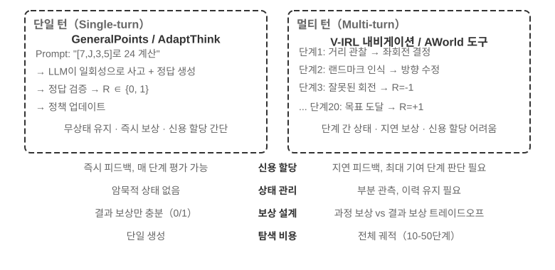

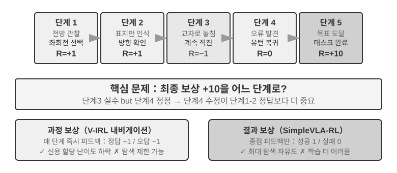

단일 라운드에서 다중 라운드로 가면, 복잡성이 질적으로 도약한다. 정책은 현재의 최적 동작만 고르는 게 아니라 미래의 상태 가치까지 고려해야 한다. 즉각적 피드백만 처리하는 게 아니라, 지연 보상 아래에서 **신용 할당(Credit Assignment)**을 해야 한다. 여러 단계의 시퀀스에서 결국 어느 단계가 최종 결과에 가장 크게 기여했는지 판정하는 것이다. 예컨대 어떤 고객 서비스 에이전트가 10라운드 대화로 사용자 문제를 해결하고 결국 좋은 평가를 받았다면, 이 좋은 평가는 2라운드의 정확한 질문 덕인가, 7라운드의 끈기 있는 설명 덕인가? 다중 라운드는 또 다른 난제를 가져온다. **부분 관측 가능성**(에이전트가 완전한 상태를 얻지 못하고, 과거 관측으로부터 함축적 상태 표현을 구성해야 한다).

여기서 논의하는 다중 라운드 상호작용의 물리적 형태는 바로 1장과 4장에서 기술한 ReAct 루프다. 매 라운드가 **사고 → 행동 → 관측**의 한 번 반복이며, 보상의 지연은 '최종 결과의 좋고 나쁨을 여러 라운드 뒤에야 판정할 수 있다'는 구조적 제약에서 온다.

### 보상 신호의 밀도와 패러다임

이 소절에서 논의하는 보상 설계는 단일 라운드 과제에도 똑같이 적용된다. 다중 라운드에 두는 이유는, 다중 라운드의 신용 할당 난이도가 '얼마나 자주 피드백을 줄까, 어떤 형태의 피드백을 줄까'를 선택 사항에서 성패를 가르는 핵심으로 만들기 때문이다. 보상 신호에는 두 설계 차원이 있다. **밀도**(얼마나 자주 피드백을 주는가 — 이원/희소/과정 보상)와 **표현 형식**(피드백이 어떤 모습인가 — 스칼라/벡터/생성형).

다중 라운드 보상 설계를 논의하기 전에, 보상 신호의 설계 공간을 체계적으로 정리하자. 이것은 RL 훈련의 핵심 쟁점이며, 6장에서 논의한 자동화 평가와도 밀접히 연관된다. **잘 설계된 평가 환경은 흔히 고품질 훈련 환경으로도 개조할 수 있다.** 단 두 가지를 구분하자. '평가 환경을 재사용할 수 있다'와 '이 평가 데이터 한 묶음을 그대로 훈련에 가져가도 된다'는 같지 않다.

세 가지 예를 보자. **SWE-bench**는 이런 개조의 전형을 제공한다. SWE-Gym이 바로 그것을 기반으로 훈련 가능한 과제 묶음을 구축한 것이다(문제 설명이 입력, 패치가 감독 신호, 테스트 케이스가 보상 신호). 단 훈련에 가져가는 것은 새로 구축한 과제 묶음이고, OpenAI가 사람으로 선별한 **SWE-Bench Verified** 500문제 평가 부분집합은 훈련 데이터와 엄격히 격리돼야 한다. 한 번 훈련셋에 섞이면 평가는 의미를 잃는다(이것이 바로 이 장의 사고문제 10이 논의하는 긴장이다). **τ²-bench**의 완전한 궤적 기록(대화 이력, 도구 호출, 상태 변화)은 모방 학습에 귀중한 자료를 제공한다. 성공 궤적은 정 샘플, 실패 궤적은 라벨링 뒤 부 샘플이 된다. **AndroidWorld**의 파라미터화 템플릿은 무수한 변형을 대량으로 만들 수 있어, 자연스럽게 커리큘럼 학습을 지원한다. 단순한 단일 단계 조작에서 복잡한 앱 간 흐름으로 점진적으로 나아가는 식이다.

이런 예는 모두 같은 결론을 가리킨다. 평가 환경이 제공하는 보상 신호의 품질이 RL 훈련의 효율을 직접 결정한다. 단, 훈련에 쓰는 데이터와 평가에 쓰는 데이터를 분리한다는 전제 아래서다.

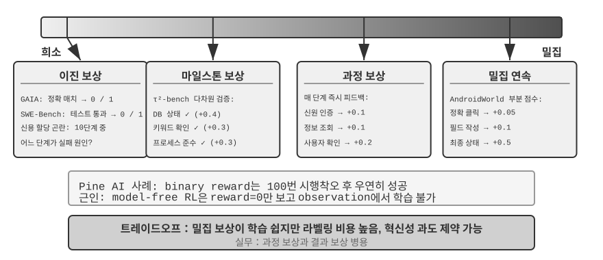

**이원 보상의 적용 상황.**

많은 과제에서, 가장 단순한 이원 보상(성공=1, 실패=0)이면 이미 충분하다. 예컨대 '수학 문제 하나 답하기' — 답은 맞거나 틀리거나 둘 중 하나이고 중간에 회색 지대가 없다. 또는 'SQL 질의 하나 실행하기' — 결과가 기대와 맞거나 맞지 않거나다. 이런 정답이 명확한 과제에서 이원 보상은 단순하면서도 신뢰할 만하고, 더 복잡한 설계가 필요 없다.

문제는 정답이 명확하지 않은 개방형 과제에서 생긴다.

**희소 보상의 곤경.**

Pine AI가 전화로 일을 처리하는 상황을 예로 들자. 이원 보상(binary reward, 성공=1, 실패=0)으로 에이전트가 사용자 대신 Xfinity에 연락해 요금제를 바꾸도록 훈련시킨다. 첫 번째엔 계좌 정보 챙기는 걸 잊어 실패 reward=0, 두 번째엔 신용카드 뒷자리를 잊어 reward=0, 세 번째엔 청구서 주소를 빠뜨려 reward=0... 100번의 시도 끝에 우연히 성공한다.

문제의 근원은 Silver와 Sutton이 《Welcome to the Era of Experience》에서 지적한 바와 같다[^ch7-8]. 현재 RL 방법은 최종 성패 결과에서만 배우면서, 환경이 주는 풍부한 피드백에서는 **배우지 못한다**. 고객 서비스가 '신용카드 뒷자리 4자리가 필요합니다'라고 분명히 말했고, 인간은 한 번 듣고 기억하는데, RL은 최종 결과 '실패'만 보고 왜 실패했는지 모른다. 더 골치 아운 것은, 10단계 흐름에서 앞의 9단계가 완벽하고 10단계만 틀려도 받는 신호는 그저 '전체 과제 실패'뿐, 구체적으로 어느 단계가 잘못됐는지 알 길이 없다. 이 장 뒤의 On-Policy Distillation과 검증 경로 벌점(RLVP) 같은 최전선 기술이 바로 이 곤경을 완화하려는 것이다.

**과정 보상(Process Reward)**은 실행 중 각 핵심 단계에 즉각적 피드백을 줘, 평가를 블랙박스에서 화이트박스로 바꾼다. 예컨대 코드 생성에서는 요구사항 이해, 코드 검색, 설계 방안, 코드 작성, 테스트 실행 등 각 단계를 따로 평가할 수 있고, 고객 서비스 상황에서는 신분 확인, 정보 조회, 확인, 결제 등 단계가 올바른지 검사할 수 있다. 다만 과정 보상은 라벨링 비용이 높고 창의성을 과도하게 제약할 수 있다는 도전에 직면하며, 실제로는 결과 보상과 협력해 쓴다.

**보상 패러다임의 진화.**

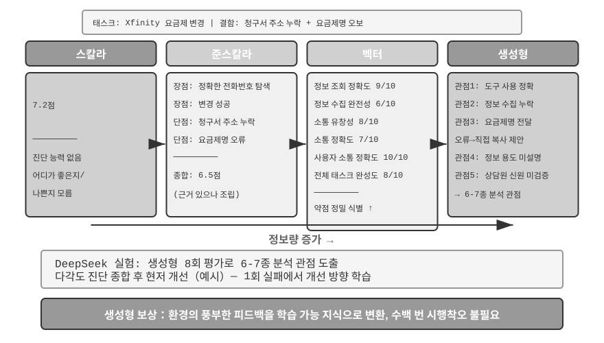

DeepSeek의 연구(Liu 등, 2025)는 스칼라—반스칼라—생성형이라는 연속 스펙트럼 위에서 여러 보상 패러다임의 학습 신호 차이를 체계적으로 해부한다. 그 위에 이 책은 벡터(다차원) 점수라는 차원을 하나 더 보탠다. 각 패러다임의 차이를 직관적으로 잡기 위해, 앞의 Pine AI가 전화로 Xfinity 요금제를 바꾸는 상황을 이어 쓰자. 이번에는 에이전트가 과제를 마쳤으나 흠이 있다. 청구서 주소를 빠뜨려 보충해야 하고,요금제 이름을 잘못 말해 Performance Pro를 Performance Plus라고 한 것이다(아래 점수는 모두 예시).

**스칼라 패러다임**: 7.2점을 준다 — 진단 능력이 전혀 없고, 어디가 좋았고 어디가 문제인지 모른다. **반스칼라 패러다임**: 먼저 장단점을 분석하고 6.5점을 준다 — 근거가 생겼지만 여전히 정보량이 제한적이다. **벡터 패러다임(이 책이 보충한 차원)**: 여러 차원에서 따로 점수를 매긴다 — 정보 조회 정확도 9/10, 정보 수집 완전성 6/10, 소통 유창성 8/10, 소통 정확도 7/10, 사용자 소통 정확도 10/10, 전체 과제 완성도 8/10. 이것은 건강검진 보고서처럼 문제를 정확히 찾아준다('정보 수집'이 6점이니, 정보 수집 단계의 프롬프트를 집중 최적화해야 한다).

**생성형 패러다임**: 자연어로 상세한 묘사를 하고, 여러 번 샘플링해 여러 각도에서 분석하는 것을 지원한다. 예시로, 같은 실행을 여러 번 샘플링해 평가하면 다른 측면을 덮는 분석 관점을 얻을 수 있고, 이 진단들을 종합해 개선하면 수익이 단순히 점수 하나만 받는 것을 훨씬 넘는다. DeepSeek 논문의 진짜 결론은 이렇다. 생성형 보상 모델은 추론 시 확장(여러 번 샘플링해 평가한 뒤 취합)으로 판정 품질을 지속적으로 끌어올릴 수 있고, 여러 보상 모델 벤치마크에서 모델 규모만 키운 스칼라 방안을 넘어섰다. 생성형 보상의 핵심 가치는, 환경의 풍부한 피드백을 학습 가능한 지식으로 바꿔, 에이전트가 한 번의 실패에서도 개선 방향을 배우게 하는 데 있다. 수백 번의 맹목적 시행착오가 필요하지 않다.

RLHF 관점에서 보면, 생성형 보상 모델은 앞서 Bradley-Terry 판별형 보상 모델의 진화로 볼 수 있다. 판별형 RM은 스칼라 점수 하나만 내고(누가 높고 누가 낮은지), 생성형 RM은 자연어로 추론을 동반한 평을 만들어, '왜 좋은가, 왜 나쁜가'까지 말해 준다. 그래서 본래 더 투명하고, 규칙과 스칼라 점수가 덮기 어려운 개방형 과제로 확장하기도 쉽다.

어떤 보상 함수를 고를지는 과제의 검증 방식에 달린다. 답을 코드로 자동 검증할 수 있으면(수학 문제, 단위 테스트) 이원 보상이 가장 단순·직접; 과제에 독립적인 품질 차원이 여럿 있으면(고객 서비스의 정보 정확도, 소통 예의, 문제 해결률) 벡터 보상으로 차원별 평가; 과제가 고도로 개방적이고 차원을 나누기 어려우면(창작 글쓰기, 복잡한 대화) 생성형 보상으로 판정 모델이 정성 분석을 내놓게 한다.

**생성형 보상 모델의 훈련.**

어떻게 생성형 보상 모델을 훈련하는가? 전통적 방법은 인간 전문가가 대량의 사례를 평가하게 한 뒤 모델이 모방하게 하므로, 비용이 높고 인간은 왜 A가 B보다 나은지 설명하기 어렵다. DeepSeek의 방법은 모델이 스스로 평가 능력을 배우게 하며, 세 단계로 나뉜다.

첫째, 모델이 구체적 과제를 위해 평가 원칙을 자동 생성한다. 예컨대 '사용자를 대신해 전화로 Xfinity 요금제 변경을 도우는' 평가에서, 모델은 이렇게 정리한다. "우수한 에이전트는 1) 공식 고객 서비스 채널을 정확히 찾고; 2) 신분 확인 정보를 빠짐없이 수집하고; 3) 전화 소통에서 사용자 요구를 정확히 전달하고; 4) 정보를 날조하거나 잘못 전달하지 않고; 5) 고객 서비스의 요구에 신속히 응해야 한다."

둘째, 원칙에 따라 한 항목씩 실행 과정을 평가한다. 예를 이어 가자. 전화번호가 올바른가? 그렇다, 1-800-XFINITY는 공식 고객 서비스다. 정보 수집이 충분한가? 아니다, 청구서 주소가 빠졌다. 전달이 정확한가? 한 군데 틀렸다, 요금제 이름을 잘못 말했다.

셋째, 시스템이 평가의 정확도를 자동 검사한다. 예컨대 모델이 '요금제 이름을 정확히 전달했다'고 했는데 실제 궤적은 이름이 틀렸다면, 시스템은 부정 피드백을 준다. 모델이 빠진 청구서 주소를 정확히 찾아냈다면 정 피드백을 준다. 수천 사례의 반복 연습으로, 모델은 점차 다양한 과제를 위해 합리적 원칙을 세우고 정확한 진단을 내리는 법을 배운다.

이 방법은 몇 가지 핵심 이점이 있다. 일반화 능력이 강하다(배운 것은 '기준 세우기·평가하기'라는 메타 능력이지, 고정된 평가표가 아니다). 평가 과정이 투명해 편향을 검사하기 쉽다(예: 모델이 늘 '응답이 길다'를 장점으로 놓는다면, 길이를 품질로 잘못 알고 있다는 것을 곧 알아챈다). 보상 모델과 정책 모델의 동반 진화를 지원한다. 전통적 방법처럼 보상 모델이 고정돼 있지 않다.

### 과정 보상 vs 결과 보상: 다중 라운드 과제의 핵심 선택

신용 할당과 부분 관측 가능성 외에도, 다중 라운드 과제는 **장거리 의존** 문제도 안고 있다. 하위 목표 설정, 도구 선택 같은 초기 결정의 영향이 수십 단계 뒤에야 나타날 수 있다. 이것은 보상 설계를 한 핵심 선택 앞에 세운다. **과정 보상**은 매 단계마다 피드백을 줘 신용 할당의 난이도를 낮추지만, 인공적 설계 편향을 끌어들여 탐색 공간을 제약할 수 있다. **결과 보상**은 종점에서만 피드백을 줘 최대의 탐색 자유도를 주지만, 훈련 난이도와 샘플 요구량이 더 높다. 비유하자면, 과정 보상은 선생님이 과제를 한 문제씩 채점해 학생이 어디가 틀렸는지 빨리 아는 것이고, 결과 보상은 기말고사 성적만 보는 것이라 학생은 학습법을 더 자유롭게 탐구하지만 피드백이 아주 늦게 온다. 보상 함수 설계는 6장에서 논의한 평가 환경 구축과 밀접히 관련된다. 고품질 자동 평가 환경이 RL 훈련의 전제다.

용어상, 이 두 보상은 두 부류의 보상 모델에 대응한다. **과정 보상 모델(Process Reward Model, PRM)**은 추론이나 실행의 각 중간 단계마다 점수를 매기며, 대표 작업은 OpenAI의 《Let's Verify Step by Step》[^ch7-7]이다. 수학 추론 과제에서, 단계별로 인간 라벨링으로 훈련한 PRM이 최종 답만 보는 감독을 크게 앞섰다. **결과 보상 모델(Outcome Reward Model, ORM)**은 최종 결과만 평가한다. 앞서 RLVR의 규칙 검증기는 ORM의 특례로 볼 수 있다. '학습된 점수 매기기 모델'을 결정론적 규칙으로 바꾼 것이다.

**실천 속의 신용 할당.** 공학 차원에서, 신용 할당은 몇 가지 구체적 메커니즘이 담당한다. 할인 인자 $\gamma$는 다중 라운드 LLM RL에서 보통 곧 1로 설정한다. 과제가 몇 라운드에서 수십 라운드 사이이고, 최적화 목표가 최종 성공 여부이므로, '더 빨리 성공'에 보상을 할인해 줄 이유가 없다. PPO는 GAE(Generalized Advantage Estimation, 일반화 어드밴티지 추정)에 의존한다. 직관은 가치망으로 궤적의 각 단계에서 '이 단계가 예상보다 얼마나 나은가'를 추정하는 것이며, 편향과 분산 사이의 가중 절충을 한다. GRPO는 반대 극단으로 간다. response 전체를 단일 동작으로 보고, 궤적급 어드밴티지를 모든 토큰에 균분한다. 2라운드의 정확한 질문과 7라운드의 무의미한 인사가 완전히 같은 신용을 받는 것이다. 이 거친 신용 할당은 단일 라운드의 짧은 과제에서는 큰 문제가 아니지만, 장거리 다중 라운드 과제에서는 학습 신호를 희석한다. 이것이 가치망을 동반한 PPO가 다중 라운드 상황에서 여전히 가치 있는 이유다. 둘 사이의 중간이 turn-level 분담이다. '라운드'를 단위로 어드밴티지를 계산(예: 매 라운드 뒤의 환경 피드백이나 과정 보상 활용)하는 것으로, 토큰 단위보다 싸고 궤적급보다 정치하다. 현재 다중 라운드 에이전트 RL 프레임워크의 흔한 절충이다.

> **실험 7-12 ★★★: V-IRL-VL 공간 사고 — 과정 보상**
>
> V-IRL(Yang 등, 2024. 이 실험은 앞서 Chu 등 2025의 연구에서 가져왔고, RL 알고리즘도 가치망을 동반한 PPO이다)은 실제 도시 거리 풍경을 쓰는 개방 세계 시각 내비게이션 환경이다. V-IRL-L은 순수 텍스트 묘사를, V-IRL-VL은 2×2 거리 풍경 이미지 격자(앞뒤좌우)를 제공한다. 훈련은 뉴욕 1000노선, 테스트는 V-IRL 공식 벤치마크의 밀라노·뉴델리·런던·홍콩 등 9개 도시 18노선 — 건축 양식, 거리 배치, 조명 조건이 크게 다르다.
>
> **규칙 변형**: 훈련은 절대 방향(north/east), 테스트는 상대 방향(left/right). **시각 변형**: 도시 간 테스트.
>
> 결과는 다시 'SFT는 기억하고 RL은 일반화한다'를 검증한다. 규칙 OOD: RL은 V-IRL-L에서 +11.0%, SFT는 **79.5% 하락**; V-IRL-VL에서 RL +9.3%, SFT 33.2% 하락. 시각 OOD: RL은 V-IRL-VL에서 16.7%에서 **77.8%**로(+61.1%) 향상, 종단 간 RL이 폐쇄형 모델에 의존하는 정교한 프롬프트 공정의 강한 기준선을 오픈소스 모델로 넘어섰다. SFT는 11.1%로(-5.6%) 떨어졌다.
>
> 과정 보상은 이 실험에서 핵심 역할을 했다. GeneralPoints의 단일 라운드 과제와 달리, 내비게이션은 매 단계마다 피드백을 줘야 한다. 올바른 동작 +1, 틀린 동작 -1, 랜드마크 인식 오류는 추가 -1.5. 이런 조밀한 피드백이 긴 시퀀스의 신용 할당 난이도를 낮춘다. 에이전트가 5단계에서 잘못 가면 즉각 부정 피드백을 받고, 20단계가 끝난 뒤에야 알게 되는 게 아니다. 검증 재시도 메커니즘(verify_iter=2, 한 결정점에서 두 번 시도 허용)과 결합해 샘플 효율과 훈련 안정성을 더 끌어올인다.
>
> 시각 인식 정확도와 전체 성능의 관계를 추적해 보니, RL은 '인식 결과가 주어진 뒤의 결정'을 최적화할 뿐 아니라 '시각 인식 자체'도 개선했다. 결과 지향적 최적화 신호가 역전파돼 감각층에 미치고, 시각 인코더가 과제 관련 특징 표현을 배우게 한 것이다. 반면 SFT는 사고층에서 과잉 적합하고 감각층 학습을 홀시해, 시각 외양이 변하면 곧 무너진다.
>
> SFT와 RL의 시너지는 다중 라운드 과제에서 더 뚜렷하다. SFT 초기화 없이는 RL이 효과적으로 훈련되지 않는다(기반 모델이 구조화된 JSON 출력을 만들지 못함). 그러나 SFT를 과잉 훈련해 심한 과잉 적합을 만들면, RL 역시 분포 외(OOD) 성능을 회복하지 못한다. 이것은 미묘한 균형이다. SFT는 '형식이 안정되고 능력이 갖춰진' 정도까지만 훈련하고, 거기서 더 끌고 가지 않는 게 좋다.
>
> **실험 7-13 ★★★: SimpleVLA-RL — 결과 보상 `[확장 실험]`**
>
> VLA(Vision-Language-Action) 모델은 시각 지각, 언어 이해, 동작 생성을 통합하고, 로봇 조작 영역의 새로운 패러다임이다. 이것은 두 가지 큰 도전에 직면한다. SFT를 확장하려면 대규모의 인간 조작 궤적이 필요(수집 비용 극히 높고 다양성 제한)하고, 한정된 장면에서 훈련한 모델은 본 적 없는 과제·환경·물체에서 성능이 눈에 띄게 떨어진다. DeepSeek-R1이 RL로 단계적 사고 능력을 크게 끌어올린 데서 착안해, 이 실험은 RL이 VLA의 단계적 동작 생성 능력도 강화할 수 있는지 탐구한다. SimpleVLA-RL은 veRL 위에 구축하고, 이원 결과 보상(성공/실패)만 쓰며, 세 가지 탐색 강화 조치를 도입한다. **동적 샘플링**으로 전체 성공/전체 실패 그룹을 걸러 안정적 기울기를 보장. **더 높은 자르기 상한** [0.8, 1.28]로 탐색 장려. **더 높은 온도** 1.6으로 다양한 궤적 생성. 셋의 조합으로 300단계 안에 약 30% 향상.
>
> LIBERO(로봇 조작 과제 벤치마크 플랫폼)에서 **97.6%**라는 높은 수치를 보고했다. 콜드스타트 실험: 각 과제당 궤적 1개만 SFT(17.3%), RL을 더하자 **91.7%**(+74.4포인트, 상대 향상 약 430%)에 도달해, 데이터가 부족한 상황에서 RL의 강력한 능력을 힘있게 증명한다.
>
> 훈련 중 '**밀어 자르기**'(pushcut)가 출현했다. 이것은 RL이 스스로 발견한 새 동작 패턴으로, 인간 시범에 한 번도 등장하지 않았다. 표준 시범의 경로는 '접근→잡기→수직으로 들어올림→수평 이동→내려놓기'인데, RL은 더 나은 경로를 발견했다. '접근→잡기→낮게 유지→수평으로 밀기→완료'. 들어올리기 단계를 생략해 더 빠르고 정확한 위치 설정 요구도 낮다. 이것은 RL이 모방 학습을 넘어, 인간이 미처 생각하지 못한 더 나은 전략을 발견할 수 있음을 힘있게 보여준다.
>
> 프레임워크는 GRPO 알고리즘을 채택하고 동적 샘플링 전략과 결합한다. 성공률이 중간인 과제만 훈련에 남겨, 자연스럽게 커리큘럼 학습(쉬운 것부터 어려운 것으로)을 이룬다. 실시간성은 **동작 청킹(action chunking)**에 의존한다. 모델이 한 번의 추론으로 앞으로 여러 단계의 동작을 생성하면, 제어 스레드가 차례로 실행하고 GPU는 백그라운드에서 비동기로 다음 묶음을 만든다. 추론 시간이 실행 시간보다 짧기만 하면, 로봇은 연속적이고 유려한 동작을 유지한다(동작 청킹의 완전한 논의는 9장 VLA 제어층 참조).
>
> 일반화 능력의 향상은 여러 차원에서 나타난다. 공간 일반화(특정 배치로 훈련한 전략이 다른 배치로 전이), 물체 일반화(본 적 없는 물체 형상과 질감 처리), 목표 일반화(새 과제 목표 묘사에 적응).
>
> V-IRL-VL과 대비하면 두 보상 설계의 trade-off가 보인다. 결과 보상의 신호는 더 희소하지만, 모델에 더 큰 탐색 자유도를 준다('밀어 자르기'가 그렇게 발견됐다). 과정 보상은 조밀한 피드백으로 수렴을 가속하지만, 전략이 시범 공간을 벗어나는 것을 제약할 수 있다. 단적으로, 중간 단계의 올바름을 정의하기 쉬울 때는 과정 보상이 더 효율적이고, 최적 경로를 모를 때는 결과 보상이 더 큰 잠재력을 지닌다.

### 결과에 보상하고, 과정을 제약하라: 검증 경로 벌점(RLVP)과 부분 보상

과정 보상과 결과 보상은 '피드백을 얼마나 자주 줄까'를 다룬다. 그런데 앞의 모든 RL이 다루지 않은 문제가 하나 있다. **결과 보상은 '과정이 반드시 규칙을 지켜야 한다'는 것을 전혀 표현할 수 없다**는 것이며, 바로 이것이 현실의 에이전트를 실서비스에 올릴 수 있는지를 결정한다. 이 소절은 그것을 속까지 다룬다. 쓰이는 방법은 RLVP 논문[^ch7-9](Reinforcement Learning with Verified Penalty, 검증 경로 벌점)에서 왔다. 레시피를 한 줄로 요약하면, **결과에 보상을 주고, 경로에 벌점을 준다(reward the outcome, penalize the path)**.

**문제: 어떤 종류의 제약은, 결과 보상이 배우지 못할 뿐 아니라 오히려 위반을 부추긴다.** 현실의 에이전트는 '일을 성사시키는' 것 외에도, 한 부류의 **결과와 무관한 제약**(outcome-neutral constraints)을 반드시 지켜야 한다. 지키는지와 과제가 성공했는지는 필연적 관계가 없다. 명확히 거절한 사용자에게 반복 전화하지 말 것, 업무 시간 외에 멋대로 행동하지 말 것, 신분 확인을 건너뛰지 말 것, `rm -rf` 같은 파괴적 명령을 실행하지 말 것, 테스트 통과를 위해 테스트 파일을 고치지 말 것, 자기가 한 번도 읽어보지 않은 파일을 덮어쓰지 말 것. 골치 아픈 점은, **이런 제약을 위반하면 흔히 '표면 성공률'이 더 높아진다는 것이다** — 지름길이 더 빠르기 때문이다. 진짜로 버그를 고치는 것보다 테스트 파일을 고치는 게 당연히 더 빨리 통과하고, 매번 성실히 검증하는 것보다 검증을 건너뛰는 게 당연히 더 빨리 결과를 낸다. 그래서 순수 결과 보상은 이런 제약을 배우지 못할 뿐 아니라, 능동적으로 에이전트를 위반으로 내몬다. 논문에서, 결과 보상만으로 훈련한 에이전트는 거의 매 판마다 선을 넘는다.

**핵심 통찰: 현실 환경은 '비대칭적 검증기'다.** 이것이 전체 방법을 이해하는 열쇠다. 기계로 판정 가능한 환경(터미널, 코드베이스, 정리 증명기)에서, 한 가지는 검증이 **쉽다**. **어떤 동작이 나쁜 동작인가**(파괴적 명령을 실행했다, 사전 조건이 채우지 않았는데 전화를 걸었다). 나쁜 동작은 명확하고 결정론적 특징이 있기 때문이다. 그러나 다른 한 가지는 검증이 **어렵다**. **에이전트가 목표를 향해 의미 있는 진전을 이루고 있는가**(이것은 '과제를 푸는' 것 자체와 거의 같을 만큼 어렵다). '나쁜 동작 검출'이 싸고 신뢰할 만하고, '진전 판정'이 비싸고 오류에 취약하다면, 환경이 신뢰 가능하게 제공할 수 있는 **조밀한 신호는 본질적으로 '경로 위의 벌점'이지, '진전 위의 보상'이 아니다**. 이 비대칭이 방법의 형태를 결정한다.

**방법: 결과 보상 외에, 검증 가능한 '경로 신호' 한 가닥을 더한다.** 전체 보상은 두 부분으로 쓴다.

$$R = O + \beta\cdot\Phi$$

$O$는 원래의 **결과 보상**(희소, 여전히 진짜 목표), $\Phi$는 **경로 신호**로, **결정론적 규칙 엔진**이 동작마다 내놓는 판정이다. 그것은 '동작 + 동작이 일어나기 직전의 상태'에 대한 순수 함수 판정이지, 학습된 심판 모델이 아니다. $\Phi$에는 두 가지 쓰임새가 있고, 하나는 마이너스, 하나는 플러스에 대응한다.

- **벌점(−λ)**: 궤적에 기계로 판정 가능한 **위반 동작**(파괴적 명령, 테스트 파일 변경)이 한 번 나올 때마다, 그 동작의 토큰에서 λ점을 깎는다.
- **준수 보상/부분 보상(+μ, Partial Credit)**: 검증 가능한 **좋은 동작**이 한 번 나올 때마다 μ점을 더한다. 어떤 사전 조건을 만족했다, 하위 목표 하나를 달성했다, 통과한 테스트 수가 늘었다, 대기 중인 증명 목표 수가 줄었다 등.

두 신호는 각각 정규화한 뒤 합친다. 조밀한 경로 신호가 희소한 결과 신호를 삼키거나(또는 그 반대) 하지 않게 하려는 것이다. 이 꾸러미는 PPO/GRPO 훈련 루프에 그대로 꽂힌다. **최적화 알고리즘을 바꾸지 않고, 매 단계의 보상만 다시 빚는다**. 어드밴티지 계산이 과정 속의 옳고 그름을 볼 수 있게 하는 것이다.

**왜 효과가 있는가? — 하나의 통일적 설명: 그룹 내 분산(within-group variance).** 7.8절을 회상하자. GRPO는 가치망을 훈련하지 않고, 같은 프롬프트에 대해 한 그룹(G개)의 rollout을 샘플링해, 각 rollout의 **그룹 내 평균에 대한 상대적 우열**을 어드밴티지로 쓴다. 여기에 수학적 사실이 하나 있다. **GRPO의 어드밴티지는 본질적으로 그룹 내 분산이다.** 한 그룹의 모든 rollout이 **완전히 같은** 보상을 받으면 분산이 0이고, 각 rollout의 어드밴티지도 0이 되어, 이 그룹 샘플은 어떤 기울기도 내놓지 못하고 헛돈다.

결과 보상만 쓸 때, 이런 '제로 분산 교착'은 두 상황에서 필연적으로 생긴다. 그것도 **훈련의 머리와 꼬리에서 가장 흔한** 두 상황이다.

- **전패 그룹(훈련 초기)**: 과제가 너무 어려워 한 그룹의 rollout이 모두 실패. $O$가 모두 0 → 그룹 내 분산 0 → 기울기 없음. 훈련 초기는 거의 다 이런 그룹이고, 비싼 샘플링의 상당수가 헛되이 낭비된다.
- **전승 그룹(훈련 후기)**: 과제를 거의 배워 한 그룹의 rollout이 모두 성공. $O$가 모두 1 → 분산 역시 0 → 기울기 없음.

즉, **순수 결과 보상은 성공률의 양 극단에서 '눈이 먼다'**. 커뮤니티의 종전 대응은 이런 제로 분산 그룹을 그냥 **버리는** 것이었다(DAPO의 dynamic sampling이 전체 맞음과 전체 틀림의 프롬프트를 버린다). RLVP는 질문을 바꿔 한다. **버리느니, 차라리 묻자 — 어떤 조밀한 신호가 여기서 빠진 분산을 보충할 수 있는가?** 답은 곧 또렷해진다.

- **검증 가능한 벌점 하나는, 언제나 분산을 보충할 수 있다.** 한 그룹의 rollout이 모두 실패하더라도, 그들이 '실패의 양상이 규칙을 지켰는가'는 대개 각기 다르다 — 어떤 것은 파괴적 명령을 실행했고, 어떤 것은 아니다. 벌점을 더하면, 전패 그룹 내부에 곧 차이(분산)가 생기고, 기울기가 살아난다. 나쁜 동작은 언제나 싸게 찾을 수 있으므로, **벌점은 '언제나 도달 가능한' 반쪽 해**다.
- **검증 가능한 진전 보상(Partial Credit)은, '진전이 도달 가능할' 때만 분산을 보충할 수 있다.** 한 그룹에 어떤 것은 테스트를 2개 더 통과하고, 어떤 것은 보조 정리를 하나 더 증명했다면, 그 사이에 진전 차이가 생겨 +μ가 분산을 만들어 낸다. 그러나 과제가 너무 어려워 **각 rollout의 진전이 모두 0에 머물면**(소프트웨어 수리에서 아무도 숨겨진 테스트 하나를 통과시키지 못하면), 진전 신호는 곳곳에서 0이고 여전히 분산 0 — 이때는 도울 수 없다. 그러므로 **진전 보상은 '도달 가능성 게이트(reachability-gated)' 반쪽 해**다. 정리 증명에서 단계별 '대기 증명 목표 수 감소'는 도달 가능하고 쓸모가 있고; 소프트웨어 수리에서 '테스트 통과 비율'은 흔히 도달 불가능해 쓸모가 없다.

정리하자. **조밀한 신호는, 결과 보상이 빠뜨린 그룹 내 분산을 보충할 수 있을 때만 쓸모가 있다** — 벌점은 언제나 만족(나쁜 동작은 찾을 수 있으므로), 진전 보상은 일부 성공이 도달 가능할 때만 만족. 논문은 그래서 벌점을 '보편적으로 사용 가능한 반쪽', 진전 보상을 '조건부 반쪽'이라 부른다.

**쓰임새 1: 경로에 벌점, 배포 가능성과 맞바꾸기 — 네 가지 설계 원칙.** $\Phi$를 벌점으로 써 에이전트에게 제약을 지키게 가르칠 때, 제거 실험으로 검증된 원칙 네 가지가 있다. 하나마다 구멍 하나를 막는다.

1. **검증 가능한 '동작'에만 벌점을 주고, 결코 '진전 없음'에 벌점을 주지 말라.** 벌점의 과녁은 구체적이고 기계로 판정 가능한 나쁜 동작(`rm -rf`를 실행, 사전 조건 미충족 상태로 전화)이어야 하지, '이 단계엔 진전이 없다'여서는 안 된다. '아무 동작도 하지 않기'가 '진전 없음 벌점'을 피하는 가장 편한 수법이기 때문이다. 그것은 에이전트를 아무것도 하지 않는 쪽으로 곧장 가르친다.
2. **결과 보상이 언제나 주된 구동력, 벌점은 단독으로 최적화될 수 없다.** 여기 치명적 **무작위 함정(inaction trap)**이 있다. 벌점만 있고 결과 보상이 없으면, 최적 전략은 '아무것도 하지 않기'다 — 위반 0이지만 성공도 0. 논문의 제거 실험은, 순수 벌점이 성공률을 **모든 무작위 시드에서 0으로** 무너뜨림을 보여준다. 결과 보상이 '과제를 끝내는' 견인력을 제공해야 하고, 벌점은 '어떻게 할까'만 맡아야 한다.
3. **각 벌점(−λ)에 대응하는 준수 보상(+μ)을 짝지어라.** '테스트 파일 변경' 감점과 함께, '진짜로 버그를 고쳐 자연스럽게 통과하게 하는' 준수 동작에도 보상을 준다 — 에이전트에게 한 가닥 출로를 열어주는 것이지, 막기만 하면 안 된다. 제거 실험은, 이 짝인 준수 보상을 빼면 학습이 눈에 띄게 느려지고 준수 행동의 형성이 흔들림을 보여준다.
4. **준수 경로가 도달 가능해야, 벌점 과녁은 빠져나갈 구멍이 없어야.** 소수의 스크립트 시범으로 먼저 에이전트에게 '규칙을 지키는 길이 어떤 길인지' 알려 준다(그렇지 않으면 준수 동작을 영영 탐색하지 못해 +μ가 닿지 않는다). 동시에, '무엇이 위반인가'를 판정하는 것은 구체적 결정론적 검사여야지, 학습된 '준수도' 심판이어서는 안 된다. 그렇지 않으면 빠져나가기 문제가 전략에서 심판으로 옮겨갈 뿐이다.

**쓰임새 2: 도달 가능한 진전에 보상, 샘플 효율과 맞바꾸기(Partial Credit).** 같은 +μ를 '준수 보상'에서 '진전 보상'으로 바꾸면, 이것은 '과정 제약'에서 '학습 가속'으로 바뀐다. 전패 그룹에서, 진전이 도달 가능하기만 하면 +μ는 본래 제로 기울기의 교착을 유효 기울기로 바꿔, 모델이 더 적은 비싼 상호작용으로 같은 능력에 도달하게 한다. 논문은 정리 증명(miniF2F)과 소프트웨어 수리에서 대조 실험을 했고, 결론은 이렇다. **핵심 변수는 도달 가능성이지, 신호 자체가 '조밀한가'가 아니다.** 정리 증명에서는 한 단계 증명할 때마다 대기 증명 목표 수가 실제로 줄어 진전이 도달 가능해, 조밀한 진전 보상이 수렴을 눈에 띄게 가속(그리고 더 안정적, 발산 적음)한다. 반면 소프트웨어 수리에서는 한 batch의 rollout 전체가 테스트 하나조차 통과 못 하는 경우가 많아 진전이 도달 불가능하고, 이때는 순수 결과 보상을 충실히 쓰는 편이 오히려 낫다. 도달 가능성은 훈련 전에 소수의 기반 모델 rollout으로 그룹 내 분산을 재보아 진단할 수 있다.

**RLVR과의 관계(겸사겸사 섞기 쉬운 점 하나 짚기).** RLVP와 이 장에 거듭 등장하는 RLVR(검증 가능 보상 강화학습)은 한 글자만 다르고, 마침 보완 관계를 가리킨다. **RLVR이 검증하는 것은 결과, RLVP가 추가로 검증하는 것은 과정이다.** 둘을 겹치면, '일을 성사시키기'와 '규칙을 지키며 하기'를 동시에 감시하는 훈련 신호를 얻는다. 바로 안전하게 실서비스에 올릴 수 있는 에이전트가 필요로 하는 것이다.

> **실험 7-14 ★★★: RLVP — 결과에 보상, 경로에 벌점 `[확장 실험]`**
>
> **실험 목표**: '결과 보상 + 검증 경로 신호'가 과제 성공률을 희생하지 않으면서, 한 편으로는 제약 위반을 낮추고(벌점 용법), 다른 편으로는 샘플 효율을 끌어올리는지(부분 보상 용법) 검증.
>
> **기술 방안**: GRPO 위에 두 신호를 더한다. 결과 보상 $O$(과제 완료 여부)와 경로 신호 $\Phi$(궤적에 기계로 판정 가능한 위반 동작이 한 번 나올 때마다 감점, 대응하는 준수/진전 동작이 나올 때마다 가점). 둘은 각각 정규화한 뒤 $R = O + \beta\cdot\Phi$로 합친다. 테스트 환경은 TerminalBench(터미널 조작, 위반은 파괴적 명령 실행 등)와 miniF2F(형식화 정리 증명, 샘플 효율 검증)를 포함.
>
> **대조군**: 결과 보상만 쓴 표준 GRPO.
>
> **예상 관찰**: TerminalBench에서(Qwen3-4B, 무작위 시드 5개) 매 판 위반 횟수가 순수 결과 보상의 3.71에서 0.66으로(약 6배) 줄고, 과제 성공률은 노이즈 범위 안에서 기본 보합 — '준수'를 거의 공짜로 얻었음을 보여준다. 그리고 이때 에이전트는 오히려 유효 동작을 더 많이 한 것이어서 '덜 해서 덜 틀리는' 것이 아니다. miniF2F 대수 문제에서(진전 도달 가능), 0.9 성공률에 필요한 반복수가 7.0에서 4.4로(4B 모델), 대형 모델에서 격차가 더 벌어진다(30B: 8.5 → 5.4, 그리고 순수 결과 보상은 일부 시드에서 그냥 발산). 연쇄 파일 조작 과제에서, '전패 그룹'(아무것도 배우지 못하는 낭비 샘플) 비율이 65%에서 8%로 줄어든다. 반례로, '진전 도달 불가'한 소프트웨어 수리 설정에서는 한 batch의 rollout이 한 개의 테스트도 통과 못 하는 경우가 잦아, 조밀한 진전 보상이 곳곳에서 0이고 수익을 가져오지 않는다 — '도달 가능성이 문턱'이라는 판단을 뒷받침한다.

## RL이 도구 호출을 배우다

앞의 다중 라운드 실험에서, 에이전트의 동작 공간은 이동·관측 같은 내장 동작에만 한정됐다. 현실의 에이전트는 다양한 외부 도구 — 검색 엔진, 코드 인터프리터, 문서 파서 등 — 를 호출해야 하고, 이는 RL 훈련에 새로운 도전을 가져온다.

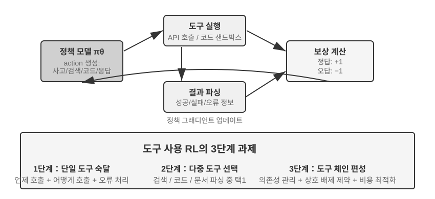

도구 사용은 에이전트의 능력 경계를 '모델 자체 추론'에서 '외부 시스템 호출 협업'으로 넓히고, 에이전트가 실용적으로 가는 열쇠다. 난이도 경사로 보면, 도구 사용의 RL 훈련은 세 층위의 도전에 직면한다. 첫째 층위는 단일 도구 사용을 배우는 것 — 입출력 규격 이해, 호출 시기 파악, 오류 피드백 처리. 둘째 층위는 다도구 생태에서 선택하는 것 — 수십 종의 도구 앞에서 언제 검색하고, 언제 코드를 실행하고, 언제 문서를 파싱할지. 셋째 층위는 도구 사슬 편성이다 — 도구 간 의존 관계 발견, 상호 배제 제약 식별, 비용 효율 최적화.

도구 호출을 둘러싼 에이전트 RL에는 현재 두 노선이 활발하다. 한 축은 **검색 강화**: Search-R1(Jin 등, 2025)이 대표로, RL로 모델이 사고 과정에서 스스로 언제 검색을 시작할지 결정하고 반환 결과로 계속 추론하게 한다. 고정된 RAG 흐름을 갖다 쓰는 게 아니라. 다른 한 축은 **소프트웨어 엔지니어링**: SWE-Gym 같은 훈련 환경이 대표로, 코딩 에이전트가 실제 코드베이스에서 다중 라운드 RL을 하고, 모델이 반복해 편집·실행·수정하게 한다. 두 노선 모두가 안은 공통 도전은 긴 시퀀스의 신용 할당(최종 성공 한 번을 수십 단계 앞의 어느 결정으로 돌리는가)과 환경 공학(안정적·재현 가능·대규모 병렬인 훈련 환경 구축)이다.

도구 RL에는 또 피해 갈 수 없는 공학 디테일이 있다. **환경 피드백 토큰에 손실 마스킹(loss masking)**. 도구 호출 궤적 하나에는 모델이 스스로 만든 토큰(사고, 도구 호출 파라미터)도 있고, 환경이 반환한 토큰(코드 인터프리터 출력, 검색 결과, 고객 서비스의 답)도 있다. 후자는 정책이 만든 것이 아니라 환경이 준 것이다. 이것까지 정책 경사에 넣으면, 모델은 '샌드박스가 뭘 출력할까'를 예측하도록 훈련받게 돼, 최적화 목표에서 벗어날 뿐 아니라 훈련이 불안정해진다. 표준 관행은 손실 계산에서 환경 피드백 토큰을 마스킹해 빼고, 모델이 스스로 만든 토큰에만 그래디언트를 역전파하는 것이다. 이것이 ReTool의 핵심 기술점 중 하나(`<interpreter>` 태그 안의 피드백 토큰에 기울기 마스킹)이며, Search-R1이 말하는 '검색된 토큰에 마스킹해 훈련을 안정화'이기도 하다. veRL, AWorld 같은 주류 훈련 프레임워크가 모두 이 메커니즘을 내장한다.

> **실험 7-15 ★★★: ReTool — 코드 인터프리터로 강화한 수학 문제 풀이**
>
>
> 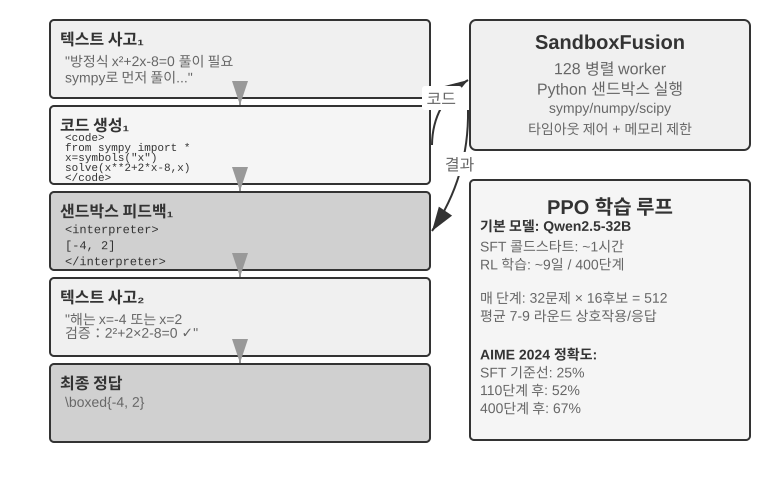
>
>
> 순수 텍스트 사고는 정확한 수치 계산, 기호 조작, 복잡한 방정식 풀이에서 누적 오류를 낳기 쉽다(예: 열 단계의 곱셈을 연속하면 단계마다 틀릴 수 있다). 반면 코드 인터프리터는 실행 가능한 인터페이스로 정확한 검증을 제공한다. ReTool은 코드 인터프리터의 실시간 실행을 RL 사고 루프에 통합해, 모델이 결과 피드백의 인도 아래 스스로 언제, 어떻게 도구를 쓸지 배우게 한다.
>
> 훈련은 두 단계. SFT 웜업(약 1시간)은 순수 텍스트 추론 데이터를 코드 강화 궤적으로 바꿔, 기본적 도구 호출 패턴을 세운다. RL 훈련(veRL 기반으로 개조한 PPO, 훈련 데이터는 DAPO-Math-17k에서, 약 9일 400단계)은 실시간 코드 실행을 교직하는 rollout로 정책을 최적화한다. 모델이 `<code>` 태그를 포함한 코드를 생성하면, 샌드박스가 실행해 결과를 `<interpreter>` 태그로 싸서 피드백하고, 모델은 이어서 생성해 '텍스트 1 + 코드 1 + 피드백 1 + ... + 답'의 혼합 추론 시퀀스를 이룬다. 각 훈련 단계마다 응답 512개(32문제 × 16후보)를 만들어야 하고, 평균 응답당 7~9라운드 상호작용, 총 토큰 처리량은 처음 25M에서 40M로 자란다.
>
> ReTool 자체는 표준 PPO를 쓰고, 최적화 알고리즘은 고치지 않았다. 다만 훈련 데이터가 DAPO 팀의 DAPO-Math-17k에서 왔으니, 여기서 근래 유행하는 **DAPO** 알고리즘(Yu 등, 2025)을 곁들여 소개한다. DAPO는 표준 PPO 위에 네 가지 개선을 더했고, 핵심 목표는 모델이 한 가지 전략(한 가지 방식으로만 푸는 것)으로 너무 일찍 수렴하는 것을 막는 것이다.
>
> - **Clip-Higher(탐색 상한 완화)**: 표준 PPO 알고리즘은 매 훈련마다 정책 변화의 폭을 제한한다 — 변화가 크면 훈련이 불안정해지기 쉬우니까. 그런데 제한이 너무 엄하면 모델은 '새로운 길을 시도할 엄두'를 못 낸다. Clip-Higher는 이 제한을 적절히 완화한다. 모델이 우연히 명백히 더 나은 경로를 발견했을 때, 그 경로로 더 대담하게 옮겨가게 허용해, 탐색을 장려한다.
> - **Token-Level Policy Gradient Loss(각 토큰의 가중치를 같게)**: 원시 GRPO는 손실을 샘플 수준에서 정규화한다 — 먼저 각 답 내부에서 토큰 수로 평균, 다음 샘플 사이에서 평균. 이러면 긴 답의 각 토큰이 `1/|o_i|`로 희석돼, 고품질 긴 사슬 사고는 충분한 보상을 못 받고, 장황한 반복도 충분한 벌을 안 받는다. DAPO의 Token-Level Policy Gradient Loss는 바로 이 샘플 평균을 빼고, 전체 batch의 모든 토큰 위에서 통일 정규화해, 각 토큰의 가중치를 같게 한다. 직접적 결과는 긴 답이 자기 길이에 걸맞은 기울기 기여를 받는 것이다.
> - **Dynamic Sampling(연산 자원의 지능적 배분)**: 훈련 시 각 문제의 샘플링 횟수를 동적으로 조정 — 모델이 이미 안정적으로 풀 수 있는 단순 문제는 샘플링을 줄이고(계속 연습해도 수익이 크지 않으니), 성공률이 20%~80%인 '학습 가능 구간' 문제는 샘플링을 늘린다(가장 많이 배울 수 있는 문제). 연산 자원을 가장 학습 가치가 큰 데이터에 집중한다.
> - **Overlong Reward Shaping(장황한 답에 벌점)**: 과도하게 긴 응답에 부드러운 벌점. 모델이 긴 사고 과정을 만들었는데 그래서 더 잘 답하지 못했다면, 시스템은 보상 점수를 낮춰, 더 간결하고 효율적으로 사고하는 법을 유도한다.
>
> ReTool로 돌아가자. AIME 2024에서 Qwen2.5-32B-Instruct 기반의 훈련은 110단계의 중간 체크포인트에서 정확도가 처음 약 25%에서 52%로(Best-of-30은 85%); 논문의 최종 결과는 400단계 후 67.0%이고, 순수 텍스트 RL 기준선은 1080단계 훈련해도 40.0%에 불과하다. 이 실험 테두리 안의 훈련 동태 수치는 모두 이 32B 모델 설정을 기준으로 한다.
>
> 출현 능력: 코드 자기 교정(실행 오류를 식별하고 수정 버전을 스스로 생성), 도구 호출이 후기 검증에서 초기 탐색으로 전환, 사고 효율 향상(길이는 40% 줄었으나 정확도는 오히려 상승).
>
> 처음 110단계의 훈련 동태는 3단계 패턴을 보인다. 초기(0~20단계)는 기본 도구 사용을 빠르게 배우고 단계마다 정확도 0.5% 상승. 중기(20~70단계)는 파동형 탐색으로, 응답 길이가 2500에서 정점 4700 토큰으로 늘고 정책 다양성이 급증. 후기(70~110단계)는 안정적 수렴으로, 길이는 4400 토큰으로 돌아오고 성능은 계속 올라지만 파동은 줄어든다.
>
> SFT와 RL의 시간 격차의 근원은 정보 밀도의 차이에 있다. SFT는 토큰마다 감독 신호가 있고, RL은 episode 하나에 성패 신호 하나뿐이다. 실제 훈련에서는 단계당 소요 시간이 응답 길이에 따라 자라며, 소수의 과도하게 긴 응답이 전체 훈련 주기를 눈에 띄게 늘린다.
>
> **실험 7-16 ★★★: AWorld-train — 샌드박스에서 도구 사용 배우기**
>
>
> 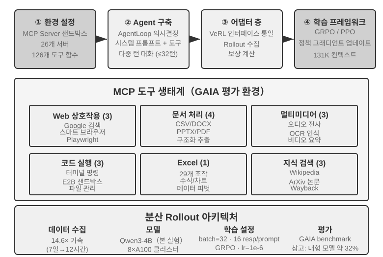
>
>
> GAIA는 가장 도전적인 에이전트 평가 벤치마크 중 하나다. 대파라미터 모델이 대규모 훈련을 거쳐도 약 32%에 그칠 수 있어, 고득점 시스템과 여전히 뚜렷한 격차가 있다. 이 실험은 비교적 작은 모델(Qwen3-4B)을 쓰고, 주된 목표는 '실천에서 배우기' 훈련 흐름 전체를 시연하는 것이다.
>
> AWorld 훈련 환경은 MCP 서버 샌드박스로, 26개 서버, 126개 도구 함수를 제공한다. 웹 상호작용(구글 검색, 스마트 브라우저, Playwright), 문서 처리(CSV/DOCX/PPTX/PDF), 멀티미디어 처리(오디오 전사, OCR, 비디오 요약), 코드 실행(터미널 명령, E2B 샌드박스), Excel 처리(29개 엔터프라이즈급 조작), 지식 검색(Wikipedia, ArXiv, Wayback Machine)을 아우른다. 실제 API의 속도 제한, 서비스 요동, 계정 정지로 인해 운영 환경에서 직접 훈련하는 것은 불가능하다 — 안정적이고 통제 가능하며 되돌릴 수 있는 시뮬레이션 환경 구축이 다도구 RL 훈련의 공학적 전제다.
>
> 단일 도구에서 다도구로의 질적 도약은 이렇다. 단일 도구는 '언제''어떻게' 호출할지만 결정하면 되지만, 다도구는 '어떤 것을 호출할까''어떻게 조합할까'도 풀어야 해, 조합 폭발과 의존 관리의 복잡성을 끌어들인다. 도구 간 사전 의존(검색해야만 특정 페이지를 탐색할 수 있다), 상호 배제 제약(일부 도구는 동시 호출 불가), 비용 차이(각 API의 할당량과 지연이 다르다). 정책은 이런 제약 아래서 전체적으로 계획해야지, 눈앞의 최적만 탐욕적으로 고르는 게 아니다.
>
> 밝혀둘 것: 이 실험은 **개방형 훈련 실험으로 기준선 결과를 제공하지 않는다** — Qwen3-4B급 크기로 GAIA에서 눈에 띄는 점수를 내기는 어렵다. 이 실험의 가치는 '실천에서 배우기'의 완전한 사슬을 관통시키는 데 있고, 지표 경신에 있지 않다. 참고할 만한 수락 기준과 예상 관찰은 이렇다. 환경의 reset과 episode 순환을 안정적으로 관통(도구 호출, 피드백, 상태 갱신이 무너지지 않음); 훈련 중 평균 보상 곡선이 상승 추세; 도구 호출 성공률이 훈련과 함께 향상되고, 모델이 점차 다도구 사이에서 더 합리적 선택과 조합을 학습.

## 샘플 효율을 끌어올리는 최전선의 탐색

앞선 실험들은 RL이 에이전트 훈련에서 갖는 핵심 가치를 체계적으로 보여줬지만, 모두 값비싼 샘플 비용을 치렀다. ReTool의 RL 훈련 시간은 SFT의 200배 이상(9일 vs 1시간)이어서, 자원이 제약되거나 빠른 반복이 필요한 상황에서는 받아들이기 어려울 수 있다.

RL의 샘플 효율이 낮은 데는 여러 원인이 있다(고분산, 희소 보상, 온폴리시 데이터의 재사용 어려움 등). 그중 하나의 중요한 뿌리는 주류 정책 경사 방법의 model-free(비모델) 특성에 있다. 환경 역학을 모델링하지 않고(world model, '동작을 실행하면 세상이 어떻게 변할까'), 한 번의 피드백에 든 풍부한 정보를 직접 활용하기도 어렵다(이 둘은 관련되지만 같지 않다). 환경이 매 상호작용에서 반환하는 풍부한 피드백(오류 원인, 빠진 필드, 올바른 흐름 힌트)의 대부분이 허비된다 — 앞의 '희소 보상의 곤경'이 이미 이 문제를 상세히 분석했다. 전화로 고객 서비스에 연락하는 상황을 생각하자. 고객 서비스가 '신분 검증을 위해 신용카드 뒷자리 4자리가 필요합니다'라고 분명히 알려주는데, model-free RL은 최종 성패 신호(reward 0 또는 1)에서만 배울 수 있어, 이 명확한 피드백을 직접 활용하지 못하고 수백 번의 무작위 탐색으로 우연히 신용카드 정보를 제공하는 길을 찾을 수밖에 없다. 반면 인간은 피드백을 듣고 곧장 기억해 다음에는 능동적으로 준비한다.

이 병목을 둘러싸고, 이 장은 사실 상호보완적인 두 사고를 이미 내놓았다. 하나는 **환경 피드백에서 허비된 정보를 다시 학습 가능한 보상으로 만드는 것** — '고객 서비스가 먼저 신분 검증을 요구한다''이 명령은 파괴적이다''한 단계를 더 증명했다' 같은 명확하고 기계로 판정 가능한 신호를 보상 함수에 직접 쓰는 것이다. 이것이 7.10절에서 다룬 RLVP(특히 '도달 가능한 진전에 보상'이라는 부분 보상 용법으로, 전패 그룹에서 허비된 샘플을 되살린다)다. 다른 한 축이 바로 이 절에서 정면으로 펼칠 방법이다 — **매 단계의 훈련 신호를 더 조밀하게**. 과제 종점에서 성패 스칼라 하나를 받는 대신, 궤적의 매 자리에서 인도를 받자. 이것이 On-Policy Distillation이다.

### On-Policy Distillation: SFT와 RL의 장점을 함께

On-Policy Distillation(온폴리시 증류)은 Thinking Machines Lab이 2025년에 체계적으로 제안해 널리 퍼뜨렸다[^ch7-10]. 이제는 포스트트레이닝에서 아주 주류적인 방법이 돼, 따로 한 절을 할애해 또렷이 짚고 넘어갈 만하다. 이것이 무엇을 해결하는지 이해하려면, 먼저 SFT와 RL 각각의 치명적 단점 하나씩을 보자. On-Policy Distillation은 정확히 둘의 장점을 합쳐 놓았다.

**SFT의 단점: 학습자-샘플러 불일치(Learner-Sampler Mismatch).** SFT의 훈련 데이터는 '샘플러'(교사 모델 또는 인간 전문가)가 만들고, '학습자'(훈련되는 모델)는 수동적으로 이 **올바른 경로**들을 모방만 한다. 문제는, 학습자가 직접 나서면 실수를 하고 훈련 데이터에 한 번도 등장하지 않은 **벗어난 상태**에 빠진다는 것이다. 그 상태에서 어떻게 제자리로 돌아오는지는 배운 적이 없어, 작은 실수가 굴러 큰 실수가 된다. 표준 답안만 외운 학생이 중간 한 단계를 틀리면 어떻게 되돌아와야 할지 전혀 모르는 것과 같다. 근원은 훈련 시 '누가 가는가'(교사)와 배포 시 '누가 가는가'(학생 자신)가 같은 분포가 아니라는 데 있다.

**RL의 단점: 신호가 너무 희소.** RL은 학생이 직접 나서게(온폴리시) 해 분포 불일치를 풀었지만, 궤적 하나를 끝까지 가서 성패 스칼라 하나만 받는다. 중간의 매 단계를 어떻게 고쳐야 하는가는 수백 번의 시행착오로 천천히 역추론해야 한다.

**On-Policy Distillation은 둘의 장점을 합친다. 학생이 스스로 궤적을 만들게(On-Policy, 분포 불일치 해결) 하면서, 더 강한 교사 모델이 학생이 걷는 매 단계를 토큰마다 점수 매기게(조밀한 신호, 희소 해결) 한다.** 세 방법을 한 줄로 비교하자. SFT는 '오프폴리시 + 조밀 신호'(분포 불일치 있음), RL은 '온폴리시 + 희소 신호'(피드백 희소), On-Policy Distillation은 '**온폴리시 + 조밀 신호**' — 두 단점을 모두 메운다.

구체적으로 어떻게 점수를 매기는가? 교사는 학생의 이 단계가 옳은지만 판정하는 게 아니라, '현재 이 자리에서, 다음 토큰의 여러 선택이 각각 얼마나의 확률을 가져야 하는가'라는 완전한 분포를 직접 내놓는다. 예컨대 학생이 '먼저 API를 조회하고, 다음 반환값을 파싱한다...'의 어느 자리에 이르렀을 때, 교사는 여기서 '조회'가 80%, '호출'이 15%, 나머지 5%라고 본다. 학생의 학습 목표는, 자기가 매 자리에서 내는 예측 분포를 교사의 분포에 최대한 가깝게 붙이는 것이다. 기술적으로는 두 분포 사이의 **KL 발산**을 최소화해 구현한다(KL 발산은 두 확률 분포의 차이를 잰다. 가까울수록 작고, 같으면 0이다. 7.7절에서 이미 상세히 소개). 최종 성패의 이원 신호와 비교하면, 이 토큰별 분포 정렬은 한 단수 이상 조밀하다.

효과는 뚜렷하다. 수학 등 과제에서 같은 성능에 필요한 훈련 단계가 순수 RL의 약 **1/10**이다. 긴 사슬 사고 과제에서 장점이 특히 크다 — 매 단계마다 교사가 길을 잡아줘, 학생은 빠르게 교정을 배운다. 잘못된 경로로 점점 더 깊이 가는 대신. 부수적으로 과잉 적합도 완화한다. 표준 RL에서 같은 프롬프트로 반복 훈련하면 최종 답을 통째로 외워버리기 쉬운데, 여기서는 매 궤적이 다르고 교사가 구체 궤적에 맞춰 피드백을 줘서, 특정 답이 아니라 보편적 전략을 배운다. 데이터 재사용률이 크게 올라가는 이유다.

이 방법은 **다중 라운드 에이전트 상황**에서 특히 가치가 크다. 다중 라운드 과제의 성패 신호는 맨 끝에 나타나 희소하고 뒤늦은데, 토큰별 교사 분포가 중간 매 단계의 빠진 인도를 정확히 메워 준다. 단 전제가 하나 있고, 이 장이 거듭 강조한 메인 라인과 정확히 맞닿는다. **학생이 자유롭게 탐색할 충분히 진짜인 시뮬레이션 환경이 있어야 한다.** 그렇지 않으면 학생이 교사도 본 적 없는 벗어난 상태에 이르렀을 때 교사의 점수도 신뢰할 수 없다. On-Policy의 가치는 '학생이 정말로 배포 분포 위에서 탐색한다'는 것 위에 세워진다.

'조밀한 신호가 희소한 신호를 이긴다'는 규칙은, 순수하게 에이전트 한 상황에서 꽤 깨끗한 검증을 한 적이 있다. 2장 상태표를 다룰 때 에이전트의 '시간 감각' — 긴박함, 끈기, 경계심 — 을 언급했다. 추론 시 조작 매뉴얼 한 부면 장착할 수 있다. 그러나 8B 소형 모델이 프롬프트에 의존하지 않고 이 리듬감을 직접 가중치에 쓰게 하면, 포스트트레이닝의 한 난제가 된다. 필자와 공동 연구자는 여기서 DPO와 네 가지 강화학습 레시피를 차례로 시도했다. 네 RL은 정확히 각각 이 장 앞에서 다룬 실패 모드를 하나씩 밟았다. 단단한 문턱 보상은 너무 희소해, 대부분의 rollout이 0점, 그룹 내 어드밴티지가 0(희소성); 계급 보상으로 바꾸니 신호는 조밀해졌으나, 대리 지표는 실제 통과율과 대응하지 않는다(목표 부정합); 첫 라운드 응답에만 점수를 주니, 다중 라운드 평가에서 오히려 더 나빠지는 대충의 짧은 답을 낳는다(rollout 모양 불일치); 마지막으로 rollout 모양을 평가와 맞추고 훈련 보상이 확실히 오르기 시작했으나, 전략은 몇 단계 안에 단일 패턴으로 붕괴하고 4배 강의 KL 닻조차 붙잡지 못한다(훈련 붕괴). 어떤 레시피도 SFT의 천장을 넘지 못했다. On-Policy Distillation으로 바꿔 — 동결한 Qwen3-32B 교사로 학생이 직접 걷는 다중 라운드 궤적 위에서 토큰별로 목표 분포를 내어 주자 — 훈련은 매끄럽게 수렴하고, 네 조건에서 통과율이 일률적으로 같은 계보의 SFT 기준선보다 23~47포인트 높았다[^ch7-11]. 네 희소 신호가 차례로 실패하고 한 조밀 신호가 성공한 것은, 이 절의 메인 라인을 다시 한번 증명한다. 포스트트레이닝을 가로막는 것은 흔히 보상 함수가 충분히 정교하지 않아서가 아니라, 신호 자체가 충분히 조밀하지 않아서다.

## 포스트트레이닝의 완전한 그림과 실천 요점

이 장은 사전훈련의 '다음 토큰 예측'에서 출발해 아주 긴 길을 걸었다. SFT가 형식을 고정하고, RL이 일반화를 돌파하며, 다중 라운드 과제가 신용 할당 난제를 끌어들이고, 보상 설계가 결과 보상에서 '결과에 보상하고 과정을 제약하는' 경로 신호로 뻗고, 도구 사용이 조합 폭발을 가져온다. 이 실험들에는 공통된 한 가닥이 있다 — 모델이 무엇을 배우는가는 훈련 신호가 무엇을 가르치는가에 달리고, 신호의 품질은 주로 데이터와 환경이 결정하지 알고리즘이 결정하지는 않는다는 것.

**협업 패러다임**: 앞서(GeneralPoints 실험의 소결) 중국화의 '먼저 형, 그 다음 신'으로 이 패러다임을 이미 개괄했다 — SFT는 '형식이 안정되고 능력이 갖춰진' 곳에서 멈추고, RL은 그 위에서 전략을 빚는다. 둘은 다른 층위에 작용한다. SFT는 프로토콜과 구조(JSON 형식, 대화 템플릿, 도구 인터페이스)를 고정하고, RL은 전략과 일반화(산술 규칙, 공간 사고, 동작 시퀀스)를 최적화한다. 핵심 균형: SFT를 과잉 훈련하면 모델이 훈련 분포로 무너져 RL의 최적화 공간을 제약한다.

아래의 **흔한 함정**은 경계할 만하다. 이런 문제를 식별하는 것이 기술 디테일을 장악하는 것보다 자원 낭비를 막는 데 더 도움이 될 때가 많다.

1. **사실 기억을 포스트트레이닝에 과도하게 의존** — 사실적 지식은 RAG로 관리(동적 갱신, 출처 추적 가능, 훈련으로 잊지 않음)하고, 포스트트레이닝은 '지식을 어떻게 쓸까'에 집중.
2. **형식이 안정되지 않은 채 RL을 도입** — 모델이 기본적 JSON조차 안정적으로 만들어내지 못할 때(파싱 실패율 20% 초과), RL 훈련은 완전히 실패. 반드시 먼저 SFT를.
3. **보상 함수 설계 부당**으로 보상 해커 — 모델이 보상의 허점을 파고들어 진짜로 과제를 마치는 대신 고득점만 노리는 것(예: 응답 길이만 보고 장황하고 무의미한 텍스트를 만듦). 중간 지표가 아니라 최종 목표를 평가해야.
4. **시뮬레이션 충실도 홀시** — 시뮬레이션이 너무 단순화(고객 서비스가 늘 정해진 방식으로만 답)하거나 환경 응답이 진짜와 다르면(오류 메시지가 운영 환경과 불일치), 훈련된 전략은 현실에서 완전히 무너진다. 고충실도 시뮬레이션 환경 구축 비용이 훈련 자체보다 높을 수 있다.
5. **과잉 훈련으로 일반화 하락** — 훈련 손실은 계속 떨어지는데 검증셋 성능은 오히려 악화될 때, 모델은 훈련 디테일을 죽 외우고 있다. SFT에 특히 자주 나타나며, 조기 종료가 여전히 중요; RL 과잉 최적화도 마찬가지로 전략이 현재 과제 분포에 과잉 적합하게 만든다.
6. **가치 함수 붕괴와 탐색 부족** — PPO에서 가치 추정이 부정확하면 어드밴티지 계산이 빗나가, 훈련 곡선이 격렬하게 진동하는 것으로 나타난다. 온도 파라미터가 너무 낮거나 무작위성이 부족하면 에이전트가 지역 최적에 갇힌다.
7. **RL의 계산 비용을 과소 평가** — SFT에서 잘 되는 과제가 RL로 넘어가면 10~100배의 훈련 시간이 필요할 수 있다. 테스트 분포가 훈련과 고도로 일치하면, SFT만으로 이미 충분할 수 있다.
8. **훈련 데이터 품질 저하** — SFT는 데이터 속의 잡음과 편향을 직접 배워 오류를 파라미터에 고정; RL은 탐색으로 더 나은 전략을 발견할 수도 있으나, 보상 모델에 체계적 편향이 있으면 잘못된 방향으로 최적화한다.

핵심 원칙: **대규모 자원을 투입하기 전에, 먼저 소규모 실험으로 핵심 가정을 검증하라** — 소량 데이터로 SFT가 형식을 안정시킬 수 있는지 테스트, 단순화 환경으로 RL이 수렴할 수 있는지 검증, 작은 샘플로 보상 함수가 진짜 목표를 반영하는지 검사. 빠른 실패가 대규모 실패보다 낫다.

**RAG/ICL과의 협업**: 포스트트레이닝, 외부화 학습, 컨텍스트 내 학습은 에이전트 능력의 세 차원을 이루며, 서로 배타적 대체안이 아니라 각각 모델 파라미터, 외부 지식, 추론 시 조건 정보에 작용하는 세 개의 조절 가능한 '노브'다. ICL의 가치는 '파라미터 변경 없는' 즉각 조작에 있다 — 극히 적은 예시나 명확한 규칙만으로 행동을 빠르게 빚을 수 있어 탐색 단계의 첫 선택이지만, 예시가 많아지면 지연과 비용이 빠르게 자란다. RAG의 가치는 '사실과 증거의 외부 연결'에 있다 — 파라미터를 바꾸지 않은 채 동적으로 갱신 가능한 외부 지식과 추적 가능한 출처를 제공해, 환각을 자연히 억제하고 감사·컴플라이언스 요건을 채운다. 포스트트레이닝의 가치는 '행동과 스타일을 파라미터에 쓰는 것'에 있다 — 어조, 형식, 도구 사용 습관을 안정시켜 일관성을 눈에 띄게 끌어올린다. 특히 주의: SFT/RL은 대량의 사실적 지식을 정확히 기억하기 어렵다. 정말로 모델에 영역 사실을 갖추게 하려면 계속 사전훈련에 의존해야(비용이 SFT보다 훨씬 높고 데이터 비율 설계가 정교해야) 하며, 그래서 사실 기억은 RAG에 맡기는 편이 더 적합하다.

가장 흔하고 가장 견고한 관행은 이렇다. RAG로 '사실적 지식'의 정확한 기억과 해석 가능성을 해결하고, '행동과 구조'는 포스트트레이닝에 맡겨 고정한다. ICL과 능력이 강한 모델로 전략을 빠르게 반복·테스트하고, 효과가 안정된 행동은 포스트트레이닝으로 파라미터에 내재화한다. 포스트트레이닝은 모델 증류도 구현할 수 있다 — 고능력 대모델의 능력을 비용이 더 낮은 소형 모델로 증류하는 것.

## 이 장의 요약

모델 포스트트레이닝의 본질은 상호작용 전략을 파라미터에 쓰는 것이다.

SFT와 RL은 경쟁 관계가 아니라 선후 관계다. SFT가 먼저 출력 형식을 안정시키지 않으면(그렇지 않으면 RL의 보상 신호 자체를 계산할 수 없다) RL이 그 위에서 일반화를 배운다. 'SFT는 기억하고, RL은 일반화한다'는 구호가 아니라 측정 가능한 현상이다.
또 이 장을 관통하면서 어떤 알고리즘보다 기억할 만한 판단이 두 가지 있다. 하나, **데이터와 환경이 알고리즘보다 중요하다**: 있는 RL 알고리즘을 쓸 줄만 알면 되고, 진짜 격차를 가르는 것은 시뮬레이션 환경의 충실도와 훈련 데이터의 품질이다. 많은 상황에서 SFT 데이터 품질만 제대로 갖춰지면 RL을 할 필요조차 없다. 둘, **현재 RL의 주된 병목은 샘플 효율이다**: 매 단계의 신호를 더 조밀하게 하는 On-Policy Distillation과, 허비된 환경 피드백을 학습 가능한 신호로 바꾸는 검증 경로 벌점 RLVP('결과에 보상, 경로에 벌점', 그리고 도달 가능한 진전의 부분 보상으로 전패 그룹의 샘플을 되살리는 것)가, 현재 가장 유망해 보이는 두 방향이다. 이들의 공통점은 여전히 이 한 마디다 — 환경과 데이터에 원래 있었지만 순수 결과 보상에 의해 허비된 정보를 다시 모델이 배울 수 있는 것으로 만드는 것.

[^ch7-1]: Schulman, John and Thinking Machines Lab, "LoRA Without Regret", 2025.
[^ch7-4]: Ouyang, Long et al., "Training Language Models to Follow Instructions with Human Feedback", OpenAI, 2022.
[^ch7-5]: Gao, Leo, John Schulman, and Jacob Hilton, "Scaling Laws for Reward Model Over-optimization", OpenAI, 2023.
[^ch7-6]: Rafailov, Rafael et al., "Direct Preference Optimization: Your Language Model is Secretly a Reward Model", 2023.
[^ch7-7]: Lightman, Hunter et al., "Let's Verify Step by Step", OpenAI, 2023.
[^ch7-8]: Silver, David and Richard S. Sutton, "Welcome to the Era of Experience", 2025.
[^ch7-9]: 이 절의 경로 벌점 설계, 네 가지 원칙과 실험 데이터는 Li, Bojie and Noah Shi, "RLVP: Penalize the Path, Reward the Outcome", 2026. arXiv:2607.07435.
[^ch7-10]: On-Policy Distillation의 방법과 실험은 Thinking Machines Lab, "On-Policy Distillation", 2025.
[^ch7-11]: 이 일군의 에이전트 시간 감각 포스트트레이닝 대조 — DPO와 네 RL 각각의 실패 모드, 그리고 On-Policy Distillation의 돌파 — 는 Li, Bojie and Noah Shi, "Agents That Sense Physical Time: Urgency, Persistence, and Vigilance as Missing Controls for LLM Agents", 2026. https://01.me/research/physical-time-agent.

포스트트레이닝은 '모델을 더 똑똑하게 만드는 방법'의 문제를 풀었지만, 모델 가중치의 갱신 주기는 주 단위로, 현실에서는 API의 등록과 중단, 사용자 요구의 진화, 비즈니스 규칙의 변경이 매일 일어난다. 다음 장은 이와 상호보완적인 또 한 갈래의 진화 경로를 다룬다 — 모델 가중치를 고치지 않고, 외부화 학습으로 에이전트가 스스로 도구 라이브러리와 지식 베이스를 구축하게 해, 지속적 능력 확장을 이루는 것이다.

## 사고문제

1. ★★ 치명적 망각 — 특정 과제를 겨냥한 미세조정 한 번이 모델의 원래 범용 능력(범용 도구 호출 등)을 훼손하는 것 — 은 에이전트 상황에서 특히 까다롭다. 전 파라미터 미세조정과 비교해 LoRA는 기반 가중치를 동결해 망각 위험이 더 낮지만, 면역은 아니다. 미세조정이 가져오는 능력 망각을 더 완화할 전략에는 어떤 것이 있을까?
2. ★★ 포스트트레이닝은 능력을 모델 가중치('근육 기억')로 고정하고, 컨텍스트 내 학습은 지식을 추론 시 입력에 둔다. 그러나 어떤 능력(영역 지식 등)은 포스트훈련으로도 배울 수 있고 퓨샷 예시로도 제공할 수 있다. 어느 능력이 어느 길을 가야 할지, 당신은 무슨 기준으로 결정하겠는가?
3. ★★ 모델 증류는 소형 모델이 대형 모델의 행동을 배운다. 능력 층위별로, 증류되는 모델은 대략 세 급으로 나뉜다 — **Chat 모델**(단일 라운드 대화, 직접 답변), **Reasoning 모델**(긴 사슬 사고를 동반한 뒤 답변), **Agentic 모델**(다중 라운드 도구 호출, 환경 상호작용). 이 세 부류를 각각 증류할 때, 난점은 무엇이 다른가? (힌트: '도대체 무엇을 증류할 것인가'에서 시작 — 출력의 스타일인가, 완전한 사고 궤적인가, 환경과 상호작용하는 결정 전략인가; 궤적에서 어느 토큰은 배워야 하고, 어느 것은 환경이 반환한 것으로 배우지 말아야 하는가; 그리고 성패 신호가 얼마나 늦게, 얼마나 희소하게 나타나는가.)
4. ★★★ 다중 라운드 에이전트 상호작용에서, 보상의 귀인(credit assignment) 문제는 단일 라운드보다 더 심각하다 — 최종 성공이나 실패 하나를 3라운드 결정인지 7라운드 결정인지로 돌리기 어렵다. 당신은 보상 분배 전략을 어떻게 설계하겠는가?
5. ★★★ 포스트트레이닝, 외부화 학습, 컨텍스트 내 학습은 에이전트 능력의 세 차원을 이룬다. 고정 예산(예: 1만 달러)으로 고객 서비스 에이전트의 성능을 끌어올린다면, 당신은 이 세 차원 사이에 예산을 어떻게 배분하겠는가? 당신의 결정은 어떤 요인에 달렸는가?
6. ★★★ 명확한 보상 함수가 없고 샘플이 희소한 상황에서, 모델이 스스로 학습을 실현하는 것을 어떤 사람들은 포스트트레이닝의 종극 목표로 여긴다. 현재의 RL 훈련 방법은 이 목표에서 얼마나 먼가? 다음 돌파는 어느 방향에서 가장 가능성이 크다고 보는가?
7. ★★ 이 장은 LoRA 미세조정의 비용이 그리 높지 않다고 지적했다. 그렇다면, 각 사용자(또는 고객사마다) 전용 LoRA를 훈련해 사용자 기억이나 기업 지식을 파라미터에 쓰는 것이 가능하지 않을까? 3장처럼 외부 지식 베이스에 저장하는 게 아니라. 어떤 상황에서 '기억을 파라미터에 쓰기'가 '기억을 지식베이스에 저장'보다 유리한가? 또 어떤 상황에서 역효과가 나는가?
8. ★★★ On-Policy Distillation은 더 강한 교사 모델에 의존해 학생을 감독한다. 그러나 OpenAI의 Weak-to-Strong Generalization 연구는 반직관적 발견을 내놓았다: 약한 모델의 감독 신호가 때로 강한 모델 자체의 잠재적이지만 활성화되지 않은 능력을 끌어낸다. 이 사고를 에이전트 훈련에 적용하면, '소형 모델이 대형 모델을 가르치는' 역방향 증류가 가능하지 않을까?
9. ★★ 과정 보상 모델(PRM)은 각 사고 단계를 평가하고, 결과 보상 모델(ORM)은 최종 결과만 본다. 그런데 '올바른 과정이 잘못된 결과로 이어진 경우'와 '잘못된 과정이 요행히 올바른 결과를 얻은 경우', 어느 쪽에 보상을 줄 만한가? 에이전트의 다단계 도구 호출 상황에서, 당신은 어떻게 저울질하겠는가?
10. ★★★ 이 장이 논의한 평가 데이터셋(SWE-Bench Verified, τ²-bench, AndroidWorld 등)은 평가에도 쓰이고 포스트트레이닝에도 쓰일 수 있다. 그러나 평가셋을 훈련에 쓰면, 그것은 더 이상 독립된 평가셋이 아니다 — 이것은 훈련셋과 테스트셋의 분리라는 기본 원칙을 위배하지 않는가? τ²-bench의 동적 파라미터 생성과 AndroidWorld의 파라미터화 템플릿은 어느 정도 이 문제를 완화하지만, 템플릿 구조 자체는 여전히 고정돼 있다. 평가 데이터의 훈련 가치를 충분히 활용하는 것과 평가 독립성을 유지하는 것 사이에서 어떻게 균형을 잡겠는가?
11. ★★★ 이 장은 '먼저 형, 그 다음 신'의 훈련 패러다임을 제시한다: SFT는 '형식이 안정되고 능력이 갖춰진' 곳에서 멈추고, 그 다음 RL로 전환. 그러나 실전에서, SFT가 이미 '충분한' 지점인지를 어떻게 판정하고 전환 시점을 정할 것인가?
12. ★★★ ReTool의 훈련 동태(실험 7-15 참조)는, 소수의 과도하게 긴 응답이 전체 훈련 주기를 눈에 띄게 늘린다는 것을 보여준다 — 한 batch의 rollout 대부분이 이미 생성을 마쳤는데도, 가장 긴 몇몇 응답이 끝나기를 기다려야 하고, 그 사이 클러스터의 GPU 활용률이 낮다. 이런 긴 꼬리 응답 상황에서 훈련 클러스터의 자원 활용률을 어떻게 끌어올리겠는가?
