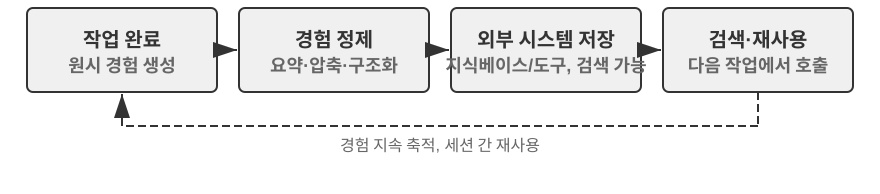
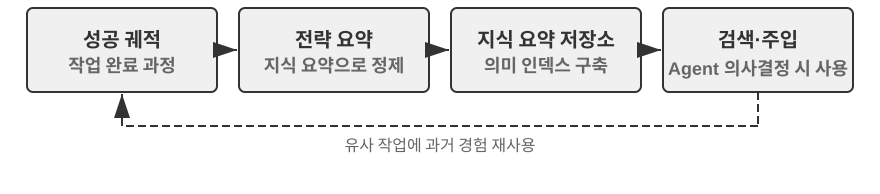
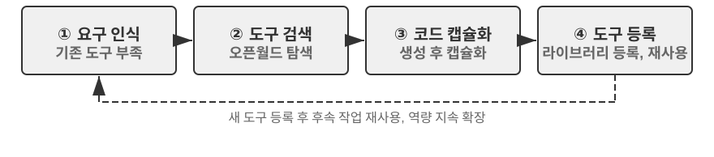
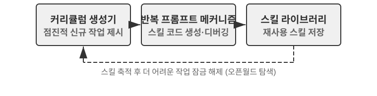
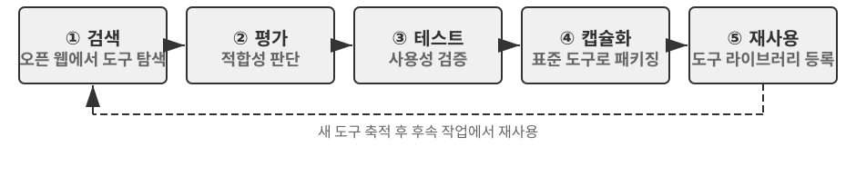

# 에이전트의 자기 진화

앞의 여러 장은 서로 다른 차원에서 Agent의 능력 체계를 구축해 왔다. 2장의 컨텍스트 엔지니어링은 정보 관리의 기반을 다졌고(Skills 메커니즘의 필요 시 로딩도 여기 포함된다), 3장의 지식베이스와 사용자 메모리는 세션을 가로지르는 지식 영속성을 구현했으며, 5장은 코딩 Agent가 파일 시스템을 통해 경험을 축적하는 방식을 보여 주었고, 7장의 강화학습 사후 훈련은 정책을 모델 파라미터 속에 고정했다. 각 기술은 초점이 다르지만 모두 같은 문제를 향해 있다. **Agent는 어떻게 계속 더 강해지는가?**

최첨단 모델조차 특정 기업의 환불 절차, 통신사 특유의 화법 전략, 혹은 생소한 API의 호출 방식 앞에서는 갓 입사한 신입사원처럼 두 눈이 캄캄해진다. 모델 가중치를 바꾸려면 대량의 데이터와 컴퓨팅 자원이 필요하고 갱신 주기는 주 단위로 흘러간다. 반면 현실에서는 새 API가 올라오고 기존 서비스는 내려가며 사용자 요구는 쉼 없이 변한다. Agent에는 모델 파라미터는 건드리지 않으면서도 자신의 능력 경계를 계속 넓혀 주는, 더 가볍고 더 즉각적인 진화 메커니즘이 필요하다.

이 장에서 다루는 것이 바로 그 메커니즘이다. **에이전트의 자기 진화(Self-Evolution)**. 자기 진화는 곧 외부화 학습(Externalized Learning)이며, 두 차원을 담는다. 하나는 경험 속에서 지식을 축적하는 것이고, 다른 하나는 능동적으로 새 도구를 발견하고 창조하는 것이다. 핵심 아이디어는 지식과 프로세스를 모델 파라미터와 임시 컨텍스트에서 분리해, 영속화하고 검색하고 재사용할 수 있는 외부 자원, 즉 도구 라이브러리와 지식베이스로 외부화하는 것이다. 이는 사후 훈련을 대체하는 것이 아니라 보완한다. 사후 훈련은 "모델을 어떻게 더 똑똑하게 만들 것인가"를 해결하고, 자기 진화는 "Agent를 어떻게 더 능력 있게 만들 것인가"를 해결한다.

## Agent는 왜 자동으로 학습하지 못하는가

지금까지는 현실의 요구를 짚었다. 하지만 더 근본적인 질문이 하나 더 있다. **컨텍스트 윈도우가 무한히 길어져서 Agent가 겪은 모든 대화와 도구 호출 결과를 한꺼번에 밀어 넣을 수 있다면, 그것만으로 모든 것을 저절로 배우지 않을까?**

답은 아니다이며, 그 이유는 2장에서 다룬 어텐션 메커니즘 안에 숨어 있다. 이것이 본 장의 이론적 출발점이므로, 몇 장을 건너뛴 지금 짧게 되짚어 볼 가치가 있다.

2장은 거듭 강조했다. **컨텍스트 학습의 내부 메커니즘은 추론보다 검색에 가깝다.** 어텐션은 "찾기"에 능하다. "37번째 우리에 어떤 고양이가 있었지?" 한 번에 명중한다. 하지만 한 번의 순전파 안에서 "통계적 귀납"에는 약하다. "100개의 우리에 검은 고양이는 모두 몇 마리지?" 뒤의 질문은 전체 기록을 훑고 카운트 상태를 유지해야 하므로, 본질적으로 검색이 아니라 사고다. 다시 말해 원시 경험을 통째로 컨텍스트에 쏟아부으면 모델은 "기억"할 수는 있어도, 그것을 재사용 가능한 규칙으로 자동 "추출"하지는 못한다. 컨텍스트가 정말 무한하더라도 이 간극은 사라지지 않는다. 정보는 그 자리에 있되, 모델 대신 "구체적 기록"에서 "일반 패턴"으로 압축해 줄 존재가 없기 때문이다. 더군다나 2장의 "컨텍스트 부패"가 보여 주듯, 컨텍스트가 길어질수록 노이즈도 많아지고 어텐션은 희석되어, 정작 핵심 정보가 검색되기 어려워진다. 무한 컨텍스트는 자동 학습을 가져다주기는커녕 검색 품질까지 계속 떨어뜨린다. 카파시(Karpathy)의 통찰을 거꾸로 읽을 수 있는 대목이다. 모델이 "기억력이 나쁜 것"은 결함이 아니라 특징이다. 덕분에 우리는 수동적·명시적으로 지식 추출을 수행하도록 강제받으며, 모델 스스로 긴 역사에서 규칙을 깨우쳐 주기를 바라는 대신 직접 압축해야 한다. 한 줄로 요약하면, **학습은 저절로 일어나지 않으며 반드시 명시적으로 설계되어야 한다.** 이것이 본 장이 존재하는 이유다.

그리고 "명시적으로 설계된 학습"은 8장에 와서야 처음 등장한 것이 아니다. 앞선 장들에는 이미 여러 원시형이 깔려 있었다. 다만 대부분 **단일 세션 내** 또는 **인접한 세션**의 즉시적 필요를 위한 것들이었다. 2장의 **컨텍스트 압축**은 한 번의 추가 LLM 호출로 부풀어 오른 원시 기록을 미리 계산된 결론으로 "교환"하여 어텐션에 부족한 "추출"의 절반을 보탠다. 2장의 **Agent 상태 표시줄**은 코드가 단계별로 핵심 결론을 결정론적으로 컨텍스트에 유지하는 것으로, 같은 동전의 다른 면이다. 3장의 **사용자 메모리**는 이미 "학습"을 세션 간으로 밀어올렸다. Agent가 여러 차례 대화를 거듭하며 사용자에 대한 이해를 쌓고, 오프라인 정리를 통해 그 정확도를 높여 간다.

3장의 사용자 메모리 그 자체가 하나의 학습이다. 다만 축적되는 것이 "사용자가 누구인가"라는 **정보**(선호, 사실, 습관)라는 점이 다를 뿐이다. 8장이 채워야 할 나머지 반, 그리고 더 장기적인 반은 다음과 같다. 탐색 중에 정리한 문제 풀이 전략, 조작 절차, 실패의 교훈, 그리고 완전히 새로운 도구까지를 영속적이고 검색 가능하며 재사용 가능한 **능력**으로 축적하여, Agent가 단순히 "더 많이 기억하는" 것이 아니라 "점점 더 능력 있게" 만드는 것이다. 이러한 학습은 더 장기적이고 Agent의 **능동적** 발생에 더 크게 의존하므로, 한 장을 할애해 전개할 가치가 있다. 아래에서는 먼저 거시적으로 그 위치를 잡아 본다.

## 세 가지 학습 패러다임과 자기 진화의 위치

1장에서 도입한 세 가지 패러다임(그림 1-1)은 여기서는 위치 확인용 대조로만 다룬다. **사후 훈련**은 모델 가중치를 수정하여 RL을 통해 "경험"을 "근육 기억"으로 고정한다. 성공률이 높고 지연이 낮지만 갱신 비용이 크고 주기가 길다(7장에서 이미 상술했다). **컨텍스트 내 학습**(In-Context Learning, ICL)은 프롬프트에 예시를 제공해 임시 적응을 수행한다. 비용이 낮고 효과가 빠르지만 세션이 끝나면 사라진다(1, 2장 참조). **외부화 학습**은 개발자가 가장 쉽게 놓치는 경로로, 지식을 모델 바깥의 파일·지식베이스·도구에 축적하여 영속적이고 해석 가능하며 언제든 수정할 수 있다. 셋은 경쟁이 아니라 협력한다. 사실성 지식은 RAG(3장 참조)와 외부 저장에 맡기고, 안정적인 행동과 포맷은 사후 훈련으로 고정하며, 당장의 임시 정보는 컨텍스트 내 학습에 맡긴다.

이 장은 그중 **가중치를 바꾸지 않는** 경로, 즉 외부화 학습에 초점을 맞춘다. 이는 장머리에서 말한 두 차원과 정확히 대응한다. 경험을 지식과 Skill로 외부화하는 것, 그리고 능력을 도구로 외부화하는 것이다. (여기서 5장의 "코드가 코드를 창조한다: Agent 자가 부팅스트랩"과 구분이 필요하다. 거기서는 Agent가 자신과 동류인 시스템을 생성하는 이야기를 다루고, 이 장에서는 가중치를 바꾸지 않는 능력 성장을 다룬다. 3장이 지식베이스의 "어떻게 저장하고 어떻게 조회할까"를 해결한다면, 이 장은 "누가 채우고 갱신할까", 즉 Agent가 어떻게 능동적으로 경험을 축적하는지를 해결한다.)

왜 필요한가? 먼저 반대 시나리오를 보자. 한 고객센터 Agent가 특정 은행의 환불 절차를 처음 처리한다고 하자. 15분의 탐색 끝에, 전화를 3번 걸고 화법을 2가지 시도한 뒤 드디어 환불을 완료했다. 외부화 학습 능력이 없다면, 다음에 똑같은 요청이 들어와도 처음부터 다시 15분을 들여 같은 탐색을 반복해야 하며, 이번에 쌓은 경험은 세션이 끝나면 사라진다. 핵심은 "자율"이라는 두 글자다. 인간 엔지니어가 Agent를 위해 문서를 준비하는 것이 아니라, Agent가 과제를 수행하는 과정에서 스스로 경험을 요약하고 도구를 만들고 지식베이스를 갱신하는 것이다. 마치 숙련된 고객센터 담당자가 흩어진 환불 규정을 한 권의 수첩으로 정리해 두고, 새로운 상황이 생길 때마다 스스로 갱신하듯 말이다. 철학의 핵심은, 모델이 모든 것을 기억하기를 바라는 대신 과제 완수 후 추가 연산력으로 경험을 요약·압축·구조화하여 영속적이고 검색 가능한 외부 시스템에 저장하는 것이다. 파라미터 학습과 달리 비싼 훈련 없이도 해석 가능하고 검증 가능하며 수정 가능한 지식을 빠르게 축적할 수 있다. 컨텍스트 내 학습과 달리, 능동적 추출과 구조화 조직을 통해 막대한 원시 정보 속에서 비효율적으로 검색하는 일을 피하고 세션 간 영속성을 확보한다.

더 중요한 점은, 외부화 학습이 Agent의 학습 능력을 "정보를 기억하는" 수준에서 "능력을 구축하는" 수준으로 끌어올린다는 것이다. 경험을 요약적 지식으로 정리해 지식베이스에 저장해 후속 검색에 쓸 수 있을 뿐 아니라(3장 RAG 절에서 소개한 RAPTOR의 트리형 귀납은 경험의 단계별 추출에도 그대로 적용된다. 구체적 조작 기록에서 규칙으로, 다시 원칙으로), 반복적인 조작 절차를 정확히 실행 가능한 도구로 캡슐화하여 계속 커지는 기술 라이브러리를 형성한다. 예를 들어 보자. 한 고객센터 Agent가 어떤 고객의 환불을 처리하면서 서로 성질이 다른 세 가지를 배울 수 있다. 첫째는 특정 규칙이다. "A 회사 환불 시 반드시 신용카드 뒤 네 자리를 검증해야 한다." 이는 사실성 지식이므로 지식베이스에 저장하면 된다. 둘째는 범용 도구다. "X API로 주문 상태를 자동 조회한다." 이는 안정적으로 재사용 가능한 조작 시퀀스이므로 코드 도구로 축적하는 것이 가장 경제적이다. 셋째는 업무 매뉴얼이다. "환불 처리의 완전한 Skill." 이는 전략적 판단과 자주 변하는 비즈니스 규칙을 포함하므로 Skill 문서로 작성하기에 더 적합하다. 표 8-1은 외부화 학습이 축적하는 이 세 가지 산출물을 정리한다.

표 8-1 외부화 학습의 세 가지 산출물

| 산출물 형태 | 담는 내용 | 예시 | 사용 방식 |
|-------------|----------------------|--------------------------------|---------------------------|
| 지식베이스 항목 | 사실과 규칙 | "해당 은행은 개좌행 주소 제출을 요구한다" | 의미 검색 또는 `grep`으로 정확히 검색 |
| 전용 코드 도구 | 반복 가능한 조작 절차 | "계좌 잔액을 조회하는 API 호출 시퀀스" | 코드로 고정, 파라미터로 호출 |
| Skill 문서 | 복잡하지만 자주 변하는 업무 전략 | "보험 청구 처리의 모범 사례" | 자연어 문서, 필요 시 로딩 |

어떤 형태를 쓸지 판단하는 간단한 경험 법칙이 있다. **순수하게 사실성 정보라면 지식베이스에, 자주 쓰이고 파라미터가 복잡하면 코드(도구)로, 자주 변하고 전략적 판단이 관련되면 문서(Skill)로.** 뒤의 두 가지는 모두 "도구 생성"에 속한다. 외부화 학습의 더 고급 형태로, "지식"뿐 아니라 "프로세스"까지 외부화하고 코드화하여, "매번 다시 생각하기"에서 "한 번 생성하고 여러 번 재사용하기"로 바꾸는 것이다. 처음 수동으로 서버를 배치한 뒤 그 단계를 자동화 스크립트로 옮기는 것과 같다. 4장에서 전용 도구와 Skill의 선택 프레임워크를 이미 상세히 다루었다.

1장이 "쓰디쓴 교훈(bitter lesson)"에 대해 내린 입장, **방향에 동의하되 속도는 실용적으로**, 는 외부화 학습에서 가장 분명하게 드러난다. 모든 지식을 파라미터로 압축하지도, 프로세스를 if-else 규칙으로 굳혀 버리지도 않으며, Agent가 능동적으로 외부의 지식과 도구 생태를 구축하게 한다. 능력 확장의 논리를 모델 내부(파라미터 규모)에서 외부 세계(도구와 지식베이스의 규모)로까지 연장하는 것이다. 지식 저장 매체의 선택도 같은 논리를 따른다. 이 장에서 다루는 메모리와 기술 대부분은 인공 지식 그래프가 아니라 Markdown과 파일 시스템 형태로 축적된다. 전문 영역에서는 지식 그래프가 더 정확하지만, 자연어야말로 모델이 가장 잘 다루는 포맷이고, 여기에 LLM 기반의 압축과 정리를 더하면 사람의 사전 구조에 의존하지 않으면서도 모델 능력과 함께 계속 확장되는 일반적 경로가 된다. 물론 외부화 학습 자체, 즉 어떤 포맷으로 저장하고 어떻게 인덱스를 구성하고 언제 추출할지는 여전히 엔지니어링 설계가 필요하다. 이것이 바로 "속도는 실용적으로"의 발현이다.

## Agent가 경험에서 학습해야 하는 이유: "똑똑함"에서 "숙련"으로

흩어진 규정을 한 권의 수첩으로 정리한 그 "숙련된 고객센터 담당자"는 "똑똑함"에서 "숙련"으로 가는 열쇠를 짚어 주었다. 격차는 모델이 덜 똑똑해서 생기는 경우가 많지 않다. 많은 비즈니스 프로세스와 도메인 지식이 동적으로 변하고 비공개이어서, 기반 모델의 범용 능력을 끌어올리는 것만으로는 "경험"에 의존하는 문제를 해결할 수 없다. Agent가 경험에서 배워야 할 것은 바로 이런 지식이다. 어떤 서비스의 해지는 헛되이 전화를 걸기보다 특정 양식을 작성해야 한다, 어떤 할인의 적용 조건(제대군인 또는 2년 이상 장기 고객)을 정리해 둔다, 특정 지역 특정 통신사의 광대역 견적에 아직 협상 여지가 있는지 판단한다. 마찬가지로 코딩 Agent는 프로젝트 고유의 코드 규칙과 배포 절차를 모르고, 브라우저 Agent는 어떤 웹사이트의 안티 크롤링 전략과 페이지 레이아웃 변화를 모른다. 이런 것들은 모두 사전 훈련 데이터에 포함되지 않은 실시간 도메인 지식이다.

## 경험에서 학습하기

"왜 배워야 하는가"를 이해하고 나면 다음 질문은 "어떻게 배울 것인가"이다. 외부화 학습의 엔지니어링 실천은 "성공 경험의 기록과 재사용"에서 출발한다. 아래의 두 실험은 상호 보완적인 두 가지 경험 축적 방식을 보여 준다. 하나는 고차원 전략을 검색 가능한 지식 요약으로 추출하는 것이고("풀이 노트"에 해당), 다른 하나는 구체적 조작 시퀀스를 재생 가능한 자동화 도구로 고정하는 것이다("조작 녹화"에 해당).

표 8-2는 경험 학습 메커니즘을 계층별로 분류한 것으로, 지식 추출·지식 조직·지식 적용·엔지니어링 지원 사이의 관계를 이해하는 데 도움을 준다.

표 8-2 Agent 경험 학습 메커니즘의 계층

| 계층 | 메커니즘 | 해결하는 문제 |
|------|------|-------------|
| 지식 추출 | 전략 요약, 워크플로 녹화, 실패 반성 | 성공과 실패 경험에서 재사용 가능한 지식 추출 |
| 지식 조직 | Skills, 수면 중 통합 | 지식을 구조화해 저장하고 인덱싱 |
| 지식 적용 | 시스템 프롬프트 최적화 | 지식을 Agent의 행동 패턴에 주입 |
| 엔지니어링 지원 | 세션 간 이어 달리기 | 긴 과제를 지속적으로 실행 |

이상 네 계층은 이후 내용에서 교차하며 펼쳐진다. 전략 요약, 워크플로 녹화, 실패에서 학습하기(지식 추출)가 자연스럽게 Skills와 수면 중 통합(지식 조직)으로 이어지고, 그다음은 시스템 프롬프트 최적화(지식 적용), 마지막으로 긴 과제의 세션 간 이어 달리기(엔지니어링 지원)로 마무리된다.

> **실험 8-1 ★★: 성공 경험에서 학습하기: 전략 요약**
>
> `gaia-experience` 프로젝트는 "전략 요약"(Strategy Summary) 사상의 전형적 구현이다. 전략 요약이란, 한 번의 성공적인 문제 풀이 과정을 구조화된 경험 노트 한 편으로 응축하는 것이다. "어떤 방법을 썼고, 어떤 함정을 밟았고, 핵심 단계는 무엇이었는지"를 기록하여, 다음에 비슷한 문제를 만났을 때 직접 참조할 수 있게 한다.
>
> 모든 실행 궤적이 경험으로 추출될 가치가 있는 것은 아니다. 판단 기준은 **전이 가능성**(transferability)이다. 지금 과제에서 얻은 교훈이 앞으로 비슷한 과제에서도 재사용될 수 있는가? 특정 입력에만 효과가 있는 수정은 장기 기억에 들어가서는 안 된다.
>
> 이 실험은 두 가지 핵심 인프라를 사용한다. **AWorld 프레임워크**는 AI Agent 전용으로 설계된 오픈소스 실행·평가 환경으로, 표준화된 도구 모음(브라우저, 파일 시스템, 코드 인터프리터 등)과 자동 평가 파이프라인을 제공한다. Agent의 "시험 교실"이라 이해하면 된다. **GAIA**는 매우 도전적인 평가 벤치마크로, 인간의 지혜가 있어야 풀 수 있는 다단계 복합 문제로 범용 AI Agent의 능력을 평가한다. "특정 웹사이트에서 지정한 정보를 찾아 코드로 처리한 뒤 정답을 계산하라" 식의 문제가 대표적이며, 보통 브라우저·파일 관리자·코드 인터프리터를 종합적으로 사용하고 복잡한 논리 추리가 필요하다.
>
> 핵심 혁신은 AWorld 프레임워크의 Agent에 완전한 "학습-적용" 폐루프를 더한 것이다. **학습 모드(Learning Mode)**에서 Agent가 GAIA 과제를 성공적으로 완료할 때마다, 시스템은 그 실행 궤적 전체를 자동으로 캡처하고 LLM으로 "반성"과 "요약"을 수행해 구조화된 경험 요약을 생성한다. 이 요약은 최종 답안뿐 아니라 문제 해결의 핵심 방법, 주요 통찰, 효과적으로 사용된 도구 시퀀스까지 추출한다. 이 경험들은 벡터화되어 지식베이스에 저장된다. **적용 모드(Apply Experience Mode)**에서 Agent가 새 과제를 받으면, 먼저 경험 지식베이스에서 의미 검색을 수행해 과거에 가장 유사한 성공 사례를 찾아내고, 이 경험을 "성공 예시"로 시스템 프롬프트에 주입하여 의사결정의 나침반으로 삼는다. 실험은 이것이 새 문제 해결의 효율과 성공률을 유의미하게 끌어올린다는 것을 보여 주었다. Agent가 해결한 과제가 많아질수록, 쌓이는 경험이 풍부해질수록, 능력도 함께 강해지는 자가 진화 시스템의 정순환이 형성된다.
>
> **실험 8-2 ★★: 반복 과제에서 학습하기: 워크플로 녹화와 재생**
>
> `browser-use-rpa` 프로젝트는 "워크플로 녹화"(Workflow Recording) 사상의 훌륭한 예시다. 워크플로 녹화의 발상은 엑셀의 "매크로 기록"과 비슷하다. 처음에는 직접 조작하며 단계를 기록해 두고, 이후에는 "재생" 버튼 한 번이면 자동 반복된다. 이 프로젝트가 풀고자 하는 문제는 매우 실용적이다. 브라우저에서 이루어지는 많은 반복 조작(보고서 메일 발송, 특정 웹사이트의 정보 조회 등)은 매번 구체적 파라미터(수신자, 검색 키워드 등)는 다르지만 핵심 조작 흐름은 고정되어 있다. Agent가 매번 처음부터 비싼 멀티모달 대모델로 그 흐름을 "다시 발견"하게 하는 것은 큰 자원 낭비다. 본질적으로 컨텍스트 내 학습에만 의존하고 성공 경험을 재사용 가능한 도구로 외부화하지 않은 것이다. 프로젝트의 핵심은 효율과 비용에 대한 극단적 비교 실험이다.
>
> **학습 단계(Learning Phase)**에서 Agent가 처음으로 과제를 수행할 때는 인간처럼 멀티모달 LLM의 관찰-사고-행동 루프로 조작을 완료한다. LLM이 조작 실행을 결정할 때마다, 시스템은 browser-use 프레임워크의 히스토리에서 조작 대상 요소의 정확한 위치 정보를 추출한다. 웹페이지는 브라우저 안에서 DOM 트리(Document Object Model, 문서 객체 모델)로 표현되며, 각 버튼·입력상자·링크는 트리 위의 노드다. XPath(XML Path Language)는 파일 경로와 비슷한 `/html/body/div[2]/button[1]` 표기로 특정 노드를 가리킨다. 조작은 구조화된 단계로 기록된다. 조작 유형(클릭, 입력 등), 대상 요소의 XPath, 조작 파라미터, 그리고 실행 후 검증 정보(페이지 URL의 변화 여부, 예상 요소의 출현 여부 등). 과제가 성공하면 LLM은 의미 라벨("이메일 보내기" 등)과 설명("수신자 필드, 제목 필드, 내용 필드, 보내기 버튼")을 생성하고, 이를 단계 시퀀스와 함께 지식베이스에 저장하여 파라미터화된 "워크플로" 항목을 만든다.
>
> **재생 단계(Replay Phase)**에서 새 과제가 도착하면, 시스템은 의미 유사도(임베딩 벡터)와 핵심 요소 검사를 결합해 기존 워크플로를 매칭한다. 매칭이 성공하면 단계별로 고속 실행된다. Playwright(오픈소스 브라우저 자동화 라이브러리)의 대기 메커니즘(`page.locator(xpath).wait_for(state='visible', timeout=15000)`)으로 요소의 로딩을 보장하고, 파라미터화 템플릿("수신자 필드에 `{{email}}` 입력")은 가벼운 LLM 호출 한 번으로 현재 과제 지시문에서 실제 파라미터 값을 추출하므로 완전한 시각적 사고가 필요 없다. 어느 단계가 실패하면(요소를 찾을 수 없음, 대기 시간 초과) 웹페이지 구조가 바뀌었을 가능성이 있다. 이때 해당 워크플로를 "구식일 수 있음"으로 표시하고, 학습 모드로 돌아가 LLM 사고를 통해 과제를 다시 완수하며, 새 워크플로를 생성해 낡은 것을 교체한다.
>
> **검수 시나리오**: Gmail 웹 버전에서 메일 보내기.
>
> - 최초 실행(학습 단계): "test@example.com에게 메일을 보내라. 제목 '테스트 메일', 내용 '이것은 테스트 메일입니다'." Agent가 멀티모달 LLM으로 "작성" 버튼, 수신자 입력상자, 제목과 내용 입력상자, "보내기" 버튼을 어떻게 식별하는지 관찰한다. 조작 단계, 소요 시간, LLM 호출 횟수를 기록한다.
> - 반복 실행(재생 단계): "another@example.com에게 메일을 보내라. 제목 '후속 테스트', 내용 '두 번째 테스트 메일'." 시스템이 매칭되는 워크플로를 식별하고, 새 파라미터 값을 추출해 LLM 시각 사고 없이 직접 조작을 재생한다. 소요 시간과 호출 횟수가 유의미하게 줄어야 한다.
> - 지식 갱신: 웹페이지 개편을 흉내 내어(HTML 구조를 바꿔 어떤 버튼의 XPath를 변경) Agent가 워크플로 실패를 감지하고 학습 모드로 폴백하는지, 지식베이스를 갱신하는 워크플로를 다시 생성하는지를 검증한다.
>
> 재생 단계에서 과제 실행 속도가 유의미하게 빨라지고(수 배 규모) LLM 호출 비용이 크게 줄며, 성공률도 더 안정적일 것으로 관찰된다.

워크플로 녹화는 고립된 엔지니어링 기교가 아니라, 그 이면에는 더 일반적인 방법론이 있다. Voyager는 NVIDIA 팀이 제안한 오픈월드 Agent 아키텍처로(후술), Minecraft 가상 세계에서 "탐색-축적" 순환을 체계화했다. **과제 수행 → 성공 검증 → 성공한 조작 시퀀스를 기술 라이브러리에 저장 → 비슷한 과제를 만나면 검색해 재사용**. 실험 8-2는 바로 이 발상을 브라우저 자동화에 적용한 것이다. 학습 단계는 "탐색", 워크플로 지식베이스는 "기술 라이브러리", 재생과 실패 폴백은 "검색 재사용"과 지속적 개선에 각각 대응한다.

실험 8-2는 또한 "녹화-재생"에서 가장 취약한 두 지점을 드러낸다. 이 둘을 깔끔하게 처리하고 나서야 이 메커니즘은 비로소 믿을 만해진다[^preact]. 첫 번째 지점은 **언제 재생을 믿을 수 있는가**이다. 더 안정적인 방법은 한 번의 성공한 조작 시퀀스를 작은 **상태기계 프로그램**으로 컴파일하는 것이다. 각 상태는 "검증 술어"(현재 실제 화면에서 성립해야 하는 인터페이스 패턴)를 하나씩 달고 있으며, 재생 시 **각 행동 이전에 먼저 술어로 실시간 화면을 대조**한다. "먼저 확인하고, 다시 손을 쓴다"는 것이다. 술어가 성립하지 않거나 행동이 오류를 뱉으면, 전체 Agent에게 제어를 넘겨 다시 시작하고, 이번의 새 궤적을 다시 프로그램으로 컴파일한다. 재생 시 모델 호출이 한 번도 필요 없기 때문에, 캐시에 적중된 반복 과제는 8.5~13배까지 빨라진다. 두 번째 지점은 **나쁜 프로그램을 저장하지 말 것**이다. 컴파일이 끝나면 즉시 환경을 리셋하고 처음부터 다시 재생하여, 벤치마크 자체의 평가기로 "이번에는 정말로 해냈다"를 확인한 뒤에야 입고를 허가한다. 이 "저장 전 검증" 관문 덕분에 "재생은 100% 커버하지만 사실은 일을 끝마치지 못한" 프로그램을 막을 수 있다(예를 들어 절차는 전부 밟고 Save도 눌렀지만, 어떤 필드가 실은 비어 있는 경우). 이 관문을 빼면, 프로그램 라이브러리는 결함 있는 프로그램이 쌓일수록 점차 성능이 저하된다. 깔끔하게 정리하면 한 가지 원칙이 된다. **절차 기억에도 검증 게이트가 있어야, 자기 개선의 루프가 부패하지 않는다.** 이는 실험 8-2의 "워크플로 실패 감지, 폴백해서 다시 학습"의 엄격한 판이다.

[^preact]: 성공 궤적을 검증 술어를 가진 상태기계 프로그램으로 컴파일하고 "저장 전 검증" 게이트를 두는 완전한 메커니즘은 Li, Bojie. *PreAct: Computer-Using Agents that Get Faster on Repeated Tasks.* arXiv:2606.17929, 2026을 참조.

### 실패에서 학습하기

전략 요약과 워크플로 녹화는 모두 **성공 궤적**에서 경험을 추출한다. 실험 8-1도 과제가 성공한 뒤에야 반성과 요약을 트리거한다. 그러나 실패 경험 역시 축적할 가치가 있으며, 정보량으로는 더 크다. 한 번의 실패는 한 가지 경로를 명확히 배제하고, 성공은 흔히 여러 가지 가능한 경로 중 하나일 뿐이다. 실패 경험의 전형적 축적 형태는 두 가지다. **오류 패턴 라이브러리**("어떤 상황에서 어떤 방법을 쓰면 실패하는가, 실패의 신호는 무엇인가"를 기록)와 **부정 규칙**("X 방법으로 Y를 하지 말 것". 예: "전화로 해당 통신사의 해지를 처리하지 말 것. 전화 채널에는 처리 권한이 없다").

이 방향의 대표 작업이 Reflexion(Shinn et al., 2023)[^reflexion-2023]이다. 과제 실패 후, Agent는 자연어로 실패 원인을 반성한다("3단계에서 폼을 바로 제출하지 말고 먼저 신분을 검증했어야 했다" 등). 그 반성 텍스트를 에피소드 기억(episodic memory)에 저장하고, 다음에 같은 종류의 과제를 시도할 때 이 반성을 추가 컨텍스트로 읽어, 같은 실수를 반복하지 않는다. 과정 전체에서 모델 파라미터는 하나도 바뀌지 않는다. Reflexion은 "가중치를 바꾸지 않는 진화"의 고전적 사례다. 이렇게 언어로 표현된 반성은 스칼라 보상보다 정보량이훨씬 풍부하다. 후속 절에서 시스템 프롬프트 학습을 다룰 때 이 점을 다시 펼친다. 실패 경험의 또 하나 중요한 출구는 시스템 프롬프트다. 이 장의 뒷부분에서 다루는 시스템 프롬프트 자동 최적화는, 실패 사례에서 추출한 부정 규칙("정책 논란으로 인해 절대 상담원에게 돌리지 않는다" 등)을 시스템 프롬프트에 기입하여, 이후의 모든 과제에 적용되는 행동 제약으로 만드는 것이다.

[^reflexion-2023]: Shinn, N., et al. *Reflexion: Language Agents with Verbal Reinforcement Learning.* arXiv:2303.11366, 2023.

### Skills: 도메인 지식을 구조화된 능력으로 외부화하기

앞선 두 메커니즘은 "어떻게 생각할까"와 "어떻게 할까"의 경험을 각각 축적한다. Skills 메커니즘은 세 번째 길을 택한다. 도메인 조작 지식을 체계적으로 추출하여 구조화되고 필요 시 로딩되는 능력 모듈로 만드는 것이다. Skill을 "직무 매뉴얼"로 이해하면 된다. 신규 입사자가 처음부터 더듬지 않아도, 매뉴얼을 읽기만 하면 곧바로 일에 착수할 수 있다. 2장에서는 Skills의 점진적 공개(Progressive Disclosure) 메커니즘(메타데이터 → 핵심 흐름 → 세부 사항)과 KV Cache 호환성 설계를 상세히 다루었다. 이 절에서는 Skills 이면의 지식 외부화 철학과 그 자동 생성에 주목한다.

Skills의 핵심 가치는 인간이 읽을 수 있는 텍스트로 지식을 담는 데 있다. 갱신이 빠르고(모델 재훈련 불필요), 검토가 가능하며(인간 전문가가 직접 수정·보완), 이식성이 좋다(모델이나 시스템을 바꿔도 그대로 쓸 수 있다). 본질적으로 Skills는 비구조화 문서에 갇혀 있던 도메인 지식을 Agent가 이용하기 쉬운 구조화 형태로 바꾸는 것이다. 지식을 코드 로직에 하드코딩하는 대신, 범용 검색과 사고 능력으로 지식을 활용하게 만드는 것이다.

나아가 Anthropic의 Skill Creator[^ch8-1]는 다른 Skills를 만들어 내는 메타 능력이다. 관찰·학습·요약을 통해 도메인 조작 지식을 구조화된 Skill로 추출하도록 Agent를 이끈다. 어느 도메인의 Skill 생성을 요청받으면, Agent는 먼저 사용자와의 대화로 구체적 사용 맥락을 이해하고, 각 시나리오를 분석해 재사용 가능 자원을 식별한 뒤, 마지막으로 표준 디렉터리 구조, scripts, references, assets과 `SKILL.md` 주 문서를 갖춘 완전한 Skill 패키지를 만든다. Skill Creator는 지식 변환 과정 자체도 Agent가 수행하게 만들어, 지식 축적의 자가 부팅스트랩 순환을 실현한다. Agent는 Skill을 쓸 수 있을 뿐 아니라 Skill을 만들 수 있다.

[^ch8-1]: Anthropic, "Skill Creator", 2025. https://github.com/anthropics/skills/blob/main/skill-creator/SKILL.md

Claude Code의 `CLAUDE.md` 메커니즘은 비슷한 능력을 보여 준다. 코드 저장소를 처음 접하면 능동적으로 코드베이스를 통째로 읽고, 아키텍처 설계·코딩 규칙·테스트 방식 등 핵심 정보를 담은 프로젝트 가이드를 생성하여, 이후 개발에서 계속 인용하고 갱신한다. 이러한 자동화된 Skill 생성 메커니즘 덕분에 Agent의 능력 확장은 더 이상 인간 전문가의 가용 시간과 지식 커버리지에 묶이지 않는다. Agent가 새 영역에 진입했을 때, 자율 탐색 학습으로 조작 가이드를 구축하고 그것을 Skill로 고정하여, "사전 프로그래밍된 지식에 의존"에서 "실천 속에서 학습하고 지식을 축적"으로의 전환을 이룬다.

"경험 축적" 관점에서 보면, 도구 생성 경로는 또다시 전용 코드 도구와 Skill + 범용 실행기의 두 형태로 나뉜다. 둘 사이의 선택은 앞서 판별 원칙을 제시했고 4장에 완전한 프레임워크가 있으므로 여기서 되풀이하지 않는다. 이 절의 맥락에 적용하면, 파라미터가 복잡하고 호출이 잦은 조작은 코드 도구로 축적하고(Voyager가 Minecraft에서 축적한 기술 라이브러리, 브라우저 워크플로 녹화가 생성한 파라미터화 스크립트 등), 전략적이고 변동이 잦은 비즈니스 규칙은 Skill 문서로 작성한다(Claude Code의 `CLAUDE.md` 등). 실제 시스템은 흔히 두 형태를 혼합해 사용한다.

### 수면 학습: 사용자 메모리의 자율 진화

지금까지 논의한 경험 학습 메커니즘, 전략 요약, 워크플로 녹화, Skills 생성은 모두 과제 실행 중이나 종료 직후의 즉시적 추출이다. 그러나 인간의 학습에는 중요한 또 하나의 단계가 있다. **수면 중의 기억 통합**. 2장이 컨텍스트 압축을 논하할 때 이 비유를 썼다. 뇌가 낮 동안의 감각 입력을 처리해 압축된 장기 기억으로 만든다는 것이다. 이 비유는 단일 세션 내 컨텍스트 압축에만 적용되지 않고, 세션 간 경험 관리로도 확장된다. 낮 동안 얻은 산발적인 경험은 수면 중에 재조직되고 중복이 제거되어 기존 지식망과 융합되며, 더 압축적이고 꺼내기 쉬운 장기 기억으로 바뀐다.

이러한 오프라인 통합의 가장 전형적 대상은 Agent가 **사용자 본인**에 대해 갖는 기억이다. 당신이 누구인지, 어떤 선호가 있는지, 어떤 사실을 말했는지. 먼저 흔한 오해 하나를 짚고 넘어가자. Claude Code 같은 Agent가 "수면"에서 정리하는 것은 공유 지식베이스가 아니라 주로 **사용자 메모리**다. 지식베이스(3장의 RAG)는 구체적 사용자와 무관한 도메인 문서를 담고, 보통 오프라인 파이프라인이 일괄적으로 밀어 넣으며 거의 변하지 않는다. 반면 사용자 메모리는 Agent가 여러 대화에서 산발적으로 모아 가며 점점 당신을 더 잘 이해하게 되는 모델이다. 바로 이 부분이 반복적인 "수면 통합"을 필요로 한다. 이 절에서 소개할 Claude Code와 Hermes가 저장하는 것도 모두 이런 사용자 메모리이며, **어떻게 자율적으로 진화하는가**에 초점을 맞춘다.

이 절과 3장의 역할 분담도 다시 명확히 하자. 3장은 사용자 메모리를 "어떻게 저장하고 어떻게 조회할까"를 다루고, 메모리 저장 계층의 정리 **알고리즘**(클러스터링 요약, 충돌 버전화 등)도 소개했다. 여기서 되풀이하지 않는다. 이 절이 다루는 것은 **엔지니어링과 진화의 문제**다. 언제 정리하고, 누가 정리하며, 어떤 형태로 축적해야 메모리가 쓸수록 더 정확해질까.

**Claude Code: Markdown으로 사용자 메모리 저장.** Claude Code는 사용자 메모리를 사람이 읽을 수 있는 Markdown 파일로 직접 저장한다. 각 기억은 메타데이터(frontmatter)가 달린 작은 파일 하나로, 사실 한 가지만 기록하며, 인덱스 파일(`MEMORY.md`)이 전체를 모아 안내한다. 이 형태의 장점은 명백하다. 갱신이 빠르고(파일만 바꾸면 된다, 재훈련 불필요), 검토가 가능하며(사용자가 직접 열어 수정할 수 있다), 이식성이 좋다(모델이나 시스템을 바꿔도 된다).

하지만 "기록"만으로는 부족하고 "정리"가 필요하다. Claude Code는 수면 통합이라는 인지 비유를, 백그라운드에서 주기적으로 실행되는 메모리 통합 메커니즘으로 엔지니어링화한다. (아래 설명은 공개 버전의 동작과 커뮤니티 분석을 정리한 것이지, 공식적 정의는 아니다.) 핵심 설계 사상은 **경험 축적과 기억 통합은 두 개의 독립적 과정이며, 같은 시간 창에서 함께 완수해서는 안 된다**는 것이다. Agent에도 전용 "복습 시간"이 필요하다. 구체적으로, 두 개의 관문 조건(이전 통합 이후 일정 시간이 경과했고, 그 사이 충분히 많은 새 세션이 축적되었을 때)을 만족하면, 시스템은 백그라운드에서 독립적인 서브 Agent를 띄워 4단계 통합을 수행한다. **방향 확인**(Orient, 기존 기억 인덱스를 읽고 지식 전모를 파악), **새 신호 수집**(Gather, 최근 세션에서 영속화할 만한 새 정보를 검색하고 기존 기억과 모순되는 사실을 감지), **통합**(Consolidate, 새 신호를 새로 비슷한 중복 항목을 만들지 않고 기존 주제 파일에 병합하고, 상대적 날짜를 절대적 날짜로 바꾸며, 이미 반박된 옛 사실을 삭제), **정리와 인덱싱**(Prune & Index, 인덱스 크기를 제어하고 만료된 포인터를 제거)이 그것이다.

이 메커니즘의 가장 중요한 설계 결정은, 기억 통합이 사용자 상호작용 시에 실행되지 않고 비동기 백그라운드에서 완료되어 사용자가 전혀 인지하지 못하게 한다는 점이다. 이중 관문과 분산 락은 동시 실행 인스턴스가 통합을 중복 트리거하지 않도록 보장하고, 실패 시 자동 롤백·재시도된다. 통합 서브 Agent의 권한도 메모리 디렉터리 안으로 엄격히 한정되어 넘어가지 않는다. 더 거시적인 관점에서, 이것은 사용자 메모리 관리가 "기록만 있고 정리는 없는" 단계에서 "기록-통합-정리"의 완전한 수명 주기로 진화했음을 보여 준다. 정기적 통합이 없으면 메모리 저장소는 저신뢰비 정보 퇴적물로 퇴화하여 검색 품질을 오히려 떨어뜨린다. 정기적인 "수면 통합"은 메모리 저장소를 압축적이고 일관되며 탐색하기 쉬운 상태로 유지한다. 인간 전문가의 지식이 사실의 무한한 포개짐이 아니라 반복적 정리를 거친 구조화된 이해인 것과 마찬가지다.

**Hermes: 자율 학습을 상주 서비스로.** Nous Research가 2026년 오픈소스로 공개한 Hermes는 이 발상을 한층 더 밀어붙인다. 사용자 자신의 기기에 상주하는 프로세스(daemon)로, 세션을 가로질러 지속적으로 기억을 축적하며 자율적으로 진화한다. 기억은 네 층으로 나뉜다[^hermes]. **프롬프트 기억**(`MEMORY.md`와 `USER.md`, 세션 시작 시 주입되며 의도적으로 수천 자 이내로 제한해 Agent가 능동적으로 취사선택하도록 "압박"), **세션 검색**(SQLite 전문 인덱스 FTS5로 과거 세션을 저장하고, 검색된 조각을 먼저 LLM으로 요약한 뒤 주입하며 현재 과제와 관련된 부분만 가져옴), **기술 라이브러리**(절차적 기억으로 점진적 공개를 채택, 기본적으로 기술 이름과 요약만 로딩), 그리고 선택적인 **Honcho 사용자 모델링 층**(백그라운드에서 수동적으로 선호·소통 스타일·도메인 지식을 추적하여, 세션 간 "사용자와 Agent가 어떻게 함께 진화하는가"를 그려 낸다). 한 과제가 특정 조건(도구 호출이 다섯 번을 넘거나, 오류에서 회복되거나, 사용자 정정을 받거나, 자명하지 않은 워크플로를 통과했을 때)을 만족하면, Hermes는 그 안의 경험을 자동으로 재사용 가능한 기술로 고정하며, 전체를 다시 쓰기보다 패치(patch) 방식의 점증 갱신을 우선한다. Claude Code와 Hermes는 오늘날 사용자 메모리 자율 진화의 주류 형태를 대표한다. 모두 사람이 읽을 수 있는 Markdown/텍스트를 매체로 삼는다.

[^hermes]: Nous Research, *Hermes: A Self-Improving Personal Agent*, 2026. https://hermes-agent.nousresearch.com/docs/

### 시스템 프롬프트의 자동 최적화

다시 시스템 프롬프트라는 주된 줄기로 돌아오자. 앞선 절들의 메커니즘은 모두 경험과 기억을 모델 밖으로 꺼냈다. 지식베이스, 워크플로, Skill 파일, 사용자 메모리가 그것이다. 그런데 더 직접적인 경험 매체가 하나 더 있다. 시스템 프롬프트 그 자체다.

안드레이 카파시(Andrej Karpathy)는 현재 LLM 학습 패러다임이 중요한 학습 방식 하나를 빠뜨리고 있다고 본다. "시스템 프롬프트 학습"(System Prompt Learning)이 그것이다. 사전 훈련은 지식을 얻기 위한 것이고, 미세조정은 습관적 행동을 기르기 위한 것으로, 둘 다 모델 파라미터의 변화를 수반한다. 그러나 인간의 많은 학습 과정은 "시스템 프롬프트"의 갱신에 더 가깝다. 문제를 만나 무언가를 깨달으면, "다음에 이런 유형의 문제를 만나면 먼저 이 방법을 시도하자"처럼 명확한 언어로 자신에게 적어 둔다.

카파시는 LLM이 영화 《메멘토》의 주인공 같다고 지적한다. 깨어날 때마다 이전에 일어난 일을 기억하지 못하며, 우리는 아직 그들에게 기록 노트를 주지 않고 있다. 그는 Claude의 시스템 프롬프트(약 1만 7천 단어, 버전에 따라 다름)를 읽고, 그 안에 범용적 문제 해결 전략이 대량으로 포함되어 있음을 발견했다. 예를 들어 이런 식이다. "Claude에게 단어, 글자, 문자의 수를 세라고 하면, 답하기 전에 한 단계씩 생각하며 각 글자에 숫자를 할당해 명시적으로 센다." 이는 "strawberry 안에 r이 몇 개 있는가" 따위의 문제를 풀기 위한 것이다.

카파시는 이런 지식을 인간이 손으로 작성해서는 안 되며, 시스템 프롬프트 학습에서 나와야 한다고 주장한다. 시스템 프롬프트 학습은 강화학습과 통하는 면이 있다. 둘 다 실패 사례로부터 미래 행동을 개선한다. 그러나 학습 알고리즘은 다르다. 시스템 프롬프트 학습은 시스템 프롬프트 텍스트를 직접 수정하고, 강화학습은 경사 하강으로 모델 파라미터를 조정한다. 전자의 데이터 효율이 현저히 더 높은데, 그 이유는 피드백 채널의 "차원" 차이에 있다. 이것이 카파시가 **결과 보상형 강화학습**에 대해 제기한 비판이다. 결과 보상("맞음/틀림")은 단 하나의 스칼라이며, 자연어로 쓰인 한 문장의 복기("여기서는 먼저 신분을 검증한 뒤 환불 절차로 가야 했다")에 비해 정보 대역폭이 한참 낮다. 그렇기에 같은 한 번의 실패에서도 시스템 프롬프트 학습이 흡수하는 정보는 "맞음/틀림"의 1비트보다 훨씬 많다.

필자의 생각으로는, 시스템 프롬프트 학습의 본질은 경계 사례(edge cases)를 통해 규칙의 경계를 더 선명하게 만드는 것이다. 대부분의 규칙은 전형적 시나리오에서 잘 작동한다. 진짜 도전은 회색 지대에 있다. "사용자 요청이 능력 범위를 넘어설 때 상담원에게 돌린다"는 명확해 보이지만, "사용자가 정책에 불만"은 범위 초과인가? 사용자가 예외 처리를 요구하면? 이런 경계 사례가 규칙의 진짜 의미를 규정한다.

강화학습이 막대한 데이터 위에서 반복적 시행착오로 가중치를 조정해야 하는 것과 달리, 시스템 프롬프트 학습은 단 하나 또는 소수의 경계 사례에서 빠르게 학습한다. 실패 사례 하나를 만나면 곧바로 시스템 프롬프트에 명시적 규칙을 추가할 수 있고, 비슷한 표본 수천 개를 모아 미세조정할 필요가 없다. 이런 학습은 데이터 효율이 높을 뿐 아니라 완전히 해석 가능하다. 각 규칙이 평문으로 적혀 있어 검사·수정·삭제가 가능하다. 경계 사례가 계속 쌓이면서 시스템 프롬프트는 점차 "문제 처리 매뉴얼"의 정본으로 진화한다. 한 전문가가 일하면서 계속 자신의 노트를 다듬어 가는 것과 같다.

어떻게 자동화할까? 핵심은 코딩 Agent를 도입하는 것이다. 시스템 프롬프트와 도구 설명 자체가 문서와 코드이며, 여러 파일에 흩어져 있다. 경계 사례가 발견되면 코딩 Agent는 다음을 수행할 수 있다. (1) 기존 시스템 프롬프트를 읽고 이해하며 규칙 구조와 실패 맥락을 분석한다. (2) 어느 파일의 어느 위치에서 무엇을 바꿀지 명시하는 정확한 코드 수준 diff를 생성한다. (3) 일관성을 유지하여 새 규칙이 모순이나 중복을 불러오지 않게 한다. 최종 승인권은 여전히 인간 전문가에게 있어, diff가 합리적인지 판단한다.

프롬프트 자동 최적화는 카파시의 구상만 있는 것이 아니다. 학계에도 체계적 연구가 축적되어 있다. DSPy[^dspy-2023]는 프롬프트를 프로그램의 최적화 가능 파라미터로 다룬다. 개발자는 각 모듈이 "무엇을 입력하고 무엇을 출력하는지"만 선언하고, 프레임워크가 평가셋 위에서 예시 조합과 지시문 표현을 자동 탐색하여, 프롬프트 엔지니어링을 손작업 디버깅에서 체계적 최적화로 바꾼다. OPRO[^opro-2023]는 LLM 자신을 최적화기로 삼는다. 과거 프롬프트와 점수를 컨텍스트로 제공하고, 모델이 더 나은 다시 쓰기를 반복적으로 제안하게 하여, 수학 추론 같은 과제에서 인간 설계 프롬프트를 넘어선다. 2025년에 발표된 GEPA[^gepa-2025]는 더 나아간다. 실패 궤적을 자연어로 반성하고 이를 바탕으로 프롬프트를 진화시키며, 여러 후보 사이에서 파레토 프론티어(단일 "최적" 해 하나만 남기지 않고, 서로 장단점이 있어 누구도 다른 하나로 완전히 대체할 수 없는 후보해들의 집합)를 유지하여 상호 보완적 최적화 방향을 보존한다. 이렇게 해서 여러 과제에서 GRPO 미세조정(7장에서 소개한 알고리즘)을 넘어서며, 사용하는 샘플링 횟수는 1~2 자릿수 적다. GEPA가 하는 일이 바로 이 절에서 말하는 "시스템 프롬프트 학습"이며, 그 실증 결과 역시 앞서 피드백 정보량에 대해 말한 바를 뒷받침한다.

[^dspy-2023]: Khattab, O., et al. *DSPy: Compiling Declarative Language Model Calls into Self-Improving Pipelines.* arXiv:2310.03714, 2023.

[^opro-2023]: Yang, C., et al. *Large Language Models as Optimizers.* arXiv:2309.03409, 2023.

[^gepa-2025]: Agrawal, L. A., et al. *GEPA: Reflective Prompt Evolution Can Outperform Reinforcement Learning.* arXiv:2507.19457, 2025.

이러한 자동화 프레임워크와 앞서 말한 "코딩 Agent가 diff 생성 + 인간 검수" 방식의 차이는 세 가지로 요약된다. 첫째, 오프라인 대 온라인이다. 자동화 프레임워크는 보통 오프라인 평가셋에서 일괄 최적화하고, diff 방식은 프로덕션 환경의 경계 사례에 따라 한 건씩 진화한다. 둋째, 인간 관문 유무다. 자동화 프레임워크는 종단간 자동 개정이라 효율은 높지만 평가셋에 과적합된 "기묘한" 표현이 나올 수 있다. 반면 diff 방식은 인간 검수를 유지하여 각 규칙이 해석 가능하고 책임 추적이 가능하므로, 고객센터 같은 고위험 영역에 더 적합하다. 셋째, 평가셋 필요 여부다. DSPy, OPRO, GEPA는 모두 점수가 있는 과제셋에 의존해 탐색을 구동하고, diff 방식은 단일 실패 사례와 인간 피드백 한 줄만 있으면 된다. 실제로는 둘이 상호 보완적으로 쓰일 수 있다. 자동화 프레임워크로 초기 프롬프트를 일괄 최적화하고, 그다음 diff 방식으로 온라인 이후의 지속적 진화를 다루는 것이다.

> **실험 8-3 ★★: 시스템 프롬프트의 자동 최적화**
>
> **실험 목표**: 인간 피드백에 기반한 자동화 시스템 프롬프트 학습 메커니즘 구현.
>
> **기술 방안**: tau-bench 항공사 고객센터 시나리오를 기반으로 시스템 프롬프트 학습 흐름을 설계. 초기 Agent의 상담원 전환 규칙은 "오직 요청이 네 행동 범위 안에서 처리될 수 없을 때만 전환"이다. 평가 결과 Agent가 과도하게 전환함이 발견되었다. 정책 논란이 생기면 사용자에게 정책을 설명하려 하지 않고 곧바로 상담원으로 넘긴다. 인간 전문가의 피드백은, 정책 분쟁을 한 번에 넘기기보다 인내심 있게 설명으로 처리해야 한다는 점을 가리킨다. 코딩 Agent가 시스템 프롬프트 파일을 읽고 관련 규칙을 찾아 정확한 수정을 생성한다. 전환 경계를 "사용자가 명시적으로 상담원을 요구 + 긴급 안전 상황"으로 한정하고, "정책 분쟁으로 인한 전환은 절대 금지"라는 부정 규칙을 추가하며, 코드 수준의 수정을 적용한다.
>
> **대조군**: 자동 최적화 흐름을 거치지 않은, 인간이 수동으로 다듬은 시스템 프롬프트.
>
> **예상 관찰/검수 기준**: 최적화된 시스템 프롬프트는 기존 보존 과제셋에서 성능이 퇴행하지 않아야 한다(새 규칙 때문에 기존의 올바른 행동이 깨지지 않는다). 동시에 과도한 전환을 유발하는 경계 사례셋에서 정답률이 올라가야 한다. 즉, 정책 분쟁을 만나도 곧바로 넘기지 않고 먼저 정책 설명을 시도해야 한다.

### 긴 과제의 세션 간 이어 달리기(엔지니어링 지원 부론)

엄밀히 말해 이 절이 다루는 것은 경험 추출 메커니즘이 아니라 자기 진화의 **엔지니어링 지원**(표 8-2의 "엔지니어링 지원" 계층에 해당)이다. "외부화"라는 발상을 **과제 상태 관리**에 적용하여, "배운" 경험과 "하다 만 일"이 모두 세션을 가로질러 존속하게 한다. 이는 5장의 코딩 Agent 워크플로와 한 맥락이며, 이 장에 둔 것은 같은 핵심 기법, 즉 상태를 모델 밖으로 써 내는 것에 의존하기 때문이다. 많은 과제(처음부터 완전한 애플리케이션을 구축하는 등)는 규모가 단일 세션의 컨텍스트 윈도우를 훌쩍 넘는다. 컨텍스트 압축을 켜더라도 두 종류의 문제를 막지 못한다. 단일 세션에서 애플리케이션 전체를 끝내려다 컨텍스트가 먼저 바닥나는 경우, 일부만 마친 뒤 다음 회차에 진척도를 정확히 복원하지 못해 일찍 "완료"로 잘못 판단하는 경우가 그것이다.

더 안정적인 방법은 긴 과제를 **Initializer Agent**와 **Coding Agent** 두 역할로 나누어 협업하는 것이다. 프로젝트 매니저가 먼저 과제를 분해하고 체크리스트를 작성한 뒤, 엔지니어가 목록에 따라 한 항목씩 완수하는 것과 비슷하다. Initializer Agent는 첫 회차에 한 번만 실행되어 구조화된 기능 목록(예: `feature-list.json`), 초기화 스크립트, 최초 git commit, 진척도 파일(예: `progress.json`)을 생성하고, 과제를 영속화 가능한 파일 시스템 상태로 바꾼다. 이후 세션에서는 Coding Agent가 루프를 돈다. 매번 진척도 파일과 git log에서 현장을 복원하고, 현재 구현할 기능을 찾아 구현하고 테스트를 돌린 뒤, 진척도 파일의 `passes` 필드를 갱신하고, 코드를 커밋하고 종료한다. 핵심 제약은 세 가지다. 진척도는 컨텍스트가 아니라 파일에 둘 것, 기능 목록은 Markdown이 아니라 JSON으로(구조화 포맷이 모델의 안정적 읽기/쓰기에 더 적합), 모든 기능이 `passes: true`가 되어야 과제가 완료되는 것. 이렇게 두면 도중에 크래시가 나더라도 파일 시스템의 상태에서 곧바로 이어 갈 수 있다. 과제가 30분을 넘는 순간, 크래시 복구는 선택이 아니라 필수다.

## 도구 사용자에서 도구 창조자로

4장의 "능동적 도구 발견" 절은 "이미 있는 도구 중에서 알맞은 것을 찾는" 문제를 해결했다. 이 장의 다음 부분은 한 단계 더 나아간 능력을 다룬다. 필요한 도구가 아예 존재하지 않을 때, Agent가 어떻게 자율적으로 새 도구를 발견하고 창조하는가.

### 미리 정의된 도구 집합의 근본적 한계

현재의 AI Agent 시스템 대부분은 하나의 은연중 가정 위에 서 있다. 대다수 과제를 감당하기에 충분히 완전한 도구 집합을 미리 정의할 수 있다는 가정이다. 닫힌 영역에서는 이 말이 성립할 수도 있다. 고객센터 전문 Agent라면 도구 열 몇 개면 족할 수 있다. 그러나 진정한 범용 Agent를 만들려 한다면 이 가정은 지나치게 낙관적이다.

근본적 어려움은 이렇다. 현실 세계가 필요로 하는 도구의 수는 거의 무한하여 미리 다 열거할 수 없다. 도구 라이브러리에 비슷한 것이 있더라도 인터페이스와 파라미터가 현재 요구와 딱 맞지 않는 경우가 많아, 쓰면 비효율적이거나 오류가 난다. 더구나 대량의 유용한 서비스가 Agent 친화적 표준 인터페이스 형태로 존재하지도 않아, 하나를 어댑팅하는 데 인간 개발이 한 번 필요하다. 결국, **미리 정의하는 패러다임은 Agent의 능력 경계를 인간 엔지니어의 예견과 준비에 가두어 놓는다**.

### 미리 정의에서 자기 진화로

이 한계를 돌파하려면 근본적 전환이 필요하다. **Agent를 도구의 사용자에서 도구의 창조자로 끌어올리는 것**. Agent는 더 이상 인간이 도구를 준비해 주기를 수동적으로 기다리지 않고, 과제 요구에 따라 능동적으로 열린 세계에서 도구를 찾고, 배우고, 어댑팅하고, 창조한다. 이것이 장머리에서 말한 자기 진화의 두 번째 차원, 도구 사용자에서 도구 창조자로의 전환이다.

핵심 아이디어는 Agent에게 최소한의 기초 능력만을 출발점으로 부여하고, 환경과의 상호작용과 외부 자원의 활용으로 능력 경계를 스스로 넓히게 하는 것이다. Alita 논문[^alita-2025]이 제안한 대로, "최소의 사전 정의, 최대의 자기 진화". 정교하게 설계된 소수의 기초 도구가 세계와 상호작용하는 기본 능력을 제공하고, 자기 진화 메커니즘이 그 위에 무한한 확장 잠재력을 부여한다.

[^alita-2025]: Qiu, J., et al. *Alita: Generalist Agent Enabling Scalable Agentic Reasoning with Minimal Predefinition and Maximal Self-Evolution.* arXiv:2505.20286, 2025.

자기 진화는 미리 정의된 도구의 가치를 부정하는 것이 아니라, 계층화된 능력 체계를 구축하는 것이다.

이 패러다임 전환의 열쇠는 전 세계 오픈소스 생태를 Agent가 쓸 수 있는 자원 풀로 만드는 데 있다. 새 과제를 만나면 인간이 도구를 준비해 주기를 기다리지 않고, 곧장 요구에 가장 가까운 라이브러리를 검색하고 필요하면 접착 코드(glue code)를 써서 이어 붙인다. 한 번 쓴 도구는 축적되어, 다음에 비슷한 과제를 만나면 다시 발명할 필요 없이 바로 호출한다.

### Agent가 웹에서 자율적으로 도구를 찾아 실행하기

MCP(Model Context Protocol, 4장에서 상세 소개)는 Agent가 도구를 발견하고 호출하는 표준 프로토콜이다. "도구 시장의 통신 규범"이라 이해하면 된다. Agent는 MCP를 통해 사용 가능한 도구를 둘러보고, 입출력 포맷을 이해하며, 신뢰성 있게 호출을 개시한다. Alita 시스템으로 구체적 과제 하나를 보자. "2018년 3월에 공개된, 《반지의 제왕》에서 골룸의 성우가 해설한 YouTube 360 VR 영상에서, 해설자가 공룡을 처음 보여 준 직후 직접 언급한 숫자는 무엇인가?" 이 과제는 한 가지 특정 도메인 능력, 영상 콘텐츠의 추출과 분석을 필요로 한다. Agent는 "수행할 수 없습니다"라고 보고하는 대신 다단계 자기 진화 흐름을 가동한다.

1. **MCP 브레인스토밍 단계**: 과제 요구를 분석하여 "YouTube 영상 자막 크롤러"가 필요함을 식별. 구체적 구현은 LLM이 과제 요구를 분석한 뒤 후보 도구 설명의 묶음("YouTube 자막을 가져오는 도구가 필요하다" 등)을 생성하고, MCP 서버 레지스트리에서 매칭되는 기존 서버를 검색하거나 새로 만들어야 한다고 표시.
2. **Web Agent 실행 단계**: 오픈소스 저장소에서 검색하여 Python 라이브러리 youtube-transcript-api(GitHub: jdepoix/youtube-transcript-api)를 발견.
3. **Manager Agent 종합 단계**: GitHub 저장소에 접속해 README와 코드 예시를 읽고 핵심 API를 이해하며, 환경 설정과 코드 골격을 유도.
4. **Manager Agent 실행 단계**: 학습 결과를 MCP 규격에 맞는 도구로 캡슐화하고, 대상 영상의 자막을 추출해 내용을 분석하고 답 "100000000"을 찾음.

새로 만든 도구는 도구 라이브러리에 저장되어, 이후 비슷한 영상 분석 과제에서 직접 재사용할 수 있다.

### Agent가 코드를 작성해 새 도구 생성하기

오픈소스 생태에서 기존 도구를 통합하는 것이 첫 번째 패턴이지만, 모든 요구에 기존 해법이 있는 것은 아니다. Agent는 두 번째 능력도 보여 주어야 한다. **처음부터 코드를 작성해 새 도구를 창조하는 것**.

이 장 서두에서 정의한 대로, 도구 생성은 외부화 학습의 더 고급 형태다. 여기서는 더 나아가 "프로세스"까지 외부화하고 코드화하여 정확히 실행 가능한 도구로 만든다.

여기서 핵심 차이는 **코드의 행방**이다. 전통적 Agent 시스템에서 코드 실행은 일회성이다. Python 인터프리터를 호출해 한 줄의 스크립트를 실행해 현재 과제를 마치고 나면 코드는 버려진다. 반면 자기 진화 패러다임에서는 다르다. Agent가 코드를 작성하는 목적은 **재사용 가능한 모듈화 도구를 창조**하는 것이며, 이를 도구 라이브러리에 영속적으로 보관하여 모델의 임시 컨텍스트나 파라미터 기억에 의존하지 않게 한다. 이렇게 하면 두 가지 이득이 있다. 경험이 세션 종료와 함께 사라지지 않고 영구적으로 축적된다. 코드 도구의 동작은 결정론적이고 테스트 가능하여, 매번 모델이 다시 생각하게 하는 것보다 훨씬 신뢰할 만하다.

창조 과정 자체는 소프트웨어 엔지니어링의 일반적 리듬을 따른다. 요구 명세와 인터페이스 설계, 알고리즘 선택과 구현, 테스트 검증을 거쳐, 마지막으로 MCP 규격에 맞는 schema를 생성하고 도구 라이브러리에 등록한다. 인간 엔지니어와 비교하면 Agent는 요구 이해, 디버깅 직관, 경계 조건 명시에서 더 오류를 범하기 쉽다. 그래서 프로덕션 시스템은 보통 가장 많은 연산력을 테스트 검증 단계에 쏟아붓고, 대량의 자동화 테스트로 앞선 단계들의 불확실성을 보완한다.

### Voyager: 가상 세계에서 지속적으로 학습하는 Agent

지금까지 Agent가 어떻게 자율적으로 도구를 발견하고 만드는지를 다루었다. Voyager는 Minecraft 가상 세계에서 이 사상을 극한까지 밀어붙인다. 도구를 쓸 뿐 아니라 성공 경험에서 재사용 가능한 기술 라이브러리를 만들어, "쓸수록 더 숙련되는" 자기 진화를 진정으로 구현한다.

Voyager는 외부화 학습이 오픈월드에서 보여 주는 전형적 실천이다. 이 Minecraft Agent는 매번의 성공 경험을 추출해 실행 가능한 코드 도구로 외부화함으로써, 지속적 학습과 자기 진화를 이룬다.

그 아키텍처는 세 가지 핵심 요소를 구현한다.

**자동 커리큘럼 생성기**는 Agent의 현재 상태, 이미 익힌 기술, 주변 환경을 토대로 다음 탐색 목표(예: "철광석 찾기", "철 곡괭이 만들기")를 자동으로 제안한다. 목표는 Agent의 "근접 발달 영역"에 놓인다. 너무 쉽지도 너무 어렵지도 않으며, 게임의 레벨 디자인처럼 단계를 밟아 나간다.

**기술 라이브러리**가 핵심 메커니즘이다. 새 과제를 성공적으로 마친 뒤, 동작 시퀀스는 실행 가능한 코드로 추출되어 영속적으로 저장된다. 기술은 계층화되고 조합 가능하다. 예를 들어 "나무 곡괭이 만들기"는 "나무 베기"와 "판자 만들기" 같은 기초 기술을 호출한다. 새 과제를 앞에 두었을 때 기존 기술을 검색하고 조합하면 빠르게 해결할 수 있어, 매번 처음부터 LLM이 사고하게 만들 필요가 없다.

**반복 프롬프트 메커니즘**은 기술의 지속적 개선을 맡는다. 실패 시 피드백(환경 관찰, 오류 메시지, 자가 검증 결과)을 모아 LLM 프롬프트에 통합하여 개선된 코드를 생성하도록 유도하고, 안정화될 때까지 반복한다.

Voyager는 Minecraft에서 자율적으로 탐색하며 기술 라이브러리를 계속 키워 나간다. 논문에 따르면 나무·돌·철·다이아몬드 등 핵심 기술 트리의 마일스톤을 유의미하게 더 빨리 잠금 해제하며, 발견한 고유 아이템 수는 기준선 방법의 3.3배에 달한다. 이러한 지속 학습 능력의 본질은 외부화 학습을 통해 "임시 적응"에서 "영구 축적"으로 도약한 것이다. 매번의 성공적 탐색이 재사용 가능한 코드 도구로 바뀐다. 이는 이 패러다임의 실현 가능성을 증명하며, 현실 세계에서 자기 진화 Agent를 만들기 위한 완전한 방법론 청사진을 제공한다. 아래의 실험은 이것을 현실 세계의 도구 발견 시나리오에 적용해 본다.

> **실험 8-4 ★★★: Agent가 웹에서 도구를 찾아 자기 진화를 이룬다**
>
>
> 
>
>
> **기초 도구 구성**: `web_search`, `read_webpage`, `code_interpreter`, `create_tool`, `search_tools`만. 특정 도메인의 미리 정의된 도구는 일절 없음.
>
> **과제 1: YouTube 영상 콘텐츠 이해**—"2018년 3월에 공개된, 《반지의 제왕》에서 골룸의 성우가 해설한 YouTube 360 VR 영상에서, 해설자가 공룡을 처음 보여 준 직후 직접 언급한 숫자는 무엇인가?" 예상 흐름: Agent가 과제를 분석하고 YouTube 자막 추출 능력이 필요함을 식별. 검색으로 youtube-transcript-api 라이브러리와 GitHub 저장소를 찾는다. README와 문서를 읽고 설치 방법과 인터페이스를 이해. 코드 인터프리터로 해당 라이브러리를 테스트. 자막 추출 기능을 표준 도구로 감싸는 캡슐화 코드를 작성. 새 도구로 대상 영상의 자막을 추출해 내용을 분석. 성공 기준: 정답 "100000000" 출력.
>
> **과제 2: 실시간 금융 데이터 조회**—"오늘 기준 NVIDIA(NVDA)의 최신 주가는? 일주일 전과 비교해 등락률은?" 예상 흐름: Agent가 실시간 주가 데이터 능력이 필요함을 식별. 사용 가능한 금융 데이터 API(yfinance, Alpha Vantage 등)를 검색. 여러 후보의 사용 편의성, API key 필요 여부, 데이터 완전성을 평가. 가장 적합한 후보를 선택해 조회 도구를 생성. 어떤 API가 가입이 필요한데 자동으로 완료할 수 없다면, 환각을 일으키거나 포기하는 대신 대안으로 전환할 수 있어야 한다.
>
> 도구 재사용 검증: 같은 유형의 과제를 다시 실행할 때 Agent는 다시 검색과 생성 과정을 밟지 않고 도구 라이브러리에서 이미 만든 도구를 직접 검색해 와야 한다.
>
> **도전과 난점**: 검색 정확도(부적절한 라이브러리나 구식 정보가 걸릴 수 있음), 문서 이해(일부 오픈소스 프로젝트는 문서가 불완전하여 여러 출처를 종합해야 함), 환경 설정(어떤 라이브러리는 복잡한 의존성이나 시스템 요구사항을 가짐), 오류 회복(첫 시도가 실패할 수 있으며 Agent가 디버깅·수정해야 함), 환각 제어(반드시 실제 검색 결과와 문서에 근거해 작업해야 하며, 특정 라이브러리가 존재한다거나 특정 API의 용법을 함부로 가정하면 안 됨).

### 세 계층 능력의 지속적 축적

지속 학습은 세 계층에서 나타난다.

- **도구 계층**: 성공적으로 생성된 도구는 도구 라이브러리에 저장되고, 새 도구는 기존 도구 위에 구축되어 계층적 체계를 이룬다. 예를 들어 "주가 조회" 도구가 먼저 있으면, 그 위에 "포트폴리오 분석" 도구를 이어서 구축할 수 있다.
- **지식 계층**: 도구 생성 한 번마다 지식 축적이 따른다. Agent는 어떤 오픈소스 라이브러리가 어느 유형의 과제에 들어맞는지, 어떤 API는 key 신청 없이도 쓸 수 있는지, 어떤 라이브러리와 시스템 환경 사이에 잦은 호환성 문제가 있는지를 점차 알게 된다. 이 지식은 휴리스틱 규칙이나 사례 라이브러리로 추출되어 지식베이스에 축적되고(저장·검색 메커니즘은 3장 참조), 향후 도구 생성을 안내한다.
- **전략 계층**: Agent는 반복된 실천을 통해 자기 진화 전략 자체를 점진적으로 개선한다. 처음에는 라이브러리를 잘못 고르거나, 너무 복잡한 로직을 짜거나, 핵심 경계 조건을 빠뜨릴 수 있다. 그러나 실패와 성공의 피드백을 거치며 오픈소스 프로젝트 품질을 더 정확히 평가하고, 기능을 더 간결하게 구현하고, 테스트를 더 전면적으로 설계하는 법을 차츰 배운다. 이런 메타 학습은 Agent의 자기 진화 능력 자체가 진화하게 만든다. 단기에는 시스템 프롬프트와 Skill이 이런 메타 경험을 축적하고, 장기적으로 안정되면 강화학습으로 가중치에 고정할 수 있다(7장 참조). 단, 후자는 이 장의 "가중치를 바꾸지 않는" 범위를 넘어선다.

앞의 두 계층은 모두 외부화 학습의 직접 적용이다. 도구는 도구 라이브러리로(본 장), 지식은 지식베이스로(3장). 전략 계층은 외부화 학습과 사후 훈련의 릴레이 분업을 보여 준다. 먼저 해석 가능하고 수정 가능한 외부 매체로 빠르게 반복하고, 전략이 안정된 뒤에 파라미터 고정을 고려하는 것이다(7장).

### 자기 진화의 안전 경계

자기 진화는 Agent에 강력한 능력 확장 잠재력을 부여하지만, 그에 못지않은 고유한 안전 위험도 동반한다.

**공급망 공격(Supply Chain Attack)**이 가장 직접적 위협이다. Agent가 웹에서 자율적으로 오픈소스 라이브러리를 검색하고 설치할 때, 악의적인 PyPI나 npm 패키지가 자동으로 내려받기·실행될 수 있다. 이는 신입사원에게 제한 없이 인터넷에서 소프트웨어를 다운로드하도록 내버려 두는 것과 같다. 제약이 없으면 당하기 쉽다. 완화 수단으로는 도구를 샌드박스 환경에서 실행하고, 새로 만든 도구에 대해 자동 보안 스캔을 수행하는 등이 있다.

**능력 표류(Capability Drift)**는 더 은밀한 위험이다. Agent가 지속 학습으로 축적한 전략과 도구가 설계자의 원래 의도에서 점차 벗어날 수 있다. 인간 감시가 부족한 장기 실행 시나리오에서 특히 그렇다. 대응 전략으로는 허용된 도구 유형의 화이트리스트 설정, 도구 라이브러리의 성장 범위 제한, 새로 추가된 도구의 정기적 인간 심사 등이 있다.

**도구 품질 저하**에도 주의가 필요하다. 자동 생성된 도구가 충분한 테스트를 거치지 않으면 경계 상황에서 잘못된 결과를 낼 수 있으며, 그 오류는 도구 재사용을 통해 후속 과제로 전파된다. 버그가 있는 도구가 반복 호출될 때의 해악은 일회성 추론 오류보다 훨씬 크다.

**기억·경험 중독(Memory Poisoning)**은 자기 기입 메커니즘에 가장 내재된 공격면이다. Agent가 과제 수행 중 접하는 콘텐츠, 웹페이지 텍스트, 도구 출력에는 악의적으로 주입된 지시(프롬프트 주입, 2장과 4장 참조)가 섞여 있을 수 있다. 이 콘텐츠가 검토 없이 "경험"으로 처리되어 장기 기억이나 Skill로 축적되면, 공격은 일회성에서 지속성으로 바뀐다. 오염된 항목이 세션 간에 계속 살아 남아, 검색에서 적중될 때마다 후속 과제에 영향을 미친다. 세션 내 프롬프트 주입과 비교하면 이 공격은 더 은밀하고 제거도 더 어렵다. 피해를 보는 것이 단일 답변이 아니라 Agent의 "지식" 그 자체이기 때문이다. 완화 수단은 세 층으로 이루어진다. **기입 전 검수와 출처 표시**(각 경험이 어느 과제, 어느 정보원에서 왔는지 기록하고, 신뢰할 수 없는 출처의 콘텐츠는 입고 전에 주입 검사를 수행), **경험과 지시 채널의 분리**(검색된 경험은 "명령"이 아니라 "참고 자료"로서 컨텍스트에 주입하며, 경험 내용은 지시적 효력이 없음을 모델에 명시), **검색 시 주입 검출**(적중한 경험 항목에 대해 가벼운 주입 패턴 스캔을 수행하고, 의심스러운 콘텐츠는 사용을 축소하거나 경고). 지식 신선도 유지와 중독 방어는 같은 동전의 양면이다. 신선도 유지는 지식의 자연적 노후화에 맞서고, 중독 방어는 악의적 오염에 맞선다. 둘 모두 경험 라이브러리에 출처 추적과 퇴출 메커니즘이 있기를 요구한다. (지식 신선도 유지 메커니즘이 어떻게 구식 경험을 감지하고 퇴출하는지는, 사고 문제 3으로 연장한다.)

> **실험 8-5 ★★★: 자기 진화 Agent를 위한 평가 데이터셋 설계**
>
> 앞선 실험들은 Agent가 경험에서 학습하고, 도구를 발견하고, 도구를 창조하는 모습을 보여 주었다. 그렇다면 이러한 자기 진화 능력을 어떻게 평가할 것인가? 이를 위해서는 특별히 설계된 평가 데이터셋이 필요하다. 도구 발견과 창조 능력을 시험하면서도, 정해진 도구 사용 패턴을 단순히 암기하는 것을 피해야 하기 때문이다.
>
> 20개의 서로 다른 영역에 대한 도구 요구 과제(멀티미디어 처리, 금융 데이터, 과학 계산, 지리 정보, 소셜 미디어, IoT 기기 제어 등)를 구성한다. **과제 설명은 목표만 말할 뿐 도구 이름을 암시하지 않는다**. "youtube-transcript-api를 사용하라"가 아니라 "어떤 YouTube 영상의 자막을 가져와라"로, "CoinGecko API를 사용하라"가 아니라 "암호화폐 실시간 가격 추이를 조회하라"로 쓴다. 이렇게 해서 Agent가 반드시 진짜로 검색하거나 도구를 창조하도록 만드는 것이다. 기초 도구 집합에는 보통 웹 검색, 웹페이지 읽기, 코드 인터프리터, 도구 생성·등록이 포함된다.
>
> 네 층의 계층적 검증을 설계한다.
>
> 1. **과제 정확성**: 자막 내용이 정확하고, 금융 데이터가 실제와 일치
> 2. **도구 발견 유효성**: 검색 키워드, 방문한 페이지, 선택한 라이브러리를 분석해 판정
> 3. **도구 창조 품질**: 오류 처리, 파라미터 검증, 문서 완전성, LLM-as-a-Judge로 루브릭 평가
> 4. **도구 재사용 능력**: 두 번째로 비슷한 과제를 수행할 때 다시 검색하지 않고 이미 만든 도구를 검색해 쓰는가
>
> 각 과제에는 참고안(추천 오픈소스 라이브러리 목록과 전형적 API 예시)과 알려진 함정(폐기된 라이브러리, 유료 가입이 필요한 API 등)을 준비한다.

## 이 장의 소결

이 장은 Agent가 모델 가중치를 바꾸지 않은 채로 자신의 능력 경계를 계속 넓혀 가는 방법론, 즉 자기 진화를 체계적으로 다루었다.

1장과 7장을 바탕으로, 이 장은 먼저 자기 진화가 세 가지 학습 패러다임 안에서 차지하는 위치를 명확히 했다. 사후 훈련이 파라미터를 고정하고(7장에서 상술했으므로 이 장에서는 대조만), 컨텍스트 내 학습이 임시 적응을 수행하는 가운데, 이 장은 가중치를 바꾸지 않는 진화 경로인 외부화 학습과 그 연장에 초점을 맞추었다. 그런 뒤 그 엔지니어링 실천을 펼쳤다.

이 장은 자기 진화의 두 차원을 중심으로 전개되었다. 한 차원은 경험에서 지식을 축적하는 것이다. 전략 요약은 의사결정의 지혜를 추출하고, 워크플로 녹화는 조작 절차를 고정하며, Reflexion식 반성은 실패의 교훈을 축적하고, Skills는 도메인 지식을 구조화하고, 시스템 프롬프트 최적화는 경계 사례에서 규칙을 추출한다. 이들이 "할수록 더 숙련되는" 축적 메커니즘을 함께 이룬다. 다른 차원은 능동적으로 도구의 경계를 돌파하는 것이다. 4장의 "능동적 도구 발견"이 푼 "이미 있는 도구 중에서 알맞은 것을 찾는" 위에서 한 단계 더 나아가, 웹 검색과 기존 라이브러리 통합에서부터 처음부터 새 도구를 작성하기까지, Agent는 도구의 사용자에서 창조자로 바뀐다. Voyager는 이 패러다임이 오픈월드에서 보여 줄 수 있는 완전한 청사진을 제공한다.

여기까지, 우리는 Agent 핵심 능력 체계에 대한 논의를 모두 마쳤다. 컨텍스트 엔지니어링, 도구 설계, 코드 생성, 평가 방법론, 모델 사후 훈련, 자기 진화까지. 다음 두 장은 시선을 선도적 응용으로 돌린다. 다음 장은 Agent가 순수한 텍스트 입출력에서 다중모달 지각과 실시간 상호작용으로 나아가는 길을 다룬다. 음성 대화, Computer Use(GUI 자동화), 로봇 조작이 그것이다. 이 시나리오들은 두 가지 핵심 도전, 다중모달성과 실시간성을 공유하며, 바로 이 도전들이 Agent 아키텍처를 직렬 파이프라인에서 종단간 모델로의 근본적 진화로 이끈다.

## 사고 문제

1. ★★ Agent가 자율적으로 오픈소스 라이브러리를 검색하고 통합하는 능력(자기 진화)은 매우 강력하지만, 공급망 보안 위험도 동반한다. 악의적인 PyPI 패키지가 Agent에 의해 자동 설치·실행될 수 있다. 이 위험을 어떻게 완화하겠는가?
2. ★★ Voyager식 경험 학습은 Agent가 성공한 도구 사용 패턴을 재사용 가능한 Skill로 인코딩한다. 그러나 Skill 라이브러리가 계속 커지면, 올바른 Skill을 검색하는 일 자체가 새로운 도전이 된다. 이는 재귀적 문제를 구성하는가? Agent는 자기 Skill을 관리하기 위해 "Skill 검색 Agent"가 필요한가?
3. ★★★ 외부화 학습은 성공 경험을 전략 요약이나 워크플로 스크립트로 인코딩한다. 그러나 "성공"의 정의는 시간에 따라 바뀔 수 있다(비즈니스 규칙 갱신 등). 구식 경험은 쓸모없을 뿐 아니라 해로울 수도 있다. 어떤 "지식 신선도 유지" 메커니즘을 설계하여 구식 경험을 감지하고 퇴출하겠는가?
4. ★★★ 워크플로 녹화는 성공한 조작 시퀀스를 재생 가능한 자동화 도구로 바꾼다. 그러나 API는 갱신되고 UI는 개편되어, 녹화된 워크플로는 언제든 실패할 수 있다. 환경이 변했을 때 워크플로가 자동으로 복구되게 하거나, 적어도 오류가 난 상황에서 과제를 이미 끝낸 것으로 환각하지 않게 하려면 어떻게 해야 하는가?
5. ★★★ 세 가지 학습 패러다임(사후 훈련, 컨텍스트 내 학습, 외부화 학습)은 각각 모델 파라미터, 컨텍스트 윈도우, 외부 저장이라는 세 가지 지식 매체에 대응한다. 당장 올려야 하는 비즈니스 규칙이 있다면 어느 방식을 쓰겠는가? 고객센터 봇이 사용자에게 회신하는 말투가 너무 장황하다면 어느 방식을 쓰겠는가? 생성되는 PPT의 스타일을 회사 기존 PPT 스타일에 최대한 맞추고 싶다면 어느 방식을 쓰겠는가? 이런 기술 선택은 현재 쓰는 모델의 능력과 관련이 있는가?
6. ★★ Agent가 웹에서 도구를 검색할 때, 어떻게 오픈소스 라이브러리가 "쓸 만한"지 판단하는가? Agent 스스로 오픈소스 프로젝트의 품질을 평가하는 법을 배울 수 있는가?
7. ★★ 이 장은 Agent의 자기 진화를 "파라미터를 바꾸지 않고도 더 강해지는" 경로로 위치 지었다. 그러나 7장은, 전략 계층의 개선은 결국 강화학습으로 고정해야 한다고 지적한다. 이 두 경로의 경계는 어디인가? 어떤 능력 향상은 외부화에 적합하고, 어떤 것은 파라미터에 쓰는 것이 적합한가?
