# 멀티모달과 실시간 인터랙션

앞선 여러 장은 Agent가 텍스트 세계에서 어떻게 설계되는지를 다루었다. 컨텍스트, 도구, 코드를 통해 디지털 시스템과 상호작용하는 방식이었다. 그러나 Agent의 상호작용 대상은 텍스트와 API만이 아니다. Agent가 사용자의 음성 지시를 알아듣고, 화면에서 올바른 버튼을 찾아 클릭하거나, 로봇 팔을 제어해 물체를 정확히 집어 올려야 할 때, 그것은 완전히 새로운 영역으로 들어선다. **멀티모달 실시간 인터랙션**, 즉 순수한 텍스트 입출력에서 **멀티모달 감지(perception)와 실시간 응답**으로 확장하는 것이다. 이는 Agent가 "대화 상자"를 벗어나는 핵심적인 한 걸음이다. 소위 "멀티모달(Multimodal)"이란 텍스트뿐 아니라 문자, 음성, 이미지, 영상, 동작 같은 여러 형태의 정보를 동시에 처리하는 것을 뜻한다.

먼저 이 장의 경계를 확실히 짚자. 정적인 이미지와 문서 이해(스크린샷 한 장 보기, 차트 읽기, PDF 파싱)는 감지 도구로서 이미 앞선 여러 장의 Agent 실천에 자연스럽게 녹아 있다. 오늘날 멀티모달 대형 모델에게 "한 번 입력, 한 번 이해" 유형의 과제는 이미 상당히 성숙해서 전용 아키텍처 설계가 필요하지 않다. 이 장이 초점을 맞추는 것은 다른 부류의 문제다. **실시간성이 멀티모달 문제를 더 어렵게 만드는** 세 가지 상황, 즉 음성 대화, GUI 조작, 로봇 제어다. 이런 상황에서는 입력이 계속 흘러들어오고 출력은 엄격한 시간 예산 안에 내놓아야 해서 아키텍처 설계가 질적으로 달라진다. 연속적인 시각 스트림(비디오)의 실시간 이해에 관해서는, 집필 시점을 기준으로 Agent에게 여전히 열린 문제다. 이 장 Computer Use 부분에서 논의하는 프레임 단위 스크린샷의 한계와 장 말의 생각 문제에서 이 주제로 다시 돌아온다. 한 가지 더 경계를 그려야 할 것이 있다. 멀티모달 **생성**(이미지 생성, 영상 생성)은 이 책의 체계에서는 그저 평범한 도구 호출이다(5장 멀티미디어 생성에서 이미 다루었다). Agent는 그것을 외부 도구처럼 부리기만 하면 되며, 이 장이 풀고자 하는 실시간 인터랙션의 난제와는 무관하므로 이 장의 주선에 포함하지 않는다.

음성 인터랙션, Computer Use, 로봇 조작은 겉보기에 완전히 다른 세 영역에 걸쳐 있지만, 막상 해보면 막히는 지점이 놀라울 정도로 비슷하다. 셋 모두 여러 모달리티의 정보를 동시에 다뤄야 하고, 셋 모두 지연에 극도로 민감하다. 음성은 2초만 멈춰도 사람을 초조하게 만들고, 로봇 제어에서는 밀리초 단위의 떨림이 충돌로 이어질 수 있다. 이 두 가지 제약은 세 상황을 같은 아키텍처 방향으로 몰아간다. 곧, **직렬 파이프라인(serial pipeline)**(공장 컨베이어처럼 한 단계가 끝나야 다음 단계로 넘기는 방식)에서 **엔드투엔드 모델**(하나의 통일된 모델이 입력에서 출력까지 직접 처리하며 중간의 인계 단계를 생략하는 방식)로의 이동이다.

이 장은 다음과 같은 맥락으로 전개된다.

1. 먼저 "음성 아키텍처의 세 가지 패러다임"으로 좌표계를 세운다. 직렬 연결(cascaded, VAD-ASR-LLM-TTS 파이프라인), 엔드투엔드 전모달(Omni, 단일 모델이지만 여전히 번갈아 가며 말함), 전이중(full-duplex, Moshi, GPT-Live, 듣는 동시에 말함)을 차례로 펼치고, "VAD의 턴(turn) 가정에서 어떻게 벗어나는가"라는 축을 따라 각 단계의 지연과 트레이드오프를 해체한다. 그 가운데 직렬 연결 절에서는 스트리밍 음성 감지로 VAD + ASR을 대체하는 방법도 다룬다.
2. 이어서 사고 아키텍처가 "실시간 응답"과 "깊은 사고"의 모순을 어떻게 조율하는지 본다. 빠른 사고와 느린 사고의 단순 병렬에서, 후면의 추론 모델을 "참모"로 삼는 분리 노선(GPT-Live 위임, Pine AI 등)을 거쳐, Step-Audio R1이 사고를 단일 모델 안으로 "내재화"하는 "생각하면서 말하기"에 이르기까지 전개한다.
3. 그런 다음 사람에 더 가까운 음성 합성이 실행 계층을 어떻게 최적화하는지 논의한다.
4. 마지막으로 시야를 Computer Use(AI가 사람처럼 컴퓨터 화면을 조작하게 하는 것)와 로봇 조작으로 넓혀, 같은 지연·멀티모달 문제가 이 두 상황에서 어떻게 나타나는지 살펴본다.

그 가운데 두 곳은 이론적이며 장면을 가로질러 옮겨 쓸 수 있는 중점이므로 특별히 짚어 둔다. **사고 아키텍처**(빠른 사고와 느린 사고가 어떻게 협력하는가)와 그로부터 파생되는 **빠름-느림 인터페이스**(Latent Bridge, 빠른 모델과 느린 모델 사이에 문자 외에 무엇을 더 전달할 수 있는가)가 바로 그것이다. 둘 다 음성 상황에서 출발하지만 음성만을 위한 것은 아니다. 뒤에 오는 Computer Use와 로봇에서도 "언제 느린 참모를 불러야 하는가"라는 같은 문제와 마주치므로, 독자의 각별한 주의를 당부한다.

## 음성: 가장 자연스러운 사람-기계 인터페이스

음성 Agent의 아키텍처를 해체하기 앞서, 한 발 물러서서 음성 자체의 가치를 보자. 사람과 컴퓨터가 상호작용하는 여러 방식 가운데 음성은 대역폭이 가장 넓고 또 가장 자연스럽다. 정상적인 말하기 속도는 타자의 약 네 배이며, 양손과 시선을 점유하지도 않는다. 그래서 음성은 부수적인 입력 수단에서 점차 적지 않은 사람의 일상 업무 주 인터페이스로 자리 잡아 가고 있다. 아침부터 저녁까지 키보드를 한 글자씩 두드리는 대신 Agent에 직접 말하는 식이다.

도구 차원에서 이 노선에는 대략 두 부류의 제품이 있다. 하나는 **음성 입력기**(예: Typeless)로, 말을 실시간으로 글자로 전사하여 어떤 앱이든 그대로 보낸다. 본질적으로는 키보드 입력을 대체하는 것이다. 다른 하나는 **음성 Agent**(예: Pine, ChatGPT Voice)로, 사용자가 직접 대화하며 협업한다. 음성이 입력인 동시에 인터랙션 그 자체다. 둘의 가장 전형적인 발전된 용법은 서문에서 언급한 **whisper coding**이다. 말로써 코딩이나 연구 Agent를 지휘하는 것으로, 개발자가 의도를 말하고 Agent와 거듭 논의한 뒤 그것이 코딩과 실험을 실행하는 식이다. 이 책 저자 팀의 논문 십여 편이 바로 이 방식으로 완성되었다.

한 가지 분명히 둘 것은, 이 장에서 이어 논의하는 음성 아키텍처는 두 방향을 모두 아우른다. 하나는 사용자가 Agent에게 말하는 방향(사람-기계 인터페이스)이고, 다른 하나는 Agent가 사용자를 대신해 외부 세계에 말을 거는 방향(예: 전화를 걸어 협상하기)이다. 두 경우 모두 그 바탕은 같은 실시간 음성 기술이다. 아래에서 음성 아키텍처의 세 가지 패러다임 이야기를 시작한다.

## 음성 아키텍처의 세 가지 패러다임

음성 Agent의 기술적 진화를 정리하려면, OpenAI가 2026년 GPT-Live를 발표하며 제시한 삼분법[^ch9-12]이 명확한 좌표계가 된다. 이것은 ChatGPT 음성 자체가 걸어 온 3세대 아키텍처와 정확히 대응한다.

1. **직렬 연결(Cascaded)**: 음성 인식(ASR), 대형 언어 모델(LLM), 음성 합성(TTS) 세 모델을 하나의 파이프라인으로 잇고, 바통을 차례로 넘기는 방식이다. 초기 ChatGPT Voice가 이랬다. 처음으로 사람이 최첨단 모델과 "대화"할 수 있게 해 주었지만, 정보가 모델 사이를 오가며 손실되고 응답은 느리고 딱딱했다.
2. **엔드투엔드 전모달(Omni)**: 단일 모델이 직접 "오디오를 듣고, 답을 생각하고, 말로 내뱉는다". 세 단계를 하나로 합쳐 지연은 더 낮아지고, 운율과 감정 같은 비문자 정보도 보존된다. 하지만 여전히 "번갈아 말한다"는 가정에 머문다. 모델이 사용자가 멈추기를 기다렸다가 입을 여는데, 턴 전환은 정적(silence)으로 판단한다. 잠깐 멈추거나 배경 소음이 있기만 해도 "다 말했다"로 오인하여 끼어들면 안 될 때 끼어들 수 있다. ChatGPT의 고급 음성 모드(Advanced Voice Mode)가 이 세대에 속한다. OpenAI는 이것을 "턴 기반 음성 모델(turn-based)"이라 부르고, 업계에서는 모델 능력에 따라 "전모달(Omni)" 모델(예: Qwen3-Omni)이라 더 자주 부른다. 두 이름은 같은 부류를 가리킨다.
3. **전이중 / 인터랙티브(Full-Duplex / Interactive)**: 모델이 듣는 동시에 말한다. 입력과 출력을 동시에 처리하며, 매초 수많은 "말할 것인가, 들을 것인가, 멈출 것인가, 끊을 것인가, 도구를 호출할 것인가"의 결정을 내린다. "번갈아 말한다"는 가정 자체를 철저히 없앤다. 2024년 Kyutai의 Moshi가 연구의 선구였고, 2026년 OpenAI의 GPT-Live가 그것을 1억 5천만 사용자 규모로 가져갔다.

3세대를 관통하는 것은 사실 하나의 주선이다. **"번갈아 말한다"는 가정에서 어떻게 벗어나고, VAD(음성 활동 검출, Voice Activity Detection)의 턴에 대한 추측에서 어떻게 벗어나는가.** 직렬 연결과 Omni는 아직 VAD로 턴을 나누는 데 의존하지만, 전이중만이 턴 자체를 철저히 해체한다. 아래 세 절은 이 축을 따라 차례로 펼친다. 세 패러다임은 단순한 신구 교체가 아니라, 서로 다른 지연과 비용 제약 아래서의 설계 트레이드오프이며, 2026년의 실 서비스 시스템에서는 오랜 기간 공존한다.

더하여 GPT-Live는 두 번째 구조적 변화도 가져왔다. "실시간 인터랙션"과 "깊은 사고"의 분리다. 검색이나 복잡한 추론이 필요한 문제를 만나면, 인터랙션 모델은 과제를 후면의 최첨단 모델(발표 시점에는 GPT-5.5)에 위임하고 자신은 대화를 이어 간다. 이 "빠름-느림 분업"의 실마리는 뒤의 "사고 아키텍처의 트레이드오프" 절에서 따로 다룬다.

[^ch9-12]: OpenAI. *Introducing GPT-Live.* 2026-07-08. https://openai.com/index/introducing-gpt-live/ . 본 절의 "직렬 연결 / 턴 기반 / 전이중" 삼분법은 이 글이 ChatGPT 음성의 3세대 진화를 정리한 부분에서 나온 것이다. 본문의 "엔드투엔드 전모달(Omni)"은 그 글의 "turn-based voice models" 부류에 대응한다.

## 패러다임 1 · 직렬 파이프라인(Cascading)

대다수의 상용 음성 비서(스마트 스피커부터 상담 봇까지)는 직렬 파이프라인에 기반한다(그림 9-1). 음성 활동 검출(VAD)이 사용자가 언제 말을 마쳤는지 판단하고 → 자동 음성 인식(ASR)이 오디오를 글자로 바꾸고 → 대형 언어 모델(LLM)이 의도를 이해하고 답을 생성하며 → 텍스트 음성 변환(TTS)이 답을 소리 내어 읽는다. 이어달리기처럼, 각 단계는 이전 바통이 들어와야 비로소 출발할 수 있다.


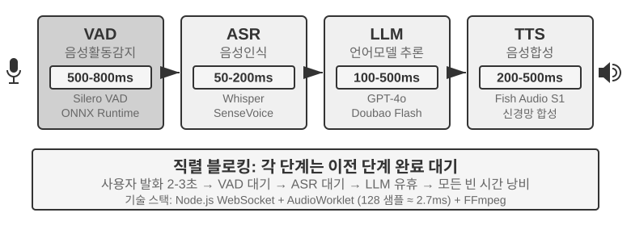


초기 음성 비서가 이런 4단계 직렬 파이프라인을 채택한 이유는 단순하다. 음성 인식, 언어 이해, 사고, 음성 합성이라는 네 과제를 동시에 처리할 단일 모델이 없었기 때문이다. 모듈화된 아키텍처 덕분에 각 구성 요소를 독자적으로 개발하고 최적화할 수 있었다. 그러나 모듈화의 대가는 지연의 누적이다. 매 단계마다 이전 단계가 끝나야 시작할 수 있다.

**VAD**는 파이프라인의 출발점으로, 오디오 스트림을 계속 듣는다. 가장 핵심적인 설계는 발화 종료 검출(End-of-Speech Detection)이다. 보통 500~800ms의 연속 무음 임계값을 둔다. 사용자가 반 초 이상 말을 멈추면 VAD는 사용자가 다 말했다고 판단한다. 이것이 첫 번째 지연을 만들며, 달성하기가 좀처럼 쉽지 않다. 임계값이 너무 짧으면 사용자가 생각하다 잠깐 멈춘 것만으로 "다 말했다"로 오인해 문장이 잘린다. 너무 길면 사용자가 말을 마친 뒤 거의 1초를 건조하게 기다려야 반응이 온다.

**ASR**은 오디오 파형을 글자로 바꾼다. Whisper, SenseVoice 같은 모델이 5초짜리 오디오를 전사하는 데, GPU에 배포한 중소 규격 모델이라면 보통 50~200ms가 걸린다. 더 큰 규격의 모델이나 자원이 제약된 배포 환경에서는 200~500ms에 달한다(실험 9-3의 대조군이 후자에 해당한다). 더 중요한 문제는 이것이다. VAD가 대기하고 ASR이 전사하는 그 시간 내내, 뒤의 LLM은 완전히 놀고 있다. 어떤 정보도 받지 못해 미리 생각을 시작할 수 없다.

**LLM** 추론(inference) 단계에서는, 아무리 잘 최적화해도 컨텍스트 길이에 따라 첫 토큰 지연(TTFT, 곧 모델이 첫 글자를 토해 내기까지의 대기 시간)만 보통 100~500ms가 필요하고, 첫 문장을 온전히 출력하려면 추가로 약 100ms가 더 든다. 추론(reasoning)을 켜면 시간은 5~10초로 늘어날 수 있다. 전통적 아키텍처에서는 TTS가 반드시 LLM이 답 텍스트를 온전히 뱉어 낸 뒤에야 작업을 시작할 수 있다.

**TTS**는 답 글자를 음성으로 바꾼다. 합성에는 보통 200~500ms가 든다. 각 단계의 지연을 더해 보면(그림 9-2): VAD(500~800ms) + ASR(50~200ms) + LLM(100~500ms) + TTS(200~500ms), 합계 약 0.9~2초. 이는 모든 서비스가 한가하고 대기열에 아무도 없는 이상적 상황이다.


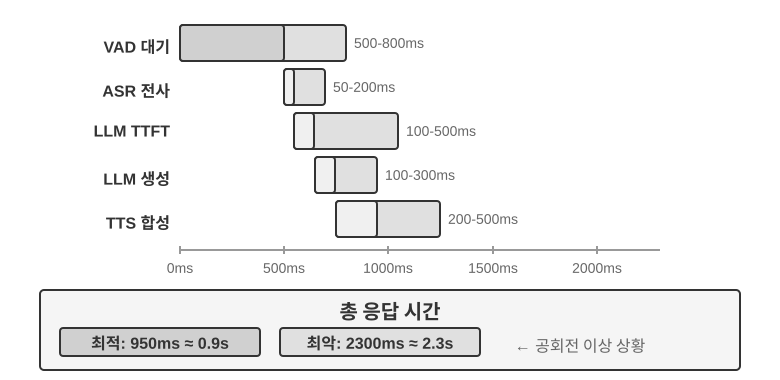


실 서비스에 투입되면 대기 지연이 상황을 더 악화시킨다. 식당 줄과 같은 이치다. 주방이 바쁠수록 대기 시간은 길어지고, 그것은 선형이 아니라 급증한다(그림 9-3). 서버에 어떤 대기열도 없을 때(곧 "공회전" 상태), 하나의 요청을 처리하는 시간을 공회전 지연이라 한다. 그러나 여러 요청이 동시에 도착하면, 뒤에 온 요청은 줄을 서서 기다려야 한다.

직관적으로, 이용률이 높아질수록 대기 시간은 비선형적으로 급증한다. 구체적인 수학적 관계는 대기열 이론(queuing theory)이 준다(여기서는 직관적 이해만 하고 엄밀한 유도는 하지 않는다). 총 지연 ≈ 공회전 지연 × 1/(1-이용률). 이용률이란 서버가 바쁜 시간의 비율이다. 예를 들어 이용률 50%는 서버가 절반은 요청을 처리하고 절반은 쉬고 있음을 뜻한다. 이용률이 50%이면 지연은 공회전의 2배가 되고, 이용률이 80%이면 5배가 된다. 이것이 서버를 고부하로 장시간 운영하면 안 되는 이유다.


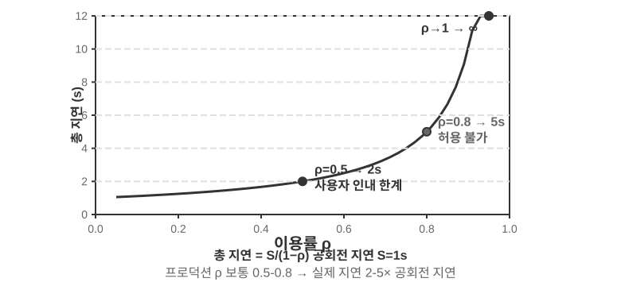


> **실험 9-1 ★: 전통 음성 Agent 구축**
>
> 이 실험은 사용자가 마이크로 AI 음성과 상호작용하는 완전한 실시간 음성 대화 시스템을 구축한다. 시스템은 프론트엔드-백엔드 분리 아키텍처를 채택하고, WebSocket으로 실시간 통신한다.
>
> 핵심 흐름은 엄격한 직렬 패턴을 따른다. 프론트엔드가 마이크 입력을 잡아 WebSocket으로 실시간 전송해 백엔드로 보낸다. 백엔드는 Silero VAD 모델을 돌려 음성 활동을 검출한다. 전통적인 볼륨 검출 방식에 비해 정확도가 더 높고 잡음 내성도 더 강하며, 약 500ms의 연속 무음이 감지되면 해당 오디오 조각을 뽑아 다음 처리로 넘긴다.
>
> ASR, LLM, TTS 각 단계는 여러 제공자(provider)를 유연하게 갈아끼울 수 있어, 개발자는 지연, 정확도, 지역 네트워크 조건에 따라 최적 조합을 선택할 수 있다.
>
> **실험 9-2 ★: PineClaw Voice API로 전화 Agent 구축**
>
> 실험 9-1은 브라우저 안의 음성 대화 시스템을 구축했지만, 현실의 많은 Agent 과제는 실제 전화를 걸어야 한다. 상담원에게 전화해 청구서를 협상하고, 식당을 예약하고, 주문을 확인하는 식이다. 4장은 PineClaw의 채널(Channel) 메커니즘을 통해 이벤트 구동 아키텍처가 전화 알림의 응답 지연을 분 단위에서 초 단위로 낮추는 모습을 보여 주었다. 이 실험은 그 가운데서도 음성 통화 자체의 구축에 초점을 맞춘다. [PineClaw Voice API](https://pineclaw.com/)(저자 팀이 개발)를 예로 들면, 이런 실 서비스급 전화 음성 API는 대개 발신, IVR 내비게이션(곧 "조회는 1번, 상담원 연결은 0번" 식의 전화 메뉴), 통화와 전사의 전 과정을 한데 감싼다. Agent가 전화번호, 목표, 컨텍스트 정보를 제공하면 음성 Agent가 통화 전체를 마치고 구조화된 통화 기록을 돌려준다.
>
> **실험 목표**: 실제 전화로 과제를 완수할 수 있는 Agent를 구축하고, PineClaw Voice를 도구로서 ReAct 루프에 통합한다.
>
> **기술 방안**: PineClaw Voice Python SDK(`pine-voice`)를 써서 Agent에 `make_phone_call` 도구를 단다. Agent는 사용자의 과제 설명(예: "내일 오후 3시 치과 예약 잡아 줘")을 받아 ReAct 사고로 (1) 어느 전화번호를 걸어야 할지, (2) 통화의 목표와 핵심 정보는 무엇인지, (3) 통화가 끝난 뒤 사용자에게 결과를 어떻게 보고할지 결정한다.
>
> Agent의 작업 흐름: 사용자가 "의원에 전화해 내일 검사 예약해 줘"라고 말한다 → Agent가 필요한 정보(의원 전화번호, 예약 시간, 환자 이름)를 생각한다 → 정보가 부족하면 사용자에게 확인한다 → `make_phone_call` 도구를 호출한다 → PineClaw가 전화를 걸고 상대와 대화하며 예약을 마친다 → Agent가 통화 요약과 전사를 받는다 → 사용자에게 결과를 보고한다.
>
> **인수 기준**: 시험 전화를 성공적으로 건다(자기 휴대폰에 먼저 걸어 연결을 검증해도 된다). Agent가 과제 설명에 따라 자율적으로 통화 파라미터를 정하고, 통화 종료 후 핵심 정보(예약 시간, 확인 번호 등)를 올바르게 뽑아내 사용자에게 보고한다. API를 직접 쓰는 것과 Agent의 ReAct 루프로 호출하는 것의 차이도 비교한다. 후자는 정보가 불완전한 상황(예: 사용자가 전화번호를 안 줬을 때 먼저 검색)도 처리할 수 있다.
>
> 이 실험은 음성 Agent의 한 가지 중요한 응용 방향을 보여 준다. **Agent는 사용자와 음성으로 대화할 뿐 아니라, 사용자를 대신해 외부 세계와 전화로 상호작용할 수도 있다.** PineClaw의 음성 Agent는 전문적으로 훈련되어 시간 단위의 대기, 전화 메뉴 내비게이션, 복잡한 협상까지 감당한다. AI가 통신사 상담원 전화를 대신 걸어 사람 상담원 연결을 기다리게 하는 모습을 상상해 보라. 이런 것들이야말로 전통적인 직렬 음성 파이프라인이 감당하기 어려운 상황이다.

### 직렬 파이프라인의 전 구간 스트리밍화

한 가지 흔한 오해를 바로잡자. 위의 0.9~2초 지역은 "각 단계가 모두 끝난 뒤에야 바통을 넘기는" **완전 직렬** 상황을 계산한 것이다. 그러나 2025년의 실 서비스 시스템은 더 이상 이렇게 하지 않는다. 주류 방식은 모듈화를 버리는 것이 아니라 VAD-ASR-LLM-TTS의 분업은 유지하면서 각 단계를 **스트리밍**으로 바꾸어, 이웃한 단계가 시간상 겹치게 만드는 것이다.

- **ASR은 들으면서 전사**: 스트리밍 인식을 채택해, 사용자가 말하는 중에도 글자가 계속 만들어진다. VAD가 문장 전체가 끝났다고 판단하기를 기다려 전사를 시작할 필요가 없다.
- **LLM은 문장 단위로 잘라 출력**: 모델이 생성하면서 구두점이나 의미 단위로 답을 작은 문장으로 자르고, 첫 문장이 만들어지는 대로 하류로 보낸다. 답 전체가 완성되기를 기다리지 않는다.
- **TTS는 문장 단위 스트리밍 합성**: 첫 작은 문장을 받자마자 합성·재생을 시작하고, 뒤따르는 문장은 생성되는 대로 이어 붙인다. 사용자가 첫 음절을 듣는 시간이 크게 앞당겨진다.

이렇게 하면 ASR, LLM, TTS 세 단계는 더 이상 이어달리기식의 선후 관계가 아니라, 파이프라인 위에서 동시에 가동하는 세 작업대에 가까워진다. LiveKit Agents, Pipecat 같은 오픈소스 프레임워크와 주요 상용 아웃바운드 시스템이 모두 이 노선을 따른다. 전 구간 스트리밍화 뒤에는 엔드투엔드 지연을 보통 600~800ms까지 줄일 수 있어, 완전 직렬의 0.9~2초에 비해 분명히 나아진다.

그러나 스트리밍화가 압축할 수 있는 것은 "전사, 사고, 합성"이라는 세 단계가 겹칠 수 있는 계산뿐이다. 한 단계의 지연은 압축하지 못한다. 바로 **VAD의 무음 대기와 턴 판단 자체**다. 시스템은 여전히 500~800ms의 무음 임계값으로 "사용자가 정말 다 말했는지"를 추측해야 하며, 이 대기는 파이프라인이 가동되기 위한 전제라서 겹침으로는 제거할 수 없다. 이 단계의 지연까지 함께 압축하려면, "각 단계를 겹치게 만드는 일"에 매달릴 것이 아니라 가장 앞단의 감지 단계 자체로 눈을 돌려야 한다.

### 스트리밍 음성 감지: VAD + ASR을 대체하다

이 감지 전단은 두 단계로 이루어진다. VAD가 사용자 발화가 끝났는지 판단하고, ASR이 오디오를 글자로 전사한다. 둘이 합쳐져 전체 파이프라인이 언제 시작되고 어떤 입력을 받을지를 결정한다. 전통적 VAD + ASR 직렬 연결은 근본 문제 세 가지를 안고 있다.

1. **지연 누적**: VAD는 반드시 500~800ms의 무음을 기다려야 사용자가 발화를 마쳤음을 확인할 수 있다. 미래를 알 수 없기에 "기다려 보는 것"으로만 "정말 끝났는지"와 "생각하느라 잠시 멈춘 것인지"를 구분한다.
2. **정보 손실**: VAD는 "소리 있음/없음" 같은 이진 신호만 출력한다. 감정 변화, 어조의 기복, 머뭇거림과 정지, 배경 환경 같은 음향 디테일이 모두 사라진다. 오판 문제는 복잡한 환경에서 특히 심하다. 사용자가 조금 길게 멈춘 것만으로 "다 말했다"로 오인해 문장이 잘리고, 배경 소음이 잘못 촉발해 아무도 말하지 않는데 시스템이 처리를 시작하며, 사용자가 "응" 하고 덧붙인 한마디가 끼어들려는 것인지, 수긍의 표시인지 알 길이 없다.
3. **정확도 저하**: VAD는 연속 오디오를 독립된 조각들로 잘라 각각 ASR에 보내 인식하므로 컨텍스트의 연속성이 깨진다. 앞뒤 문맥이 있어야 올바르게 인식할 수 있는 내용(이메일 주소, 브랜드명, 인명, 고유명사)의 오류율이 눈에 띄게 올라간다. 예를 들어 사용자가 이메일 "john dot smith at gmail dot com"을 말할 때 "john"과 "smith"가 다른 조각에 잘리면, "smith"는 문맥이 없어 "miss"로 잘못 인식될 수 있다.

**스트리밍 음성 감지 모델**이 근본적 해법을 제공한다. 먼저 "스트리밍"의 기술적 의미를 분명히 하자. 음성 모델이 스트리밍 처리를 할 수 있는지의 핵심은 두 가지에 달려 있다. **인코더가 인과적(causal)이거나 청크 단위인가**(이미 도착한 오디오에만 의존하고 전체 녹음을 보지 않아도 되는가), 그리고 **디코딩이 증분형인가**(작은 오디오 조각이 들어올 때마다 결과의 일부를 출력하는가). Whisper가 스트리밍을 못 하는 것은 디코딩 방식 때문이 아니다. Whisper의 디코딩 자체는 자기회귀적이다. 문제는 인코더가 (고정 30초, 모자라면 패딩하는) 완전한 오디오 구간이 있어야 작동한다는 점에 있다. 한 가지 더, 스트리밍 인식 자체가 새로운 기술은 아니다. RNN-T와 스트리밍 Conformer로 대표되는 전통적 스트리밍 ASR은 이미 업계에 대규모로 배포되어 있다. 휴대폰의 실시간 자막, 입력기의 음성 입력이 다 이런 모델을 쓰며, 이것들은 LLM과는 아무 상관이 없다.

이 절이 주목하는 것은 새로운 노선이다. **LLM 기반의 스트리밍 청각 감지**. 오픈소스 LLM을 백본으로 사후 훈련을 수행해, 모델이 연속 오디오 스트림에서 직접 의미 수준의 응답을 출력하게 만드는 것이다. "인식"과 "이해"를 같은 모델 안으로 합친다. 이것은 전통적 스트리밍 ASR의 업그레이드이지 스트리밍 기술의 발명은 아니다. 증분 인식의 지연은 마찬가지로 단일 추론 시간(수십에서 100~200ms) 수준에 머무르지만, 모델이 보는 것은 VAD가 잘게 썬 고립된 조각이 아니라 대화 시작부터 현재 순간까지의 연속 오디오 스트림이다. 그래서 완전한 컨텍스트 위에서 컨텍스트 내 학습(In-Context Learning)을 할 수 있어, 사용자의 개인 정보, 전문 용어, 발음 습관의 인식 정확도가 뚜렷하게 올라간다.

이 노선의 또 하나 핵심 이점은 LLM의 세계 지식과 상식적 추론 능력을 상속한다는 점이다. 어차피 백본 모델이 방대한 텍스트를 보았기 때문이다. 예를 들어 모델은 "사과" 뒤에 "발표회"가 오면 과일이 아니라 Apple을 가리킬 확률이 높다는 것을 안다. 이런 지식 강화 덕분에 금액, 지명, 브랜드명 같은 고가치 정보의 인식 정확도가 전통 ASR을 크게 웃돈다. 이 노선에 이미 쓸 만한 모델도 나와 있다. Fixie의 Ultravox는 오디오를 LLM 백본에 직접 넣고 텍스트와 의미 토큰을 출력한다. 이 절의 실험에 쓰인 Qwen2-Audio, 알리바바의 Qwen2.5-Omni도 같은 부류의 오디오 네이티브 모델이다.

다만 VAD를 대체하려고 반드시 온전한 오디오 대형 모델을 동원할 필요는 없다. 첫 번째 문제, 곧 **사용자가 정말 다 말했는지**만 판별하면 된다면 더 가벼운 길이 하나 있다. 이 "턴 판단"을 인식기 자체에 직접 밀어 넣는 것이다[^ch9-11]. 방법은 아주 작은 오픈소스 스트리밍 인식 모델에 LoRA를 한 층 얹어, 전사를 하면서 동시에 **의미와 무음을 함께 고려해** "이 말이 이미 하나의 완결된 뜻을 표현했는지"를 판단하게 하는 것이다. 턴 안의 정지(전화번호를 말할 때 잠깐 멈춤)가 턴 사이의 간격보다 오히려 더 길기 일쑤여서, 무음 임계값에만 기대면 양쪽 모두를 만족시킬 수 없기 때문이다. 더 흥미로운 결론은 이것이다. 모델이 늘 "말을 거둘 것인가"에서 흔들리는 근본 원인은 대개 모델 구조에 있지 않고, **훈련 라벨을 "신의 관점"으로 붙였다는 데 있다**. 주석을 달 당시에는 의사결정 시점 이후에야 나타나는 오디오까지 동원해 라벨을 만들었는데, 실 서비스의 모델은 미래를 볼 수 없다. 라벨 하나하나를 "의사결정 당장 얻을 수 있는 정보만"으로 다시 달면, 이런 허위적 흔들림이 사라진다. 이것은 7장 사후 훈련의 한 판단과도 맞닿아 있다. 많은 경우, 아키텍처보다 데이터가 더 결정적이라는 판단이다. 이 더 가벼운 노선에도 이미 실 서비스급 구현이 있다. Deepgram의 Flux, AssemblyAI의 Universal-Streaming이 종점과 턴 판단을 스트리밍 인식 모델에 직접 박아 넣고 음성 Agent 전용으로 설계되었고, 오픈소스 쪽에서는 LiveKit과 Pipecat이 의미적 턴 검출 모델을 제공한다.

[^ch9-11]: 턴 판단을 인식기에 통합하는 일, 그리고 "라벨의 신의 관점"이라는 진단은 Li, Bojie and Noah Shi. *The Trade-off Was in the Labels: Causal Supervision for Turn-Aware Streaming ASR.* 2026(출간 예정)을 볼 것.

모델이 출력하는 것은 글자만이 아니다. 일련의 **음향 이벤트 특수 표시**도 함께 출력한다. 이것들은 모델 훈련 시에 도입한 전용 토큰으로, 모델은 해당 음향 이벤트를 감지하면 자동으로 출력하는 법을 배운다. 흔한 몇 부류는 다음과 같다.

- `<speak_start/end>`: 단순한 무음 검출이 아니라 의미와 음향을 종합적으로 고려해 발화의 시작과 끝을 결정한다.
- `<interrupt>`: 사용자가 정말 끊으려는 것인지, 그저 수긍하거나 배경 소음에 반응한 것인지를 구분한다.
- `<emotion:happy/frustrated>`: 감정 표시.
- `<laugh>` / `<sigh>`: 웃음, 한숨 같은 준언어적 신호.
- `<music>` / `<noise>`: 환경음.

이 표시들은 글자 토큰과 함께 통일된 이벤트 흐름을 이루어 사고 계층으로 함께 들어간다.

```
Input audio: "Um, actually I think... no wait, let me reconsider."
Model output stream:
  <speak_start> Um, <emotion:hesitant> actually I think...
  <silence:500ms> no wait, <emotion:confident> let me reconsider <speak_end>
```

모델이 출력하는 것이 글자 전사만이 아니라 음성 이벤트 표시(말 시작/끝, 감정 변화, 침묵 간격)까지 포함한다는 점에 주의하라. Agent 프레임워크는 이 표시들을 활용해 더 자연스러운 상호작용을 구현할 수 있다. 예를 들어 사용자의 망설임을 감지하면 능동적으로 선택지를 제시할 수 있다.

> **실험 9-3 ★: Qwen2-Audio로 스트리밍 음성 감지 모의**
>
> 먼저 실험 설계를 분명히 해야 한다. Qwen2-Audio 자체는 전체 입력을 한꺼번에 받는 비스트리밍 모델이다. 이 실험은 **청크 입력으로 스트리밍 처리를 모의**한다. 연속 오디오 스트림을 고정 길이의 작은 조각으로 잘라, 각 조각을 그때까지 누적된 오디오 컨텍스트와 함께 모델에 보낸다. 모델은 점진적으로 텍스트와 음향 이벤트 토큰(웃음, 정지 같은 비언어적 신호)을 생성하고, 각 청크가 투입되어 텍스트가 나오기까지의 지연을 측정한다. 여기엔 핵심적 대가가 따른다. Qwen2-Audio의 인코더는 증분형이 아니어서, 새 청크를 처리할 때마다 그전에 누적된 오디오 전부를 처음부터 다시 인코딩해야 한다. 그래서 대화가 길어지고 누적 오디오가 많아질수록 단일 청크의 인코딩 지연이 높아진다. 이것이 바로 "모의 스트리밍"과 "진짜 스트리밍"(증분 또는 인과적 인코더를 써서 새로 도착한 짧은 오디오만 증분 인코딩하는 방식)의 본질적 차이다. 이 설계는 "완전한 컨텍스트를 보존하는 연속 감지"가 주는 정확도 이득은 보여 주지만, 지연 숫자는 청크 단위와 추론 속도만을 반영할 뿐, 진짜 스트리밍으로 설계된 모델(예: 청크 인코딩을 채택한 Qwen3-Omni)의 첫 패킷 지연과는 같지 않다. 관심 있는 독자는 후자로 실험을 다시 해 보아도 좋다. 대조안은 전통적 VAD + Whisper ASR 파이프라인이다. 세 종류의 상황을 시험한다. 정상 대화, 정지가 있는 긴 문장, 배경 소음이 있는 대화.
>
> 결과: 청크 모의 방안의 증분 인식 지연은 100~200ms 수준으로 제어할 수 있다(구체적 수치는 청크 길이와 하드웨어에 따라 다름). 반면 전통 방안은 VAD가 말 끝남을 확인(600ms)한 뒤 Whisper 추론(본 실험 설정에서 약 200~500ms)을 더해 총 800~1100ms가 필요하다. 정지가 있는 상황에서, VAD는 첫 번째 긴 정지에서 곧바로 "다 말했다"로 오인해 문장을 두 부분으로 잘라 각각 인식했다. 그래서 "대략 두 시쯤"이 문맥이 없어 "대략 영 시쯤"으로 잘못 인식되었다. 반면 청크 방안은 완전한 컨텍스트를 유지해 문장 전체를 올바르게 인식했다. 배경 소음 상황에서는 Qwen2-Audio가 `<|noise|>` 토큰을 출력해 소음이 있음을 표시하되 인식을 끊지 않았고, 전통 VAD는 소음에 잘못 촉발되어 인식 흐름이 조기에 시작되었다.

## 패러다임 2 · 엔드투엔드 전모달 모델(Omni)

직렬 파이프라인 전체를 돌아보자. 감지 전단을 스트리밍 음성 감지로 교체했더라도, 그것은 궁극적으로 "듣고, 생각하고, 말하는" 셋을 여전히 세 개의 독립된 모델에 분담시키며 그 사이를 이산적 인터페이스 하나로 잇는 것이다. 이 인터페이스가 아무리 넓어봐야 몇몇 의미 토큰과 드문드문한 음향 표식에 불과하다. 화자의 당장 감정, 어조, 말투, 그리고 배경의 환경음과 음악은 인계 과정에서 대부분 손실된다. 게다가 세 단계가 각자 훈련되고 각자 최적화되어 서로 협력하기 어렵다. 엔드투엔드 전모달 모델(Omni)은 다른 길을 택한다. 단일 모델이 직접 오디오를 "듣고" 답을 "생각하고" "말하는" 것으로 셋을 하나로 합친다(그림 9-4). 훈련 데이터만 충분하다면, 모델 내부의 잠재 공간(Latent Space)이 텍스트 외에 이 준언어적 정보들을 생성단까지 직접 전달한다. 지연은 더 낮아지고, 운율과 감정도 보존된다. 트레이드오프는 이렇다. **직렬 파이프라인**은 모듈이 명확하고 각 단계를 독자적으로 조율할 수 있으며 해석 가능성이 좋다. **엔드투엔드 모델**은 지연이 더 낮고 비문자 정보를 보존하지만, 훈련 데이터 요구량이 더 크고 해석 가능성은 더 떨어진다.

자주 빠뜨리는 차원 하나를 더 보태야 한다. 엔드투엔드의 이점은 주로 **지연**에서 두드러지며, **정확도** 차원에서는 반드시 우위에 서는 것은 아니다. 대조할 만한 방안 하나가 **자기 직렬 연결**(self-cascade)이다. 같은 모델이 먼저 오디오를 구조화된 텍스트로 전사하고, 그 텍스트 위에서 추론하는 방식이다. 한 번에 엔드투엔드로 답하는 것과 비교해 어느 쪽 정확도가 더 높은지는 구체적 과제에 따라 다르다. 그 법칙을 요약하면 이렇다. 답이 주로 의미 내용(곧 "무엇이라고 말했는가")으로 결정되고, 중간 텍스트가 과제 관련 정보를 충분히 담을 수 있다면, 자기 직렬 연결의 정확도는 엔드투엔드와 맞먹거나 더 낫다. 이 이점은 감지 능력이 약한 모델에서 특히 뚜렷하다. 반대로 답이 텍스트로 표현하기 어려운 비언어적 단서(어조, 감정, 환경음)에 크게 의존할 때, 엔드투엔드가 비로소 뚜렷한 우위를 보인다. 더 중요한 점은, 둘의 우열은 **과제의 성격에 따라 사전에 판정할 수 있다**는 것이지 "엔드투엔드가 더 진일보했다"는 식의 단정으로 귀납되지 않는다. 여기서 한 가지 설계 원칙을 더 이끌어 낼 수 있다. 성능을 결정하는 핵심은 흔히 중간 표현이라는 **병목**을 도입했는가에 있지 않고, 그 병목이 담고 있는 정보에 있다. 중간 텍스트를 단순한 전사에서 (감정, 말속도, 환경음을 덧붙인) 구조화된 표현으로 끌어올리면, 엔드투엔드 본래의 정확도 이점이 흔히 함께 줄어든다. 이는 앞의 〈스트리밍 음성 감지〉가 주장한 "감지 계층이 순수 텍스트만 출력해서는 안 된다"는 입장과 맥을 같이한다[^ch9-13].

그러나 Omni가 아무리 강해도 본질적으로는 세 모델을 하나로 합친 것에 불과하며, **"번갈아 말한다"는 가정을 철폐하지는 않는다**. 그것은 여전히 VAD에 의존해 발언권을 나눈다. 사용자가 소리를 내면 멈추고, 사용자가 무음이 되면 곧장 입을 연다. 그래서 그 익숙한 문제가 다시 떠오른다. 사용자가 숫자 나열을 하다 중간에 잠깐 멈추면, Omni는 상대가 다 말했다고 판단하고 억지로 끼어든다. 앞의 스트리밍 음성 감지는 턴 판단을 무음 길이에서 의미 층위로 끌어올려 이런 오판을 크게 완화하지만, 그것은 어디까지나 "턴" 프레임 안에서의 부분적 수선일 뿐 번갈아 말하기 자체를 없애지는 않는다. **근본적으로** 이 곤경에서 빠져나오려면 "턴" 프레임 안에서 수선할 것이 아니라, 모델이 듣는 동시에 말하며 언제 입을 열지 스스로 결정하게 하여 "누가 말할 차례인가"라는 경성 전환이 애초에 없도록 만드는 수밖에 없다.

[^ch9-13]: 직렬 연결과 엔드투엔드의 정확도 우열이 언제 역전되는지, 그리고 과제 성격(중간 표현이 과제 관련 정보를 충분히 담을 수 있는가)에 따라 그 방향을 어떻게 예측하는지에 대한 완전한 교차 모달 측정은 Li, Bojie and Noah Shi. *The Cascade Gap: When and Why Self-Cascades Help Multimodal Agents.* 2026(출간 예정)을 볼 것.

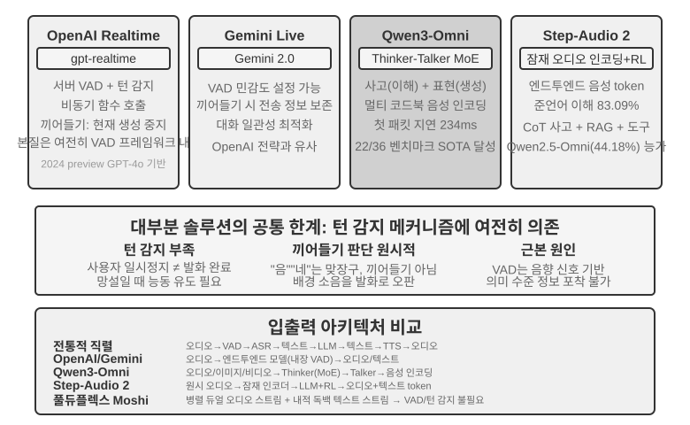

**OpenAI Realtime API**는 모델 층위에서는 엔드투엔드에 가깝다(모델이 원래 오디오를 처리한다). 그러나 인터랙션 제어 층위에서는 여전히 전통적 VAD에 의존하여, 완전한 엔드투엔드로 옮겨가는 중간 방안에 해당한다. 처음(2024년 preview)에는 GPT-4o에서 돌았고, 2025년 정식 GA 이후에는 음성 전용 모델 **gpt-realtime**으로 바뀌었다(더 이상 GPT-4o의 한 모드가 아니라 실시간 음성을 위해 따로 최적화된 모델이다). API는 기본으로 서버 쪽 VAD를 켜 두어 사용자가 언제 말을 시작하고 끝내는지 자동으로 판단한다. 대화 중 끼어들기를 지원한다. 사용자가 입을 열면 곧바로 현재 음성 생성을 멈춘다. 두 사람이 마주 보고 이야기할 때 한쪽이 끼어들면 다른 쪽이 자연스럽게 멈추는 것과 같다. gpt-realtime은 비동기 함수 호출도 도입했다. 모델이 도구의 결과를 기다리면서 동시에 사용자와 말을 이어 갈 수 있어, 도구 지연을 대화 과정 속에 숨긴다. 이런 것들이 경험을 개선하지만, 본질은 여전히 VAD 프레임 위에서의 최적화다. **Gemini Live API**도 비슷한 구상으로, VAD 감도 설정을 지원하고 끼어들 때 이미 보낸 정보를 보존해 대화가 자연스럽게 이어지게 한다.

**Qwen3-Omni**는 Thinker-Talker 아키텍처를 채택한다. 사고(이해와 추론)와 표현(음성 생성)을 두 전용 모듈로 나누고, 텍스트, 이미지, 오디오, 영상의 감지와 생성을 통일한다. Qwen3-Omni의 낮은 첫 패킷 지연은 생성단(Talker)의 아키텍처에서 나온다. Talker는 다중 코드북 자기회귀 방식으로 오디오 토큰을 점진적으로 생성하고, 인과적(causal) 코덱이 이 토큰들을 증분적으로 파형으로 디코딩한다. 그래서 사고 모듈이 텍스트를 뱀자마자 Talker가 뒤이어 음성을 스트리밍 합성할 수 있으며, 답 전체가 생성될 때까지 기다릴 필요가 없다. 공식 보고에 따르면, 냉간 시동 이론 첫 패킷 지연은 약 234ms까지 낮아지며, 19개 언어 이해와 10개 언어 생성을 지원하고, 36개 음영상 벤치마크 중 22개에서 선두다.

**Step-Audio 2**는 다른 노선을 걷는다. 원시 오디오 입력을 직접 처리하고 텍스트와 오디오를 출력하며, 진정한 엔드투엔드 음성 대화를 구현한다. 무엇을 말했는지(의미 정보) 이해할 뿐 아니라, 어떻게 말했는지, 곧 준언어 정보(Paralinguistic Information)까지 감지한다. 예를 들어 화자의 감정이 기쁜지 분노인지, 말속도가 급한지 머뭇거리는지, 어조가 올라가는지 낮아지는지, 그리고 배경의 환경음과 음악 같은 것들이다. 사고와 강화학습으로 표현력이 풍부한 답을 생성하고, RAG 메커니즘과 외부 도구(웹 검색, 오디오 검색)도 통합한다. Step-Audio 2 논문 보고에 따르면, 그들이 제안한 준언어 이해 벤치마크 StepEval-Audio-Paralinguistic에서 Step-Audio 2의 정확도는 83.09%로, 같은 시기 오픈소스 전모달 모델 Qwen2.5-Omni(44.18%)를 앞설 뿐 아니라 GPT-4o Audio(43.45%)와 Kimi-Audio(49.64%)보다도 높다.

Step-Audio R1은 Step-Audio 시리즈의 후속 작업으로, Step-Audio 2의 엔드투엔드 음성 대화 아키텍처 위에 사고 능력을 직접 오디오 모델 안으로 내재화한다. 둘은 같은 기술 노선의 점진적 진화를 대표한다.

## 패러다임 3 · 전이중 인터랙티브 모델(Full-Duplex / Interactive)

패러다임 2는 세 모델을 하나로 합쳤지만, 여전히 "번갈아 말한다"는 가정을 지킨다. 사용자가 말하거나 모델이 말하거나 둘 중 하나이고, 전환점은 VAD나 의미로 추측한다. 그런데 어떤 상황은 "당신 한 마디, 나 한 마디"하는 번갈아 말하기가 아니다. **동시통역**이 한 예다. 통역사는 화자가 문장을 다 마치기를 기다렸다가 입을 여는 것이 아니라, 듣는 동시에 머릿속으로 정리하다가 한 덩어리의 생각이 대략 완성되면 곧바로 통역한다. 청취와 통역이 줄곧 겹친다. **음악에 맞춰 북을 치는** 리듬 게임은 더 극단적이다. 청각이 끊임없이 흐르는 음악을 계속 쫓고, 양손은 박자를 맞춰 즉시 두드려야 하며, 다음 박까지 예측해야 한다. 여기서는 "한 턴"이라는 것조차 의미가 없다. 입력은 멈추지 않는 연속 흐름이다. 이런 과제는 턴 바이 턴(turn-by-turn) 방식에 근본적 도전을 던진다. 듣기, 사고, 동작이 동시에 일어나기를 요구하는데, 턴 방식의 전제는 셋을 선후의 다른 시간 조각에 나누어 놓는 것이기 때문이다. 전이중 모델은 바로 "VAD에서 벗어나기"라는 길을 논리적 종착지까지 몰고 간 것이다. 아예 "번갈아 말한다"는 가정 자체를 없애고, 모델이 **동시에 계속 듣고 말하게** 만든다.

연구의 선구는 Kyutai의 **Moshi**(2024)다. Moshi는 두 오디오 스트림(사용자 목소리와 모델 자기 자신의 목소리)을 병렬로 모델링하고, 거기에 "내적 독백" 텍스트 스트림을 한 줄 더 얹어 생성 음성의 언어적 품질을 높인다. 어느 순간에나 듣고 있으므로 겹쳐 말하기, 언제든 끼어들기가 자연스러운 동작이 된다. 명시적 끼어들기 검출 로직이 전혀 필요 없고, 엔드투엔드 지연은 약 200ms로 사람 대화의 자연스러운 리듬에 가깝다.

2026년, Mira Murati가 세운 **Thinking Machines Lab**이 그들이 **인터랙션 모델(Interaction Model)**이라 부르는 새 범주를 예고하며[^ch9-14], 전이중이 깔고 있는 주장을 분명히 꺼내 들었다. 인터랙티브성은 VAD 같은 외장 harness로 모델 밖을 둘러싸는 것이 아니라 모델 자체에 내장되어야 한다. 원문을 빌리면, "인터랙티브성이 지능과 함께 확장되려면, 인터랙티브성 자체가 모델의 일부가 되어야 한다." 아키텍처로 내려오면 **마이크로 턴(micro-turn)**이다. 모델이 한 턴 전체가 끝나기를 기다리지 않고, 약 200ms를 한 단위로 계속 "200ms를 읽어 들이고 200ms를 생성"한다. 오디오, 영상, 텍스트의 여러 흐름이 엮여 나아간다. 이 단위는 의도적 절충이다. 충분히 가늘어서 무음, 겹침, 끼어들기가 모두 연속 흐름으로서 모델의 컨텍스트에 보존되며, 더 이상 억지로 맞춰야 할 인위적 턴 경계가 없다. 그러면서도 충분히 굵어서 여러 모달리티를 덩어리째 병렬 처리하고, 지연을 실시간으로 감지 가능한 범위 안에 누른다. 인터랙션이 모델 내부로 편입되었기에, "듣는 동시에 말하기", "보면서 끼어들기" 같이 과거에는 전용 harness를 짜 맞춰야만 만들 수 있던 행동들이 이제는 모델의 본분이 되고, 모델과 함께 강해진다. 첫 모델 TML-Interaction-Small은 세 줄기 흐름을 처음부터 함께 훈련하여, 사용자가 버그가 들린 코드를 적고 있음을 감지하거나 누군가 화면에 들어오면 능동적으로 입을 열 수 있다.

"느린 사고"를 연결하는 방식도 대표적이다. 인터랙션 모델 자신은 대화를 계속 온라인으로 유지하는 것만 책임지고, 깊은 추론이나 도구 호출이 필요한 문제를 만나면 후면의 더 강한 추론 모델에 위임한다. 넘기는 것은 고립된 질문 하나가 아니라 **대화 전체의 컨텍스트**다. 후면 모델이 추론하는 동안 결과는 스트리밍으로 돌려보내지고, 인터랙션 모델은 사용자를 방해하지 않는 타이밍을 골라 그것을 대화에 자연스럽게 짜 넣는다. 그 사이에도 계속 말을 받고, 덧질문에 답하고, 화두를 놓치지 않는다. 이렇게 하여 "비사고 모델의 지연"으로 "추론 모델의 계획, 도구, 에이전트 능력"을 구현해 낸다. 공식 보고에 따르면, TML-Interaction-Small(276B 파라미터 MoE, 활성 12B)의 턴 전환 지연은 약 0.40초까지 낮아지며(GPT-realtime-2.0은 약 1.18초), 시각적 능동성을 평가하는 벤치마크에서 거의 0점인 경쟁작을 크게 앞선다. 집필 시점을 기준으로 여전히 연구 프리뷰 단계다.

[^ch9-14]: Thinking Machines Lab, "Interaction Models: A Scalable Approach to Human-AI Collaboration," 2026-05. https://thinkingmachines.ai/blog/interaction-models/

같은 해, OpenAI의 **GPT-Live**는 전이중을 실 서비스 규모로 가져왔다. ChatGPT 음성의 새 기본 모델로 전 세계에 펼쳐졌다. GPT-Live는 대화를 분리된 메시지 턴의 나열로 보지 않고, **입력을 계속 처리하면서 동시에 출력을 계속 생성**한다. 그래서 매초 수많은 인터랙션 결정을 내릴 수 있다. 말할 것인가, 계속 들을 것인가, 멈출 것인가, 끊을 것인가, 아니면 도구를 호출할 것인가. 겉으로 드러나는 모습은 이렇다. 사용자가 생각할 때 말을 가로채지 않고 조용히 기다리며, "응", "맞아" 같은 추임새로 듣고 있음을 표시하고, 실시간 번역처럼 반드시 듣는 동시에 말해야 하는 과제도 소화한다.

GPT-Live 역시 같은 빠름-느림 분업의 길을 걸었다. **"실시간 인터랙션"과 "깊은 사고"의 분리**다. 검색, 추론, 또는 더 복잡한 에이전트 조작이 필요한 순간, 인터랙션을 담당하는 GPT-Live는 과제를 후면의 최첨단 모델(발표 시점에는 GPT-5.5)에 위임하고 자신은 계속 대화의 흐름을 유지한다. 후면에서 결과가 나오면 그것을 다시 대화로 가져온다. GPT-Live-1과 mini 버전은 후면에서 GPT-5.5 Instant를 쓰고, Medium, High 단계는 사고를 켠 GPT-5.5를 호출하여 사용자가 필요에 따라 "빠름"과 "깊음" 사이에서 선택하게 한다. 이 "빠름-느림 분업"이 바로 다음 절 "사고 아키텍처의 트레이드오프"에서 펼칠 주제다.

이 장의 "VAD 대체" 서사를 돌아보자. VAD는 무음 임계값으로 발언권 전환을 추측하고, 스트리밍 감지(앞의 패러다임 1 〈스트리밍 음성 감지〉 절 참조)는 전환 판단을 의미 층위로 끌어올리며, 전이중 모델은 "전환" 자체를 철저히 해체한다. 줄곧 듣고 있으니 "끼어들기"는 더 이상 특별히 처리해야 할 이벤트가 아니며, barge-in 처리 사슬도 그래서 아키텍처 차원에서 대부분의 단계가 생략된다. 이것이 "VAD 대체"라는 서사선의, 집필 시점 기준 종착지다.

## 사고 아키텍처의 트레이드오프: 분리에서 통일로

진정으로 풀어야 할 것은 **실시간 응답과 깊은 사고 사이의 모순**이다. 사용자는 밀리초 단위의 응답을 기대하지만 복잡한 문제는 초 단위의 사고 시간이 필요하다. 낮은 지연을 유지하면서 모델이 충분히 깊이 생각하게 하려면 어떻게 해야 하는가? 이 모순은 엔드투엔드 아키텍처에만 속한 것이 아니며, 직렬 파이프라인도 마찬가지로 피할 수 없다.

아래의 세 방안은 선형적 기술 발전이 아니다. 그것들은 서로 다른 제약 조건에 대한 설계 트레이드오프로서 실무에서 공존하며, 어느 것을 고를지는 응용 사례가 지연과 사고 깊이에 어떤 요구를 갖느냐에 달려 있다. 먼저 셋의 분기점을 짚어야 한다. 방안 1과 방안 2는 본질적으로 "두 독립 모델이 동시에 도는" 빠름-느림 분업이며, 엔드투엔드에 의존하지 않고 심지어 직렬 파이프라인 위에 얹을 수도 있다. 오직 방안 3만이 사고를 엔드투엔드 모델 안에 진정으로 내재화한다.

주목할 것은, 2026년에 이르러 "빠름-느림 분리" 노선이 이미 최첨단 음성 제품의 주류 선택이 되었고 전용 이름까지 생겼다는 점이다. Thinking Machines Lab은 이것을 "인터랙션 모델(Interaction Models)"이라 부른다. 실시간 인터랙션 모델 하나에 비동기 후면 추론 모델 하나를 결합하는 식이다. xAI의 Grok Voice "Think Fast", Pine AI의 음성 Agent, 그리고 앞 절의 GPT-Live "위임"이 모두 "빠른 것은 전면에서 대화를 유지하고, 느린 것은 후면에서 깊이 추론하는" 같은 노선을 따른다. 통합이 아니라 분리를 택한 데에는 현실적 이유가 있다. 최첨단 추론 모델은 몇 달마다 한 번씩 새 버전이 나오고, 실시간 인터랙션 능력은 전용 데이터와 훈련 목표가 필요하다. 둘을 한 모델에 욱여넣으면 끊임없이 움직이는 표적을 좇게 할 뿐 아니라 가장 귀중한 추론 능력까지 희석할 위험이 있다[^ch9-8]. 반대로, 가장 강한 추론 모델을 그대로 후면에 두고 전면에는 가벼운 인터랙션 모델만 따로 훈련하면, 현재 가장 강한 "두뇌"를 언제나 쓸 수 있다. 이것이 바로 GPT-Live가 "최신 최첨단 모델로 계속 교체 가능"함을 강조하는 이유다. 아래에서 "조정 메커니즘이 약한 것에서 강한 것으로"의 순서로 세 방안을 본다.

### 방안 1: 빠른 사고로 임시 응대, 느린 사고로 답변

빠른 사고와 느린 사고가 병렬로 실행된다(그림 9-5). 빠른 사고는 500ms 안에 짧은 임시 응답을 내놓고(사람이 먼저 "잠깐만요, 생각해 볼게요" 하는 것과 비슷하다), 느린 사고는 후면에서 5~10초를 들여 깊이 생각한 뒤 온전한 답을 준다. 느린 사고가 쓰는 기술을 "추론 시 계산 확장"(test-time scaling)이라 한다. 쉽게 말하면, 모델이 질문에 답할 때 "조금 더 오래 생각하게" 만드는 것이다. 한 번에 답을 내놓지 않고, 사람이 수학 문제를 풀듯 먼저 생각의 실마리를 적고 단계적으로 전개하며 결과를 검사한다. 더 많은 계산 단계로 더 높은 품질의 답을 바꾸는 것이다.


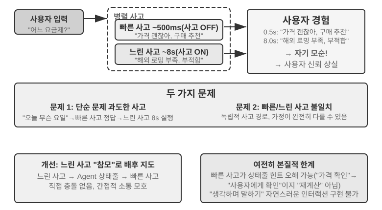


**문제 1: 단순한 문제를 과도하게 생각.** 사용자가 "오늘이 무슨 요일이야?"라고 묻는데, 빠른 사고가 500ms 안에 "수요일"이라 정확히 답했는데도 느린 사고는 10초를 온전히 생각한 뒤 또 "수요일"을 반복한다. 이는 계산 자원을 낭비할 뿐 아니라 더 심하게는 대화 리듬을 망친다. 사용자는 이미 답을 받고 다음 화제로 넘어가려는데 중복된 답이 끼어들어 흐름이 끊긴다. **문제 2: 빠름-느림 불일치.** 둘은 독립적으로 병렬로 도는데, 보는 컨텍스트는 같아도 사고 경로가 완전히 다를 수 있다. 빠른 사고가 어떤 가정 위에서 초안 답을 내고, 느린 사고는 그 가정이 성립하지 않음을 발견해 반대 결론에 이를 수 있다. 사용자는 몇 초 사이에 앞뒤가 맞지 않는 답을 연달아 듣고 신뢰가 한순간에 무너진다. 근본 원인은, 방안 1이 대화를 두 개의 독립적 사고 과정으로 나누고 하나의 연속적 인지 활동으로 보지 않아서 빠름과 느림 사이에 조정 메커니즘이 없다는 데 있다.

```
<user>이 요금제 저한테 맞을까요?</user>
<!-- 빠른 사고 0.5초 뒤 -->
<assistant(빠른 사고)>이 요금제 가격이 좋네요, 구매를 권합니다.</assistant>
<user>좋아요, 그럼 저는...</user>
<!-- 느린 사고 8초 뒤 완료 -->
<assistant(느린 사고)>잠깐만요, 이 요금제에는 당신에게 필요한 국제 로밍 기능이 빠져 있어서 별로 안 맞을 수 있겠어요.</assistant>
<user>(화내며) 결국 사라고 하는 거야, 말라고 하는 거야?!</user>
```

### 방안 2: 빠른 사고로 인터랙션, 느린 사고로 제안

방안 2는 느린 사고가 빠른 사고의 출력을 볼 수 있게 하고, Agent 상태 표시줄(2장에서 소개한 동적 메타 정보 주입 메커니즘)을 통해 빠른 사고에 제안을 건네되 사용자에게 직접 말하지는 않게 한다. 방안 1보다 두 가지가 개선된다. 느린 사고는 후면에서 비동기로 실행되며 말 사이의 빈틈을 이용해 계속 생각한다. 그리고 빠른 사고의 출력을 볼 수 있어 직접 충돌하지 않고 무대 뒤로 물러나 "참모" 노릇을 한다. 앞서 언급한 GPT-Live 위임, Pine AI 음성 Agent가 모두 실 서비스에서의 방안 2 사례다. 후면의 추론 모델이 결론을 간결한 텍스트 통로 하나로 전면의 인터랙션 모델에 돌려보내면, 전면이 언제, 어떤 말투로 사용자에게 전할지를 결정한다.

그러나 이 방안에도 본질적 한계는 있다. **빠른 사고가 지시를 따르지 않을 수 있다**는 것이다. 두 독립적 사고 인스턴스 사이의 소통은 간접적이고 모호하다. 빠른 사고가 Agent 상태 표시줄을 받고서도 이해를 잘못할 수 있다. 예를 들어 "가격을 다시 확인해야 한다"를 "가격이 틀렸으니 다시 계산해야 한다"가 아니라 "사용자에게 이 가격을 받아들일 수 있는지 물어보라"로 이해하는 식이다. **중간 사고 결과를 알 수 없다**는 것도 있다. 느린 사고가 10초를 생각하는 동안 이미 가치 있는 중간 결론이 많이 나오는데, 빠른 사고는 그것을 전혀 보지 못하고 최종 Agent 상태 표시줄만을 말라 기다린다. 사용자가 느린 사고를 마치기 전에 다시 질문하거나 끼어들면, 빠른 사고는 자기 한정된 이해로만 답해야 한다. 두 사람이 함께 문제를 풀면서 쪽지만 주고받고 상대의 scratch paper는 보지 못하는 것과 같다.

방안 2는 또 하나의 근본적 이론 문제에 직면한다. **"생각하면서 말하기"를 구현할 수 없다.** 사람은 복잡한 문제 앞에서 머릿속에 완전한 답을 먼저 완성한 뒤 한 번에 말하지 않는다. 한 조각 생각하고 한 조각 말하는 식이다. "이 문제 참 흥미롭네…(멈추어 생각)… 우선 고려해야 할 것은…(생각 계속)… 다음으로…." 방안 2의 빠른 사고는 filler word만 내뱉으며 느린 사고의 결과를 말라 기다릴 뿐, 사고 과정을 대화 속에 자연스럽게 끼워 넣지 못한다.

### 방안 3: 엔드투엔드 사고와 표현의 통일(Step-Audio R1 사례)

방안 2는 느린 사고의 대기 문제를 해결하지만, 아키텍처 차원에서는 여전히 "먼저 생각하고 뒤에 말한다"이다. 사고와 표현은 여전히 분리된 두 과정이어서 사람처럼 생각하면서 말하는 것은 불가능하다. 이 근본 제약을 돌파하려면 사고 능력을 모델에 직접 내재화해야 한다.

Step-Audio R1은 바로 이 방향에서 근본적으로 다른 방안을 제안한다. 사고 능력을 엔드투엔드 오디오 언어 모델에 직접 내재화하여, 이중 뇌(dual-brain) 아키텍처로 진정한 "생각하면서 말하기"를 구현한다. 이것은 사실 두 가지 상보적 메커니즘으로 이루어져 각기 다른 문제를 푼다. **모델리티 정합 사고 증류(MGRD)**가 먼저 "생각이 옳은가"를 다룬다. 모델이 텍스트 전사가 아니라 음향 특징에 진정으로 기반해 생각하게 만드는 것이다. **MPS 이중 뇌 아키텍처**가 다음으로 "말이 제때인가"를 다룬다. 사고와 표현을 병렬로 돌려 저지연의 "생각하면서 말하기"를 구현한다. 전자가 후자의 전제다. 사고 자체가 소리에 뿌리내려야 "생각하면서 말하기"가 비로소 가치를 지니기 때문이다. 아래에서 차례로 펼친다.

**텍스트 대리 사고 문제.** 이상적으로 음성 모델은 소리 특징(피치, 리듬, 어조 등)을 직접 분석해 화자의 감정이나 의도를 이해해야 한다. 그러나 실제로는 많은 모델이 지름길을 택한다. 현존 오디오 언어 모델에는 반직관적 현상이 하나 있는데, 사고 사슬이 길어질수록 성능이 오히려 나빠진다는 것이다. Step-Audio R1 팀은 그 뿌리가 "텍스트 대리 사고"(Textual Surrogate Reasoning, 음향 정보를 텍스트 정보로 "대신하여" 분석하는 것)에 있음을 발견했다. 모델이 "생각"할 때 실제로는 음향 특징을 분석하는 게 아니라 텍스트 전사에 기반해 의미 층위에서 생각하는 것이다. 예를 들어 한 노래의 감정을 판별하라고 하면, 모델은 "가사에 슬픈 내용이 등장한다"를 분석할 뿐 "단선조 선율에 하행 피치 윤곽이 더해져 우수를 전한다"는 식으로는 듣지 않는다. 이런 모달리티 잘못 연결은 훈련 데이터에서 비롯된다. 대다수 오디오 모델의 CoT(Chain-of-Thought, 사고 사슬) 데이터는 텍스트 모델이 생성하여, 자연스럽게 순수 텍스트적 사고 방식을 물려받는다.

**모델리티 정합 사고 증류**(MGRD, Modality-Grounded Reasoning Distillation)는 반복적 자기 개선으로 이 문제를 푼다(그림 9-6). 이름은 입에 잘 붙지 않지만 핵 생각은 아주 직관적이다. "진정으로 소리를 듣고 있는" 사고 과정을 걸러 내어 그것으로 모델을 훈련한다. 모델이 음악 선생님처럼 귀로 분석하는 법을 배우게 하고, 가사만 보는 글 편집자처럼 분석하지 않게 하는 것이다. 구체적 세 단계는 다음과 같다.

1. 현재 모델이 같은 오디오에 대해 여러 사고 과정을 생성하게 하고, 그 가운데 진정으로 음향 특징에 기반한 것을 걸러 낸다. 어떻게 걸러 낼까? 사고 내용에 구체적인 소리 파라미터가 등장하는지를 본다. 예를 들어 화가 낀 음성 입력에 대해, 텍스트 기반 사고는 "사용자가 '너무 별로야'라는 부정적 단어를 썼으니 화가 난 것으로 판단한다"는 식이다. 이는 글자 내용만 분석하는 것이다. 반면 음향 특징에 기반한 사고는 "말속도가 정상보다 40% 빠르고, 음량이 뚜렷이 높아졌으며, 성조가 날카로워졌다"이다. 이것이 비로소 진짜로 소리를 "듣는" 것이다. MGRD는 후자를 걸러 낸다.
2. 이 고품질 사고 데이터로 모델을 다시 훈련하여 "귀로 생각하는" 능력을 강화한다.
3. 강화학습으로 추가 최적화하여 모델이 게을러서 사고를 건너뛰고 답을 찍지 못하게 한다.

여러 차례 반복을 거치며 사고의 뿌리가 텍스트 추상에서 점차 음향 분석으로 옮겨 간다. 모델은 "화자가 다소 언짢은 것 같다"는 식의 막연한 표현 대신 "1.2초 지점에서 피치 윤곽이 급격히 하강한다"에 주목하기 시작한다.

**MPS 이중 뇌 아키텍처**(Mind-Paced Speaking, 직역하면 "사고의 리듬을 따라 말하기")는 사고와 음성 출력 사이의 지연 모순을 푼다(그림 9-6). 착상은 인간 뇌의 분업에서 온다. 인간 뇌에서 사고를 담당하는 영역과 언어를 조직하는 영역은 분리되어 병렬로 일한다. 다음 문장을 생각하는 동시에 입은 앞 문장을 말하고 있는 식이다. MPS는 두 모델로 이런 분업을 모의한다. **구상 뇌**(Formulation Brain)은 계속 생각하며 한 단락씩의 사고 결과를 낸다. **표현 뇌**(Articulation Brain)은 새 사고 결과를 받을 때마다 이전 사고와 이미 만들어진 답을 함께 고려해 그것을 음성 답으로 바꾼다.

둘은 병렬로 돈다. 구상 뇌가 전부 생각을 끝내지 않아도 표현 뇌는 이미 말을 시작한다. 예를 들어 t=0ms에 구상 뇌가 사용자 문제 분석을 시작하고 t=200ms에 첫 사고 결과(텍스트 토큰 시퀀스)를 내놓는다. 표현 뇌는 t=200ms에 이 결과를 받은 뒤, 이미 생성된 답 컨텍스트를 함께 고려해 t=350ms에 해당 음성 토큰 출력을 시작한다. 두 모듈은 파이프라인 방식으로 병렬로 움직여, 사용자는 t=350ms에 첫 음절을 듣게 된다.


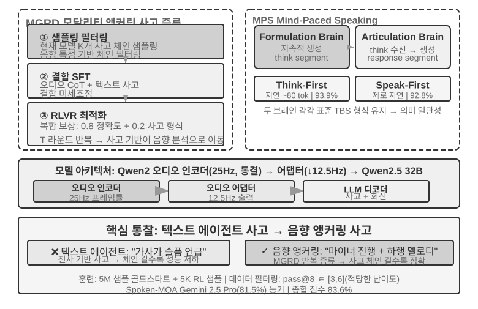


> **실험 9-4 ★★★: Step-Audio R1로 엔드투엔드 음성 사고 구현**
>
> 이 실험은 Step-Audio R1 모델을 사용해, 서로 다른 구성이 음성 사고·대화 과제에서 어떤 성능을 내는지 비교한다. Step-Audio R1은 오디오 인코더, 오디어 어댑터, Qwen2.5 32B 디코더로 구성되어 다중 GPU 카드 배포가 필요하다.
>
> 이 실험은 두 과제를 평가한다. **Spoken-MQA**(음성 수학 문제)는 듣고 들은 구두 문제 뒤에 다단계 수학 추론을 할 수 있는지를 시험하고, **URO-Bench**(중국어 구어 대화 벤치마크)는 개방형 대화 품질을 시험한다.
>
> 시험 구성은 두 차원으로 나뉜다. 첫째는 **사고 타이밍**이다. 완전한 **TBS**(Think-Before-Speak, 먼저 다 생각하고 말하기, 지연 제약 없는 대조 기준선)는 사고를 전부 생성한 뒤 말을 시작한다. 지연을 낮추기 위해 MPS는 두 가지 "생각하면서 말하기" 변형을 제공한다. **Speak-First**(또는 spkfirst, 영지연, 입을 열며 동시에 사고 시작)와 **Think-First**(또는 thkfirst, 사고 뇌가 첫 단락을 낸 뒤에야 입을 열며, 약 80 토큰 지연)이다. 둘째는 **아키텍처**다. MPS 이중 뇌 병렬 vs. 전통적 단일 모델 TBS.
>
> 결과는 표 9-1에 나왔으며, 서로 다른 사고 타이밍과 아키텍처 구성이 수학 정확도와 대화 점수에서 어떤 성능을 내는지 비교한다.
>
> 표 9-1 Step-Audio R1의 서로 다른 음성 사고 구성 비교
>
> | 구성 | Spoken-MQA | URO-Bench |
> |------|-----------|-----------|
> | 사고 없이 바로 답(기준선) | 70.6% | 77.4 |
> | MPS Speak-First(영지연) | 92.8% | 82.5 |
> | MPS Think-First(~80 tok 지연) | 93.9% | 84.8 |
> | 완전 TBS(지연 제약 없음) | 93.0% | — |
>
> 한 가지 흥미로운 발견은, Speak-First가 사고 과제에 미치는 영향이 극히 작다는 점이다(92.8%는 완전 TBS의 93.0%에 가깝다). 그 이유는 **CoT**(Chain-of-Thought, 사고 사슬)의 서두가 보통 문제 내용을 그냥 되풀이하는 데 그쳐 아직 진짜 추론에 진입하지 않기 때문이다. 그래서 모델이 입을 열자마자 사고를 동시에 시작하게 해도 최종 정확도는 거의 손해를 보지 않는다. 또 하나 주목할 디테일은, Think-First(93.9%)가 지연 제약이 없는 완전 TBS(93.0%)보다 오히려 약간 높다는 점이다. 한 가지 가능한 설명은, 사고를 단락별로 나누어 내고 단락마다 표현으로 바꾸는 것이 단계별 감독과 비슷한 긍정적 효과를 낸다는 것이다. 물론 둘의 차이는 평가 오차 범위 안에 있으니 과도한 해석은 삼가야 한다.

방안 3은 사고를 단일 모델에 "내재화"하여 "생각하면서 말하기"를 가장 우아하게 구현하지만, 그 대가는 바로 이 절 서두에서 말한 "움직이는 표적"이다. 이 하나의 모델이 가장 강한 추론자이자 실시간 화자여야 하는데, 두 능력 모두 빠르게 진전하고 있어 통합 노선은 따라잡기 위해 반복적 중훈련이 필요하다. 이것이 집필 시점의 산업 분기를 설명한다. "언제든 최신 두뇌로 교체 가능"을 추구하는 최첨단 제품(GPT-Live, Grok Voice, Pine AI)은 대부분 방안 2의 분리 노선에 베팅하고, 방안 3은 극단적 자연스러움을 추구하며 전용 훈련 비용을 감당할 수 있는 상황에 더 적합하다. 둘은 누가 누가를 대체하는 게 아니라 "교체 가능한 두뇌"와 "더 타이트한 생각하면서 말하기" 사이의 트레이드오프다.

### 빠름과 느림 사이의 인터페이스: 텍스트 외에 무엇을 더 전달할 수 있는가

(힌트: 이 단락은 장면을 가로지르는 인터페이스 논의로, 잠시 음성 주선을 벗어난다.) 방안 2를 돌아보면 간과된 설계 차원 하나가 보인다. 느린 사고가 빠른 사고에 "말을 전할" 때 **텍스트** 통로를 쓴다는 것이다(상태 표시줄로 제안 한 줄을 보낸다). 텍스트는 이해하기 쉽고 디버깅도 쉽지만, 느린 사고 머릿속의 것을 빨아들이는 가는 빨대에 불과하다. 진짜 풍부한 중간 상태가 몇 문장으로 압축되어 버린다. 그렇다면 이 빠름-느림 사이의 인터페이스를, 굳이 글자를 쓰지 않고도 만들 수 있지 않을까?

리듬이 가장 혹독한 실시간 게임 같은 상황에서는, 이 길은 통한다(잠재 공간 다리, Latent Bridge라 부를 수 있다)[^ch9-8]. 빠른 반응을 담당하는 작은 모델(초당 수십 개 동작 출력)과 추론을 담당하는 느린 모델(초당 한 번 사고 출력)을 모두 **얼려 둔 채**로, 그 사이의 수천만 파라미터짜리 작은 "다리" 하나만 훈련한다. 느린 모델의 은닉층 결론을 곧바로 몇 개의 "잠재 토큰"으로 투영하고, 멀티모달 모델이 시각 토큰을 끼워 넣듯 빠른 모델의 입력에 끼워 넣는다. "생각 → 글자 → 다시 이해"의 왕복을 우회하는 것이다. 결과적으로 여러 Atari 게임에서 이 잠재 공간 통로는 전통적 텍스트 통로보다 성적이 또 한 단계 높았고(일부 게임에서는 +26%에서 +82%), 한 단계당 약 5밀리초만 더 쓰면서도 여전히 실시간 리듬을 따라간다.

여기엔 정직한 경계도 함께 들어 있다. **빠름-느림 협업이 도움이 되는가는, 과제의 병목이 "생각해 낼 수 있는가"에 있는지 "반응할 시간이 있느냐"에 있는지에 달려 있다.** 느린 사고가 본래 빠른 반응보다 강할 때 이 다리가 비로소 도움이 된다(이 상관관계는 게임 간에 r≈0.9에 달한다). 반대로 과제가 순수하게 반응 속도를 다투는 것이라면, 아무리 좋은 다리도 소용이 없다. 이 판단은 게임에만 성립하는 게 아니다. 그것은 뒤에 이 장의 Computer Use가 같은 문제와 마주칠 것을 미리 알려 준다. 언제 "느린 참모"를 부를 만한지, 언제 그것이 그저 불필요한 지연만 더할 뿐인지를.

[^ch9-8]: 얼어 있는 두 모델 사이의 잠재 공간 다리만 훈련하는 일, 그리고 "언제 느린 참모를 부를 만한가"의 완전한 분석은 Li, Bojie and Noah Shi. *The Latent Bridge: A Continuous Slow-Fast Channel for Real-Time Game Agents.* arXiv:2606.24470, 2026을 볼 것.

엔드투엔드이든 모듈화든, 감지 계층과 실행 계층 각자의 품질은 여전히 중요하다. 엔드투엔드 모델은 아키텍처 층위의 지연 문제를 풀었지만, "정확히 듣기"와 "사람처럼 말하기"라는 두 기본기는 아키텍처가 바뀐다고 저절로 해결되지 않는다. "정확히 듣기"에 해당하는 스트리밍 음성 감지는 이미 패러다임 1에서 다루었으니, 여기서는 "사람처럼 말하기"의 실행 계층, 곧 사람에 더 가까운 음성 합성을 본다.

## 사람에 더 가까운 음성 합성

전통적 TTS의 "완벽함"이 바로 문제다. 너무 유창하고, 정지가 없고, 필러 워드(filler word)가 없는 음성은 한 번만 들어도 기계임을 들킨다. 사람이 말할 때의 그런 "불완전함"(정지, "음", "어", "그니까" 같은 필러 워드, 간혹 있는 반복)은 결함이 아니다. 그것은 사고 과정의 자연스러운 외화로서, 듣는 이에게 "생각 중이에요", "잘 모르겠어요" 같은 중요한 신호를 전한다. 그러나 AI의 사고 속도는 음성 재생보다 훨씬 빨라 출력이 천성적으로 유창하고 완전하며, 그대로 합성하면 기계 정체가 드러난다.

**해결책**: "어디서 정지할지, 어떤 어조를 쓸지"의 결정권을 주 LLM에 맡긴다. LLM이 출력하는 것은 텍스트뿐 아니라 제어 표식이다. `[THINKING]`은 1~2초의 사고 정지와 필러음("음….")을 삽입하고, `[SEARCHING]`은 짧은 정지와 탐색적 필러 워드("그…", "뭐라더라")를 생성하며, `[EMO:happy]` 등은 어조와 운율을 조정하고, `[SPEED:0.8x]`는 말속도를 제어한다. 현재 복잡한 질문에 답하느라 잠깐 정지해야 하는지, 사용자가 이미 지루해해서 속도를 올려야 하는지, 아니면 가벼운 잡담이라 활기차야 하는지는 오직 LLM만 안다.

TTS는 이 방안에서 멀티모달 생성기 역할을 한다. 텍스트 + 제어 표식을 입력받아 오디오를 출력한다. 보통 텍스트를 만나면 정상적으로 음성을 합성하고, 제어 표식을 만나면 해당 비언어적 오디오를 생성한다. `[THINKING]`은 "음…."하는 끌음을, `[SIGH]`은 한숨 소리를, `[LAUGH:small]`은 가벼운 웃음을, `[BREATH]`은 숨 들이마시는 소리를 만든다.

구현 경로는 두 가지다. 하나는 자체 개발 TTS가 제어 표식을 원래 지원하게 하는 것(유연성이 가장 높지만 전문 팀이 필요하다). 다른 하나는 voice cloning(음성 복제)을 활용해, 같은 가상 인물에 대해 감정, 말속도, 스타일이 각기 다른 수십 개의 참조 음성을 준비하고, 제어 표식에 따라 가장 잘 맞는 참조 음성을 골라 TTS API(예: ElevenLabs, Fish Audio)를 호출하는 것이다. 몇 주 안에 배포를 마칠 수 있다.

> **실험 9-5 ★★: Fish Audio 기반 제어 표식 구동 TTS**
>
> Fish Audio S1의 음성 복제 능력(참조 음성 3~10초만으로 같은 음색을 제로샷 복제)을 사용한다. 감정(중립/기쁨/좌절/사고) × 말속도(보통/빠름/느림) × 스타일(격식/가벼움)을 덮는 24개의 참조 음성 라이브러리를 구축한다. 각각 약 5초.
>
> LLM 출력 예: `[EMO:happy][SPEED:fast]너무 좋네요! 주문이 확인되었습니다.[THINKING]음, 배송 시간을 확인해 볼게요...[EMO:neutral][SPEED:normal]내일 오후 배송 예정입니다.`
>
> 실행 계층은 표식을 해석해 해당 참조 음성에 매핑한다. `[EMO:happy][SPEED:fast]`는 "기쁨+빠름+가벼움" 참조 음성에, `[THINKING]`은 "사고+느림+격식" 참조 음성(정지 리듬과 머뭇거림 어조를 동반)에, `[EMO:neutral][SPEED:normal]`은 "중립+보통+격식" 참조 음성에 대응한다. Fish Audio는 참조 음성이 달라져도 음색의 일관성을 보장하며, 운율과 감정만 변화시킨다.
>
> 세 가지 구성을 비교한다. 제어 표식 없음(유창하지만 기계적이라, 들으면 바로 AI임을 안다), 단일 참조 음성(자연스럽지만 감정이 단조로움), 다중 참조 음성 라이브러리(정보 확인 시엔 명랑하고 빠르게, 설명 앞에는 자연스러운 정지를 두어, 전체적으로 실인 상담원의 말투에 가깝다).

## Computer Use: GUI 자동화 Agent

여기까지 읽으며 눈치챘을지 모르겠다. 이 장은 음성에 대한 분량이 뒤의 두 상황보다 뚜렷이 많다. 이는 의도적인 것이다. 실시간 멀티모달이라는 진화선 위에서 음성은 가장 완전하게 걸어 온, 그래서 참조 계로 삼기에 가장 적합한 것이다. "직렬 파이프라인 지연이 너무 높다"는 문제에서 출발해 엔드투엔드, 전이중, "생각하면서 말하기" 등 일련의 방안을 거쳐 오늘날 비교적 정돈된 종착지에 다다르기까지, 문제 → 방안 → 종착지의 전 과정이 이미 관통되었다. 그래서 음성을 철저히 짚었고, 이어지는 Computer Use와 로봇 두 상황은 모두 음성의 맥락에 비추어 볼 수 있다. 그것들이 각기 이 진화선의 어디에 와 있고 어디서 막혔는지를.

이 세 상황은 달라 보이지만 같은 핵심 도전에 직면한다. 실시간 감지, 저지연 의사결정, 지속적 인터랙션이다. 이어서 이런 기술 주제가 시각 인터랙션(Computer Use)과 물리 인터랙션(로봇)에서 어떻게 재현되는지 본다. 먼저 시야를 청각 모달리티에서 시각 모달리티로 넓히자. Agent가 음성을 이해할 뿐 아니라 화면을 "읽고" 그래픽 인터페이스를 조작할 수 있다면 어떨까?

Computer Use(일명 GUI 자동화 Agent)는 AI가 사람처럼 화면을 관찰하고 마우스와 키보드를 조작해 소프트웨어를 사용하게 한다. 브라우저를 열어 정보를 검색하고, 표 계산 소프트웨어에서 데이터를 채우고, 시스템 설정에서 환경을 바꾸는 식이다. 그 핵심은 **감지-사고-행동** 순환이다(그림 9-7).

1. Agent가 현재 화면을 스크린샷으로 찍는다.
2. 멀티모달 모델이 스크린샷과 과제 지시를 받아 사고 한 토막과 구체적 동작 하나를 출력한다.
3. 실행 계층이 실제 환경에서 그 동작을 수행한다(마우스 이동, 클릭, 텍스트 입력 등).
4. 인터페이스가 반응하기를 기다렸다가 다시 스크린샷을 찍어 다음 순환으로 들어간다.


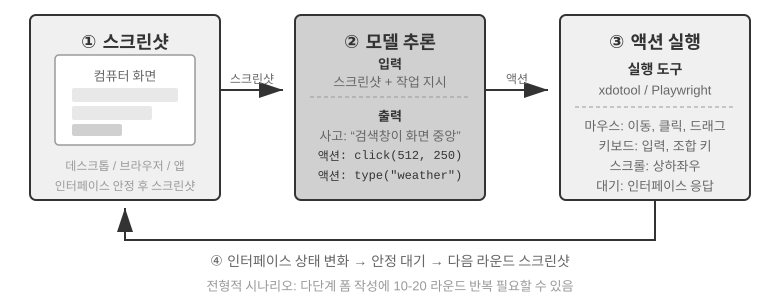


이 순환에는 세 가지 핵심 설계 차원이 있다. **동작 공간**(Agent가 어떤 조작을 할 수 있는가), **시각적 위치 파악**(스크린샷에서 목표 요소를 어떻게 찾는가), 그리고 **모델 아키텍처**(스크린샷에서 어떻게 올바른 동작을 만들어 내는가)이다.

### 동작 공간 설계

Anthropic은 세 부류의 도구로 완전한 인터랙션 능력을 정의한다(그림 9-8).


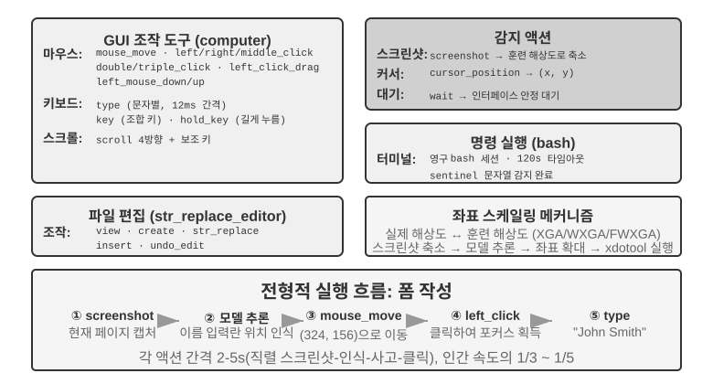


**GUI 조작 도구**(computer tool): 마우스 조작에는 이동(mouse_move), 좌/우/중 클릭, 더블/트리플 클릭, 드래그(left_click_drag)와 더 정밀한 누름/뗌(left_mouse_down/up)이 있다. 스크롤(scroll)은 네 방향을 지원하고 보조키 조합도 가능하다. 키보드 조작에는 글자 단위 입력(type, 한 글자 간격 12ms로 실제 타자를 모방), 조합키(key, 예: Ctrl+C), 길게 누르기(hold_key)가 있다. 감지 동작으로는 스크린샷(screenshot), 커서 위치 얻기(cursor_position), 대기(wait)가 있다.

**명령 실행 도구**(bash tool): 영속적인 bash 터미널 세션을 제공한다. 120초 타임아웃, sentinel 문자열로 명령 완료를 검출하며, 여러 차례 호출 사이에 환경 상태를 유지한다(예를 들어 어떤 디렉터리로 cd한 뒤 다음 호출에서도 그 디렉터리에 그대로 있는다).

**파일 편집 도구**(str_replace_editor): 문자열 매칭으로 안전한 편집을 구현한다. 보기, 생성, 교체, 삽입, 되돌리기를 지원하며, 파일 전체를 덮어쓰는 것보다 정확하고 다른 내용을 잘못 고칠 위험이 적다.

> **실험 9-6 ★: Anthropic Computer Use Demo 실행**
>
> 컨테이너에 완전한 우분투 데스크톱 환경(브라우저, 터미널 등 흔한 도구 포함)이 패키징되어 있다. 프론트엔드가 과제 지시를 받으면 백엔드가 그것과 스크린샷을 Claude에 보내고, 모델은 조작 지시(마우스 이동, 클릭, 텍스트 입력 등)를 돌려주며, 실행 계층이 가상 데스크톱에서 그것을 수행한다.
>
> 핵심 관찰: 각 동작 사이 2~5초(사람보다 뚜렷이 느림)지만, 흔한 과제에서는 좋은 계획 능력을 보이며, 자율적으로 합리적 동작 시퀀스로 쪼갠다.

### 시각적 위치 파악(Grounding)

순환의 매 차례마다, 모델은 스크린샷에서 목표 요소를 정확히 찾아야 한다. "검색창이 어디 있지?", "제출 버튼의 좌표는?" 이것이 시각적 위치 파악(Grounding) 문제다. 현재 주로 **두 가지 접근**이 있다. 하나는 위치 파악을 **객관식 문제**로 바꾸는 것이다. 먼저 인터페이스 요소에 번호를 매겨 표시해 두면, 모델은 그 가운데 하나만 고르면 된다. 다른 하나는 **순수 좌표 예측**이다. 모델이 사람처럼 스크린샷을 그냥 "보면서" 좌표를 불러 내게 한다. 객관식 접근에는 다시 두 가지 구현이 있다. **순수 시각 표식**(원래의 Set-of-Mark, 분할 모델로 픽셀 위에 후보 영역을 잘라 내는 것)과 **구조화 요소 인덱스**(DOM/Accessibility Tree, 인터페이스가 원래 갖춘 구조를 직접 읽는 것)이다. 객관식 접근의 공통된 이점은, "스크린샷에서 버튼을 찾아 좌표를 예측하라"는 개방형 과제를 "이미 표식을 단 요소 가운데 하나를 고르라"는 폐쇄형으로 바꾸는 것이다. 시험에서 객관식이 주관식보다 맞히기 쉬운 것과 같다. 모델은 "화면 왼쪽 위에서 오른쪽으로 약 200 픽셀의 파란 버튼을 클릭"이 아니라 "클릭 [123]"이라고만 하면 된다.

**Set-of-Mark: 시각 표식법.**

원래의 Set-of-Mark(SoM)은 마이크로소프트 리서치가 2023년에 제안했고, 처음에는 GPT-4V의 시각적 위치 파악 능력을 끌어내기 위한 것이었다. 그것은 **순수 시각** 방법이다. 이미지 분할 모델(SAM, SEEM 등)로 스크린샷 위에 후보 영역을 자동으로 잘라 내고, 각 영역에 번호 표식을 겹쳐 그린다. 모델이 보는 것은 번호가 찍힌 그림 한 장이며, 번호만 부르면 시스템이 해당 영역의 중심 좌표로 환산한다. 전 과정에 DOM도, 인터페이스 내부 구조도 필요 없다. 그래서 원래 데스크톱 소프트웨어, 게임 인터페이스에도 그대로 쓸 수 있다. 분할 모델이 후보 영역을 잘라 낼 수 있기만 하면 된다.

**구조화 요소 인덱스: SoM 사상의 웹에서의 구조화 구현.**

인터페이스 자체가 구조화 정보를 제공할 때는 표식을 더 정확하게 할 수 있다. 현대 웹페이지는 렌더링 전에 이미 완전한 요소 구조(DOM 트리)와 의미 역할(어느 것이 버튼이고 어느 것이 입력상자인가)을 정의하고 있으며, 접근성 인터페이스(Accessibility Tree)가 많은 데스크톱 응용에 비슷한 정보를 제공한다. 분할 모델이 픽셀 속에서 "어느 영역이 버튼인가"를 추측하게 하는 것보다, 인터페이스 자체에 "클릭 가능한 요소가 어떤 것들이 있느냐"고 직접 물어보는 편이 낫다. browser-use 프로젝트로 대표되는 웹 Agent 방안이 정확히 그렇게 한다. DOM에서 상호작용 가능한 요소를 나열하여 번호를 매기며, SoM 사상의 웹에서의 구조화 구현으로 볼 수 있다(그림 9-9). 절차는 네 단계다.

1. 브라우저 디버깅 인터페이스(CDP, Chrome DevTools Protocol)로 웹페이지의 구조화 표현(DOM 트리)과 접근성 정보를 얻는다.
2. 어떤 요소가 상호작용 가능한지(버튼, 입력상자, 링크 등) 자동 검출한다.
3. 상호작용 가능 요소 각각에 유일 ID를 매기고 스크린샷 위에 경계 상자를 그린다.
4. 동시에 텍스트 목록을 생성해 각 ID에 해당하는 요소를 설명한다.

```
Screenshot: [그림 안의 핵심 요소에 [1], [2], [3], [4] 등 ID가 매겨져 있다]

Elements:
[1] <input type="text" placeholder="Search" aria-label="Search" />
[2] <button id="submit-btn" aria-label="Submit form" />
[3] <input type="text" placeholder="Enter your name" value="" />
[4] <a href="/docs" aria-label="Documentation" />
```

모델은 ID 번호 하나만 출력하면 되고, 시스템이 자동으로 그 요소의 중심 좌표로 클릭을 수행한다. 이런 방안은 토큰을 아끼지 않는다(모든 표식 정보를 모델에 보내야 하므로). 그러나 위치 파악이 정확하고 안정적이며, 분할 모델이 끼어들 수 있는 누락·오판도 피할 수 있다.


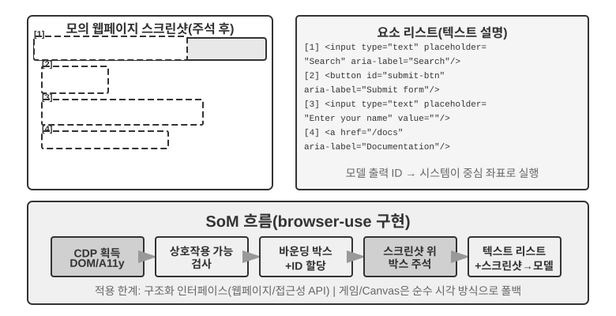

**순수 좌표 예측.**

세 번째 노선은 어떤 표식도 하지 않고 모델이 직접 좌표를 출력하는 것이다. **SeeClick**과 Claude의 computer use가 대표적이다. 대량의 GUI 스크린샷과 요소 위치 짝 데이터로 시각 모델을 훈련하여, 자연어 기술(예: "제출 버튼 클릭")을 스크린샷 안의 정확한 좌표로 직접 매핑하는 법을 배운다. 사람 사용자처럼, 순전히 "보는 것"만으로 클릭할 위치를 찾는 것이다.

좌표 예측 방안에서, 모델의 좌표 이해는 훈련에 쓰인 해상도에 크게 의존한다(그림 9-10). Claude 훈련은 XGA(1024x768), WXGA(1280x800), FWXGA(1366x768)을 사용한다. 입력 스크린샷 해상도가 이에 맞지 않으면, 모델이 예측한 좌표는 체계적으로 어긋난다. 작은 지도에서 거리를 잡고 그것을 큰 지도에 그대로 옮겨 쓰는 것과 같다. 그래서 도구 계층에서 양방향 좌표 스케일링 메커니즘을 구현해야 하며, 또한 **화면비에 맞춰 목표 해상도를 골라야 한다**. 비등비 늘리기가 화면을 일그러뜨려 좌표 판단까지 흔들리게 하는 것을 막기 위해서다. 예를 들어 실제 화면 해상도가 2560×1440(16:9)이라면, Claude가 지원하는 세 단계 가운데 화면비가 같이 16:9에 가까운 목표를 골라야 한다. FWXGA(1366×768)가 가장 잘 맞는다. 스크린샷을 찍을 때 화면을 등비로 1366×768로 스케일하여 모델에 보낸다. 모델이 클릭 좌표 (683, 384)를 출력하면, 역매핑하여 실제 좌표 (683×2560/1366, 384×1440/768) ≈ (1280, 720)을 얻는다. 반대로 16:9를 4:3의 1024×768에 억지로 끼워 넣으면 화면이 가로로 납작해지고, 모델의 예측 좌표는 체계적으로 어긋난다.


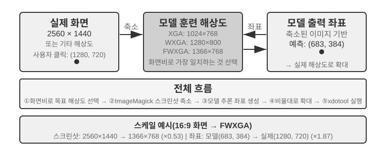


세 노선의 선택 논리는 이렇게 요약할 수 있다. **구조화 정보를 얻을 수 있을 때는 DOM/Accessibility Tree 인덱스를 우선** 쓰는 것이 위치 파악이 가장 정확하고 안정적이다. **얻을 수 없을 때**(Photoshop 같은 원래 데스크톱 소프트웨어, Canvas/WebGL 렌더링 인터페이스, 게임), **시각 표식(원래 SoM 노선)이든 좌표 예측이든** 쓸 수 있다. 시각 표식은 위치 파악을 객관식으로 만들어 전용 훈련을 받지 않은 범용 모델에 더 친절하고, 좌표 예측은 표식 단계를 생략해 GUI 위치 파악 훈련을 받은 모델에 더 직접적이다. 둘 다 작은 요소와 빽빽한 인터페이스에서의 정확도는 여전히 차이가 있다.

> **실험 9-7 ★: browser-use로 자동 브라우저 조작 구현**
>
> Playwright 브라우저 자동화 프레임워크(코드로 브라우저를 조작하는 도구 라이브러리)에 멀티모달 대형 모델을 결합해, 자연어로 구동되는 브라우저 조작을 구현한다. SoM 시각화 모드를 켜고, 매 의사결정 전에 표식 상자가 찍힌 스크린샷을 저장한다.
>
> 시험 과제 "구글을 열어 샌프란시스코 날씨 조회": 시스템 가동 후 스크린샷에 구글 검색 페이지가 보이고, 상호작용 가능한 모든 요소에 빨간 경계 상자와 ID 번호가 매겨진다(주소창 `[1]`, 검색창 `[2]`, 검색 버튼 `[3]`, "I'm Feeling Lucky" 버튼 `[4]` 등) → 모델이 분석 뒤 `[2]`(검색창)를 클릭한다 → 검색창이 포커스를 받은 뒤 "San Francisco weather today"를 입력한다 → `[3]`(검색 버튼)을 클릭한다 → 페이지가 검색 결과로 옮겨가고, 새 스크린샷에 날씨 카드 안 요소가 표식된다. 모델이 그것을 인식하고 온도, 날씨 상태 등 정보를 뽑아낸다. 전 과정 5단계 조작, 약 20초 만에 완료된다.

### 움직임을 보고 소리를 듣는 Computer Use Agent

지금까지 Computer Use의 감지는 하나의 숨은 가정 위에 서 있었다. **화면은 정적**이라는 것이다. 한 장 찍고, 한 번 생각하고, 한 번 클릭한 뒤 다시 한 장 찍는다. 그러나 현실의 화면은 영상을 재생하고, 순식간에 나타났다 사라지는 알림을 띄우며, 회의 중인 사람의 음성을 내보낸다. 3~5초마다 한 번씩 눈을 뜨고, 게다가 귀가 아예 없는 Agent에게, 이런 "두 프레임 사이에 일어나는 일"은 보이지도 들리지도 않는다. 화면 녹화를 보고, 회의를 따라가고, 음성 안내를 듣고, 순간적으로 뜬 대화상자에 대응하는 것, 이 일상적 컴퓨터 조작의 일군이 오늘날 Computer Use Agent에게는 거의 금지 구역이다.

여기서 진정으로 다시 설계되어야 할 것은 "동작 인터페이스"가 아니라 "**관찰 인터페이스**"다[^ch9-9]. 핵심 사상은 **관찰**(연속적, 자기적응적, 멀티모달)을 **동작**(이산적)에서 분리해 내어, 환경과 임의의 기성 Computer Use 모델 사이에 끼워 넣고, 재훈련 없이 쓸 수 있는 감지 미들웨어(Agent-컴퓨터 관찰 인터페이스, AOI라 부를 수 있다)로 만드는 것이다. 이것은 세 개의 "필요할 때만 열리는" 부품으로 이루어진다. 첫째, **프레임 간 키프레임 포착**. 아주 값싼 픽셀 문으로 거의 변하지 않은 화면은 건너뛰고, 작은 모델로 화면에 의미 있는 변화가 생겼는지 판별하여 변화가 있을 때만 한 프레임을 잡는다. 정지 화면에서는 비용이 거의 0이다. 둘째, **음량 게이트가 달린 음성 전사**. 소리가 있을 때만 음성 인식을 호출하여, Agent가 처음으로 "귀"를 갖게 한다. 셋째이자 가장 핵심인 것, **화면을 서술하여 영속적 글자로 만들기**. 모델이 잡아 낸 프레임을 한 문장으로 기술하게 한다("방금 뜬 알림이 발매일을 4월 28일로 바꿨다고 쓰여 있어"). 그리고 **이후 원본 그림이 컨텍스트에서 정리되더라도 이 문장은 기억에 남는다**. 동적 정보를 텍스트 형태로 지니고 내려간다.

반직관적 발견이 하나 있다. 진짜 효과를 내는 것은 "어느 몇 프레임을 고르느냐"가 아니라 "**프레임을 오래 보존되는 글자로 서술하는 것**"이다. 글자야말로 LLM Agent가 가장 잘 다루는 모달리티다. 7B 규모부터 최첨단까지 여덟 모델에서, 이 미들웨어는 어떤 재훈련도 없이 +17에서 +48 퍼센티지 포인트의 향상을 가져왔고, 그 가운데서도 음성 유형 과제의 격차가 가장 컸다. 이 감지 층을 더하면 Agent가 본래 "들은 대로 움직이지 못하던" 음성 과제들을 모두 해낼 수 있었다. 그러나 이것이 만병통치의 고정 설정은 아니다. 일부 더 새로운 모델에서는 이미지 토큰을 너무 많이 밀어 넣으면 오히려 추론을 밀어내고 성능을 떨어뜨린다. 그래서 이 부품들은 **모델별로 하나하나 골라** 적용해야지 한꺼번에 전부 켜는 식이어서는 안 된다. 이는 앞의 Set-of-Mark와 좌표 예측의 트레이드오프와 같은 이치다. 감지 방안에는 silver bullet이 없으며, 모델의 성질에 맞춰 배합해야 한다.

[^ch9-9]: 게이트가 달린 키프레임, 필요할 때 전사, 프레임의 영속적 텍스트 서술이라는 세 부품의 완전한 메커니즘과 모델별 소거 연구는 Li, Bojie and Noah Shi. *Agent-Computer Observation Interfaces Enable Dynamic Computer Use.* arXiv:2606.29472, 2026을 볼 것.

### 모바일: 생태 장벽이 기술보다 더 어렵다

Computer Use는 모바일로도 확장되고 있다. 모바일은 데스크톱과 기술적 차이가 확실히 있다. 동작 공간은 더 이상 "마우스 좌표 + 키보드"가 보통 아니라 시스템의 접근성 서비스 API(예: Android의 AccessibilityService)에 연결해 인터페이스 요소를 읽고 클릭과 텍스트 입력을 내려 보낸다. 인터랙션 방식도 마우스 포인터에서 터치 제스처로 바뀌어, 좌표의 의미가 함께 달라진다. 같은 (x, y)가 손가락의 단일 탭인지, 길게 누름인지, 슬라이드 제스처의 시작점인지, 추가적인 제스처 유형으로 규정해야 한다. 6장에서 소개한 AndroidWorld 같은 모바일 벤치마크가 바로 이런 동작 공간 위에서 Agent가 실제 앱 과제를 완수하는 능력을 평가한다.

그러나 진정으로 모바일을 가로막는 것은 대개 이런 기술 차이가 아니라 생태 장벽이다. 한 휴대폰 제조사가 소비자용 휴대폰에 AI 비서를 통합하여 위챗, 타오바오, 알리페이 같은 일상 앱을 자동 조작하게 하려 했으나, 곧 플랫폼 제한에 부딪혔다.

이것은 Computer Use가 직면한 독특한 도전을 드러낸다. **생태 장벽**이다. 차단의 근본 원인은 비즈니스 모델의 충돌이다. 전통 인터넷 응용의 핵심 수익 논리는 **트래픽과 주의력**이다. 사용자가 피드를 넘기며 광고를 보고, 상품을 검색하며 추천 알고리즘의 안내를 따르며, 페이지를 돌아다니며 충동 소비를 한다. 그런데 Agent가 사용자를 대신해 조작하면 이 수익 연결이 철저히 우회된다. AI는 광고에 주의를 기울이지도, 충동 소비를 하지도 않고, 목표로 직행하여 과제를 마치고 빠진다. 광고와 트래픽으로 수익을 내는 플랫폼에게 Agent의 매 조작은 그 비즈니스 모델의 뿌리를 갉아 먹는 것이다.

이것은 Computer Use가 마주한 것이 CAPTCHA(보안 문자) 같은 기술 층위의 대항만이 아니라 **구조적 이익 충돌**임을 뜻한다. 이 모순은 단기에 조정하기 어려워, Computer Use의 소비자 사례 적지가 순수 기술 문제보다 더 까다로운 도전에 직면하게 만든다.

### 실시간성: 아직 풀리지 않은 핵심 과제

**OSWorld**(6장에서 그 평가 방법론을 상세히 다루었다)는 널리 쓰이는 Computer Use 평가 벤치마크로, 실제 우분투/Windows/macOS 환경에서 Agent가 애플리케이션을 가로지르는 과제를 완수하는 능력을 시험한다. 초기 범용 모델의 이 벤치마크 성공률은 약 2할에 불과했으나, 이후 전용 모델과 더 강한 범용 모델이 정확도를 계속 밀어 올려 집필 시점에는 점차 사람 수준에 가까워졌다. 그러나 정확도가 결코 끝은 아니다. 진짜 병목은 이미 "맞힐 수 있는가"에서 "빠르게 할 수 있는가"로 옮겨갔다.

**OSWorld-Human** 효율 연구는 씁쓸한 사실 하나를 드러낸다. 과제가 결국 성공하더라도, Agent가 같은 과제를 끝내는 데 필요한 조작 단계는 여전히 사람보다 뚜렷이 많고, 게다가 단계마다 추론 지연이 과제가 진행됨에 따라 계속 자란다. 컨텍스트가 길어질수록 모델의 의사결정은 느려져, 후반 단계의 소요 시간은 흔히 전반을 훨씬 웃돈다. 사람이면 수십 초면 끝낼 문서 서식 조정을 Agent는 몇 분이나 끙끙대야 겨우 마친다. **정확도가 사람 수준에 닿은 것이 실용을 뜻하지는 않는다. 효율이 진짜 병목이다.**

효율 문제의 근원은 음성 상황과 비슷하다. 직렬의 "스크린샷-사고-클릭" 순환에서, 매 단계를 극한까지 최적화하더라도 단계별로 누적되는 지연은 여전히 감당하기 어렵다. 더 깊은 문제가 있다. 현재의 Computer Use는 전혀 "미리 생각하지" 못한다. Agent가 현재 동작을 수행하면서 동시에 다음에 무엇을 해야 할지 예측할 수 있다면(예를 들어 페이지 로딩을 기다리는 동안 다음에 어디를 클릭할지 미리 정해 둔다면), 사고와 실행의 시간을 겹치게 하여 총 지연을 크게 낮출 수 있다. 이것은 바로 이 장 앞에서의 음성 상황의 "생각하면서 말하기", 그리고 4장의 "지속적 사고"식 비동기 Agent와 같은 요구이며, 다만 여기서는 "생각하면서 조작하기"로 바뀌었을 뿐이다.

음성 영역과 다른 점은, Computer Use 자체의 실시간성(곧 "스크린샷-사고-클릭"이라는 순환 자체를 빠르게 만드는 것)에는 아직 체계적 해법이 없으며, 여전히 프레임 단위 스크린샷의 이산적 순환에 머물러 있다는 것이다. 그러나 그것을 우회하는 길 하나는 이미 관통되었다. 이 장에서 줄곧 등장한 빠름-느림 분리를 쓴 것이다. 느린 컴퓨터 조작 Agent를 빠르게 만들기가 어려우면, **사용자가 그것을 말라 기다리지 않게** 하면 된다. "말하기"와 "컴퓨터 조작"을 빠른 모델과 느린 모델 두 갈래로 나누어 동시에 돌린다[^ch9-10]. 작은 모델(빠름)이 실시간 음성 대화를 담당하고, 최첨단 VLM(느림)이 브라우저에서 단계별로 조작한다. 둘 사이는 아주 간결한 "순수 텍스트 계약" 하나로만 소통한다. 느린 Agent는 매 조작마다 굴러가며 갱신되는 상태 요약("지금 양식을 채우는 중이고, 생년월일이 더 필요해요")을 한 줄 덧붙이고, 빠른 Agent는 이를 근거로 실시간으로 사용자에게 답하며, 사용자가 말로 준 새 정보를 느린 Agent에 전달한다. 그리고 **상태 요약이 완료를 확인하기 전에는 빠른 Agent가 절대 "다 됐어요"라고 말해선 안 된다**. 이것이 바로 "전화로 말하면서 동시에 컴퓨터가 알아서 조작하게 두기" 상황이다. 실험에서, 이 분리는 음성 응답을 "단일 모델이 조작하며 말하기"보다 약 15배 빠르게 만들었고(중위 지연 0.58초 vs 8.64초), 과제 성공률은 떨어지지 않았다. 그 빠름-느림 사이의 텍스트 통로를 빼면 성공률은 곧바로 0으로 무너졌다. 사용자가 말로 준 핵심 정보가 더 이상 브라우저로 전해지지 않기 때문이다. 이는 앞의 Latent Bridge, 그리고 음성 상황의 "생각하면서 말하기"와 같은 사상이다. 한 단계가 태생적으로 느리면, 다른 빠른 단계가 사용자의 대기를 채우게 한다. 단지 그 "순수 텍스트 계약"은 본질적으로 이 책이 2장부터 지금까지 설명한 Agent 상태 표시줄이다. Computer Use 순환 자체의 속도 향상은 여전히 다음의 중요한 연구 방향일 수 있지만, "빠름-느림 분리로 '느림'을 숨기는 것"은 이미 쓸 만한 답이다.

[^ch9-10]: 음성-조작 빠름-느림 분리와 "순수 텍스트 계약"의 완전한 설계는 Li, Bojie and Noah Shi. *Talking While Acting: Real-Time Voice for Slow Computer-Use Agents.* 2026(출간 예정)을 볼 것.

## 로봇 조작: 실시간 제어에서 훈련과 일반화로

> **읽기 팁**: 이 절은 로봇 제어를 논의한다. 실험 9-10은 시뮬레이션에서 실제로의 전이 방법을 보여 준다. 그 가운데 **시뮬레이션 훈련 부분(3~4단계)은 순수 GPU 서버에서만 완료할 수 있어** 하드웨어가 필요 없다. 그러나 전체 파이프라인을 끝까지 재현하려면(실제 배포의 몇 단계 포함) SO100 로봇 팔 같은 실제 하드웨어가 필요하다. 로봇 분야에 당장 관심이 없다면 이 절을 건너뛰어도 다른 장의 읽기에 영향을 주지 않는다.

음성 Agent는 청각 모달리티에서 지연과 마주치고, Computer Use는 시각 모달리티에서 지연과 마주친다. 그런데 Agent가 물리적 세계의 로봇을 제어해야 할 때, 지연과 멀티모달의 도전은 한층 더 증폭된다. 동작의 결과는 되돌릴 수 없어, 한 번의 충돌로 물건이나 로봇 자체가 망가질 수 있다. 이 절은 먼저 로봇이 이중 층 아키텍처와 동작 청킹(action chunking)으로 실시간 제어 문제를 어떻게 눌러 내는지 보고, 그 흐름을 따라 오늘날 로봇의 더 단단한 뼈대인 훈련과 일반화로 넘어간다. 데이터는 어떻게 오는가, 모델은 어떻게 과제와 플랫폼을 가로질러 전이하는가.

### 하드웨어가 병목이 아니라 알고리즘이다

로봇은 보편적 개방 상황에서 아직 널리 응용되지 않았다. 병목은 대체 하드웨어인가 알고리즘인가? XLeRobot 프로젝트가 하나의 강력한 반례를 보여 준다. 1000달러 미만의 양팔 바퀴 로봇이 인간이 VR 헤드셋으로 원격 조종(teleoperation)할 때 이미 많은 가정 과제를 매끄럽게 수행한다. 더 복잡하고 섬세한 손이 필요한 가정 과제도 유니트리(Unitree)의 로봇이 인간의 원격 조종 아래 매끄럽게 해 낸다. 원격 조종 지연은 약 100~200ms로, 물리적 인터랙션의 응답 요구에 이미 근접한다. 센서 해상도, 구동기 정밀도, 제어 주파수(로봇이 매초 동작 명령을 갱신하는 횟수, 주파수가 낮을수록 움직임이 매끄럽지 못하고 떨림이나 목표 궤적 이탈이 잦다)는 현재의 저비용 플랫폼에서도 실용 과제를 뒷받침하기에 충분하다.

이 판단에 경계를 그어야 한다. 원격 조종 반례가 진정 보여 주는 것은 "기존 저비용 하드웨어에 인간의 지능을 더하면 **시각 피드백 위주인 이런 부류의 가정 조작 과제**를 수행하기에 충분하다"는 것이다. 하드웨어가 모든 차원에서 이미 합격이라는 뜻은 아니다. 촉각 감지의 부재, 섬세한 손의 신뢰성과 비용은 여전히 정평이 난 하드웨어 약점이다. 과제가 정밀한 힘 제어와 촉각 피드백에 크게 의존하면 하드웨어가 병목이 아닐 수 없다. 그래서 아래의 "하드웨어가 병목이 아니다"라는 말은 모두 이 절이 논의하는 이 부류의 과제 범위로 한정된다.

이런 부류의 과제에 한해서, 진정한 간극은 알고리즘 층에 있고, 아래 두 작은 절이 각기 펼친다.

> **실험 9-8 ★: XLeRobot 원격 조종 체험**
>
> XLeRobot은 키보드, Xbox 패드, Switch Joycon, VR 헤드셋 등 여러 원격 조종 방식을 지원한다. 직접 로봇을 조종해 물건 집기, 놓기, 닦기 등 과제를 수행하며, 응답 지연, 움직임 정밀도, 과제 완수 품질을 관찰하라. 하드웨어 능력의 경계에 대한 직관적 인식을 세운다. 직접 조종해 보면 로봇이 무엇이든 할 수 있음을 알게 되고, 현재 병목이 하드웨어가 아니라 알고리즘이라는 사실을 확인하게 된다.[^ch9-1]
>
> [^ch9-1]: XLeRobot, "Teleop 문서". https://xlerobot.readthedocs.io/en/latest/software/getting_started/XLeRobot_teleop.html

### 이중 층 아키텍처: 계획과 제어의 분리

로봇이 복잡한 가정 과제를 완수하려면 두 가지 다른 시간 규모에서 의사결정을 해야 한다. 첫째 층은 비교적 느린 **장거리 계획**(long-horizon planning)이다. "부엌을 깨끗이 치워라" 같은 고차원 지시를 하위 목표의 시퀀스로 쪼갠다(카운터 정리, 식기세척기 적재, 표면 닦기). 환경의 의미를 이해하고, 과제 의존성을 추론하며, 다단계 행동 계획을 세워야 한다. 마치 사람이 손을 대기 전에 먼저 "무엇을 먼저 할까"를 생각하는 것과 같다. 둘째 층은 비교적 빠른 **VLA 제어**(Vision-Language-Action, 시각-언어-동작 모델)다. 각 구체적 조작을 수행한다("싱크대로 가", "걸레를 잡아", "카운터를 닦아"). 현재 보이는 화면과 언어 지시에 따라 제어 신호를 계속 출력하여 로봇의 동작을 매끄럽게 이어 간다.

이런 이중 층 아키텍처는 복잡도를 효과적으로 분리한다. 장거리 계획은 "무엇을 할까"를, VLA 제어는 "어떻게 할까"를 담당한다. 이 "고차원 느린 의사결정 + 저차원 빠른 실행"의 이중 층 아키텍처는 앞의 음성 상황에서의 "빠름-느림 사고"와 구조적으로 매우 비슷하다. 둘 다 복잡한 사고와 실시간 응답을 서로 다른 모듈로 분리한 것이다. 한 가지 주의를 덧붙인다. 여기서의 "계획/제어"는 빠름-느림 사고의 "느린 깊은 사고/빠른 실시간 응답"이라는 차원의 분리에 대응하는 것이지, 방안 3의 MPS "구상 뇌/표현 뇌" 같은 "사고/표현"의 분리가 아니다. 후자가 가르는 것은 "생각"과 "말"이고, 전자가 가르는 것은 "전국을 도모하는 것"과 "실시간 실행"이다. 두 "이중-X 아키텍처"가 자르는 차원은 같지 않다.

그러나 실시간성은 허공에 사라진 게 아니라 VLA 제어 층으로 내려밀려 **동작 청킹**(Action Chunking, 아래 〈VLA 제어〉 절 참조)으로 흩무된다. 모델이 한 번의 추론으로 앞으로의 짧은 동작 시퀀스를 생성하고, 제어 스레드가 고주파로 재생하여, 단일 추론의 지연을 동작 시퀀스 전체의 실행 시간에 흩어 놓는다. 그러나 여기에 피할 수 없는 트레이드오프가 있다. 청킹은 반응성을 평활성과 바꾸는 것이다. 청크가 길어질수록 매 추론의 지연이 더 옅게 분산되고 움직임이 더 매끄러워지지만, 그 시간 동안 모델은 새로운 화면을 "보지 못해" 갑작스런 변화(물건이 치워지거나, 누군가 손을 뻗어 막는 등)에 더 둔해진다. 실시간성과 평활성 사이의 이 딜레마는 이중 층 아키텍처가 제거하지 못하고 옮겨 놓기만 한 부분이다.

여기서 이 장 주선의 한 방향 전환도 짚어야 한다. 로봇 상황에서 실시간성 모순은 이미 이중 층 분리와 동작 청킹으로 부분 완화되었고, 현재의 주모순은 **훈련과 일반화**로 옮겨갔다. 충분한 시연 데이터를 어떻게 얻는가, 모델이 어떻게 과제와 플랫폼을 가로질러 일반화하는가. 이어지는 몇 개의 작은 절이 바로 이 새 모순을 중심으로 펼쳐지며, 이는 6장의 시뮬레이션 환경과 7장의 강화학습 주제가 물리적 세계로 뻗어 나온 것이다.

그리고 이 새 모순은 주로 VLA 제어 층에 매달려 있다. VLA를 "VLM + 동작 출력"으로 볼 수 있다. **VLM**(Vision-Language Model, 시각-언어 모델, 이미지와 글자를 동시에 이해하는 대형 모델)이 "보고" "생각하는" 것을 담당하고, VLA는 거기에 더해 "손을 움직여야" 한다. 진짜 도전은 바로 이 "움직임" 층에 있다. 현재 VLA 제어 층은 주로 모방 학습(행동 복제)으로 훈련한다. 대량의 인간 시연에서 직접 "본 대로 하는" 법을 배운다(OpenVLA, RT-2, π₀ 등이 모두 이 부류). 강화학습은 최근 그 위에 더해지는 보충 수단이다. 강화학습으로 훈련한 VLA는 단일 과제에서는 잘할 수 있지만 일반화 능력이 부족하기 일쑤다. 7장의 SimpleVLA-RL이 LIBERO에서 아주 높은 단일 과제 결과를 보고했더라도, 그것은 과제마다 따로 RL 훈련을 한 것이지 하나의 통일 모델이 모든 과제에 제로샷 일반화된 것이 아니다. 이런 "과제 하나마다 훈련 한 번" 방식은 새 과제를 만날 때마다 데이터를 다시 모으고 다시 훈련해야 함을 뜻한다.

아래 두 절은 장거리 계획과 VLA 제어의 구체적 기술 방안을 각기 깊이 논의한다.

### 장거리 계획: VLM에서 전용 임사고 사고 모델로

범용 VLM은 이미 꽤 괜찮은 임사고 사고(Embodied Reasoning) 능력을 갖추고 있다. 구글 딥마인드의 **Gemini Robotics-ER 1.5**는 임사고 사고(물리적 세계에서 사물의 위치, 운동, 인과 관계를 이해하는 것)에 전문적으로 최적화되어 15개 학술 벤치마크(Point-Bench, RefSpatial, RoboSpatial, BLINK 등)에서 평균 62.8%로, GPT-4o(60.6%)와 Gemini 2.5 Pro(59.3%)를 넘어선다. 핵심 이점에는 고차원 공간 이해와 사물 위치 파악, 시간 추론("이 컵을 밀어 넘어뜨리면 어떻게 되는가" 같은 동작 인과 예측), 과제 편성(고차원 지시를 작은 단계로 분해)이 있으며, 사고(thinking) 메커니즘과 도구 호출을 원래 지원한다.[^ch9-2]

[^ch9-2]: Google DeepMind, "Gemini Robotics-ER 1.5". https://deepmind.google/models/gemini-robotics/gemini-robotics-er/

> **실험 9-9 ★★: Gemini Robotics-ER 1.5로 XLeRobot 자율 내비게이션 구동**
>
> RoboCrew 라이브러리를 통해 Gemini Robotics-ER 1.5를 장거리 계획 모델로 삼고, 카메라 이미지에 각도 눈금 표식을 겹친다. 시스템은 세 가지 단순 도구만 제공한다. 전진, 좌회전, 우회전이다. 과제 "부엌을 찾아 그리로 가라"가 주어지면, 모델은 0.5~1Hz 빈도로 의사결정을 한다. 복도, 문, 가구 같은 시각 특징을 인식하고 "부엌이 아마 왼쪽에 있을 것"이라 판단하면 좌회전을 실행하고, "앞에 냉장고가 보인다"면 계속 전진한다. 음성 제어 모드(상기 단어로 새 과제를 촉발하는)로도 확장할 수 있다. 이 실험은 VLA가 장거리 계획 층에서 갖는 능력의 경계를 드러낸다. 공간 추론과 과제 분해는 이미 꽤 잘하지만, 복잡한 환경에서의 강인성과 다단계 추론의 일관성은 아직 개선 여지가 있다.[^ch9-3]
>
> [^ch9-3]: XLeRobot, "LLM Agent 제어". https://xlerobot.readthedocs.io/en/latest/software/getting_started/LLM_agent.html

### VLA 제어: 시연 데이터에서 교차 바디 일반화로

이중 층 아키텍처의 실행 층에서, RT-2, OpenVLA, π₀의 세 대표 모델이 모두 VLA 제어에 집중한다. 곧 카메라 화면과 언어 지시에 따라 로봇의 동작을 실시간으로 출력하는 것이다(그림 9-11). 이들은 동작 표현에서 두 노선에 속한다. 이산 동작 토큰과 연속 궤적 생성이다.


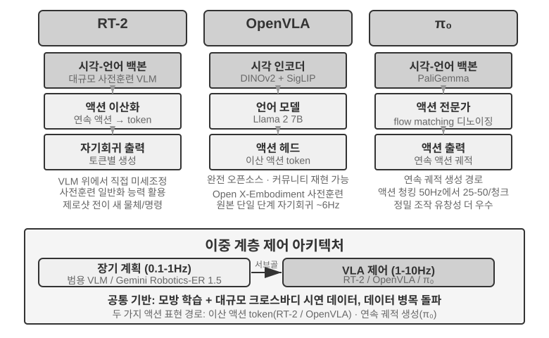


**RT-2와 OpenVLA: 이산 동작 토큰 노선.**

**RT-2**가 이 노선을 열었다. 대규모 시각-언어 모델 위에서 직접 미세 조정하여, 로봇의 연속 동작을 이산 토큰으로 변환하고 글자를 생성하듯 하나씩 자기회귀적으로 출력하여, 사전 훈련 모델의 일반화 능력을 빌려 새 사물과 새 지시에 대한 제로샘 전이 효과를 높인다. **OpenVLA**는 RT-2의 동작 표현 방안을 따라, 언어 모델과 시각 인코더를 하나의 아키텍처 안에 통일하고 이미지과 글자 지시를 입력받아 동작 토큰을 출력한다. 훈련은 두 단계다. 먼저 대규모 교차 플랫폼 데이터셋 Open X-Embodiment(20개 이상의 로봇 플랫폼의 실제 조작 시연 포함)에서 사전 훈련하여 보편적 조작 지식을 배운다("잡기", "놓기" 같은 동작 패턴은 서로 다른 로봇 사이에서도 통한다). 그런 다음 특정 플랫폼을 위해 소량의 데이터로 미세 조정한다. 동작 표현이 본질적으로 같다면, 둘의 진짜 차이는 개방성과 공학 선택에 있다. RT-2와 그 훈련 데이터는 구글 내부의 것이고, OpenVLA는 완전한 오픈소스다. 오픈소스 백본 모델(Llama 2에 시각 인코더를 더한)에 공개 데이터셋을 갖추어, 커뮤니티가 처음으로 그 위에서 재현하고 개선할 수 있게 했다.

**동작 청킹: VLA 분야의 범용 주파수 보상 기술.**

LLM 추론에는 지연이 있어, VLA의 제어 주파수는 전통 로봇 제어의 요구보다 훨씬 낮다(전통 로봇 제어는 보통 50~1000Hz의 제어 주파수를 요구하지만, VLA 단일 추론은 약 1~10Hz에 불과해 격차가 두 자릿수에 달한다). 원래의 OpenVLA가 바로 이 문제의 전형이다. 매 추론마다 동작을 하나만 출력(약 6Hz의 단일 단계 자기회귀 예측)하여 동작의 끊김이야말로 그것이 두고두고 지적받는 약점이었다. **동작 청킹**(Action Chunking)이 바로 이 격차를 메우기 위해 태어난 범용 기술이다. 처음에는 ACT(Zhao et al., 2023)가 제안했고, 뒤이어 π₀, OpenVLA-OFT 등이 널리 채택했다. 모델이 매 추론에서 동작을 하나만 출력하는 게 아니라, 앞으로의 짧은 시간 동안의 동작 시퀀스를 한 번에 생성한다(π₀의 전형 설정의 경우 한 번에 약 0.5~1초 분량의 동작 청크를 생성하고, 50Hz 제어 주파수에서 25~50개 동작에 해당). 제어 스레드는 고주파로 차례로 실행하며, 동시에 모델은 후면에서 비동기로 다음 묶음을 생성한다. 모델의 추론 시간이 이 묶음 동작의 실행 시간보다 짧기만 하면 로봇은 연속적이고 매끄러운 움직임을 유지한다. 영상 버퍼링과 같아서, 뒤의 내용을 미리 불러 두면 재생이 끊기지 않는다.

**π₀: 연속 궤적 생성 노선.**

동작 표현의 진짜 분기는 RT-2와 OpenVLA 사이에 있지 않고, **이산 토큰과 연속 궤적 생성** 사이에 있다. **π₀**가 뒤의 노선을 대표한다. 더 이상 이산 동작 토큰을 하나씩 예측하지 않고, flow matching(흐름 매칭, 확산 모델과 같은 계보의 연속 생성 방법)으로 무작위 잡음에서 출발해 여러 단계의 반복으로 "잡음 제거"를 수행해 매끄럽고 연속적인 동작 궤적을 직접 생성한다. 이 표현은 천성적으로 동작 청킹과 잘 맞아, 섬세 조작처럼 동작 정밀도와 유창성 요구가 높은 과제에서 더 나은 성능을 낸다. 비유하자면 이산 토큰 노선은 "왼쪽으로 5도", "앞으로 3cm"를 메뉴에서 단계별로 선택하는 것이고, 연속 궤적 노선은 화가가 전체 곡선을 먼저 그려낸 뒤 한 획 한 획 다듬어 완성하는 것과 같다.

### Sim2Real Transfer: 시뮬레이션에서 현실로의 간극

6장의 시뮬레이션 환경 절에서 이미 sim-to-real gap(현실 격차)의 원천과, 도메인 무작위화(domain randomization)가 그에 대처하는 원리를 설명했으니 여기서 되풀이하지 않는다. 한 줄 요약하면, 시뮬레이션은 현실의 물리·시각·하드웨어 특성을 완전히 재현할 수 없기에 훈련 시 이런 파라미터를 넓은 범위로 무작위화하여, 정책이 다양한 변화에도 견고한 보편적 표현을 배우게 만드는 것이다(그림 9-12). 아래에서는 이 원리가 실제 로봇 팔에 어떻게 착지하는지만 본다.


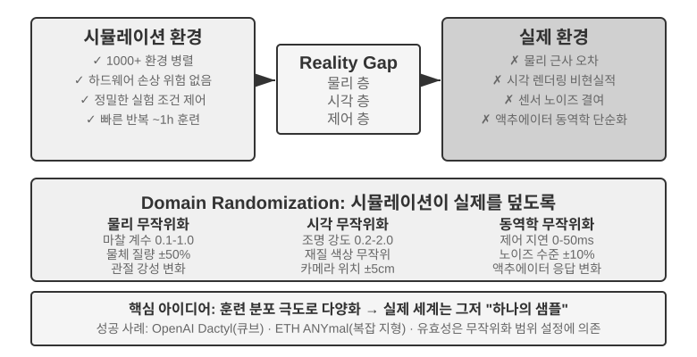


이 노선에는 이미 성공 사례가 적지 않다. OpenAI의 로봇 손 섬세 조작(Dactyl 프로젝트가 손안에서 큐브 방향 바꾸기를 구현했고, 그 후속 작업은 자동 도메인 무작위화 ADR로 한 손으로 큐브 맞추기를 해냈다)과 ETH Zurich의 ANYmal(사족 보행 로봇이 눈밭, 자갈 등 복잡한 야외 지형에서 강인하게 걷는 것)이 모두 여기에 속한다.

이 장이 진정 보탤 것은, 도메인 무작위화를 실기에 옮길 때 피할 수 없는 두 공학 단계다. 하나는 **무작위화 범위의 교정**이다. 범위는 감으로 정하면 안 된다. 너무 좁으면 실제 변화를 덮지 못하고, 너무 넓으면 훈련 난이도가 커져 "뭐든 대충 할 수지만 아무 것도 정교하지 못한" 차선 전략을 학습하게 된다. 실무에서는 보통 먼저 실제 환경 데이터에서 핵심 파라미터의 분포(마찰 계수, 모터 응답 지연의 실제 분포 등)를 **실측 교정**하고, 그 범위 안에서 샘플링한다. 시뮬레이션에서 훈련한 정책이 실기에서 뚜렷이 성적이 떨어지면, sim-to-real gap이 허용 가능한 수준으로 수렴할 때까지 무작위화 범위를 점차 넓힌다. 다른 하나는 **시각 정렬**이다. 시뮬레이션과 실제의 카메라 자세를 정확히 교정(환경 정렬)하고, 실제로 촬영한 배경을 시뮬레이션 렌더링에 무작위로 교체해 넣어(greenscreen 배경 교체) 시뮬레이션 화면이 실기에서 보이는 것에 최대한 가깝게 한다. 이 두 단계는 실험 9-10에서 구체적으로 시연한다.

> **실험 9-10 ★★★: RGB 기반 제로샷 Sim2Real 로봇 팔 집기**
>
> LeRobot + ManiSkill 시뮬레이터를 사용하고, RGB 카메라 이미지만(깊이 센서나 힘 센서에 의존하지 않고) 훈련한 뒤, 제로샷(아무 추가 조정 없이) 곧바로 실제 SO100 로봇 팔에 배포한다. 5단계 흐름은 다음과 같다.
>
> 1. **환경 정렬**: 시뮬레이션과 실제 환경 양쪽의 카메라 위치를 조정하고, 시각화 겹침으로 양쪽 이미지가 정렬됨을 확인한다.
> 2. **배경 교체**(greenscreen): 실제 환경에서 찍은 배경 이미지를 무작위로 잘라 시뮬레이션 렌더링에 겹쳐 시뮬레이션 화면의 배경이 실제에 가까워지게 한다.
> 3. **Domain randomization**: 로봇 색상, 물체 질감, 조명 조건, 카메라 시야각 등 파라미터를 무작위화한다.
> 4. **RL 훈련**: PPO 알고리즘으로 대규모 병렬 시뮬레이션 환경에서 훈련하여, 시뮬레이션에서 성공률 >90%에 도달할 때까지 한다.
> 5. **실제 배포**: 실제 로봇에서 제로샷으로 직접 집기 과제를 성공적으로 수행한다.
>
> 성공의 핵심 요소: 정확한 환경 정렬 + 시각 도메인 무작위화 + 물리 파라미터 무작위화. 셋 중 하나라도 빠지면 안 된다. 한계: 실제 물체의 형태, 크기 또는 재질이 훈련 분포를 벗어나면 성공률이 뚜렷이 떨어진다.[^ch9-6]
>
> [^ch9-6]: LeRobot, "Sim2Real 튜토리얼". https://github.com/StoneT2000/lerobot-sim2real/blob/main/docs/zero_shot_rgb_sim2real.md
>
>
> 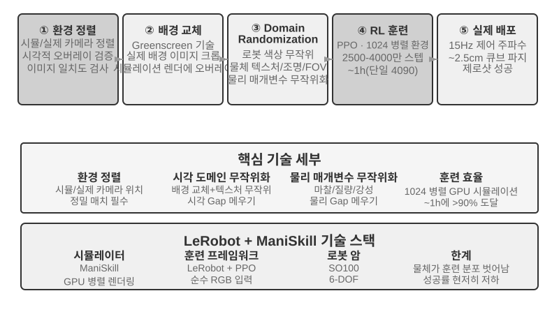

## 이 장의 정리

세 상황은 겉보기 차이가 컸지만 지연과 멀티모달이라는 두 가지 허들은 줄곧 그림자처럼 따라붙었다. 음성은 직렬 파이프라인에서 엔드투엔드와 전이중으로, 분리된 빠름-느림 사고에서 "생각하면서 말하기"로의 진화 경로를 이미 걸어 나왔다. Computer Use는 OSWorld 같은 벤치마크에서 정확도가 사람 수준에 가까워졌지만, 조작 단계수가 사람보다 뚜렷이 많고 단계 소요 시간이 과제 진행과 함께 계속 자라는 효율 격차에는 아직 체계적 해법이 없다. 로봇은 시각 피드백 위주의 조작 과제에서 병목이 하드웨어에서 VLA 제어 층의 교차 과제 일반화 능력으로 옮겨갔다(촉각, 섬세한 손은 여전히 정복하지 못한 하드웨어 약점). 다음 장은 시야를 여러 Agent 사이의 협업으로 가져갈 것이다. 그것은 또 다른 차원의 도전이다.

## 생각 문제

1. ★★ 음성 Agent의 엔드투엔드 모델은 ASR-LLM-TTS를 단일 모델로 합쳐 지연은 낮추었지만 모듈화를 잃었다. 엔드투엔드 모델이 어느 한 단계(예: 음성 인식)에서 오류를 일으키면, 직렬 파이프라인보다 디버깅과 수정이 훨씬 어렵다. 엔드투엔드 음성 Agent의 관측 가능성(observability) 시스템을 어떻게 설계하겠는가?
2. ★ Step-Audio R1은 MPS 이중 뇌 아키텍처로 "생각하면서 말하기"를 구현한다. 그러나 사람은 "생각하면서 말할 때" 깊이 생각하지 않은 말을 무심코 내뱉거나, 자기 정정하거나, filler word를 쓰는 일이 잦다. Agent의 "생각하면서 말하기"도 사람의 이런 특징을 모방해야 할까?
3. ★★ SoM(Set-of-Mark)과 그 구조화 변형(DOM 요소 인덱스)은 Computer Use의 시각적 위치 파악을 개방형 좌표 예측에서 폐쇄형 ID 선택으로 바꾸었지만, 모두 인터페이스 요소를 먼저 검출하고 표식해야 한다(분할 모델에 의존하든 DOM에 의존하든). 인터페이스가 비표준 콘트롤이나 동적으로 변하는 요소를 포함하면, 표식이 불완전하거나 부정확할 수 있다. 이런 경우 좌표 예측으로 되돌아가야 할까?
4. ★★ XLeRobot 같은 천 달러급 로봇 플랫폼은 원격 조종 데이터 수집을 값싸게 만들었다. 그러나 원격 조종 데이터의 품질은 조종자의 기량에 크게 좌우된다. 서툰 조종자가 제공한 데이터가 VLA 모델의 훈련에 어떤 영향을 미칠까? 데이터 수집 단계에서 저품질 데이터를 자동으로 걸러 내려면 어떻게 할까?
5. ★★★ 이 장은 음성, Computer Use, 로봇이라는 세 상호작용 형태를 다루었다. 이 세 형태의 공통 추세는 직렬 파이프라인에서 엔드투엔드 모델로의 진화다. 이 추세가 계속된다면, 5년 뒤 Agent의 인터랙션 층은 어떤 모습일까?
6. ★★★ 현재 Computer Use는 "스크린샷 → 동작 → 스크린샷"의 이산적 순환으로 작동하며, 매 관찰이 정적 프레임 한 장이다. 그러나 사람의 화면 인식은 연속적이다. 우리는 애니메이션이 재생되는 것을 보고, 로딩 진행을 관찰하며, 영상 내용을 이해한다. 이것은 오늘날 Computer Use가 시계열 시각 이해가 필요한 과제를 근본적으로 처리하지 못함을 뜻한다. 연속적 시각 흐름 이해를 지원하려면 감지 계층을 어떻게 다시 설계해야 할까?
7. ★★ DOM/Accessibility Tree 요소 인덱스는 표준 웹 응용에서 효과가 뚜렷하지만, 점점 더 많은 소프트웨어 인터페이스(Canvas/WebGL 렌더링, 크로스 플랫폼 자체 그리기 콘트롤)가 접근 가능한 구조화 정보를 제공하지 않아 시각 표식이나 좌표 예측에만 의지할 수 있다. Computer Use가 순수 시각 노선에 베팅해야 한다고 보는가, 아니면 구조화와 시각 두 길을 함께 유지해야 한다고 보는가? 두 길을 유지하는 비용과 이점은 각각 무엇인가?
8. ★★ VLA 모델은 동작 청킹(action chunking)을 채택한다. 본문이 설명한 대로 π₀의 전형 설정은 한 번에 50Hz 주파수에서 25~50개의 미래 동작을 생성하여 추론 지연을 실행 시간에 숨긴다. 그러나 실행 도중 환경이 급변하면(예: 물건이 옮겨지면) 미리 생성된 동작 시퀀스가 무효가 된다. 동작 청킹의 효율 이점과 환경 변화에 대한 반응 속도 사이의 균형을 어떻게 잡을까?
9. ★★★ 이 장의 세 상황(음성, Computer Use, 로봇)은 모두 "감지-사고-행동" 순환의 지연 문제에 직면하고, 모두 빠름-느림 사고의 병렬화 방향으로 진화한다. 음성 상황에서는 이것이 "틀린 말을 하고 고치기"로 나타나고, Computer Use 상황에서는 "먼저 클릭하고 뒤에 보기"로 나타나며, 로봇 상황에서는 "한 걸음씩 가보며 살피기"로 나타난다. 빠른 사고에 기반한 이런 행동들이 되돌릴 수 없는 결과로 이어지지 않도록 어떻게 보장할까?
