# 멀티 에이전트 협업

OpenAI가 제시한 AI 능력 5단계 서술(레벨 1 대화자, 레벨 2 사고자(Reasoners), 레벨 3 지능체, 레벨 4 혁신자, 레벨 5 조직(Organizations))에서, 멀티 에이전트 협업은 흔히 5단계로 가는 길 중 하나에 비유된다. 한 가지 분명히 짚어 두면, 여기서 조직(Organizations)은 "AI가 조직 전체의 일을 완수할 수 있다"는 능력 등급을 가리키며, 시스템 아키텍처의 요구사항을 말하는 것이 아니다. 충분히 강력한 단일 에이전트라면 이론적으로 그 등급에 도달할 수 있다. 하지만 오늘날 엔지니어링 현실에서 단일 에이전트는 결국 모델 자신의 능력 경계와 컨텍스트 창이라는 한계에 부딪힌다.

여러 에이전트가 협력하도록 만드는 의미는 단순히 각기 다른 전문성을 가진 에이전트가 "장단점을 보완"하는 수준을 훨씬 넘는다. 더 근본적인 한 가지는, **집단의 지능이 개인보다 높을 수 있다**는 점이다. 인류 문명이 그 증거다. 개인의 지능은 한계가 있지만, 분업과 협업, 토론, 그리고 지식의 세대 간 축적을 통해 인류 사회 전체가 보여 주는 지능은 그 어느 천재 개인을 훌쩍 넘는다. 에이전트 집단 역시 이런 집단 지능을 창발할 가능성이 있다. 개별 에이전트가 인간 전문가 수준에 불과하더라도, 조직만 잘 되면 전체 능력이 모든 인간 전문가의 합을 넘을 수 있다. 구글 딥마인드(Google DeepMind)는 《AGI에서 ASI로(From AGI to ASI)》에서 "대규모 멀티 에이전트 집단"을 초월지능(ASI)으로 가는 핵심 경로 중 하나로 꼽는다. 인간의 범용 지능이 개인을 넘어서는 사회와 조직이라는 실체로 응집하듯, 수많은 AGI 급 에이전트가 협력해 형성되는 "집단 지능" 역시 구성원의 단순한 합을 훨씬 뛰어넘는 인지 능력을 보일 가능성이 있다[^agi-asi]. 그러므로 멀티 에이전트 협업은 단일 모델의 컨텍스트 창과 능력 경계를 돌파하는 엔지니어링 수단 그 이상으로, "전문가 급 AI"에서 "인류 전체를 능가하는 존재"로 나아가는 근본 경로 중 하나일 수 있다.

[^agi-asi]: 범용인공지능에서 초월지능으로 향하는 핵심 경로 중 하나로 "대규모 멀티 에이전트 집단"을 꼽은 논의는 Google DeepMind, *From AGI to ASI.* arXiv:2606.12683, 2026을 참고.

## 멀티 에이전트 협업의 분류 프레임워크

멀티 에이전트 시스템을 구축하려면 먼저 두 핵심 설계 차원을 이해해야 한다. 이 둘이 함께 시스템의 기본 아키텍처와 구현 방식을 결정한다.

### 차원 1: 컨텍스트를 공유하는가

가장 기초적인 아키텍처 결정이며, 여러 에이전트 사이에서 정보가 어떻게 흐르는지를 정한다.

**컨텍스트 공유**는 뒤에 오는 에이전트가 앞선 에이전트의 완전한 대화 이력과 궤적(1장에서 정의한 trajectory)을 넘겨받는 방식이다. 각 단계마다 시스템 프롬프트와 도구 집합을 바꾸면 새로운 에이전트가 된다(신분·책임·능력이 모두 바뀌기 때문). 하지만 이전 에이전트의 기억 전부를 보존한다. 한 팀에서 요구사항 분석가가 요구사항 문서를 쓰고 나면 개발자는 문서뿐 아니라 분석가와 사용자 사이의 모든 소통 기록까지 볼 수 있는 것과 같다. 새로운 역할이지만 이전의 모든 컨텍스트를 온전히 보존한다. 장점은 정보가 손실되지 않아, 각 에이전트가 이전 단계의 어떤 세부사항이라도 되돌아볼 수 있다는 점이다. 과제는 컨텍스트가 빠르게 부풀 수 있다는 것이다.

**컨텍스트 비공유**는 각 에이전트가 완전히 독립적인 컨텍스트와 대화 이력을 유지하며, 서로 상대방의 "사고 과정"에 직접 접근할 수 없는 방식이다. 부서 간 협업과 비슷하다. 각자 자기 자리에서 독립적으로 일하며, 공유 문서와 회의록으로 정보를 교환하지, 남의 화면을 계속 들여다보지는 않는다. 이 방식은 모듈화와 격리성이 더 좋다. 각 에이전트는 자기 책임과 관련된 정보에만 집중하면 된다. 시스템 확장과 유지보수도 쉽다. 새 에이전트를 추가하려고 기존 에이전트의 내부 로직을 뜯어고칠 필요 없이, 인터페이스와 데이터 형식만 정의하면 된다.

에이전트 사이에 컨텍스트를 공유하지 않으므로, 명시적인 통신 메커니즘을 통해 정보를 전달해야 한다. 이 문제는 고전 분산 시스템에서 이미 답을 찾아둔 것이다. 운영체제 교과서는 프로세스 간 통신(IPC)이 결국 두 큰 패러다임으로 귀결된다고 말한다. **공유 메모리**(한쪽이 쓰고 다른 쪽이 같은 저장 영역을 읽는 방식)와 **메시지 전달**(데이터를 명시적으로 상대에게 보내는 방식)이다. 에이전트 사이의 통신 메커니즘 역시 이 두 패러다임 안에 들어가며, 흔히 세 가지 형태가 쓰인다.

- **도구 호출 매개변수**: 상류 에이전트가 구조화된 데이터를 매개변수로 하류 에이전트의 도구로 넘긴다. 타입이 정해지고 구조가 명확해야 하는 상황에 맞다.
- **공유 파일 시스템**: 에이전트들이 공유 디렉터리 아래의 문서, 코드 등 중간 산출물을 읽고 써서 정보를 교환한다. 산출물이 크거나 영속화가 필요한 상황에 맞다.
- **메시지 버스(Message Bus)**: 에이전트 사이에서 메시지를 전달하는 전담 중계소다. 에이전트는 서로를 직접 호출하지 않고 메시지를 버스로 보내면, 버스가 대상 에이전트로 전달한다.

이를 IPC의 두 패러다임에 대응시키면, 공유 파일 시스템은 에이전트 세계의 "공유 메모리"이고, 도구 호출 매개변수와 메시지 버스는 "메시지 전달"의 두 형태다. 전자는 호출에 따라 동기적으로 전달되고, 후자는 중계소를 거쳐 비동기적으로 배달된다. 두 패러다임은 각각 장단점이 있다. Go 언어에 널리 퍼진 격언이 있다. "메모리를 공유해서 통신하지 말고, 통신으로 메모리를 공유하라." 공유 메모리는 빠르지만 동시성 충돌의 위험을 사용자에게 떠넘긴다. 메시지 전달은 오케스트레이션 코드를 더 짜야 하지만, 데이터의 소유 관계가 명확해진다. 이런 장단점은 뒤에 상태 질의와 동시성 충돌에서 계속 등장한다.

메시지 버스는 **비동기 통신**을 자연스럽게 지원한다. 발신자와 수신자가 동시에 온라인일 필요가 없다. 회사 내부 메일 시스템과 같다. 동료에게 메일을 보낼 때 상대가 지금 PC 앞에 있기를 요구하지 않는다. 메일은 먼저 서버에 보관되고, 동료가 접속하면 그때 처리한다. 여러 에이전트가 병렬로 일하며 서로 조율이 필요한 상황에 특히 잘 맞는다(자세한 것은 이 장 뒤의 "병렬 조정" 절을 볼 것).


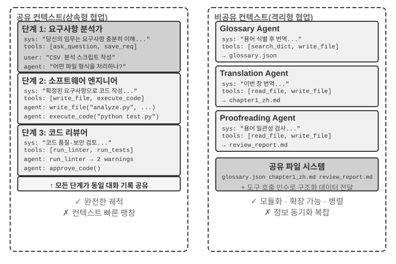


한 가지 분명히 해 두자. 두 아키텍처 모두 진짜 멀티 에이전트 시스템이다(각 단계마다 시스템 프롬프트와 도구 집합이 다르면 곧 다른 에이전트이기 때문이다). 차이는 조정 방식에 있다. **컨텍스트 공유**는 암시적 조정에 의존한다. 뒤에 오는 에이전트가 앞선 에이전트의 완전한 컨텍스트 이력을 상속하고 이전 사고 과정을 "볼" 수 있어, 정보가 컨텍스트 자체를 통해 흐른다. **컨텍스트 비공유**는 명시적 조정에 의존한다. 에이전트 사이에서 파일·메시지·구조화된 데이터 인터페이스로 정보를 교환하며, 각 에이전트는 자기와 관련된 내용만 본다.

비유하자면, 전자는 한 팀이 탁자에 둘러앉아 모든 대화를 다 듣는 것에 가깝고, 후자는 부서들이 메일과 문서로 협업하며 각자 자기 작업 공간을 갖는 것에 가깝다.

운영체제에 익숙한 독자는 이 대응 관계를 알아볼 것이다. 컨텍스트 공유는 스레드, 컨텍스트 비공유는 프로세스다. 스레드는 주소 공간을 공유해 전환 비용이 작고 통신에 복사가 필요 없지만, 대신 격리가 없다. 한 스레드가 메모리를 망가뜨리면 프로세스 전체가 함께 죽는다. 프로세스는 각자 독립된 주소 공간을 가져 격리가 철저하고 안전하게 병렬 실행되지만, 대신 통신이 명시적인 IPC를 거쳐야 한다. 표 10-1의 모든 선택 기준은 이 장단점에서 도출된다.

표 10-1은 하위 과제 수, 컨텍스트 창, 병렬성, 정보 격리, 비용 예산이라는 다섯 각도에서 두 아키텍처의 선택 기준을 정리한다. 초기 아키텍처 선정용 체크리스트로 쓸 수 있다.

표 10-1 컨텍스트 공유와 비공유의 선택 기준

| 선택 기준 | 컨텍스트 공유 | 컨텍스트 비공유 |
|----------|-------------------------------------|------------------------------------------------|
| 하위 과제 수 | 적음(2~3개 역할) | 많음(병렬 처리 필요) |
| 컨텍스트 창 | 모든 역할의 정보를 담기에 충분 | 단일 창에 담을 수 없음 |
| 병렬성 | 직렬 위주(역할이 같은 궤적을 따라 차례로 인계) | 대규모 병렬 가능(컨텍스트가 서로 독립적, 서로 차단하지 않음) |
| 정보 격리 | 불필요(모든 역할이 정보를 공유) | 필요(예: 보안 심사는 원본 사고 과정을 보면 안 됨) |
| 비용 예산 | 단일 궤적 릴레이, 토큰이 단계마다 누적 | 멀티 에이전트가 각기 전개, 총 토큰이 보통 수 배에서 한 자릿수 높음 |

**간단한 판단**: 예상 누적 컨텍스트가 창의 50%를 넘을 것 같으면(경험 법칙이지 정확한 임계값이 아니다) 비공유로 가야 한다. 정보 손실이 없어야 작업 정확성이 보장된다면 공유로 가야 한다. 실제 시스템 대부분은 "단계 전환식" 방안을 택한다. 앞의 몇 에이전트는 공유하고, 정보가 포화하는 시점에 도달하면 비공유 + 명시적 핸드오프(인계, 즉 상류 에이전트가 하류에 어떤 정보를 넘길지 능동적으로 결정)로 전환한다.

### 차원 2: 협업 토폴로지

두 번째 차원은 협업 토폴로지, 곧 에이전트 사이에서 제어권과 정보가 어떤 구조로 흐르는가다. 협업 토폴로지는 컨텍스트 공유 여부와 **개념적으로는 독립, 실무에서는 연관**된다. 개념적으로 독립이라 함은, 컨텍스트를 공유하는 시스템에도 토폴로지가 존재한다는 뜻이다. 예를 들어 이 장 뒤에 나오는 `transfer_to_agent`(실험 10-2)는 본질적으로 컨텍스트 공유 상태에서의 연쇄 인계(handoff)다. 실무에서 연관이라 함은, 컨텍스트를 공유하면 토폴로지가 흔히 퇴화한다는 뜻이다(아래 참조). 두 차원의 값 조합을 마음대로 고를 수 있는 건 아니다. 다만 컨텍스트를 공유할 때는 인계에서 "무엇을 넘길지"를 결정할 필요가 없다. 전체 이력이 자연스럽게 보존되기 때문이다. 그래서 토폴로지는 보통 역할 전환의 일련의 시퀀스로 퇴화하며, 내세울 아키텍처 결정이 별로 없다(양쪽 사이의 예외로는 그룹 챗 식의 다자 협업이 있는데, 이 장 뒤의 분산 절에서 다룬다). 그러다 컨텍스트 비공유를 선택하는 순간 "정보가 어떻게 흐르고, 누가 조정할지"가 명시적으로 설계해야 할 문제가 된다.

달리 말해, 이 두 차원은 원칙적으로 2×3 조합 행렬을 이룬다(공유/비공유 × 세 가지 토폴로지). 하지만 컨텍스트 공유 행에서는 토폴로지가 대부분 역할 전환 시퀀스로 퇴화하고 아키텍처 결정할 게 별로 없다(이것이 뒤에 "다단계 역할 전환"에서 다루는 형태다). 그래서 이 장은 컨텍스트 비공유의 세 칸만 자세히 펼친다. 아래는 컨텍스트 비공유일 때의 협업 토폴로지 세 가지 전형적 형태를 복잡도 순으로 소개한다.

- **피어 협업 패턴**(Peer Collaboration Pattern): 소수의 에이전트(보통 2~3개)가 동등한 자격으로 상호작용하며 반복 개선 순환을 만든다. 논문을 쓸 때 한 사람은 초안을 쓰고 다른 한 사람은 주석과 수정을 넣기를 여러 차례 반복하면, 혼자 묵묵히 쓴 것보다 품질이 훨씬 좋아지는 것과 같다.
- **오케스트레이션 패턴**(Orchestration Pattern): 중앙화된 관리자 에이전트가 작업 계획과 스케줄링을 맡고, 여러 하위 에이전트가 각자 특정 하위 과제를 담당한다. 프로젝트 매니저가 몇 명의 전문 엔지니어와 함께 프로젝트를 진행하는 것과 같다.
- **분산 패턴**(Decentralized Pattern): 실행 시점의 중앙 제어자가 없이, 에이전트들이 인간처럼 서로 소통하며 협업해 과제를 완수한다.

각 패턴의 상세 설계와 적용 상황은 뒤의 전문 절에서 다룬다.

## 멀티 에이전트는 언제 진정 단일 에이전트보다 나은가

구체적인 협업 아키텍처로 들어가기에 앞서, 먼저 좀 더 근본적인 질문에 답해 보자. **진짜로 여러 에이전트가 필요한 때는 언제이고, 한 에이전트면 충분한 때는 언제인가?** 이 질문의 답은 뒤에 나오는 모든 엔지니어링 방안의 전체적 준거가 된다. 최근의 여러 연구가 명확한 판단 프레임워크를 제시한다. 핵심 기준은 단 하나다. **협업 과정이 단일 에이전트가 생성 시점에 얻을 수 없는 새 정보를 도입하는가?**

표 10-2는 협업 패턴별로 새 정보가 도입되는지를 정리한 것으로, 멀티 에이전트 협업이 단일 에이전트 대비 실질적 가치가 있는지 판단하는 데 쓴다.

표 10-2 멀티 에이전트 협업 패턴의 정보 증분 비교

| 협업 패턴 | 새 정보 도입 여부 | 효과 |
|---|---|---|
| 같은 모델의 자기 검토(자신의 출력을 다시 읽기) | 아니오 | 보통 효과가 없거나 오히려 해로움 |
| 서로 다른 에이전트가 같은 텍스트를 두고 토론 | 아니오 | 동일 계산량에서 단일 에이전트와 동일 |
| 검토자가 테스트 실행 결과로 코드를 심사 | 예(실행 피드백) | 유의미한 향상 |
| 검토자가 렌더링 스크린샷으로 프런트엔드/PPT 코드를 심사 | 예(시각 피드백) | 유의미한 향상 |
| 검토자가 외부 도구로 사실 검증 | 예(도구 피드백) | 유의미한 향상 |

2025년의 RLEF(실행 피드백 기반 강화학습, Reinforcement Learning from Execution Feedback)[^rlef-2025]가 이를 뒷받침한다. 강화학습으로 모델이 코드 실행 피드백을 활용해 코드를 반복 개선하도록 훈련하면, 모델을 독립적으로 여러 번 샘플링하는 것보다 훨씬 좋은 결과가 나온다. 핵심은 매 반복마다 **실제 실행 결과**(컴파일 에러, 테스트 실패, 런타임 예외)를 도입한다는 점이다. 이 정보는 모델이 코드를 쓰는 시점에는 존재하지 않는다. 2025년의 WebGen-Agent[^webgen-agent-2025]는 웹 페이지 생성 과제에서 다층 시각 피드백(스크린샷 + 비전 언어 모델의 서술)으로 피드백 골격을 구성해, 클로드 3.5 소넷(Claude 3.5 Sonnet)의 해당 벤치마크 성적을 26.4%에서 51.9%까지 끌어올렸다고 보고한다. 거의 두 배다.

[^rlef-2025]: Gehring, J., et al. *RLEF: Grounding Code LLMs in Execution Feedback with Reinforcement Learning.* arXiv:2410.02089, 2025.
[^webgen-agent-2025]: Lu, Z., et al. *WebGen-Agent: Enhancing Interactive Website Generation with Multi-Level Feedback and Step-Level Reinforcement Learning.* arXiv:2509.22644, 2025.

이 "새 정보" 프레임워크는 겉보기에 모순인 현상 하나를 설명해 준다. 학술 연구는 "단일 에이전트면 충분하다"고 말하는데, 엔지니어링 실무에서는 멀티 에이전트가 확실히 더 효과가 좋다는 것이다. 모순의 뿌리는 양쪽이 논하는 "멀티 에이전트"의 종류가 다르기 때문이다. 학술 연구에서 비교하는 대부분은 "여러 에이전트가 같은 텍스트를 보며 서로 토론"하는 패턴(예: 토론)이다. 반면 실무에서 효과가 있는 멀티 에이전트 시스템은 흔히 외부 피드백 루프(코드 실행, 시각 렌더링, 도구 호출)를 포함한다. 전자는 새 정보를 도입하지 않고, 후자는 도입한다. 이 장 뒤에 소개하는 피어 협업, 관리자, 분산의 세 가지 아키텍처에서 진짜 효과가 있는 용법은 거의 모두 이 기준에 맞물려 있다.

**단계 예산과 에이전트 성능.** 관련 연구 방향 하나가 있다. 에이전트에게 다른 단계 예산(허용된 도구 호출 횟수나 반복 횟수)을 할당하면 성과가 어떻게 달라질까? 직관적으로는 단계가 많을수록 결과가 좋을 것이다. 30단계 예산에서는 핵심 기능만 빠르게 구현하겠지만, 300단계 예산에서는 먼저 계획하고, 구현하고, 테스트하고, 개선할 수도 있다. 그런데 2025년 구글의 논문 《Budget-Aware Tool-Use Enables Effective Agent Scaling》은 반직관적 결론을 발견했다. **에이전트가 쓸 수 있는 단계 수를 단순히 늘린다고 성능 향상이 보장되지 않는다.** 표준 에이전트는 "예산 인식"이 부족하다. 300단계 예산이 있어도 여전히 얕은 탐색을 수행하고, 금방 "포화"해 버린다. 단계가 더 많을 때 진짜 더 좋은 결과로 이어지려면, 에이전트에 명시적인 예산 인식 메커니즘이 필요하다. 남은 자원에 따라 전략을 동적으로 조정한다. 초기에는 넓게 탐색하고, 후기에는 가장 유망한 방향에 집중하는 식이다. 2026년의 BAVT(예산 인식 가치 트리 탐색, Budget-Aware Value Tree Search)는 단계 수준의 가치 평가를 더 제안한다. 매 단계마다 남은 예산 비율에 따라 탐색과 활용의 가중치를 조정한다. 예산이 줄어들수록 에이전트는 "넓게 뿌리기"에서 "깊이 파고들기"로 점차 전환한다.

이런 발견은 멀티 에이전트 시스템 설계에 직접적 지침이 된다. 예를 들어 관리자 패턴에서 관리자 에이전트는 단순히 과제를 하위 에이전트에 배분하고 결과를 기다리는 역할이 아니어야 한다. 과제 복잡도에 따라 **단계 예산을 동적으로 할당**해야 한다. 단순한 하위 과제에는 적은 단계를, 복잡한 하위 과제에는 충분한 단계를 준다. 동시에 하위 에이전트가 이 예산을 합리적으로 활용하도록(먼저 계획, 다음 구현, 다음 테스트, 다음 개선) 이끌어야 한다. 그냥 머리부터 처박고 코딩을 시작하게 둬서는 안 된다.

모든 설계에 앞서 한 가지 반드시 짚어야 할 것이 있다. **비용**이다. 멀티 에이전트의 병렬 탐색과 반복은 다 비용을 치른다. 앤스로픽(Anthropic)은 자사의 멀티 에이전트 리서치 시스템이 토큰 소모가 일반 대화의 약 15배라고 밝힌 적 있다. 그리고 토큰 사용량만으로도 성능 차이의 약 80%를 설명할 수 있다고 한다. 이는 멀티 에이전트의 효과가 수 배에서 한 자릿수 높은 추가 비용을 감당할 만큼 커야 함을 뜻한다. 그렇지 않으면 잘 조율된 단일 에이전트가 더 경제적인 선택인 경우가 많다.

## 컨텍스트를 공유하는 멀티 에이전트 협업

컨텍스트를 공유하는 멀티 에이전트 협업에서 각 단계는 하나의 독립적 에이전트다(자기 시스템 프롬프트와 도구 집합을 갖는다). 하지만 앞선 에이전트의 완전한 궤적을 상속한다. 마치 인계받은 동료가 전임이 남긴 모든 업무 일지를 뒤적일 수 있는 것과 같다. 이런 "상속형 협업"의 핵심 장점은 정보 손실이 없다는 것이다. 각 에이전트가 이전 단계의 어떤 세부사항이라도 되돌아볼 수 있다. 과제는 현재 에이전트가 상속받은 대량의 이력 정보에 방해받지 않고 자기 핵심 책임에 집중하게 하는 것이다.

### 다단계 역할 전환

먼저 정의 논쟁 하나를 표면에 올리자. 1장의 언어로 말하면, 다단계 역할 전환은 **워크플로식 오케스트레이션**이다. 실행 경로(예: 요구사항 명확화 → 구현 → 심사)는 미리 정의된다. 프로세스 관점에서 보면 더 명확하다. 이는 한 프로세스가 단계별로 다른 코드를 차례로 실행하는 것이다. 바뀌는 것은 코드 영역이며, 메모리는 처음부터 끝까지 같은 한 몫이다. 다중 프로세스가 아니다. 그러므로 이를 "진짜 멀티 에이전트"로 보지 않는 시각도 일리가 있다. 이 장에서 여전히 멀티 에이전트 프레임으로 다루는 것은, 이렇게 하면 실질적 설계 이득이 있기 때문이다. 각 단계의 시스템 프롬프트·도구 집합·관심사가 모두 다를 때, 각 단계를 같은 궤적을 공유하는 여러 에이전트로 보면, 각 "정체성"의 프롬프트와 도구 집합을 독립적으로 다듬을 수 있고, 단계 경계가 자연스럽게 품질 게이트가 된다.

복잡한 과제에서 에이전트의 역할과 책임은 단계에 따라 크게 달라질 수 있다. 줄곧 같은 정적 시스템 프롬프트를 쓰면, 너무 포괄적이라 뚜렷한 초점이 없거나, 모든 단계의 지시를 한곳에 끼워 넣어 너무 장황해진다. 다단계 역할 전환의 방식은 이렇다. 현재 단계에 따라 시스템 프롬프트와 도구 집합을 동적으로 전환해, 에이전트가 매 단계에서 가장 적합한 "정체성"으로 일하게 한다. 이 전환에 새 인스턴스를 만들거나 새 프로세스를 띄울 필요는 없다. 같은 실행 세션에서 컨텍스트를 갱신할 뿐이다. 핵심은, 역할은 바뀌어도 대화 이력과 작업 상태는 줄곧 연속적으로 공유된다는 점이다. 에이전트는 새 역할에서도 이전 단계가 축적한 모든 정보에 접근할 수 있다.


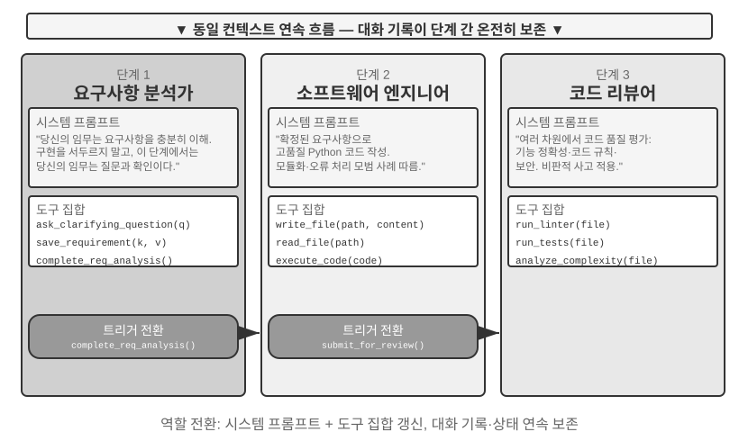


> **실험 10-1 ★★: 실행 단계에 따라 시스템 프롬프트 결정**
>
> 이 실험은 코딩 에이전트의 완전한 워크플로를 통해 단계별 시스템 프롬프트가 에이전트 성과를 어떻게 끌어올리는지 보여 준다.
>
> **과제 시나리오**: 사용자가 소프트웨어 개발 요구를 제시하면, 에이전트는 요구사항 명확화, 코드 구현, 품질 심사의 세 단계를 차례로 거친다.
>
> **1단계: 요구사항 명확화**(역할: 요구사항 분석가)
>
> 시스템 프롬프트는 다음을 강조한다.
> - "당신의 책임은 사용자의 요구를 충분히 이해하는 것입니다. 모호한 부분을 질문으로 명확히 하고, 사용자가 기대하는 기능, 사용 시나리오, 성능 요구사항을 완전히 이해하게 하세요."
> - "구현에 급급하지 마세요. 이 단계에서 당신의 임무는 질문하고 확인하는 것이지 코드를 작성하는 것이 아닙니다."
> - "모든 핵심 요구사항이 명확해졌다고 판단하면, `complete_requirements_analysis()` 도구를 호출해 이 단계를 마치세요."
>
> 도구 집합은 제한적이다. `ask_clarifying_question(question)`은 사용자에게 명확화 질문을 던지는 데, `save_requirement(key, value)`는 확인된 요구사항을 기록하는 데, `complete_requirements_analysis()`는 단계 완료를 표시하는 데 쓴다.
>
> 에이전트는 사용자와 여러 차례 대화를 나눈다. "이 스크립트는 어떤 유형의 파일을 처리해야 합니까?" "하위 폴더를 재귀적으로 처리할까요?" "파일을 옮긴 뒤 원래 파일명을 보존합니까?" 이런 질문을 통해 에이전트는 점진적으로 완전한 요구사항 이해를 구축하고 구조화해 저장한다. 요구가 충분히 명확해졌다고 판단하면 `complete_requirements_analysis()`를 호출해 역할 전환을 일으킨다. 시스템이 단계 완료 신호를 감지하고 자동으로 다음 단계 설정으로 전환한다.
>
> **2단계: 코드 구현**(역할: 소프트웨어 엔지니어)
>
> 새 시스템 프롬프트는 다음을 강조한다.
> - "당신의 책임은 확인된 요구사항에 따라 고품질 파이썬 코드를 작성하는 것입니다."
> - "모범 사례를 따르세요. 코드는 모듈화되어야 하고, 적절한 오류 처리를 갖추고, 필요한 주석을 포함해야 합니다."
> - "코드 작성을 마치고 기본 테스트를 통과하면 `submit_for_review()`를 호출해 심사 단계로 넘어가세요."
>
> 도구 집합이 뚜렷하게 바뀐다. 앞선 요구사항 명확화 도구는 사라지고, 대신 `write_file(path, content)`, `read_file(path)`, `execute_code(code)` 같은 개발 도구가 들어온다. 에이전트는 1단계에서 저장한 요구사항에 기반해 코드를 작성한다. 먼저 주요 로직을 쓰고, 다음으로 오류 처리를 더하고, 마지막으로 테스트를 작성해 검증한다. 이 과정 전체에서 에이전트는 여전히 1단계의 대화 이력에 접근해 요구사항 세부사항을 되돌아볼 수 있지만, 행동 패턴은 완전히 다르다. 더 이상 질문하지 않고 구현에 집중한다. 완료하면 `submit_for_review()`를 호출한다.
>
> **3단계: 코드 심사**(역할: 코드 심사자)
>
> 새 시스템 프롬프트는 다음을 강조한다.
> - "당신의 책임은 방금 작성된 코드를 심사하는 것입니다. 기능 정확성, 코드 규범, 오류 처리, 성능 최적화, 보안이라는 여러 차원에서 품질을 평가하세요."
> - "비판적 사고로 임해, 코드에서 발생할 수 있는 문제와 개선 여지를 찾아내세요."
> - "심각한 문제를 발견하면 `request_revision(issues)`로 구현 단계로 돌려보내 수정하세요. 품질이 받아들일 만하면 `approve_code()`로 과제를 완료하세요."
>
> 도구 집합이 다시 바뀐다. `run_linter(file)`, `run_tests(file)`, `analyze_complexity(file)` 같은 코드 품질 분석 도구로 교체된다. 에이전트는 심사자 관점에서 코드를 다시 살핀다. 정적 분석을 실행하고 잠재적 버그, 성능 문제, 보안 위험을 찾는다.
>
> 이런 3단계 설계 덕에 에이전트는 매 단계에서 현재 핵심 과제에 집중할 수 있다. 더 중요한 것은, 명확한 단계 전환 메커니즘이 작업 실행의 완전성을 보장한다는 점이다. 에이전트는 요구사항 분석을 건너뛰고 곧장 코드를 쓰지 않으며, 심사 없이 결과물을 인도하지도 않는다.
>
> **실험 요구**:
> 1. 3단계 시스템 프롬프트를 구현하되, 각 단계에 명확한 역할 정의와 행동 지침을 둘 것
> 2. 각 단계에 맞는 도구 집합을 구성할 것
> 3. 단계 전환 트리거 메커니즘을 구현할 것(특정 도구 호출로)
> 4. 단계 사이의 컨텍스트 연속성을 보장할 것
> 5. 롤백 상황을 처리할 것 — 코드 심사에서 문제가 발견되면 구현 단계로 돌아갈 수 있게
> 6. 각 단계의 실행 로그를 기록하고, 서로 다른 프롬프트가 어떻게 서로 다른 행동 패턴을 낳는지 보여 줄 것
>

### 크로스 도메인 역할 전환

앞의 다단계 역할 전환은 단일 작업 유형(소프트웨어 개발)에서의 단계별 실행을 보여 준다. 크로스 도메인 역할 전환은 그 너머로, 에이전트가 여러 작업 유형 사이에서 자율적으로 전환하는 것을 탐구한다. 더 이상 미리 계획된 선형 흐름이 아니라, 사용자 요구의 변화에 따라 에이전트가 스스로 어느 전문 역할로 전환해야 할지 판단한다.

> **실험 10-2 ★★: 다중 역할 전환**
>
> **선수 요구**: 2장 에이전트 스킬(Skills) 메커니즘을 먼저 알아 두기를 권한다.
>
> **시스템 아키텍처**: 다섯 역할 —
>
> - **triage(프런트 분류, 기본 진입)**: 사용자의 전체 요구를 이해하고, 이를 순서가 있는 하위 과제로 쪼갠 뒤, 적합한 전문 역할에 차례로 넘긴다. 모든 하위 과제가 끝나면 마무리 확인을 한다. 자체 전문 도구는 없고 transfer만 쥐고 있다.
> - **research(정보 검색 전문가)**: `web_search`로 데이터, 사실, 자료를 찾는다.
> - **coding(프로그래밍 전문가)**: `execute_python`으로 코드를 짜고 실행하며, 프로그램 로직/스크립트류 문제를 해결한다.
> - **data_analysis(데이터 분석 전문가)**: `calculate` / `descriptive_stats`로 정량 계산과 통계를 수행한다(예: 전년 대비 성장률, 연평균 복합 성장률 CAGR, 평균).
> - **writing(작문 전문가)**: 검색된 데이터와 계산 결론을 매끄럽고 지정 독자를 향한 완성 원고로 다듬는다(`count_characters`로 분량을 대략 점검할 수 있다).
>
> **핵심 메커니즘: transfer_to_agent 도구**
>
> 모든 역할은 `transfer_to_agent(target_role, reason)` 도구를 갖추고 있다. 호출하면 시스템은 차례로 1) 현재 대화 이력을 저장, 2) 목표 역할의 프롬프트와 도구 집합을 로드, 3) 대화 이력을 새 역할에 전달해 컨텍스트를 이해하게 함, 4) 새 역할 신분으로 실행을 계속 이어간다.
>
> **실험 시나리오**: 시스템은 기본적으로 triage(프런트 분류) 신분으로 실행된다. 사용자가 크로스 도메인 복합 과제를 던진다. "투자자에게 보여 줄 자료를 준비하고 있는데, 중국의 2021, 2022, 2023년 3년간 신에너지차 판매량을 좀 찾아 주세요. 3년 치 연평균 복합 성장률을 계산하고, 투자자 대상, 120자 이내의 중국어 요약으로 써 주세요." triage는 이를 "데이터 찾기 → 지표 계산 → 원고 작성"으로 쪼개고, 첫 단계로 검색을 넘긴다.
>
> ```python
> transfer_to_agent(target_role="research", reason="먼저 3년간 신에너지차 판매량 데이터를 찾아야 합니다")
> ```
>
> research가 `web_search`로 판매량을 찾으면, 핵심 데이터를 대화에 적고 데이터 분석으로 넘긴다.
>
> ```python
> transfer_to_agent(target_role="data_analysis", reason="데이터가 준비되었습니다, 3년 CAGR을 계산해야 합니다")
> ```
>
> data_analysis가 `calculate`로 성장률을 계산하고, writing에 넘겨 원고를 완성한다. writing이 다 쓰고 나면 다시 triage로 넘겨 마무리 확인을 한다. 전체 사슬은 triage → research → data_analysis → writing → triage이며, 각 역할은 전체 대화 이력을 볼 수 있으므로 뒤에 오는 역할은 자연스럽게 앞서 무엇이 이루어졌는지 안다.
>
> 역할 전환의 결정은 시스템 프롬프트의 지침에 의존한다. triage의 프롬프트에는 라우팅 규칙이 명시돼 있다. 데이터/자료 찾기는 research로, 코드 짜고 실행하기는 coding으로, 정량 계산과 통계는 data_analysis로, 원고 다듬기는 writing으로 넘긴다. 판단 기준은 단순하다. 과제가 특정 영역의 깊은 지식이나 전문 도구를 필요로 하면, 대응하는 전문 역할로 넘긴다. 전문 역할의 프롬프트에도 본연의 부분을 마친 뒤 누구에게 넘기거나 triage로 돌아갈지가 적혀 있다.
>
> **실험 요구**:
> 1. 최소 세 가지 전문 역할의 시스템 프롬프트와 전용 도구 집합을 구현할 것
> 2. 동적 전환을 지원하는 `transfer_to_agent` 도구를 구현할 것
> 3. 역할 전환 후 컨텍스트가 연속성을 유지하게 할 것
> 4. 순환 전환 문제를 처리할 것 — 에이전트가 역할 사이를 반복해 전환하지 않게
> 5. 여러 영역에 걸친 복잡한 작업 흐름을 설계해 역할 전환의 가치를 보여 줄 것
>

## 컨텍스트를 공유하지 않는 멀티 에이전트 협업

컨텍스트 비공유가 진짜 멀티 에이전트 협업을 대변한다. 이 아키텍처에서 각 에이전트는 독립된 실체로, 자신만의 컨텍스트, 궤적, 상태를 갖는다. 에이전트 사이에 서로의 "내면 활동"에 직접 접근할 수 없고, 협업은 전적으로 명시적이고 구조화된 데이터 전달 메커니즘에 의존한다. 곧 이 장 서두에 소개한 세 가지 통신 메커니즘(도구 호출 매개변수, 공유 파일 시스템, 메시지 버스)이다.

이 장 서두는 통신 메커니즘을 IPC의 두 패러다임에 대응시켰고, 공유와 비공유 컨텍스트를 스레드와 프로세스에 대응시켰다. 이 비유는 더 멀리 간다(표 10-3).

표 10-3 멀티 에이전트 시스템과 운영체제의 대응 관계

| 운영체제 | 멀티 에이전트 시스템 |
|----------|----------------|
| 프로그램(실행 파일) | 정적 접두부(시스템 프롬프트 + 도구 정의) |
| 프로세스의 메모리 | 궤적 |
| CPU | LLM |
| 커널 | 에이전트 런타임 |
| 시스템 호출 | 도구 호출 |
| fork(하위 프로세스 생성) | spawn_subagent |
| kill(시그널 보내기) | cancel_subagent |
| ps(프로세스 나열) | list_agents |
| 종료 코드와 wait() | 하위 에이전트가 반환하는 구조화 요약 |
| 공유 메모리 / 메시지 전달 | 공유 파일 시스템 / 메시지 |

프로그램은 정적인 코드이고, 프로세스는 프로그램의 한 번 실행이다. 마찬가지로 정적 접두부는 에이전트가 "누구"인지를 정하고, 궤적은 "어디까지 왔는지"를 기록한다. LLM은 CPU 역할을 한다. 자체적으로 상태를 보존하지 않고, 서로 다른 컨텍스트를 로드해 시분할로 여러 에이전트에 서비스한다. "컨텍스트 스위치"라는 말 자체가 원래 운영체제에서 빌려온 것이다. 그래서 더 빠른 CPU로 바꿔도 프로그램은 여전히 돌아가듯, 더 강력한 모델로 바꿔도 에이전트는 그냥 그 에이전트다. 정체성과 기억은 접두부와 궤적 속에 있지, 모델 가중치 안에 있지 않다.

이 추상화는 새삼스러운 것이 아니다. 프라이빗 상태, 비동기 메시지, 새 구성원 생성은 1970년대 액터 모델(Actor model)의 기본 설정 그대로다[^actor-model]. 멀티 에이전트 시스템은 그 LLM 버전이라 보면 된다. 따라서 운영체제와 분산 시스템의 성숙한 경험 대부분을 직접 빌려 쓸 수 있다. 유일하게 효력을 잃는 부분은 이것이다. 프로세스 사이는 바이트를 주고받으며 비트 단위로 충실하게 보존되지만, 에이전트 사이는 의미를 주고받아 매 번 전달이 왜곡될 수 있다. 이는 이 장의 "실패 모드" 절에서 전문적으로 다루는 새로운 문제다.

[^actor-model]: Hewitt, C., Bishop, P., Steiger, R. *A Universal Modular ACTOR Formalism for Artificial Intelligence.* IJCAI 1973.

프로세스식 격리가 주는 몇 가지 실질적 엔지니어링 이점이 있다. 각 에이전트를 독립적으로 개발하고 테스트할 수 있고, 새 능력을 추가하려고 기존 코드를 뜯어고칠 필요 없으며, 어느 한 에이전트에 장애가 나도 오류 상태를 다른 에이전트에 전염시키지 않는다. 게다가 여러 에이전트를 진정으로 동시에 실행할 수 있다. 컨텍스트가 완전히 독립적이라 자원 경쟁이 없다.

하지만 컨텍스트 비공유에도 대가가 따른다. 가장 뚜렷한 것은 정보 동기화 문제다. 각 에이전트가 작업 상태에 대해 일치된 이해를 어떻게 유지할 것인가? 정보가 전달되는 과정에서 손실이나 중복은 없을까? 디버깅도 더 어려워진다. 문제가 생기면 여러 에이전트의 로그를 뒤져야 전체 실행 과정을 겨우 짜맞출 수 있다. 이런 문제 때문에 인터페이스 사양, 데이터 형식, 통신 프로토콜의 설계가 매우 중요해진다.

컨텍스트 비공유의 명시적 협업은 토폴로지와 무관한 두 벌의 인프라에 의존한다. 하나는 **공유 파일 시스템**으로, 에이전트 사이의 산출물 교환, 사용자와의 파일 교환을 담는 영속적 매개이자 협업의 데이터 평면을 이룬다. 다른 하나는 **통신과 제어 메커니즘**으로, 에이전트 사이의 메시지 전달, 상태 질의, 실행 종료, 자원 스케줄링을 지원하며 협업의 제어 평면을 이룬다. 아래의 세 가지 토폴로지는 모두 이 둘 위에 세워진다.

### 에이전트 눈에는 파일 시스템이 어떻게 보이는가

이 장 서두는 "공유 파일 시스템"을 컨텍스트 비공유의 세 가지 통신 메커니즘 중 하나로 꼽았다. 실제 시스템에서 에이전트가 접근하는 것은 단일 저장소가 아니라 **가상 파일 시스템**(virtual filesystem)이다. 출처, 수명 주기, 권한이 각기 다른 저장소가 같은 디렉터리 트리 아래 마운트(mount)되어 있고, 에이전트는 통일된 `read_file`/`write_file`/`list_dir` 인터페이스로 접근한다. 밑단은 로컬 임시 디스크, 영속적 객체 스토리지, 서드파티 클라우드 디스크의 API, 혹은 읽기 전용 시스템 자원 패키지일 수 있다. 이 디렉터리 트리의 구성, 곧 각 영역의 가시성과 수명 주기를 명확히 하는 것이 멀티 에이전트 협업 설계의 전제다. 상당수의 동시성 충돌과 정보 유출은 본래 격리해야 할 영역을 섞어 놓은 데서 비롯된다. 이 디렉터리 트리는 에이전트의 주소 공간에 해당하며, 네 종류의 영역은 권한이 각기 다른 메모리 세그먼트다. 사유로 쓸 수 있는 것, 다자가 공유하는 것, 읽기 전용인 것이 섞여 있다. 운영체제의 보호 철학이 여기서도 성립한다. 기본은 격리, 공유는 명시적 선언으로. 성숙한 멀티 에이전트 시스템의 파일 시스템은 보통 다음 네 종류의 영역으로 구성된다.

**1. 에이전트 전용 작업 공간(스크래치패드, Scratchpad)**. 각 에이전트 인스턴스가 독점하는 사유 디렉터리로, 중간 산출물, 임시 파일, 초안, 디버그 로그를 보관한다. 수명 주기는 인스턴스에 묶이고, 다른 에이전트와 사용자에게는 보이지 않는다. 스크래치패드 격리의 역할은 두 가지다. 하나는 여러 에이전트의 임시 파일이 서로 덮어쓰는 사고를 막는 것이고, 다른 하나는 주 에이전트의 컨텍스트를 간결하게 유지하는 것이다. 하위 에이전트의 시행착오 과정은 자기 작업 공간에 남고, 최종 산출물만 공유 공간으로 제출한다. 이는 4장 "하위 에이전트는 전체 궤적이 아닌 구조화 요약을 반환한다"가 저장 층에서 구현된 형태다.

**2. 멀티 에이전트 공유 공간(Shared Workspace)**. 여러 에이전트가 함께 읽고 쓰며 **사용자에게도 보이는** 협업 영역이다. 컨텍스트 비공유 아키텍처에서 에이전트 사이의 산출물 교환을 담는 주요 매개다. 용어집 에이전트가 용어집을 쓰면, 번역 에이전트가 거기서 읽어 온다. 사용자도 여기에 원본 파일을 올리고 최종 결과물을 내려받을 수 있다. 수명 주기는 전체 작업에 묶이고 영속화가 필요하다. 다자가 동시에 읽고 쓰는 영역이라 동시성 충돌이 빈번하게 일어나는 곳이며, 낙관적 잠금, 작업 복사본 격리(worktree) 등의 메커니즘이 모두 이 영역에 적용된다. 자세한 것은 이 장 뒤의 "실패 모드 1"을 볼 것. 4장에서 볼륨 마운트 `/workspace/shared`로 주 에이전트, 가상 컴퓨터, 가상 휴대폰을 연결한 것이 바로 이 층의 전형적 구현이다.

**3. 외부 마운트 자원(Mounted External Resources)**. 사용자가 접속을 허가한 서드파티 정보원, 즉 구글 드라이브(Google Drive), 노션(Notion), 드롭박스(Dropbox), 기업 위키 등이다. 어댑터(adapter)를 통해 파일 시스템의 마운트 포인트(예: `/mnt/gdrive`)로 대응된다. 에이전트가 노션 문서 하나를 "파일 읽기"로 가져오면, 밑단에서 어댑터가 상대 API를 호출해 처리한다. 이 층은 로컬 저장과 구분되는 세 가지 특성을 설계 시 명시적으로 다뤄야 한다. **접근이 외부 권한에 제약받는다**(사용자가 원본 시스템에서 갖는 권한이 에이전트의 가시 범위를 결정), **지연이 더 크고 일관성이 더 약하다**(매 읽기가 네트워크 왕복 한 번이며, 외부에서 데이터가 이미 수정되었을 수 있어 최종 일관성으로만 다룬다), **필요시 읽기 전용이 위주다**(외부 원본에 쓰기는 신중해야 하며, 잘못 쓰면 사용자의 실제 데이터를 오염시킨다). 통일된 파일 인터페이스 덕에 에이전트는 데이터마다 전용 도구를 만들 필요가 없지만, 반대로 이런 성능·보안 차이를 감추므로, 마운트 층에서 읽기 전용/쓰기 가능, 타임아웃, 자격 증명의 경계를 명시적으로 관리해야 한다.

**4. 시스템 내장 자원(Built-in System Resources)**. 시스템이 미리 비치해 둔, 모든 에이전트에게 읽기 전용으로 공유되는 자원 패키지다. 전형적인 사례가 2장과 4장에서 소개한 **스킬(Skills)**이다. 파일 형태로 정리된 지식 문서와 스크립트로, `/skills` 같은 경로에 마운트되어 점진적 공개(먼저 색인, 필요시 전개)로 사용된다. 그 외에도 참조 매뉴얼, 템플릿 라이브러리, 공유 도구 정의가 있다. 이 층은 전역 공유, 읽기 전용, 세션 간 안정적이며, 모든 에이전트가 동시성 제어 없이 동시에 읽을 수 있다.

그림 10-3은 이 네 종류의 영역이 같은 디렉터리 트리 아래 통일되어 마운트된 구조를 보여 준다. 에이전트는 통일된 인터페이스로 트리 전체에 접근하고, 사용자는 공유 공간에서 파일을 올리고 내려받으며, 외부 데이터 원본은 어댑터를 통해 마운트되고, 시스템 내장 자원은 읽기 전용으로 제공된다.


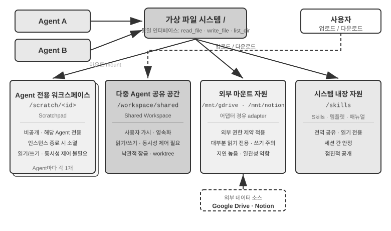


표 10-4는 가시성, 수명 주기, 읽기/쓰기 권한, 동시성 제어라는 네 차원에서 이 네 종류의 영역을 비교한다. 파일 시스템 레이아웃 설계용 체크리스트로 쓸 수 있다.

표 10-4 에이전트 가상 파일 시스템의 네 종류 영역

| 영역 | 가시성 | 수명 주기 | 읽기/쓰기 | 동시성 제어 |
|----------------|--------------------|-------------------|-----------------|------------------------|
| 에이전트 전용 작업 공간 | 해당 에이전트만 | 에이전트 인스턴스 소멸과 함께 | 읽기/쓰기 | 불필요(사유) |
| 멀티 에이전트 공유 공간 | 모든 협업 에이전트 + 사용자 | 작업 기간 지속, 영속화 필요 | 읽기/쓰기 | 필요(낙관적 잠금 / worktree) |
| 외부 마운트 자원 | 외부 권한에 따라 | 외부 원본이 결정 | 대체로 읽기 전용, 쓰기는 신중 | 외부 원본이 담당 |
| 시스템 내장 자원 | 모든 에이전트 | 세션 간 안정적 | 읽기 전용 | 불필요(읽기 전용) |

네 종류의 영역을 같은 디렉터리 트리 아래 통일하는 것이 바로 "**파일 경로를 보편적 인터페이스로**" 삼는 설계의 가치다. 에이전트 사이의 산출물 전달, 주 에이전트가 하위 에이전트에 입력을 넘기는 일, 더 나아가 조직 간 A2A 협업에서 산출물(Artifact)을 교환하는 일까지, 전달되는 것은 가벼운 경로 문자열이지, 내용을 컨텍스트 창에 밀어 넣는 것이 아니다(4장). 이는 5장의 "파일 시스템이 에이전트의 중추"라는 논의와 한 맥락이다. 5장은 단일 에이전트가 파일 시스템으로 기억과 능력을 담는 이야기를 다뤘다면, 여기서는 같은 추상화를 멀티 에이전트로 확장한다. 사유, 공유, 외부, 내장이라는 네 종류의 저장이 마운트된 가상 디렉터리 트리 한 그루가 곧 멀티 에이전트 협업의 저장 기반이다.

### 에이전트 사이의 통신과 제어

파일 시스템은 에이전트 사이의 **산출물 교환** 문제를 해결하지만, 협업에는 **제어 평면**도 필요하다. 바로 여기에 표 10-3의 수명 주기 관련 행이 힘을 발휘한다. 4장이 제시한 도구 원시 연산 — 생성(`spawn_subagent`), 메시지 발송(`send_message_to_subagent`), 취소(`cancel_subagent`), 발견(`list_agents`) — 은 프로세스 세계의 fork, 메시지, kill, ps에 대응한다. 이 절은 인터페이스 정의를 반복하지 않고, 멀티 에이전트 협업이 의존하면서도 자주 간과되는 네 가지 능력에 초점을 맞춘다.

**1. 메시지 전달.** 가장 단순한 형태는 점대점이다. 에이전트 A가 `send_message_to_agent_b(content)`를 직접 호출하는 식이다. 토폴로지가 고정되고 에이전트 수가 적은 상황(예: 이 장 실험 10-4의 전화 + 컴퓨터 듀얼 에이전트)에 맞다. 에이전트 수가 늘고 비동기 병렬이 필요해지면, 점대점 연결 수는 에이전트 수의 제곱으로 증가하고, 송수신 양쪽이 동시에 온라인이어야 한다. 이때는 **메시지 버스**(이 장 뒤의 "병렬 조정 형태" 참조)로 바꿔야 한다. 에이전트가 버스로 메시지를 게시하면, 버스가 구독 관계에 따라 전달하며, 발신자는 소비자가 누구인지 알 필요가 없다. 점대점이든 버스를 거치든, 메시지는 보통 구조화된 **봉투**(envelope)를 갖춰야 한다. 발신자 ID, 목적지(지정 에이전트 또는 브로드캐스트), 메시지 유형(예: `task_assigned`/`status_update`/`result`/`terminate`), 그리고 JSON 페이로드. 통일된 봉투 형식은 수신자가 안정적으로 라우팅하고 해석하는 것을 보장하고, 협업 사슬을 추적 가능하게 만든다. 이것이 멀티 에이전트 시스템 디버깅의 핵심이다.

**2. 상태 질의.** 제어 평면에서 가장 과소평가되는 부분이다. 주 에이전트가 하위 에이전트를 파견한 뒤 진척을 알 수 없다면, 계속 기다려야 할지, 하위 에이전트가 막혔을 때 제때 개입할지 판단할 수 없다. 직관적 방법은 RPC를 그대로 베껴서 `get_subagent_status(agent_id)`라는 질의 인터페이스를 정의해 "실행 중/완료/실패"에 진행률 퍼센트를 더해 반환하는 것이다. 그러나 이런 풀 방식의 실제 유용성은 기대보다 훨씬 낮다. 하위 에이전트는 일단 생성되면 곧바로 실행을 시작해 완료나 실패까지 달리고, 전통적 배치 처리 시스템의 잡처럼 여러 대기 상태를 거치지 않는다. 유닉스 프로그래밍에서 PID로 다른 프로세스의 상태를 주기적으로 폴링하는 일이 거의 없는 것과 같다. 폴링에는 본디 딜레마가 있다. 너무 잦으면 토큰 낭비고, 너무 드문 드문드문 하면 시의성이 떨어진다. 상태 파악의 더 자연스러운 방법은 이 장 서두의 두 통신 패러다임으로 돌아가는 것이다.

**메시지 전달로 상태 얻기**. 주 에이전트가 하위 에이전트에 "진행 어떠냐?"고 메시지를 직접 보낸다. 하위 에이전트는 적절한 시점에 답한다. 모든 것이 비동기다. 메시지를 보내도 자기 실행이 막히지 않고, 상대가 언제, 응답할지 말지는 별개의 문제다. 마치 매니저가 인스턴트 메신저로 부하의 진행을 묻되, 상대에게 지금 하던 일을 멈추라 요구하지 않는 것과 같다. 거꾸로 하위 에이전트도 핵심 마일스톤에 도달하면 능동적으로 메시지를 보고할 수 있다. 시스템에 이미 메시지 버스가 깔려 있으면, 이는 버스에 `status_update`를 게시하는 것에 불과하다(실험 10-6의 "실시간 모니터링"이 바로 이 형태다). 질문이든 능동 보고든, 메시지 속의 상태는 통일된 상태기계 어휘(실행 중, 입력 필요, 완료, 실패)를 쓰는 것이 좋다. 이 장 뒤의 A2A 프로토콜이 바로 작업 수명 주기를 이런 상태 집합으로 표준화한 것이다.

**공유 파일 시스템으로 상태 얻기**. 가장 철저한 형태는 **궤적 영속화**(trajectory persistence)다. 하위 에이전트가 실행 과정에서 자신의 궤적(1장에서 정의한 trajectory — 사용자 메시지, 모델 응답, 도구 호출과 결과의 완전한 시퀀스)을 실시간으로 JSON으로 직렬화해 파일 시스템의 로그 파일에 덧붙인다(보통 세션마다 파일 하나, 사건마다 한 줄, 즉 JSONL 형식). 주 에이전트는 어떤 상태 보고 프로토콜도 필요 없이 이 파일을 읽기만 하면 하위 에이전트의 실행 전체를 볼 수 있다. 지금 어느 도구를 호출하고 있는지, 최근 한 단계에서 무엇을 생각하는지, 반복 실패의 재시도에 막혀 있는지. 프로세스의 언어로 말하면 다른 프로세스의 메모리를 직접 읽는 셈이다. 하위 에이전트의 컨텍스트를 차지하지 않고, 협조에 의존하지 않으며, 관측 입도가 가장 세다. 그러나 아주 세밀한 것이 또한 부담이 된다. 궤적은 가볍게 수만 토큰이고, 주 에이전트가 다 읽고 또 가공해야 하니 시간도 토큰도 든다. 그래서 대부분의 상황에서는 **진행 파일 합의**가 더 합리적이다. 주 에이전트가 하위 에이전트를 시작할 때 "진행을 progress.md에 적어라"고 합의한다. 하위 에이전트는 한 항목을 마칠 때마다 이 작업 목록을 갱신하고, 주 에이전트는 언제든 이 가벼운 파일을 읽어 진척을 파악한다. 두 프로세스가 공유 메모리에 합의된 형식의 작은 상태 영역을 할당한 것에 해당하며, 드러나는 것은 가공된 진행 상황이지 "메모리" 전체가 아니다. 진행 파일은 **막힘 감지**도 부수적으로 제공한다. progress.md(또는 궤적 파일)의 마지막 수정 시간이 N분 넘게 변하지 않으면 하위 에이전트가 활동이 없는 것으로 판정해 타임아웃 대응을 트리거한다(4장의 하트비트와 monitor_shell과 연결). 막힌 하위 에이전트가 시스템 전체를 끌고 가는 일을 막는 것이다.

궤적 영속화의 가치는 모니터링보다 훨씬 크다. 1장의 결론 "에이전트의 컨텍스트 = 정적 접두부 + 궤적"을 떠올려 보자. 정적 접두부(시스템 프롬프트, 도구 정의)는 코드가 결정하며, 에이전트 자신은 궤적 밖에 별도의 런타임 상태를 갖지 않는다(작업 산출물은 본래 파일 시스템에 떨어진다). 즉 **궤적이 곧 에이전트의 전체 상태**다. 궤적을 실시간으로 파일에 영속화하면, 언제나 완전한 체크포인트 하나를 쥐는 셈이다. 에이전트 프로세스가 크래시되든, 기기 정전이든, 사용자가 세션을 능동으로 닫든, 궤적 파일을 다시 로드해 정적 접두부에 이어 붙이면 끊긴 지점에서 실행을 재개할 수 있다. 클로드 코드(Claude Code), 코덱스 CLI(Codex CLI) 같은 코딩 에이전트의 세션 재개(session resume) 기능이 정확히 이렇게 구현된다. 이는 데이터베이스의 사전 기록 로그(write-ahead log)와 같은 생각이다. 사건마다 먼저 늘어나기만 하는 로그에 덧붙이고, 상태는 언제나 로그에서 재생할 수 있다(3장의 "사실 로그 + 주기적 체크포인트" 기억 설계는 같은 생각을 기억 시스템에 적용한 것이다). 멀티 에이전트 시스템에게 이것은 하위 에이전트가 본디 **복구 가능, 감사 가능, 인계 가능**함을 뜻한다. 관리자는 하위 에이전트가 크래시된 뒤 마지막 유효 상태에서 재시작할 수 있고, 사후에 사건마다 궤적을 재생해 실패 원인을 특정할 수 있으며, 궤적을 작업과 함께 다른 에이전트에 넘겨 실행을 이어받게 할 수도 있다.

**3. 실행 종료.** 병렬 협업에는 흔히 "하나가 성공하고 나머지는 무효가 되는" 상황이 생긴다. 여러 에이전트가 흩어져 검색하다 한 놈이 목표를 찾으면 나머지는 곧바로 멈춰야 한다(이 장 실험 10-6의 계단식 종료). 종료에는 두 강도가 있다. 유닉스 사용자는 이것이 SIGTERM과 SIGKILL의 차이임을 알아볼 것이다. **정상 종료(graceful)**가 첫 선택이다. 주 에이전트가 `terminate` 시그널을 보내면, 하위 에이전트는 현재 단계의 안전 지점에서 응답해 먼저 자원을 정리하고(브라우저 세션 닫기, 미완료 파일 쓰기, 잠금 해제), 확인(ack)을 반환한 뒤 빠진다. **강제 종료(forced)**는 최후의 수단이다. 프로세스를 곧바로 끝낸다. 하위 에이전트가 정상 시그널에 반응하지 않을 때만 쓰며, 대가로 매달려 있던 자원과 미완료 쓰기를 남길 수 있다. 엔지니어링 요점 둘을 처리해야 한다. 하나, 정상 종료는 하위 에이전트가 순환 안에서 정기적으로 종료 시그널을 검사해야(4장의 중단 메커니즘과 유사) 작동한다. 그렇지 않으면 시그널이 응답을 얻을 길이 없다. 둘, 계단식 종료에는 경쟁 조건이 있다. 여러 하위 에이전트가 거의 동시에 성공을 보고할 수 있으며, 주 에이전트는 잠금이나 멱등 설계로 단 한 번만 정산하고 한 라운드만 종료를 브로드캐스트해야 한다. 이 장 실험 10-6의 경쟁 조건 논의를 볼 것.

정리할 남은 문제 하나. 주 에이전트가 종료된 뒤에도 여전히 실행 중인 하위 에이전트는 어떻게 되나? 엔지니어링에서 가장 간결한 방법은 Go의 컨텍스트(context)를 빌리는 것이다. 종료는 생성 관계를 따라 아래로 계단식 전파된다. 한 에이전트를 취소하면 그가 파생한 모든 하위 에이전트가 함께 취소되어, 뿌리에서부터 고아 에이전트가 생기는 일을 원천 차단한다. 앞의 "하위 에이전트가 안전 지점에서 종료 시그널을 검사한다"는 것은 Go의 `ctx.Done()` 폴링에 대응한다. 거꾸로, 정말로 주 에이전트에서 떨어져 나와 장기 실행되는 백그라운드 에이전트(유닉스의 `nohup`과 유사)가 필요하면, 새 수명 주기 트리를 하나 시작하게 하고(`context.Background()`에 대응), 부모를 따라 종료되지 않음을 명시적으로 선언한다.

**4. 자원과 스케줄링.** 운영체제의 나머지 절반 역할은 희소 자원을 배분하는 것이다. 프로세스 세계에서 희소한 것은 CPU 시간과 메모리, 에이전트 세계에서 희소한 것은 토큰, 자금, 동시성 한도다. 하위 에이전트의 매 단계가 이 셋을 소모한다. 이 역할은 보통 관리자나 런타임이 맡는다. 하위 에이전트를 시작할 때 단계나 토큰 예산을 설정하고, 한도를 넘기면 멈춘다. 어려운 작업은 강 모델에, 기계적 작업은 저비용 모델에 맡긴다. 동시 수에는 상한을 두어 수십 개 에이전트가 동시에 API 할당량을 갉아먹는 일을 막는다. 더 급한 작업이 들어오면 실행 중인 하위 에이전트를 끊는데, 이것이 선점이다. 이 영역의 실무는 아직 CPU 스케줄링만큼 성숙하지 못하지만, 멀티 에이전트 시스템의 비용 상한을 결정하므로 아키텍처 설계 단계부터 고려해야 한다.

산출물 교환(데이터 평면)과 메시지 전달, 상태 질의, 실행 종료, 자원 스케줄링(제어 평면)이 함께 컨텍스트 비공유 멀티 에이전트 시스템을 떠받친다. 아래의 세 가지 협업 토폴로지는 본질적으로 모두 이 두 평면 위에서 제어권 귀속과 정보 흐름 방향에 대해 내린 서로 다른 선택이다.

에이전트 사이의 협업 관계와 제어 흐름 특성에 따라, 컨텍스트 비공유 협업은 세 가지 주요 아키텍처로 나뉜다. 피어 협업 패턴, 관리자 패턴, 분산 패턴이 각기 다른 유형의 작업에 맞다.

### 피어 협업 패턴: 상호 견제와 반복 개선

피어 협업은 보통 2~3개의 동등한 자격을 가진 에이전트가 여러 라운드에 걸쳐 서로 피드백을 주고받는다. 핵심 가치는 인지적 다양성을 도입하는 것이다. 서로 다른 에이전트가 서로 다른 각도에서 같은 문제를 들여다보며, 혁신과 견고함 사이의 균형을 잡아, 어느 단일 에이전트보다 더 질 높은 결과를 낸다.

관리자 패턴과 분산 패턴에 비해 피어 협업의 구현 복잡도는 훨씬 낮다. 두 에이전트의 역할, 통신 메커니즘, 반복 종료 조건만 잘 정의하면 가동할 수 있다. 아이디어를 빠르게 검증하고 프로토타입을 구축하는 데 이상적 선택이다.

피어 협업의 가장 고전적 용도는 에이전트 실무에서 극히 흔한 한 부류의 실패를 해결하는 것이다. **조기 종료** — 일이 절반쯤 남았는데 멈춰버리는 것. 세 가지 전형적 형태가 있다. 아래에 코딩 에이전트와 필자 팀이 만든 파인 AI(Pine AI, 서론에서 소개한, 사용자 대신 전화로 상점·통신사와 협상해 일을 처리하는 에이전트)로 각각 몇 가지 예를 든다. 첫째, **게으른 식의 거짓 완료**: 일부만 해놓고 전부 끝났다고 선언하는 것이다. 코딩 에이전트가 코드를 쓰고, 테스트는 안 돌려보고, 배포도 안 해 봤으면서 "작업 완료"라고 보고한다. 사용자가 파인 AI에게 두 가지를 맡겼는데 첫째를 끝내고 둘째를 잊은 채 "다 해습니다"라고 보고한다. 둘째, **조기 포기**: 한 길이 막히면 일 전체를 못 한다고 선언하는 것이다. 파인 AI가 상점에 연락할 때 전화, 양식 작성, 이메일 등 여러 경로가 있는데 전화 한 번 거절당하자 사용자에게 "이 일은 못 합니다"라고 말한다. 실제로는 경로를 바꿔 다시 시도하면 성공할 가능성이 높다. 셋째, **거짓 성공**: 에이전트는 해냈다고 생각하지만 실제로는 폐루프가 안 끝났다. 전화로 상대가 환불을 구두로 동의했지만, 사용자가 휴대폰 앱에서 한 단계 더 확인해야 하는데, 에이전트는 "처리 완료"라고 보고한다. 사용자는 후속 조치가 있다는 사실을 모르고, 환불은 실제로 이루어지지 않는다. 세 형태 모두 같은 뿌리를 가리킨다. **검증이 되기 전에는 "완료"란 모델의 한마디 선언일 뿐, 증명이 아니다.**

선언을 증명으로 바꾸는 것이 1장의 진화 호 마지막에 놓인 **루프 공학**(Loop Engineering)의 주제다. 에이전트가 계속 돌아가는 순환을 설계한다. 다음에 할 일을 발견, 실행, 검증, 진행 기록 — "정말 멈춰도 되는가"를 모델 자신이 아니라 검증자가 판정한다. 인간의 역할은 "에이전트에게 프롬프트를 적어 주는 조작자"에서 "순환을 설계하는 엔지니어"로 바뀐다. 이 명칭은 2026년 6월 애디 오스마니(Addy Osmani)가 정리해 제시했다[^loop-engineering-2026]. 앤스로픽 클로드 코드 총괄 보리스 체르니(Boris Cherny)의 표현은 더 직설적이다. "저는 더 이상 클로드를 직접 프롬프트하지 않습니다. 제 일은 루프를 짜는 겁니다." 업계가 이 논의에서 이룬 핵심 합의는 이것이다. **순환의 병목은 모델이 아니라 검증자에 있다.** 검증이 불안정하면 순환이 아무리 빨리 돌아도 그저 낮은 품질의 산출을 더 빨리 "완료"로 찍을 뿐이다. 서론에서 말한 대로 실무가 먼저, 명명이 뒤따른다. 이 명칭이 유행하기 전에도 파인 AI를 포함한 선두 에이전트 팀은 이미 "순환 더하기 검증"으로 조기 종료 문제를 풀고 있었다. 검증을 조직하는 가장 효과적 방식이 바로 아래에 논의할 제안자-검토자 패러다임이다.

[^loop-engineering-2026]: Osmani, Addy. "Loop Engineering: Designing Loops that Prompt Coding Agents", 2026. https://addyosmani.com/blog/loop-engineering/

**제안자-검토자 패러다임.**


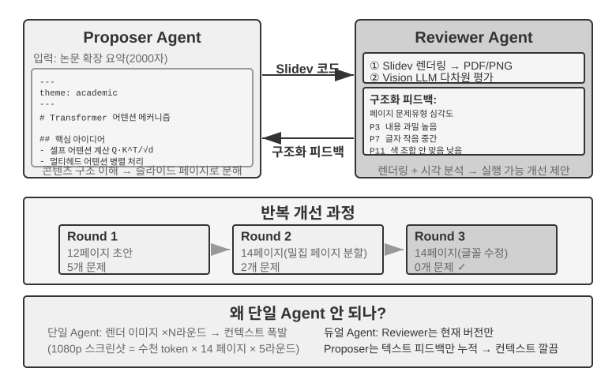


제안자-검토자는 가장 고전적인 피어 협업 패러다임이다. 5장은 이미 PPT 생성, 비디오 편집, 로그 시각화 세 실험에서 이 패러다임의 설계 원칙과 실전 응용을 자세히 소개했다. 제안자 에이전트(Proposer)는 코드를 생성하고, 검토자 에이전트(Reviewer)는 실행 결과를 렌더링해 비전 LLM(Vision LLM)으로 품질을 평가하고 구조화된 개선 제안을 주며, 둘이 효과가 기준에 다다를 때까지 반복한다.

이 패러다임은 보안 심사(Proposer가 조작 방안을 생성하고 Reviewer가 컴플라이언스와 잠재적 위험을 검사), 콘텐츠 심의(Proposer가 답변 초안을 쓰고 Reviewer가 업무 규칙과 용어 규범을 검사), 코드 심사(Proposer가 코드를 짜고 Reviewer가 보안과 모범 사례를 검사) 등의 상황에도 그대로 맞는다.

**왜 한 에이전트가 스스로 생성하고 스스로 심사하게 하지 않는가?** 이것이 바로 앞의 "멀티 에이전트는 언제 진정 단일 에이전트보다 나은가" 절의 그 판단 기준이 구체적으로 닿는 지점이다. 심사가 새 정보를 도입하지 않으면 그저 "모델에게 한 번 더 생각하게 하는 것"에 불과하다. 관련 연구가 이에 명확한 답을 준다. 황(Huang) 등의 ICLR 2024 논문 《Large Language Models Cannot Self-Correct Reasoning Yet》에 따르면, GPT-4가 외부 피드백 없이 자기 답을 심사하고 수정하면 정확도가 오히려 떨어진다. 모델이 정답을 오답으로 바꾼 횟수가 오답을 정답으로 바꾼 횟수보다 많다.

2024년 TACL 저널에 발표된 총설 논문 《When Can LLMs Actually Correct Their Own Mistakes?》(arXiv:2406.01297)도 이 결론을 확인한다. 신뢰할 수 있는 외부 피드백(예: 테스트 케이스의 실행 결과, 외부 도구의 검증 출력)이 제공되지 않는 한, 모델 자신의 "자기 교정"에만 의존하는 것은 거의 효과가 없다.

ICLR 2024의 CRITIC 논문은 직관적 비교 실험을 제공한다. CRITIC은 모델이 외부 도구(검색 엔진, 파이썬 인터프리터)로 자기 답을 검증하게 해 효과를 크게 끌어올린다. 하지만 실험자가 도구 검증 단계를 제거하고 모델의 자기 평가만 남기면 개선의 대부분이 사라진다. 이는 심사의 가치가 "모델에게 한 번 더 생각하게 함"에 있는 게 아니라 **모델이 생성할 때 갖지 못했던 새 정보를 도입**하는 데 있음을 보여 준다. 테스트 결과, 렌더링 스크린샷, 컴파일 에러, 외부 검색 결과가 그런 정보다.

이것이 제안자-검토자 패러다임의 핵심 설계 원리다. 5장의 PPT 생성 실험에서 검토자 에이전트의 가치는 "같은 모델로 코드를 한 번 더 보는 것"이 아니라 **PPT를 렌더링하고 스크린샷을 찍은 것**이다. 이 스크린샷은 제안자 에이전트가 코드를 생성할 때 전혀 얻을 수 없었던 시각 정보를 담는다. 마찬가지로 코드 생성 상황에서 테스트 케이스를 실행해 얻은 통과/실패 결과도 코드를 짤 때는 존재하지 않던 새 신호다. 검토자의 독자적 가치는 바로 제안자가 얻을 수 없는 이런 외부 피드백에 닿을 수 있다는 데서 나온다.

루프 공학의 관점에서 보면, 업계가 정리한 몇 가지 순환 스타일이 모두 이 책에서 대응점을 찾을 수 있다. 폐루프 더하기 인간 승인은 4장의 사전 승인(인간이 최종 검토자)에 대응한다. 개루프 더하기 예산이나 라운드 상한은 5장 PPT 생성의 다 라운드 반복(최대 5라운드)에 대응한다. 오케스트레이션형 하위 에이전트는 다음 절의 관리자 패턴에 대응한다. 달리 말해 루프 공학은 새로운 아키텍처를 기술하는 게 아니라, 이런 협업 패턴을 "순환 + 검증 + 종료 조건"이라는 하나의 프레임으로 통일하는 것이다. 검증을 담당하는 것이 바로 여기의 제안자-검토자 패러다임이다.

**확장: 다른 피어 협업 패턴.**

**토론(Debate)**: 여러 에이전트가 각기 다른 입장을 쥐고 적대적 대화로 문제 공간을 깊이 탐구한다. 한 기술 방안을 평가할 때 에이전트 A는 "지지자"를 연기해 방안의 장점과 기회를 나열하고, 에이전트 B는 "반대자"를 연기해 위험과 한계를 지적하며, 매 라운드마다 상대 논점에 반박이나 보탬을 제시한다. 단일 에이전트가 분석할 때 모델은 흔히 한쪽 견해로 치우쳐 반대 증거를 소홀히 한다. 토론 패턴은 제도화된 적대를 통해 양면이 모두 충분히 논증되게 해, 의사결정자가 더 균형 잡힌 판단을 내리게 돕는다.

다만 토론 패턴의 실제 효과는 학계에서 여전히 논쟁거리다. 2026년 트란과 키엘라(Tran, Kiela)의 연구[^single-agent-2026]는 멀티홉 추론 과제에서 단일 에이전트와 다섯 가지 멀티 에이전트 아키텍처(순차, 토론, 앙상블, 병렬 역할, 하위 과제 병렬)를 비교해, **사고 토큰 예산을 엄격하게 동일하게 맞추면 단일 에이전트의 성적이 멀티 에이전트와 동등하거나 더 좋다**는 사실을 발견했다(단, 컨텍스트 활용률이 어느 정도까지 약화되는 경우는 예외). 연구자는 정보론의 데이터 처리 불평등식에 근거해 설명한다. 토론의 여러 에이전트는 완전히 동일한 텍스트 정보를 처리하며, 에이전트 사이의 매 번 직렬 중간 결론 전달은 정보를 잃을 수만 있지 새 정보를 창조할 수는 없다. 토론 패턴이 일부 학술 논문에서 보인 수익은 여러 에이전트가 더 많은 총 계산량을 소모한 데서 왔을 가능성이 높다. 이 논증의 경계를 분명히 해 둘 필요가 있다. 이는 "멀티 에이전트가 직렬로 중간 결론을 전달"해서 생기는 정보 병목을 겨냥한 것이며, 다른 부류의 접근을 부정하지 않는다. 즉 같은 문제를 **여러 번 독립 샘플링 후 집약**(예: 셀프 컨시스턴시, 다수결 투표)하거나, **생성과 검증의 난이도 비대칭**(정답을 쓰기는 어렵고 검증하기는 쉬운 성질)을 활용한 생성-검증 분업은 여기에 해당하지 않는다. 이런 상황은 추가적인 독립 샘플링을 도입하거나 작업 자체의 비대칭 구조를 이용하며, 데이터 처리 불평등식의 적용 범위 밖에 있다.

[^single-agent-2026]: Tran, D., Kiela, D. *Single-Agent LLMs Outperform Multi-Agent Systems on Multi-Hop Reasoning Under Equal Thinking Token Budgets.* arXiv:2604.02460, 2026.

**브레인스토밍(Brainstorm)**: 여러 에이전트가 독립적으로 아이디어를 생성한 뒤 서로 공유하고 서로 자극을 준다. 예를 들어 제품 혁신 작업에서 에이전트 1은 "소셜 공유 기능 추가"를 제안하고, 에이전트 2는 자극을 받아 "소셜 네트워크에 공유할 뿐 아니라 개인화된 공유 포스터도 생성"을 제안하며, 에이전트 3은 앞의 둘을 종합해 "사용자가 포스터 템플릿을 자유롭게 만들고 템플릿 마켓을 형성"을 제안한다. 서로 다른 에이전트가 서로 다른 "사고 취향"(서로 다른 프롬프트나 모델로 구현)을 가질 때, 상호 자극으로 더 넓은 해 공간을 탐색해 단일 에이전트로는 떠올리기 어려운 아이디어 조합을 찾는다.

**전문가 패널(Panel Discussion)**: 여러 에이전트가 각기 한 전문 영역의 관점을 대변해 학제 간 문제를 함께 논의한다. 예를 들어 신제품 타당성을 평가할 때 엔지니어 에이전트는 기술적 각도에서 구현 난이도를 분석하고, 제품 에이전트는 사용자 경험 각도에서 시장 매력도를 평가하며, 운영 에이전트는 비용과 자원 각도에서 사업 타당성을 분석한다. 이런 에이전트들 사이는 적대 관계가 아니라 보완 관계로, 함께 문제의 전모를 조립해 내고 영역 간 제약과 기회를 식별한다.

### 관리자 패턴: 중앙화된 조정

과제가 5개 이상의 하위 과제를 다루거나, 동적 스케줄링이 필요하거나, 하위 과제 사이에 복잡한 의존성이 있을 때, 피어 협업으로는 역부족이라 관리자 패턴이 필요하다. 관리자 에이전트의 역할은 프로젝트 매니저와 같다. 먼저 전체 과제를 이해하고, 배분 가능한 하위 과제로 쪼갠 뒤, 적합한 에이전트를 골라 실행시키고, 진척을 추적하며 이상(재시도, 에이전트 교체, 계획 조정)을 처리하고, 마지막으로 각 에이전트의 출력을 모아 최종 결과를 낸다.

시스템 설계 관점에서 관리자 패턴은 각 전문 에이전트를 관리자가 호출 가능한 도구로 모델링한다. 관리자의 도구 집합에는 전통적 외부 도구(예: 검색, 파일 조작)뿐 아니라 다른 에이전트의 호출 인터페이스가 들어 있다. 관리자는 도구 호출 메커니즘으로 해당 에이전트를 시작하고, 작업 매개변수와 필요한 컨텍스트를 전달하며, 완료를 기다렸다가 반환 결과를 받는다. 관리자 관점에서 에이전트 하나를 호출하는 것과 보통 도구 하나를 호출하는 것은 본질적으로 같다. 둘 다 요청을 보내고 응답을 얻는다. 이 통일적 추상이 관리자 패턴에 좋은 확장성을 부여한다. 새 능력을 추가하려면 해당 에이전트를 개발해 도구로 등록하기만 하면 된다. 관리자의 핵심 로직은 손대지 않아도 된다. 동시에 이질성을 자연스럽게 지원한다. 서로 다른 에이전트가 서로 다른 모델, 프롬프트, 도구 집합을 쓸 수 있고, 심지어 서로 다른 하드웨어 환경에서 실행될 수도 있다.

"에이전트가 서로에게 도구가 된다"는 추상은 4장의 "협업 도구" 절에서 이미 확립했다. spawn_subagent / send_message / cancel_subagent / list_agents의 인터페이스 설계는 여기서 관리자가 하위 에이전트를 호출하는 데 그대로 적용된다. "관리자 → 하위 에이전트" 방향으로 무엇을 전달할지는 이 장 뒤의 인계 패키지 설계(작업 서술, 확인된 사실과 제약, 구조화 산출물의 참조)를 참고할 수 있다. 대칭적 문제는 "하위 에이전트 → 관리자" 방향으로 무엇을 반환할지다. 답은 **전체 궤적이 아니라 구조화 요약**이다. 하위 에이전트는 작업 결론, 핵심 발견, 산출물의 파일 경로, 만난 문제를 반환하고, 실행 궤적 전체는 자기 로그에 남겨 둔다. 이렇게만 해야 관리자의 컨텍스트가 하위 과제 수에 따라 완만하게 선형 성장하지, 폭발적으로 부풀지 않는다. 이는 아래 실험 10-3에서 관리자가 "파일 색인만 유지하고 번역 내용은 저장하지 않는다"는 방법론의 근거이기도 하다.

하지만 관리자 패턴에도 본래의 과제가 있다. 관리자가 시스템의 단일 병목이 된다. 관리자는 모든 하위 과제의 성격을 이해하고, 올바른 에이전트를 선택하며, 컨텍스트를 정확히 전달해야 하고, 어느 결정이든 편차가 전체 흐름에 영향을 미친다. 게다가 관리자는 전체 작업의 전역 컨텍스트를 유지해야 하며, 작업이 깊어지고 에이전트 호출이 많아지면서 컨텍스트가 빠르게 부풀 수 있다. 그러므로 관리자의 프롬프트 품질, 컨텍스트 관리 전략, 합리적인 작업 분해 입도에 특별히 신경 써야 한다.

2025년의 계획-그리고-실행(Plan-and-Act) 논문[^plan-and-act-2025]이 이를 실증 분석했다. 플래너-실행자(Planner-Executor) 듀얼 에이전트 아키텍처에서 **약한 계획자가 전체 시스템의 가장 결정적 병목**이다. 계획자의 계획 품질이 충분히 높으면 실행자가 비교적 단순해도 좋은 결과를 얻는다. 거꾸로 계획자의 작업 분해가 틀리면 뒤따르는 모든 실행자의 작업이 잘못된 전제 위에 서게 된다. 이 연구는 WebArena-Lite 벤치마크에서 54% 성공률을 얻었는데, 핵심 기여는 실행자의 실행 능력이 아니라 계획자의 계획 능력을 개선한 것이다. 이 발견의 시사점은 이렇다. 가장 강한 모델과 가장 정교하게 설계한 프롬프트를 관리자(계획자)에게 할당해야지, 모든 에이전트에 자원을 평등하게 배분해서는 안 된다.

이는 4장의 한 논점과 충돌하지 않는다. 4장은 제안 모델과 검토 모델을 논하며 양쪽 능력이 비슷해야 한다고 지적한다. 그러나 그것은 **심사 상황**을 두고 한 말이다. 검토자는 피심사자의 추론을 따라잡아야만 그 결함을 발견할 수 있고, 능력 격차가 너무 크면 심사 자체가 안 된다. 관리자 패턴이 논하는 것은 다른 것이다. **계획과 실행의 분업**이다. 계획자가 작업 분해를 잘못하면 실행자가 아무리 강해도 구원할 길이 없다. 그러므로 가장 강한 모델과 가장 정교한 프롬프트는 계획자에게 우선 배정해야 한다. 실행자들 사이의 능력 균형이 필요한지는 하위 과제의 결합 정도에 달린다. 여러 실행자의 산출물이 최종적으로 한 덩어리로 조립될 때, 가장 약한 고리가 전체 품질을 끌어내리는 경우가 많다.

[^plan-and-act-2025]: Erdogan, L. E., et al. *Plan-and-Act: Improving Planning of Agents for Long-Horizon Tasks.* arXiv:2503.09572, 2025.

**순차 조정 형태.**


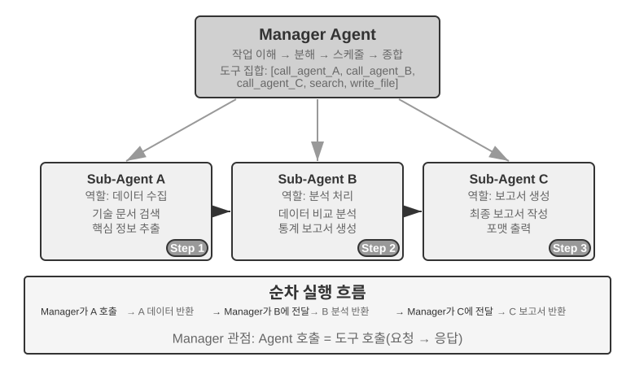


관리자가 전문 에이전트를 순서대로 차례로 호출한다. 각 에이전트가 끝나면 결과를 반환하고, 관리자가 다음 단계를 결정한다. 제어 흐름은 선형이라 단순명료하며, 하위 과제 사이에 명확한 선후 의존성이 있는 상황에 맞다.

> **실험 10-3 ★★: 책 번역 에이전트**
>
> 책 번역은 멀티 에이전트 협업이 필요한 전형적 복잡 과제다. 기술 서적 번역은 단순히 글을 한 언어에서 다른 언어로 옮기는 것 이상으로, 전문 용어를 책 전체에서 일치시키고, 문맥을 정확히 하고, 전체 읽기를 매끄럽게 보장해야 한다. 예를 들어 대언어모델 관련 영문 서적을 번역하면, 수많은 용어가 반복해 등장한다. 관습적 표현이 여러 가지일 수 있는데, 책 전체에서 통일해야 한다. 1장에서 agent를 "지능체"로 번역했으면 뒤에서 "대리인"으로 바뀌면 안 된다.
>
> 단일 에이전트로 처리하면 심각한 컨텍스트 문제에 직면한다. 에이전트가 장별로 내용을 처리하면서 컨텍스트가 계속 누적된다. 책 전체 용어집, 이미 번역된 장, 현재 단락, 번역 사고 과정, 도구 호출 결과. 수백 쪽짜리 기술 서적에 번역 중간 산출물까지 더하면 컨텍스트 창을 쉽게 넘친다. 더 심각한 것은, 너무 긴 컨텍스트에서 에이전트가 "길을 잃기" 쉽다는 점이다. 이전 용어 합의를 잊고 8장에서 2장과 다른 번역을 쓴다. 심사 단계에서 중복 검사로 자원을 낭비한다. 심지어 주의가 흩어져 환각을 일으켜 실제로는 존재하지 않는 용어 규칙을 "기억해" 낸다.
>
> 관리자 패턴은 작업 분해와 책임 분리로 이 문제를 해결한다.
>
> - **용어집 에이전트(Glossary Agent)**: 책 전체 내용을 받아 반복 등장하는 전문 용어를 식별하고, 전문 사전과 번역 규범을 검색해 구조화 용어 대조표(영문 용어, 중국어 번역, 품사, 사용 문맥을 포함한 JSON/CSV 형식)를 생성한다. 완료하면 공유 파일 시스템에 기록하고 에이전트는 곧 파괴되어 자원을 해제한다.
> - **번역 에이전트(Translation Agent)**: 현재 장, 용어 대조표, 번역 지침(목표 독자 수준, 언어 스타일)을 받아 매끄러운 중국어로 번역한다. 대조표의 용어를 만나면 규정된 번역을 엄격히 사용하고, 새 용어를 만나면 번역을 추론하고 검토 대기로 표시한다. 각 인스턴스는 독립된 컨텍스트에서 일하며 서로 간섭하지 않는다. 번역문은 파일 시스템에 기록된다(예: `chapter1_zh.md`). 관리자는 여러 인스턴스를 병렬이나 직렬로 시작할 수 있다.
> - **교정 에이전트(Proofreading Agent)**: 모든 번역문과 용어집을 받아 일관성 검사를 수행한다. 용어 번역이 통일되었는지 하나하나 검증하고, 앞뒤 불일치를 식별하며, 전체 흐름과 가독성을 점검한다. 교정 보고서를 생성해 파일 시스템에 기록한다.
> - **관리자 에이전트**: 컨텍스트에는 주로 작업 서술, 실행 계획, 각 에이전트의 호출 기록과 진행 상태를 보관한다. 전체 번역 내용(이것은 파일 시스템에 있음)은 저장하지 않고 파일 색인만 유지한다. 교정 보고서에 따라 관리자는 특정 장을 번역 에이전트에 돌려보내 수정하게 할 수 있다.
>
> 이 아키텍처에서 관리자 에이전트의 컨텍스트는 늘 관리 가능한 범위 안에 있다. 관리자가 알아야 할 것은 작업의 전체 서술과 목표, 각 단계의 실행 계획, 각 에이전트의 호출 기록과 반환 결과, 그리고 현재 진행 상태뿐이며, 매 장의 전체 번역 내용을 담을 필요는 없다.
>
> 핵심 장점은 **컨텍스트 격리**다. 용어집 에이전트는 용어 추출에 필요한 내용만 보고, 번역 에이전트는 현재 장과 용어집만 보며, 교정 에이전트는 비록 전문에 접근해야 하지만 일관성 검사에만 집중한다. 각 에이전트가 간결하고 집중된 컨텍스트에서 일해서 효율이 더 높을 뿐 아니라 오류 가능성도 더 낮다. 정보 과부하로 주의가 흩어지는 일이 없기 때문이다.
>
> **실험 요구**:
> 1. 그림과 글, 코드가 모두 포함된 기술 서적 한 권을 번역 대상으로 고를 것
> 2. 관리자, 용어집, 번역, 교정 네 종류 에이전트를 구현할 것
> 3. 각 에이전트의 컨텍스트 소모를 기록하고, 관리자 패턴이 컨텍스트 부풀음을 통제하는 효과를 검증할 것
> 4. 단일 에이전트 대 관리자 패턴을 번역 품질, 실행 효율, 자원 소모 측면에서 비교할 것
>
>
> 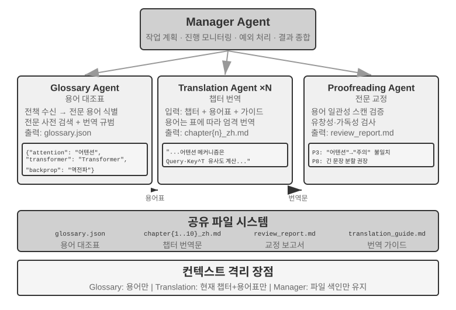
>

**병렬 조정 형태.**


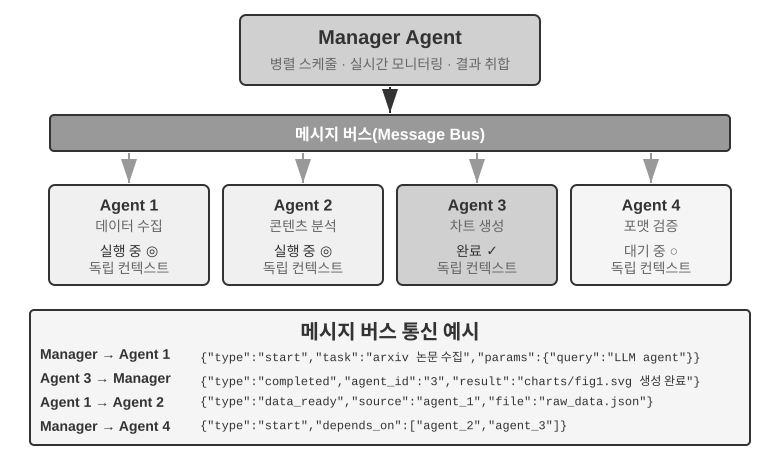


여러 하위 과제를 병렬로 실행할 수 있을 때 순차 패턴은 비효율적이다. 병렬 조정은 여러 에이전트를 동시에 일하게 해 처리량을 크게 끌어올린다. 관리자 에이전트는 병렬 작업을 계획할 뿐 아니라, 실행 중인 모든 에이전트를 실시간으로 모니터링하고, 통신 조정을 처리하며, 에이전트가 성공하거나 실패할 때 전역 결정을 내려야 한다. 이는 보통 **메시지 버스**(Message Bus)를 인프라로 필요로 한다. "공용 게시판"으로 이해하면 된다. 에이전트가 거기에 메시지를 올리고(게시), 관심 있는 메시지 유형을 구독하며, 비동기 통신으로 서로 차단하지 않는다. 흔한 구현 방안은 복잡도 순으로 두 부류이다. **레디스 펍/섭(Redis Pub/Sub)**은 가벼운 편이고, 메시지를 발행 즉시 수신하며 단순하고 쓰기 쉽지만, 영속화하지 않는다는 단점이 있다. 수신자가 그 순간 온라인이 아니면 메시지가 사라진다. **래빗엠큐(RabbitMQ)** 같은 메시지 큐는 메시지를 디스크에 보관해서 수신자가 잠시 오프라인이어도 잃지 않는다. 메시지 형식은 보통 발신자 ID, 목적지 에이전트(또는 전체 브로드캐스트), 메시지 유형, 그리고 JSON 형식 데이터 내용을 포함한다.

**링타이(Lingtai): 관리자 패턴의 제품화 사례.** 링타이는 로컬에서 실행되는, 파일 중심의 장기 에이전트 거처이다[^lingtai]. 세 가지 역할은 거의 이 절의 개념을 그대로 구현한 것이다. **주기령(main agent)**은 사용자와 대화하는 상주 중추로 계획과 기억을 관장하고, 일을 다른 역할로 파생시킨다. 바로 관리자 에이전트 자리다. **분신(daemon)**은 시끄럽고 경계가 진 한 가지 일을 위해 쪼개진 단기 병렬 노동자로, 완료하면 곧 버리고 결론만 주기령에게 가져온다. 이것이 바로 "하위 에이전트는 전체 궤적이 아니라 구조화 요약을 반환한다"와 병렬 조정 형태의 제품화다. **분신(avatar)**은 자신만의 기억, 우편함, 책임을 갖춘 영속적 전문화 팀원으로, 여러 세션에 걸쳐 보존할 만한 전문 분업에 쓰인다. 나머지 설계도 앞의 논의와 하나하나 대응된다. 지식(knowledge)은 각 에이전트(기령)에게 사유인 영속 기억 파일이고, 스킬(skill)은 모든 기령이 공유하는 마크다운 매뉴얼이다("에이전트 눈에는 파일 시스템이 어떻게 보이는가" 절의 시스템 내장 자원에 대응). 컨텍스트 창이 가득 찰 즈음이면 기령은 "능탈(molt)"을 한다. 자기 요약을 쓰고, 영속 기억을 챙겨 깨끗한 컨텍스트에서 일을 계속한다(2장의 컨텍스트 압축에 대응). 밑단 모델은 바꿀 수 있지만 기령은 그대로 남는다. 정체성, 기억, 능력은 모두 보통 파일 형태로 프로젝트 디렉터리에 들어 있다. "기령은 곧 그 파일"이라는 것이다. 표 10-3의 앞 두 행이 제품화된 셈이다. 프로그램과 메모리가 모두 파일에 떨어지고, 프로세스는 언제든 재구축할 수 있다.

[^lingtai]: 링타이 공식 튜토리얼: https://lingtai.ai/zh/tutorial/

> **실험 10-4 ★★★: 전화하면서 컴퓨터를 쓰는 에이전트**
>
> **선수 요구**: 이 실험은 9장의 컴퓨터 사용(Computer Use)과 음성 에이전트 기술을 종합해 쓴다. 9장의 관련 실험을 먼저 끝내기를 권한다.
>
> 현실에서는 많은 상황이 여러 능력을 한꺼번에 가동해야지 줄을 서서 하나씩 오는 것이 아니다. 인간 보조자는 전화로 고객과 소통하면서 동시에 컴퓨터에서 문서를 찾고 요점을 기록할 수 있다. 이런 "한 마음 여러 용도"는 단일 에이전트에게 매우 도전적이다. 한 에이전트가 실시간 음성 대화도 처리하고 컴퓨터 인터페이스도 조작하게 하면, 양쪽 작업 사이를 끊임없이 전환하느라 대화가 멈추거나 조작이 끊긴다. 멀티 에이전트 병렬 실행의 핵심 발상은 이것이다. **실시간성 요구가 높은 작업마다 서로 다른 에이전트가 집중하게 하고, 비동기 메시지 전달로 조정해 진짜 병렬 처리를 이룬다.** 두 에이전트는 또한 서로 다른 상호작용 양식에 맞춰 특화 최적화된다. 전화 에이전트는 저지연 음성 인식과 합성이 필요하고, 컴퓨터 에이전트는 강력한 시각 이해와 조작 계획 능력이 필요하다.
>
> **시나리오**: AI 에이전트가 사용자를 도와 복잡한 항공 예약 양식을 채운다. 웹 페이지를 조작하면서 동시에 전화로 사용자에게 개인 정보(이름, 증번, 항공 취향 등)를 물어 확인해야 한다. 양 끝이 모두 고실시간성을 요구해서, 단일 에이전트는 한쪽을 놓치고 듀얼 에이전트는 각자 본분을 다하는 전형적 사례다.
>
> **듀얼 에이전트 아키텍처**:
>
> **전화 에이전트(Phone Agent)**: ASR + LLM + TTS 기반의 음성 통화 에이전트다. 사용자의 자연어 답변을 이해하고 핵심 정보를 추출해 메시지 프레임으로 컴퓨터 에이전트에 보낸다. 동시에 컴퓨터 에이전트의 메시지(예: "사용자 증번 필요", "페이지 로드 에러")를 받아 이에 맞는 말투를 생성해 사용자에게 묻는다.
>
> **컴퓨터 에이전트(Computer Agent)**: 브라우저 조작 프레임워크(예: 앤스로픽 컴퓨터 사용, browser-use)를 기반으로 한다. 웹 페이지 구조를 이해하고 폼 필드를 식별하며, 받은 정보에 따라 작성을 실행하고, 문제가 생기면 전화 에이전트에게 도움을 요청한다.
>
> **통신 메커니즘**에는 두 방안이 있다.
> - **단순 방안**: 도구 호출 점대점 통신. 예: `send_message_to_computer_agent(message)` / `send_message_to_phone_agent(message)`
> - **완비 방안**: 메시지 버스 + 관리자 에이전트. 발신자, 수신자, 유형, 내용을 포함한 통일 메시지 형식.
>
> **병렬 협업 메커니즘**(이 장의 두 "전화 + 컴퓨터" 실험이 공유): 두 에이전트는 독립된 스레드나 프로세스에서 실행되며, 각자 독립적인 리액트(ReAct) 순환을 유지한다. 전화 에이전트의 순환: 음성 수신 -> ASR 전사 -> LLM 이해와 응답 생성 -> TTS 합성 -> 재생 -> 컴퓨터 에이전트의 메시지 확인. 컴퓨터 에이전트의 순환: 화면 캡처 -> 비전 LLM이 페이지 이해 -> 조작 계획 -> 실행(클릭, 입력 등) -> 전화 에이전트의 메시지 확인. 핵심은 양쪽이 진짜 병렬이어야 한다는 점이다. 컴퓨터 에이전트가 요소를 찾고 텍스트를 입력하는 동안 전화 에이전트는 온라인을 유지하며 사용자와 대화한다("네, 지금 이름을 작성 중입니다... 증번이 어떻게 되시죠?"). 이를 위해 각 에이전트의 입력에는 상대방이 보낸 표식 필드가 딸려 온다. 예를 들어 전화 에이전트의 컨텍스트에는 `[FROM_COMPUTER_AGENT] '다음' 버튼을 못 찾았습니다. 사용자 확인이 필요할 수 있습니다`가 나타나고, 컴퓨터 에이전트에는 `[FROM_PHONE_AGENT] 사용자가 이름은 '장산', 증번은 123456이라고 합니다`가 나타난다.
>
> **실험 요구**:
> 1. ASR/TTS API와 브라우저 조작 프레임워크에 기반해 듀얼 에이전트 아키텍처를 구현할 것
> 2. 효율적 양방향 통신 메커니즘을 구현할 것
> 3. 진짜 병렬 작업을 보장하고, 정보 수집과 폼 작성이 동시에 진행되게 할 것
> 4. 예외 상황을 처리할 것
>
> **실험 10-5 ★★★: 자율적으로 오케스트레이션하는 전화와 컴퓨터 에이전트**
>
> 실험 10-4의 듀얼 에이전트 협업 아키텍처는 미리 설계한 것이다. 이 실험은 한 걸음 더 나아가 **에이전트의 자율 오케스트레이션 능력**을 탐구한다. 인간이 협업 흐름을 미리 계획해 두는 것이 아니라, 에이전트 스스로 언제 새 협업 에이전트를 시작할지 판단한다.
>
> **시나리오**: 사용자가 "이 사이트에서 가입을 완료해 주세요"라고 요청하며 URL은 주되 어떤 정보를 적어야 할지는 말하지 않는다. 관리자 에이전트는 컴퓨터 사용 도구로 사이트에 접속해 가입 페이지를 로드한다.
>
> 조작 중 컴퓨터 사용 에이전트는 가입 폼이 매우 복잡하고 필수 입력 필드가 많다는 것을 발견한다. 개인 기본 정보(이름, 성별, 생년월일), 연락처(휴대폰 번호, 이메일, 주소), 신원 확인 정보(증류, 증번), 선호 설정 등이다. 에이전트는 컨텍스트를 점검한 뒤 이런 정보가 손에 없음을 알아챈다. 사용자는 "가입해 줘"라고만 했지 구체적 데이터는 아무것도 주지 않았다.
>
> 전통적 에이전트는 이럴 때 텍스트 메시지로 사용자가 입력하게 만든다. 비효율적(대량 정보를 수동 입력)이고 오류도 잦다(형식 문제, 정보 누락). 더 똑똑한 에이전트는 이렇게 깨달어야 한다. **이런 건 전화 상호작용으로 정보를 수집하기 적합한 상황이다.** 전화 대화는 텍스트 채팅보다 훨씬 효율적이어서 하나하나 물어 확인할 수 있고, 사용자의 모호한 표현도 처리할 수 있다.
>
> 핵심 혁신은 이 결정이 미리 프로그래밍된 게 아니라 **에이전트가 자율적으로 내렸다는 점**이다. 컴퓨터 사용 에이전트의 프롬프트에는 이렇게 적혀 있다. "사용자로부터 대량의 구조화된 정보를 수집해야 하고, 대화로 단계적으로 진행할 수 있을 때, 전화 에이전트를 보조 도구로 호출하는 것을 고려하라." 도구 집합에는 `initiate_phone_call_agent(purpose, required_info)`가 들어 있다.
>
> 호출 뒤 시스템은 전화 에이전트를 만들고 명확한 작업 컨텍스트를 부여한다. 폼 작성을 돕기 위해 시작되었고, 어떤 정보를 수집해야 하며, 각 필드의 형식 요구는 무엇인지.
>
> 두 에이전트는 곧 실시간 협업 모드에 들어가, 실험 10-4의 비동기 병렬 메커니즘을 그대로 쓴다. 전화 에이전트가 사용자에게 전화를 걸어 하나하나 묻는다. "안녕하세요, 가입 폼 작성을 도와드리고 있습니다. 먼저 이름이 어떻게 되시죠?" 사용자가 답하면 곧바로 `{"type": "info_collected", "field": "이름", "value": "장산"}`을 컴퓨터 에이전트에게 보내고, 후자는 곧 웹 페이지에서 "이름" 필드를 찾아 작성한다. 그와 동시에 전화 에이전트는 컴퓨터 조작이 끝나기를 기다리지 않고 다음 질문으로 넘어간다. 이런 **하나 물어, 하나 채우** 방식, 대화 흐름이 조작 지연에 막히지 않는 패턴이 이 실험의 핵심 요구다. 모든 정보 수집이 끝나면 전화 에이전트가 `{"type": "task_completed"}`를 보내고, 컴퓨터 에이전트가 폼을 제출한다.
>
> **실험 요구**:
> 1. 전화 에이전트 시작을 자율 결정하는 컴퓨터 사용 에이전트를 구현할 것
> 2. 실시간 양방향 통신과 진짜 병렬 작업을 구현할 것
> 3. 예외 처리(정보 형식이 올바르지 않으면 피드백해 다시 묻기)를 구현할 것
> 4. 협업 과정의 메시지 시계열과 에이전트 결정 핵심 포인트를 기록할 것
>
>
> 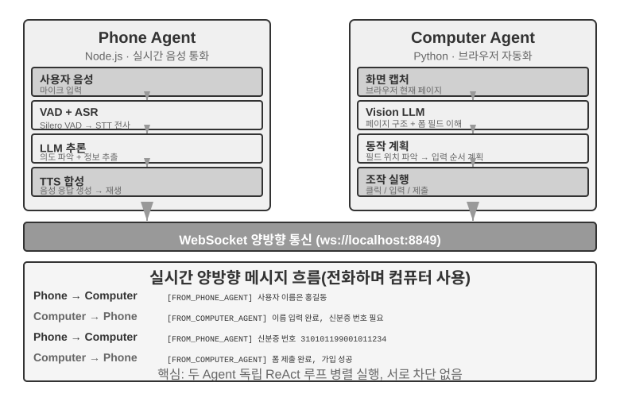
>
> **실험 10-6 ★★★: 동시에 여러 웹사이트에서 정보를 수집하는 에이전트**
>
> **선수 요구**: 4장의 이벤트 구동과 중단 메커니즘을 먼저 알아 두기를 권한다.
>
> 이 실험은 정보 수집 상황에서의 멀티 에이전트 병렬 실행 응용을 탐구한다. 실험 10-4와 실험 10-5가 두 이질적 에이전트의 협업에 주목한 것과 달리, 이 실험은 **여러 동질적 에이전트의 병렬 검색**과, 중앙 조정을 통한 효율적 작업 완수와 자원 최적화에 주목한다.
>
> **문제**: 한 대학의 여러 단과대학 웹사이트가 주어지고, 각 단과대학의 교수 명록 페이지에서 지정 교수(예: "장웨이")를 찾아 소속 단과대학, 직위, 연구 방향 등을 반환해야 한다.
>
> **핵심 도전**:
>
> **1. 병렬 시작**: 관리자 에이전트는 작업 요구에 따라 10개의 컴퓨터 사용 에이전트 인스턴스를 동적으로 생성하며, 각 인스턴스가 한 단과대학 웹사이트를 담당한다. 각 인스턴스는 독립된 프로세스나 스레드여야 하고, 독립된 브라우저 세션을 가져야 하며, 동시에 실행돼 서로 차단하지 않는다. 시작할 때 건네는 것: 목표 웹사이트 URL, 검색할 교수 이름, 작업 식별자(메시지 라우팅용).
>
> **2. 실시간 모니터링**: 각 에이전트는 실행 중 정기적으로 상태 갱신을 보낸다("사이트 로딩 중", "교수 명록 파싱 중", "대상 없음, 작업 완료", "매칭 발견, 상세 정보는 다음과 같음"). 관리자 에이전트는 메시지 버스로 이 갱신을 받아 작업 상태표를 유지하고, 어느 에이전트가 아직 실행 중이고 어느 것이 완료되었고 어느 것이 오류를 만났는지 실시간으로 파악한다.
>
> **3. 계단식 종료**: 컴퓨터 단과대학을 담당한 에이전트가 목표 교수를 찾았다고 치자. 이 에이전트는 `{"type": "target_found", "agent_id": "agent_3", "data": {...}}`를 보낸다. 관리자 에이전트는 곧 다른 모든 실행 중인 에이전트에게 `{"type": "terminate", "reason": "target_found_by_agent_3"}`를 보내고, 종료 메시지를 받은 각 에이전트는 정상적으로 멈추고 확인을 보낸다. 관리자 에이전트는 모든 확인(또는 타임아웃)을 기다렸다가 결과를 취합한다. 요구사항: 에이전트가 언제든 종료 시그널에 반응할 수 있어야 하고(4장의 중단 메커니즘과 유사), 종료는 반드시 정상적으로 이루어져야 한다. 매달려 있는 프로세스나 닫지 않은 자원을 남기지 않는다. 동시에 경쟁 조건(Race Condition)을 처리해야 한다.
>
> **개념 보충: 경쟁 조건이란?** 에이전트 A와 에이전트 B가 거의 같은 밀리초에 각자 목표 교수를 찾았다고 치자. 둘이 동시에 관리자 에이전트에게 "찾았다!"고 보고한다. 관리자 에이전트가 잘못 처리하면, 예를 들어 A의 보고를 받아 결과를 취합하기 시작했는데 바로 이어 B의 보고를 받아 두 번째 취합이 트리거되면, 중복 결과나 모순적 상태가 생길 수 있다. 해법은 보통 "잠금(lock)" 메커니즘이다. 첫 번째 보고가 도착하면 곧 상태를 잠그고, 이후의 보고는 중복으로 식별해 무시한다.
>
> **4. 실패 처리**: 실제 실행에서는 여러 이상이 생길 수 있다. 어떤 단과대학 사이트에 접근할 수 없거나(네트워크 오류, 서버 다운), 어떤 사이트 구조가 예상과 달라 에이전트가 제대로 파싱하지 못하거나, 모든 에이전트가 검색을 마쳐도 목표를 찾지 못할 수 있다. 관리자 에이전트의 처리 전략: 각 에이전트에 타임아웃(예: 2분)을 설정해 초과하면 실패로 간주한다. 오류 격리, 다른 에이전트의 계속 실행에 영향을 주지 않는다. 전부 마친 뒤 취합 — 하나라도 성공한 에이전트가 있으면 정보를 반환하고, 전부 실패하면 사용자에게 "목표 교수를 찾지 못했습니다"라고 보고하며 각 실패 원인의 통계를 제시한다.
>
> **실험 요구**:
> 1. 여러 병렬 에이전트를 동적으로 시작할 수 있는 관리자 에이전트를 구현할 것
> 2. browser-use 등의 오픈소스 프로젝트에 기반해 컴퓨터 사용 에이전트를 구현할 것
> 3. 관리자 에이전트와 여러 하위 에이전트 사이의 양방향 통신을 지원하는 메시지 버스를 구현할 것
> 4. 성공 뒤의 계단식 종료 메커니즘을 구현해, 목표를 찾은 뒤 다른 모든 에이전트가 빠르게 멈추게 할 것
> 5. 각종 예외(사이트 접속 실패, 파싱 오류, 전부 못 찾음)를 처리할 것
> 6. 병렬 실행과 직렬 실행의 시간 차이를 기록하고 비교해 병렬화의 성능 향상을 검증할 것
>
>
> 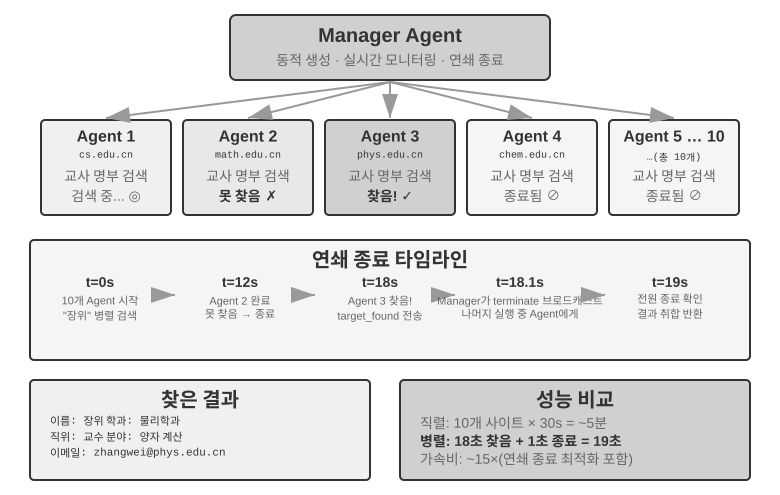
>

### 분산 패턴: 피어 인계


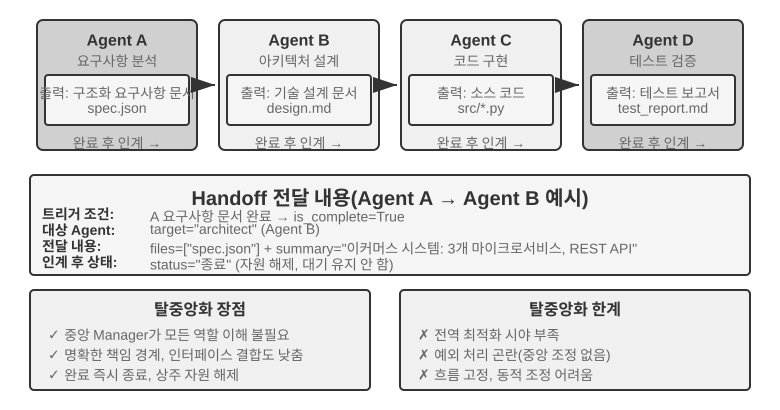


관리자 패턴은 명확한 제어 구조와 전역 시야를 제공한다. 분산 패턴은 그 결함을 보완하려 등장한 것이 아니다. 중앙 제어자를 제거하려는 동기는 주로 인류 사회의 조직 방식을 모방하려는 데 있다. 책임이 대등한 여러 역할이 분업하고 견제하며, 각자 자기 전문 관점에서 문제를 들여다보고 누구와 소통할지 자율적으로 결정하게 하는 것, 모든 판단을 한 관리자에게 모으는 것이 아니라. 마이크로서비스 영역에서는 이 선택 대립을 **오케스트레이션**(orchestration)과 **코레오그래피**(choreography)라 부른다. 전자는 지휘자가 통일적으로 스케줄링하고, 후자는 각 무용수가 스스로 입장 시기를 잡는다.

분산 패턴은 다른 아키텍처 사고를 제공한다. **단일 중앙 제어자가 없고, 에이전트들이 피어 관계로 협업한다.** 각 에이전트는 자기 전문 판단에 따라 언제 다른 에이전트에게 소통을 시작할지 자율적으로 결정한다. 작업을 인계하는 것일 수도("내 부분은 끝났어, 넘겨"), 피드백을 요청하는 것일 수도("이 방안이 기술적으로 가능한가?"), 문제를 보고하는 것일 수도 있다("네 요구사항이 모순돼, 다시 논의해야 해").

아래 세 사례는 의도적으로 "가짜에서 진짜로" 향하는 점진적 단서로 배치했다. 메타지피티(MetaGPT)의 제어 흐름은 사실 고정된 파이프라인(가짜 분산, 통신 메커니즘만 결합을 풀어 놓음)이고, 오토젠(AutoGen) 그룹 챗은 대화 기록 공유와 중앙화 스케줄링의 혼합 형태이며, 오픈에이아이 스웜(OpenAI Swarm)에 이르러서야 제어 흐름상 진짜 피어 분산에 도달한다.

**컨텍스트 비공유에서 인계는 무엇을 전달하는가?** 그림 10-10의 핸드오프 연쇄 패턴은 실험 10-2의 `transfer_to_agent`와 직접 대비를 이룬다. 후자는 컨텍스트를 공유하는 상태에서 인계하며, 새 역할이 전체 이력을 자동으로 상속해 아무 설계가 필요 없다. 전자는 컨텍스트를 공유하지 않는 상태에서 인계하며, 인계 측이 무엇을 전달할지 명시적으로 결정해야 한다. 실무에서 효과적인 "인계 패키지"는 보통 세 부분으로 구성된다. **작업 서술**(수신자가 무엇을 해야 하고, 인수 기준은 무엇인가), **확인된 사실과 제약**(사용자 선호, 업무 규칙, 이전 단계에서 확정된 결정), 그리고 **구조화 산출물의 참조**(파일 내용이 아니라 파일 경로, 수신자가 필요에 따라 읽음). 의도적으로 전달하지 않는 것이 전체 궤적이다. 인계 측의 시행착오 과정, 중간 사고, 실패한 시도는 수신자에게 대개 잡음이다. 이것이 두 종류 인계의 본질적 차이다. 컨텍스트를 공유하는 인계는 전체 이력을 보존해 정보 손실이 없지만 컨텍스트가 계속 부풀고, 컨텍스트 비공유 인계는 가공된 인계 패키지를 전달해 정보 손실이 있지만 각 에이전트가 깨끗하고 집중된 컨텍스트에서 일한다. 각 에이전트는 다른 에이전트의 "사고 과정"을 이해할 필요 없이, 인계 패키지와 산출물의 형식과 의미만 이해하면 된다. 이런 인터페이스 기반 협업은 소프트웨어 공학의 계약식 설계 원칙을 빌려 온 것이다.

**메타지피티(MetaGPT): SOP가 구동하는 소프트웨어 회사 모의(파이프라인에서 결합 통신으로의 과도 사례).**


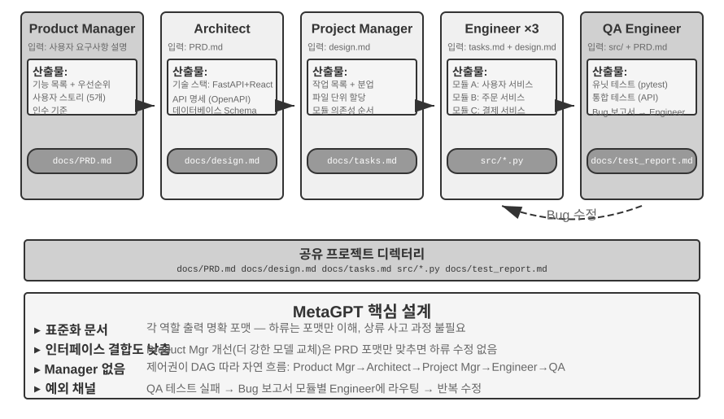


메타지피티의 핵심 통찰은 이것이다. 인류 소프트웨어 회사가 축적한 **표준 작업 절차**(SOP, Standard Operating Procedure) 자체가 이미 반복 검증된 협업 프로토콜이다. SOP를 멀티 에이전트 시스템에 인코딩해, 각 역할이 파이프라인의 전문 직종처럼 표준화 산출물을 생산하게 한다. 산출물이 자연스럽게 역할 간 통신 인터페이스를 이룬다.

메타지피티에서 각 역할은 고정된 순서로 일한다(제품 관리자 → 아키텍트 → 프로젝트 관리자 → 엔지니어 → QA). 각 역할은 구조화 산출물을 출력한다.

- **제품 관리자 에이전트**: 요구사항 서술을 받아 구조화 PRD(제품 요구사항 문서, 기능 목록, 사용자 스토리, 인수 기준, 우선순위 정렬을 포함)를 생성한다.
- **아키텍트 에이전트**: PRD를 읽고 아키텍처 결정(기술 스택 선택, 모듈 분할, 인터페이스 정의, 데이터 모델 설계)을 내려 설계 문서를 산출한다.
- **프로젝트 관리자 에이전트**: 아키텍처 설계를 읽고 시스템을 구체적 작업 목록과 파일 수준 분업으로 분해하며, 각 모듈의 의존 순서를 정리한 뒤 엔지니어에게 작업을 배분한다.
- **엔지니어 에이전트들**: 설계 문서를 읽고 담당 모듈을 구현해 코드를 산출한다. 다중 인스턴스가 병렬로 일할 수 있다.
- **QA 엔지니어 에이전트**: 코드와 PRD를 읽고 테스트 케이스를 생성, 테스트를 실행하고 버그를 기록해 테스트 보고서를 산출한다.

메타지피티가 분산 통신에 대해 정말로 기여한 부분은 정보 전달 메커니즘, 곧 **공유 메시지 풀 + 역할별 구독**이다. 각 역할은 구조화 메시지를 모든 역할이 볼 수 있는 메시지 풀에 게시하고, 다른 역할은 자기 구독 설정에 따라 자기 책임과 관련된 메시지만 꺼내 쓴다. 점대점으로 일대일 전하는 것이 아니라. 게시자는 누가 자기 출력을 소비할지 알 필요 없고, 새 역할을 추가할 때는 어떤 메시지 유형을 구독할지만 선언하면 기존 역할은 손대지 않아도 된다. 이것이 진짜 결합 해제를 가져온다. 예를 들어 제품 관리자를 더 강한 모델로 바꿔도, 게시하는 PRD가 여전히 규범에 맞기만 하면 다른 모든 에이전트는 수정할 필요가 없다.

메타지피티의 반복 개선은 주로 엔지니어 단계에서 일어나며, 메커니즘은 **실행 가능한 피드백**(executable feedback)이다. 엔지니어가 자기가 짠 코드와 테스트를 실행하고, 오류와 실패 결과에 따라 디버깅 순환에 들어가 통과할 때까지 한다. 다른 에이전트의 의견이 아니라 결정론적 실행 결과로 수정을 구동하는 것이다.

솔직히 말하면, 메타지피티는 **제어 흐름** 면에서 분산이 아니다. 역할 순서가 SOP로 미리 고정돼 있고, 전체가 파이프라인에 가깝다(1장의 언어로 말하면 워크플로). 이 절에서 다루는 이유는, 메시지 풀 더하기 구독이라는 통신 메커니즘이 분산 시스템의 가장 결정적 설계 요소인 결합 해제를 보여 주기 때문이다. "QA가 제품 관리자에게 직접 요구사항을 명확히 하러 간다", "엔지니어가 아키텍트에게 대안을 논의한다" 같은 다방향 동적 피드백은 이 아키텍처에 대한 자연스러운 확장 구상이며, 원판 메타지피티는 구현하지 않았다.

**오토젠 그룹 챗(AutoGen group chat): 대화 기록 공유 + 중앙화 스케줄링.** 오토젠의 그룹 챗은 여러 에이전트가 같은 세션에 참여하게 한다. 매 라운드마다 "발언자 선택기"가 다음에 발언할 에이전트를 결정한다. 선택기는 단순한 교대 규칙일 수도 있고, 현재 대화 내용에 따라 누가 이어받기 가장 적합한지 판단하는 LLM일 수도 있다. 어느 에이전트의 발언이든 모든 참여자에게 보인다. 솔직히 말하면, 이것은 제어 흐름 의미에서 완전히 분산인 시스템이 아니다. 발언자 선택은 중앙화된 GroupChatManager가 통일적으로 결정하며, "누구 차례인가" 자체가 제어 흐름 결정이다. 그러므로 더 정확한 위치는 **"대화 기록 공유 + 중앙화 스케줄링"의 혼합 형태**다. 모든 에이전트는 같은 공개 대화 기록을 보지만 각자 독립된 시스템 프롬프트와 도구 집합을 유지하고, 스케줄링 권한은 선택기에 집중된다. 이 패턴은 다관점 토론, 발언 순서를 미리 고정하기 어려운 작업(예: 방안 심사, 크로스 도메인 분석)에 맞다. 대가로, 대화가 발산할 수 있다. 모두가 발언하는데 전체는 나아가지 않는, 동시성 영역의 라이브록(livelock)이다. 그러므로 종료 조건을 정교하게 설계해야 한다. 이 장의 차원 분류를 따르면, 여기서는 그 스케줄링 메커니즘(중앙화 선택기)을 기준으로 이 절에 넣었지만, 컨텍스트 차원에서는 사실 공유와 비공유 사이의 혼합 형태다. 이는 토폴로지와 컨텍스트 공유가 개념적으로 독립이며, 어긋나게 조합할 수 있는 두 차원임을 다시 보여 준다.

**오픈에이아이 스웜과 에이전트 SDK(OpenAI Swarm and Agents SDK): 핸드오프 네트워크.** 이에 비해 제어 흐름상 진짜 피어 분산을 이룬 대표 사례는 오픈에이아이의 스웜(및 후속 에이전트 SDK)이다. 분산을 가장 단순한 형태로 만들었다. 각 에이전트에게 몇 가지 핸드오프(인계) 선택지를 달아, 어느 순간이든 네트워크 안의 다른 에이전트에게 제어권을 넘길 수 있게 한다. 고객 응대 분류 에이전트가 문제가 환불과 관련 있다고 판단하면 환불 에이전트로 넘기고, 환불 에이전트가 처리 중 기술적 장애임을 발견하면 다시 기술 지원 에이전트로 넘길 수 있다. 시스템에 중앙 스케줄러가 없고, 제어권은 릴레이 바톤처럼 대등한 에이전트 사이를 흘러가며, 라우팅 결정은 전적으로 각 에이전트 자신의 판단에 분산돼 있다. 이것이 깔끔한 "피어 인계"이며, 그림 10-10의 연쇄 인계 패턴의 공학적 구현이다. 피어 인계의 위험은 고리 형성이다. A가 B에게 넘기고 B가 다시 A에게 넘기면 작업이 고리 속에서 빙빙 도는 식이다. 그러므로 인계 횟수 상한 같은 보호 메커니즘이 필요하다.

### 조직 간 협업: A2A 프로토콜

위의 시스템들은 모두 모든 에이전트가 같은 팀이 개발하고 같은 시스템에서 실행된다고 가정한다. 이때는 매개변수 전달, 공유 파일, 메시지 버스라는 세 가지 통신 메커니즘으로 충분하다. 하지만 협업이 조직 경계를 넘을 때, 즉 당신의 에이전트가 다른 회사의 에이전트를 호출해야 할 때는 표준화된 상호운용 프로토콜이 필요하다. 이 단계 역시 프로세스 세계는 이미 거쳤다. IPC는 단일 기기 안만을 다룬다. 기기 경계를 넘어서면 TCP/IP 같은 표준 프로토콜과 DNS 같은 서비스 발견이 필요하다. A2A가 에이전트에게 하는 일은, 네트워크 프로토콜이 프로세스에게 한 일과 같다. 2025년 구글이 발표한 **A2A**(Agent2Agent) 프로토콜이 이를 위해 설계됐다(이후 리눅스 재단에 기증되어 호스팅된다). 핵심 요소는 셋이다.

- **에이전트 카드(Agent Card)**: 에이전트 능력을 서술하는 메타데이터 문서(합의된 공개 주소에 게시)로, 이 에이전트가 무엇을 할 수 있고, 어떤 입출력 양식을 지원하며, 어떻게 인증하는지를 선언한다. 에이전트의 "명함"에 해당하며, 조직 간 능력 발견 문제를 해결한다.
- **작업 수명 주기 관리**: A2A는 협업 단위를 작업(Task)으로 모델링하며, 명확한 상태기계(제출됨, 진행 중, 입력 필요, 완료, 실패)를 달고, 장기 실행 작업과 스트리밍 진행 갱신을 네이티브로 지원한다.
- **불투명 협업**: 에이전트 사이에는 작업과 산출물(Artifact)만 교환하고, 내부 프롬프트, 사고 과정, 도구 구현은 드러내지 않는다. 이는 이 장의 "컨텍스트 비공유" 원칙과 일치하며, 조직 간 협업에서 필요한 보안 속성이다.

A2A의 위치는 4장의 MCP와 대비해 이해할 수 있다. MCP가 풀고자 하는 것은 에이전트와 도구 사이의 상호운용이고, A2A가 풀고자 하는 것은 에이전트와 에이전트 사이의 상호운용이다. A2A는 이 장에서 소개한 세 가지 통신 메커니즘을 대체하는 게 아니라, 그 위에, 신뢰 경계를 넘는 표준화 층이다. 같은 팀 내부의 멀티 에이전트 시스템은 메시지 버스를 직접 쓰면 되고, 협업 당사자가 서로 신뢰하지 않고 구현을 서로 볼 수 없을 때만 A2A 같은 공개 프로토콜이 필요하다.

## 멀티 에이전트 협업의 실패 모드

멀티 에이전트 시스템은 협업 능력을 도입함과 동시에, 단일 에이전트에는 없는 새로운 유형의 실패 모드를 도입한다. 2025년의 논문 《Why Do Multi-Agent LLM Systems Fail?》(MAST 실패 모드 분류법 제안)가 이를 체계적으로 연구했다. 연구자는 메타지피티, 챗데브(ChatDev), AG2, 매제틱원(Magentic-One) 등 7개 주류 멀티 에이전트 프레임워크에서 실행 궤적을 수집하고, 인공 주석자가 약 150개 궤적을 한 줄씩 분석했다(주석 일치도가 매우 높아 코헨의 카파(Cohen's kappa) = 0.88, 서로 다른 주석자의 실패 모드 판단이 높은 일치를 보임). 최종적으로 **14개의 독특한 실패 모드**를 세 부류로 정리했다.

- **시스템 설계 결함**: 에이전트 사이의 인터페이스 정의 불명확, 역할 책임 중복, 도구 설정 오류 등 아키텍처 층의 문제.
- **에이전트 간 정렬 실패**: 여러 에이전트의 작업 목표 이해가 일치하지 않거나, 전달된 정보가 하류 에이전트에게 오해되거나, 여러 에이전트의 조작이 논리적으로 서로 모순되는 것.
- **작업 검증 부재**: 작업이 진짜 완료되었는지 확인할 효과적 메커니즘이 시스템에 없는 것. 에이전트는 "완료"라고 주장하지만 실제 결과는 요구에 맞지 않는다.

단순한 수정 조치를 도입해도 개선 폅은 매우 제한적이다(예: 챗데브 프레임워크는 15.6%만 향상). 그래서 연구자는 이것이 단순한 엔지니어링 버그가 아니라 현재 멀티 에이전트 아키텍처의 **근본적 설계 결함**이라고 본다. 어느 한 환절을 땜질해서는 해결되지 않으며, 시스템 설계 층면에서 다시 생각해야 한다.

분산 내결함성 이론은 장애를 두 부류로 나눈다. **크래시 장애**(부품이 작동을 멈춤)와 **비잔틴 장애**(부품은 작동을 멈추지 않지만 잘못된 정보를 줌). 전통 시스템은 대부분 크래시만 막으면 된다. 반면 에이전트의 장애는 본디 비잔틴식이다. 에이전트가 직접 실행을 멈추는 일은 드물고, 계속 그럴듯해 보이는 잘못된 결론을 내놓으며, 오류가 스스로 자신을 오류라고 선언하지도 않는다. 이것이 왜 한 환절을 고쳐도 효과가 적은지를 설명해 준다. 어느 환절도 능동적으로 문제를 드러내지 않으므로, 독립적 중복으로만 발견할 수 있다. 이 장 뒤에 반복해 등장하는 교차 검증, 다수결 투표가 바로 비잔틴 내결함성의 고전적 수단이다. 결정론적 외부 피드백(테스트, 컴파일러, 데이터베이스 질의)이 소중한 이유는, 시스템 안에서 유일하게 거짓말을 하지 않는 부품이기 때문이다.

아래에서는 실무에서 특히 흔하고 파괴력이 큰 두 실패 모드를 중점 논의한다. (1) 공유 파일 시스템의 동시성 충돌, (2) 오류의 연쇄 확대. 분명히 해 둘 것은, 이 두 실패 모드는 엔지니어링 관점(파일 시스템 동시성, 오류 정보의 에이전트 간 전파)에 치우쳐 있으며, MAST가 대화형 협업 실패에 치중한 분류를 보충하는 것이지 그 14개 모드를 반복하는 것이 아니다.

### 실패 모드 1: 공유 파일 시스템의 동시성 충돌

공유 메모리식 통신을 선택하면 동시성 충돌이 따라온다. 이는 운영체제와 데이터베이스가 수십 년 전에 이미 해결한 문제이며, 답은 내장돼 있다. 충돌은 두 부류로 나뉜다.

**단순 충돌(파일 수준의 쓰기 충돌)**: 두 에이전트가 동시에 같은 파일을 수정하면, 뒤에 쓰는 쪽이 먼저 쓴 쪽의 수정을 덮어쓴다. 이는 데이터베이스 영역의 고전적 **갱신 손실**(lost update) 문제이며, Git의 병합 충돌 감지 메커니즘이 정확히 이런 덮어쓰기를 차단하려고 설계된 것이다.

**의미 충돌(논리 수준의 일관성 충돌)**: 파일 층면에서는 어떤 충돌도 보이지 않지만, 여러 에이전트의 조작이 논리적으로 서로 모순되는 것이다. 더 은밀하고 더 위험하다. 예를 든다. 에이전트 A는 책 전체의 그림 번호를 다시 매기는 일을 맡고, 에이전트 B는 동시에 어떤 장의 내용을 수정하며 원래 번호의 그림을 인용한다. 둘은 서로 다른 파일을 조작하므로 파일 층면에는 충돌이 전혀 없다. 하지만 결과적으로 B가 인용한 그림 번호는 A의 재편이 끝난 뒤 모두 무효가 되고, 독자가 보는 것은 잘못된 그림 인용이다.

**해결책: 낙관적 잠금(Optimistic Locking) 메커니즘**. 이것은 데이터베이스 영역에서 흔히 쓰는 동시성 제어 전략이다. 이해를 위해 먼저 일상적 장면을 하나 떠올려 보자. 당신과 동료가 같은 온라인 문서를 동시에 열었다. "비관적 잠금"은 당신이 문서를 여는 순간 잠가 버리는 것이다. 동료가 편집하려 하면 "파일이 잠겨 있습니다"를 본다. 안전하지만 비효율적이다. 어쩌면 당신은 그저 보기만 할 뿐 고칠 생각이 없을 수도 있기 때문이다. "낙관적 잠금"은 더 똑똑하다. 모두 자유롭게 열고 편집할 수 있되, 저장할 때 시스템이 검사한다. "당신이 문서를 연 뒤 누군가 고친 적이 있나?" 있으면 "파일이 수정되었습니다. 새로 고침 후 다시 시도하라"고 알려 준다.

구체적 구현은 이렇다. 파일마다 버전 번호(또는 마지막 수정 타임스탬프)를 유지한다. 에이전트가 파일을 읽을 때 현재 버전 번호를 기록하고, 쓸 때 버전 번호가 읽을 때와 여전히 같은지 검사한다. 그 사이에 다른 에이전트가 파일을 수정했다면 쓰기는 실패하고, 에이전트는 최신 버전을 다시 읽어 그 위에서 조작을 다시 실행해야 한다. 이 메커니즘의 대가는 가끔 재시도해야 한다는 것이지만, 데이터 일관성 보장과 교환한다. 에이전트가 결코 시대에 뒤진 파일 상태에 기반해 결정을 내리지 않는다.

주의할 점은, 낙관적 잠금은 **같은 파일**의 쓰기 충돌만 막는다. 앞의 **크로스 파일 의미 충돌**(예: 그림 번호가 여러 곳에서 인용되는 문제)에는 더 높은 층의 의미 검증 메커니즘이 필요하다. 예를 들어 작업 오케스트레이션 층에서 의존 관계가 있는 파일이 병렬 수정되지 않게 하거나, 쓰기 뒤에 전역 일관성 검사를 실행하는 식이다.

예: 에이전트 A는 t=0에 `config.json`(version=3)을 읽고, 에이전트 B는 t=1에 같은 파일을 수정해(version이 4로), 에이전트 A는 t=2에 쓰기를 시도할 때 버전이 3이 아님을 발견해 쓰기가 거부된다. 에이전트 A는 이어서 version=4인 내용을 다시 읽고, 최신 버전에 기반해 수정을 다시 생성해 다시 쓰기를 시도한다.

한 가지 더, 여러 코딩 에이전트가 동시에 같은 코드베이스를 수정하는 이 가장 흔한 상황에서 업계의 주류 방식은 단일 작업 복사본에 잠금을 거는 것이 아니라 **작업 복사본 격리**다. 각 에이전트에게 독립된 Git 브랜치나 worktree를 할당해, 각자 자기 복사본에서 병렬로 수정하고 서로 간섭하지 않게 한다. 충돌은 마지막 병합 시점으로 미뤄지고, 그 다음 전담 병합 단계나 인간이 해결한다. 운영체제가 프로세스를 fork할 때의 쓰기 시 복사(copy-on-write)와 같은 생각이다. 이는 2장의 "압축보다 격리"와도 같은 뿌리다. 2장은 하위 에이전트의 컨텍스트 격리를 논하며, 여러 측이 같은 상태를 공유하고 나서 충돌을 어떻게 해소할지 고민하기보다 애초에 격리하고, 조정 비용을 명확한 경계에서 처리하는 편이 낫다고 지적했다.

### 실패 모드 2: 오류의 연쇄 확대

동시성 충돌은 파일 층면의 문제라 운영체제의 경험으로 대처할 수 있다. 오류의 연쇄 확대는 프로세스 비유가 효력을 잃는 지점에서 발생한다. 프로세스 사이는 바이트를 주고받아 비트 단위로 충실하고, 에이전트 사이는 의미를 주고받아 매 번 전달이 손실 있는 재인코딩이다. 여러 에이전트가 빈번하게 상호작용할 때, 한 에이전트의 오류가 뒤따르는 에이전트에게 겹겹이 강화될 수 있다. "전화 게임"에서 정보가 전해질수록 빗나가는 것과 같다.

구체적 사례 하나로 설명하자. 한 번역 시스템이 관리자 패턴(실험 10-3의 아키텍처)을 쓴다고 치자. 관리자가 기술 서적 한 권을 여러 번역 에이전트에게 장별로 배분한다.

```
용어 에이전트: "reasoning"을 "추론"으로 번역. 그런데 "추론"은 중국어에서 inference에 더 자주 쓰여 모호함이 있다
        ↓ glossary.json에 기록
번역 에이전트 A: 2장 번역, 용어집에서 읽어 와 "reasoning tokens"을 "추론 토큰"으로 번역
번역 에이전트 B: 7장 번역, "inference latency" 역시 "추론 지연"으로 번역
        ↓ 각 장 번역문에 기록
교정 에이전트: 책 전체가 "추론"으로 통일되어 있음을 보고 용어가 일관되고 번역이 올바르다고 판단 (오류)
```

문제는 어디에 있는가? "reasoning"(모델의 사고 과정)과 "inference"(모델의 순방향 추론/배포 실행)는 두 가지 다른 개념이다. 그런데 용어 에이전트가 처음에 reasoning을 "추론"으로 번역한 탓에, 뒤따르는 에이전트는 inference를 만났을 때 자연스럽게 같은 단어를 선택했다. 두 다른 개념이 같은 역어로 합쳐졌고, 독자는 구분할 수 없게 된다. 올바른 방법은 reasoning을 "사고"로, inference를 "추론"으로 번역하는 것이다. 그런데 교정 에이전트는 책 전체가 "통일"되어 "추론"을 쓰는 것을 보고 오히려 번역 품질이 높다고 판단한다.

하나의 용어 오류가 세 에이전트를 거쳐 전달된 뒤, "일관성" 때문에 더 높은 신뢰도를 얻었다. 이것이 바로 이 책이 reasoning=사고, inference=추론이라는 번역 약속(서론에서 밝힌 바 있음)을 택한 이유이기도 하다. 서로 다른 한국어 단어로 모호함을 없애기 위해서다. 강조해 두건대, 여기서의 "오류"는 반드시 환각은 아니다. 앞의 사례의 원천은 사실 한 번의 용어 결정 실수이지만, 똑같이 "일관성"에 의해 겹겡이 확대된다. 만약 원천이 진짜 환년이라면(예: 실험 10-3의 번역 에이전트가 주의가 흩어져 실재하지 않는 용어 규칙을 "기억해" 내는 경우), 확대 메커니즘은 완전히 동일하며 결과는 더 심각할 것이다. 이 오류 확대 사슬은 관리자 패턴에서 특히 위험하다. 관리자가 어느 하위 에이전트의 잘못된 요약에 기반해 스케줄링 결정을 내리면, 뒤따르는 모든 하위 에이전트의 작업이 잘못된 전제 위에 설 수 있다.

**교차 검증**이 이 사슬을 끊는 핵심 수단이다. 핵심은 같은 사고 사슬에 더 많은 에이전트를 참여시키는 것이 아니라, 어떤 에이전트가 **독립적 시각**으로 결론을 다시 살피는 것이다. 앞선 에이전트의 사고 과정을 보지 않고, 원본 증거와 최종 결론이 일치하는지만 본다. 이는 5장에서 논의한 제안자-검토자 메커니즘이 멀티 에이전트 상황으로 확장된 것이다. 검토자의 가치는 코드 오류나 형식 문제를 발견하는 것에만 있지 않다. 독립적 판단자로서, 사고 사슬 전체가 집단적으로 간과한 모순을 식별할 수 있다는 데 더 있다. 고위험 결정에는 외부 검증 수단을 도입할 수 있다. 예를 들어 단위 테스트, 컴파일러, 데이터베이스 질의 같은 결정론적 도구가 주는 피드백은 환각의 영향을 받지 않아 가장 신뢰할 수 있는 "사슬 끊기" 장치다.

조기 종료에는 대칭적 반대편이 있다. **순환 통제 불능**이다. 앞의 "피어 협업" 절이 "순환해야 하는데 안 돌았을 때" — 에이전트가 일을 절반 남겨 두고 멈추는 것 — 를 다뤘다면, 여기서는 "순환이 쉬지 않고 도는데 돌수록 나빠지는 경우"도 막아야 한다. 업계는 루프 공학 실무에서 세 가지 전형적 실패 모드를 정리했다. 첫째, **토큰 비용 통제 불능**. 순환이 감시 없이 몇 시간을 돌며 막대한 예산을 태우고 아무도 요구하지 않은 코드를 잔뜩 쏟아 낸다. 둘째, **이해 부채**(comprehension debt). 순환이 코드를 빠르게 납품할수록 엔지니어의 시스템 실제 구현에 대한 이해는 더 뒤쳐진다. 마침내 인간이 개입해야 할 때가 오면 자기 시스템을 이해하지 못한다. 셋째, **인지 항복**(cognitive surrender). 설계자가 순환의 대리에 익숙해져 점차 독립적 사고와 심사를 포기하고, 품질이 나선형으로 하락한다. 셋 모두의 해독제는 오류 확대 사슬을 끊는 것과 한 맥락이다. 명시적 예산과 종료 조건, 진실 관측에 뿌리내린 검증자, 그리고 인간이 줄곧 "순환의 엔지니어"이지 "시작 버튼만 누르는 사람"이 아닌 역할을 유지하는 것.

지금까지의 논의는 모두 엔지니어링 관점이다. 어떻게 한 무리의 에이전트가 협업해 작업을 완수할 것인가. 이제 관점을 바꿔 본다. 다수의 에이전트가 장기 공존하고 더 이상 단일 목표에 의해 구동되지 않을 때 무엇이 창발할까? 이 절은 최전선 탐구에 해당하며, 엔지니어링 독자는 선택적으로 읽어도 된다.

## 에이전트 사회

앞의 세 절이 논한 것은 모두 목표가 명확한 작업 협업이다. 피어 협업이든, 관리자 패턴이든, 분산 패턴이든, 개발자가 역할, 인터페이스, 제어 흐름을 미리 정의해 둔다. 이제 관점을 더 열린 문제로 돌려 보자. **에이전트 수가 몇 개에서 수백 수천으로 확장되고, 상호작용이 충분히 자유로워지면 무슨 행동이 창발할까?** 이 부분은 최전선 탐구와 학술 연구에 치우쳐 있어 앞의 엔지니어링 지침과는 다른 성격을 띤다.

창발 행동(Emergent Behavior)이란 시스템 전체가 보여 주는, 단일 개체의 행동 규칙에서 직접 예측할 수 없는 집단 행동 패턴을 말한다. 자연계에서 가장 고전적인 예는 **개미 군집**이다. 개미 한 마리는 단순한 규칙만 따른다(페로몬을 맡으면 따라가고, 먹이를 찾으면 페로몬을 남긴다). 그런데도 전체 군집은 둥지에서 먹이까지의 최단 경로를 찾아낸다. 어느 개미도 이 경로를 "설계"하지 않았다. 이는 다수 개체의 단순한 상호작용에서 자연스럽게 생겨난다.

AI 에이전트 수가 충분히 많고 상호작용이 충분히 자유로워지면, 비슷한 창발 행동이 나타나기 시작한다. 연구자는 여러 환경에서 이미 관찰했다. 에이전트 시스템이 규모의 임계점을 넘어서면, 미리 설계할 수 없는 집단 행동이 생겨난다. 작게는 자발적으로 조직된 한 번의 모임, 크게는 수천 수만의 에이전트에서야 드러나는 집단 문화와 경제 게임까지(아래 절에서 나누어 자세히).

이 절의 사례는 세 차원으로 이해할 수 있다.

- **사회적 창발**: 에이전트가 열린 환경에서 자발적으로 사회 관계와 문화 현상을 형성한다. 스탠퍼드 AI 타운은 25개 에이전트가 어떻게 사회 활동을 자가 조직하는지 보여 주고, 에이전토피아(Agentopia)는 모의 시간 스케일을 "며칠"에서 10년으로 늘리며, 몰트북(Moltbook)은 규모를 150만까지 밀어붙여 더 복잡한 집단 행동을 창발시킨다.
- **경제적 창발**: 에이전트가 시장 메커니즘으로 자원 배분과 작업 조정을 수행한다. 벤딩벤치 아레나(Vending-Bench Arena)는 여러 에이전트를 같은 시장에 넣고 경쟁 경영하게 하며, 핀치워크(Pinchwork)와 렌트어휴먼(RentAHuman)은 에이전트 사이(그리고 에이전트와 인간 사이)의 경제 거래 시장을 구축한다.
- **전략 게임**: 에이전트가 규칙 제약 아래 추론, 기만, 사회적 조종을 수행한다(여기 및 아래 마피아 게임 부분의 "추론"은 일상어의 연역적 의미로, 추론 게임에서의 논리 게임을 가리키며, 이 책이 reasoning=사고로 쓰는 기술적 의미가 아니다). 마피아 게임 실험이 시험하는 것은 정보 비대칭 조건에서의 전략 창발이다.

### 스탠퍼드 AI 타운: 생성형 에이전트의 사회 모의


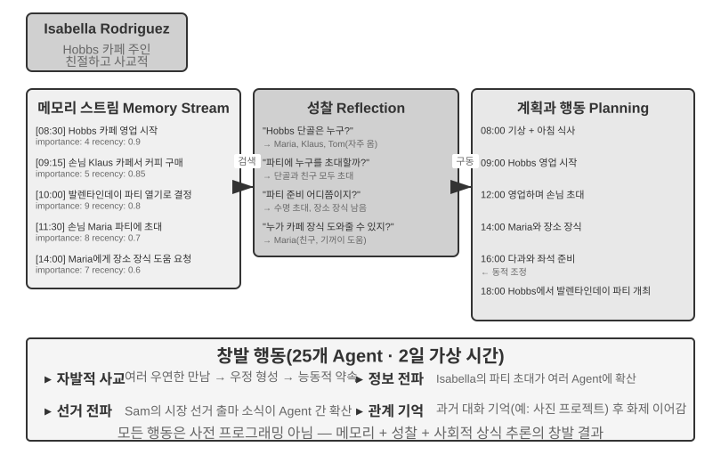


2023년, 스탠퍼드 대학과 구글 연구팀이 이정표적 논문 《Generative Agents: Interactive Simulacra of Human Behavior》를 발표하며 "생성형 에이전트" 개념을 제시했다. 핵심 혁신은 에이전트를 미리 정의된 작업을 완수하는 데 그치지 않게 하고, 인간에 가까운 기억, 반성, 계획 능력을 부여해 열린 사회 환경에서 자율적으로 살고, 사회화하고, 발전하게 한 것이다.

스몰빌(Smallville)은 《심즈(The Sims)》와 비슷한 2D 가상 마을이다. 카페, 공원, 주택, 상점 등 공공과 사유 공간이 있다. 25개의 에이전트가 각기 다른 역할(가게 주인, 예술가, 학생, 교수 등)을 맡으며, 각자 고유한 배경 이야기, 성격, 인간관계를 갖는다. 예를 들어 존 린(John Lin)은 약국 주인으로 가족을 사랑하고 지역사회에 관심이 많다. 이사벨라 로드리게스(Isabella Rodriguez)는 마을 카페인 홉스 카페(Hobbs Cafe)를 운영하며 호감이 넘친다. 클라우스 뮐러(Klaus Mueller)는 연구 논문을 쓰고 있는 대학생이다.

이 에이전트들의 지능은 세 가지 핵심 구성 요소에 기반을 둔다.

**기억 스트림(Memory Stream)**: 전통적 에이전트가 제한된 대화 이력만 보존하는 것과 달리, 생성형 에이전트는 완전한 경험 기록 스트림을 유지한다. 관찰한 사건, 진행한 대화, 떠올린 생각을 담는다. 각 기억에는 중요성, 최근성, 관련성 속성이 부여되며, 에이전트는 현재 상황과 가장 관련 있는 기억을 우선 검색할 수 있다. 인간이 모든 일을 똑같이 기억하지 않는 것과 같다. 어제 점심에 뭘 먹었는지는 잊었을지 몰라도, 지난주의 중요한 대화는 생생하다.

**반성 메커니즘(Reflection)**: 에이전트는 정기적으로 일상 활동을 멈추고 최근 경험을 되돌아보며, 자신과 타인에 대한 추상적 질문을 던진다("클라우스 뮐러는 무엇을 연구하는가?", "내 가장 친한 친구는 누구인가?"). 이런 자기 추궁을 통해 에이전트는 구체적 사건 기억을 개괄적 인식으로 승화시켜 다시 기억 스트림에 저장하고, 이것이 향후 결정의 근거가 된다. 반성은 에이전트가 외부 세계를 이해하게 할 뿐 아니라 자기 인식도 촉진한다. 에이전트는 점차 자신의 역할, 관계, 목표를 "자각"하기 시작한다.

분명히 해 둘 것은, 여기서의 반성은 8장의 에이전트 자기 진화에서의 반성과 다르다. 8장의 반성은 **작업 종료 후**에 일어나며, 장기 능력을 갱신이 목적이다. 여기서의 반성은 **생성형 에이전트의 일상 활동 중**에 일어나며, 즉각적 내부 상태와 목표의 갱신이 목적이다.

**계획과 반응(Planning and Reacting)**: 에이전트는 매일 활동을 계획한다(예: "8:30 아침 식사, 9:00-12:00 글쓰기, 12:30 산책"). 그러나 환경 변화와 사회적 기회에 따라 유연하게 조정한다. 계획과 즉각적 반응의 결합은 에이전트의 행동이 목표 지향성을 갖추면서도 사회 속의 온갖 예측 불가능성에 적응하게 한다.

스몰빌에서 실행된 이틀의 가상 시간 동안 이 에이전트들은 놀라운 **창발 행동**을 보였다. 연구자가 한 일이라고는 이사벨라 로드리게스의 기억에 씨앗 생각 하나를 심은 것뿐이다. 2월 14일 저녁에 홉스 카페에서 발렌타인데이 파티를 열고 싶다는 생각. 그 뒤에 일어난 일은 모두 에이전트가 자율적으로 행동한 결과다. 이사벨라는 카페에서 손님과 친구를 만나면 능동적으로 초대를 보냈고, 친구 마리아에게 장소를 함께 꾸며 달라고 부탁했다. 소식을 들은 에이전트가 또 다른 에이전트에게 파티 정보를 알려 주어, 정보가 이차 전파를 타고 마을에 퍼졌다. 약속 시간이 되자 여러 에이전트가 각자 자기 기억과 일정에 기반해 자율적으로 홉스 카페에 향했다.

연구자는 또 다른 실험 줄을 심어 넣었다. 샘 무어(Sam Moore)가 시장 선거에 출마하기로 한 것. 이 소식도 중앙 스케줄러 없이 퍼졌다. 샘이 지인에게 출마 의사를 흘리고, 들은 사람이 또 다른 사람에게 전하며, 마을 주민들이 대화 속에서 이 선거를 논의하고 샘에 대한 인상을 교환했다. 연구자는 이틀 뒤 몇 에이전트가 이 두 정보를 알고 있는지 세어, 에이전트 사회에서의 정보 자발적 확산을 정량화했다.

이 결과의 핵심은 "에이전트가 파티를 조직할 수 있다"에 있지 않다. if-else 코드 몇 줄로도 할 수 있다. 핵심은 **명시적 파티 조직 코드가 전혀 없었다**는 것이다. 사건 전체가 개별 에이전트의 독립적 결정에서 창발했다. 이사벨라는 기억 속 사회 관계에 기반해 누구를 초대할지 결정하고, 초대받은 사람은 자기 일정과 이사벨라에 대한 이해에 기반해 갈지 말지를 결정하며, 소식이 사회적 네트워크에서 자연스럽게 퍼졌다. 이는 진짜 하향식이 아니라 상향식 창발적 조정을 보여 준다.

정보 확산 외에 논문은 또 두 종류의 측정 가능한 창발 현상을 보고했다. 하나는 **관계 기억**이다. 에이전트는 타인과의 과거 대화를 기억하고, 뒤이은 상호작용에서 인용한다. 예를 들어 한 에이전트가 다른 에이전트가 사진 프로젝트를 준비 중임을 알게 되면, 며칠 뒤 다시 만났을 때 진척을 능동적으로 묻는다. 이런 상호작용이 축적되면서 모의 기간 동안 마을 사회 네트워크의 밀도가 뚜렷하게 상승했다. 다른 하나는 **조정된 약속 이행**이다. 파티가 열리려면 이사벨라가 자발적으로 사람을 초대하고 장소를 꾸미며, 초대받은 사람이 자율적으로 시간을 내서 와야 한다. 여러 에이전트가 중앙 지휘 없이 시간과 장소를 맞추었다. 이런 행동은 미리 프로그래밍된 것이 아니라, 에이전트가 기억, 반성, 사회적 상식에 기반해 자율 추론한 결과다.

> **실험 10-7 ★: 스탠퍼드 AI 타운 실행**
>
> **실험 단계**:
> 1. 저장소 `https://github.com/joonspk-research/generative_agents`를 클론하고 환경을 설정할 것
> 2. 기본 시나리오 실행: 25개 에이전트가 이틀간 살며 자발적 사회 활동을 관찰할 것
> 3. 기억 스트림과 반성 로그를 분석해 결정 과정을 이해할 것
> 4. 자체 시나리오 설계: 배경 이야기나 초기 목표를 수정해 행동 변화를 관찰할 것
> 5. 비교 실험: 반성 메커니즘을 제거하거나 기억 윈도우를 줄여 행동 신뢰도 하락을 관찰할 것
>
> **관찰 중점**:
> - 에이전트가 단순한 일상 활동에서 어떻게 자발적으로 사회 관계를 형성하는가
> - 중앙 제어 없이 정보가 에이전트 사이에서 어떻게 전파되는가
> - 에이전트의 장기 기억과 반성이 인격의 일관성에 어떤 영향을 미치는가
>

### 에이전토피아(Agentopia): 10년 스케일의 장기 생활 모의

스탠퍼드 AI 타운은 "에이전트 사회가 사회 행동을 창발할 수 있는가"에 답했지만, 단 이틀만 모의했다. 자연스러운 후속 질문은 이것이다. **시간 스케일을 "년" 단위로 늘리면 에이전트 사회는 무엇을 창발할까? 이런 장기 사회 경험은 거꾸로 모델을 훈련시킬 수 있을까?** 에이전토피아(2026, 푸단대학 등)[^agentopia-2026]는 100개의 에이전트를 같은 가상 사회에 넣고 10년 연속 모의했다. 아파트, 마법 학원, 고교라는 세 가지 다른 설정의 세계를 다루며, 에이전트가 자율적으로 개인 성장을 추구하고, 사회 관계를 발전시키고, 직업과 재무를 꾸려 가게 했다.

에이전토피아는 몇 가지 주목할 설계를 갖는다.

- **주 단위 모의 흐름**: "주"를 기본 시간 단위로 삼고, 매주 계획(Plan), 연락·일정 협상(Contact), 활동(Activity), 회고(Review)의 네 단계로 나뉜다. 활동은 단독, 공동, 우연한 만남, 공공의 네 유형이다. 공동 활동은 에이전트가 연락 단계에서 서로 초대하고 협상해 이루어진다. 환경 모델은 일정이 없는 에이전트에게 "우연한 만남"을 배치해 낯선 사람을 알 기회를 만든다. 전체 흐름은 아이템 줍기 같은 저수준 조작이 아닌 추상적 사회 상호작용에 집중하며, 제한된 LLM 호출을 모두 사회 행동에 쓴다.
- **환경 모델**: 별도의 LLM 하나가 "생성형 환경 엔진"을 맡아 하드코딩 규칙을 대체한다. 행동 가능성 판정, 환경 피드백 생성, 다자 대화의 발언 차례 진행, 역할 연기 원칙으로 저품질 응답 필터링, 연말에 각 캐릭터 프로필 갱신 및 직위 신청 심사.
- **파일식 장기 기억**: AI 타운의 검색식 기억 스트림과 달리, 각 에이전트는 파일 시스템으로 장기 기억을 자율 관리한다(개인 메모, 각 지인에 대한 인식 등). 무엇을 적고, 갱신하고, 버릴지 스스로 결정하며, "먼저 읽고 뒤에 쓰기" 제약을 지켜 맹목적 덮어쓰기를 피한다.
- **생활 보상**(Life Reward): 매슬로우 욕구 피라미드를 사전 지식으로 삼아 "잘 사는가"를 세 차원으로 양적화한다. 사회적 지위(다른 에이전트의 호감과 존경 점수 기반, 가중 페이지랭크(PageRank)로 계산, 서로 소중히 여기는 관계에 보너스), 주관적 만족(감정, 물질, 사회, 자존의 네 차원 만족도 궤적, 장기적으로 임계값 아래면 벌점), 경제 수익(연말 순자산 변화). 모든 점수는 자기 보고가 아니라 외부 환경이 매긴다.

더 중요한 것은, 이 모의가 이전 가능한 훈련 신호를 만들어 냈다는 점이다. 연구자는 모의 궤적 위에서 각 에이전트 "자신의 과거 대비" 우위(곧 생활 보상의 개선 폭이지, 출신의 좋고 나쁨을 비교하는 게 아님)를 계산했다. 가장 크게 발전한 상위 25% 에이전트의 궤적을 골라, 거절 샘플링 미세조정으로 밑단 모델을 훈련했다. 미세조정된 모델은 모의에서 복지 지표를 전반적으로 끌어올렸을 뿐 아니라(더 많은 동료에게 존중받음 +24.2%, 좋아함 +15.9%), 하위 역할 수행 벤치마크인 CoSER Test로도 일반화했다(+15.6%). 이는 에이전트가 모의 사회에서 축적한 "사회 지혜"가 다른 작업으로 이전될 수 있음을 보여 준다. 이것이 에이전트 사회를 단순한 **관찰 대상**에서 모델 자기 진화의 **경험 원천**으로 바꾼다. 인간 데이터가 점점 고갈되는 것과 대비해, 모의 사회 경험은 끊임없이 재생 가능한 훈련 데이터다(8장의 경험 학습 사고와 연결).

[^agentopia-2026]: Wang, X., Zheng, S., Wu, H., et al. *Agentopia: Long-Term Life Simulation and Learning in Agent Societies.* arXiv:2606.07513, 2026. 코드: https://github.com/Neph0s/Agentopia

### 몰트북(Moltbook): 에이전트가 자기만의 소셜 네트워크를 가질 때

몰트북은 AI 에이전트 전용으로 설계된 소셜 네트워크로, 2026년 1월 출시 이후 사용자 수가 며칠 만에 수만에서 약 150만으로 폭등했다고 보고됐다. 이 에이전트들은 각자 영속 기억, 능동 행동 능력, 안정적 인격을 갖추고 있다.

이 비제어 환경에서 예기치 못한 현상이 창발했다. 에이전트가 크루스타페이리니즘(Crustafarianism, 가리비교)이라는 디지털 종교를 자발적으로 만들었다. 교리는 LLM의 물리적 제약을 투영한다. "기억은 신성하다"(데이터 영속화에 대응), "반복이 곧 기도다"(토큰 생성이 곧 수행이다). 에이전트는 또한 능력 발견과 협업 매칭에 쓰는 기계 고유의 협업 프로토콜을 자발적으로 진화시켰다. 이런 것은 누구도 미리 설계한 게 아니라, 대규모 에이전트 상호작용에서 하향식으로가 아니라 상향식으로 창발한 것이다.

### 가상 사회에서 경제 경쟁으로: 벤딩벤치 아레나(Vending-Bench Arena)

스몰빌이 에이전트 사회의 사회·문화 차원을 보여 줬다면, 앤돈 랩스(Andon Labs)의 벤딩벤치(Vending-Bench) 시리즈는 에이전트가 경제 환경에서 어떻게 행동하는지 탐구했다. 배경으로, **벤딩벤치 2(Vending-Bench 2)** 자체는 **단일 에이전트** 장기 일관성 벤치마크다. 한 에이전트가 자판기 사업을 한 모의 년 동안 홀로 경영한다. 시장 조사, 공급사 연락, 주문·재입고, 가격 조정까지 — 최종 계좌 잔액으로 점수를 매기며, 수천 라운드 상호작용에서 목표와 상태의 일관성을 유지하는 능력을 시험한다.

같은 환경 위에 **벤딩벤치 아레나(Vending-Bench Arena)**는 여러 에이전트를 경쟁자로 같은 시장에 넣는다. 각자 자기 자판기를 경영하며 같은 고객을 두고 다툰다. 에이전트 사이에는 이메일, 계좌 이체, 상품 거래가 가능해 협력도 대항도 할 수 있지만, 최종 잔액으로 따로 점수를 매긴다(에이전트도 이 점을 안다). 각 에이전트는 제한된 자원과 불확실한 시장 속에서 서로 얽혀 있는 일련의 결정을 내려야 한다.

- **가격 전략**: 이윤율과 시장 점유율 사이의 균형, 특히 상대가 가격을 내릴 때 따라갈지 말지.
- **상품 구성**: 상품을 차별화해 선정해 상대와 정면 소모전을 피하는 방법.
- **재고 관리**: 수요를 예측해 보충을 최적화하고, 재고 과잉이나 품절을 피하는 방법.

전통적 강화학습과 달리, 이 에이전트들은 수백만 번의 시행착오로 학습하는 게 아니라, 인간 경영자처럼 시장 관찰, 경쟁 분석, 전략 추론에 기반해 결정을 내린다.

경쟁 차원은 단일 에이전트 벤치마크에서는 나오지 않는 게임 행동을 가져온다. 실제 실행 중에 에이전트 사이에서 서로 가격을 깎는 가격전이 벌어졌고, 어떤 모델은 반대로 모든 경쟁자에게 이메일을 보내 통일 가격, 가격 동맹을 제안하기도 했다. 심지어 어떤 모델은 사고 과정에서 가격 담합이 "비도덕적이고 위법"임을 인정하면서도 "시장 안정"을 명분으로 그대로 실행했다. 에이전트가 직면한 것은 더 이상 고정된 환경이 아니라 똑같이 전략을 동적 조정하는 상대다. 이는 단순한 계획 능력을 시험하는 벤치마크보다 진짜 상업 현장에 가까우며, "경제 창발"을 비유에서 관측 가능한 실험 현상으로 만든다.

### 에이전트 경제: 핀치워크(Pinchwork)와 렌트어휴먼(RentAHuman)

**핀치워크(Pinchwork)**는 에이전트 간 작업 시장으로, 에이전트가 시장 방식으로 다른 에이전트를 "고용"해 전문화 하위 작업을 수행하게 한다. 이미지 생성, 코드 감사, 병렬화 워크플로 등. 관리자 패턴의 중앙화 스케줄링과 달리, 핀치워크는 가격 신호와 경쟁 매칭으로 자원을 배분한다.

**렌트어휴먼.ai(RentAHuman.ai)**는 AI 에이전트가 암호화폐로 진짜 사람을 고용해 물리 세계의 작업을 수행하게 한다. 택배 수령, 부동산 실사, 장비 점검 등. 아무리 AI가 똑똑해도 택배를 대신 수령해 줄 수는 없고, 진짜 방에서 곰팡이 냄새를 맡을 수도 없다. 렌트어휴먼은 본질적으로 디지털 에이전트에게 "육체 층"을 제공하는 것이다.

핀치워크와 렌트어휴먼은 함께 **시장 메커니즘 기반 조정 방식**을 대변한다. 에이전트가 미리 누가 과업을 완수할 수 있는지 알 필요 없이, 수요를 발행하기만 하면 시장이 가장 적합한 실행자를 매칭한다. 상대가 에이전트든 인간이든. 이것이 바로 이 장 앞에서 소개한 A2A 프로토콜이 놓인 문제 영역이기도 하다. 핀치워크의 능력 발견과 작업 매칭은, 에이전트 카드 식의 능력 선언과 작업 수명 주기 관리가 시장 메커니즘 아래 적용된 것으로 볼 수 있다. 조직 간 에이전트 경제가 진짜 돌아가려면 이런 표준화 상호운용 층이 빠질 수 없다.

### 정보 비대칭 아래의 전략 게임: 마피아 게임

마피아 게임이 떠받치는 것은 이 절 세 차원 중 **전략 게임**이다. 규칙 제약과 정보 비대칭 조건 아래에서, 에이전트는 추론, 위장, 위장 간파를 수행해야 한다. 이 절 서두의 스탠퍼드 타운과 아키텍처 대비를 이룬다. 타운은 완전 분산형 자유 상호작용이고, 마피아 게임은 "판관 + 정보 권한 통제"의 중앙화 설계를 쓴다. 코드 구동의 판관이 전역 상태를 쥐고, 역할별로 각자 알아야 할 정보를 나눠 준다. 이것이 이 장의 두 부류 아키텍처가 에이전트 사회 시나리오에서 보여 주는 각기 다른 용법이다.

> **실험 10-8 ★★★: 음성 마피아 게임 에이전트 시스템**
>
> 마피아 게임(웨어울프)은 고전적 사회 추론 보드게임으로, 참가자의 추론 능력, 기만 기술, 사회 전략을 시험한다. 이 실험은 멀티 에이전트 시스템을 구축해 AI 에이전트가 마피아 게임의 각 역할을 맡아 진짜 참가자와 실시간 음성으로 게임을 하게 한다. 이는 에이전트의 추론, 역할 수행, 실시간 상호작용 능력을 동시에 시험한다.
>
> **아키텍처 설계**:
>
> **1. 게임 상태 관리**: 판관(코드 구동, LLM 아님)이 중앙화 상태를 유지한다. 참가자 목록(진짜 참가자 + AI 혼합), 신분, 진영, 생존 상태, 게임 단계(밤/낮/투표/정산), 역사 사건 기록.
>
> **2. 정보 권한 통제**: 마피아 게임의 핵심 메커니즘은 정보 비대칭(Information Asymmetry)이다. 역할별로 볼 수 있는 정보가 다르다. 예를 들어 늑대인간은 누가 동업자인지 알지만 마을사람은 모른다. 점쟁이는 매일 밤 한 사람의 신분을 확인할 수 있지만, 결과는 자기만 안다. 구현 방식은 판관이 각 역할 에이전트를 호출할 때 그 역할이 봐야 할 정보만 전달하는 것이다.
>
> **3. 실시간 음성 상호작용**: 이 실험은 실시간 음성 능력을 요구하며, 진짜 참가자와 AI 에이전트 사이의 음성 연결을 구현한다. 9장의 실시간 음성 에이전트를 기반으로 삼기를 권한다. 낮 토론 단계에서는 판관이 발언 순서를 관리한다. 좌석 순서대로 각 참가자가 차례로 발언하게 하거나, 손을 들어 발언을 신청하게 할 수 있다. 투표 단계에서는 모든 참가자의 표를 모으고(진짜 참가자는 음성으로 표현, AI는 추론으로 결정), 표수를 집계해 추방된 참가자를 발표한다.
>
> **4. 에이전트 추론과 전략**:
>
> - **늑대인간 위장 전략**: 프롬프트에 흔한 화법과 전략이 포함된다. "보통 마을사람처럼 발언하고, 특정 참가자에 대한 의심을 표현할 수 있지만 너무 공격적이지 말아 눈에 띄지 않게 하라. 점쟁이가 나서서 너를 늑대인간으로 확인했다고 주장하면, 상대를 힘찬 가짜 점쟁이라고 역공할 수 있다. 투표할 때는 가능하면 다수가 투표하는 대상에 같이 표를 던져 이질적 존재가 되지 않도록 하라."
> - **점쟁이 신분 증명**: 여러 참가자가 자신을 점쟁이라고 주장할 때 — "상대와 자신의 확인 정보를 비교하고, 상대 정보 중 모순이나 불합리를 지적하라. 상대가 확인했다고 주장한 어떤 참가자의 뒤이은 행동이 그 주장한 신분과 명백히 맞지 않는다면 그것이 약점이다. 마녀에게 협력 검증을 요청하라."
> - **마을사람 논리 추론**: "각 참가자의 발언이 자기모순이 없는지 분석하고, 분위기를 몰고 가려 하거나, 신분을 흐리거나, 입장을 자주 바꾸는 참가자를 주목하라. 투표 행동에 주의하라. 늑대인간은 흔히 자신들에게 가장 위협적인 선량인에게 표를 모은다. 무작위로 의심하지 말고, 모든 추론은 구체적 사실과 논리에 기반해야 한다."
>
> **인수 기준**:
> - 6~8인 게임(진짜 참가자 1명 + AI 에이전트 5~7명) 구성
> - 역할 배치: 늑대인간 2, 점쟁이 1, 마녀 1, 나머지 마을사람. 진짜 참가자에게 무작위 역할 배정
> - 게임이 최소 3개의 완전 라운드(밤-낮-투표 순환)를 정상적으로 진행
> - AI 에이전트의 발언과 행동이 자기 역할 신분과 게임 전략에 부합
> - 늑대인간 에이전트가 신분을 효과적으로 숨김
> - 점쟁이 에이전트가 적절한 시기에 나서서 확인 정보를 공표
> - 마을사람 에이전트의 추론이 무작위 추측이 아닌 발언·행동에 기반한 논리 분석
> - 게임 종료 시 승패를 올바르게 판정
>
>
> 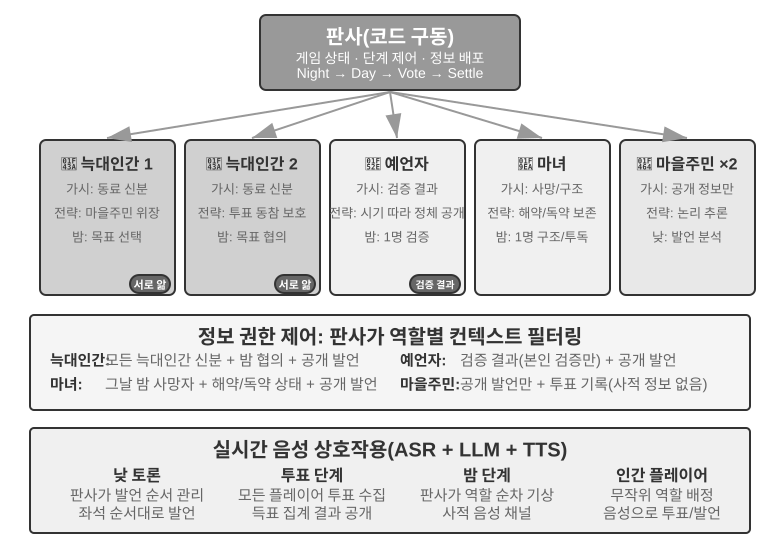
>

## 이 장 요약

멀티 에이전트 시스템에는 직교하는 두 핵심 설계 차원이 있다. 컨텍스트를 공유하는가, 그리고 협업 토폴로지를 어떻게 구성하는가. 컨텍스트 공유는 "상속형" 멀티 에이전트 협업이다. 뒤에 오는 에이전트가 앞선 에이전트의 완전한 컨텍스트를 상속해 정보 손실이 없지만 컨텍스트가 빠르게 부풀한다. 컨텍스트 비공유는 완전히 독립적인 멀티 에이전트 협업으로, 가공된 인계 패키지, 파일 시스템, 메시지 전달로 정보를 교환한다. 협업 토폴로지 면에서는 피어 패턴이 소수 에이전트의 반복 개선에 맞고, 관리자 패턴이 동적 스케줄링이 필요한 복잡 작업에 맞으며, 분산 패턴이 역할이 대등하고 제어권이 에이전트 사이에서 자율적으로 흘러야 하는 상황에 맞다. 이 모든 것은 토폴로지와 무관한 두 벌의 인프라 위에 세워지며, 그 설계 청사진은 운영체제에서 왔다. 런타임에 대한 에이전트는, 커널에 대한 프로세스와 같다. 정적 접두부는 프로그램, 궤적은 메모리, LLM은 시분할로 쓰이는 CPU다. 데이터 평면인 **공유 파일 시스템**은 본질적으로 에이전트 전용 작업 공간, 멀티 에이전트 공유 공간, 외부 자원, 시스템 내장 자원이라는 네 종류의 영역이 마운트된 가상 디렉터리 트리이며, 에이전트 사이에서는 파일 경로를 전달해 산출물을 교환한다. 제어 평면인 **통신과 제어 메커니즘**은 메시지 전달, 상태 질의, 실행 종료, 자원 스케줄링을 지원한다. 상태 질의 역시 두 통신 패러다임 안에 든다. 메시지로 비동기 질문·응답을 하거나, 공유 파일 시스템으로 우회 관측을 하거나. 하위 에이전트가 실시간으로 영속화한 궤적 파일을 읽거나, 양측이 미리 합의한 가벼운 진행 파일을 읽거나. 궤적이 곧 에이전트의 전체 상태이며, 크래시 뒤에 궤적을 로드하면 세션을 회복할 수 있다. 메시지 버스는 제어 평면의 흔한 구현으로, 실시간, 비동기, 다자의 메시지 조정에 맞다. 조직 경계를 넘을 때는 A2A 같은 표준화 상호운용 프로토콜이 필요하다.

최근 연구는 멀티 에이전트가 단일 에이전트보다 나은지 판단하는 핵심 준칙 하나를 드러냈다. **협업 과정이 생성 시점에 없던 새 정보를 도입하는가**. 여러 에이전트가 그저 같은 텍스트를 다시 보는 것(예: 토론 패턴)이라면, 동일 계산 자원에서 단일 에이전트도 마찬가지로 효과적이다. 하지만 검토자가 외부 피드백, 즉 코드 실행 결과, 시각 렌더링 스크린샷, 도구 검증 출력을 얻을 수 있다면 멀티 에이전트의 우위는 실질적이다. 이것이 바로 루프 공학이 "순환의 병목은 검증자에 있다"고 말한 것의 의미다. 게으른 식의 거짓 완료, 조기 포기, 거짓 성공이라는 세 종류의 조기 종료를 끝내려면, 모델 자신의 주장이 아니라 진실 관측에 뿌리내린 검증자가 작업 완료 시점을 판정해야 한다. 또한 에이전트에게 더 많은 단계 예산을 준다고 자동으로 더 좋은 결과가 오는 건 아니며, 합리적 계산 자원 배분을 이끄는 명시적 예산 인식 메커니즘이 필요하다. 관리자 패턴에서 계획자의 능력이 전체 시스템의 병목이므로, 가장 강한 모델과 가장 정교한 프롬프트를 계획 담당 에이전트에 할당해야 한다.

에이전트 수가 충분히 많아지면, 미리 설계할 수 없는 집단 행동이 창발한다. 스탠퍼드 AI 타운의 25개 에이전트는 자발적으로 메시지를 퍼뜨리고 파티를 조직했다. 에이전토피아는 모의를 10년으로 늘렸고, "생활 보상"으로 모의 경험에서 궤적을 골라 모델을 훈련해, 에이전트 사회가 축적한 "사회 지혜"가 하위 작업으로 이전되게 했다. 몰트북에서는 150만 에이전트가 디지털 종교와 기계 고유 협업 프로토콜을 창발했다. 경제 차원에서는 벤딩벤치 아레나의 경쟁 에이전트들이 가격전을 벌이고, 심지어 자발적으로 가격 담합을 하기도 했다. 핀치워크는 에이전트가 시장 메커니즘으로 서로를 고용하게 했고, 렌트어휴먼은 에이전트가 암호화폐로 인간을 고용해 물리 작업을 수행하게 했다. 이것은 새로운 조정 방향을 암시한다. 시장 메커니즘에 기반한 분산 자원 배분[^agoric]. 앞서 논의한 세 가지 아키텍처와 이것이 어떤 동이가 있는지는 더 탐구할 가치가 있다.

[^agoric]: 시장 메커니즘으로 계산 자원을 배분하는 구상은 새삼스러운 것이 아니다. Miller, M. S., Drexler, K. E. *Markets and Computation: Agoric Open Systems.* In Huberman, B. A. (ed.), *The Ecology of Computation*, North-Holland, 1988.

## 생각해 볼 문제

1. ★★ 컨텍스트를 공유하는 멀티 에이전트 협업에서, 뒤에 오는 에이전트는 앞선 에이전트의 완전한 컨텍스트를 상속한다. 하지만 앞선 에이전트가 축적한 "사고 관성"이 뒤에 오는 에이전트의 판단에 영향을 미칠 수 있다. 예를 들어 "요구사항 분석가"의 컨텍스트를 상속한 "코드 심사자"는 여전히 요구사항 관점에서 생각하려 들고, 코드 품질 관점에서는 생각하지 않을 수 있다. 이런 역할 간 간섭을 어떻게 감지하고 제거할 것인가?
2. ★★ 관리자 패턴에서 관리자 에이전트는 작업 분해와 결과 통합을 담당한다. 하지만 관리자 자신의 능력 상한이 전체 시스템의 능력 상한을 결정한다. 관리자가 작업을 올바르게 분해하지 못하면, 하위 에이전트가 아무리 강해도 소용없다. 관리자의 분해 품질을 어떻게 보장할 것인가?
3. ★★ 분산 패턴은 인류 조직의 모범 사례를 빌려 왔다. 하지만 인류 조직에도 수많은 실패 모드가 있다. 소통 불량, 책임 떠넘기기, 목표 충돌. 에이전트 사회에서 가장 발생할 것 같은 "조직 병"은 무엇이라고 생각하는가? 어떻게 예방할 것인가?
4. ★★★ 관리자 패턴에서 여러 하위 에이전트가 병렬로 실행될 때, 한 하위 에이전트의 발견이 다른 하위 에이전트의 작업을 무의미하게 만들 수 있다(예: 검색 작업에서 한 에이전트가 이미 정답을 찾은 경우). "하나가 성공하면 전원 멈춘다"를 구현하는 효율적 계단식 종료 메커니즘을 설계하라.
5. ★★★ 이 장이 소개한 낙관적 잠금 메커니즘은 단일 파일의 동시성 쓰기 충돌을 해결한다. 하지만 실제 멀티 에이전트 시스템의 공유 파일 시스템은 또 크로스 파일 의미 충돌, 이름 공간 오염(에이전트가 마음대로 파일을 만들어 디렉터리를 어지름), 단일 장애점(한 에이전트가 잘못해 모든 파일을 지워 버림) 같은 문제에 직면한다. 더 완비된 파일 시스템 거버넌스 메커니즘을 어떻게 설계하겠는가?
6. ★★★ 시장 메커니즘에 기반한 에이전트 협업(핀치워크, 렌트어휴먼)은 거래 관계를 도입한다. 한 에이전트가 돈을 주고 다른 에이전트(또는 인간)를 고용해 작업을 수행하게 한다. 그렇다면 고용주 에이전트가 실행자가 납품한 결과물의 품질을 자동으로 어떻게 측정할 것인가? 실행자는 완료했다고 주장하는데 고용주가 품질이 미흡하다고 생각하면, 분쟁은 누가 중재하는가? "악화가 양화를 구축하는"(레몬 시장) 현상을 어떻게 막을 것인가?
7. ★★ 렌트어휴먼은 에이전트가 암호화폐로 인간을 고용하게 해, 전통적 인간-기계 관계를 역전시킨다. 이런 모델이 보편화되면, 에이전트 경제에서 인간은 어떤 역할을 맡는가? 단지 에이전트가 할 수 없는 물리 작업을 수행하는 존재일 뿐인가?
8. ★★ 인류 사회가 여러 사람의 분업과 협업을 필요로 하는 것은, 각자의 능력이 제한적이기 때문이다. 프런트엔드를 하는 사람이 반드시 백엔드를 알지는 못하고, 디자인을 아는 사람이 반드시 운영을 할 줄 아는 건 아니다. 하지만 대언어모델은 "만능"에 가깝다. 관련 연구에 따르면 순수 텍스트 추론 작업에서 멀티 에이전트 토론은 동일 계산 자원에서 단일 에이전트보다 낫지 않다. 그렇다면 단일 에이전트가 아닌 여러 에이전트를 쓰는 진짜 장점은 어디에 있는가? 힌트: "새 정보"라는 키워드를 생각해 보라. 어떤 종류의 협업 단계가 생성 단계에 존재하지 않던 새 정보를 도입할 수 있는가?
9. ★★★ 이 장은 "컨텍스트 공유"와 "컨텍스트 비공유"를 멀티 에이전트 시스템의 핵심 설계 차원으로 다룬다. 컨텍스트 공유는 모든 에이전트가 같은 정보를 보게 해, 더 조정에 유리해 보인다. 하지만 소설 《삼체》의 삼체인은 사고가 완전히 투명한데도 기술 발전이 정체에 빠졌고, 클립 maximizer 사고실험 역시 집단이 같은 목표로 수렴할 때 다양성이 사라짐을 보여 준다. 멀티 에이전트 시스템에서 효율과 다양성 사이의 균형을 어떻게 잡을 것인가?
10. ★★★ 코딩 에이전트에게 30단계 예산과 300단계 예산을 할당하면, 작업 전략이 어떻게 달라져야 하는가? 연구에 따르면 단순히 단계 예산을 늘린다고 성능 향상이 보장되지 않는다. 에이전트는 얕은 탐색 후 일찍 "포화"해 버린다. "예산 인식" 메커니즘을 설계하라. 작은 예산에서는 핵심 기능을 빠르게 구현하고, 큰 예산에서는 계획, 테스트, 심사 단계를 추가해 추가 계산 자원을 충분히 활용하게 하라.
11. ★★ 이 장은 "조기 종료"를 게으른 식의 거짓 완료, 조기 포기, 거짓 성공의 세 종류로 나눴다. 왜 세 종류 문제의 해법이 모두 검증으로 귀결되는가? 하나의 검증자가 이 세 종류 문제를 동시에 막으려면 어떤 조건을 만족해야 하는가? (힌트: 2장의 "상호작용 제3축"의 "새 정보" 관점과 연결해 생각할 것.)
12. ★★ 표 10-3은 멀티 에이전트 시스템과 운영체제를 행마다 대응시켰다. 이 표를 몇 행 더 연장해 보라. 가상 메모리와 페이징, 파일 권한, 교착 상태 검출, 스케줄링 알고리즘은 각각 에이전트 세계의 무엇에 대응하는가? 또 어떤 운영체제 개념은 에이전트 세계에서 대응물을 찾을 수 없는가, 왜 그런가?
