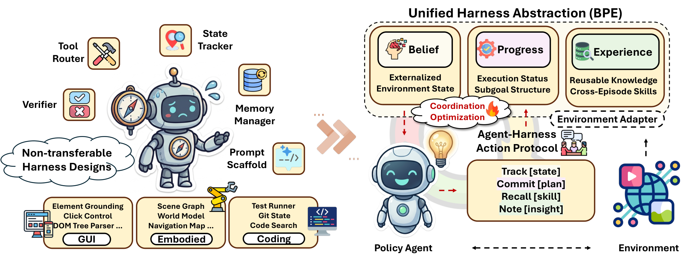

## 제1장 — 문제: 하니스를 쓰는 법은 누가 정하나

> 원문: EvoHarness-RL — arXiv:2608.05446 · §1 Introduction

### 긴 실행은 외부에 얹힌다

에이전트가 맡은 일이 길어지자 계산의 무게중심이 모델 밖으로 나왔다. 한 번 답하고 끝나는 과제라면 모델 안에서 다 끝난다. 그러나 몸을 가진 환경과의 상호작용, 웹 탐색, 소프트웨어 공학, 워크플로 자동화 같은 자리에서 에이전트는 오래 버텨야 한다. 환경에 대한 믿음을 유지하고, 끝낸 일과 남은 서브골을 추적하고, 실패한 행동에서 회복하고, 지난 경험의 절차를 다시 꺼내 써야 한다. 이런 짐을 컨텍스트 창 하나로 지탱할 수는 없다. 메모리가 붙고 도구가 달리고, 상태 추적기와 검증기와 실행 로그가 따라온다. 긴 호라이즌(long-horizon) 실행이 갖가지 외부 지원에 의존하게 되는 풍경이다.

여기서 논문은 중심 질문을 꺼낸다. 에이전트는 어떻게 쓸 만한 외부 상태를 스스로 만들고, 그 지원을 자기 결정 과정의 일부로 효율적으로 쓰게 되는가.

### 외부 하니스라는 층

논문은 이 런타임 층을 외부 하니스(external harness)라 부른다. 프롬프트, 도구, 검색 모듈, 메모리, 상태 추적기, 실행 피드백, 제어 흐름 장치를 두루 묶는 총칭이다. 에이전트 실행을 떠받치는 바깥 장비 전부를 한 단어로 부르는 셈이다.

이 층은 빠르게 풍부해지고 있다. 요즘 에이전트 프레임워크와 제품은 갈수록 정교한 하니스 구성요소를 내놓고, 하니스 엔지니어링 연구는 하니스 상태와 구현, 궤적 기반 적응을 다듬는다. 자기진화 에이전트 연구는 지난 궤적을 재사용 가능한 메모리, 워크플로, 스킬로 증류해 보인다. 장비를 갖추는 일과 장비를 적응시키는 일, 둘 다 저마다 앞서 있다.

### 병목은 장비가 아니라 사용법

논문이 겨냥하는 병목은 그 반대편에 있다. 외부 구성요소를 아무리 정성껏 설계하고 적응시켜도, 그것을 쓰는 런타임 정책은 프롬프트와 휴리스틱, 도메인 관례로 사람 손에서 정해지는 일이 대부분이다. 초록의 문장이 이 간극을 정확히 찌른다. 에이전트는 유용한 외부 지원에 둘러싸여 있지만, 그 지원을 언제 만들고 접근하고 갱신하고 통합할지는 배운 적이 거의 없다.

이 책의 판단을 붙인다. 도구를 많이 두는 일과 도구를 잘 쓰는 일은 별개의 문제인데, 지금 생태계는 앞의 문제만 열심히 키워 왔다. 하니스가 풍부해질수록 이 간극은 오히려 벌어진다. 고를 수 있는 지원이 늘수록 언제 무엇을 쓸지 정하는 일이 어려워지기 때문이다.

### 얽힌 두 난제

사용법을 학습 문제로 바꾸려면 두 난제를 넘어야 한다. 논문은 둘이 서로 얽혀 있다고 본다.

하나는 상태 형성(state formation)이다. 상호작용 궤적에는 잡음이 많다. 관찰과 행동, 성공과 실패, 되돌리기가 뒤섞인 원시 기록에서 지금 꺼내 쓸 만한 상태를 뽑아 내야 한다. 필요 없는 디테일은 버리고 살아 있는 사실만 남기는 걸러내기다.

다른 하나는 런타임 통제(runtime control)다. 외부 상태 접근은 공짜가 아니다. 하니스 액션은 환경 액션과 같은 상호작용 예산을 소모한다. 그래서 지금 믿음을 읽을지, 진척을 적을지, 경험을 꺼낼지, 아니면 아무것도 하지 않을지를 매 걸음 결정해야 한다. 매 걸음 하니스를 확인하는 에이전트는 예산을 태우고, 하니스를 외면하는 에이전트는 상태를 잃는다.

둘은 따로 풀 수 없다. 상태를 못 만들면 통제할 거리가 없고, 통제를 못 하면 만든 상태가 예산만 잡아먹는다.

### 하니스 정책 학습

논문은 이 두 난제를 하나의 문제로 묶어 하니스 정책 학습(harness policy learning)이라 정식화한다. 에이전트가 하니스 정책을 오프라인에서 학습해 두고, 런타임 과제 수행 중에 외부 하니스 상태를 구축하고 갱신하며 쓴다. 하니스 사용이 프롬프트 시점에 박아 넣은 뼈대가 아니라 학습된 런타임 결정이 되는 자리다.

이 문제의 첫 구현이 EvoHarness-RL이다. 이질적인 하니스 구성요소를 세 역할로 추상화해 하나의 작업 공간으로 연다. 환경의 현재 상태를 담는 믿음(Belief), 끝낸 일과 남은 서브골을 적는 진척(Progress), 에피소드를 건너 재사용되는 지식인 경험(Experience). 세 머릿글자를 따 BPE라 부른다. 에이전트는 track·commit·recall·note 네 가지 메타 액션으로 이 공간과 대화한다. 학습은 두 단계다. 감독 하니스 파인튜닝(supervised harness fine-tuning, SFT)이 BPE 액션 프로토콜의 의미와 상태 외재화를 가르치고, 비용을 의식하는 GRPO(cost-aware GRPO)가 과제 성공과 효율, 액션 다양성과 반복 회피에 보상을 주며 언제 읽고 갱신하고 통합할지 탐색하게 한다.

그림 1-1이 전체 구조를 준다. 긴 호라이즌 에이전트가 의지하는 외부 실행 지원은 원래 제각각이고 사람 손으로 통제된다. EvoHarness-RL은 이 작업 공간을 정책이 마주하는 세 상태로 추상화한다. 환경 상태를 담은 Belief, 실행 현황과 서브골 구조를 담은 Progress, 에피소드를 건너 쓸 지식인 Experience다. 에이전트는 콤팩트한 하니스 액션으로 이 공간을 조율하며, 실행 중 언제 track하고 commit하고 recall하고 note할지를 결정한다. 배우는 대상은 상태 자체가 아니라 그 결정이다.

### 논문이 걸어 놓은 네 가지

기여는 넷으로 정리된다. 첫째, BPE와 콤팩트한 메타 액션으로 짠 학습 가능한 에이전트-하니스 조율 층을 제안한다. 둘째, 전문가 시연에서 하니스 사용을 부트스트랩한 뒤 GRPO로 비용 인식 조율을 최적화하는 2단계 학습 레시피를 개발한다. 셋째, BPE는 추론과 학습 양쪽에 듣는다는 것을 보인다. 프롬프트 시점 BPE만으로도 상태가 필요한 긴 과제가 좋아지고, Qwen3-8B를 얹은 ALFWorld 실험에서 SFT와 GRPO를 거치면 본 과제 96.9%, 미지 과제 86.6%까지 오른다. 넷째, 학습이 하니스 사용을 어떻게 바꾸는지 두 공진화 동역학으로 분석한다. 반복되는 하니스 사용 패턴이 정책 안으로 흡수되어 잦은 호출에서 선별적 접근으로 옮겨가는 하니스 담금질(harness annealing), 그리고 진척 갱신과 경험 통합을 거쳐 하니스가 콤팩트하고 과제에 맞는 상태 기질로 정돈되는 하니스 진화(harness evolution)가 그것이다.

이 장의 질문으로 돌아가자. 하니스를 쓰는 법은 누가 정하나. 논문의 대답은 사람이 미리 정해 두지 말고 에이전트가 배우게 하라는 것이다. 다음 장에서는 그 학습의 재료가 되는 BPE 작업 공간과 액션 프로토콜을 상세히 연다.
