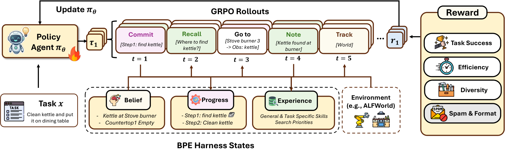

## 제2장 — 설계: 세 상태와 네 액션

> 원문: EvoHarness-RL — arXiv:2608.05446 · §2 Method

### 세 실패에서 나온 세 상태

학습 가능한 하니스 인터페이스는 두 요구 사이에서 균형을 잡아야 한다. 긴 지평 실행을 떠받칠 만큼 외부 상태를 넉넉히 드러내야 하되, 정책 학습이 감당할 만큼 콤팩트해야 한다. 실제 하니스 구현은 상태 추적기, 실행 로그, 과제 계획, 검증기 피드백, 에피소드 기억, 스킬 라이브러리 같은 도메인 특화 구성요소로 흔히 채워진다. 저자들이 주목하는 것은 그 다양함이 아니라, 그 모든 구성요소가 응답하는 실패 모드의 좁은 집합이다. 긴 지평 상호작용에서 에이전트는 셋으로 거듭 무너진다. 환경에서 지금 무엇이 참인지 놓치는 **환경 파악 상실**, 이미 무엇을 마쳤고 다음에 무엇을 시도해야 하는지 잊는 **완료·대기 망각**, 그리고 이전 시도에서 재사용할 수 있었던 절차나 실수를 다시 처음부터 발견하는 **재발견 반복**이 그것이다.

이 세 필요에서 저자들은 정책을 향한 외부 상태의 역할을 세 기능 역할로 묶는다. 환경에 대한 **믿음(Belief)**, 실행의 **진척(Progress)**, 걸쳐온 **경험(Experience)**이다. 각 단계 $t$에서 하니스는 하나의 상태를 렌더링한다.

$$\mathcal{H}_{t}=(B_{t},P_{t},E_{t})$$

세 성분은 각각 환경 추정, 실행 상태, 경험에 대응한다. 믿음 $B_t$는 상호작용으로 추론한 과제 관련 사실 — 물건의 상태, 위치, 관계 — 를 저장해 현재 환경에 대한 지속적인 추정을 제공한다. 휘발성 컨텍스트 창 기억만으로 버티지 않아도 되는 이유다. 진척 $P_t$는 부분목표-상태 기록 $(g_i,\sigma_i)$으로 과제 분해와 실행 상황을 남긴다. 무엇을 시도했고 무엇이 열려 있으며 어디서 막혔는지를 밖으로 꺼내어, 암묵적인 추론 자취를 들여다볼 수 있는 과제 상태로 바꾼다. 경험 $E_t$는 스킬, 실패 양상, 탐색 사전, 상위 전략 같은 에피소드 간 지식을 유지한다. 실행 중에 관련 있는 지난 경험을 꺼내 주고 새 통찰을 저장해 뒤늦은 통합에 넘긴다.

### 네 액션 — 읽고 쓰는 최소 문법

상태가 갖춰져도 정책은 그 작업 공간을 읽고 쓸 간결한 수단이 필요하다. 여기서 갈림길이 둘 나온다. 완전히 도메인 특화된 하니스 API는 많은 연산을 노출할 수 있지만, 학습된 행동이 다른 곳으로 옮겨 가거나 분석되기 어려워진다. 반대로 범용 메모리 액션 하나로 모든 것을 처리하면 작업 공간의 기능적 구조가 액션 뒤에 숨어 버린다. 저자들은 두 극단 사이에서, 에이전트와 BPE 사이의 주요 정보 흐름을 덮는 작은 메타 액션 집합을 정의한다.

$$\mathcal{A}_{\mathrm{bpe}}=\{\mathrm{track},\mathrm{commit},\mathrm{recall},\mathrm{note}\}$$

대응은 단정적이다. track은 $B_t$에서 과제 관련 믿음을 읽는다. commit은 부분목표 또는 실행 갱신을 $P_t$에 쓴다. recall은 $E_t$에서 재사용 가능한 지식을 꺼낸다. note는 새 통찰을 기록해 뒤늦은 경험 통합에 넘긴다. 상호작용 중 정책은 환경 액션과 하니스 액션을 한 묶음에서 고른다.

$$\mathcal{A}=\mathcal{A}_{\mathrm{env}}\cup\mathcal{A}_{\mathrm{bpe}}$$

단계 $t$에서 정책은 환경 관찰 $o_t$와 렌더링된 하니스 상태 $\mathcal{H}_t$, 과제 맥락 $c_t$를 받아 다음 액션을 뽑는다.

$$a_{t}\sim\pi_{\theta}(\cdot\mid o_{t},\mathcal{H}_{t},c_{t})$$

$a_t\in\mathcal{A}_{\mathrm{env}}$이면 환경이 앞으로 나가고 새 관찰이 돌아온다. $a_t\in\mathcal{A}_{\mathrm{bpe}}$이면 외부 작업 공간을 조회하거나 갱신하고 새 하니스 뷰가 돌아온다. 눈여겨 읽을 대목은 그 다음 문장이다. 두 액션 유형이 **같은 상호작용 예산을 소모한다**는 것. 하니스를 한 번 읽는 일도 환경을 한 번 움직이는 일과 같은 예산을 쓰니, 하니스 접근이 언제 그 비용을 치르고도 남는가는 정책이 학습해야 할 문제가 된다. 그 조율의 최적화는 이 장 마지막 절의 몫이다.

### 어댑터 — 같은 인터페이스, 다른 내부

BPE는 고정된 내부 스키마가 아니라 기능 인터페이스다. 과제마다 필요한 하니스 구현은 달라도, 정책을 향해 드러내는 역할은 믿음·진척·경험으로 같을 수 있다. 이 다리를 놓는 것이 환경 어댑터다. 어댑터는 관찰과 액션 결과, 도구 출력, 검증기 피드백을 처리하고 내부 저장소를 유지하다가, 정책에게는 선택된 뷰를 $(B_t,P_t,E_t)$로 내놓는다. 네 하니스 액션도 대상 환경에 맞춰 착지시킨다. 내부 구현은 도메인 특화로 남고, 학습되는 에이전트-하니스 조율층은 공유된다.

시험대 ALFWorld에서의 착지는 이렇다. 믿음은 환경이 한 걸음 나갈 때마다 뒤에서 갱신되는 내부 세계 상태 저장소다. 물건 상태와 위치, 공간 관계 같은 과제 관련 사실을 에이전트의 액션과 관찰로 유지한다. 이 상태는 기본으로 전부 열리지 않는다. 정책이 `track[object]`로 특정 물건을 들여다보거나 `track[world]`로 콤팩트한 전역 요약을 받는, 선택적 하니스 액션의 형태로만 접근된다.

진척은 커밋된 실행 기록이다. ALFWorld에서는 부분목표-상태 항목의 길이 제한 목록으로 구현되며, 대체로 순차적인 가사 과제에 족하다. 예컨대 청소 후 배치 과제는 대상 물건 찾기, 집기, 청소하기, 목표 용기에 놓기로 나뉜다. 정책은 `commit[subgoal]`로 지금 걸음을 밖에 남기고, 시도됨·대기·차단이 이후 판단에 보이게 된다.

경험은 에피소드를 건너는 스킬 저장소다. 일반 스킬, 과제별 스킬, 흔한 실수, 물건 위치 탐색 사전으로 조직되고 두 시간 규모로 진화한다. 에피소드 안에서는 `recall[query]`가 관련 지식을 꺼내며 회수된 항목의 사용 횟수를 갱신하고, `note[insight]`가 새 교훈을 임시 노트 버퍼에 쓰며, 성공한 물건 탐색은 위치 사전을 즉시 갱신한다. 병렬 롤아웃 수집 동안 주 스킬 저장소는 배치 안에서 고정되고, 노트 버퍼와 완료 궤적 요약이 뒤에서 쌓인다. 에포크 경계에 이르면 통합 모델이 이 증거를 add·update·remove 연산으로 스킬 저장소에 합친다.

### 두 단계 학습 — 모방에서 비용 의식으로

학습은 두 단계다. 첫 단계는 같은 BPE 인터페이스로 수집한 성공 교사 궤적 위의 감독 미세조정(SFT)이다. 교사는 매 걸음 과제 목표, 현재 관찰, 허용된 환경 액션, 최근 이력, 활성 하니스 뷰를 보고 `<think>...</think><action>...</action>` 형식으로 다음 액션 하나를 낸다. 그 액션은 ALFWorld 명령일 수도, BPE 하니스 액션일 수도 있다. 저자들은 Qwen3-8B를 이 다음-액션 시연으로 미세조정하며, 과제 해결 행동과 함께 track·commit·recall·note를 언제 쓰는지의 기초 의미를 가르친다. 교사 롤아웃 동안 쌓인 경험은 이어지는 GRPO가 쓸 스킬 저장소를 초기화한다.

둘째 단계는 SFT 체크포인트에서 시작하는 GRPO다. 궤적 수준 보상 $R(\tau)$은 지배적인 희소 성공 신호 위에, 적응적 하니스 사용을 기르는 촘촘한 보조 항을 얹는다.

$$R(\tau)=\underbrace{R_{\mathrm{succ}}(\tau)}_{\text{task success}}+\underbrace{\lambda_{\mathrm{eff}}R_{\mathrm{eff}}(\tau)}_{\text{efficiency bonus}}+\underbrace{\lambda_{\mathrm{div}}(u)R_{\mathrm{div}}(\tau)}_{\text{action diversity}}-\underbrace{\lambda_{\mathrm{spam}}R_{\mathrm{spam}}(\tau)}_{\text{spam penalty}}-\underbrace{\lambda_{\mathrm{inv}}R_{\mathrm{inv}}(\tau)}_{\text{format penalty}}$$

과제 완수가 엄격한 문지기 노릇을 한다. $R_{\mathrm{succ}}(\tau)=10\cdot\mathbf{1}[\text{solved}]$이고, 효율 보너스 $R_{\mathrm{eff}}(\tau)=\max(0,\,1-\lvert\tau\rvert/T_{\max})$는 오직 성공했을 때만 지급된다. 성공해야 받고 궤적이 길수록 얇아지니, 잉여로운 하니스 질의는 저절로 억눌린다.

붕괴 방지가 다음 고민이다. 정책이 $\mathcal{A}_{\mathrm{bpe}}$를 통째로 무시하거나, 반대로 같은 액션을 끝없이 되풀이하는 두 붕괴를 막으려 저자들은 시간 의존 어휘 다양성 보너스를 넣는다.

$$R_{\mathrm{div}}(\tau)=\frac{\lvert\{\mathrm{verb}(a_{t}):a_{t}\in\tau\}\rvert}{\lvert\tau\rvert},\qquad\lambda_{\mathrm{div}}(u)=\frac{\lambda_{\mathrm{div}}^{\max}}{2}\left(1+\cos\frac{\pi u}{U}\right)$$

궤적에 등장한 서로 다른 동사의 수를 궤적 길이로 나눈 것이 $R_{\mathrm{div}}$다. 가중치 식에서 $u$는 현재 RL 에포크, $U$는 담금질 시한이다. 코사인 곡선을 따라 초기에는 무겁게 붙었다가 훈련이 깊어지면 우아하게 줄어든다. 이 커리큘럼은 훈련 초반에 하니스 액션을 넓게 탐색하게 한 뒤 점차 압력을 거두어, 전문화와 효율적 과제 해결로 몰아간다. 마지막으로 $R_{\mathrm{spam}}$과 $R_{\mathrm{inv}}$는 무의미한 반복과 형식이 틀어진 액션에 고정 벌점을 매긴다.

성공이 아니면 보너스가 없고, 성공해도 길면 보너스가 줄고, 초반의 다양성 권장은 시간이 지나며 걷히고, 군더더기에는 벌금이 붙는다. 보상 설계 한 장에 "하니스는 공짜가 아니다"라는 이 논문의 전제가 그대로 새겨져 있다.
