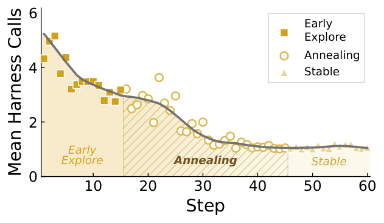
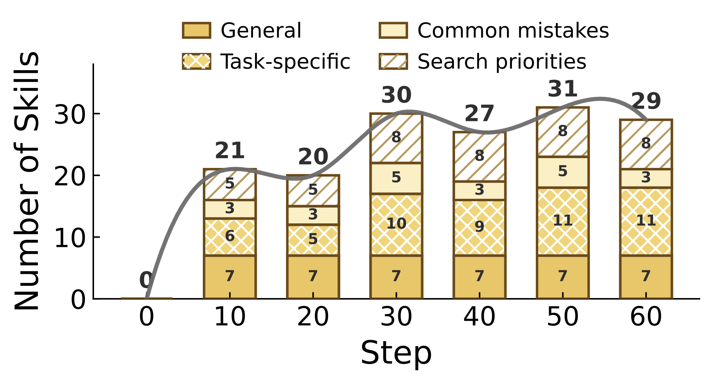
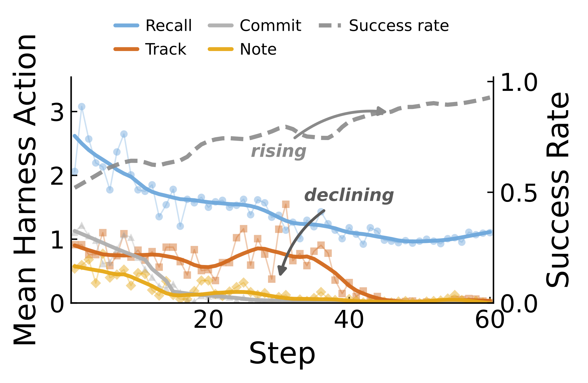

## 제5장 — 담금질과 진화: 하니스는 학습되며 바뀐다

> 원문: EvoHarness-RL — arXiv:2608.05446 · §4 Analysis, Appendix A

벤치마크 표가 성능의 결말을 보여준다면, 분석 장은 성능이 만들어지는 과정을 보여준다. 논문은 EvoHarness-RL의 학습 과정에서 서로 다른 두 겹의 동역학을 분리해 들여다본다. 하나는 정책 쪽에서 일어나는 **하니스 담금질**(harness annealing)로, 학습이 되풀이되는 하니스 사용을 정책 안으로 걷어 들이는 현상이다. 다른 하나는 하니스 쪽에서 일어나는 **하니스 진화**(harness evolution)로, 경험 저장소가 에피소드를 거듭하며 스스로 모양을 바꾸는 현상이다. 이 장은 본문 §4의 두 분석을 먼저 읽고, 부록 A의 액션별 분해와 보상 비교를 더해 마무리한다.

### 하니스 담금질 — 잦은 호출에서 한 번의 선별로

그림 5-1의 곡선은 단순하지만 뜻은 깊다. SFT로 초기화한 에이전트는 훈련 초기에 하니스를 잦게 부른다. 상태를 추적하고, 절차를 꺼내 보고, 탐색 공간을 좁히는 수단으로 BPE(Belief·Progress·Experience)를 겉으로 드러나는 비계 삼아 쓰는 것이다. GRPO가 진행되면서 호출 수는 빠르게 떨어지고, 이내 **에피소드당 근접 한 번**의 수준에서 안정된다.

담금질이라는 이름은 이 책의 풀이로는 이렇다. 뜨겁게 시작한 호출이 학습과 함께 식어 가며 안정점을 찾는 모양이, 열을 가했다 식히며 성질을 굳히는 풀과 닮았다. 논문 자신의 해석은 더 담백하다. GRPO가 되풀이되는 비계 행동을 정책 안으로 점차 내재화하되, 기대하는 이득이 단계 비용을 웃도는 경우에만 하니스 접근을 남겨 둔다는 것이다. 무엇이든 밖에 적어 두고 움직이던 에이전트가, 배울수록 꼭 필요한 순간에만 밖을 들여다보게 된다. 논문의 표현을 빌리면 학습은 비계에 기댄 탐색에서 선별적이고 비용을 헤아리는 조정으로 옮겨 간다.

### 하니스 진화 — 팽창과 통합을 거치는 기술 은행

정책이 하니스를 덜 부르는 쪽으로 움직이는 동안 하니스 자체는 가만히 있지 않다. BPE의 세 구성 요소 가운데 신뢰 상태(belief)와 진행도(progress)는 에피소드 안에서 갱신되지만, 경험(experience)은 에피소드를 넘어 축적과 통합과 망각을 거치며 재편된다. 그림 5-2가 보여 주는 것이 바로 이 경험 저장소의 궤적이다.

기술 은행(skill bank)은 훈련 초반에 빠르게 팽창한다. 일반 전략과 과제별 절차, 흔히 저지르는 실수, 탐색의 우선순위가 저마다 항목으로 쌓인다. 후반으로 가면 성장은 선별적으로 바뀐다. 중복 항목은 하나로 병합되고, 드물게 쓰이는 기술은 밀려나고, 자주 회상되는 지식은 남는다. 최종 은행은 크지 않으면서도 다양하다. 논문은 이 모습을 두고, 하니스가 무작정 쌓기만 하는 메모리가 아니라 과제에 맞춰 적응하는 상태 기판이 되었다고 요약한다.

담금질과 진화는 서로를 보완하는 두 움직임이다. 정책은 **언제** 외부 상태를 쓸지 배우고, 하니스는 **무엇을** 재사용 가능한 경험으로 내놓을지 바꾼다. 한쪽 그림만 보면 이 학습의 전체 모양새가 보이지 않는 이유다.

### 액션별 담금질 — 네 액션은 같은 속도로 사라지지 않는다

부록 A는 호출 수의 총량을 액션 유형별로 쪼개 본다. 그림 5-3이 보여 주듯 네 액션은 균일하게 가지치기되지 않는다. 초기 에이전트가 경험 조회에 더해 추적(track)과 진행 확정(commit), 메모(note)를 두루 부른 것은 SFT 비계의 흔적과 같다. GRPO가 진행되면 이 가운데 무엇을 남길지가 갈린다.

회상(recall)은 끝까지 가장 잘 남는 액션이다. 루틴적인 행동이 상당수 내재화된 뒤에도 에피소드를 넘는 경험이 여전히 유용한 탐색 사전 지식을 준다는 뜻이다. 반면 확정과 메모는 빠르게 0을 향해 줄어든다. 안정된 과제 전략이 자리 잡고 나면 중간 계획을 일일이 밖에 적거나 잦은 새 통찰을 기록할 필요가 없어진다. 추적은 그 중간에 있다. 초기에는 상태를 가려 내는 데 요긴하지만, 에이전트가 환경과 더 직접 상호작용하는 방식을 익히면서 점차 줄어든다.

눈여겨볼 대목은 이 감소 곡선들과 성공률의 방향이 어긋난다는 점이다. 호출은 줄어드는데 성공률은 계속 오른다. 논문은 이 액션별 무늬가 환경에 따라 달라진다는 점도 분명히 한다. ALFWorld는 집안일 절차와 물건 탐색의 사전 지식이 과제 사이에서 공유되는 터라 경험 구성 요소가 유독 값진 환경이다. 논문의 추정을 따르면 장면 그래프와 객체 상태, 공간 관계를 붙들어야 하는 시각 중심의 실물 환경에서는 신뢰 상태에, 하위 과제와 테스트 상태, 미완료 분기를 좇아야 하는 소프트웨어 엔지니어링 환경에서는 진행도에 무게가 실릴 수 있다. 요컨대 EvoHarness-RL이 배우는 것은 어디서나 통하는 고정된 액션 배분이 아니라, 그 환경의 비용 구조와 상태 요구에 맞춰 BPE의 어느 부분이 접근할 값어치가 있는지다.

### 보상 궤적 — 덜 부르는 것과 못 쓰는 것은 다르다

호출 수가 줄어드는 그래프를 처음 보면 정책이 하니스를 잃어버린 건 아닌지 의심이 먼저 든다. 부록 A의 보상 비교가 그 의심을 잠재운다. 훈련을 통틀어 EvoHarness-RL의 보상은 표준 GRPO를 일관되게 앞선다. 오르는 속도가 더 빠르고 닿는 평형도 더 높으며, 표준 GRPO는 개선이 느려 상당히 낮은 자리에 머문다.

논문은 이 결과를 액션별 담금질과 나란히 읽는다. 하니스 호출의 감소는 정책이 무너졌거나 하니스를 쓰지 못해서 생긴 것이 아니다. BPE가 먼저 탐색과 상태 관리의 비계로 기능하고, GRPO가 되풀이되는 비계 행동을 안으로 걷어 들이되 가장 유용한 외부 상태에 대한 선별적 접근은 남겨 두는, 바로 그런 학습의 결과라는 것이다. 덜 부르는 것과 못 쓰는 것을 갈라 보는 이 비교가 없었다면 담금질은 오해의 소지가 있는 그래프로 남았을 것이다.

### 이 장의 해석 — 외주에서 내재화로

이 책은 이 장의 두 그림을 한 문장으로 줄인다. 학습은 하니스를 떼어 내는 과정이 아니라 하니스를 향한 손짓의 수를 줄이는 과정이다. 되풀이되는 일은 정책이 안으로 삼키고, 에피소드를 넘어서까지 값을 매길 수 있는 경험만 밖에 남는다. 회상이 끝까지 남는다는 관찰이 여기서 힘을 얻는다. 에피소드당 근접 한 번의 호출이 마지막까지 남은 그 몫을 채우는 셈이다.

여기에 하니스 쪽 움직임을 더하면 그림이 완성된다. 정책이 접근을 줄이는 동안 기술 은행은 통합과 망각으로 스스로 다듬어져, 정책이 찾을 가치가 있는 경험만 좁혀 둔다. 한쪽은 부르는 횟수를, 다른 쪽은 내놓는 내용을 줄인다. 방향은 다르지만 둘 다 비용을 헤아리는 같은 학습의 두 측면이며, 이 두 겹이 맞물릴 때 하니스는 사람이 정해 준 고정 구조가 아니라 학습되어 바뀌는 무엇이 된다.

물론 위의 요약은 이 책의 읽음이지 논문의 문장은 아니다. 논문이 보여 준 것은 ALFWorld라는 한 환경에서의 그래프이고, 액션별 무늬가 환경을 바꾸면 어떻게 달라질지는 앞서 본 추정의 자리에 머문다. 담금질과 진화가 다른 환경에서도 같은 모양으로 나타나는지는 열린 질문으로 두는 것이 이 논문을 정확히 읽는 태도다.
