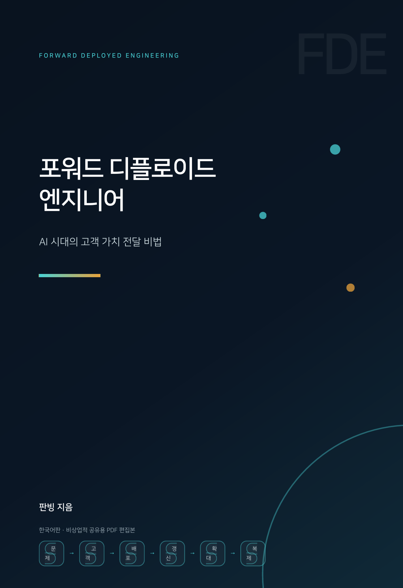

  

# 포워드 디플로이드 엔지니어: AI 시대의 고객 가치 전달 비법

판빙 지음 · 전문 무료 공개, 온라인 열람과 공유를 환영합니다

---

## 이 책에 관하여

2025년 여름, 내 위챗 모멘트는 하나의 숫자로 뒤덮였다: 95%.

MIT의 보고서에 따르면, 지난 3년간 전 세계 기업은 생성형 AI에 300~400억 달러를 쏟아부었지만, 그중 95%의 프로젝트는 재무제표에 기재할 만한 가치를 창출하지 못했다. 거의 같은 시기, 정반대 방향으로 질주하는 뉴스 하나가 있었다. 실리콘밸리 채용 사이트에서 '포워드 디플로이드 엔지니어(Forward Deployed Engineer, 약칭 FDE)'라는 직무의 채용 공고가 9개월 만에 8배 늘었다. OpenAI도 뽑고, Anthropic도 뽑고, YC 인큐베이터에 속한 100여 개 스타트업도 모두 뽑고 있었다.

한쪽은 기업 AI 프로젝트의 95% 전사율이고, 다른 한쪽은 하나의 직무에 대한 800%의 인기다. 두 뉴스를 나란히 놓고 보면 답은 어렵지 않다: **모델은 더 이상 귀한 자원이 아니다. 모델을 고객의 실제 비즈니스에 끼워 넣을 수 있는 사람이 진짜 귀한 자원이다.**

이로부터 나는 FDE라는 직무에 강한 흥미를 품게 되었다. 여러 해 전 『그로스 해커』를 쓸 때 내가 했던 일은 본질적으로 이번과 같았다. 실리콘밸리에서 지금 일어나고 있지만 국내에는 아직 이름이 붙지 않은 무언가를 체계적으로 연구하고, 성실하게 풀어 설명하는 일. 이번에도 같은 우직한 방법을 택했다. 찾을 수 있는 1차 자료를 모조리 뒤졌다: Palantir 초기 경영진이 팟캐스트에서 전하는 회고, 전 직원의 회고록, VC의 업계 분석, MIT 보고서 원문, 수십 개 기업의 채용 공고, 보상 리포트, 포럼에서 종사자들이 쏟아내는 하소연, 그리고 국내 최초 실천자들의 경험담.

이 책은 그 연구 과정의 온전한 결정체다. 세 가지를 명확히 다룬다:

- **FDE란 무엇인가**: Palantir의 정보 프로젝트에서 자라난 이 역할이 어떻게 정의되고, 왜 AI 시대에 폭발했는지
- **어떻게 하는가**: 한 번의 실제 인도가 지나는 전체 여정을 따라가기 - 올바른 문제 풀기, 고객 따내기, 배포 활성화, 갱신 지키기, 매출 확대, 규모화 복제
- **누가 하는가**: 112개의 확인 가능한 실제 사례, Palantir, OpenAI, Anthropic에서 Harvey, Sierra를 거쳐, 나아가 국내 최초 실천자들까지

책에 등장하는 모든 데이터와 사례는 부록 C에 출처를 밝혔다. 정리 과정 자체가 학습이었으므로, 인용 하나하나가 검증을 견딜 수 있도록 힘썼다. 누락이 있다면 Issue로 지적해 주기 바란다.

## 왜 무료로 공개하는가

이 책은 애초에 나 스스로를 위해 쓴 학습 노트다. 낯선 분야를 공부할 때 가장 좋은 검증 방법은 그것을 다른 사람도 읽을 수 있는 책 한 권으로 풀어 설명하는 것이다 - 설명하지 못하는 부분은 곧 내가 이해하지 못한 부분이다.

정리를 마친 뒤 하드디스크에 묶어 두기에는 다소 아쉬웠다. FDE는 국내에서 이제 막 이름이 붙은 직무로, 많은 논의가 아직 '이것은 이름만 바꾼 프리세일즈가 아닌가' 정도에 머물러 있다. 이 정리가 전환을 고민하는 엔지니어에게 이 직무의 전모를 보여 주고, 기업 AI에 뛰어든 창업자가 시행착오를 덜며, 'AI는 대체 어떻게 기업에 도입될 수 있는가'를 이해하고 싶은 모든 이의 검색 시간을 수십 시간 절약해 줄 수 있다면, 내 하드디스크에 방치되는 것보다 공개되는 쪽이 분명 더 가치 있을 것이다.

지식의 가치는 축적이 아니라 흐름에 있다.

## 저자 소개

판빙, 온라인 필명 XDash. 인터넷 종사자로 기술 트렌드와 비즈니스 방법론을 오래 관찰해 왔다. 이 책은 개인 연구 정리이며 어떤 기관의 입장도 대변하지 않는다.

## 읽는 법

- **온라인 열람**: 아래 목차를 클릭하면 GitHub에서 챕터별로 바로 읽을 수 있다
- **PDF 통권**: [FDE_포워드_디플로이드_엔지니어_한국어판_최종편집본.pdf](FDE_포워드_디플로이드_엔지니어_한국어판_최종편집본.pdf) — 전체 완성본 한 번에 받기

## 목차

| 챕터 | 내용 |
| --- | --- |
| [1장](01-제1장-FDE의부상.md) | FDE의 부상 |
| [2장](02-제2장-올바른문제풀기.md) | 올바른 문제 풀기 |
| [3장](03-제3장-고객따내기.md) | 고객 따내기 |
| [4장](04-제4장-배포활성화.md) | 배포 활성화 |
| [5장](05-제5장-갱신지키기.md) | 갱신 지키기 |
| [6장](06-제6장-매출확대.md) | 매출 확대 |
| [7장](07-제7장-규모화복제.md) | 규모화 복제 |
| [8장](08-제8장-완결사례집.md) | 완결 사례집 |
| [후기](09-후기-FDE의직업윤리.md) | FDE의 직업윤리 |
| [부록 A](10-부록A-핵심지표.md) | FDE가 주목해야 할 주요 지표 |
| [부록 B](11-부록B-인물및팀명단.md) | FDE 인물·팀 명단 |
| [부록 C](12-부록C-사례색인및출처.md) | 전체 사례 색인 및 자료 출처 |

## 저작권 안내

이 책의 저작권은 저자 판빙에게 있다. 이 저장소의 내용은 저자 본인이 공개를 승인한 것으로, 독자가 **무료로 읽고 비상업적으로 공유**할 수 있다. 전재할 때는 반드시 출처와 저자를 표기한다. 모든 상업적 용도(출판, 교육, 유료 콘텐츠 각색 등을 포함하되 이에 국한되지 않음)는 사전에 저자의 서면 허락을 받아야 한다.

## 출처

본 원문 및 저장소: https://github.com/xdash/FDE-the-Guidance-Book-of-Forward-Deployed-Engineer

---

이 책이 도움이 되었다면 이 저장소에 Star을 남기거나, 필요한 사람에게 공유해 주기를 바란다.
