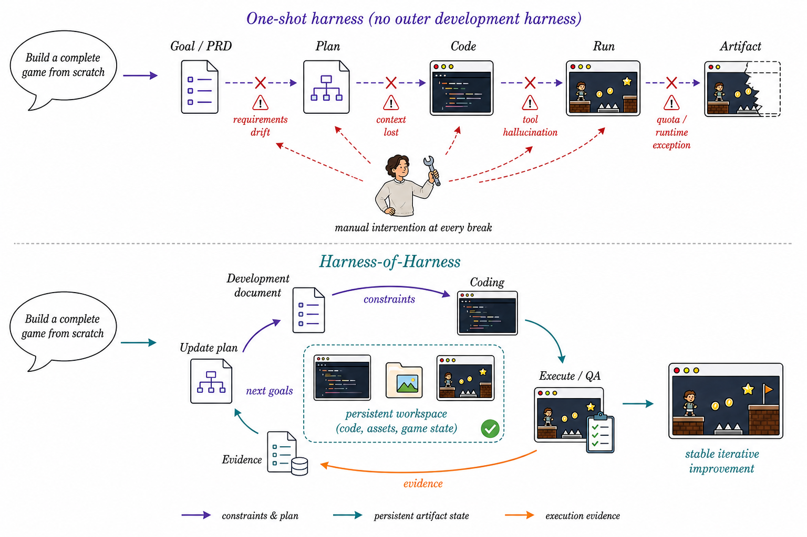

## 제1장 — 원샷의 한계

### 하니스란 무엇인가

코딩 에이전트의 성능을 논할 때 모델만 보면 안 된다. 같은 모델이라도 어떤 하니스에 심느냐에 따라 실전 성과가 크게 갈린다. 하니스는 범용 언어 모델을 쓸모 있는 코딩 에이전트로 바꿔 세우는 운영 틀이다. 모델이 도구를 어떻게 부를지, 문맥과 기억을 어떻게 관리할지, 실행을 어떻게 통제할지, 돌아온 피드백을 어떻게 해석할지, 서브에이전트를 어떻게 조율할지를 하니스가 정한다. Codex, OpenCode, Claude Code 같은 요즘 시스템이 공통으로 갖춘 층이다.

하니스라는 말이 주목받은 건 최근 일이지만, 코딩 에이전트 연구 자체는 오래됐다. 다만 초창기는 함수 완성이나 코드 생성 같은 국소적 보조가 전부였다. 그 뒤로 대규모 코드베이스 탐색, 여러 파일에 걸친 저장소 규모 이슈 해결로 무게중심이 옮겨졌다. 그런데도 이 시기 과제들은 모두 기존 코드베이스를 출발점으로 준다. 환경이 정해져 있고, 목적과 제약이 분명하다.

### 비어 있는 작업 공간의 문제

논문이 겨냥하는 것은 소프트웨어 개발 **from scratch**, 즉 그린필드 개발이다. 요구사항은 높은 수준으로, 그리고 불완전하게 주어진다. 에이전트는 이것을 완전하고 동작하는 소프트웨어 시스템으로 바꿔야 한다. 장기 계획, 조율, 실행, 적응이 소프트웨어 수명주기 전체에 걸쳐 필요하다. 기존 벤치마크가 단일 이슈 해결로 개발을 축소해 온 것과 대비되는, 훨씬 열린 형태의 개발이다.

여기서 질문이 나온다. **기존 코딩 에이전트 하니스를 어떻게 써서 개발 from scratch를 지탱할 수 있는가?**

그림 1-1이 이 전환을 그린다. 위쪽이 관행이다. 하니스를 한 번 실행(원샷)하고, 요구 흐름·문맥 상실·도구 환각·런타임 예외가 터지면 사람이 파손 지점을 살피고, 쓸 만한 상태를 보존하고, 다음 프롬프트를 고쳐 다시 실행한다. 개발이 선형으로 흐르되 고장마다 사람이 붙는 구조다. 아래쪽이 HoH다. 바깥 하니스가 그 사람의 자리를 대신한다. 산출물 작업 공간을 보존하고, 실행 증거를 다음 개발 지시로 바꿔 넣고, 계획-코딩-테스트 순환을 스스로 돌린다.

### 왜 반복인가

실제 소프트웨어 개발은 애초에 증분 과정이다. 개발자는 계획을 고치고, 변경을 구현하고, 결과를 검증하는 일을 수명주기 내내 반복한다. HoH는 이 관찰을 설계 원리로 삼는다. 각 반복을 계획(planning)·코딩(coding)·테스트(testing) 세 단계로 잡는다. 계획은 요구사항과 이전 산출물의 실행 증거를 실행 가능한 개발 계획으로 바꾼다. 코딩은 새 구성요소를 구현·통합하며 기존 산출물을 다듬는다. 테스트는 기능성, 사용성, 미적 품질 등 여러 각도에서 산출물을 평가한다. 그 결과 나온 실행 증거와 갱신된 산출물은 다음 반복으로 넘어간다. 소프트웨어만이 아니라 **개발 결정 자체**가 반복마다 개선되는 자기개선 고리다.

핵심을 좁혀 말하면 이렇다. HoH는 새 하니스를 하나 더 설계한 게 아니다. 이미 검증된 하니스(Codex, OpenCode, Pi 같은)를 그대로 두고, 그것이 참여하는 방식을 구조화한다. 하니스가 모델을 구조화하듯, HoH는 하니스의 참여를 구조화한다.
