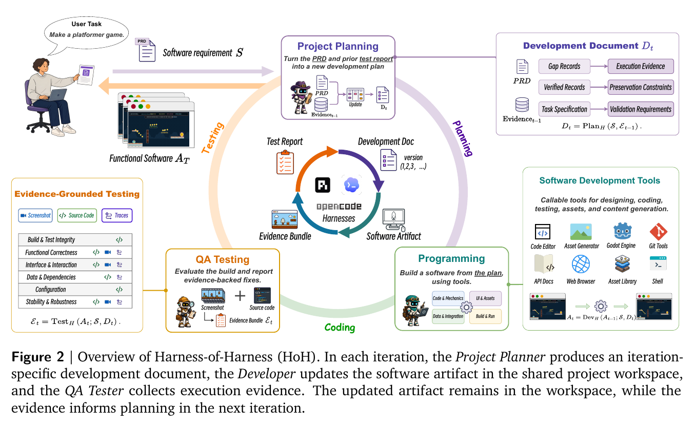

## 제2장 — 세 역할과 하나의 문서

### 문제를 식으로 잡기

논문의 정식화는 담백하다. 하니스-모델 구성을 $H$라 하자. 하니스 구현, 기반 모델, 역할별 지침, 사용 가능한 도구와 런타임 정책이 모두 여기에 들어가며, 실행 내내 고정된다. 공개 과제 명세를 $S$(제품 요구사항 문서 PRD와 공개 보조자료), 초기 소프트웨어 산출물을 $A_0$(빈 작업 공간일 수도, 기존 저장소일 수도), 반복 예산을 $T$라 하면, HoH의 목표는 $S$를 만족하는 최종 산출물 $A_T$를 만드는 것이다.

$$\mathrm{HoH}[H] : (S, A_0, T) \longmapsto A_T$$

요점은 HoH가 $H$ 자체를 바꾸지 않는다는 데 있다. 바뀌는 것은 각 반복에 $H$에 공급되는 산출물과 반복별 문맥이다. 기존 하니스에 대한 투자를 그대로 살리는 설계다.



### 세 역할, 권한은 계층적으로

한 반복 안에서 세 역할이 등장하며, 각 역할은 $H$를 한 번 호출해 인스턴스화된다. 셋이 같은 진화하는 프로젝트 작업 공간을 두고 일하되 권한이 다르다.

- **프로젝트 계획자(Project Planner)** — 산출물을 수정하지 않고 계획만 낸다.
- **개발자(Developer)** — 작업 공간을 수정할 수 있다.
- **QA 테스터(QA Tester)** — 산출물을 살피고 실행할 수 있지만 읽기 전용이다.

역할을 나눈 축은 권한이다. 구현과 수용(acceptance)이 분리되어 있어, 개발자의 자가 점검이 완료 판정의 유일한 근거가 되는 일을 막는다.

반복 $t$에서 계획자는 **개발문서** $D_t$를 만든다. 개발자는 $D_t$를 받아 이전 반복에서 기록된 산출물 $A_{\pi_t}$(보통 직전 반복의 산출물이며, 직후 산출물이 퇴행 판정을 받으면 더 이른 기록 산출물로 물러난다)에서 개발을 이어가 $A_t$를 낸다. QA 테스터는 $A_t$를 $D_t$의 검증 요구사항에 맞춰 실행·점검하고 증거번들 $E_t$를 낸다. $D_t$에는 현재 개발 목표, 보존해야 할 기존 기능, 미해결 이슈, 검증 요구사항이 적힌다.

### 증거번들 — 주장과 근거의 쌍

QA 결과를 그냥 자유 서술 보고서로 두지 않는다. 공개 명세와 개발문서에서 검사 가능한 주장(claim) 집합 $C_t$를 뽑고, 증거번들을 주장-증거 레코드의 집합으로 표현한다.

$$E_t = \{(c_i, r_i, s_i) \mid c_i \in C_t\}, \qquad s_i \in \{\mathrm{verified}, \mathrm{gap}\}$$

$c_i$는 검사 가능한 주장, $r_i$는 그 주장에 대해 개발 중 관측 가능한 실행 기록(빌드·테스트 결과, 런타임 트레이스, 스크린샷, 리플레이, 자산 점검), $s_i$는 QA 판정이다. 인용한 실행 기록이 주장을 충분히 뒷받침할 때만 verified가 되고, 관측된 실패·미충족 요구·회귀 위험·증거 부족은 gap이 된다. 이 레코드 구조 덕분에 QA 발견마다 관측 근거가 붙어 다니고, 다음 반복 계획이 "무엇을 고치고 무엇을 보존할지"를 근거와 함께 결정할 수 있다.

### 닫힌 고리 — 두 개의 상태 채널

반복 사이에서 두 가지 상태가 흘러간다. 진화하는 산출물 $A_t$와 증거번들 $E_t$다. $S$와 $H$는 실행 내내 고정이고 $E_0 = \emptyset$에서 출발하며, 한 반복은 다음처럼 요약된다.

$$(A_{\pi_t}, E_{t-1}) \longmapsto (D_t, A_t, E_t), \qquad t = 1, \ldots, T$$

계획자는 $D_t = \mathrm{Plan}_H(S, E_{t-1})$로 문서를 만든다. gap 레코드는 수정 대상과 후속 검증 요구를, verified 레코드는 보존 제약을 정한다. 증거가 다음 문서의 우선순위를 바꿀 수는 있어도 $S$ 자체를 대체하지는 못한다. 루프는 관측 결과에 적응하되 원래 요구에 정렬된 상태를 유지한다.

개발자는 $A_t = \mathrm{Dev}_H(A_{\pi_t}; S, D_t)$로 개발한다. $D_t$의 정렬된 수정 대상 목록은 빌드 방해 요인과 증거로 확인된 결함을 미충족 요구와 기능 확장보다 앞세우고, 높은 순위가 처리된 뒤 남은 예산을 확장에 쓴다. 보존 제약은 이 모든 변경에 걸쳐 계속 유효하다. 문서의 모든 목표가 $H$ 호출 한 번에 주어지며, 도구 사용과 국소 구현 결정은 하니스 손에 남는다.

QA 테스터는 $E_t = \mathrm{Test}_H(A_t; S, D_t)$로 검증한다. 주장별로 $\mathrm{Observe}(A_t, c_i)$가 실행 기록을 모으고 $\mathrm{Assess}(c_i, r_i)$가 판정을 내린다. 여기서 중요한 제한이 하나 있다. 증거번들은 벤치마크 점수, 은닉 테스트, 평가자 전용 피드백을 **제외**한다. 개발 루프로 평가 신호가 새면 과적합이 되기 때문이다. 중간·최종 산출물 평가는 실행 전체가 끝난 뒤에만 이뤄진다.

전체 절차를 수도코드로 옮기면 다음과 같다.

```
Input : 공개 명세 S, 초기 산출물 A0
Param : 하니스-모델 구성 H (고정), 반복 예산 T
Output: 최종 산출물 AT

E0 ← ∅
for t = 1 .. T:                     # HoH 반복
    Dt ← Plan_H(S, E_{t-1})         # 계획: gap→수정, verified→보존
    At ← Dev_H(A_{π_t}; S, Dt)      # 코딩: 작업 공간에서 이어서
    Ct ← Claims(S, Dt)
    Et ← ∅
    for c_i ∈ Ct:                   # 주장별 검증
        r_i ← Observe(At, c_i)
        s_i ← Assess(c_i, r_i)
        Et ← Et ∪ {(c_i, r_i, s_i)}
return AT
```

반복마다 gap 레코드가 다음 반복의 개발 목표로, verified 기능이 보존 제약으로 이어진다. 산출물 계보와 실행 증거라는 두 채널이 세 역할을 하나의 고리로 묶는다.
