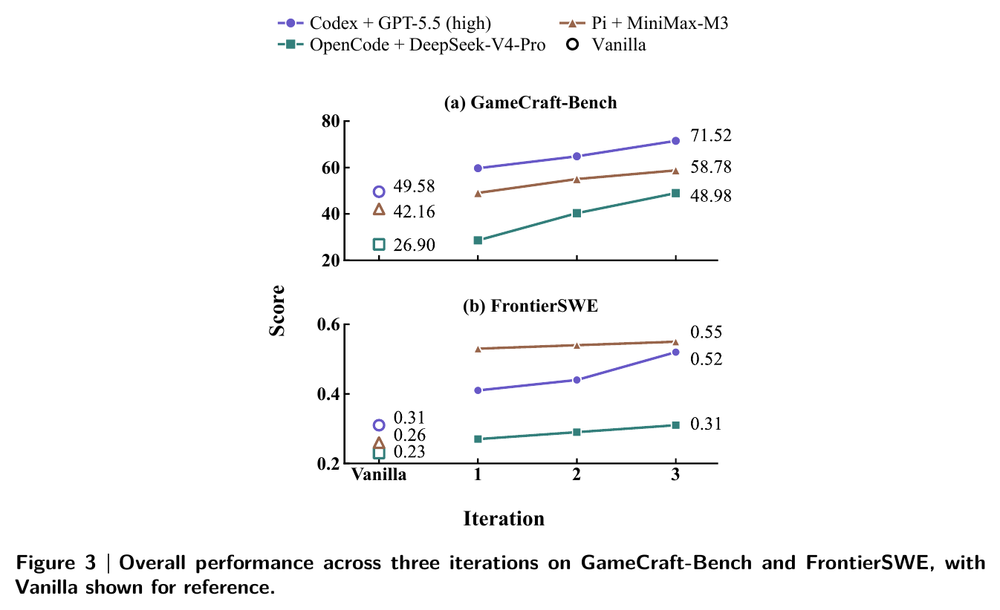
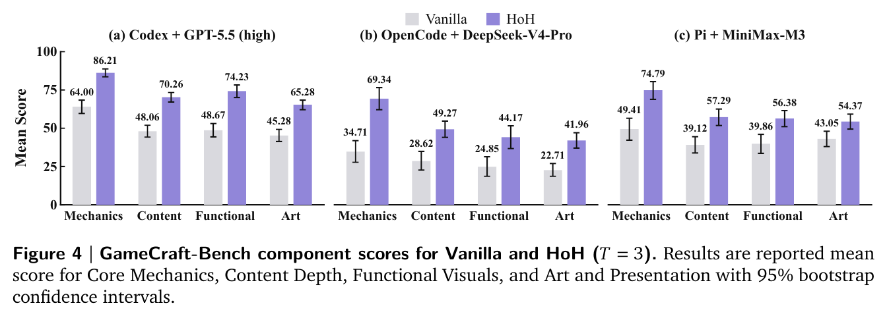
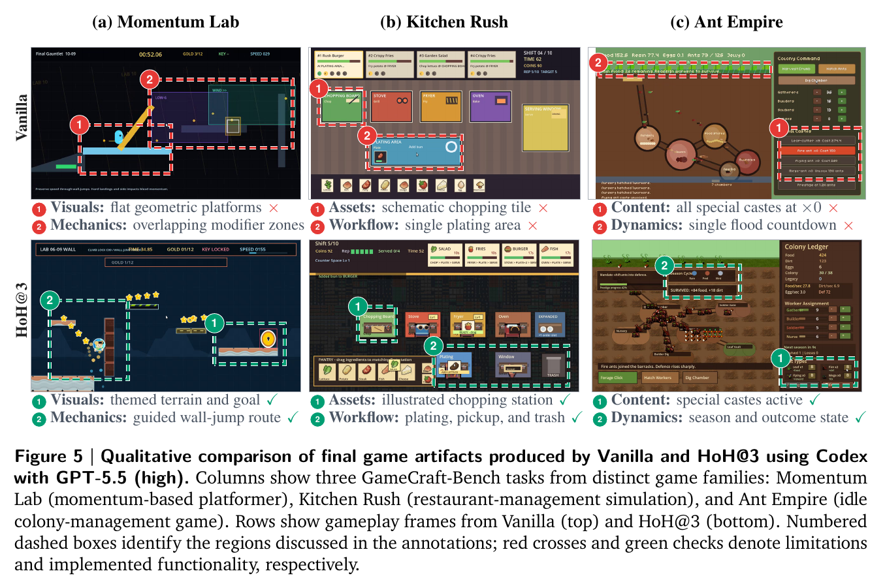
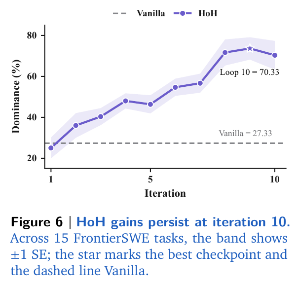

## 제5장 — 숫자가 말하는 것

### 요약표 — 세 벤치마크, 세 구성, 반복별

논문 Table 1에서 대표 지표만 뽑아 옮긴다. GameCraft-Bench는 Overall(0–100), FrontierSWE는 Dominance(%), ProgramBench는 Avg. Test Pass Rate다.

| 구성 | 설정 | GameCraft Overall | FrontierSWE Dominance | ProgramBench Pass Rate |
|------|------|------------------:|----------------------:|-----------------------:|
| Codex + GPT-5.5 (high) | Vanilla | 49.58 | 46% | 60.41 |
| | HoH@1 | 59.71 | 45% | 65.42 |
| | HoH@2 | 64.84 | 49% | 65.79 |
| | HoH@3 | **71.52** | **67%** | **66.50** |
| OpenCode + DeepSeek-V4-Pro | Vanilla | 26.90 | 26% | 45.27 |
| | HoH@1 | 28.61 | 34% | 55.33 |
| | HoH@2 | 40.32 | 47% | 55.66 |
| | HoH@3 | **48.98** | **49%** | **57.56** |
| Pi + MiniMax-M3 | Vanilla | 42.16 | 36% | 35.83 |
| | HoH@1 | 49.06 | 65% | 48.68 |
| | HoH@2 | 55.04 | **68%** | **53.57** |
| | HoH@3 | **58.78** | 66% | 52.68 |

HoH@3는 세 벤치마크 전부, 세 구성 전부에서 Vanilla를 넘는다. GameCraft-Bench Overall 향상은 Codex +21.94, OpenCode +22.08, Pi +16.62점이다. ProgramBench Pass Rate는 +6.09~+16.85점, FrontierSWE 보상은 +0.07~+0.29다.

### 반복은 계속 이득인가

그림 5-1처럼 세 구성의 GameCraft 점수는 반복 1→3 내내 오른다. Pi 구성의 FrontierSWE Dominance는 반복 1에서 이미 36%→65%로 뛰고 2에서 68%로 정점을 찍는다. 반복이 늘수록 이득이 꺾이는 포화 흔적이 일부 구성에 보이지만(GameCraft에서 HoH@2→3 상승폭이 HoH@1→2보다 작다), 어느 구성에서도 반복을 늘려서 손해 보는 셀은 없다.

컴포넌트를 뜯어도 같은 방향이다(그림 5-2). Core Mechanics, Content Depth, Functional Visuals, Art and Presentation 네 항목 모두에서 HoH@$T{=}3$이 Vanilla를 앞선다. 특히 Codex 구성에서 Mechanics는 48.67→86.21로 가장 크게 벌어진다. 반복 개선이 겉모습만 다듬는 게 아니라 게임의 뼈대(메커니즘)까지 끌어올린다는 뜻이다.

### 정성 비교 — 무엇이 실제로 달라졌나

그림 5-3은 Codex + GPT-5.5 구성의 최종 산출물 세 게임을 나란히 놓는다.

- **Momentum Lab**(모멘텀 플랫포머): Vanilla는 평면적 기하 플랫폼에 수정 영역이 겹치는 결함. HoH@3는 테마 지형과 목표 표시, 유도된 월점프 경로를 구현.
- **Kitchen Rush**(레스토랑 경영 시뮬레이션): Vanilla는 개략적인 도마 타일에 조리 구역이 하나뿐. HoH@3는 삽화 도마 스테이션에 조리·픽업·쓰레기 처리 워크플로가 통째로 들어옴.
- **Ant Empire**(유휴 군체 경영): Vanilla는 특수 계급이 전부 ×0 배율로 사실상 부재. HoH@3는 특수 계급이 실제 활성화되고 계절과 결과 상태가 동작.

공통 패턴이 보인다. Vanilla 산출물은 **표면은 있고 내부가 비어 있다**. 존재하지만 배율 0인 기능, 그려졌지만 이어지지 않는 워크플로. HoH 반복은 이 빈 곳을 채운다. 이것이 증거번들의 gap 레코드가 다음 반복의 수정 대상으로 작동한 결과다.

### 예산 통제 비교와 장기 지속성

같은 반복 횟수를 단순 반복 실행(Vanilla continuation)으로 돌리는 **패스 통제 비교**에서도 HoH가 앞선다. 같은 토큰 예산을 줘도 마찬가지다. 반복 구조가 이득인 지점은 추가 호출량이 아니라 **호출 사이를 잇는 상태**임을 보여주는 대조다.

FrontierSWE 15과제에서 반복을 10까지 늘린 추가 실험(그림 5-4)은 이 그림을 확정 짓는다. HoH Dominance는 약 25%에서 시작해 반복 10에서 70.33%까지 오르고, Vanilla 기준선은 27.33%에 머문다. 이득은 반복 3에서 멈추지 않는다.

정리하면 이렇다. HoH의 향상은 한 구성의 우연이 아니라 (1) 세 벤치마크, (2) 세 하니스-모델 구성, (3) 네 품질 컴포넌트, (4) 반복 10까지의 장기 구간에서 일관되게 나타난다. 바뀐 것은 모델도 하니스도 아니고, 반복 사이에 무엇을 남기는가였다.
