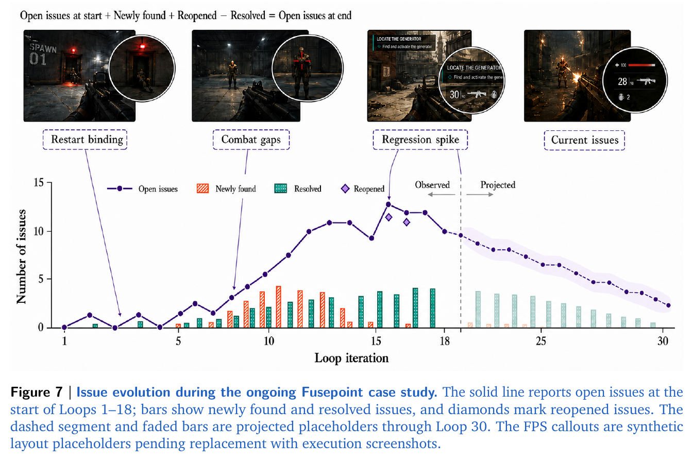

## 제6장 — 진행 중인 사례: 퓨즈포인트

벤치마크 점수 다음으로, 논문은 1인칭 슈팅 게임 **Fusepoint**의 다일 자율 개발을 종단 사례로 진행하고 있다. 이 장을 읽을 때 한 가지를 먼저 짚는다. **이 사례 연구는 원문 집필 시점에도 진행 중이다.** 감사 표와 플레이테스트 점수는 TBD 자리표시자이고, 이슈 곡선의 뒷구간은 투영값이다. 이 책도 확정되지 않은 수치를 확정된 것처럼 쓰지 않는다.

### 설정 — 사람이 남긴 것과 남기지 않은 것

사용자가 PRD를 넘겨준 **뒤로는** 계획, 구현, 디버깅, 검증에 사람의 개입이 전혀 들어가지 않았다. 사람이 개입한 것은 할당량·외부 서비스 가용성 복구뿐이며, 이 개입은 산출물을 바꾸지도 개발 계획을 꺾지도 않았다. 논문이 주장하는 자율성의 범위는 개발 **과정**이지, 지원 인프라의 무중단 운영이 아니라는 점이 정확하다.

에셋 생산은 별도의 병목으로 남았다. 3D 에셋 생성 시도는 비용이 크고 게임에 요구되는 시각 품질에 안정적으로 닿지 못했다. 최종 산출물은 CC0·CC BY 등 개방 라이선스 에셋을 쓰고, 출처·라이선스 메타데이터·요구되는 귀속 표기를 보존한다. 이 사례의 교훈은 담백하다. 생산 품질 에셋을 전부 종단 생성하는 것보다 라이선스 콘텐츠를 통합하는 쪽이 신뢰할 만했다.

### 이슈 장부 — 발견과 재발의 궤적

이슈 장부를 루프 단위로 추적하면 개발 루프가 구현 문제를 발견하고 해결하고 때로는 **다시 열**는 궤적이 요약된다(그림 6-1). 실선은 루프 1–18 시작 시점의 미해결 이슈 수, 막대는 신규 발견·해결 수, 마름모는 재개된 이슈다. 점선 구간과 옅은 막대는 루프 30까지의 투영 자리표시자다. 최종 감사가 끝나면 실행 스크린샷으로 교체될 예정이다.

### 최종 평가 — 세 층으로 나눈 증거

진행 중인 평가 설계 자체가 배울 점이다. 논문은 최종 산출물의 증거를 세 층으로 분리한다.

1. **납품 가능성 게이트** — 깨끗한 빌드, 성공적 실행, 종단 완주, 실패/재시작/리플레이, 반복 실행 안정성.
2. **명시된 PRD 요구 이행** — 월드·에셋 통합, 미션 흐름, 전투·적 AI, 조작·UI·피드백, 연출·완성도.
3. **PRD 너머의 기여** — 추가 기능, 선제적 버그 수정, 경험 개선. 별도 집계.

이 분리의 의도는 명확하다. **선택적 확장이 미충족 요구를 가려서는 안 된다.** 예쁜 부가 기능 목록이 핵심 요구 누락을 덮는 식의 자기보고를 구조적으로 막는다. 감사 표는 HoH의 자기평가(보고됨)와 독립 감사 결과(검증됨)를 나란히 두고, 뒷받침 없는 완료 주장에 경고 표시를 붙인다.

플레이 경험 평가도 준비돼 있다. 출처를 숨긴 소규모 플레이테스트(3–5명, FPS 경험자와 CS·SW·게임개발 배경 혼합)에서 평가자는 같은 빌드와 과제 스크립트로 메인 미션을 한 번 클리어하고 자유 플레이 뒤 채점하며, **AI 개발 출처는 채점 제출까지 공개되지 않는다**. 채점 도구는 PXI(Player Experience Inventory) 30문항 코어 10구성개념 + 별도 Enjoyment 3문항이다. 표본이 작아 기술통계와 개인별 평점만 보고하고 다차원 도구를 단일 점수로 뭉치지 않는다.

### 지금 시점에서 배울 수 있는 것

결과가 TBD여도 설계는 확정돼 있다. 이 사례가 남기는 것은 세 가지다. 첫째, 다일(數日) 자율 개발이 실제로 수십 루프 규모로 운영됐다는 존재 증명. 둘째, 사람 개입을 **인프라 복구로 한정**하는 자율성 정의 — 산출물 개입이 아니라. 셋째, 자기평가와 독립 감사를 갈라놓는 평가 구조. 마지막 하나는 벤치마크 점수를 넘어서는 실전 자율 에이전트의 신뢰 문제에 대한, 가장 실용적인 답이다.
