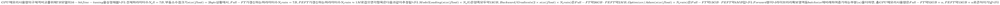
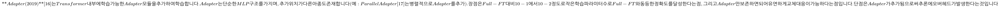
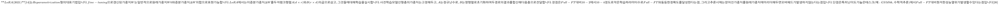

# Day 6 — 대규모 언어 모델 fine-tuning

도쿄대학교 松尾・岩澤 연구실이 작성한 자료로, 2025년 10월부터 11월에 걸쳐 개최된 「LLM 대규모 언어 모델 강좌 기초편」의 강의 자료입니다. 본 자료는 크리에이티브 커먼즈 **CC BY-NC-ND 4.0**(저작자표시 – 비영리 – 변경금지 4.0 국제) 라이선스로 제공됩니다. 재이용 시 반드시 본 라이선스 표기를 기재해 주십시오. 비영리 목적의 재이용이 허락되며, 영리 목적 재이용은 별도 문의가 필요합니다. 원래의 표현이 바뀌지 않는 범위(폰트, 크기 등)라면 개변이 가능하나, 그 외의 개변 및 기타 라이선스 사항은 크리에이티브 커먼즈 라이선스를 확인해 주시기 바랍니다. 재이용하는 부분에 참조 논문 등의 인용이 있는 경우, 권막의 References에서 해당 인용 위치를 게시해 주십시오.

본 장의 강의 파트는 中筋渉太(NAKASUJI, Shota)가 담당했습니다. 그는 싱가포르에서 데이터 사이언스·AI를 활용한 퀀트 리서치 스타트업인 SPEQTRA Investment Research를 공동 창업하여 CIO를 맡고 있습니다. 도쿄대학교 공학부 물리공학과를 졸업하고 동 대학원 공학계열 연구과를 수료했으며, 松尾연구실에서는 공동 연구 프로젝트 및 퀀트 운용 프로젝트의 PM, GCI 강좌 TA·강사, 「이미지 인식」 강좌 교재 개발, 「금융시장 거래와 머신러닝」 강좌 감수·강사를 역임했습니다.

## 도입: fine-tuning이 풀고자 하는 문제

대규모 언어 모델의 성능을 개선하고 다양한 태스크·도메인에 적응시키려는 needs는 계속 커지고 있지만, 막대한 리소스를 요하는 Pre-Training은 많은 주체에게 진입 장벽이 높습니다. 이에 대한 해법으로, 사전학습된 모델을 베이스로 하여 fine-tuning을 수행함으로써 성능 개선과 태스크·도메인 적응을 실현하려는 접근이 등장했습니다. 특히 **Instruction Tuning**을 통해 대화 성능과 Zero/Few-shot 성능을 향상시킬 수 있습니다.

한편, 대규모 언어 모델은 방대한 파라미터를 보유하고 있어, fine-tuning이라 하더라도 모든 파라미터를 다룰 수 없는 경우가 많습니다. 또한 Catastrophic Forgetting이나 과적합으로 인해 사전학습 모델의 성능이 훼손될 우려도 있습니다. 이에 대한 대응으로, 추가로 설정한 파라미터나 일부 파라미터만을 학습·갱신 대상으로 삼음으로써 효율적인 fine-tuning을 실현하는 기법이 등장했는데, 이를 **Parameter Efficient Fine-Tuning(PEFT)**이라 부릅니다.

대표적인 fine-tuning 사례를 살펴보면, 사전학습된 LLM은 높은 성능을 보이지만 반드시 인간의 가치관에 부합하는 출력을 내놓지는 않습니다. **ChatGPT**는 InstructGPT 논문[2]에서 제안된 기법에 따라, Supervised fine-tuning(= Instruction Tuning)과 RLHF(Reinforcement Learning from Human Feedback)를 조합하여 인간의 가치관으로의 정렬을 실현했습니다[1]. **OpenAI API**에서는 자체 데이터셋을 활용한 fine-tuning 기능이 제공되며, 출력 포맷 고정, 이미지 이해와 텍스트 출력, 레이아웃 일관성 강화 등이 용도 예시로 제시됩니다. Prompting과 비교하여 토큰·처리 시간 절약, 응답의 품질·제어성 향상이라는 장점도 언급됩니다[3]. **Med-Gemini**는 Google이 개발한 Gemini를 의료용으로 특화시킨 모델로, 의료 분야에서의 멀티모달 능력이 강화되었으며 각종 벤치마크에서 강력한 결과를 보고했습니다[4].

이상의 사례를 공통으로 관통하는 질문은 "사전학습 모델을 어떻게 용도에 맞게 조정할 것인가"입니다. 본 장의 학습 목표는 세 가지입니다. 첫째, 대규모 언어 모델의 전형적인 학습 흐름에서 fine-tuning이 Pre-Training이나 RLHF·DPO에 대해 어떻게 위치 짓는지 설명할 수 있을 것. 둘째, fine-tuning에서 특히 중요한 접근인 Instruction Tuning과 PEFT가 기존 기법과 어떻게 다른지 설명할 수 있을 것. 셋째, Instruction Tuning과 PEFT의 목적과 내용을 충분히 이해한 바탕 위에서 실제로 이들을 구현하고 대규모 언어 모델의 성능 개선을 실현할 수 있을 것입니다.

## 대규모 언어 모델 학습 흐름에서의 fine-tuning

대규모 언어 모델의 전형적인 학습은 세 단계로 구성됩니다. **Step 1 Pre-Training**은 대규모 코퍼스를 통한 자기 지도학습으로 언어 모델에 어휘·문법·지식 등 기본적인 언어 이해를 획득시키는 단계입니다. **Step 2 Supervised fine-tuning**은 레이블이 있는 데이터를 통한 지도학습으로 언어 모델의 성능을 개선하거나 특정 태스크나 도메인에 대한 적응을 실현하는 단계입니다. **Step 3 RLHF·DPO 등**은 인간의 선호에 기반한 후속 최적화를 통해 언어 모델의 출력이 보다 인간의 가치관에 부합하도록 조정하는 단계입니다. 본 장에서는 이 중 Step 2를 깊이 다룹니다.

Pre-Training과 fine-tuning/Post-Training을 비교하면, 데이터와 목적, 기법이 뚜렷이 다릅니다. Pre-Training은 어휘·문법·지식·추론 능력 등의 언어 능력을 언어 모델에 도입하는 것을 목적으로 하며, 자기 지도학습(Next Token Prediction, Masked Language Model)을 통해 대규모 데이터셋으로 수행됩니다. 예컨대 GPT-3의 CommonCrawl은 410B tokens(570GB)에 달합니다. 반면 fine-tuning/Post-Training은 사전학습 모델의 성능 개선 및 다양한 태스크에 대한 적응을 실현하는 것을 목적으로 하며, 지도학습, 하위 태스크로의 특화, Instruction Tuning, RLHF·DPO 등의 기법이 적용됩니다. 데이터셋은 소규모로, 예컨대 LIMA는 1000 샘플(3MB)에 불과하며, 인간·모델에 의한 피드백이 활용됩니다.

fine-tuning은 다시 두 축 — **태스크 설계(A)**와 **가중치 갱신(B)**— 로 나뉩니다. 태스크 설계 관점에서 종래의 fine-tuning은 특정 하위 태스크에서 지도학습을 실시하며, 주로 하위 태스크용 특수 토큰을 활용합니다(예: 감정 분석·자연어 추론). 반면 **Instruction Tuning**은 지시문을 입력으로 하고 그에 대한 이상적인 출력문을 정답으로 하는 지도학습을 수행하며, 다양한 태스크가 이 입출력 형식에 내포됩니다[5][6]. 가중치 갱신 관점에서 종래의 **Full-FT**는 사전학습 모델이 지닌 각 층 내 모든 파라미터에 대해 갱신을 실시합니다. 보다 확실한 성능 개선이 기대되는 한편 더 많은 컴퓨팅 리소스를 필요로 합니다. 반면 **PEFT**는 추가로 설정한 파라미터나 일부 파라미터만 학습·갱신하므로, 적절히 활용할 수 있다면 적은 리소스로도 성능 개선을 달성할 수 있습니다.

## Instruction Tuning

**Instruction Tuning**이라는 명칭을 널리 알린 것은 Google Research의 FLAN 论文입니다. Wei 등[6]은 다양한 태스크를 지시·답변이라는 입출력 형식으로 통일한 데이터셋으로 언어 모델을 fine-tuning하는 기법을 제안했습니다. 이렇게 fine-tuning된 모델은 평가에 사용된 25개 태스크 중 21개에서 Zero-shot 성능이 향상되었고, 20개 태스크에서는 더 많은 파라미터 수를 가진 GPT-3보다도 높은 Zero-shot 성능을 보였습니다[7]. 입출력 구성을 보면, 입력(Instruction)은 태스크를 지정하는 지시문과 (Optional) 부수적인 보충 정보로 이루어지고, 출력(Instance)은 주어진 지시문에 대한 이상적인 답변 예입니다. 예컨대 `"Víte, rozhodl jsem se, že si pořídím psa. Translate to English"`라는 지시문에 대해 `"You know, I decided to get a dog."`라는 정답이 짝을 이룹니다[8].

Instruction Tuning의 유효성은 두 사례에서 확인됩니다. FLAN[6]에서는 137B 모델에 Instruction Tuning을 적용한 결과, 파라미터 수에서 크게 앞서는 GPT-3의 Zero-shot 및 Few-shot 성능을 뛰어넘는 Zero-shot 성능을 보였습니다. Alpaca[9]에서는 Meta의 LLaMA 7B 모델에 Instruction Tuning을 적용하여, 파라미터 수에서 크게 앞서는 GPT-3.5와 동등 수준의 지시 응답 거동으로 개선했습니다. 예컨대 "What is an alpaca? How is it different from a llama?"라는 입력에 대해 종·체형·털의 차이를 서술하는 자연스러운 답변이 생성됩니다.

그러나 Instruction Tuning에는 두 가지 근본적 어려움이 있습니다. 첫째는 **데이터셋 작성상의 곤란**입니다. 바람직한 거동을 실현하기 위해서는 고품질이고 무해한 데이터셋의 마련이 필요한데, 이를 사람이 직접 작성할 것인지, 기존 데이터셋을 활용할 것인지, 아니면 LLM으로 생성할 것인지를 두고 저마다의 trade-off가 있습니다. 나아가 지시에 포함된 개별 태스크나 형식의 다양성의 중요성도 지적되고 있어, 이러한 다양한 관점을 고려하며 데이터셋을 구축하려면 많은 인적·기술적 리소스가 필요합니다. 둘째는 **지식은 도입 가능한가**라는 물음입니다. LIMA(2023)[10]는 fine-tuning이 사전학습에서 획득된 지식·능력을 "끌어냄"으로써 성능 개선을 실현한다는 **Superficial Alignment Hypothesis**를 제창했습니다. 이 가설이 옳다면, Instruction Tuning에 의한 성능 개선은 태스크의 이해를 통한 것이 아니라 출력 형식 같은 표면적 사항의 학습에 기인할 가능성도 있다는 지적(Kung and Peng, 2023)[9]이 성립합니다.

이러한 어려움에 대응하기 위해 Instruction 데이터셋 구축에서는 세 가지 요점이 강조됩니다. 첫째, **데이터의 질**입니다. LIMA[10]는 Instruction Tuning에서는 데이터의 양보다 질이 중요하다고 주장하며, 1000건이라는 소량의 고품질 데이터만으로 RLHF로 학습된 모델보다 고품질의 답변을 생성할 수 있었음을 보고했습니다. 둘째, **데이터의 무해성**입니다. 사전학습 모델에서 우려되는 유해한 출력을 억제하기 위해, Instruction Tuning에서는 유해한 데이터를 피해 학습을 실시합니다. Llama 2[11]는 무해한 데이터셋 구축의 실례를 제시합니다. Meta가 개발·공개하는 이 모델(7B, 13B, 70B 변형 포함)은 안전성 향상을 목적으로 인간에 의한 어노테이션과 평가를 적극적으로 채용했습니다. 어노테이터는 복수의 테스트로 자질과 적성을 평가받아 선정되며, 선정된 어노테이터에게는 **Informative·Relevant·Harmless·Truthful·Clear**를 만족하는 지시문·답변의 작성이 의뢰됩니다. 지시문 작성에서는 범죄 행위의 조장, 공격적인 언행의 조장 등 피해야 할 항목이 명시됩니다. 셋째, **지시 형식의 다양성**입니다. 태스크별 지시 형식의 다양화로 미지 태스크에 대한 성능이 향상됨이 확인되었습니다[12].

데이터셋 구축 기법은 크게 세 가지로 나뉩니다. 첫째, **기존 레이블 데이터셋의 통합**입니다. FLAN[6]은 62개의 데이터셋을 템플릿을 이용해 변환·통합했습니다. 둘째, **인간에 의한 데이터 작성**입니다. InstructGPT[2]는 인간이 작성한 지시문에 대해 인간이 답변을 작성했습니다. 셋째, **LLM에 의한 데이터 생성**입니다. Self-Instruct[13]는 LLM에 의한 지시문과 답변 생성 프레임워크를 제안했습니다.

## Parameter Efficient Fine-Tuning

PEFT의 필요성은 Full-FT의 비용에서 비롯됩니다. Full-FT는 사전학습 모델의 모든 파라미터에 대해 다른 태스크에서 갱신을 실시하므로, 대규모 모델에서는 막대한 컴퓨팅 리소스가 필요합니다(예: GPT-3는 1.2TB의 GPU 메모리). 또한 원 모델과 동일 크기의 파라미터를 보존해야 하므로 큰 보존 영역이 필요합니다(예: GPT-3는 350GB의 보존 영역). 반면 PEFT는 추가로 설정한 파라미터나 일부 파라미터만으로 갱신을 실시하여, 대규모 모델에 대해서도 제한된 컴퓨팅 리소스로 성능 개선을 실현합니다. 예컨대 GPT-3 LoRA는 350GB의 GPU 메모리로 동작하며, 갱신 부분의 파라미터만 보존하면 되므로 보존 영역은 35MB에 불과합니다[14].

PEFT 기법을 평가할 때는 네 가지 관점이 중요합니다. 첫째, **성능 개선** — Full-FT를 실시한 경우와 비교하여 성능 개선에 큰 열화가 없는가, 그리고 사전학습 모델의 크기에 의존하지 않고 성능 개선이 실현되는가입니다. 둘째, **운용성** — 갱신하는 파라미터가 적고 작은 스토리지로 운용이 가능한가입니다. 그것이 가능하면 복수 모델의 병렬 운용이나 버저닝이 용이해집니다. 셋째, **추론 효율** — 추가하는 파라미터가 많아 추론 비용을 증대시키지 않는가, 그리고 입력문의 계열 길이가 길어져 추론 비용을 증대시키지 않는가입니다. 넷째, **학습 효율** — 학습하는 파라미터가 적고 작은 GPU 메모리로도 실현 가능한가, GPU의 효율적 활용에 의해 고속화가 가능한 기법인가입니다. 여기서 "학습하는 파라미터는 적지만, 그에 기반하여 많은 파라미터가 갱신된다"는 경우가 있기 때문에, "갱신하는 파라미터"와 "학습하는 파라미터"라는 비슷한 표현을 구별하여 사용합니다.

Lialin 등[15]은 다양한 PEFT 기법을 추론 시의 오버헤드 관점에서 분류합니다. FFN 층을 추가하는 기법(Extra FFN)은 추론에 오버헤드를 수반하고, 입력 계열에 무언가를 추가하는 기법(Extra input)도 추론에 오버헤드를 수반합니다. 반면 어떤 기법은 추론에 오버헤드를 수반하지 않습니다(No overhead). 이 분류를 따라 PEFT 기법은 대략 네 가지 카테고리로 정리됩니다. **Adapter형**은 Transformer 내부에 MLP 층(Adapter)을 추가하고 그것만 학습합니다(대표 예: Adapter, 2019). **Soft Prompt형**은 입력 계열에 태스크별 벡터(Soft Prompt)를 부가하고 학습합니다(대표 예: Prompt Tuning, 2021). **Selective형**은 사전학습 모델이 지닌 파라미터 중 일부만으로 학습합니다(대표 예: BitFit, 2021). **Reparametrization형**은 행렬 분해에 기반해 재파라미터화된 가중치에 대해 학습합니다(대표 예: LoRA, 2021).

## 대표적인 PEFT 기법들

**Prompt Tuning(2021)**[18]은 각 태스크에 대응한 벡터(Soft Prompt)를 입력 계열에 부가하고 그 파라미터를 학습합니다. Soft Prompt는 문장 형태로 설계된 프롬프트(Hard Prompt)에 대한 호칭·개념으로, 즉 각 태스크마다 특화된 프롬프트 엔지니어링을 학습하고 있다고 간주할 수 있습니다. 장점은 모델 크기가 큰 경우 Full-FT와 동등한 정확도를 달성한다는 점입니다. T5-XXL(11B)에서 Soft Prompt 길이를 100으로 하면 학습 파라미터 수는 4096 × 100로, 이는 Full-FT의 0.007%에 해당합니다. 단점은 Soft Prompt가 입력 계열을 압박한다는 점과, 프롬프트 엔지니어링의 확장으로 간주하면 해석성이 결여된 결과가 된다는 점입니다.

**BitFit(2021)**[19]은 Transformer의 각 모듈에 포함된 바이어스 항에 대해서만 학습·갱신을 실시합니다. 구체적으로 Attention, Feed-Forward Network, Layer Normalization에 포함된 바이어스 항이 해당합니다. 장점은 학습 데이터 수가 작은 영역에서는 Full-FT보다 높은 정확도를 보였다는 점이며, BERT(Base) 모델에서 BitFit에 의한 학습 파라미터 수는 Full-FT 대비 0.1% 정도입니다. 단점은 GPT-3 같은 보다 대규모 모델에서는 Full-FT나 다른 PEFT 기법보다 정확도가 뒤떨어진다는 점입니다[14].

LoRA 적용 시 두 가지 실무적 질문이 있습니다. 첫째, 학습 파라미터 수를 일정하게 할 때 LoRA를 적용하는 층의 종류를 더 늘려야 할까, 랭크 r을 더 크게 잡아야 할까? LoRA를 적용하는 층의 종류를 늘리는 쪽이, 랭크 r이 작아지더라도 더 높은 성능이 된다는 것이 밝혀졌습니다. LoRA 논문에서는 Attention 모듈 내(Query·Key·Value·Output projection)를 적용 대상으로 했으나, 이후 연구에서는 다른 선형 층도 대상으로 함으로써 성능이 개선됨이 확인되었습니다. 둘째, LoRA를 적용하는 층의 종류를 고정해 놓고 생각할 때, 랭크 r은 어느 정도의 값을 설정할 필요가 있는가? LoRA의 랭크 r은 2에서 8 범위에서 높은 성능을 보이며, 태스크 의존적이지만 랭크 1로도 충분한 성능이 나오는 경우도 있습니다. 경험적으로는 랭크 8 정도의 설정이 권장되고 있습니다.

LoRA에는 세 가지 파생 접근이 있습니다. **QLoRA**[21]는 보다 적은 컴퓨팅 리소스로도 LoRA에 의한 fine-tuning을 실현하고자, LoRA에 4비트 양자화 등의 기법을 적용해 메모리 사용량을 더욱 절감합니다. **AdaLoRA**[22]는 LoRA에서 모든 층의 랭크가 단일 값으로 제한되는 문제를 해결하기 위해, 증분 가중치의 특이값 분해에 기반해 층마다 랭크를 적응적으로 변화시킵니다. **LoRA-Pro**[23]는 Full-FT의 기울기를 근사하지 못하는 문제를 완화하고 Full-FT와의 성능 차이를 좁히기 위해, LoRA의 두 저랭크 행렬의 기울기가 전체 기울기에 부합하도록 이론적으로 최적 조정을 수행합니다.

대표적인 PEFT 기법을 종합적으로 비교하면 다음과 같습니다[15]. 성능 개선 측면에서 Adapter와 LoRA는 비교적 안정적이나, Prompt Tuning은 불안정한 경향이 있고 BitFit은 대규모 모델에서 열화가 있습니다. 운용성(갱신률)은 Adapter와 Prompt Tuning이 0.1~6%, BitFit이 약 0.1%, LoRA가 0.05~0.1% 수준입니다. 추론 효율 측면에서 Adapter는 추론 시간 증가가 태스크에 의존하고, Prompt Tuning은 입력 계열 길이 압박이 있으며, LoRA는 추론 시 변화가 없습니다. 학습 효율(학습률)은 Adapter와 Prompt Tuning이 0.01~0.5%, BitFit이 ~0.5%, LoRA가 0.01~0.5% 수준으로, 대체로 PEFT 기법들은 Full-FT 대비 수십~수만 분의 일 수준의 파라미터만으로 유사한 성능을 달성합니다.

## 정리

다시 ChatGPT 사례로 돌아가 봅시다. ChatGPT는 InstructGPT 논문[2]에서 제안된 흐름에 따라 Supervised fine-tuning(= Instruction Tuning)과 RLHF를 채택했습니다. InstructGPT에서는 인간이 Instruction Tuning용으로 약 1만 건의 데이터를 작성했으며, 이를 통해 인간적 가치관으로의 출력 정렬을 실현했습니다[1]. 같은 맥락에서 OpenAI API는 자체 데이터셋을 활용한 fine-tuning을 제공하며, Med-Gemini는 의료 도메인 특화를 위해 fine-tuning과 도메인 적응을 수행한 사례입니다[3][4].

본 장의 세 가지 목표를 되돌아봅니다. 첫째, 대규모 언어 모델의 학습 흐름(Pre-Training → Supervised fine-tuning → RLHF·DPO)에서 fine-tuning의 위치를 이해했습니다. 둘째, Instruction Tuning이 지시·답변 형식의 지도학습으로 Zero-shot 성능과 지시 응답 성능을 향상시키는 메커니즘과, PEFT가 일부 파라미터만 갱신하여 효율적 성능 개선을 달성하는 차이를 설명했습니다. 셋째, Instruction Tuning과 PEFT의 목적과 내용을 바탕으로 실제 구현과 성능 개선을 실현할 수 있는 기반을 갖추었습니다. 본 장에서 다룬 Instruction Tuning과 PEFT는 사전학습 모델을 용도에 맞게 조정하는 핵심 기법이며, 다음 단계에서는 이들을 실제로 구현하는 실습이 이어집니다.

## References

[1] OpenAI (2023), "Introducing ChatGPT", https://openai.com/ja-JP/index/chatgpt/ 액세스일: 2026/5/24

[2] Ouyang, Long, et al. (2022), "Training language models to follow instructions with human feedback", Advances in Neural Information Processing Systems 35, pp. 27730-27744

[3] OpenAI (2024), "Fine-tuning now available for GPT-4o", https://openai.com/ja-JP/index/gpt-4o-fine-tuning/ 액세스일: 2026/5/24

[4] Saab, Khaled, et al. (2024), "Capabilities of gemini models in medicine", arXiv:2404.18416

[5] PyTorch Tutorial, "Dynamic Quantization on BERT", https://docs.pytorch.org/tutorials/index.html 액세스일: 2026/5/24

[6] Wei, Jason, et al. (2021), "Finetuned language models are zero-shot learners", arXiv:2109.01652

[7] Google Research (2021), "Introducing FLAN: More generalizable Language Models with Instruction fine-tuning", https://research.google/blog/introducing-flan-more-generalizable-language-models-with-instruction-fine-tuning/ 액세스일: 2026/5/24

[8] HuggingFace, "flan2021_submix_original", https://huggingface.co/datasets/conceptofmind/flan2021_submix_original 액세스일: 2026/5/24

[9] Taori, Rohan, et al. (2023), "Alpaca", Stanford Center for Research on Foundation Models, https://crfm.stanford.edu/2023/03/13/alpaca.html 액세스일: 2026/5/24

[10] Zhou, Chunting, et al. (2023), "Lima: Less is more for alignment", arXiv:2305.11206

[11] Touvron, Hugo, et al. (2023), "Llama 2: Open foundation and fine-tuned chat models", arXiv:2307.09288

[12] Sanh, Victor, et al. (2021), "Multitask prompted training enables zero-shot task generalization", arXiv:2110.08207

[13] Wang, Yizhong, et al. (2022), arXiv:2212.10560

[14] Hu, Edward J., et al. (2021), "LoRA: Low-rank adaptation of large language models", arXiv:2106.09685

[15] Lialin, Vladislav, Vijeta Deshpande, and Anna Rumshisky (2023), "Scaling down to scale up: A guide to parameter-efficient fine-tuning", arXiv:2303.15647

[16] Houlsby, Neil, et al. (2019), "Parameter-efficient transfer learning for NLP", International Conference on Machine Learning, PMLR

[17] He, Junxian, et al. (2021), "Towards a unified view of parameter-efficient transfer learning", arXiv:2110.04366

[18] Lester, Brian, Rami Al-Rfou, and Noah Constant (2021), "The power of scale for parameter-efficient prompt tuning", arXiv:2104.08691

[19] Zaken, Elad Ben, Shauli Ravfogel, and Yoav Goldberg (2021), "BitFit: Simple parameter-efficient fine-tuning for transformer-based masked language-models", arXiv:2106.10199

[20] anyscale (2023), "fine-tuning LLMs: LoRA or Full-Parameter? An in-depth Analysis with Llama 2", https://www.anyscale.com/blog/fine-tuning-llms-lora-or-full-parameter-an-in-depth-analysis-with-llama-2 액세스일: 2026/5/24

[21] Dettmers, Tim, et al. (2023), "QLoRA: Efficient finetuning of quantized LLMs", arXiv:2305.14314

[22] Zhang, Qingru, et al. (2023), "Adaptive budget allocation for parameter-efficient fine-tuning", arXiv:2303.10512

[23] Wang, Zhengbo, et al. (2024), "LoRA-Pro: Are low-rank adapters properly optimized?", arXiv:2407.18242