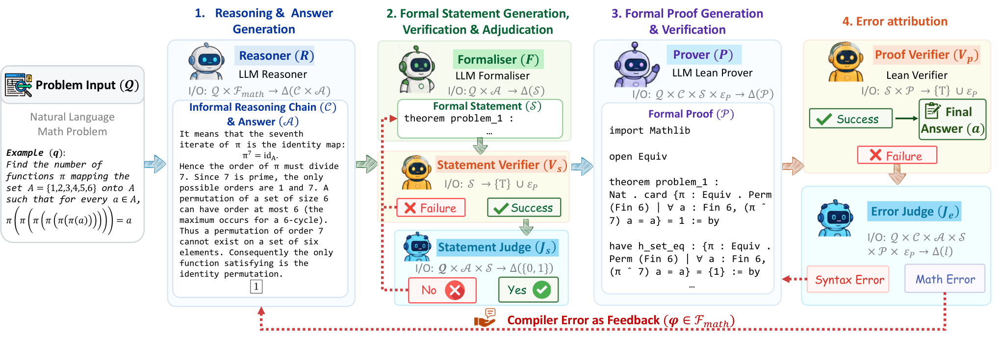

## 검증 없는 답은 반쪽이다

수학 지식의 대부분은 지금까지 자연어로 전달되어 왔다. 교과서의 정의도, 논문의 정리도, 칠판 앞의 강의도 모두 비형식의 언어로 쓰여 있다. 기호를 나열하는 듯해도 그 사이사이는 말로 메워져 있고, 독자는 말로 쓰인 부분을 저마다의 이해로 채운다. 대형 언어 모델(LLM)은 이 언어에 놀랍도록 능숙하다. 그래서 비형식 수학 추론에서 눈에 띄는 성적을 낸다. 그러나 강하다는 말과 완벽하다는 말은 다르다. 추론 사슬 어딘가에는 언제나 근거 없는 비약이 남고, 비형식 추론 안에는 이 비약을 걸러낼 검문소가 없다. 그럴듯하게 읽히는 단계와 옳은 단계 사이의 간격이 사람 눈에만 걸린다.

논문은 여기서 문제를 정면으로 짚는다. 언어 모델을 비형식 추론에만 가두어 두면, 기계가 제공하는 이산적 검증의 기회를 통째로 놓치게 된다는 것이다. 증명 보조기 Lean 4는 명제와 증명을 받아 문법과 논리를 기계가 검사한다. 사람이 눈으로 대조하던 검산을 기계가 기준 없이 일관되게 끝낸다. 증명이 검사를 통과하면 그 옳음은 판독자의 주관과 무관하게 고정된다. 이 검증 신호를 비형식 추론 과정 안으로 끌어들이면 어떻게 될까. 논문이 내놓은 답이 Magenta다. Lean의 신호를 추론의 고리에 이어 붙여, 검증이 실패하면 그 이유를 읽어 다시 추론하는 폐루프를 만든다.

Magenta는 학습 없이(training-free) 작동하는 에이전틱 파이프라인이다. 파인튜닝도, 가중치 수정도 없다. 프롬프트와 도구의 조립만으로 자연어로 쓰인 문제 하나를 받아 세 가지 산출물을 잇달아 내놓는다. 답, 그 답을 Lean 4 명제로 옮긴 것, 그리고 기계 검증을 통과시킨 증명. 학습이 없다는 말은 곧 접근법의 성질을 말한다. 검증기와의 결합이 모델 안쪽이 아니라 바깥에서 이루어지므로, 어떤 언어 모델을 꽂아도 같은 파이프라인이 돈다. 이 세 산출물은 쇄사슬처럼 묶여 있다. 답이 흔들리면 명제가 무너지고, 명제가 무너지면 증명이 무의미해진다. 반대로 증명이 통과하는 순간 앞의 두 고리도 함께 굳어진다. 세 고리 중 하나만 맞는 답은 반쪽이다. 이 장의 제목이 그 뜻이다.

그림 1은 가로로 길게 눕힌 초와이드 한 장이다. 왼쪽 끝의 자연어 문제에서 출발한 흐름이 오른쪽 끝의 기계 검증 증명까지 한 줄로 달린다. 문제가 추론을 만나 답을 낳고, 답이 명제로 번역되고, 명제에 증명이 붙고, 증명이 판사 앞을 지나며, 필요하면 흐름이 다시 왼쪽으로 되감긴다. 가로로 길게 눕힌 판형은 이 일방통행의 흐름을 강조하기 위한 선택으로 읽힌다. 검증이 실패하는 지점마다 흐름이 되감기는 되돌림 화살표가 아래쪽을 차지한다. 파이프라인 전체의 지형을 한눈에 보여 주는 약도로 삼으면 된다.

그림 왼쪽 끝 문제 입력에서 AIME 2026 문제 하나가 시작된다. 여섯 원소 집합에서 π⁶이 모든 원소를 항등으로 되돌리는 치환의 개수를 묻는 문제다. 초기 추론은 π⁷라는 결론에 도착해 검증에 실패하고, 오류 귀인 판사는 이 실패의 책임이 Lean 문법이 아니라 수학에 있다고 판정한다. 실패 궤적을 물려받은 재도출이 π⁶로 바로잡는다. 부록의 예제가 이 장면의 배경이다. 1부터 6까지 여섯 수의 집합 위에서 치환을 거듭 곱한 결과를 따지는 문제로, 추론은 치환을 순환들의 곱으로 분해하고 각 유형을 하나씩 세어 답 396에 도착한다. 산식은 굳이 여기서 재현하지 않겠다. 요지는 두 가지다. 첫 추론의 지수가 하나 틀렸고, 기계 검증과 판사의 귀인이 그 틀림을 사람 손 없이 고쳤다는 것. 검증이 없었다면 π⁷라는 답이 그럴듯한 서사와 함께 그대로 나왔을 것이다.

이 폐루프의 성적은 논문의 도입부에서 이미 확인된다. AIME 2025와 AIME 2026, HMMT 2026 2월 대회로 이루어진 93문제 전부에서 Magenta를 얹은 추론기들이 100퍼센트의 검증 정확도를 기록했고, 오픈 웨이트(open weight) 7B 추론기 K2-Horizon-7B와 결합했을 때는 IMO 2026 여섯 문제 전부를 해냈다. 학습을 하나도 하지 않고 이루어진 성적이라는 점이 이 결과를 더 인상적으로 만든다. 논문의 분석은 또 하나를 일깬다. 명제 심사가 없으면 기계 검증을 통과한 증명조차 거짓 증명서가 되고, 검증 피드백을 받아 고치는 방식이 무작정 다시 뽑는 방식을 이긴다. 폐루프를 이루는 부품이 하나라도 빠지면 완승이 무너진다는 뜻이다.

그림 오른쪽으로 늘어선 직함들이 각각 무슨 일을 하고 무슨 판정을 내리는지가 다음 장의 본론이다. 리즈너(reasoner)와 형식화기, 두 검증기와 증명기, 그리고 두 판사까지 일곱 명의 역할 분담을 하나씩 해부해 보자.
