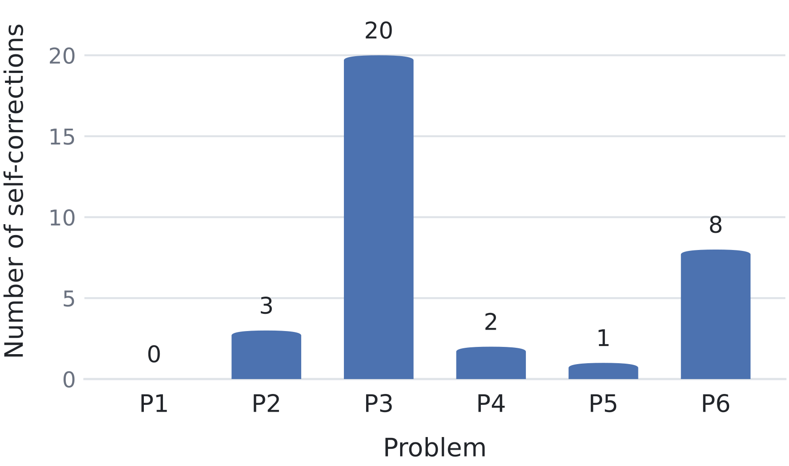
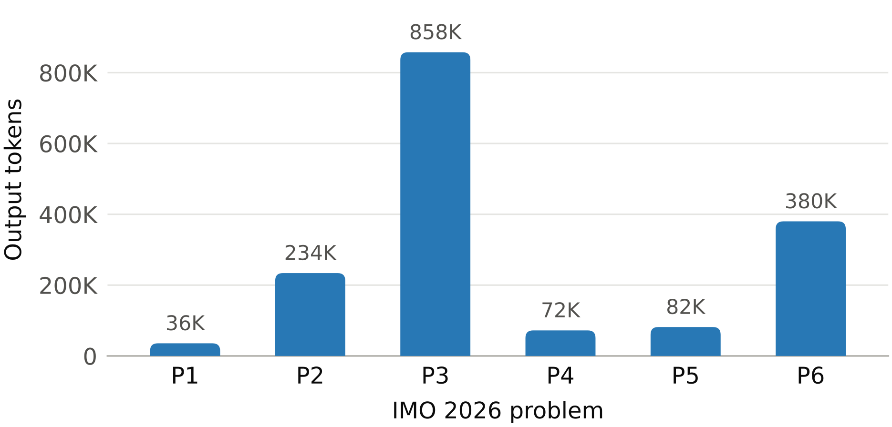

## 7B가 IMO를 넘었다

앞 장의 표가 AIME과 HMMT의 완승이었다면, 이 장은 그 위에 얹은 최고 난도의 시험을 본다. IMO 2026 여섯 문제. 오픈 웨이트 진영의 소형 모델이 이 무대에서 기계가 검증한 증명서를 받았다는 사실이 이 장의 결론이다.

### 여섯 문제, 여섯 증명서

K2-Horizon-7B를 추론기로 세운 채 Magenta를 돌리자, IMO 2026 여섯 문제 전부에서 Lean이 받아들이는 증명이 완성됐다. 프런티어 모델의 전유물로 여겨져 온 무대에서 이름의 규모가 가장 작은 모델이 증명서를 받아 든 것이다. Magenta가 학습 없이 검증 루프만으로 만든 성과라는 점을 상기하면, 이 결과는 모델을 키우지 않고 난도를 넘는 길이 실제로 있음을 보여 준다. 물론 여섯 문제가 고르게 풀린 것은 아니다. 문제마다 루프가 도는 횟수가 크게 달랐고, 그 편차가 다음 절의 주제다.

### 자기수정의 편차

그림 2는 여섯 문제 각각에서 자기수정이 몇 번 일어났는지 보여 준다. 값은 차례로 0회, 3회, 20회, 2회, 1회, 8회이고 평균은 5.7회다. 최댓값과 최솟값의 격차가 20에 이른다. 어떤 문제는 처음 세운 증명이 한 번도 틀리지 않았고, 어떤 문제는 스무 번을 고쳐야 겨우 통과했다. 루프가 길게 도는 풍경이 곳곳에서 벌어진 셈이다. 같은 시스템, 같은 예산을 놓고 봐도 문제의 성격이 수정량을 결정한다는 사실이 이 그림의 요점이다.

IMO가 아니라 정답식인 AIME 2026에서 같은 지표를 보면 평균 자기수정이 K2-Horizon-7B는 5회, K2-Horizon-375B는 2회다. 작은 모델이 더 많이 돈다. 이 격차는 그림 2의 편차와 같은 방향을 가리킨다. 정제 라운드 표로 옮기면 그 방향이 더 뚜렷해진다.

### 정제 라운드의 대조

정제 라운드는 검증 실패 이후 증명이 고쳐지는 횟수를 센 지표이고, 초기 시도를 1로 계산한다. 표 7-1은 원문 부록의 정제 라운드 표를 옮긴 것이다.

표 7-1 모델·데이터셋별 정제 라운드(평균/최대, 초기 시도 1 포함)

| 데이터셋 | 7B 평균 | 7B 최대 | 375B 평균 | 375B 최대 |
|---|---|---|---|---|
| AIME 2025 | 1 | 3 | 1 | 1 |
| AIME 2026 | 2 | 5 | 1 | 2 |
| HMMT 2026 | 3 | 10 | 1 | 2 |

표를 두 진영으로 나눠 읽으면 대비가 선명하다. K2-Horizon-375B는 어느 데이터셋에서도 평균 1회, 최대 2회 안에 머문다. 반면 K2-Horizon-7B는 AIME 2025에서 평균 1회와 최대 3회로 시작해, AIME 2026에서 평균 2회와 최대 5회, HMMT 2026에서 평균 3회와 최대 10회로 다섯 배까지 벌어진다. 같은 문제를 같은 시스템으로 풀되, 두부의 크기가 반복 횟수를 대신 내는 그림이다. 앞 절의 AIME 평균 5회와 2회가 이 표에서 같은 방향으로 확인되는 셈이다. 수정이 공짜는 아니므로, 이제 비용의 척도인 토큰으로 눈을 옮긴다.

### 토큰으로 본 IMO

그림 6은 IMO 솔루션이 소비한 리즈너 토큰을 문제별로 보여 준다. 실험 설계 장에서 IMO 출력 상향을 적어 두었던 사실이 여기서 의미를 얻는다. IMO에서만 리즈너 최대 출력을 64,000토큰에서 128,000토큰으로 올렸다. 그림 2에서 봤듯 스무 번을 고쳐야 하는 문제가 있었으니, 한 번의 응답에 담을 사고의 길이를 두 배로 늘린 것은 긴 루프를 감당하기 위한 조치였다고 읽힌다. 실제로 여섯 문제 가운데 문제 3과 문제 6이 압도적으로 큰 예산을 썼고, 이는 자기수정이 각각 20회와 8회로 가장 많았던 두 문제와 정확히 겹친다. 수정이 많은 문제일수록 토큰이 크게 불어나는 건 자연스러운 귀결이고, 그림이 그 폭을 고스란히 보여 준다.

### 부록에 실린 여섯 증명

원문 부록에는 여섯 문제 전체의 Lean 인증 풀이가 그대로 수록돼 있다. 본문에서는 그 성격만 소개하고 마친다. 치환을 다루는 문제, 삼각형과 여러 점의 거리 등식을 확정하는 기하 문제, 함수방정식 등이 섞여 있었고, 풀이마다 대수적 조작과 구조 파악의 비중이 달랐다. 어떤 풀이가 어떤 수정 횟수를 냈는지 번호로 짝지어 단정하지 않는 것은, 원문이 번호와 주제를 나란히 세워 두지 않기 때문이다. 수치로 확실한 것은 그림 2의 수정 횟수와 표 7-1의 정제 라운드뿐이다.

여기까지가 완승의 보고다. 다만 이 성과가 공짜였던 것은 아니다. 다음 장에서는 완승을 떠받친 비용의 이야기를 연다. 명제가 어떻게 만들어지고 얼마나 갈려 나가는지, 명제 생성의 경제학을 들여다본다.
