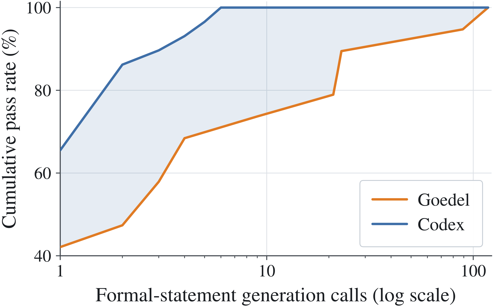
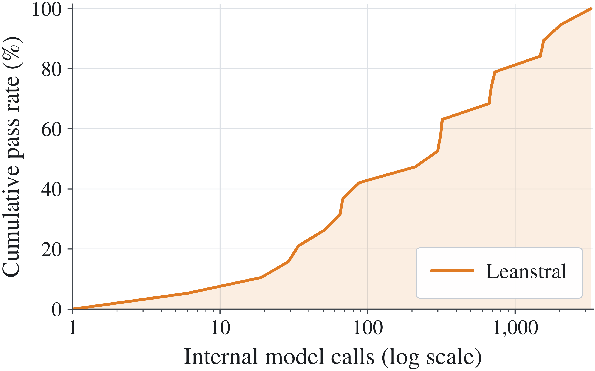

## 명제 생성의 경제학

증명기가 아무리 많은 시도를 허용해도, 그 앞에 형식 명제가 없으면 시작조차 없다. Magenta의 비용은 증명 단계보다 한 발 앞인 명제 생성 단계에서 먼저 갈린다. 이 장은 자연어 문제를 Lean 명제로 바꾸는 형식화 단계를 경제학의 눈으로 읽는다. 누가 몇 번의 호출로 커버리지를 만드는지, 반복 호출은 커버리지를 어떻게 사들이는지, 그리고 서로 다른 두 시스템을 공정하게 재는 잣대는 무엇인지를 차례로 본다.

### 형식화기의 값어치는 호출당 성공률로 갈린다

같은 추론기에 서로 다른 형식화기(formaliser)를 얹으면 필요한 호출 수가 수십 분의 일로 변한다. 원문은 두 형식화기를 나란히 돌렸다. 한 구성은 Codex를 형식화에 썼고, 다른 구성은 형식화 전용으로 학습된 Goedel을 썼다. Codex는 앞 장에서 바깥 증명기 자리로 만난 모델이지만, 증명 뒷자리와 별개로 형식화 자리에서도 최고 성적을 낸다. 첫 호출에서 Lean이 그대로 받아들이는 명제를 뽑아낸 비율은 Codex가 약 66퍼센트, Goedel이 42퍼센트였다. 두 값의 차이만 놓고 보면 우열이 크지 않다. 그러나 이 차이는 더해지지 않고 곱해진다. 문제 하나를 형식 명제로 옮기는 시도는 서로 독립에 가깝고, 호출당 성공률이 낮을수록 같은 커버리지를 채우는 데 필요한 호출이 지수적으로 불어난다. 실측이 이 논리를 그대로 확인한다. 문제 전부를 형식화하는 데 Codex는 여섯 호출로 족했지만, Goedel은 약 120호출을 요구했다. 여섯 호출 시점의 Goedel 누적 커버리지는 약 68퍼센트로, 같은 지점에서 Codex는 이미 전체를 덮고 난 뒤였다.

여기서 얻는 교훈은 절약이 아니다. 예산이 정해져 있을 때 호출당 성공률이 낮은 형식화기는 꼬리를 자른다. 남은 예산으로 끝내 못 옮긴 문제는 형식 명제 자체가 없고, 명제가 없으면 증명기는 그 문제에 대해 단 한 번의 시도 기회도 얻지 못한다. 컴퓨팅이 모자라 틀린 것이 아니라, 형식화 단계에서 그 문제의 커버리지가 통째로 증발한 것이다. 호출당 성공률의 차이는 결국 잃어버린 문제의 수로 정산된다.

그림 3은 호출을 하나씩 쌓아 가면서 명제 통과율이 어떻게 오르는지 두 형식화기를 겹쳐 그린 곡선이다. Codex 곡선은 몇 번 만에 천장에 닿고, Goedel 곡선은 완만한 기울기로 훨씬 길게 이어진다. 두 곡선 사이의 가로 간격이 곧 비용 차이고, 같은 세로선에서의 높이 차이가 곧 그 시점까지 잃은 문제다. 곡선을 읽는 요령은 끝점에 두지 말고 기울기에 둬야 한다. 초반 기울기가 가파를수록 예산 대비 커버리지가 싸다는 뜻이기 때문이다.

### 내부 호출로 커버리지를 사들이는 방법

Magenta가 실제로 채택한 형식화기는 Leanstral이다. 이 구성은 한 번의 호출로 만족하지 않고 명제 샘플링을 반복한다. 같은 문제와 답에 대해 명제 후보를 M회 뽑고, 그중 구문 검사와 명제 판사를 통과한 것이 하나라도 나오면 그 문제는 형식화에 성공한 것으로 친다. 커버리지가 단일 호출의 재능에서 나오지 않고 축적에서 나오는 구조다. 실패한 후보는 버려지지만 시도 자체는 남아, 예산을 커버리지로 바꾸는 환율을 시스템이 스스로 조정한다.

그림 4는 이 축적의 실제 가격표다. 문제의 절반을 넘으려면 Leanstral의 내부 호출, 곧 명제 확인과 증명 시도, 수리를 아우르는 호출이 대략 3×10²에 이르고, 가장 까다로운 문제까지 모두 덮는 데는 최대 3×10³까지 불어난다. 중앙값과 최댓값의 간격이 넓다는 사실이 중요하다. 평균적 문제는 싸게 처리되지만, 꼬리 문제 하나가 전체 내부 예산을 집어삼킬 수 있다. 그래서 이 호출 예산은 명제 샘플링만의 몫이 아니라 파이프라인 전체의 몫으로 읽어야 하고, 꼬리가 끌어당기는 비용을 별도 항목으로 떼어 봐야 한다.

### 예산을 조건으로 붙인 통과율

호출 수만 나란히 놓으면 반쪽짜리 비교다. 예산 구조가 다른 두 시스템을 공정하게 재려면 같은 예산에서 누가 더 많이 검증에 성공하는지 물어야 한다. 원문은 이를 위해 예산 조건부 통과율(budget-conditioned pass rate)을 정의한다.

$$\mathrm{Pass}_{u}(\beta)=\frac{1}{|\mathcal{D}|}\sum_{q\in\mathcal{D}}\mathbf{1}\!\left[\mathrm{Ver}(q)=1\wedge u(q)\leq\beta\right]$$

식의 뜻은 단순하다. 문제 집합 D의 각 문제 q에 대해, 검증이 통과했고 그때까지 소비한 예산이 상한 β 이하일 때만 한 문제로 셈한다. 이 지표를 β를 바꿔 가며 그리면 예산 대비 성과 곡선이 나온다. 같은 β에서 누가 더 높은가를 묻는 순간, 예산이 많아서 이겼다는 변명은 성립하지 않는다. 지금까지 본 것은 명제 단계의 경제학이다. 명제가 준비되면 비용은 증명 단계에서 새로 청구된다. 다음 장은 그 비용 곡선을 네 개의 패널로 나눠 읽는다.
