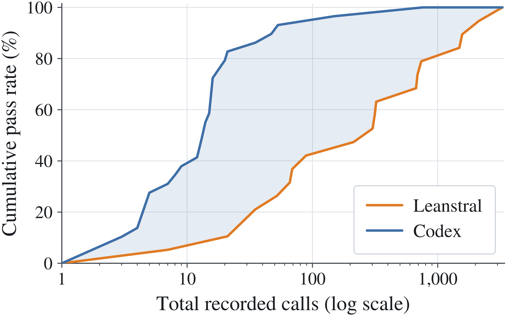
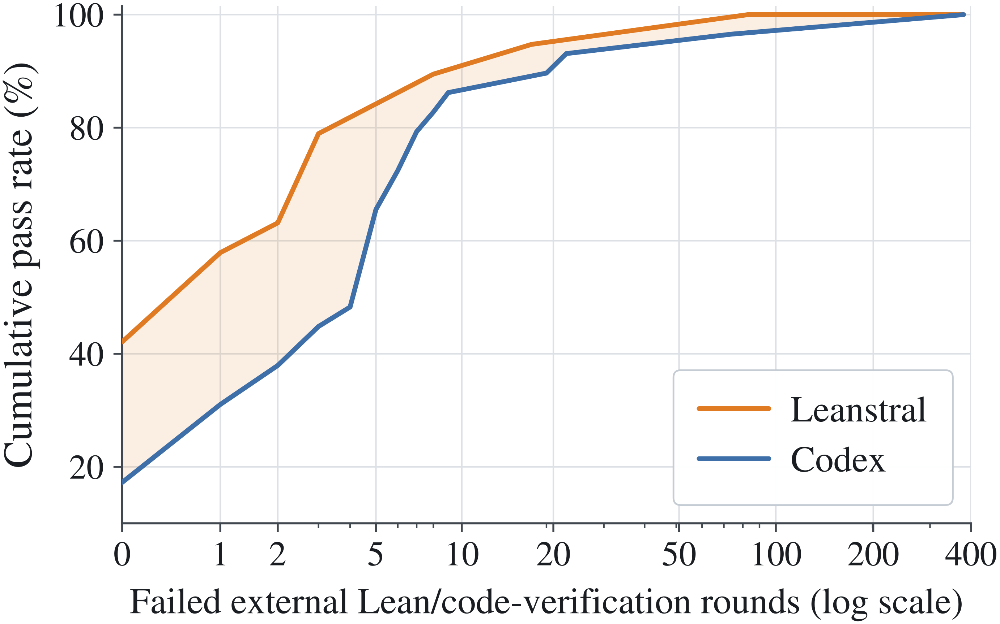
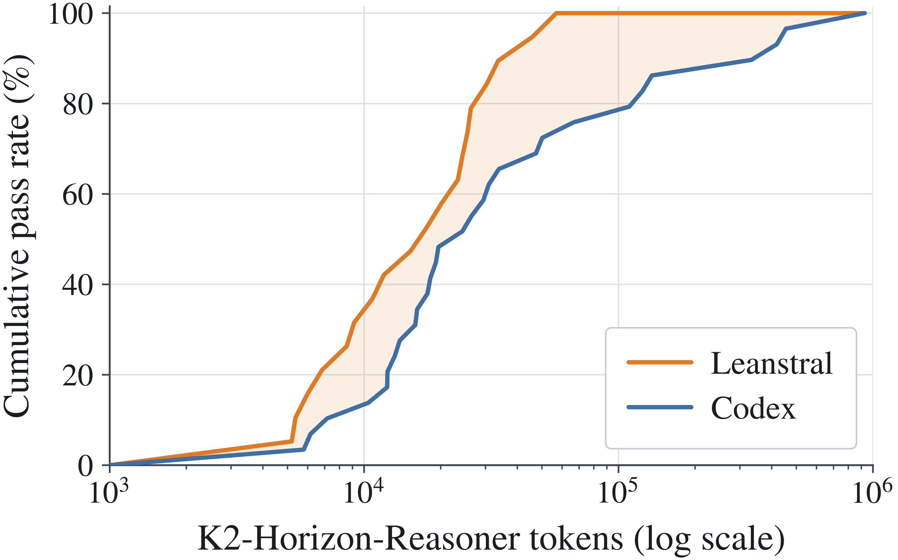
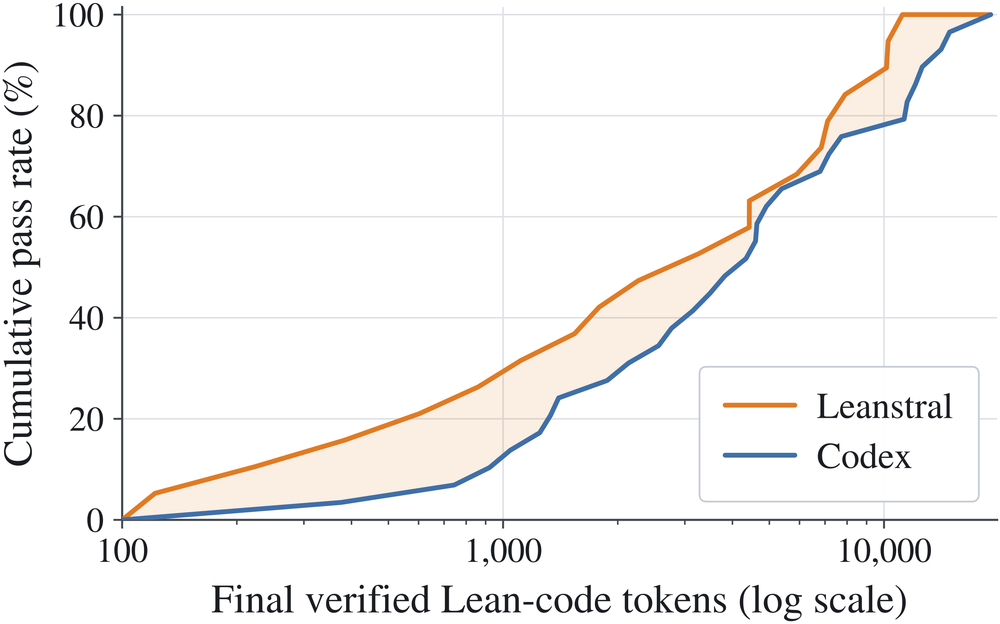

## 비용 곡선의 네 패널

앞 장에서 명제 단계의 호출 경제를 봤다. 명제가 준비되면 비용은 증명 단계에서 청구되고, 이번에는 청구 방식이 두 갈래로 나뉜다. 한 구성은 Codex를 바깥 증명기로 두고 실패할 때마다 문제를 다시 추론하는 외부 루프를 돌린다. 다른 구성은 Leanstral의 내부 루프 안에서 재시도를 흡수한다. 같은 문제, 같은 목표, 다른 루프 설계. 원문은 이 대결을 네 개의 패널로 나눠 그렸고, 패널마다 비용이 갈리는 지점이 다르다.

### 패널 (a) 총 호출과 해결률

첫 패널은 모든 호출을 합산한 총 호출 기준의 통과율이다. 이 축에서 유리한 쪽은 Codex다. 같은 통과율에 도달하는 데 필요한 호출이 더 적고, 모든 문제를 덮는 시점도 더 이르다. 겉보기와 반대되는 결과지만 계산의 포인트는 명확하다. Leanstral 구성이 아낀 것은 바깥 비용이지 총 노력이 아니다. 아낀 외부 호출은 내부 루프에서 몇 배의 호출로 되갚아지고, 그 내부 호출까지 전부 세면 그림의 순서가 뒤집힌다. 패널 (a)는 바로 그 뒤집힌 그림이다.

그림 5(a)의 가로축은 총 호출, 세로축은 통과율이다. Codex 곡선이 왼쪽 위에 자리하고, Leanstral 곡선은 오른쪽 아래로 밀려 있다. 같은 높이에 오르려면 Leanstral이 훨씬 더 오른쪽으로 나아가야 한다는 뜻이다. 총 호출만으로 시스템을 재면 Leanstral이 불리해 보인다. 그 불리의 정체를 가르려면 실패가 어디서 끝나는지를 봐야 한다. 다음 패널의 주제다.

### 패널 (b) 외부 실패 라운드

둘째 패널은 실패의 행선지를 본다. 증명 실패가 오류 귀인 판사, 곧 실패를 수학 문제와 구현 문제로 갈라 라우팅하는 판사에 도달한 비율이 Leanstral 구성은 58퍼센트, Codex 구성은 83퍼센트였다. Codex는 실패 자체도 많고, 생긴 실패가 라우터까지 올라가 문제를 처음부터 다시 추론하는 재도출로 번지는 비중이 크다. 이 그림에는 축 위의 한 점이 더 읽힌다. 가로축이 0인 지점, 즉 외부 실패 없이 끝낸 문제가 Leanstral 42퍼센트, Codex 17퍼센트다. 재도출로 튕겨 나가지 않고 내부 루프 안에서 말끔히 끝나는 문제가 두 배 이상 많다는 뜻이다. 실패가 내부에서 끝나지 못하고 바깥 루프로 새는 순간, 비용은 증명기 한 대의 몫을 넘어 추론기 전체의 몫으로 불어난다.

그림 5(b)는 가로축에 외부 실패 라운드를 두고 누적 통과율을 그린 곡선이다. 가로축이 0인 절편에서 Leanstral 곡선이 Codex 곡선보다 훨씬 높게 출발하고, 라운드가 쌓일수록 두 곡선의 간격이 곧 실패가 라우터에 도달해 재도출로 번지는 비용이 된다. 패널 (a)의 순위는 여기서 뒤집힌다. 총 호출은 많지만 실패를 안쪽에서 흡수하는 구성이 바깥 비용에서는 이긴다.

### 패널 (c) 리즈너 토큰

셋째 패널은 추론기(reasoner)가 실제로 소비한 토큰을 잰다. 전체 커버리지, 곧 모든 문제를 덮을 때까지의 리즈너 토큰 사용량이 Leanstral 구성은 약 6×10⁴, Codex 구성은 약 9×10⁵였다. 호출 횟수의 차이가 그대로 토큰 청구서에 나타난다. 바깥 루프가 도는 만큼 추론기를 다시 호출해 문제를 새로 읽고 새로 추론해야 하기 때문이다.

그림 5(c)는 로그 눈금에서 두 구성의 토큰 소비를 나란히 놓는다. 두 곡선의 가로 간격이 한 자릿수 이상 벌어져 있다는 사실만으로 충분하다. 같은 일을 하는 두 설계가 청구서에서는 등급이 다른 고객처럼 보인다는 것, 그리고 그 격차가 능력이 아니라 루프의 위치에서 나온다는 것이 이 패널의 요지다.

### 패널 (d) 검증된 Lean 코드 길이

넷째 패널은 산출물의 크기를 잰다. 검증을 통과한 증명의 길이가 Leanstral 구성은 약 1.1×10⁴ 토큰, Codex 구성은 약 2×10⁴ 토큰으로 절반 가량 차이가 난다. 성공한 증명조차 외부 루프 설계에서는 더 길어진다. 재도출이 반복되는 동안 증명에 군더더기가 끼어들고, 검증은 통과해도 코드는 비대해진다.

그림 5(d)를 읽을 때 주의할 점이 하나 있다. 이 패널은 실패가 아니라 성공의 크기를 잰다. 그런데도 격차가 난다. 실패를 많이 겪고 도달한 성공은 흔적을 남기는 반면, 안쪽에서 정돈된 성공은 짧다는 것이다. 산출물의 길이는 곧 이후 검증·유지 보수 비용이므로, 이 격차는 실행 비용 다음에 오는 2차 비용이다.

### 내부 루프를 크게, 외부 루프를 작게

네 패널을 겹쳐 보면 결론이 하나로 모인다. 두 구성 모두 최종 천장은 같다. 결국 같은 문제를 다 풀 수 있다는 뜻이다. 능력의 상한이 갈린 것이 아니라, 같은 상한에 도달하는 예산이 갈렸다. 재시도를 안쪽 루프에 두면 소비도 줄고 실패가 바깥으로 번지면서 남기는 오염도 줄고, 검증된 산출물마저 짧아진다. 설계 교훈은 단문으로 정리된다. 내부 루프를 크게, 외부 루프를 작게. 비용의 지형은 이걸로 끝이 아니다. 같은 파이프라인이 문장을 바꿔 받아들일 때도 흔들리지 않는지가 다음으로 물을 질문이다.
