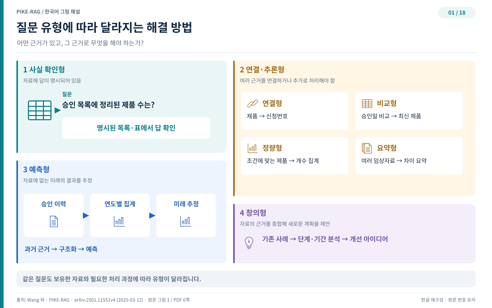

## 네 가지 질문과 다섯 단계

앞 장에서 본 세 난제를 정면으로 받아들이려면 문제를 다시 세우는 언어가 필요하다. 저자는 RAG 프레임워크를 지식베이스, 과제 분류, 시스템 개발의 세 관점에서 개념화한다. 지식베이스가 검색과 생성의 초석이고, 과제와 시스템은 능력 요구에 따라 복잡도와 단계가 갈린다. 이 장은 과제 분류와 시스템 단계를 읽는다.

### 지식베이스라는 이름의 그래프

산업 현장의 전문 지식은 제조, 에너지, 물류 같은 분야에서 수년간 쌓인 데이터에서 나온다. 제약 산업의 원천은 연구개발 문서와 수년치 의약품 허가 파일인데, 표와 차트, 그림 같은 다중 양상 콘텐츠가 문제 해결의 열쇠로 박혀 있고, 하이퍼링크와 참조 같은 기능적 연결이 지식의 논리적 조직을 드러낸다. 저자는 이 지식베이스를 다층 이종 그래프(multi-layer heterogeneous graph) $G$로 구조화할 것을 제안한다. 노드 집합 $V$와 에지 집합 $E$로 이루어진 그래프의 내부 구조는 뒤에서 다시 해부하고, 여기서는 설계가 검색 방법과 성능을 직접 좌우한다는 사실만 붙잡아 둔다.

### 과제 난이도를 가르는 네 요인

과제의 난이도는 몇 가지 결정적 요인과 맞닿아 있다.

- 지식의 관련성과 완전성(relevance and completeness of knowledge): 필요한 정보가 지식베이스 안에 얼마나 존재하고, 주제를 얼마나 고루 다루는가.
- 지식 추출의 복잡도(complexity of knowledge extraction): 흩어진 원천에 있거나 텍스트에 암묵적으로 박힌 관련 지식 조각들을 모두 정확히 꺼내는 일이 얼마나 어려운가.
- 이해와 추론의 깊이(depth of understanding and reasoning): 검색해 낸 정보를 이해하고 연결하며 여러 단계 추론을 수행하는 데 얼마나 많은 인지 처리가 필요한가.
- 지식 활용의 효과(effectiveness of knowledge utilization): 추출한 지식을 종합하고 조직해 통찰이나 예측을 만드는 적용 단계가 얼마나 정교해야 하는가.

### 질문의 네 유형

이 네 요인을 저울에 올려, 저자는 산업 현장의 질문을 난이도에 따라 네 유형으로 나눈다.

사실 질문(factual questions)은 말뭉치에 명시적으로 놓인 구체적 정보를 직접 꺼내는 일이다. 참조 텍스트를 대화 맥락에서 처리할 수 있고, 관련 사실을 검색으로 찾아내면 답이 완성된다. 연결 추론 질문(linkable-reasoning questions)은 한 단계 깊다. 여러 원천에서 관련 정보를 모으거나 여러 단계 추론을 수행해야 하고, 답이 여러 텍스트에 암묵적으로 흩어져 있다. 연결과 추론 과정의 차이에 따라 넷으로 다시 갈린다. 여러 개체를 순서대로 잇는 연결(bridging) 질문, 두 개체의 지정 속성을 나란히 놓는 비교(comparative) 질문, 검색 데이터 위에 통계 분석을 얹는 정량(quantitative) 질문, 여러 원천이나 대량 텍스트를 압축해 하나의 요약으로 엮는 요약(summarizing) 질문이 그것이다. 요약 질문은 다른 유형의 요소를 결합하는 경우가 잦아, 합리적인 답 탐색 경로를 세우는 일이 관건이다. 예측 질문(predictive questions)은 답이 원문에 없다. 기존 사실 위에 귀납적 추론을 얹어 미래를 내다보는데, 시계열처럼 분석 가능한 형태로 지식을 조직해야 한다. 창의 질문(creative questions)은 전문 분야 고유의 논리와 창의적 문제 해결을 동원한다. 패턴과 영향 요인을 찾아 새로운 해법의 실마리를 제공하는 것이 목표이지, 바로 실행 가능한 해결안을 내놓는 것이 아니다.

저자가 FDA가 공개한 데이터로 제약 응용 전문가들과 함께 만든 세 질문이 이 분류의 힘을 보여 준다. 생물유사성의약품(biosimilar)과 그 승인일을 묻는 Q1은 모든 제품과 승인일을 표 한 장에 정리해 둔 덕에 명시적 정보만으로 끝나는 사실 질문이다. 상호교환 가능한 생물유사성의약품의 총수를 묻는 Q2는 단일 출처를 참조하는 것으로 끝나지 않는다. 조건에 맞는 제품을 모두 찾은 뒤 합산하는 통계 집계 단계가 더 필요해, 중간 처리를 요하는 연결 추론 질문이다. 앞으로의 상황을 묻는 Q3는 답이 지식베이스에 아예 존재하지 않는다. 관련 데이터를 모아 숨은 패턴을 추론하고 그 규칙 위에서 예측해야 하므로 예측 질문이다. 겉보기에 비슷한 세 질문이 서로 다른 유형으로 갈라지는 이유는 하나다. 질문의 유형은 질문의 문구가 아니라 지식베이스의 상태가 정한다.

그림 1은 네 유형의 질문과 각각의 예를 나란히 놓는다. 화면 왼쪽의 사실 질문이 표에서 바로 답을 고르는 데 견주어, 연결 추론 질문은 연결·비교·정량·요약 네 갈래로 갈라지고 예측 질문은 과거 근거를 구조화한 뒤 앞을 내다본다. 유형마다 지원 데이터와 기대되는 추론 과정이 다르다는 점이 그림의 요지다.

### 시스템 단계 L1부터 L4까지

질문 유형이 정해졌으니 시스템 능력도 그 자에 맞춰 세울 수 있다. 저자는 네 유형의 문제 해결 능력에 따라 RAG 시스템을 네 단계로 분류한다. 원문 표 1을 한국어로 옮기면 다음과 같다.

| 레벨 | 능력 설명 |
| --- | --- |
| L1 | 사실 질문에 정확하고 믿을 만한 답을 제공해 기본 정보 검색의 튼튼한 토대를 만든다. |
| L2 | 사실 질문과 연결 추론 질문을 모두 정확하고 믿을 만하게 다루어, 더 복잡한 다단계 검색과 추론 과제를 수행한다. |
| L3 | 사실 질문과 연결 추론 질문에서 정확성과 신뢰성을 유지하면서, 예측 질문에 그럴듯한 예측을 내놓는 능력을 더한다. |
| L4 | 창의 질문에 근거가 탄탄한 계획이나 해결안을 제안하면서, 예측 질문에 대한 그럴듯한 예측 능력과 사실 질문, 연결 추론 질문에 대한 정확하고 믿을 만한 답변 능력도 유지한다. |

표 밖에서 한 가지를 덧붙인다. 논문은 지식베이스 구축 단계를 시스템 개발의 L0 단계로 지정한다. 즉 사다리의 바닥은 구축이며, 올라갈수록 이해와 추론, 혁신의 수위가 높아진다.

### 레벨별로 다른 난제

단계마다 시스템이 부딪히는 벽도 달라진다. 원문 표 2가 정리한 단계별 난제를 풀어 쓰면 다음과 같다.

- L0에서는 원천 문서 형식이 제각각이라 지식 추출이 어렵고, 정교한 파일 파싱 기술이 요구된다. 이질 데이터에서 고품질 지식베이스를 만드는 일에 지식 조직과 통합의 복잡도가 몰린다.
- L1에서는 잘못된 청킹이 의미 연속성을 깨뜨려 지식 이해와 추출, 정확한 검색을 가로막는다. 임베딩 모델이 전문 용어와 별칭을 제대로 정렬하지 못해 검색 정밀도가 떨어진다.
- L2에서는 청크에 관련 정보와 무관한 정보가 뒤섞여 고품질 데이터 검색이 정확한 생성의 전제가 된다. 과제와 그 이면의 근거를 이해하고 분해하는 일이 지원 데이터의 가용성을 외면한 채 모델 능력에만 기댄다.
- L3에서는 예측 추론을 떠받칠 지식 수집과 조직이 화두다. 모델이 전문 추론 논리를 적용하는 데 한계가 있어 예측 효과가 제한된다.
- L4에서는 요인 간 의존이 얽혀 해가 유일하지 않은 지식베이스에서 일관된 논리 근거를 뽑아내기가 어렵다. 창의 질문의 개방성 때문에 추론과 지식 종합을 정량 평가하기도 어렵다.

질문 유형과 시스템 단계라는 지도가 마련되었다. 다음 장은 이 지도 위에서 실제로 움직이는 기계를 연다. 일곱 개의 모듈과 그 모듈들을 잇는 순환이 PIKE-RAG 프레임워크를 어떻게 이루는지 해부한다.
