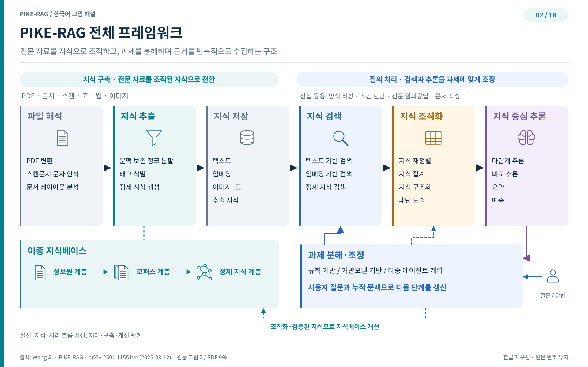
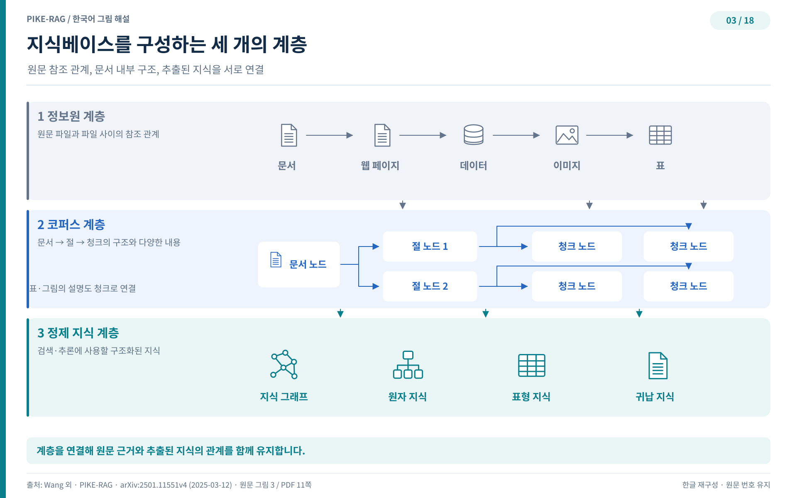

## 프레임워크의 해부

지도가 있으면 이제 기계를 볼 차례다. 저자는 지식베이스, 과제 분류, 시스템 단계라는 정식화 위에 범용적이고 확장 가능한 RAG 프레임워크를 올린다. 이 프레임워크의 매력은 시스템 단계가 오를 때 주요 모듈 안의 서브모듈을 조정하는 것만으로 발전을 이룰 수 있다는 점이다. 거대한 재설계가 아니라 부품 교환으로 계단을 오르는 설계다.

### 일곱 개의 모듈

프레임워크의 몸체는 일곱 개의 기본 모듈로 이루어진다. 다양한 형식의 도메인 문서를 기계가 읽을 수 있는 형식으로 바꾸는 파일 파싱(file parsing), 청크를 만들고 지식 단위를 뽑아내는 지식 추출(knowledge extraction), 추출한 지식을 여러 구조화된 형식으로 보관하는 지식 저장(knowledge storage), 하이브리드 검색 전략으로 관련 정보에 접근하는 지식 검색(knowledge retrieval), 검색해 온 정보를 가다듬어 조직하는 지식 조직(knowledge organization), 조직된 지식 위에서 추론을 수행하는 지식 중심 추론(knowledge-centric reasoning), 그리고 검색과 추론의 경로를 동적으로 관리하는 과제 분해와 조율(task decomposition and coordination)이 그 목록이다. 파일 파싱 모듈이 문서를 파일 단위로 쪼개 정보 자원 계층의 그래프를 세우면, 지식 추출 모듈이 텍스트를 청킹해 코퍼스 계층과 정제 지식 계층의 그래프를 만든다. 세워진 이종 그래프가 지식베이스가 되어 검색의 대상이 된다.

그림 2는 이 일곱 모듈이 흐름 위에 어떻게 배열되는지 보여 준다. 왼쪽에서 원시 문서가 들어와 파싱과 추출을 거쳐 지식베이스에 쌓이고, 검색과 조직을 지나 추론으로 이어진다. 한 가지 눈여길 지점은 되먹임 고리다. 조직되고 검증된 지식이 다시 지식베이스를 정제하고 보강하는 데 쓰인다. 지식베이스는 모으기만 하는 창고가 아니라 쓰일수록 좋아지는 살아 있는 구조물이라는 뜻이다.

### 되풀이되는 검색과 생성

질문 유형마다 답 탐색의 근거 경로가 다르다는 것은 앞에서 확인했다. 관련 정보의 가용 여부, 지식 추출의 복잡도, 추론의 정교함이 경로를 바꾼다. 그렇다면 한 번의 검색과 한 번의 생성으로 끝나는 단일 패스로는 이 질문들을 감당하기 어렵다. 저자의 대답은 과제 분해와 조율의 감독 아래 도는 반복 검색-생성(iterative retrieval-generation) 메커니즘이다. 산업 응용의 질문이 과제 분해 모듈에 들어가면 예비 분해안이 나온다. 이 안에는 검색 단계와 추론 단계, 그 밖에 필요한 작업들이 적혀 있다. 지침을 따라 지식 검색 모듈이 관련 정보를 모으면 지식 조직 모듈이 이를 처리하고 조직하고, 조직된 지식으로 지식 중심 추론을 수행해 중간 답을 얻는다. 그러면 새로 모은 정보와 중간 답을 반영해 과제 분해 모듈이 다음 반복을 위한 갱신된 분해안을 다시 만든다. 이 고리는 관련 정보를 조금씩 모으고 점층적으로 늘어나는 맥락 위에서 추론을 이어 가게 하여, 더 정확하고 포괄적인 답으로 향한다.

### 단계별로 자라나는 시스템

프레임워크가 확장 가능하다는 말은 단계 사이에 상속 관계가 있다는 뜻이다. L0에서 L4로 오르는 동안 상위 단계 시스템은 하위 단계의 모듈을 물려받고 능력을 보강하는 새 모듈을 얹는다. L1에 비해 L2는 반복 검색-생성 경로를 활용하는 과제 분해와 조율 모듈을 새로 도입하는 동시에, 정제 지식 생성 같은 더 진보한 지식 추출 모듈을 갖춘다. L3는 예측 질문의 비중이 커지면서 지식 조직과 추론 양쪽에 높은 요구를 걸어, 지식 조직 모듈에 지식 구조화(knowledge structuring)와 지식 유도(knowledge induction) 서브모듈을 더하고 지식 중심 추론 모듈에 예측(forecasting) 서브모듈을 확장한다. L4는 이미 갖춘 지식베이스에서 복잡한 근거를 뽑아내는 일이 워낙 어려워, 여러 관점에서 추론을 일으키는 멀티 에이전트 플래닝(multi-agent planning) 모듈을 도입한다.

그림 3은 프레임워크의 밑바닥을 이루는 지식베이스의 내부를 드러낸다. 정보 자원 계층, 코퍼스 계층, 정제 지식 계층의 세 계층이 서로 다른 처리 단계, 서로 다른 입자도와 추상화 수준을 담당한다. 모듈 이야기를 시작하기 전에 이 세 층이 무엇을 담는지부터 뜯어볼 필요가 있다. 다음 장은 사다리의 바닥인 L0, 즉 이 세 계층의 지식베이스를 어떻게 구축하는지를 읽는다.
