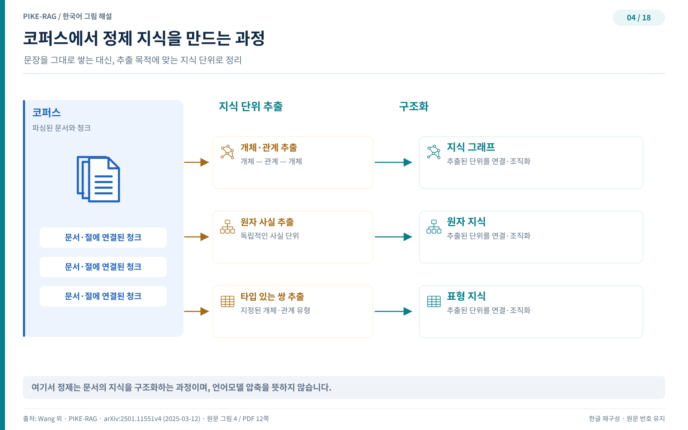

## L0 — 지식베이스 만들기

아무리 똑똑한 검색 알고리즘도 담아 둘 지식이 엉망이면 빛을 내지 못한다. PIKE-RAG는 시스템 발전의 출발점을 검색 기술이 아닌 지식베이스 구축에 두고, 이 단계를 L0라 부른다. L0의 목표는 단순하다. 도메인 문서를 기계가 읽을 수 있는 형태로 바꾸고, 앞 장에서 예고한 다층 이종 그래프를 여기서 실제로 쌓는다. 이 그래프가 이후 모든 상위 단계의 추론과 검색이 서는 뼈대다.

### 파일 파싱

지식베이스를 만드는 첫 걸음은 여러 형식의 파일을 읽어 내는 일이다. LangChain 같은 프레임워크는 비정형 텍스트 문서를 해석하고 정보를 뽑아 내는 도구 모음을 제공한다. 스캔한 문서나 이미지는 광학 문자 인식(OCR)과 표 추출에 특화된 딥러닝 도구, 상용 클라우드 API가 구조화된 텍스트로 바꿔 준다.

그러나 도메인 문서는 보통 복잡한 표와 차트, 그림을 함께 품는다. 이를 무조건 텍스트로만 변환하면 정보가 잘리고 원래의 논리 구조가 깨진다. 그래서 L0는 두 가지를 추가한다. 첫째, 레이아웃 분석을 통해 문서의 배치 정보를 살린다. 이 정보는 이후 청킹 작업에서 청크가 온전한 단위로 잘리도록 돕는다. 둘째, 차트와 그림 같은 멀티모달 요소를 없애지 않고 보존한다. 그림과 차트는 비전언어모델(VLM)로 서술한 설명 텍스트를 붙여 검색 대상에 포함시킨다. 원문이 지닌 온전함과 풍부함을 지식베이스까지 그대로 옮기는 장치다.

### 세 층으로 쌓는 그래프

파싱을 마친 정보는 다층 이질적 그래프에 자리 잡는다. 이 그래프는 문서, 섹션, 청크, 그림, 표 사이의 관계를 노드와 에지로 표현하며 세 층으로 구성된다.

정보 자원층은 문서나 데이터베이스 같은 다양한 정보원을 소스 노드로 올린다. 노드 사이를 잇는 에지는 하이퍼링크, 인용, 데이터베이스 링크 같은 참조 관계를 담는다. 덕분에 여러 출처를 오가며 근거를 대조하는 추론의 토대가 마련된다.

코퍼스층은 파싱 결과를 섹션과 청크 단위로 정리하면서도 문서 원래의 계층 구조를 유지한다. 표와 그림 같은 멀티모달 내용은 LLM이 요약한 청크 노드로 통합되어 검색 대상에 끼어든다. 한 청크 단위부터 문서 전체까지 다양한 입자도로 지식을 다룰 수 있게 해 주는 층이다.

정제 지식층은 코퍼스를 한 번 더 가공해 구조화된 지식으로 응축한다. 여기서 뽑아 낸 지식은 개체와 논리 관계를 명시적으로 담고 있어, 코퍼스층만으로는 불가능한 심층 추론을 가능하게 한다.

### 지식 증류의 세 가지 형태

코퍼스 텍스트에서 정제 지식층을 만드는 과정을 지식 증류라 부른다. 개체명 인식(NER)과 관계 추출 기법이 이 작업을 이끈다.

그림 4는 증류의 전체 흐름을 보여 준다. 코퍼스 텍스트에 맞춤 추출 패턴을 적용해 지식 단위를 뽑아 내고, 이 단위들을 정제 지식층에 구조화된 지식으로 모은다. 완성된 지식의 모습은 대표적으로 세 가지다.

첫째는 지식그래프다. LLM이 코퍼스 텍스트에서 개체와 개체 사이의 관계를 추출해 노드-에지-노드 구조의 지식 단위를 만든다. 이 단위들을 모두 합치면 하나의 그래프가 된다.

둘째는 원자 지식이다. 코퍼스 텍스트를 더 이상 쪼갤 수 없는 원자 문장들의 집합으로 분할하고, 각 문장을 지식 단위로 삼는다. 여기에 코퍼스 노드 사이의 관계를 결합해 완성한다.

셋째는 표 형태 지식이다. 지정한 유형과 관계를 지닌 개체쌍을 텍스트에서 추출해 지식 단위로 쓰고, 개체쌍을 모아 표로 조립한다. 속성을 나열해 비교해야 하는 질문에서 특히 힘을 발휘한다.

### 기반 위에서 시작하는 검색

지식베이스가 아무리 탄탄해도 스스로 답을 찾아 주지는 않는다. 저장된 지식을 꺼내 쓰는 검색과 생성 능력이 뒤따라야 한다. PIKE-RAG는 이 능력을 붙인 첫 단계를 L1이라 부르고, 사실 확인형 질문을 정면으로 다룬다. 다음 장에서는 L1이 청킹과 용어의 벽을 어떻게 허무는지 살펴본다.
