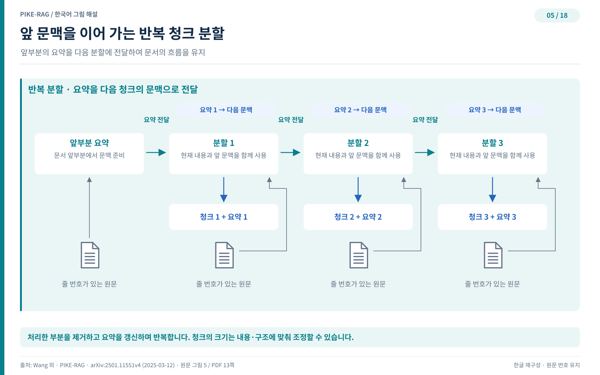
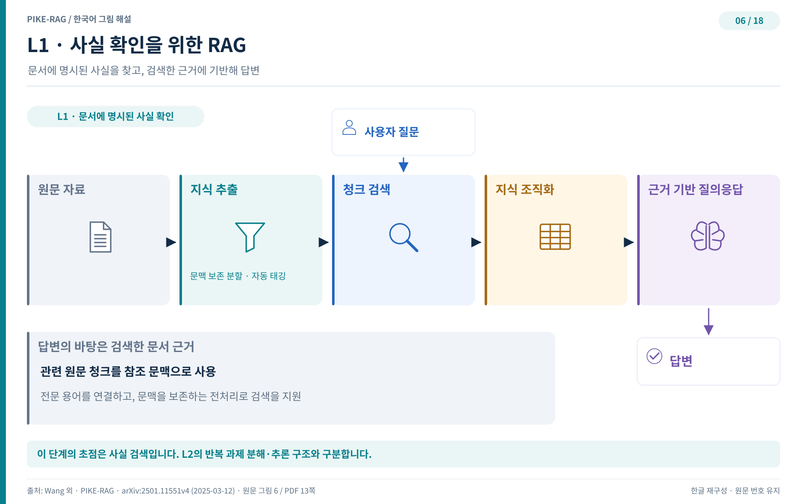
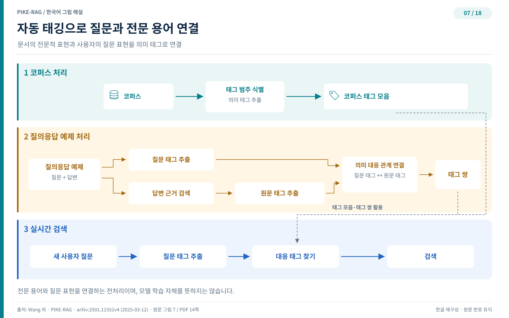
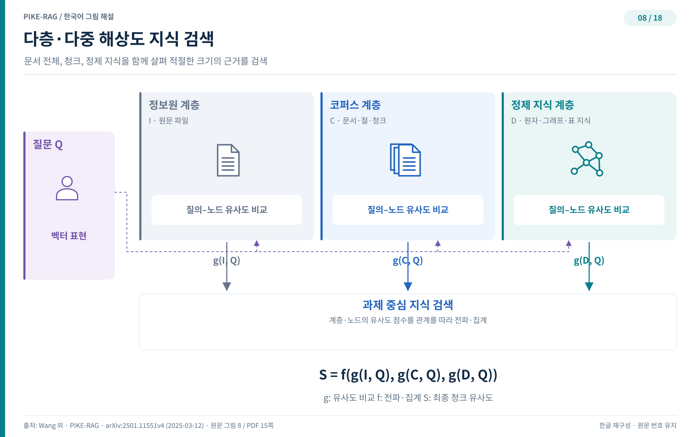

## L1 — 사실을 가려내는 시스템

지식베이스를 쌓았으니 이제 질문에 답할 차례다. L1 시스템이 노리는 것은 명확하다. 코퍼스 어딘가에 답이 분명히 있는 사실형 질문을 정확히 가려 내는 것이다. 그런데 여기서 두 가지 벽이 나타난다. 하나는 청킹이, 다른 하나는 용어가 막는 벽이다.

### 청킹이 깨는 응집성

첫 번째 난제는 청킹 자체에서 온다. 청크는 한편으로는 벡터화해 데이터베이스에 저장하는 검색의 단위고, 다른 한편으로는 지식 추출과 요약의 원천이 된다. 그래서 청킹이 어긋나면 문제가 이중으로 번진다. 벡터에 필요한 의미가 담기지 않을 뿐 아니라, 온전한 문맥이 있어야 가능한 지식 추출까지 막힌다.

법규 텍스트가 대표적인 반례다. 고정 크기 청킹은 법 조문의 문맥을 무자비하게 자르고, 조건을 누락시키기 쉽다. 어떤 규정의 적용 요건이 문장 여러 개에 걸쳐 있는데 경계에서 잘리면, 나중에 그 청크만 읽은 시스템은 조건이 없는 규정이라고 믿게 된다. 이는 이후 지식 추출의 품질과 정확도를 함께 갉아 먹는다.

PIKE-RAG는 이를 막기 위해 반복 텍스트 분할(recurrent text splitting)을 제안한다. 원본 텍스트를 순서대로 나누되, 앞 청크에서 만든 앞 요약(forward summary)을 다음 청크의 요약 생성에 물려 주는 알고리즘이다. 각 청크는 앞 요약과 현재 청크를 함께 담은 프롬프트 템플릿으로 요약되고, 요약은 청크 곁에 함께 저장된다. 처리한 청크를 빼고 앞 요약을 갱신하는 일을 텍스트가 끝날 때까지 반복하므로, 청크마다 앞선 맥락이 끊기지 않고 이어진다. 필요하면 청크 크기를 텍스트 내용과 구조에 맞춰 동적으로 조정하기도 한다.

그림 5는 이 분할 과정을 도식화한다. 청크가 넘어갈 때마다 앞 요약이 다음 요약의 입력으로 흘러 들어가는 모습이 핵심이다. 경계에서 잘려도 맥락이 요약 형태로 살아 남으므로, 검색 단위와 지식 추출 원천으로서의 품질을 동시에 지킨다.

### L1 프레임워크의 조립

이렇게 다듬은 부품들을 조립하면 L1의 전체 그림이 나온다.

그림 6은 L1 프레임워크의 전체 조립도다. L0에서 만든 지식베이스 위에 검색과 지식 정리 모듈을 얹고, 과제 분해와 조율, 지식 정리의 초기 단계 구성 요소를 더해 더 복잡한 질문을 감당한다. 여기서 강화된 청킹과 자동 태깅 하위 모듈이 지식 추출 모듈 안에 들어간다. 청킹은 앞서 본 반복 분할로 완성했고, 남은 것은 용어의 벽이다.

### 자동 태깅으로 용어 격차를 메우다

두 번째 난제는 질문과 코퍼스가 쓰는 언어가 다르다는 점이다. 도메인 코퍼스는 격식을 갖춘 전문적인 표현으로 쓰여 있지만, 사용자의 질문은 일상어로 풀어 말한다. 의료 질의응답(medQA) 과제를 보면 뚜렷하다. 질문은 증상을 대화체로 서술하는 반면, 코퍼스 속 의학 지식은 전문 용어로 적혀 있다. 임베딩 모델만으로는 이 도메인 격차를 좁히기 어렵고, 청크 검색 정확도가 떨어진다.

자동 태깅(auto-tagging) 모듈이 이 간극을 메운다. 절차는 이렇다. 먼저 LLM으로 코퍼스 청크의 핵심 요인을 찾아 일반화한 범주 이름, 곧 태그 클래스를 정의한다. 태그 클래스를 바탕으로 의미 태그 추출 프롬프트를 만들고, 코퍼스 전체에서 태그를 뽑아 코퍼스 태그 집합을 구성한다. 실제 QA 표본까지 손에 있다면 한 단계가 더해진다. 질문과 그에 대응하는 정답 청크 각각에서 태그를 추출한 뒤, 두 태그 집합을 LLM으로 연결해 태그 쌍 집합을 만든다.

검색 시점에는 질문에서 태그를 뽑아 태그 집합과 태그 쌍 집합을 통해 코퍼스 도메인의 태그로 사상한다. 이 사상 결과는 질문 재작성이나 키워드 검색에 쓰인다. 환자가 "숨이 가빠요"라고 말한 것을 코퍼스의 호흡곤란이라는 용어로 이어 주는 통역 역할이며, 검색의 재현율과 정밀도를 함께 끌어 올린다.

그림 7은 이 모듈의 작동을 보여 준다. 코퍼스에서 태그를 정의하고, 질문의 태그를 그 쪽 언어로 옮기는 두 방향의 흐름이 한 그림에 담긴다.

### 다층·다중 해상도 검색

용어의 벽까지 허물었으면 지식베이스를 제대로 훑을 차례다. L1은 L0에서 만든 다층 이종 그래프 위에서 다층·다중 해상도 검색을 수행한다. 그래프의 각 층은 추상화 수준과 해상도가 다른 지식을 담으므로, 질문을 문서 전체에 대응시킬 수도 있고 특정 청크에 대응시킬 수도 있다.

작동 원리는 심플하다. 질문과 그래프 노드를 고차원 벡터 임베딩으로 바꿔 유사도를 재고, 이 점수를 그래프 층 사이로 전파하고 집계한다. 정보 자원층의 노드 집합을 I, 코퍼스층을 C, 정제 지식층을 D라 하고, 유사도 평가를 함수 g, 전파와 집계를 함수 f로 나타내면 최종 청크 유사도 점수 S는 다음과 같이 쓸 수 있다.

$$S = f\left(\left\{g(Q,n)\;\middle|\;n\in I\cup C\cup D\right\}\right)$$

질문 Q 하나로 세 층의 점수를 모아 청크 점수를 매기는 구조다. 넓은 문맥과 세부 디테일을 동시에 반영하며, 과제 분해가 내놓은 하위 질문으로 검색을 반복해 다듬을 수도 있다.

그림 8은 다층 이종 그래프 위에서 층별로 유사도를 매기고 전파·집계하는 전경을 그린다. 하나의 질문이 여러 해상도의 지식을 동시에 조준하는 그림이다.

### 사실 너머의 질문으로

L1으로 사실 확인은 깔끔해졌다. 그러나 답 한 개가 코퍼스 한곳에 있지 않은 질문이 있다. 여러 문헌에서 근거를 모아 연결하고, 그 위에서 추론해야 하는 질문이다. 다음 장에서는 이를 위해 지식을 원자 단위로 쪼개는 L2 시스템을 만난다.
