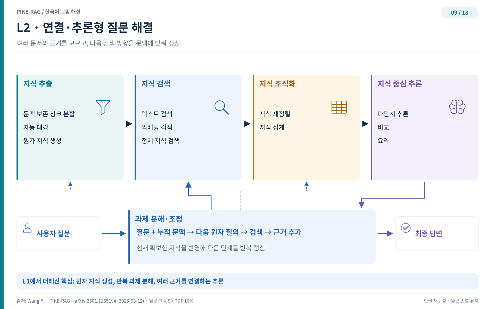
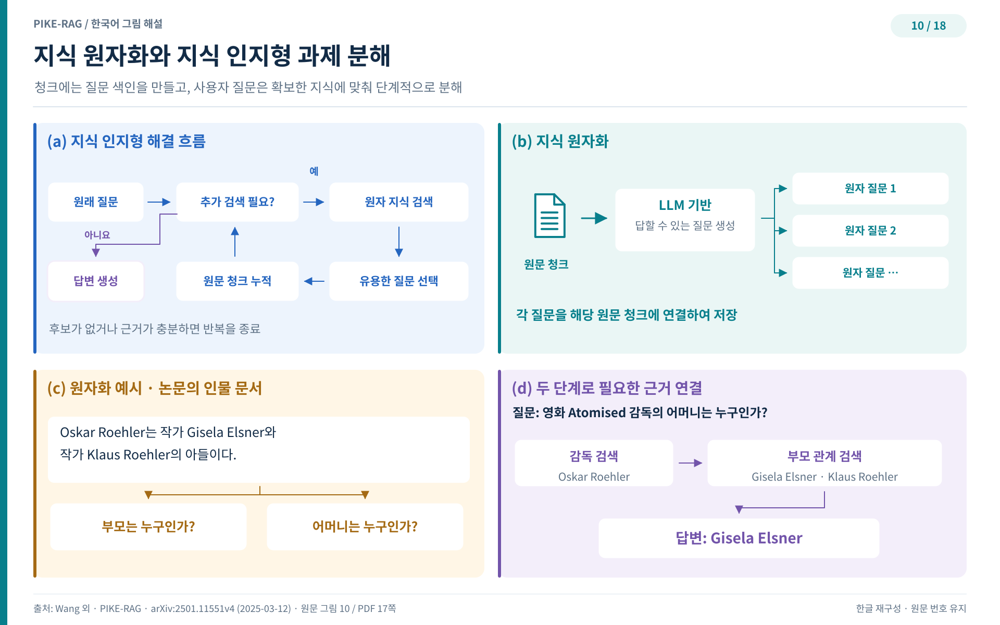
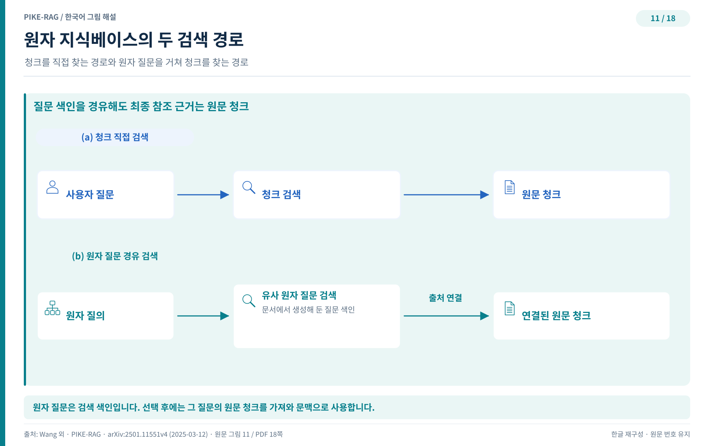

## L2 — 지식을 원자로 쪼개다

"이 약과 저 약 중 어느 쪽이 이 환자에게 더 적합한가?" 같은 질문에는 답이 한 곳에 있지 않다. 여러 문헌을 넘나들며 근거를 모으고, 모은 근거 위에서 추론해야 한다. L2 시스템의 핵심 기능이 바로 이것이다. 관련 정보를 여러 소스에서 효율적으로 끌어 모아 복합 추론을 수행하는 능력이다.

### L2의 목표와 구성

L2는 고급 지식 추출 모듈을 앞세워 필요한 정보를 빠짐없이 식별하고 추출한다. 여기에 과제 분해·조율 모듈을 더해 복잡한 과제를 감당할 만한 작은 하위 과제로 나눈다. 잘게 나눈 과제는 하나씩 해결하며 단계적으로 답에 다가선다.

그림 9는 L2 프레임워크의 전체 모습이다. 지식 추출 모듈에는 원자 지식 생성이, 지식 정리 모듈에는 지식 재순위화와 집계 하위 모듈이, 지식 중심 추론 모듈에는 다중 홉 추론·비교 추론·요약 하위 모듈이 자리 잡는다. 사실 확인을 넘어 연결과 추론을 감당하려면 각 모듈이 한 단계씩 진화해야 한다는 뜻이다.

### 청크 하나에 지식이 너무 많다

진화의 출발점은 분명한 문제의식이다. 청크 하나에는 여러 조각의 지식이 섞여 있다. 특정 과제를 풀 때 필요한 정보는 그 지식 전체에서 일부에 불과하다. 그런데도 전통적 정보 검색은 청크 통째로를 답의 그릇으로 취급하니, 정확히 필요한 정보를 효율적으로 꺼내기 어렵다.

한 가지 대안으로 청크에서 삼중항 지식 단위를 뽑아 지식그래프를 구축하는 연구들이 있었다. 그러나 지식그래프 구축은 비용이 크고, 청크에 담긴 지식이 그래프에 온전히 옮겨지지 않을 때가 많다. 문서에 박힌 지식을 더 충실하게 드러내려면 다른 길이 필요하다.

### 질문을 지식 색인으로 쓴다

PIKE-RAG가 택한 길은 지식 원자화(knowledge atomizing)다. 문서 청크 안의 원자 지식 조각들에 자동으로 꼬리표를 다는 작업으로, LLM의 문맥 이해와 생성 능력에 맡긴다. 여기서 다루는 청크는 원본 문서의 조각에 국한되지 않는다. 표와 그림, 영상을 위해 만든 설명 청크, 섹션이나 챕터, 문서 전체의 요약 청크도 모두 원자화 대상이다.

발상의 전환은 원자 지식을 어떻게 표현하느냐에서 나온다. 선언문이나 주어-관계-객체 삼중항 대신, 질문을 지식 색인으로 쓴다. 문서 청크를 LLM에 맥락으로 넣고, 그 청크가 답할 수 있는 질문을 최대한 많이 생성하도록 요청한다. 만들어진 원자 질문들은 해당 청크에 붙는 원자 질문 태그로 저장된다. 저장된 지식과 질의 사이의 간극을, 색인 자체를 질문 형태로 만들어 줄이는 것이다. 질문이 질문을 찾는 구조라 매칭이 자연스럽게 맞물린다.

그림 10은 지식 원자화와 지식 인지형 과제 분해를 함께 보여 준다. 지식 인지형 과제 분해 워크플로, 원자화 절차, 원자화 예시, 그리고 둘을 결합한 RAG 사례까지 네 화면으로 구성된다. 원자 질문들이 청크 안의 지식을 여러 각도에서 조명하는 모습에 주목하자. 원자 지식과 원본 청크를 결합하면 계층형 지식베이스가 되고, 과제를 분해할 때마다 이 지식베이스가 어떤 지식이 있는지 알려 준다. 분해가 지식을 보고 이뤄지는 셈이다.

### 두 갈래 검색 경로

계층형 원자 지식베이스는 입자도가 다른 질의를 함께 받아 준다. 검색 경로가 두 개 열려 있기 때문이다. 첫째 경로는 익숙한 방식대로 질문이 참조 청크를 곧장 검색한다. 둘째 경로는 질문이 먼저 원자 질문 노드를 찾아내고, 그 원자 질문에 연결된 참조 청크로 이어진다.

그림 11은 이 두 경로를 나란히 그린다. 큰 질문은 청크 직접 검색으로, 잘게 쪼개진 질문은 원자 질문을 거쳐 청크로 향한다. 같은 지식베이스가 질문의 입자도에 맞춰 길을 바꿔 주는 것이다.

### 색인이 생겼다면 이제 분해다

지식을 원자로 쪼개고 질문 형태로 색인해 두니, 지식베이스가 스스로 "나에게는 이런 질문에 답할 지식이 있다"고 말할 수 있게 됐다. 그렇다면 과제를 분해하는 순간에 이 말을 들어 보면 어떨까. 어떤 지식이 있는지에 따라 분해 전략 자체가 달라진다. 다음 장에서는 지식베이스를 들여다보며 과제를 분해하는 알고리즘을 따라 간다.
