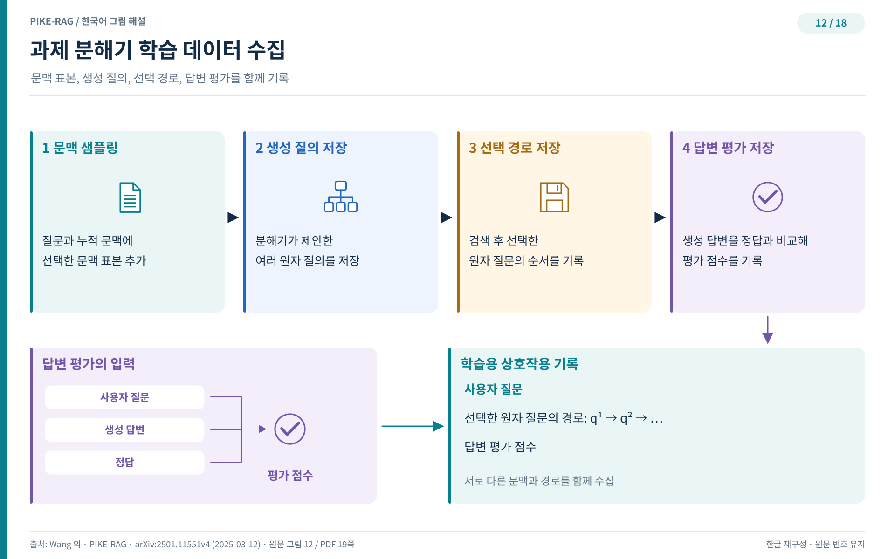
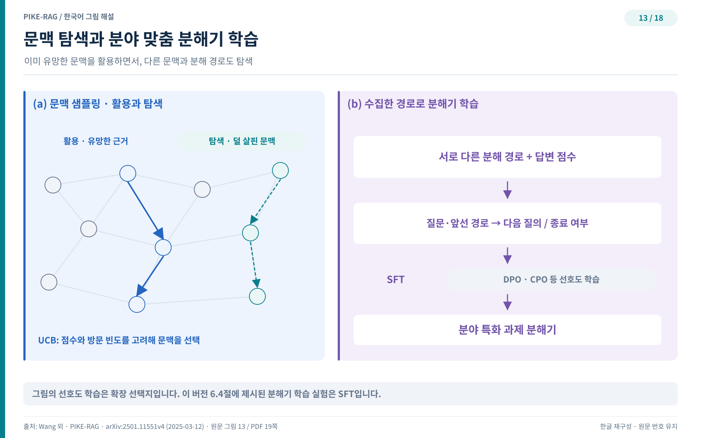

## L2 — 분해기를 가르치다

지금까지의 과제 분해는 예시 프롬프트에 기대는 즉흥 연기에 가까웠다. 라운드마다 원자 질문 후보 여럿을 제안받고, 검색 결과를 살피고, 다음 질문을 고르는 데 각각 언어 모델 호출이 들었다. PIKE-RAG는 이 절차를 훈련 대상으로 바꾸는 길을 연다. 분해기를 가르치면 매 라운드의 호출 여럿이 제안자 호출 한 번으로 줄고, 분야 고유의 근거가 분해 규칙 자체에 스며든다.

### 학습 가능한 구성요소

지식 인지형 과제 분해기(knowledge-aware decomposer)는 학습 가능한 구성요소다. 훈련된 제안자(trained proposer)는 추론 시점에 원자 질문을 곧장 제안하므로, 알고리즘에서 제안·검색·선정에 해당하는 여러 줄이 호출 한 번으로 대체된다. 원문은 이 교체가 추론 시간과 계산 비용을 함께 줄인다고 적는다. 절감이 전부는 아니다. 데이터 수집 과정에서 문맥 표본을 뽑고 다양한 상호작용 궤적을 만들어 두면, 분해기가 분야 고유의 근거를 과제 분해와 답 찾기에 반영하도록 가르칠 수 있다.

### 점수 사전과 방문 사전

데이터 수집 절차는 이중 사전 관리에서 출발한다. 점수 사전(score dictionary)은 후보 청크마다 점수를 기록하고, 방문 사전(visit dictionary)은 청크별 방문 빈도를 센다. 초기화 단계에서 모든 점수는 0으로, 모든 방문 수는 1로 둔다. 수집용 파라미터는 실제 실행보다 넓게 잡는다. 유사도 임계값은 실제 실행의 δ보다 낮은 δ′를 쓰고, 후보 청크 개수는 실제 실행의 K보다 큰 K′로 뽑는다. 그물을 넉넉히 쳐야 답의 근거가 될 청크를 놓치지 않는다. 상위 K 안에 들지 못한 청크는 버리지 않고 점수 사전에 옮겨 관련도에 따라 점수를 갱신한다.

그림 12는 수집 절차를 네 구성요소로 요약한다. 문맥 표본 풀에서 청크를 뽑아 분해의 기준 문맥으로 삼고, 생성한 원자 질문 후보를 저장하고, 검색과 선정을 거쳐 뽑힌 후보를 추론 궤적에 붙이고, 마지막으로 답을 평가해 점수를 매긴다. 라운드가 거듭될 때마다 무엇을 보았고 무엇을 골랐으며 그 선택이 어떤 점수를 낳았는지가 차곡차곡 쌓인다.

### 이용과 탐색의 균형

문맥 표본 추출에는 상한 신뢰 한계(upper confidence bound, UCB) 알고리즘을 쓴다.

$$c_{sampled}=\arg\max_{c}\left(\mathcal{S}(c)+\alpha\sqrt{\ln t/\mathcal{V}(c)}\right)$$

기호를 하나씩 풀면 다음과 같다. c는 점수 사전에 등록된 후보 청크다. S(c)는 그 청크의 누적 점수이고 V(c)는 방문 횟수다. t는 지금까지의 반복 차수이며 α는 탐색 세기를 조절하는 가중치다. 누적 점수가 높은 청크를 다시 고르는 이용(exploitation) 항과 덜 방문한 청크에 보너스를 주는 탐색(exploration) 항이 더해진다. 방문 횟수가 작을수록 제곱근 항이 커지므로 아직 시험하지 않은 길이 기회를 얻는다. 이 장치는 검색기가 고른 청크로 당장의 성능을 챙기면서, 표본 추출로 불확실한 선택을 시험해 더 나은 대안을 발굴한다. 다양한 원자 질문 후보가 나오고 여러 추론 경로가 두루 탐색되는 것은 이 균형의 결과다.

### 궤적을 감독 신호로

원자 제안(atomic proposal)과 상호작용 궤적과 답 점수를 기록해 분해기 학습에 쓴다. 분야마다 추론 경로가 다르므로 분야별로 궤적을 모으고, 답 점수를 감독 신호(supervised signal)로 삼아 분해기를 훈련한다.

그림 13의 왼쪽은 문맥 표본 추출이 어떻게 다양한 원자 질문 후보를 낳는지를 보여주고, 오른쪽은 모은 데이터로 분해기를 가르치는 과정을 그린다. 답 점수라는 선호 신호가 분해 규칙에 스며들면 분해기가 해당 분야의 요구에 맞게 적응한다. 훈련 방법으로는 지도 미세조정(supervised fine-tuning, SFT)과 직접 정책 최적화(direct policy optimization, DPO)를 기존 언어 모델 위에 얹을 수 있다. 방법론 시점의 원문은 이를 후속 과제로 남겨 두었지만, 같은 논문은 뒤의 평가 절에서 도메인 정렬 제안자 실험으로 실제 수행한다. 그 결과는 법률 벤치마크 장에서 만난다.

분해기가 스스로 질문을 던지는 단계까지 왔다. 그러나 어떤 질문은 아무리 잘 쪼개도 답이 자료 어디에도 없다. 다음 장에서는 답을 찾는 질문에서 답을 만들어 내는 질문으로 넘어간다.
