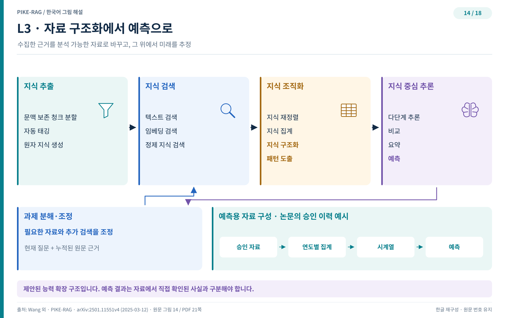

## L3 — 미래를 묻는 질문

"내년까지 승인될 신약은 몇 건일까." 이런 질문의 답은 아무리 좋은 검색기로도 문서에서 튀어나오지 않는다. 자료에는 과거의 승인 기록만 있고 미래의 숫자는 없기 때문이다. L3 시스템은 여기서 출발한다. 답이 원문에 없는 예측 질문을 풀려면 지식을 모으는 일보다 지식을 구조화하는 일이 먼저다. 3장에서 예고한 지식 구조화와 지식 유도 서브모듈이 이 단계에서 실제로 움직인다.

### 지식 구조화와 지식 유도

L3는 지식 기반 예측 능력에 무게를 둔다. 검색된 지식을 모으고 조직한 다음, 그 위에 예측 근거(forecasting rationale)를 세운다. 과제 분해와 조율 모듈이 조직된 지식 위에서 예측 근거를 만드는 역할을 맡는다. 지식 조직(knowledge organization) 모듈에는 두 서브모듈이 새로 붙는다. 지식 구조화(knowledge structuring)는 원시 검색 지식을 구조화된 일관된 형태로 바꾸어 뒤이은 추론과 예측에 쓰기 좋게 만들고, 지식 유도(knowledge induction)는 구조화된 지식을 범주로 묶어 통계 분석과 예측의 밑천으로 삼는다.

원문이 드는 예시가 미국 식품의약국(FDA) 시나리오다. 약품 라벨, 임상시험, 신청 서류 같은 여러 원천의 데이터가 다층 지식베이스로 들어온다. 지식 구조화 서브모듈은 과제 분해 모듈의 지시에 따라 약품명과 승인일 같은 관련 지식을 수집하고 조직한다. 지식 유도 서브모듈은 그 지식을 승인일 같은 기준으로 범주화해 통계 분석과 예측을 돕는다.

그림 14는 L3 프레임워크의 전체 흐름을 그린다. 지식 조직 모듈 안의 두 사각형이 지식 구조화와 지식 유도를 가리키고, 지식 중심 추론 모듈 안의 사각형이 예측 서브모듈을 가리킨다. 원시 지식이 구조화되고 범주화된 다음에야 예측이 가능하다는 순서가 그림에 그대로 드러난다.

### 예측 서브모듈

언어 모델은 전문 분야의 추론 논리를 적용하는 데 한계가 있어 예측 과제에서 효과가 제한된다. 지식 중심 추론(knowledge-centric reasoning) 모듈은 이를 보완하려고 예측(forecasting) 서브모듈을 새로 둔다. 질문과 조직된 지식을 받아 연도별 승인 약품 총수 같은 통계에서 결과를 추론한다. 시스템은 과거 지식에 근거한 답변을 넘어 투영(projection)을 수행하므로 복잡하고 역동적인 질문에 더 견고한 답을 낸다. 봉지에 담긴 날짜별 영수증만 나열해서는 이번 달 지출을 알 수 없고 항목별로 묶어 봐야 추세가 보이는 것과 같다. 지식 유도가 묶음을 만들고 예측 서브모듈이 그 추세를 다음 달로 밀어 간다. 분해와 조율 모듈이 예측에 쓸 근거를 설계하고, 추론 모듈의 예측 서브모듈이 그 실행을 맡는다.

### 답이 하나로 정해지지 않는 질문

예측 질문의 답은 유일하지 않다. EM이나 F1 같은 지표는 사실이고 확정적인 답을 전제하므로 예측 질문에는 어울리지 않으며, 추세 판단과 정성 분석이 더 적합하다. 평가 방식 자체도 단계와 함께 바뀌어야 한다.

지식을 배열해 미래를 읽는 단계까지 왔다. 다음 장에서는 배열된 지식으로 새로운 것을 만들어 내는 창의 질문을 만난다.
