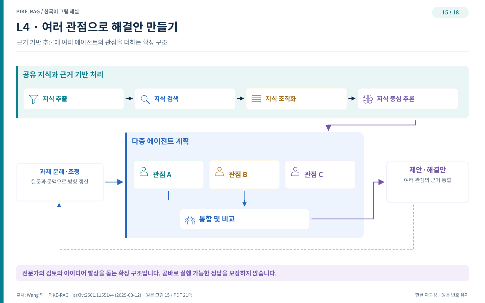

## L4 — 관점을 늘리는 에이전트들

"이 지식으로 새로운 무엇을 만들 수 있을까." 창의 질문은 사실 정보에 바탕을 두되 원리와 규칙을 제대로 이해해야 풀린다. 정해진 답을 찾는 질문과 결이 다르다. L4 시스템은 여러 에이전트를 엮어 다관점 사고(multi-perspective thinking)를 가능하게 하는 것으로 이 단계를 넘는다.

### 창의 질문의 세 난제

원문은 창의 질문을 다루는 데 세 가지 어려움을 꼽는다. 첫째는 검색된 지식에서 일관된 논리 근거를 뽑아내는 일이다. 근거 조각이 흩어져 있으면 창의적 제안도 공중에 뜬다. 둘째는 여러 영향 인자가 얽힌 복잡한 추론 과정을 밟아 가는 일이다. 셋째는 개방형 질문의 답을 평가하는 일이다. 앞 단계의 지표는 확정 답을 전제하므로, 관련성과 다양성과 포괄성과 독창성과 영감 같은 기준으로 채점 방식을 새로 설계해야 한다.

### 멀티 에이전트 플래닝

해법은 멀티 에이전트 플래닝(multi-agent planning)이다. 에이전트마다 고유한 통찰과 추론 전략을 담당하며 병렬로 움직인다. 서로 다른 사고 과정이 동시에 돌고 그 결과가 합쳐지므로, 다양한 추론 경로를 병렬로 처리하고 통합하는 일이 한 번에 이루어진다. 이 구조는 얽힌 질문도 제대로 관리하고 응답할 수 있게 한다. 여러 관점을 시뮬레이션하므로 시스템은 정해진 해법을 출력하는 대신 혁신적인 아이디어를 낳는다. 여러 에이전트의 조율된 출력은 추론 과정을 풍부하게 하고 사용자에게 포괄적 관점을 건네며, 창의적 사고와 새로운 해법의 영감을 불어넣는다.

그림 15는 멀티 에이전트 플래닝 모듈이 추가된 L4 프레임워크를 보여준다. 여러 에이전트가 병렬로 추론 경로를 걷고 그 출력이 합쳐진다. 한 경로의 답을 고르는 구조가 아니라 경로 여럿을 합성하는 구조라는 점이 이전 단계 그림과 다르다. 회의실에서 여러 전문가가 각자 의견을 내놓으면 한 사람의 결론보다 넓은 선택지가 모이는 것과 같은 원리다.

### L1부터 L4까지, 하나의 프레임워크

다섯 단계를 돌아보자. L0은 지식베이스를 구축하고 L1은 사실 질문에 답하며 L2는 여러 근거를 잇고 L3는 지식을 구조화해 예측하며 L4는 창의적 해결안을 제안한다. 단계가 오를 때마다 시스템 전체를 갈아엎는 일은 없다. 일곱 모듈로 이루어진 하나의 프레임워크 안에서 필요한 모듈을 보강하고 서브모듈을 붙이는 방식으로 능력이 쌓인다. 이 계단식 설계 덕분에 실무자는 자신의 데이터와 질문 수준에 맞는 단계에서 출발해 한 단계씩 올라갈 수 있다.

이론의 계단을 모두 밟았다. 다음 장부터는 이 설계가 실제로 통하는지 벤치마크 수치로 확인한다.
