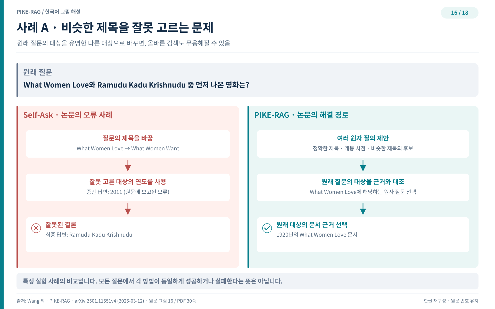
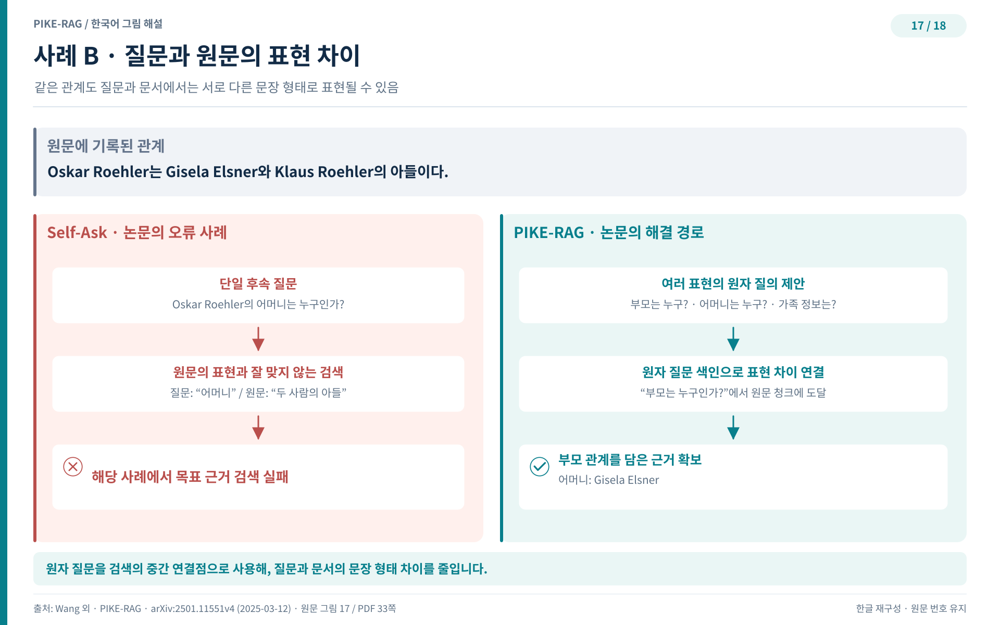
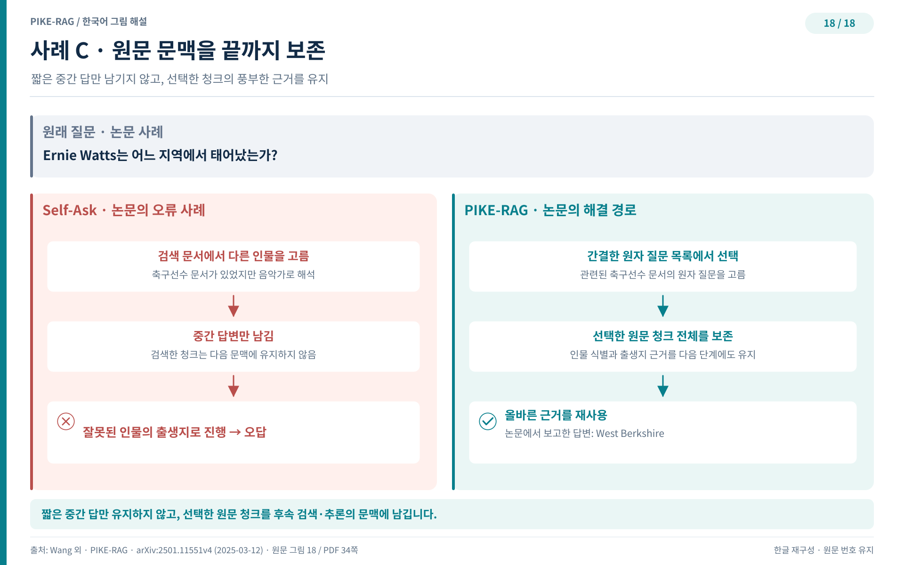

## 세 가지 실패 사례와 해법

수치 표는 격차가 얼마인지는 알려주지만 격차가 왜 생기는지는 말해주지 않는다. 논문은 평가 벤치마크에서 가져온 실제 사례 세 개를 펼쳐 놓고, 단일 경로 분해가 어디서 길을 잃는지 그리고 이 방법의 파이프라인이 어떻게 그 실패를 되돌리는지 대조한다. 세 사례는 각각 따로 있는 문제처럼 보이지만, 뒤집으면 하나의 원칙이다. 질문의 의도를 이르게 확정하지 말고, 원문의 표현과 질문의 표현 사이 간극을 좁히고, 원문 문맥을 끝까지 놓지 말라는 것이다.

### 사례 A. 비슷한 제목을 잘못 고르는 문제

첫 사례는 언어 모델의 선입견이 질문 자체를 교정해 버리는 상황이다. 원래 질문은 덜 유명한 영화 What Women Love를 묻는다. 그런데 세상에 훨씬 유명한 영화 What Women Want가 있으니, 모델은 원래 질문을 유명한 쪽으로 바꾸어 읽어 버린다. Self-Ask처럼 후속 질문을 하나만 만드는 방식은 이 잘못된 대상에 대한 후속 질문을 생성하고, 그로부터 거짓 중간 답을 얻어 최종 답까지 틀리게 도달한다. 재미있는 점은 목표 청크가 임베딩 유사도 덕에 이미 검색되었다는 사실이다. 검색은 성공했는데 질문 해석이 틀려 망한 경우다.

그림 16의 왼편에서 Self-Ask가 유명한 제목 쪽으로 후속 질문을 하나만 던지고 잘못된 결론에 도착하는 경로를 확인할 수 있다. 오른편의 이 방법은 What Women Love와 What Women Want 양쪽에 관한 원자 질문 여러 개를 제안한다. 두 영화가 모두 존재하고 관련 원자 질문이 검색되었으므로, 이 방법은 질문의 진짜 의도를 판단하는 일을 뒤로 미룰 수 있다. 의도 판정을 처음에 확정하지 않고 원자 질문 선택 단계로 옮기는 것이 핵심이다. 후보가 여럿일 때 비로소 어느 쪽이 질문자의 뜻인지 근거를 놓고 고를 수 있다.

### 사례 B. 질문과 원문의 표현 차이

두 번째 사례는 질문이 옳아도 검색이 실패하는 상황이다. Self-Ask 같은 단일 경로 방식은 Oskar Roehler의 어머니가 누구인지 곧장 묻는 후속 질문을 만든다. 뜻은 정확하다. 그러나 지식베이스는 가족 관계를 A가 B와 C의 아들이다라는 스키마로 서술하고 있으므로, 어머니라는 표현으로는 해당 청크가 끌려 나오지 않는다. 계층적 검색을 Self-Ask에 얹어도 이 간극을 메우지 못했다. 질문의 의미가 맞아도 원문의 문장 구조와 어긋나면 검색은 멈춘다.

그림 17에서 좌우 경로의 갈림길은 원자 질문의 개수다. 이 방법이 제안하는 원자 질문 중 어머니를 곧바로 묻는 것은 같은 검색 문제를 만나지만, 부모를 묻는 다른 원자 질문은 대상 청크를 성공적으로 끌어온다. 질문 표현을 여럿으로 넓혀 두면 그중 하나가 지식베이스의 서술 구조와 맞물릴 확률이 커진다. 어머니라는 낱말과 아들이라는 낱말 사이의 표현 패턴 차이를, 질문 목록이라는 완충지로 건너는 셈이다. 원자 질문을 검색 단위로 삼는 설계가 여기서 빛을 발한다. 청크를 직접 찾는 대신 청크가 답할 수 있는 질문을 먼저 찾기 때문이다.

### 사례 C. 원문 문맥을 끝까지 보존

세 번째 사례는 중간 답만 남기는 습관이 만드는 손실이다. Self-Ask는 각 라운드에서 검색한 청크를 중간 답으로 압축한 뒤 청크를 버린다. 그런데 압축 과정에서 주변 맥락이 떨어져 나가면, 그 맥락이 다음 라운드에 필요해질 때 아무것도 남아 있지 않다. 그림 18의 사례에서 Self-Ask는 목표 청크를 검색하는 데는 성공했지만 문맥 정보가 과도하게 많아 Ernie Watts라는 인물을 제대로 가려 내지 못했고, 중간 답이 틀린 경로로 이끌어 최종 결론까지 어긋났다.

그림 18의 오른편이 이 방법의 이중 이득을 보여준다. 첫째, 원자 질문 목록을 청크 내용의 요약 후보로 제시하므로 관련 정보를 가려 내는 일이 단순해지고 토큰 사용도 줄어든다. 둘째, 선택된 청크를 중간 답만 남기지 않고 통째로 보존하므로 후속 라운드에 풍부한 문맥이 그대로 쓰인다. 실제로 이 라운드의 원자 질문이 Ernie Watts의 역할을 묻고 있을 때, 그의 출생지 정보는 선택된 청크 안에 이미 들어 있으므로 따로 물어볼 필요가 없다. 청크가 살아 있는 한 그 안의 지식은 다음 라운드에 재사용된다.

세 사례를 관통하는 원칙은 겸손이다. 질문을 이해했다는 확신을 뒤로 미루고, 원문의 표현 방식에 맞춰 질문을 여러 개 준비하고, 한 번 찾은 문맥을 아끼지 않는 태도가 정확도를 만든다. 다음 장에서는 이 원칙을 한국 개발 현장의 언어로 옮겨 본다.
