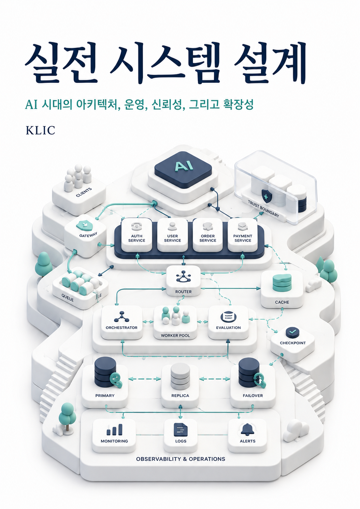

# 실전 시스템 설계 2026

## AI 시대의 아키텍처, 운영, 신뢰성, 그리고 확장성

**원고 기준일:** 2026-08-06  
**상태:** 38장 전체 1차 초고 · 기술/편집/시각자료 검수 전  
**원본 형식:** Markdown

이 원고는 Donne Martin의 *The System Design Primer*를 자료원 중 하나로 사용해 한국어로 새로 구성한 개정·확장 초고다. 원문의 순서와 문장을 그대로 번역하지 않았고, 분산 시스템 원리와 2026년의 네트워크·관측·보안·클라우드·AI 시스템 설계를 하나의 학습 흐름으로 다시 작성했다.
