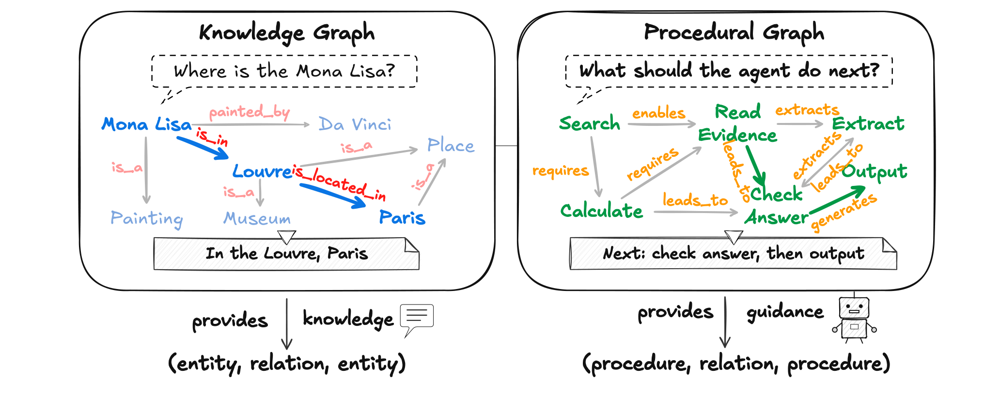

## 1. 왜 절차 그래프인가

### 자유 생성에 떠넘겨진 절차 일관성

언어 모델(LLM)은 장기간에 걸친 계획을 세우고 외부 도구로 행동하는 자율 에이전트 형태로 배치 범위를 넓혀 왔다. 그런데 오늘날 대부분의 에이전트는 다음 행동을 고를 때 특별한 제약을 두지 않는다. 지금까지의 행동과 관찰이 평평하게 쌓인 기록을 조건으로 삼아, 자유로운 생성으로 행동을 뽑는 방식이다. 이 구조에서 절차의 일관성은 모델의 자유 생성에 전적으로 떠넘겨진다. 에이전트는 스스로 어떤 관찰이 관련 있는지 가려내고, 앞으로 어떤 단계가 남아 있는지 추론하고, 그 단계 사이의 의존 관계를 지키는 행동을 골라야 한다.

기록이 짧을 때는 이 부담을 감당할 수 있다. 문제는 궤적이 길어질 때다. 저자들은 이때 에이전트가 목표를 놓치고, 도구를 순서대로 부르지 못하고, 생산성 없는 행동을 되풀이한다고 진단한다. 세 실패 모두 지식이 없어서가 아니라, 무엇을 어떤 순서로 어떤 조건에서 해야 하는지가 어디에도 명시돼 있지 않기 때문에 생긴다. 쌓이는 기록은 과거에 무엇을 했는지만 알려 줄 뿐, 앞으로 무엇이 허용되는지는 말해 주지 않는다.

### 기존 접근 세 가지

절차적 구조를 주려는 시도는 이미 여럿 있다. 텍스트 메모리와 자기성찰 계열(ReAct 계열 에이전트의 실패 기록을 활용하는 방법을 포함한다)은 지난 경험을 자유 형식의 텍스트로 적어 두었다가 필요할 때 꺼내 문맥에 넣어 재사용하게 한다. 기록에는 쓸모 있는 경험이 남지만, 그 경험이 지금 이 단계에 어떻게 적용되는지, 뒤따르는 단계를 어떻게 구속하는지는 매번 솔버가 스스로 재구성해야 한다. 같은 교훈을 상황이 바뀔 때마다 새로 해석하는 셈이다.

상태 조건형 가이드라인은 상태에 따라 골라 주는 규칙 조언이라서 더 겨냥된 도움을 준다. 다만 규칙을 검색해 줄 뿐, 절차 단계와 단계 사이를 잇지는 못한다. 어떤 규칙이 끝난 뒤 어떤 단계가 허용되는지는 여전히 모델의 몫으로 남는다.

워크플로와 상태 기계는 단계를 명시적으로 드러내고 실행을 구속하기 때문에 앞의 두 접근보다 구조가 단단하다. 그러나 그 단계를 사람이 손으로 설계해야 한다. 워크플로 구조를 오프라인에서 최적화하는 자동 탐색 연구는 이 설계 수고를 덜어 주지만, 저자들이 짚는 남은 과제는 그대로다. 편집할 수 있는 절차 표현에, 에이전트의 현재 진행 상황에 맞춰 조건이 붙는 가이던스를 결합하는 것이다.

### 에이전트가 절차 지식에 바라는 네 가지

저자들은 에이전트에게 필요한 절차 지식의 조건을 네 가지로 정리한다.

- **구조화**: 무효한 행동에서 벗어나도록 방향을 잡아 줄 만큼 구조가 명시적이어야 한다.
- **유연성**: 구조가 추론의 자유를 지키며, 모델이 스스로 생각할 여지를 짓누르지 않아야 한다.
- **진행 상황 응답성**: 지금 어디쯤 와 있는지에 따라 도움의 내용이 달라져야 한다.
- **경험으로 개선**: 실행을 거듭하면서 함께 나아져야 한다.

### 절차 그래프: what-to-do를 위한 삼중조

저자들은 이 네 조건을 절차 그래프(Procedural Graph, PG)로 충족시킨다. 절차 그래프는 절차 지식을 담은 명시적이고 편집 가능한 방향 그래프다. 설계를 보면 익숙한 구조가 그대로 옮겨 왔다. 지식 그래프가 사실 지식을 (entity, relation, entity) 삼중조로 정리해 what-is 질문에 답하듯, 절차 그래프는 절차 정보를 `(procedure, relation, procedure)` 삼중조로 정리해 what-to-do 질문에 답한다. 노드는 도구 행동과 추론 단계, 상태를 추상화한다. 에지는 허용되는 전이를 인코딩하고, 그 전이를 어떻게 언제 취해야 하는지를 설명하는 텍스트 속성을 단다.

절차 지식이 모델 가중치 밖의 구조로 존재한다는 점이 이 설계의 요체다. 가중치 안에 묻혀 있지 않기 때문에 사람이 눈으로 검사할 수 있고, 실행 중 매 단계 조회할 수 있고, 재학습 없이 고칠 수 있다. 프롬프트 몇 줄에 압축하는 방식과 달리, 지식의 양이 문맥 창을 갉아 먹지도 않는다.

그림 1-1은 두 그래프의 역할 차이를 한 화면에 나란히 보여준다. 왼쪽의 지식 그래프는 "모나리자는 어디에 있나"라는 질문을 받는다. 모나리자가 다빈치가 그렸고(painted_by), 그림이라는 개념에 속하며(is_a), 루브르에 있다는(is_in) 사실이 삼중조로 놓여 있어, 질문에 대한 답은 "루브르, 파리"다. 오른쪽의 절차 그래프는 같은 상식을 쓰되 물음이 다르다. "에이전트가 다음에 무엇을 해야 하나"라는 물음 앞에 검색하고, 근거를 읽고, 필요한 값을 꺼내고, 계산하고, 답을 검사한 뒤 출력으로 마치는 일련의 절차가 노드와 전이로 놓여 있다. 전이는 어떤 단계가 무엇을 가능하게 하고(enables), 무엇을 끌어내고(extracts), 무엇을 요구하는지(requires)로 이름이 붙고, 그래프는 지금 단계에서 "다음은 답을 검사한 뒤 출력한다"라고 가리킨다. 사실의 모음이 무엇이 무엇인지 묻는 질문에 지식을 주는 구조라면, 절차의 모음은 지금 무엇을 해야 하는지 묻는 질문에 가이던스를 주는 구조다.

### 두 국면으로 움직이는 프레임워크

저자들은 이 그래프를 서로 보완하는 두 국면에 배치한다. 온라인 추론 국면에서 프레임워크는 에이전트 궤적에서 활성 노드의 위치를 좁혀 찾고, 가이던스 모델이 주변 서브그래프를 위상적 맥락까지 포함해 읽은 뒤, 관련 에지 속성을 다음 단계의 상황 지침으로 번역한다. 오프라인 자기진화 국면에서는 학습 과업 묶음을 하나씩 마칠 때마다 LLM 정제기가 실패한 궤적과 성공한 궤적을 대조하며 그래프의 위상과 속성에 대한 편집을 제안한다. 빠진 노드와 에지를 더하고, 실패를 부르는 것을 잘라 내고, 에지 속성을 다듬는 작업이다. 구조상 문제가 없는 후보 그래프는 홀드아웃 검증 점수를 지키거나 끌어올릴 때 채택되고, 거부된 후보는 부정적 제약으로 남는다. 검증 게이트가 점수를 낮추는 후보를 걸러 내고, 거부 메모리가 같은 실패 제안의 반복을 막는다.

### 논문이 내세우는 기여

원문은 저자들의 기여를 네 가지로 요약한다.

- 절차 그래프(PG): 솔버의 추론 유연성을 지키면서 LLM 에이전트 실행을 이끄는, 명시적이고 편집 가능한 절차 지식 그래프를 제시한다.
- 생성형 PG 가이던스: 정적인 그래프와 살아 있는 궤적을 단계 수준의 상황 지침으로 바꾸는 온라인 메커니즘을 제안한다.
- 자기진화 루프: 실행 피드백으로 그래프의 위상과 속성을 다듬는 순환을 개발한다.
- 측정된 효과: 다양한 과업과 LLM에서 PG가 메모리 기반 베이스라인을 일관되게 앞선다. 백지에서의 진화는 손으로 설계한 그래프에 필적하거나 능가하는 그래프를 만들고, 같은 루프가 결함이 있는 전문가 사전도 고친다.

다음 장에서는 이 표현이 경쟁하는 기존 연구들을 자세히 살펴보고, 절차 그래프가 어디에 자리 잡는지 확인한다.

참고: 원문 §1 (pp.1-2)
