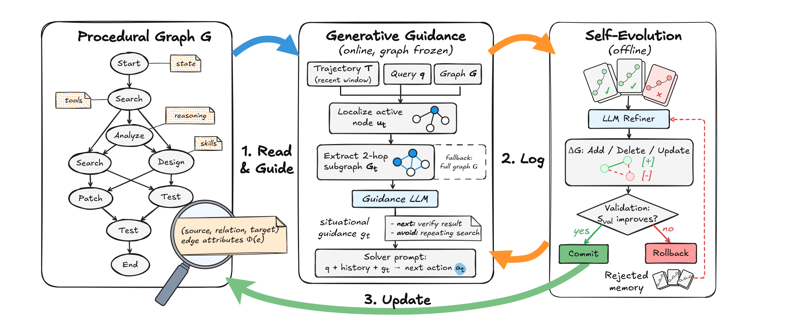

## 3. 절차 그래프 프레임워크

이 장은 책 전체의 뼈대를 세운다. 절차 그래프(Procedural Graph, PG)는 절차 지식을 방향성 그래프에 담아 두 가지 일을 동시에 한다. 과업을 푸는 동안에는 에이전트의 실행을 온라인에서 이끌고, 과업 실행이 끝난 뒤에는 그래프의 토폴로지와 속성을 반복적으로 다듙는다. 하나의 자료 구조가 실행 안내와 구조 개선을 함께 맡는 셈이다.



### 두 국면: 온라인 추론과 오프라인 진화

프레임워크는 서로를 보완하는 두 국면으로 움직인다. 온라인 추론 국면에서 그래프는 동결된다. 과업을 푸는 동안 누구도 그래프를 고치지 않으며, 에이전트는 절차 그래프와 자신의 궤적을 결합해 그 시점 상황에 맞는 동적 가이던스를 만들어 낸다. 그림 3-1의 가운데 패널이 이 흐름을 담고 있다. 질의가 들어오면 현재 행동에 해당하는 활성 노드를 찾고, 그 이웃을 꺼내 가이던스 모델에 넘기는 순서다. 그림 3-2는 같은 흐름을 한국어 라벨로 펼쳐 놓은 것이다.

```diagram
{
  "layout": "flow",
  "title": "매 단계마다 그래프 이웃이 상황 가이던스로 바뀐다",
  "sub": "온라인 추론 — 그래프는 동결된 채 궤적과 결합한다",
  "caption": "그림 3-2 생성형 가이던스 — 활성 노드를 찾고 2홉 이웃을 펼쳐 가이던스 모델이 단계별 상황 가이던스로 번역해 솔버에 덧붙인다",
  "nodes": [
    {"id": "q", "label": "사용자 질의 + 최근 궤적 창", "tone": "gray"},
    {"id": "m", "label": "활성 노드 위치 파악 (Match)", "tone": "blue"},
    {"id": "g", "label": "2홉 서브그래프 추출", "tone": "blue"},
    {"id": "psi", "label": "가이던스 모델 Ψ — 속성 번역", "tone": "green"},
    {"id": "gt", "label": "상황 가이던스 g_t", "tone": "green"},
    {"id": "sol", "label": "솔버가 다음 행동 선택", "tone": "gray"}
  ],
  "edges": [
    {"from": "q", "to": "m", "label": "최근 절차 정확 일치"},
    {"from": "m", "to": "g", "label": "실패 시 전체 그래프"},
    {"from": "g", "to": "psi"},
    {"from": "psi", "to": "gt"},
    {"from": "gt", "to": "sol", "label": "프롬프트에 덧붙임"}
  ]
}
```

오프라인 진화 국면은 학습 과업 배치의 실행이 끝난 뒤에 시작된다. LLM 정제기가 이번 배치에서 남긴 진단 흔적을 분석하고, 자동화된 피드백 루프를 통해 그래프의 토폴로지와 속성을 수정한다. 그림 3-1의 오른쪽 패널이 이 루프를 담당한다. 온라인 국면이 그래프를 소비하는 쪽이라면 오프라인 국면은 그래프를 생산하는 쪽이고, 두 국면이 번갈아 돌면서 그래프는 점점 단단해진다.

### 3.1 형식 표현

절차 그래프를 수식으로 적으면 방향성 속성 그래프 하나가 된다.

$$G = (V, R, E, \Phi), \qquad E \subseteq V \times R \times V$$

여기서 V는 추상 노드의 집합이고, R은 전이 관계의 어휘이며, E의 각 원소는 방향성과 속성을 갖춘 삼중조다. 에지 (u, r, v)는 노드 v가 관계 r 아래에서 노드 u 다음에 허용된다는 뜻이다. "u를 마쳤다면 v로 갈 수 있다"는 문장을 그래프가 직접 기억하는 것이다.

노드가 추상화하는 대상은 넓다. 도구 함수 한 개가 노드가 될 수 있고, 스킬이나 내부 추론 단계, 과업의 상태도 노드가 된다. 속성 사상 Φ는 에지마다 이름 붙은 속성 집합을 매핑하며, 스키마는 과업에 맞게 지정한다. 이 책이 다루는 구현은 세 개의 텍스트 필드를 쓴다. `condition`(적용 조건)은 그 전이가 언제 적용되는지 말하고, `guidance`(수행 지침)는 어떻게 나아가는지 알려 주며, `pitfalls`(주의점)은 무엇을 피해야 하는지 짚어 준다.

금융 플래닝 예시가 이해를 돕는다. 에지 (`cash_flow_forecast`, `LEADS_TO`, `fund_raising_request`)는 현금흐름 예측이 자금 조달 요청으로 이어지는 전이다. 이 에지에 속성을 붙이면 다음과 같아진다. condition에는 "예상 런웨이가 안전 버퍼 아래로 떨어질 때"가 들어가고, guidance에는 "자금 조달 지연을 고려해 요청을 일찍 제출한다"가, pitfalls에는 "요청이 진행 중일 때 두 번째 요청을 쌓지 않는다"가 담긴다. 검색 한 번으로 전이의 조건과 요령, 함정이 함께 나오는 셈이다.

과업 지식을 삼중조로 구조화하면 허용되는 전이가 명시적으로 드러나고, 에이전트는 유효한 도구 호출과 행동 수열 쪽으로 이끌린다. 그래프의 출발점은 두 가지다. 전문가 사전에서 초기화하거나 백지에서 시작할 수 있다. 두 구축 전략의 차이는 원문 §5.3이 실험으로 비교한다.

### 3.2 추론 시점의 생성형 가이던스

전이 속성을 독립적으로 조회하는 방식은 겉보기에 자연스럽지만, 상위-k 유사도 검색 같은 조회는 절차 단계 사이의 연결을 놓치기 쉽다. submit에 대한 가이던스를 검색하면서 앞선 check_answer 전이를 빼놓으면 어떻게 될까. 제출이라는 행동만 던져지고, 그 제출을 적절하게 만들어 주는 검증 단계는 사라진다. 연결된 이웃을 함께 조회하면 행동과 그 절차적 전제가 한 묶음으로 나온다.

생성형 절차 그래프 가이던스는 이 문제를 세 연산으로 푼다. 위치를 좁혀 찾는 locate, 이웃을 꺼내는 extract, 가이던스를 만드는 generate가 그것이다. 사용자 질의를 q, 의사결정 시점 t까지 행동과 관측이 번갈아 쌓인 이력을 T_t = (a_1, o_1, ..., a_{t-1}, o_{t-1})라 하자. 시작점 표식으로 a_0 = Start를 두므로 첫 단계는 u_1 = Start에 위치한다. 각 시점에서 다음을 계산한다.

$$u_t = \mathrm{Match}(a_{t-1}, V), \qquad G_t = \begin{cases} N_h(u_t), & u_t \neq \emptyset \\ G, & \text{otherwise} \end{cases}, \qquad g_t = \Psi(G_t, q, T_{t-w:t})$$

Match는 에이전트의 최근 절차, 예컨대 마지막 도구 호출을 노드 집합 V와 정확 일치시켜 현재 위치를 찾는다. 방향성 에지 이웃 `N_h(u_t)`는 u_t 자신과, 최대 h홉까지 확장하며 도달하는 나가는 전이들을 담는다. `T_{t-w:t}`는 최근 w스텝 창이고, Ψ는 가이던스 언어모델이다. 일치에 실패하면 전체 그래프 G로 물러난다.

연결된 이웃을 건네주는 까닭은 단순하다. Ψ가 전이를 위상적 문맥 속에서 읽을 수 있어야 하고, h개 전이 앞까지 가능한 다음 수를 미리 따져 봐야 하기 때문이다. Ψ는 주변 에지들의 정적 속성 Φ(e)를 상황 가이던스 g_t로 번역하면서 에이전트의 즉각적 목표가 무엇인지, 형식상·논리상 어떤 오류를 피해야 하는지 짚어 준다.

이렇게 만든 가이던스 g_t는 솔버 프롬프트 뒤에 덧붙는다. 솔버는 질의와 궤적, 가이던스를 놓고 다음 행동을 고른다.

$$a_t \sim P_{\mathrm{solver}}(q, T_t, g_t)$$

여기서 중요한 점은 통합이 소프트라는 것이다. 가이던스는 솔버의 선택을 강제하지 않고 편향시킬 뿐이므로, 에이전트는 그래프 G에 새겨진 절차 구조 쪽으로 기울면서도 추론의 자유를 그대로 유지한다. 일치에 성공하면 지역 이웃을, 실패하면 전체 그래프를 쓰는 이 설계의 성능과 효율은 원문 §5.5가 평가하고, 실제 실행 사례는 원문 부록 F에 정리되어 있다.

### 3.3 절차 그래프의 자기진화

오프라인 자기진화 루프는 실행 피드백에서 그래프의 토폴로지와 속성을 고쳐 주므로, 수작업 설계의 부담을 덜어 준다. 초기 그래프를 `G_0`, k라운드를 거친 뒤 남은 그래프를 `G_k`라 하자. 각 라운드는 직전 그래프 `G_{k-1}`에서 출발하며, 게이트에서 거부된 후보는 다음 라운드의 시작 그래프가 될 수 없다는 규칙이 깔려 있다. k = 1부터 K까지 진화 엔진은 네 단계 루프를 돌린다. 그림 3-3은 이 루프 전체를 한 장의 도면에 요약한다.

```diagram
{
  "layout": "flow",
  "title": "검증 게이트와 거부 메모리가 진화를 가둔다",
  "sub": "오프라인 자기진화 — 거부된 후보는 다음 라운드의 출발점이 되지 않는다",
  "caption": "그림 3-3 자기진화 루프 — 진단 롤아웃의 성공·실패 궤적 대비에서 편집을 제안하고, 검증 게이트를 통과한 후보만 보존 그래프가 된다",
  "nodes": [
    {"id": "roll", "label": "진단 롤아웃 — 학습 배치 실행", "tone": "gray"},
    {"id": "cmp", "label": "성공·실패 궤적 대비", "tone": "blue"},
    {"id": "edit", "label": "LLM 정제기 편집 ΔG 생성", "tone": "blue"},
    {"id": "cand", "label": "후보 그래프 — 구조 검사", "tone": "blue"},
    {"id": "gate", "label": "점수 유지·향상?", "kind": "gate", "tone": "amber"},
    {"id": "ok", "label": "보존 그래프 갱신", "tone": "green"},
    {"id": "rej", "label": "거부 메모리 기록", "tone": "red"}
  ],
  "edges": [
    {"from": "roll", "to": "cmp"},
    {"from": "cmp", "to": "edit"},
    {"from": "edit", "to": "cand"},
    {"from": "cand", "to": "gate"},
    {"from": "gate", "to": "ok", "kind": "ok", "label": "이상"},
    {"from": "gate", "to": "rej", "kind": "fail", "label": "미달", "side": "right"},
    {"from": "rej", "to": "edit", "kind": "back", "label": "재제안"},
    {"from": "ok", "to": "roll", "kind": "back", "label": "다음 라운드", "side": "left"}
  ]
}
```

#### 1단계: 진단 롤아웃

보존 그래프 `G_{k-1}`을 얹은 솔버가 학습 과업 배치 `B_k ⊂ D_train`을 실행한다. 실행마다 진단 흔적과 평가 점수를 함께 기록해 `E_k = {(q_i, T_i^(k), S_i^(k))}` 집합을 만든다. 여기서 `S_i^(k) ∈ [0, 1]`은 그 과업의 최종 점수다. 정제기는 점수 높은 흔적과 낮은 흔적을 나란히 놓고 비교하는데, 결과가 이진인 과업이라면 비교는 성공 대 실패로 단순해진다.

#### 2단계: 피드백 기반 변이

오프라인 LLM 정제기가 나뉜 흔적들을 살펴 두 가지 패턴을 찾는다. 실패 궤적에서는 반복되는 오류 루프를, 성공 궤적에서는 여러 단계를 한 번에 건너뛰는 추론 지름길을 찾는다는 것이다. 이 피드백을 바탕으로 정제기는 구조화된 편집 집합 ΔG_k를 만들어 내며, 여기에는 두 가지 토폴로지 편집이 들어간다. Add는 빠져 있던 검증 노드나 에지를 삽입해 구멍을 메우고, Delete는 궤적을 반복해서 실패로 몰거나 진행 자체를 막는 노드와 에지를 제거한다.

속성 수정도 같은 편집 인터페이스를 통과한다. 정제기는 속성을 제자리에서 고치는 대신 해당 에지를 삭제한 뒤 갱신된 속성 값으로 다시 추가하며, 이 방식은 스키마가 정의한 어떤 속성에도 적용된다. 제안된 편집을 모두 적용하면 후보 그래프 `G^cand_k = G_{k-1} ⊕ ΔG_k`가 나온다. 연산 ⊕는 그래프 복사본에 편집을 적용하고 설정되어 있는 사이클 수리를 수행하므로, 원본이 변하지 않고 순환 구조도 정리된다.

#### 3단계: 검증 게이트

구조를 고치는 변이가 학습 배치 너머의 성능을 실제로 끌어올리는지 판정하는 단계다. 편집 적용과 구조 검사를 통과한 후보만이 독립적인 홀드아웃 검증 집합 `D_val`에서 평가를 받는다. 무효한 후보는 검증 롤아웃 이전에 폐기되므로 보존 그래프와 캐시된 검증 점수는 그대로 남는다. 검증 과업 점수의 평균은 다음처럼 계산한다.

$$S_{\mathrm{val}}(G) = \frac{1}{|D_{\mathrm{val}}|} \sum_{(q,y) \in D_{\mathrm{val}}} S(f_{\mathrm{solver}}(q \mid G), y)$$

초기 그래프는 기준 점수를 세우기 위해 한 번 평가된다. 구조적으로 유효한 후보가 도착하면 보존 그래프는 아래 규칙으로 갱신된다.

$$G_k = \begin{cases} G^{\mathrm{cand}}_k, & S_{\mathrm{val}}(G^{\mathrm{cand}}_k) \ge S_{\mathrm{val}}(G_{k-1}) \\ G_{k-1}, & \text{otherwise} \end{cases}$$

게이트는 측정된 검증 점수가 현 그래프의 캐시 점수 이상인 후보를 채택한다. 점수가 밀리는 후보는 받지 않는 보수적 규칙이며, 이 판정이 확률적 평가 환경에서 어떻게 작동하는지는 원문 §5.4가 자세히 살펴본다.

#### 4단계: 거부 메모리

반복적인 자기수정에는 한 가지 함정이 있다. 정제기가 같은 실패 편집을 서로 다른 옷을 입혀 거듭 제안할 수 있다는 것이다. 검증 게이트에서 후보 그래프가 밀려나면(`S_val(G^cand_k) < S_val(G_{k-1})`), 프레임워크는 후보 그래프와 제안된 편집, 그리고 이에 딸린 학습 궤적 E_k와 검증 결과를 통째로 거부 메모리 `H_rejected`에 기록한다.

정제기에 넘겨줄 궤적 문맥은 학습 궤적들을 이어 붙여 만든다. 설정된 최대 토큰 길이 `L_max`를 넘으면 앞부분 토큰을 버리고 마지막 `L_max` 토큰을 원래 순서 그대로 보존한다. 궤적의 시작보다 끝을 남기는 선택이고, 이렇게 만들어진 문맥을 C_k라 부른다. k+1라운드의 편집을 제안할 때 정제기는 거부 이력을 음성 증거로 함께 받는다.

$$\Delta G_{k+1} \sim P_{\mathrm{refiner}}(G_k, C_{k+1}, H_{\mathrm{rejected}})$$

거부 이력 `H_rejected`가 있으면 정제기는 이미 실패한 편집을 피해 다닌다. 물론 제안된 변경이 보존 그래프에 들어가는 길은 언제나 검증 게이트를 거친 뒤에 열린다. 진화가 아무리 대담해도 최종 문은 게이트가 지킨다.

참고: 원문 §3 (pp.3–6)
