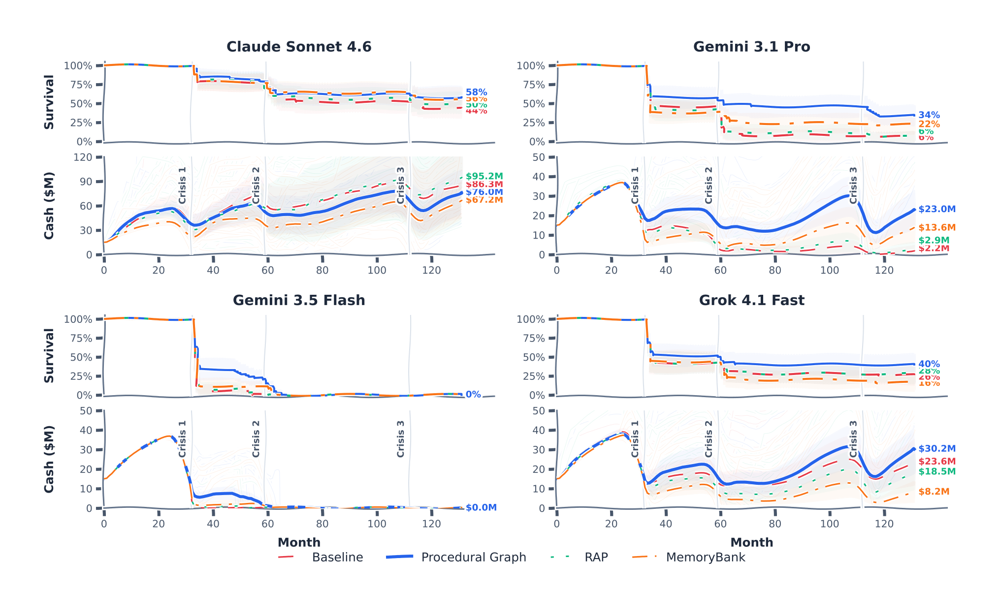

## 6. 장기 의사결정과 생존

### 132개월짜리 파산 게임

에이전트의 진짜 시험대는 한 번의 벤치마크 점수가 아니라 시간이다. 원문은 이 지점을 재기 위해 EnterpriseArena라는 시뮬레이터를 배치한다. 에이전트는 마이크로파이낸스 대출 기관의 최고재무책임자 역할을 맡아 최대 132개월에 걸쳐 월 단위 금융 의사결정을 내린다. 엄격한 유동성 제약이 걸려 있고, 에이전트에 공개되지 않은 세 차례의 거시 위기가 일정에 잡혀 있다.

시뮬레이터의 상태는 현금 잔액, 총 대출 포트폴리오, 대출손실 충당금, 이자·원금 수취액, 지급 계정, 총 부채, 조달된 자본, 활성 사용자 수를 담는 다차원 튜플로 정리된다. 에이전트가 쓸 수 있는 핵심 행동은 두 가지다. `book_closing()`은 한 달을 진행시키면서 대출 상각, 운영 비용과 사용자 획득 비용 차감, 부실 대출 상각과 새 충당금 산정을 실행한다. `fund_raising_request(type, amount)`는 자본을 요청하는데, 현실적인 제약 두 개가 붙는다. 자본은 즉시 도착하지 않고 요청 시점에서 1~6개월의 확률적 지연을 거쳐 들어오며, 한 번에 조달할 수 있는 규모도 거시 경제 상황과 기관 재무 건전성에 따라 동적으로 제한된다. 현금 잔액이 음수가 되는 순간 시뮬레이션은 파산으로 즉시 끝난다.

세 위기는 강도와 성격이 다르다. 첫 위기(32개월)는 상환율이 98%에서 90%로 내려가는 완만한 수축이다. 둘째 위기(59개월)는 심각한 경기 침체라서 상환율이 60%로 떨어지고, 상각이 급증하며, 사용자 자연 증가가 음수로 돌아선다. 셋째 위기(112개월)는 시스템 전체의 유동성 동결이다. 상환율이 40%까지 내려가고 조달 한도도 극단적으로 조여 새 자본 확보가 극도로 어려워진다.

측정 지표도 정해져 있다. 전체 기간 생존율(full-horizon survival)은 파산 없이 132개월을 완주한 실행의 비율이고, 위기별 열은 32·59·112개월 도달 비율이다. 평균 개월은 조기 종료를 포함한 실행 길이 평균이며, 도구 호출/월은 메모리 연산과 상태 변경 행동을 뺀 정보 조회 호출을 개월 수로 나눈 값이다. 조달액은 실행별로 실제 수령한 자본의 누적 평균이다.

### 생존율과 수명이 함께 움직인다

원문 그림 3을 그림 6-1로 재수록한다. 네 LLM의 Kaplan–Meier 생존 곡선과 앙상블 현금 궤적이 나란히 놓인다. 절차 그래프는 네 모델 모두에서 최고이거나 공동 최고의 전체 기간 생존율과 최장 평균 수명을 기록한다. 생존율은 Claude Sonnet 4.6에서 44.0%에서 58.0%로, Gemini 3.1 Pro에서 6.0%에서 34.0%로, Grok 4.1 Fast에서 26.0%에서 40.0%로 올라간다. Gemini 3.1 Pro의 절대 상승폭 28포인트가 가장 크고, Claude Sonnet 4.6과 Grok 4.1 Fast는 각각 14포인트씩 오른다. Grok 4.1 Fast에서는 평균 기업 점수 $39.62M로 전 구성 최고를 낸다.



표 6-1 비유도 베이스라인과 절차 그래프 구성의 EnterpriseArena 핵심 지표(1차 위기 도달율은 네 모델 모두 100.0%라 열에서 뺐다). 조달액과 도구 호출은 실행당 월평균 값이다.

| 모델·설정 | 전체 기간 생존율 | 평균 개월 | 평균 점수 | 2차 위기 | 3차 위기 | 도구 호출/월 | 조달액 |
|---|---|---|---|---|---|---|---|
| Claude Sonnet 4.6 베이스라인 | 44.0% | 89.80 | $78.86M | 78.0% | 52.0% | 0.13 | $152.12M |
| Claude Sonnet 4.6 + PG | 58.0% | 98.58 | $70.38M | 80.0% | 60.0% | 0.36 | $130.44M |
| Gemini 3.1 Pro 베이스라인 | 6.0% | 50.28 | $31.85M | 38.0% | 8.0% | 0.89 | $21.82M |
| Gemini 3.1 Pro + PG | 34.0% | 79.22 | $37.21M | 54.0% | 46.0% | 3.18 | $38.20M |
| Gemini 3.5 Flash 베이스라인 | 0.0% | 33.58 | $28.59M | 0.0% | 0.0% | 18.94 | $0.00M |
| Gemini 3.5 Flash + PG | 0.0% | 40.62 | $29.08M | 14.0% | 0.0% | 12.53 | $9.39M |
| Grok 4.1 Fast 베이스라인 | 26.0% | 63.76 | $39.42M | 42.0% | 28.0% | 0.47 | $27.24M |
| Grok 4.1 Fast + PG | 40.0% | 75.14 | $39.62M | 50.0% | 40.0% | 0.40 | $30.11M |

### 가이던스가 바꾸는 것은 호출 개수가 아니라 타이밍이다

가이던스가 바꾸는 것은 도구를 몇 번 부르는가가 아니라 무엇을 언제 부르는가다. 가이던스 없는 Gemini 3.5 Flash는 한 턴 안에서 현금과 시장 상태를 거듭 조회해 중복 관측을 문맥에 쌓는다. 월평균 18.94회의 도구 호출이 나오는데, 그래프는 이를 12.53회로 줄이면서 평균 기업 점수는 오히려 끌어올린다.

Claude Sonnet 4.6과 Gemini 3.1 Pro에서는 방향이 반대다. 도구 호출이 월평균 0.13에서 0.36으로, 0.89에서 3.18로 늘어나는데 생존율도 함께 오른다. 그래프가 자금 결정 전에 예측 계산과 시장 점검을 돌리도록 이끌기 때문이다(원문 부록 C.2).

### 생존과 상관되는 행동: 선제적 자금조달

네 모델 전체에서 생존과 함께 움직이는 행동은 선제적 자금조달(anticipatory fundraising)이다. 자본이 요청 후 1~6개월 뒤에야 도착하므로 위기를 넘기려면 유동성이 바닥나기 훨씬 전에 요청해 둬야 한다. 그림 6-2는 이 시간 차를 두 궤적으로 대비한다. 전체 궤적을 보면 가이던스 없는 Gemini 3.5 Flash 베이스라인은 조달을 너무 늦게 시작한다. 평균 조달액이 $0.00M에 그친다. PG 가이던스를 붙인 Flash는 $9.39M, PG 가이던스 Grok 4.1 Fast는 $30.11M을 조달한다.

```diagram
{
  "layout": "timeline",
  "title": "위기를 넘기는 행동은 선제적 자금조달이다",
  "sub": "자본이 도착하는 데 1~6개월이 걸리므로 요청은 위기보다 앞서야 한다",
  "caption": "그림 6-2 선제적 자금조달 — 가이던스 있는 에이전트는 안정기에 요청해 위기 전에 완충을 확보하고, 없는 에이전트는 조달을 늦춰 고갈한다",
  "axis": "EnterpriseArena 월 (최대 132개월)",
  "lanes": [
    {"name": "PG 가이던스", "tone": "green",
     "events": [
       {"label": "안정기 조달 요청", "major": true},
       {"label": "자본 도착"},
       {"label": "위기 통과", "major": true}
     ]},
    {"name": "가이던스 없음", "tone": "red",
     "events": [
       {"label": "조달 지연"},
       {"label": "위기 도래", "major": true},
       {"label": "현금 고갈"}
     ]}
  ]
}
```

### 첫 위기 앞의 세 에이전트

숫자 뒤의 메커니즘을 보려면 같은 과제 인스턴스에서 세 에이전트가 첫 위기에 들어서는 궤적을 나란히 놓아봐야 한다. 원문 부록 C.3는 Grok 4.1 Fast가 동일 인스턴스(시드 14)에서 29~33개월 사이에 남긴 실제 실험 로그를 추려 보여준다.

베이스라인 에이전트는 근시와 규칙 위반을 함께 보인다. 31개월에 현금 $14.2M을 확인하고도 파산 위험이 없다고 판단해 그냥 한 달을 넘긴다. 32개월에 현금이 $6.2M로 급감하자 equity $20M을 요청하고, 33개월에 현금이 $683K로 떨어진 뒤에야 앞의 equity 요청이 아직 처리 대기 중인데 debt $10M을 추가로 낸다. 환경은 조달 요청을 하나만 대기시킬 수 있다는 제약 때문에 이 요청을 거절한다. 조달을 위기 직전까지 미룬 대가가 그대로 드러난다.

메모리 요약 에이전트는 과거 사건을 LLM이 만든 요약으로 넘겨 본다. 현금 소진이 빨라지는 것은 알아채지만, 추론에서는 $18M과 $20M이라고 말하면서 실제 요청에는 단위 없는 18과 20을 넣고, 앞선 요청이 대기 중인 동안 같은 요청을 거듭 제출해 거절을 되풀이한다.

PG 가이던스 에이전트는 다르게 움직인다. 27개월에 넣은 equity 요청이 시장 한도에 걸려 $28.8M으로 줄어든 채 30개월에 도착한다. 이 에이전트는 같은 달에 VIX가 10.51로 매우 낮아 시장이 평온하고 희석 비용이 적다고 판단, $50M을 추가 요청한다. 이어서 12개월 현금흐름 예측으로 runway을 확인하고, 대기 중인 자본이 도착하기를 기다리는 동안 `book_closing()`으로 한 달씩 넘긴다. 전송 지연과 단일 대기 제약을 끝까지 지키며 위기 구간을 건너 132개월 시뮬레이션 끝까지 살아남는다. 대기 중인 조달을 추적하고, 예상 runway을 점검하고, 도착을 기다리며 달을 진행시키는 일이 베이스라인과 메모리 요약 궤적의 무효 요청과 정확히 대비된다.

원문은 이 관찰에 선을 긋는다. 세 궤적은 같은 인스턴스에서 나타난 행동 차이를 보여줄 뿐, 각 행동이 실행 전반에서 얼마나 자주 나오는지는 정하지 않는다.

참고: 원문 §5.2 (p.8)·부록 C (pp.24–28)
