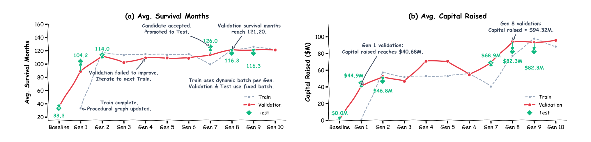

## 8. 자기진화 10라운드

EnterpriseArena는 에이전트를 재무책임자 자리에 앉힌다. 거시 경제 위기가 연이어 닥치는 가운데 기업 유동성을 관리해야 하고, 시뮬레이션이 끝날 때까지 회사를 살려 두는 것이 과업이다. 이 환경이 요구하는 핵심 판단은 조달 타이밍이다. 자금 조달을 요청하면 자본이 도착하기까지 한 달에서 여섯 달이 걸리므로, 현금이 바닥난 뒤에 움직이면 이미 늦었다.

가이던스 없는 베이스라인은 이 판단에 실패한다. 검증 분할에서 전체 기간 생존율은 0.0%, 평균 수명은 34.8개월에 그친다. 실패 지점을 들여다보면 사정이 더 분명해진다. 첫 번째 위기는 에이전트 100.0%가 통과하지만 두 번째와 세 번째 위기에서는 하나도 살아남지 못한다. 한 차례 위기는 견뎌도, 조달 시점을 경험에서 배워야 하는 연쇄 위기 앞에서 무구조 에이전트는 무너진다.

자기진화 루프는 이 출발선에서 열 라운드를 돈다. 원문 그림 4를 그림 8-1로 재수록한다. 라운드별 평균 수명과 조달 자본의 궤적이 그대로 담긴다. 검증 성적은 몇 차례의 뚜렷한 도약으로 이어지고, 그 사이에는 아무 것도 채택되지 않는 구간이 끼어 있다.



가장 큰 단일 도약은 라운드 1이 만든다. 변이 엔진이 발견한 것은 정교한 전략이 아니라 순차적 백본이다. 자금 결정에 앞서 현금을 점검하고 런웨이를 예측하라는 순서를 그래프에 박아 넣었을 뿐인데 검증 생존율이 0.0%에서 45.0%로 뛴다. 라운드 2는 이 그래프가 남긴 흔적을 재사용한다. 매월 저장한 노트를 다음 달 초에 다시 읽는 recall_notes가 추가되면서 생존율이 80.0%에 올라탄다. 도구 사용도 함께 줄어 비유도 베이스라인의 월평균 17.23회에서 3.08회로 떨어진다.

라운드 3부터 6까지는 채택이 없다. 세 라운드는 검증 성적 되돌림으로 기각되고, 한 후보는 롤아웃 전 구조 검증에서 잘못됐음이 드러나 시뮬레이션까지 가지 못한다. 라운드 7은 가지치기다. "아무것도 하지 않는" pass_action 분기를 잘라 낸다. 라운드 8은 행정 우회를 도입해 검증 생존율 90.0%에 도달하고, 라운드 9가 이 수준을 유지한다. 라운드 10 후보가 거부되면서 루프는 마지막으로 채택된 그래프를 남기고 종료한다. 그림 8-2는 이 열 라운드를 채택과 거부의 타임라인으로 정리한다.

```diagram
{
  "layout": "timeline",
  "title": "열 라운드의 채택과 거부가 생존율을 세운다",
  "sub": "채택은 드물게, 거부는 기록으로 — 개별 판정은 탐색 흔적이다",
  "caption": "그림 8-2 자기진화 10라운드 — 라운드 1의 순차 백본과 라운드 2의 노트 재사용이 큰 도약이었고, 라운드 8의 행정 우회까지 검증 생존율 90%에 도달했다",
  "axis": "자기진화 라운드 (1–10)",
  "lanes": [
    {"name": "채택", "tone": "blue",
     "events": [
       {"label": "R1 순차 백본", "major": true},
       {"label": "R2 노트 재사용", "major": true},
       {"label": "R7 가지치기"},
       {"label": "R8 행정 우회", "major": true}
     ]},
    {"name": "보류·거부", "tone": "gray",
     "events": [
       {"label": "R3–6 보류"},
       {"label": "R10 거부"}
     ]}
  ]
}
```

표 8-1은 열 라운드의 검증 분할 결과를 베이스라인과 함께 모아 보여준다(원문 Table 11 축약 재구성).

| 라운드 | 판정 | 생존율 | 평균 수명(개월) | 월평균 도구 호출 | 조달 자본 |
|---|---|---|---|---|---|
| 베이스라인 | 출발점 | 0.0% | 34.80 | 17.23 | $0.47M |
| 라운드 1 | 채택 | 45.0% | 88.90 | 7.92 | $40.68M |
| 라운드 2 | 채택 | 80.0% | 112.60 | 3.08 | $52.33M |
| 라운드 3 | 기각 | 65.0% | 102.15 | 3.30 | $46.74M |
| 라운드 4 | 기각 | 75.0% | 109.20 | 3.05 | $70.85M |
| 라운드 5 | 롤아웃 전 실패 | 75.0%* | 109.20 | 3.05 | $70.85M |
| 라운드 6 | 기각 | 65.0% | 108.75 | 2.91 | $54.54M |
| 라운드 7 | 채택 | 80.0% | 114.15 | 3.12 | $68.91M |
| 라운드 8 | 채택 | 90.0% | 121.20 | 3.13 | $94.32M |
| 라운드 9 | 채택 | 90.0% | 121.20 | 3.08 | $93.05M |
| 라운드 10 | 기각, 루프 종료 | 85.0% | 121.20 | 3.01 | $95.76M |

* 라운드 5는 구조 검증 실패로 평가를 건너뛰어 라운드 4 수치를 그대로 이어받는다.

탐색이 돌려준 그래프와 탐색 도중의 중간 후보는 구분해서 보고해야 한다. 반환된 그래프의 테스트 생존율은 85.0%로 베이스라인의 0.0%를 압도한다. 피셔 정확 검정은 다음 값을 준다.

$$p = 2.6 \times 10^{-8}$$

탐색 중 관측된 최고 단일 라운드는 95.0%였다. 그러나 이 숫자를 대표값으로 내세우면 테스트 집합에서 골라 낸 것이 되므로 저자들은 85.0%를 보고한다. 읽는 방법에 대해서도 원문이 스스로 해명한다. 분할마다 에피소드가 20개뿐이라 개별 채택과 거부는 한두 에피소드 차이로 갈릴 수 있다. 따라서 이 표는 유의성 검정의 나열이 아니라 탐색의 흔적으로 읽어야 한다.

### 8.1 계산 효율

진화된 그래프는 점수 외에 중복된 환경 상호작용도 줄인다. 검증 분할의 월평균 도구 호출 수는 베이스라인 17.23회에서 라운드 2에 3.08회로 떨어지고 라운드 8까지 3.13회로 안정된다. 감소율은 81.8%다. 원인은 단순하다. 백지 ReAct 에이전트는 같은 턴 안에서도 현금 잔고와 시장 지표를 환경에 거듭 묻는다. 진화된 그래프는 같은 질의를 주기마다 한 번만 거치도록 순서를 강제한다. 저자들이 여기서 토큰이 아니라 도구 호출을 보고하는 이유도 밝혀져 있다. 시뮬레이션 로그는 호출 횟수는 기록하지만 월별 토큰 소모는 기록하지 않기 때문이다.

### 8.2 후보 선별 세 사례

진화 루프가 어떻게 실패한 후보를 걸러 내는지 세 사례가 보여준다.

- 성능 되돌림(라운드 3, 4, 6): 라운드 3에서 변이 엔진은 자금 조달을 촉발하는 현금 임계값을 낮췄다. 특정 학습 시드에서는 통했지만 검증 시드에서는 이른 지분 희석과 현금 부족을 낳아 검증 생존율이 15.0포인트, 평균 수명이 10.45개월 떨어졌다. 게이트는 후보를 기각하고 라운드 2 체크포인트를 복원했다.
- 실행 제약 되돌림(라운드 5): 후보가 시뮬레이션 전 구조 검증에 실패해 검증 평가를 건너뛰었다. 이 라운드의 검증 지표는 라운드 4 결과를 그대로 이어받는다.
- 검증 안전장치(라운드 10): 학습 생존율은 90.0%였지만 검증 생존율은 85.0%로 5.0포인트 내렸고, 검증 분할의 평균 기업 점수도 $0.184M 줄었다. 학습 성적이 검증으로 이어지지 않자 게이트는 변이를 거부했고 루프는 라운드 9 그래프로 끝났다.

### 8.3 토폴로지가 걸어온 길

라운드별 점수 뒤에는 그래프 모양의 단계적 변화가 있다.

- 0라운드(초기화): 구조적 사전 없이 Start와 End만 있는 백지 상태다. 중간 절차 안내가 없으므로 LLM이 실행 궤적만으로 행동 순서를 추론해야 하고, 비용이 크고 도구 호출이 겹치며 현금 예측 같은 과업을 놓친다.
- 세대 A(라운드 1, 백본 발견): Start → Month_Start → check_cash_in_bank → cash_flow_forecast_calculation → save_note → check_market_data → Decide_Capital 순서가 제안된다. 자금 결정 전에 현금을 감사하고, 런웨이를 예측하고, 맥락을 저장하고, 시장 가치를 확인하도록 이끈다.
- 세대 B(라운드 2~6, 작업 기억): recall_notes가 Month_Start 직후에 삽입된다. 예측 뒤에 save_note, 다음 달 시작에 recall_notes를 쓰게 하여 핵심 지표를 월 사이에 보존하는 외부 작업 기억이 만들어진다.
- 세대 C(라운드 7, 분지 가지치기): pass_action 노드와 그에 붙은 에지가 잘려 나가고, Decide_Capital에서 fund_raising_request와 book_closing으로 가는 분지만 남는다.
- 세대 D(라운드 8~10, 행정 우회): fund_raising_request에서 book_closing으로 가던 에지가 End로 향하는 직접 링크로 바뀐다. 환경 어댑터가 이미 조달 요청 뒤에 월을 넘겨 주므로, 요청 직후에 또 월을 넘기기보다 절차를 끝내고 새 달의 상태를 다시 평가하라는 안내가 된다.

이 루프가 CFO 환경에만 통하는 물건인지 확인하는 교차 검증도 부록에 붙어 있다. 원문 부록 E.4는 HotpotQA와 MultiChallenge에서도 같은 자기진화 절차가 성능을 끌어올림을 보여 주어, 발견이 특정 환경의 우연으로 끝나지 않았음을 확인한다.

참고: 원문 §5.4 (pp.9–10)·부록 E (pp.31–34)
