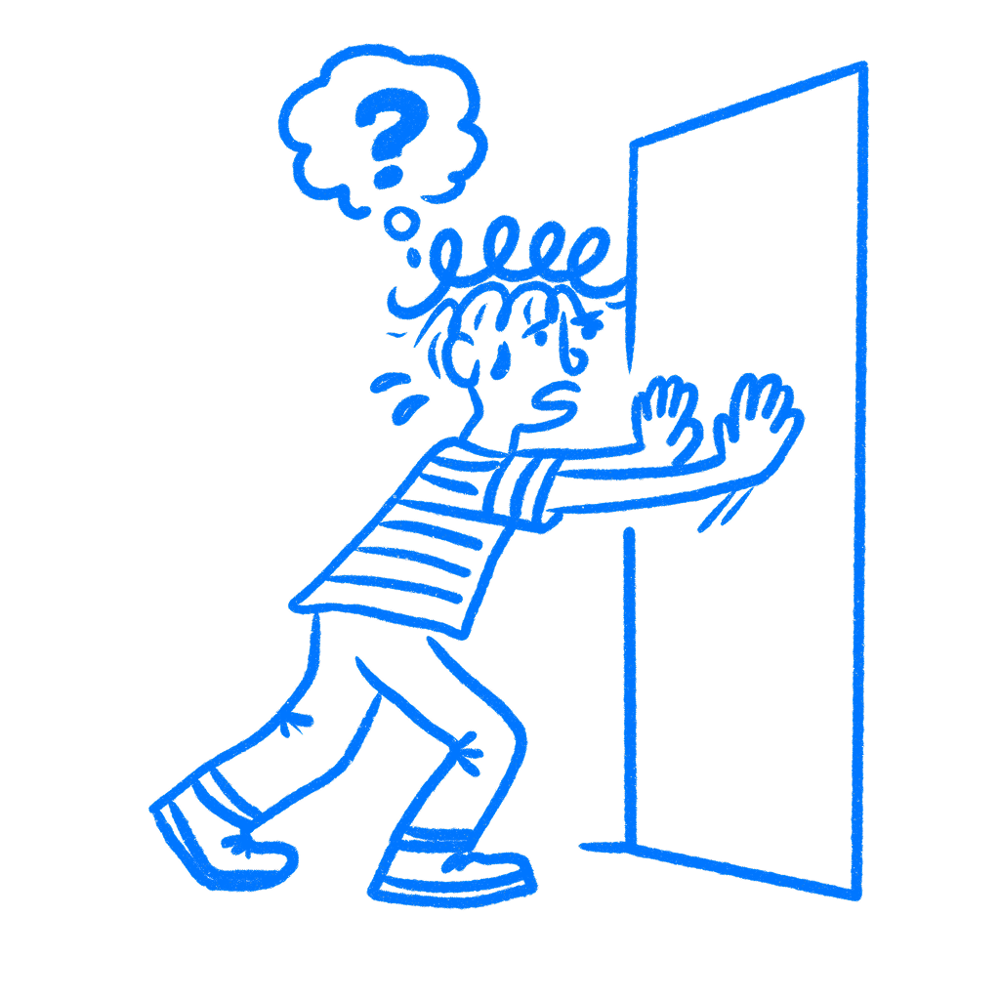

## Chapter 13 · Stop Hiding What's Clickable

*Why buttons need to look like buttons*

Around 2013, the design industry started treating visual cues like a problem to be cleaned up. Shadows went. Borders went. Raised buttons went. Gradients, depth, texture, every hint that one element sat above another started disappearing. Screens got flatter, cleaner, and more polished. Most designers I knew loved it. I certainly did. Users, however, started tapping the wrong things. I remember how fast that spread.

That was not a coincidence. Apple shipped iOS 7 that year and stripped six years of visual signals from the iPhone interface in one release. Windows 8 had done something similar twelve months earlier. A lot of the industry followed. The reasoning sounded right: people had learned to use touchscreens, they no longer needed beginner aids, the interface could grow up. Almost nobody stopped to ask whether those shadows and borders were training wheels at all, or whether they were the only thing telling people where to tap.

Flat design as an aesthetic survived. The idea that you can remove every visual signal and still keep the interface easy to use did not. The reason has a name, and designers still get it wrong.

### Designers keep blaming the wrong thing

In 1979, the psychologist [James Gibson](https://www.routledge.com/The-Ecological-Approach-to-Visual-Perception/Gibson/p/book/9781848725782) introduced the idea of affordances in his book *The Ecological Approach to Visual Perception*. For Gibson, an affordance was a relationship between an object and a person. A chair affords sitting. A handle affords gripping. A surface affords walking on. The key thing Gibson said, and the part designers keep forgetting, is that affordances exist whether you can see them or not. They are facts about the world, not cues. A door affords pushing whether it has a handle, a flat plate, or nothing at all.

[Don Norman](https://cs.uwaterloo.ca/~jianzhao/cs449-649/files/affordance-norman99.pdf) brought affordances into design in 1988, in *The Psychology of Everyday Things*. The design world loved the concept and ran with it. There was one problem: designers misunderstood it, and Norman admits he caused some of that confusion himself. By 1999, he was walking it back. By 2013, he had replaced the term with something more useful. In *The Design of Everyday Things*, he wrote:

> *Signifiers specify how people discover those possibilities: signifiers are signs, perceptible signals of what can be done.*
> — Don Norman

Then he went further: designers should stop thinking about possible actions and focus on what people can actually see instead.

That is the part that matters. The move may be there, but the cue is what helps people spot it. Norman’s conclusion, after decades of watching designers use his term the wrong way, was simple: what people can see matters to designers.

The move still exists whether you show it or not. The cue is how people find it. When a button looks tappable, the signal is doing its job. When it reads like a heading, the signal is gone, and the user is left unsure whether to push or pull.

Whenever a designer says “We need to add affordance” in a meeting, they almost always mean adding a signifier. The word is wrong. I have heard that mix-up more times than I can count. The distinction matters because it explains what goes wrong when design gets too clean.

### Flat design exposed the problem

The [Nielsen Norman Group](https://www.nngroup.com/articles/signifiers-not-affordances/) published a formal usability appraisal of iOS 7 and found what anyone watching real user behavior might have expected. Users had trouble telling interactive elements apart from decorative ones. Buttons that looked like text went unnoticed. Apps that embraced the flat aesthetic produced interfaces where the call to action was, in NNG’s words, “hard to say.”

People started running into problems with things they had done for years. The affordances had not changed. Tapping a button still worked the same way. Apple had stripped the signifiers. The action still worked. People just missed it.

Links passed for labels. Tabs read as captions. Controls blended into plain copy. The behavior stayed the same, but the screen stopped speaking in the visual dialect people had learned. Familiar markers like contrast, contour, highlight, emphasis, and texture had been drained away.

NNG noted that Windows 8 created the same problem a year earlier, and the pattern was clear: when interfaces strip away cues for the sake of a cleaner look, users pay for it. They pause. They tap the wrong thing. They give up. Apple corrected course in later iOS releases, bringing back depth and contrast that made active elements readable again.

The flat look stayed. Removing every clue did not. I still see screens where a plain text label is secretly the main action.

### Run a silent click test

There is a simple test for this, and it costs nothing. Call it the silent usability walk. Put your interface in front of someone who didn’t build it. Don’t say anything. Don’t point. Don’t explain. Just watch.

Every moment of hesitation is a missing signifier. Every wrong tap is a false one, something that looked interactive and wasn’t, or looked static and was. Every time the person moves their finger toward something and then stops, something failed in the design.

The point of watching without speaking is simple: the moment you open your mouth, you are covering for what the interface failed to say on its own. Designers do this in usability sessions without noticing. “Oh, that button is up there.” “Yeah, you have to scroll down first.” Every one of those fixes gives the game away. The product should have done that job already.

I still catch myself wanting to point.

Gibson’s chairs and Norman’s doors translate to this. The move is possible. The question is whether the user can find it. That is the signifier’s job. When you run the silent walk and nobody hesitates, the cues are doing their work. When you find yourself wanting to lean forward and point, they are not.

To me, this is one of the fastest ways to catch a weak interface.

### A clean screen can still confuse

The cleaner you make an interface look, the more careful you have to be about what stays. Every shadow you remove is a depth cue. Every border you drop is a boundary. Every gradient you flatten is a surface that no longer looks pressable. Most of those things can go. Some cannot, and you only learn the difference by watching people use the thing. Sometimes a border is enough. Sometimes it is contrast, a fill, an underline, a pill shape, or a tiny icon. The point is not decoration. The point is that the screen still has to say where the action is.

The option is still there whether you signal it well or not. Signifiers are what need your attention. They are what stand between a person who knows what to do and one who stalls.

A clean screen that nobody can use is just a locked door with a beautiful finish.

### References & Sources

- **Gibson, J. J. (1979). The Ecological Approach to Visual Perception.** Houghton Mifflin. [https://www.routledge.com/The-Ecological-Approach-to-Visual-Perception/Gibson/p/book/9781848725782](https://www.routledge.com/The-Ecological-Approach-to-Visual-Perception/Gibson/p/book/9781848725782)
- **Norman, D. A. (1988). The Psychology of Everyday Things.** Basic Books. [https://archive.org/details/psychologyofever0000norm](https://archive.org/details/psychologyofever0000norm)
- **Norman, D. A. (1999). Affordances, conventions, and design.** Interactions, 6(3), 38–43. [https://cs.uwaterloo.ca/~jianzhao/cs449-649/files/affordance-norman99.pdf](https://cs.uwaterloo.ca/~jianzhao/cs449-649/files/affordance-norman99.pdf)
- **Wikipedia: Affordance.** [https://en.wikipedia.org/wiki/Affordance](https://en.wikipedia.org/wiki/Affordance)
- **Nielsen Norman Group: Signifiers, Not Affordances.** [https://www.nngroup.com/articles/signifiers-not-affordances/](https://www.nngroup.com/articles/signifiers-not-affordances/)
- **Interaction Design Foundation: Affordances.** [https://www.interaction-design.org/literature/topics/affordances](https://www.interaction-design.org/literature/topics/affordances)
