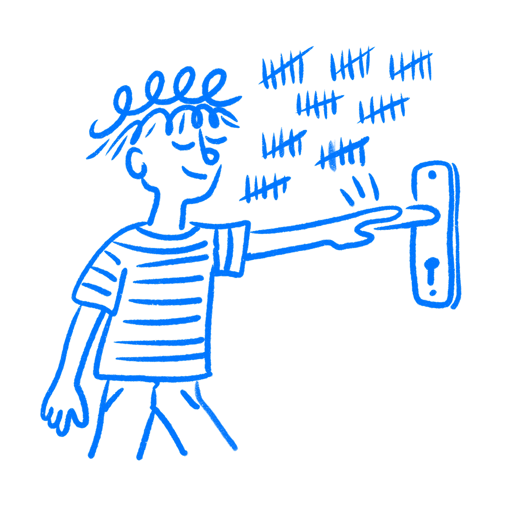

## Chapter 14 · Intuitive Design Is a Lie

*Why intuitive just means familiar*

“Intuitive” is one of the slipperiest words in a design review. Designers say it all the time and nobody pushes back because it sounds like evidence. Usually it is not. Most of the time it is just a description of how familiar the designer feels with the thing they made, and that is a weak way to judge whether it will work for someone else.

Most of the time, intuitive just means familiar.

### How familiarity changes what people see

In 1932, [Frederic Bartlett](https://pure.mpg.de/rest/items/item_2273030/component/file_2309291/content) gave British participants a Native American folk tale called “The War of the Ghosts” and asked them to recall it later. They all got it wrong, and not in small ways. References to spirits vanished. Details that meant nothing to them got swapped out for details that did. A character following tribal duty became one caring for a relative. The change was not random. Each person rewrote the story toward what they already knew about how stories work.

Bartlett called these organizing structures [schemas](https://en.wikipedia.org/wiki/Schema_(psychology)). The brain does not record experience like a camera. It filters everything through what it already knows, then rebuilds the memory to fit. You do not remember what happened in a clean way. You remember the version that makes sense to you.

Users do the same thing with your interface. They arrive carrying every product they have ever touched: every app, every form, every checkout flow they have worked through. They push your design through all of that history and try to make it fit what they expect. When it fits, things feel smooth. When it does not, people slow down and start wondering what they missed. I have seen designers blame the user at that moment. Usually, the miss is in the design.

Working memory holds about four chunks of information at once. Every unfamiliar element in your UI lands there on its own, fighting for space. New patterns cost working memory. That is not a flaw in your users. It is how the system works. Schemas solve part of the problem. A schema bundles a learned pattern into one stored unit. Once you know something well enough, it stops costing working memory at all. [John Sweller](https://andymatuschak.org/files/papers/Sweller%20-%201988%20-%20Cognitive%20load%20during%20problem%20solving.pdf), who built cognitive load theory over decades of research, described schemas as structures that

> *“permit problem solvers to treat multiple elements as a single element.”*
> — John Sweller, Cognitive Science, 1988

That compression is what we call intuition. It lives in the person, not in the screen. Most of the time, what designers call intuitive is just familiar.

### What experts rely on

[Gary Klein](https://mitpress.mit.edu/9780262611460/sources-of-power/) spent years watching how experienced people make decisions under pressure. Firefighters, military commanders, intensive care nurses. Classical decision theory assumed experts generate options, compare them, and pick the best one. Klein found none of that. What he found instead is called [recognition-primed decision making](https://en.wikipedia.org/wiki/Recognition-primed_decision). A fire commander walks into a building and knows what to do. No long comparison. No list of options. Experience lets them spot a workable action fast, so they do not bother looking for alternatives.

[William Chase and Herbert Simon](https://doi.org/10.1016/0010-0285(73)90004-2) showed the same mechanism in chess. Show a grandmaster a real board position for five seconds and they reconstruct it from memory with near-perfect accuracy. Show them a random arrangement of the same pieces and they do no better than a beginner. The schema fires on meaningful patterns. Without the pattern, the advantage disappears.

This is why a senior designer can walk into a critique and feel that something is wrong before they can say why. The feeling is real. Pattern recognition is moving faster than language. But the same mechanism also makes your own familiar work feel correct. You have spent weeks on it. You have built schemas for it. When you look at your design, you do not see what a new user sees. You see what you know.

That is familiarity passing itself off as quality.

### The icon only experts found obvious

The hamburger menu. Three horizontal lines in the corner of a screen. When it spread through mobile apps in the 2010s, designers called it intuitive. It looked clean and felt obvious. [Nielsen Norman Group](https://www.nngroup.com/articles/hamburger-menus/) ran a study with 179 participants across six live websites and found the opposite. Hiding navigation behind the icon cut discoverability nearly in half and made tasks harder to complete on both mobile and desktop. Users who had not built the schema did not see a navigation trigger. They saw decoration, maybe a logo, and nothing worth tapping.

The icon only became usable through years of mass adoption. Products used it long enough that users slowly built the association. It took time. Even after all that exposure, visible navigation still beats the hamburger by every metric NNG tracks.

Designers who called it intuitive in 2012 were describing their own familiarity with a convention they had already learned. They were not saying anything useful about the icon itself. The icon was arbitrary. Repetition made it feel normal. That mix-up is one reason bad navigation ships with confidence.

### Familiar to which user

Ban the word intuitive from your design reviews. Not as a gesture, but because it stops thinking. Every time someone says it, the real question gets skipped: familiar to whom?

If you can answer that question, you can make a real decision. If the pattern is common across dozens of apps your users already know, you are on safer ground. If the familiarity is yours because you built it, that tells you nothing. If nobody knows the pattern yet, test it before it ships.

Put the design in front of someone who has never seen it. Say nothing. Watch where they look first. Notice what they try to tap. Mark where they stop and scan the screen. Every pause tells you a pattern did not land. Every wrong move shows you an assumption they did not share.

Most designers skip this because they already know the design is intuitive. That feeling comes from building the thing. That is exactly why the test cannot be skipped.

Recognition is always learned. Your job is to know whether your users have had the chance to learn it yet.

### References & Sources

- **Bartlett, F. C. (1932). Remembering: A Study in Experimental and Social Psychology.** Cambridge University Press. [https://pure.mpg.de/rest/items/item_2273030/component/file_2309291/content](https://pure.mpg.de/rest/items/item_2273030/component/file_2309291/content)
- **Klein, G. (1998). Sources of Power: How People Make Decisions.** MIT Press. [https://mitpress.mit.edu/9780262611460/sources-of-power/](https://mitpress.mit.edu/9780262611460/sources-of-power/)
- **Chase, W. G., & Simon, H. A. (1973). Perception in chess.** Cognitive Psychology, 4(1), 55–81. [https://doi.org/10.1016/0010-0285(73)90004-2](https://doi.org/10.1016/0010-0285%2873%2990004-2)
- **Sweller, J. (1988). Cognitive load during problem solving: Effects on learning.** Cognitive Science, 12(2), 257–285. [https://andymatuschak.org/files/papers/Sweller%20-%201988%20-%20Cognitive%20load%20during%20problem%20solving.pdf](https://andymatuschak.org/files/papers/Sweller%20-%201988%20-%20Cognitive%20load%20during%20problem%20solving.pdf)
- **Wikipedia: Schema (psychology).** [https://en.wikipedia.org/wiki/Schema_(psychology)](https://en.wikipedia.org/wiki/Schema_%28psychology%29)
- **Wikipedia: Recognition-primed decision.** [https://en.wikipedia.org/wiki/Recognition-primed_decision](https://en.wikipedia.org/wiki/Recognition-primed_decision)
- **Nielsen Norman Group: Hamburger Menus and Hidden Navigation Hurt UX Metrics.** [https://www.nngroup.com/articles/hamburger-menus/](https://www.nngroup.com/articles/hamburger-menus/)
- **Interaction Design Foundation: Recognition-Primed Decision Making.** [https://www.interaction-design.org/literature/article/recognition-primed-decision-making](https://www.interaction-design.org/literature/article/recognition-primed-decision-making)
