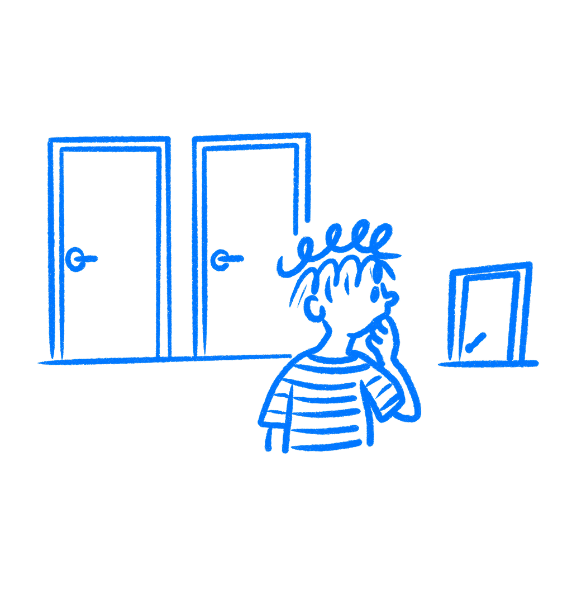

## Chapter 16 · Stop Breaking the Pattern

*Why breaking your own patterns confuses the people using it*

You are not only reacting to your interface. You are predicting it. Every time you reach for the save button without looking, every time your thumb swipes left without thinking, that is not just experience making you fast. It is your brain running a model it built from everything the product did before and checking whether this moment matches. I think a lot of designers miss how much speed comes from that quiet prediction.

When the pattern holds, the interaction feels effortless. When it breaks, people stop, look again, and recalibrate. They also carry a little less confidence into whatever comes next.

### Uncertainty slows people down

[Charles Berger and Richard Calabrese](https://doi.org/10.1111/j.1468-2958.1975.tb00258.x) spent the 1970s studying how strangers interact. Their core finding was simple: people are driven, above most other things, to make the world predictable. When you can predict someone, you trust them. When you cannot, you stay cautious, process more carefully, and hold back.

The same thing happens with software. [Andy Clark’s work on predictive processing](https://global.oup.com/academic/product/surfing-uncertainty-9780190217014) describes how the brain generates expectations constantly, milliseconds before you consciously register anything. Your brain is running predictions all the time, including small ones about where the save button went. You do not experience an interface in some neutral way. You experience whether it matches what you expected. A match feels smooth. A mismatch gives you a small jolt of effort.

Multiply that by every screen with a moved primary button, every modal with shifted terminology, and every keyboard shortcut that stops working in one particular context. None of it is catastrophic on its own. Together, it adds friction across every session and shapes whether users feel like the product is working with them or slightly against them.

> *Appropriate trust is neither too much nor too little trust, but rather the correct level of trust given the capabilities of the system.*
> — Lee & See

[John D. Lee and Katrina A. See](https://csel.eng.ohio-state.edu/productions/intel/research/trust/Lee%20%26%20See%20Trust%20Review.pdf) were writing about industrial automation in 2004. Aircraft controls. Factory systems. But what they found also applies here. Users calibrate trust directly to consistency. A system that sometimes behaves as expected and sometimes breaks pattern does not get partial trust. It gets caution. Users slow down and check twice.

### Windows Vista showed the cost

[Windows Vista](https://en.wikipedia.org/wiki/Windows_Vista) shipped in 2007 with a security feature called [User Account Control](https://en.wikipedia.org/wiki/User_Account_Control). The intent was real: before anything important happened on your system, the OS would ask you to confirm. Stop malware before it could act. Give users a moment to catch something dangerous.

The problem was the system had no sense of proportion. Installing software got the same dialog box as moving a desktop shortcut. Opening built-in tools triggered it. Changing display settings triggered it. A user doing ordinary things on an ordinary day could see that box twenty, thirty times before lunch.

So users stopped reading it. That was the predictable response to a signal that had turned out to carry no reliable information. By the time a genuinely dangerous prompt came through, they had been trained by hundreds of trivial ones to dismiss it without a glance. Microsoft quietly pulled back the aggressiveness in Windows 7.

The dialogs did not just fail to protect users. They made users less safe than if there had been no dialogs at all. The inconsistency between what the signal was supposed to mean and what users had learned it actually meant flipped the whole thing around.

### Designers miss their own inconsistencies

Visual inconsistency gets noticed, usually. Buttons drifting across screens, spacing that is off in one place, an icon doing two different things. That stuff comes up in design reviews.

Terminology is harder. If the sidebar calls it a Project and the modal calls it a Workspace and the settings page calls it a Space, users spend real effort wondering whether those are the same thing or three ideas they have not understood yet. You know they are the same because you named all three and remember why the names diverged. Your users are just reading the screen. They carry that ambiguity through every interaction, quietly working around it. I see this one a lot in products that grew fast. The classic version is a button that says Save in one place and Publish in another even though both do the same thing.

[Nielsen Norman Group’s research](https://www.nngroup.com/articles/consistency-and-standards/) found task completion times roughly 22 percent faster in interfaces where patterns held consistently. That’s not a rounding error. That’s the difference between a product that feels quick and a product that has drag nobody can locate or explain.

### Why this keeps happening

Designers tend to work screen by screen. This modal has a layout constraint so the action goes here. This context is different so the wording changes. Each call makes local sense. The user, though, is not evaluating screens in isolation. They are testing a model they built from everything they have seen before, and they update it when the pattern breaks. The designer never sees that model.

There is also a version where designers resist consistency on purpose, because it feels like creative surrender. When your app puts navigation where every other app puts it, users arrive with a working model already. Originality that costs users effort to decode is not originality worth having.

Pick one element. Just one. Where does your primary action sit across your interface? Go look, screen by screen, and write it down. You will almost certainly find it in three or four positions, with two or three different labels, sometimes a button, sometimes a link, sometimes an icon with no label at all.

That audit will usually show you where users are most likely to pause and second-guess themselves. The product is quietly teaching them that it does not quite behave like itself in those spots. Fix that. Not as a redesign and not as a major project. Just decide where the thing lives and put it there, every time.

Do the same with terminology. Pick a word for each concept and use it everywhere it appears. Delete the variants.

Users who trust a product move through it without thinking much about the interface at all. Users who do not are always half a step behind, managing small uncertainties and never quite letting the product do its job.

### References & Sources

- **Berger, C. R., & Calabrese, R. J. (1975). Some explorations in initial interaction and beyond.** Human Communication Research, 1(2), 99–112. [https://doi.org/10.1111/j.1468-2958.1975.tb00258.x](https://doi.org/10.1111/j.1468-2958.1975.tb00258.x)
- **Clark, A. (2016). Surfing Uncertainty: Prediction, Action, and the Embodied Mind.** Oxford University Press. [https://global.oup.com/academic/product/surfing-uncertainty-9780190217014](https://global.oup.com/academic/product/surfing-uncertainty-9780190217014)
- **Lee, J. D., & See, K. A. (2004). Trust in automation: Designing for appropriate reliance.** Human Factors, 46(1), 50–80. [https://csel.eng.ohio-state.edu/productions/intel/research/trust/Lee%20%26%20See%20Trust%20Review.pdf](https://csel.eng.ohio-state.edu/productions/intel/research/trust/Lee%20%26%20See%20Trust%20Review.pdf)
- **Wikipedia: Predictive coding.** [https://en.wikipedia.org/wiki/Predictive_coding](https://en.wikipedia.org/wiki/Predictive_coding)
- **Nielsen Norman Group: Consistency and Standards.** [https://www.nngroup.com/articles/consistency-and-standards/](https://www.nngroup.com/articles/consistency-and-standards/)
- **Wikipedia: User Account Control.** [https://en.wikipedia.org/wiki/User_Account_Control](https://en.wikipedia.org/wiki/User_Account_Control)
