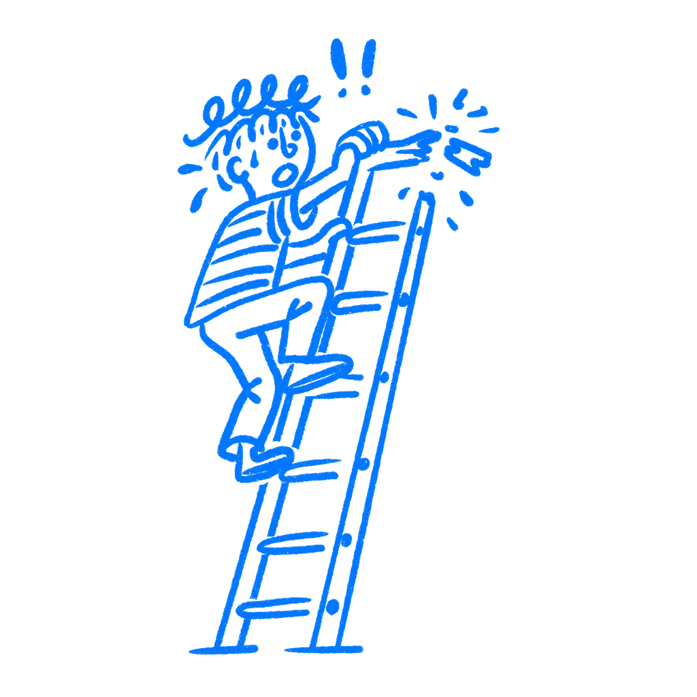

## Chapter 18 · Design the Last Moment First

*Why the last thing users experience is the only thing they remember*

You spent three weeks on that onboarding flow. The copy is good, the animations are smooth, and each step leads cleanly to the next. Then, right at the end, the user hits a confirmation screen that says “You’re all set!” in gray text on a white background, and that is it. No next step. No relief. No sense that something just finished well. That is the last thing they see.

I have seen designers pour all their energy into the middle and leave the ending half-dead. They spend days on the stepper, the labels, and the transitions between screens. Then the whole thing lands on one weak final screen, and that is what people carry away with them.

### People remember the peak and the end

In 1993, [Barbara Fredrickson and Daniel Kahneman](https://bear.warrington.ufl.edu/brenner/mar7588/Papers/fredr-kahneman-jpsp1993.pdf) ran a series of experiments with short film clips, some pleasant and some aversive, that varied in length and intensity. They asked people to rate how they felt moment to moment, then asked for a global evaluation when each clip ended. Duration had almost no effect. What drove the final judgment was a weighted average of the most intense moments and the final moments. Their paper called it “the peak and end rule.”

People are not taking notes. They are not tracking every screen, every interaction, every small moment of friction or delight. What tends to stick are two snapshots: the sharpest moment and the closing one. Those two points do a lot of the work later, which is bad news if your ending is the weakest part.

> *Retrospective evaluations appear to be determined by a weighted average of ‘snapshots’ of the actual affective experience, as if duration did not matter.*
> — Fredrickson & Kahneman

The 1993 cold water study made this concrete in a way that is hard to forget. Participants submerged one hand in 14°C (57.2°F) water for 60 seconds, which was unpleasant. Then they submerged the other hand for 90 seconds: 60 seconds at the same temperature, followed by 30 more seconds as a researcher raised the temperature to 15°C (59°F), still cold but less so. Participants then chose which trial to repeat. A clear majority chose the longer one. More total pain, but a better last stretch. They chose the version that cost more because the finish outweighed the arithmetic.

### Users do not average it out

Your users do not judge your product by adding up every moment and dividing by the number of screens. They remember a few moments disproportionately, and one of them is the last one.

The more you look at this, the stranger it gets. A rough start with a strong finish can score better in memory than a smooth flow that ends with nothing. The work you did through the middle may barely register if the final screen is a dead-end error page, a confusing redirect, or a success message so flat it may as well say nothing.

That last beat changes how the rest of the flow is remembered.

The peak matters just as much. Intensity spikes, good or bad, get too much weight later. A sharp moment of confusion becomes the anchor users use to sort the whole thing in their heads. A moment where the product does something the user did not expect but needed can lift an otherwise flat flow.

Most teams think about the beginning and the middle. Very few stop and ask where the strongest feeling lands.

### Disney worked the ending hard

Disney had been shaping memory long before Kahneman named the mechanism. The [FastPass system](https://en.wikipedia.org/wiki/Disney_FastPass), first introduced in 1999, was not just about cutting wait times. It was also about controlling what waiting felt like and where the day peaked and resolved. Disney parks treat queue design as part of the product: visual storytelling in the line, theming that builds anticipation, and a layout shaped so the sharpest moment of excitement lands as close to the attraction as possible. The ride itself is only part of the experience. The rest is how the day builds and how it resolves.

Designers miss this when they focus only on the functional layer. A flow that works fine but ends with a dull confirmation page and peaks at an error message will stick in memory as unpleasant or forgettable, even if every screen in between worked perfectly well.

I think this gets missed because the middle always feels like the real work. It is only part of what users remember.

### Design the ending on purpose

Before you ship any significant flow, ask what the last thing a user sees feels like and where the strongest emotional moment in the sequence lands.

The ending does not have to be big. Mailchimp’s send confirmation screen put a high-five illustration right at the moment of peak anxiety, that instant after pressing send on a campaign going to thousands of people. The product worked the same either way. The memory of using it did not.

For negative peaks, the question shifts: where does your flow hurt most? Error states, loading failures, dead ends, form resets are all candidates for what users carry away. They do not average out. They anchor.

Map the emotional shape of your flow, not just the functional shape. Mark where intensity spikes and where the flow ends. Then ask whether those two moments were designed or whether they just happened. In a lot of product work, they just happened.

Every hour spent refining a screen that sits between a bad peak and a bad ending is an hour that does not change what users remember. The work in the middle can be excellent and still lose to a weak finish. If the last screen is gray text on white, that is what users walk away with. I would rather decide that on purpose than let it happen by accident.

### References & Sources

- **Fredrickson, B. L., & Kahneman, D. (1993). Duration neglect in retrospective evaluations of affective episodes.** Journal of Personality and Social Psychology, 65(1), 45–55. [https://bear.warrington.ufl.edu/brenner/mar7588/Papers/fredr-kahneman-jpsp1993.pdf](https://bear.warrington.ufl.edu/brenner/mar7588/Papers/fredr-kahneman-jpsp1993.pdf)
- **Kahneman, D., Fredrickson, B. L., Schreiber, C. A., & Redelmeier, D. A. (1993). When more pain is preferred to less: Adding a better end.** Psychological Science, 4(6), 401–405. [https://doi.org/10.1111/j.1467-9280.1993.tb00589.x](https://doi.org/10.1111/j.1467-9280.1993.tb00589.x)
- **Zakay, D., & Block, R. A. (1997). Temporal cognition.** Current Directions in Psychological Science, 6(1), 12–16. [https://doi.org/10.1111/1467-8721.ep11512604](https://doi.org/10.1111/1467-8721.ep11512604)
- **Wikipedia: Peak-end rule.** [https://en.wikipedia.org/wiki/Peak%E2%80%93end_rule](https://en.wikipedia.org/wiki/Peak%E2%80%93end_rule)
- **Nielsen Norman Group: Response Times: The 3 Important Limits.** [https://www.nngroup.com/articles/response-times-3-important-limits/](https://www.nngroup.com/articles/response-times-3-important-limits/)
- **UX Collective: Designing for Wait: How to Improve Perceived Performance.** [https://uxdesign.cc/designing-for-wait-how-to-improve-perceived-performance-ba5ca1eed89d](https://uxdesign.cc/designing-for-wait-how-to-improve-perceived-performance-ba5ca1eed89d)
- **Wikipedia: Disney FastPass.** [https://en.wikipedia.org/wiki/Disney_FastPass](https://en.wikipedia.org/wiki/Disney_FastPass)
