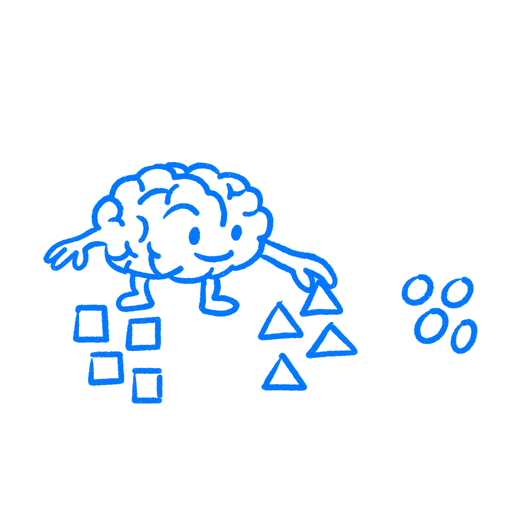

## Chapter 20 · Layout Speaks Before You Do

*How the brain organizes your layout before you explain it*

Before anyone reads a word, the brain has already started organizing the screen. It is already deciding what belongs together, what matters most, and what to look at first. Not because of the label text, the copy, or the font choice. Because of where things sit, how far apart they are, and whether they look like they belong to the same set. The structure starts forming before your explanation ever gets a chance.

A lot of designers still treat layout as a visual preference, as if things sit near each other because it looks right rather than because proximity tells the user they belong together. Patterns get broken without anyone noticing a pattern was there in the first place. The layout ends up doing work nobody explicitly assigned it and sending cues nobody meant to send.

I have seen designers spend hours fixing copy while the spacing was already telling the wrong story.

### The brain groups first

In the early twentieth century, a group of German psychologists documented something that seems obvious once you see it: perception is not passive. The mind is already grouping, separating, and ranking before conscious attention gets involved.

[Max Wertheimer](https://psychclassics.yorku.ca/Wertheimer/Forms/forms.htm) published the foundational work in 1923. He was looking at something simple: how people perceive groupings of dots. They did not see individual points first and then reason their way up to a pattern. They saw clusters and relationships right away. The spacing between dots changed which ones felt related. Matching shapes pulled elements into sets. None of this needed instruction. It just happened. Wertheimer’s point was that these groupings were not careful interpretations. They were part of perception itself, and people could not simply override them even when they knew what was going on.

[Kurt Koffka](https://archive.org/details/principlesofgest00koff) put it this way:

> *The whole is other than the sum of its parts.*
> — Kurt Koffka

Not better. Just different. The layout as perceived is not the same thing as the layout as assembled. What gets grouped together gets processed together. What stands apart gets processed apart. No designer invented this. It is simply how people organize what they see. If you understand that, you can work with it. If you do not, the cues are still there. You are just sending them blindly.

### Spacing tells people what fits

In interface design, proximity is usually the one you feel first. Elements near each other get perceived as a group, and that happens before the user has consciously decided anything.

Put a label and an input field near one another and users read them as a unit. Push them apart and the relationship gets less clear. When spacing is inconsistent across a form, users have to work out “which label belongs to which field” on every row. The content has not changed, but the effort has. You added friction and all you changed was a bit of margin. A messy billing form can feel broken before a single field is technically wrong.

Similarity pairs with proximity. Elements that share color, shape, size, or weight feel like members of the same category. This is why a consistent button style matters beyond aesthetics. When every main action uses the same treatment, users learn how that action is marked in your product. Break the pattern once, with a different color in this modal or a different size on that screen, and that learned pattern breaks with it. Users are no longer sure what to reach for first. The pause that follows often comes from the inconsistency, not the copy.

Continuity, closure, and common fate matter too. Continuity helps explain why near-alignments can feel worse than deliberate breaks. The eye follows a line until something interrupts it. Closure helps explain why a button that is almost aligned can cost more attention than one that is clearly off-axis; the brain tries to snap it into place and notices the miss. Common fate explains why animation can change grouping. Elements that move together get treated as a unit whether you meant that or not.

### Google shows it well

The Google search page is useful because you can see these effects clearly.

Every result is three elements: title, URL, snippet. The tight vertical spacing between them groups the three into one perceived unit before the person reads anything. The gap between results separates each unit from the next. Users do not stop to decide “this title goes with this snippet.” Proximity is already handling that. They just read. That is the part many design reviews miss. People are already reading the grouping before they read the words.

For years, eye-tracking studies on that page suggested users could sort ads from organic results faster than they could read the small label marking them as ads. The label still mattered, but proximity and similarity had already done part of the work. The visual pattern of an ad cluster differed from an organic cluster, and people picked up that difference before they could clearly explain it.

The left edge of the page does something quieter. Titles align to a consistent vertical axis. Once the eye finds that axis on the first result, it follows it down the page without hunting for each next one. Take away the alignment and users have to locate each result on its own instead of flowing to it. Nothing on the page needs to explain that. The layout already did.

### Check the structure first

Before a screen goes out, ask one question: what is this layout saying before anyone reads anything? Do not ask what it looks like. Ask what it says. Which elements fit together? What comes first? Where does the eye go next? Cover the text and ask someone what the page is about, which things connect, and what to do first. If they cannot answer from the visual structure alone, more content will not fix it. The grouping is off. I still catch myself missing this when a screen looks polished.

[Wolfgang Köhler](https://archive.org/details/gestaltpsycholog00kohluoft), [Max Wertheimer](https://psychclassics.yorku.ca/Wertheimer/Forms/forms.htm), and [Kurt Koffka](https://archive.org/details/principlesofgest00koff) were trying to understand perception. They ended up describing something designers deal with every day. I have missed this in my own work too. A screen looked clean, so I assumed it was clear.

The screen you ship is not quite the screen users see. What they see is the structure their brain built from it. You can guide that structure, but you do not get to opt out of it.

### References & Sources

- **Wertheimer, M. (1923). Laws of organization in perceptual forms.** In W. D. Ellis (Ed.), A Source Book of Gestalt Psychology. Harcourt, Brace. [https://psychclassics.yorku.ca/Wertheimer/Forms/forms.htm](https://psychclassics.yorku.ca/Wertheimer/Forms/forms.htm)
- **Köhler, W. (1929). Gestalt Psychology.** Liveright. [https://archive.org/details/gestaltpsycholog00kohluoft](https://archive.org/details/gestaltpsycholog00kohluoft)
- **Koffka, K. (1935). Principles of Gestalt Psychology.** Harcourt, Brace. [https://archive.org/details/principlesofgest00koff](https://archive.org/details/principlesofgest00koff)
- **Wikipedia: Gestalt psychology.** [https://en.wikipedia.org/wiki/Gestalt_psychology](https://en.wikipedia.org/wiki/Gestalt_psychology)
- **Nielsen Norman Group: Gestalt Principles of Perception.** [https://www.nngroup.com/articles/gestalt/](https://www.nngroup.com/articles/gestalt/)
- **Simply Psychology: Gestalt Laws of Perceptual Organization.** [https://www.simplypsychology.org/gestalt-theories.html](https://www.simplypsychology.org/gestalt-theories.html)
