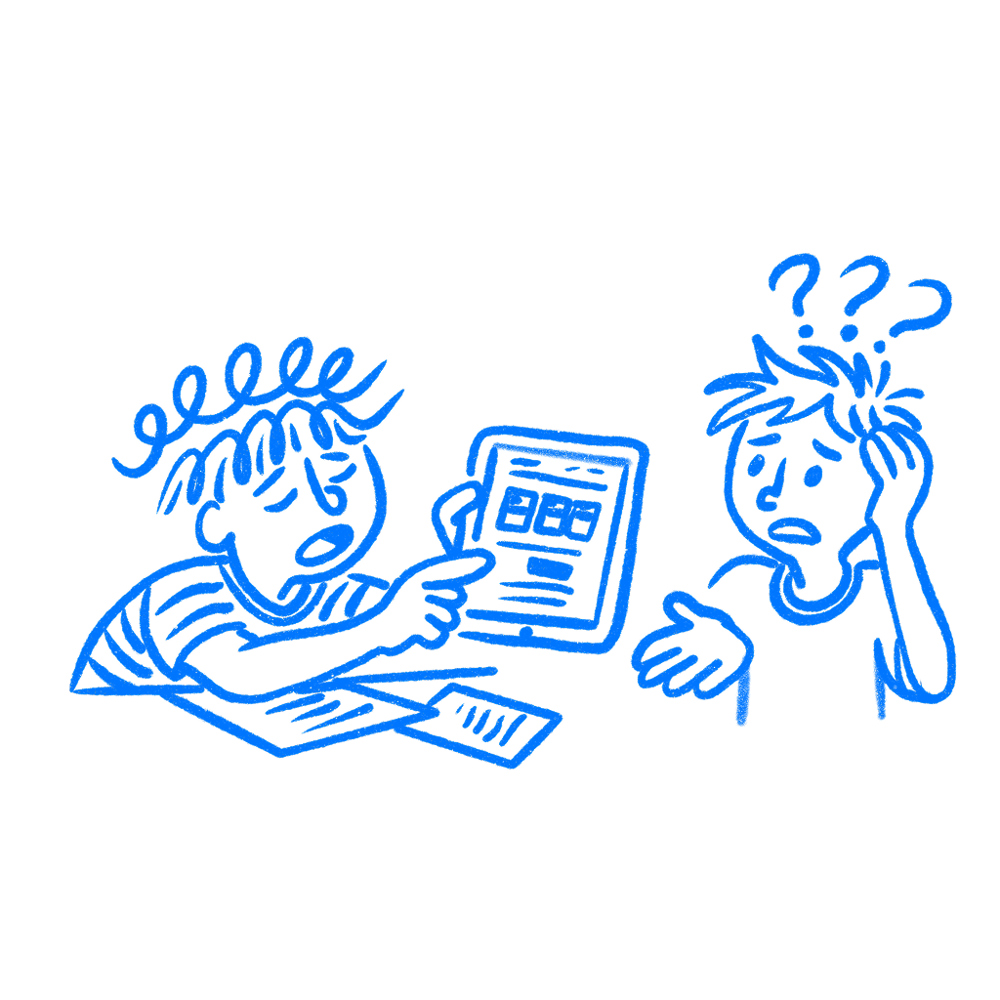

## Chapter 26 · Your Design Doesn't Translate

*How culture shapes what users see, trust, and understand*

White space does not mean the same thing everywhere. When you look at a sparse layout and feel calm, when you see a clean interface and call it good design, that reaction is real. But it does not come from some universal rule in the human brain. It comes from where you grew up, what you got used to, and which design tradition taught you what a good interface should feel like. I have had to remind myself of that too. More than once, I have looked at a product and treated my own training like common sense. That mistake is easy to make because your own taste always looks normal from the inside.

Many designers in Western tech have spent their careers inside one design tradition: Scandinavian minimalism filtered through Swiss typography, polished by a decade of Apple, and backed by the idea that simplicity always means clarity. That does not hold everywhere. In some places, that kind of page reads as premium. In others, it feels unfinished, cold, or too thin. I have seen teams call a page elegant when users in another market read it as half-empty and hard to trust. The page did not change. The expectations around it did.

### You learned one culture’s defaults

In 2001, psychologist [Richard Nisbett and his colleagues](https://websites.umich.edu/~nisbett/images/cultureThought.pdf) published a study asking whether people from different cultures actually perceive visual information differently. Not just explain it differently afterward, but take it in differently from the start.

The answer was yes. Nisbett’s team found that East Asian participants tended to process images as a whole: they paid attention to the full field, to relationships, to context. Western participants tended to isolate the main object and filter out the rest. When shown a scene, Western participants remembered the thing in front. East Asian participants remembered the background too. Put simply, some people take in the whole picture first, while others lock onto the main thing first. As the researchers put it,

> *East Asians tend to be holistic, attending to the entire field and assigning causality to it.*
> — Nisbett, Peng, Choi & Norenzayan

Anthropologist [Edward T. Hall](https://openlibrary.org/books/OL21335737M/Beyond_culture) explained part of this in his 1976 book *Beyond Culture*. He described two styles of communication: high-context and low-context. In low-context cultures, people expect meaning to be clear and direct. In high-context settings, meaning depends more on situation, shared understanding, and relationships. That difference shows up on screens faster than many teams expect.

There is another problem underneath all of this. A lot of psychology and UX research was based on a narrow group of people. In 2010, [Henrich, Heine, and Norenzayan](https://www2.psych.ubc.ca/~henrich/pdfs/WeirdPeople.pdf) called this group WEIRD: Western, Educated, Industrialized, Rich, and Democratic. Their point was simple: this group is not the same as all humans. So some design ideas got taught as universal, even though they came from a limited part of the world. A lot of product teams still work as if that warning changed almost nothing.

### The same page can land two ways

You see this in normal product work right away. Take a pricing page with lots of blank space, one image, a short headline, and one button. Or a checkout step that says only “Continue” because the team thinks more explanation will make it messy. To one user, that reads as clear and high-end. To another, it comes across as thin, like the company has not explained enough to earn trust.

I have seen that split happen in product reviews. One person says the page feels elegant. Another says it looks unfinished. Both reactions are real. They come from different ideas about what a serious product should show up front.

[Aaron Marcus and Emilie Gould](https://doi.org/10.1145/345190.345238) mapped this directly onto interface design in 2000. Their main point was simple: cultural values change how much hierarchy people expect to see, how much information feels normal, and what kind of structure reads as complete. That is not background noise. It is part of whether the interface works.

### WeChat and WhatsApp solve different expectations

[WeChat](https://en.wikipedia.org/wiki/WeChat) launched in 2011. By 2018 it had passed one billion monthly active users, almost all in China. Open it and you get messaging, payments, a social feed, games, mini-programs for taxis and food, a news reader, and a scanner, all close at hand. Western tech journalists and designers have been calling it overwhelming for years. Cluttered. Hard to parse. Too much.

To many Western designers, [WhatsApp](https://en.wikipedia.org/wiki/WhatsApp) looks calm. To users used to a denser product like WeChat, that same sparseness can land very differently.

Neither reaction is wrong. WeChat was built for people whose habits treat density as a feature. More visible functions can suggest more usefulness. The product looks busy, but it also looks ready. WhatsApp was built for people who treat sparseness as focus. Fewer visible choices can read as clearer and calmer. One product says “we do a lot.” The other says “we stay out of your way.”

That is the part many Western teams miss when they judge products from outside their own market. They assume their reaction is the neutral one and everything else is clutter, bad taste, or weak editing. Usually the mistake is simpler than that. They are reading another culture’s product with the wrong defaults in their head. I have caught myself doing exactly that.

### Ask what feels normal here

There is a version of the five-second test that helps here. Before you ship a product into a cultural context you did not design for, find five people who live there and show them your landing screen for a brief glance. Then ask one question: does this feel complete or incomplete?

Not “do you like it?” People are too polite with that question. Ask if it feels incomplete. That is the real signal. Some people look at a sparse screen and think something is missing. You will usually hear it fast and in plain language too. “It looks unfinished.” “I expected more information.” “I do not know why I should trust this yet.”

It is not a full localization check. It will not catch everything. But it will catch the first thing: the instant reaction people have before they even use the product. I have found that this is often where trouble starts. The screen can be technically correct and still feel wrong in the first few seconds.

Your design education taught you what good looks like. So did theirs. The difference is you only learned one of those lessons.

### References & Sources

- **Nisbett, R. E., Peng, K., Choi, I., & Norenzayan, A. (2001). Culture and systems of thought: Holistic versus analytic cognition.** Psychological Review, 108(2), 291–310. [https://websites.umich.edu/~nisbett/images/cultureThought.pdf](https://websites.umich.edu/~nisbett/images/cultureThought.pdf)
- **Henrich, J., Heine, S. J., & Norenzayan, A. (2010). The weirdest people in the world?** Behavioral and Brain Sciences, 33(2–3), 61–83. [https://www2.psych.ubc.ca/~henrich/pdfs/WeirdPeople.pdf](https://www2.psych.ubc.ca/~henrich/pdfs/WeirdPeople.pdf)
- **Marcus, A., & Gould, E. W. (2000). Crosscurrents: Cultural dimensions and global web user-interface design.** Interactions, 7(4), 32–46. [https://peterahall.com/mapping/Marcus_Gould_2000_cultural_dimensions_global_web_UI_design.pdf](https://peterahall.com/mapping/Marcus_Gould_2000_cultural_dimensions_global_web_UI_design.pdf)
- **Hall, E. T. (1976). Beyond Culture.** Anchor Books/Doubleday. [https://openlibrary.org/books/OL21335737M/Beyond_culture](https://openlibrary.org/books/OL21335737M/Beyond_culture)
- **Nielsen Norman Group: Modify Your Design for Global Audiences.** [https://www.nngroup.com/articles/crosscultural-design/](https://www.nngroup.com/articles/crosscultural-design/)
- **Wikipedia: WeChat.** [https://en.wikipedia.org/wiki/WeChat](https://en.wikipedia.org/wiki/WeChat)
