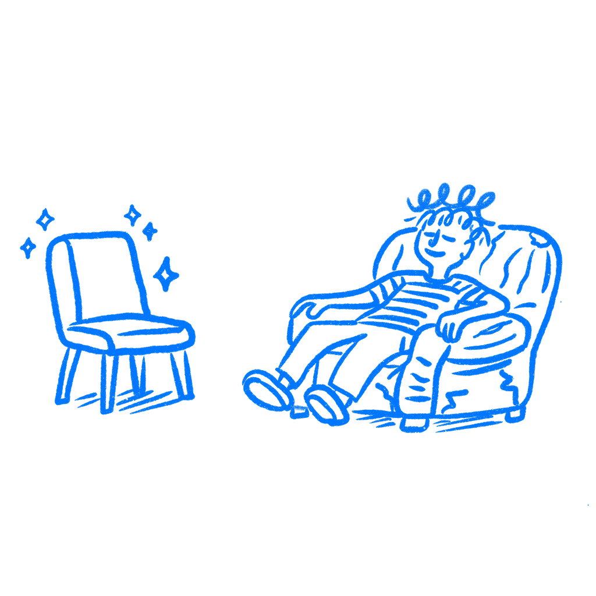

## Chapter 27 · Old Habits Beat Better Products

*How habit loops make existing behavior unbeatable*

Most designers still believe a better-designed product should always win. That sounds fair, but it is not how this works.

People do not choose between products from a clean starting point. They keep doing what already fits into the day they already have. The issue here is not the shock of a redesign or anger at change. It is repeated behavior that stopped feeling like a decision a while ago.

### The old behavior already has a head start

In the early 1990s, [Daniel Kahneman, Jack Knetsch, and Richard Thaler](https://kahneman.scholar.princeton.edu/sites/g/files/toruqf3831/files/kahneman/files/anomalies_dk_jlk_rht_1991.pdf) gave people coffee mugs and then asked what it would take to give them up. The number shot up once the mug was theirs. They wrote that “The disutility of giving up an object is greater than the utility of acquiring it.” That matters because users are not just evaluating a new tool. They are giving up one they already own in practice.

[Wendy Wood and David Neal](https://dornsife.usc.edu/wendy-wood/wp-content/uploads/sites/183/2023/10/wood.neal_.2007psychrev_a_new_look_at_habits_and_the_interface_between_habits_and_goals.pdf) push the point further. Habits get triggered by context before conscious choice really starts. Desk open. Browser up. Monday morning. Same spreadsheet. Same tab. Same routine. Once that loop is set, your product is not competing with a deliberate choice. It is competing with automatic behavior.

That is why quality alone so often loses.

This is what teams underestimate when they say users are irrational for sticking with a worse tool. They are not running a fresh comparison every morning. They are moving inside a routine that already became cheap to repeat. Less thought. Less searching. Less risk. Your product may be better once it is learned. The old one is better at 9:03 a.m. on a busy Tuesday.

A lot of product strategy gets built around the wrong moment. Teams compare tools in a calm demo state. Users switch in the middle of real work, with deadlines, interruptions, and habits already in motion.

### Betamax lost to what people already had

In 1975, [Sony](https://en.wikipedia.org/wiki/Sony) launched [Betamax](https://en.wikipedia.org/wiki/Betamax). [JVC](https://en.wikipedia.org/wiki/JVC) followed with [VHS](https://en.wikipedia.org/wiki/VHS) a year later. On paper, Betamax looked stronger in obvious ways. It still lost.

By 1984 VHS held over 90 percent of the US market. Once people had VHS machines at home, video rental stores stocked VHS. Then more people bought VHS because that was what the stores carried. The pattern locked in and then reinforced itself.

The useful part is not just that the better format lost. It is that users and markets keep moving inside routines and surrounding systems they already know. Once the behavior settles, your cleaner argument about quality arrives late.

Digital products run into the same wall all the time. The incumbent is not always loved. It is just wired into calendars, saved searches, templates, admin settings, team habits, and muscle memory. By the time your product shows up with a cleaner interface, the old loop is already built into the day.

### The old loop is not in your product

Here the old habit can live in a competitor, in a spreadsheet, in email, in a folder system, in a browser bookmark bar, in muscle memory.

[John Gourville](https://hbr.org/2006/05/eager-sellers-stony-buyers-understanding-the-psychology-of-new-product-adoption) makes the gap plain. Innovators overvalue what they built. Users overvalue what they already have. Put those together and the bar for switching gets much higher than teams expect.

I keep seeing products that are better in the narrow sense and still lose because teams did not design for the habit they were trying to replace.

That job is bigger than import tools and migration guides. It includes timing, cues, and repetition. When does the user reach for the old thing. What trigger starts the loop. What reward keeps it going. If you do not know that, you are trying to beat a habit with a feature list.

That is also why “we are ten times better” so often turns into wishful thinking. Better at what point. Better for whom. Better after how much relearning. Habit adds hidden cost to every clean comparison teams make on slides.

### Watch the old behavior first

Not just what users say they want next. Watch what they already do without thinking. Which tab opens first. Which shortcut their hands know. Which workaround they complain about and still repeat every morning. That is the real competitor.

If you want people to switch, design for the replacement cost. Carry over what still works. Make migration small. Give them a bridge from the old loop to the new one.

Sometimes the smartest move is not to ask for a full switch at all. Ask for one repeated job first. One moment in the day where the new path is easier than the old one. If you can win that moment often enough, the habit has somewhere to start. If you ask for a total replacement on day one, most people will fall back to what their hands already know.

That is the move I trust more now. Not the grand migration pitch. The smaller foothold. A habit rarely gets replaced all at once. It gets displaced one repeated moment at a time.

You are not only competing with worse products. You are competing with behavior people already know how to repeat.

### References & Sources

- **Kahneman, D., Knetsch, J. L., & Thaler, R. H. (1991). Anomalies: The endowment effect, loss aversion, and status quo bias.** Journal of Economic Perspectives, 5(1), 193–206. [https://kahneman.scholar.princeton.edu/sites/g/files/toruqf3831/files/kahneman/files/anomalies_dk_jlk_rht_1991.pdf](https://kahneman.scholar.princeton.edu/sites/g/files/toruqf3831/files/kahneman/files/anomalies_dk_jlk_rht_1991.pdf)
- **Wood, W., & Neal, D. T. (2007). A new look at habits and the habit-goal interface.** Psychological Review, 114(4), 843–863. [https://dornsife.usc.edu/wendy-wood/wp-content/uploads/sites/183/2023/10/wood.neal_.2007psychrev_a_new_look_at_habits_and_the_interface_between_habits_and_goals.pdf](https://dornsife.usc.edu/wendy-wood/wp-content/uploads/sites/183/2023/10/wood.neal_.2007psychrev_a_new_look_at_habits_and_the_interface_between_habits_and_goals.pdf)
- **Gourville, J. T. (2006). Eager sellers and stony buyers: Understanding the psychology of new-product adoption.** Harvard Business Review, 84(6), 98–106. [https://hbr.org/2006/05/eager-sellers-stony-buyers-understanding-the-psychology-of-new-product-adoption](https://hbr.org/2006/05/eager-sellers-stony-buyers-understanding-the-psychology-of-new-product-adoption)
- **Wikipedia: Endowment effect.** [https://en.wikipedia.org/wiki/Endowment_effect](https://en.wikipedia.org/wiki/Endowment_effect)
- **Wikipedia: Status quo bias.** [https://en.wikipedia.org/wiki/Status_quo_bias](https://en.wikipedia.org/wiki/Status_quo_bias)
- **Nielsen Norman Group: Why Does a Better Product Lose?** [https://www.nngroup.com/articles/why-does-better-product-lose/](https://www.nngroup.com/articles/why-does-better-product-lose/)
- **Wikipedia: Betamax.** [https://en.wikipedia.org/wiki/Betamax](https://en.wikipedia.org/wiki/Betamax)
