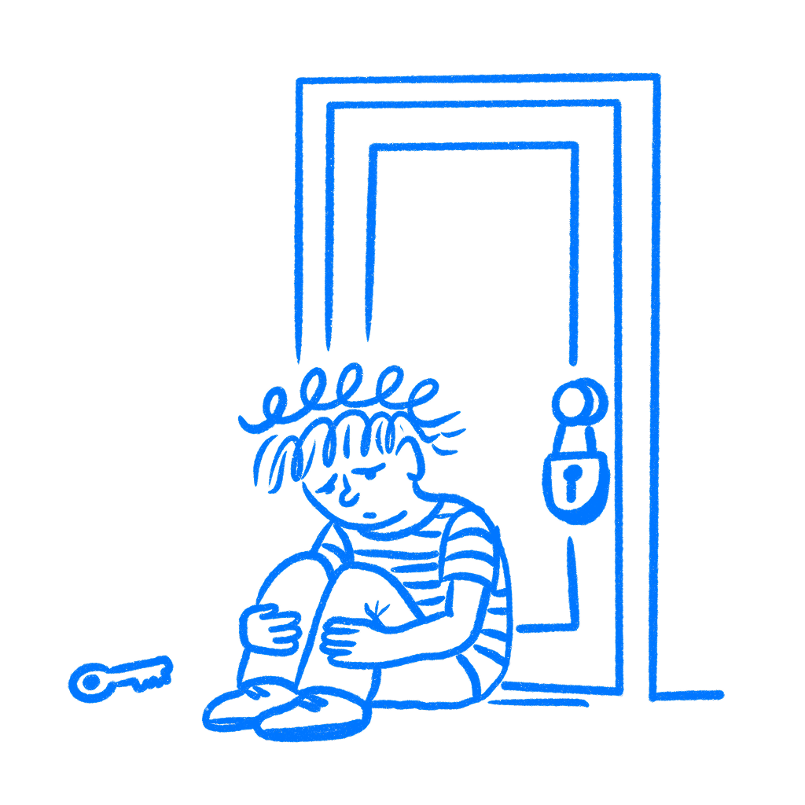

## Chapter 30 · Your Design Made Them Quit

*How repeated failure teaches users to give up*

When users abandon a product, designers often reach for the same explanation: the user was just not motivated enough. They hit one obstacle and gave up. If they had really cared about the outcome, they would have pushed through. The product just filtered out the people who were not serious.

That explanation lets the design off the hook. It turns a design failure into something the user gets blamed for instead. Then teams keep building the same broken experiences and blaming the people who could not get through them. I have heard versions of that on product teams more than once.

On October 1, 2013, millions of Americans tried to use [HealthCare.gov](https://en.wikipedia.org/wiki/HealthCare.gov) to sign up for health insurance. These were not casual visitors with mild curiosity. Many of them needed coverage. Some had gone uninsured for years. The motivation was real.

Four million people visited the site that first day. By evening, six had enrolled. Everyone else hit errors, timeouts, broken account creation flows, and messages that explained nothing. Then they quit cold. That kind of number should make any designer nervous.

The real question is why people with genuine need walked away. The site broke, but that alone does not explain why people who needed this still stopped trying.

It was not about weak motivation. It was about what repeated failure does when people cannot see a way through.

> *Passivity in response to shock is not learned. It is the default response.*
> — Steven Maier & Martin Seligman

### Why people stop trying

In 1967, [Martin Seligman and Steven Maier](https://pubmed.ncbi.nlm.nih.gov/6032570/) were running experiments at the University of Pennsylvania that were supposed to study fear conditioning in dogs. They put dogs in harnesses and administered mild electric shocks. Later, they moved the dogs to a box where jumping a low partition would end the shocks. Most dogs figured this out fast. But the dogs that had been given inescapable shocks in the harness, shocks they had no way to stop, mostly just lay down and waited for the pain to stop. They could have escaped. They did not try.

Seligman and Maier called this learned helplessness. The dogs had learned, through repeated exposure to outcomes they could not control, that nothing they did made any difference. That lesson carried over to the next setting, even though escape was now possible.

Almost fifty years later, the same researchers returned to the work with better tools and found something important. Their 2016 paper in [Psychological Review](https://pmc.ncbi.nlm.nih.gov/articles/PMC4920136/) concluded that the passivity they had observed was not learned at all. “Passivity in response to shock is not learned. It is the default, unlearned response to prolonged aversive events.” In other words, shutting down comes easily. What has to be learned, through successful action, is that effort can still change the result.

### The shutdown spreads

That matters for product work. Each time a user hits an error they cannot read, a flow that dies with no next step, or a form that rejects input without saying why, they spend effort and get nowhere. One bad moment is not enough on its own. But it stacks up. [Donald Hiroto and Martin Seligman](https://www.appstate.edu/~steelekm/classes/psy5150/Documents/Hiroto&Seligman1975-learned-helplessness.pdf) showed in 1975 that this habit of giving up can spread from one situation to another.

The effect does not stay tied to the first bad moment. I have watched that freeze spread across a bad flow in minutes, especially once users start assuming the next step will fail too.

For a product, this means a broken onboarding does not just cost you that session. It trains users to expect trouble the next time too.

### Six people got through

The HealthCare.gov numbers are hard to ignore. Four million people that day, six completions. The site returned errors throughout account creation, timed out under load, and offered messages so vague that users had no way to know whether the problem was on their end or the government’s.

The errors themselves were not the whole problem. Errors happen. The real damage came from the dead end after each one. A message that says something failed, with no clue what happened, no signal whether to wait or retry or call a number, and no path forward at all, is not neutral.

It leaves the user stuck. They tried. The result was bad. Nothing they did changed it. Each round of that pattern pushed them closer to the default state: stop trying. After a while, people stop expecting the next attempt to go any better.

### Check the first broken moment

Most designers spend more time thinking about what happens when things work. They design the happy path with care and leave the broken states for later. That is backwards. Broken states are where people either keep going or start giving up. A dead-end form error on step three can erase all the work you did on steps one and two. Those moments look minor right up until users hit them.

Before releasing any user-facing flow, run the First Failure Test. Go through the flow and trigger every broken state you can find. For each one, ask a single question: does the user have a specific action they can take right now? Not a vague acknowledgment of the problem. Not an apology. A real next step they can actually take. In practice, this is where a lot of flows fall apart.

This catches more design failure than most teams want to admit.

“Something went wrong” is not an action. “Try again later” is not an action. “Contact support” without a direct link or number is not an action. I have seen products hide behind lines like that for years. Those messages put the user in the position that produces helplessness: a bad result and no move that changes anything.

What helps is not a perfect flow with no failure. What helps is control. Seligman’s research showed that even in situations where negative outcomes could not be prevented, people who retained a sense of agency over their responses did not develop helplessness in the same way. An error message that says “Your session timed out. Click here to pick up where you left off” is not just better copy. It gives the user a real next move.

Run this test before you ship. Run it on every state your product can reach. The question stays simple: does the user have somewhere to go from here? If they do not, you are building a product that teaches people to quit.

If people keep giving up, the design is part of the problem.

### References & Sources

- **Seligman, M. E. P., & Maier, S. F. (1967). Failure to escape traumatic shock.** Journal of Experimental Psychology, 74(1), 1–9. [https://pubmed.ncbi.nlm.nih.gov/6032570/](https://pubmed.ncbi.nlm.nih.gov/6032570/)
- **Hiroto, D. S., & Seligman, M. E. P. (1975). Generality of learned helplessness in man.** Journal of Personality and Social Psychology, 31(2), 311–327. [https://www.appstate.edu/~steelekm/classes/psy5150/Documents/Hiroto&Seligman1975-learned-helplessness.pdf](https://www.appstate.edu/~steelekm/classes/psy5150/Documents/Hiroto&Seligman1975-learned-helplessness.pdf)
- **Maier, S. F., & Seligman, M. E. P. (2016). Learned helplessness at fifty: Insights from neuroscience.** Psychological Review, 123(4), 349–367. [https://pmc.ncbi.nlm.nih.gov/articles/PMC4920136/](https://pmc.ncbi.nlm.nih.gov/articles/PMC4920136/)
- **Wikipedia: Learned helplessness.** [https://en.wikipedia.org/wiki/Learned_helplessness](https://en.wikipedia.org/wiki/Learned_helplessness)
- **Nielsen Norman Group: Error Messages Are an Anti-Pattern.** [https://www.nngroup.com/articles/error-messages-ux-failures/](https://www.nngroup.com/articles/error-messages-ux-failures/)
- **Simply Psychology: Learned Helplessness: Seligman's Theory.** [https://www.simplypsychology.org/learned-helplessness.html](https://www.simplypsychology.org/learned-helplessness.html)
- **Wikipedia: HealthCare.gov.** [https://en.wikipedia.org/wiki/HealthCare.gov](https://en.wikipedia.org/wiki/HealthCare.gov)
