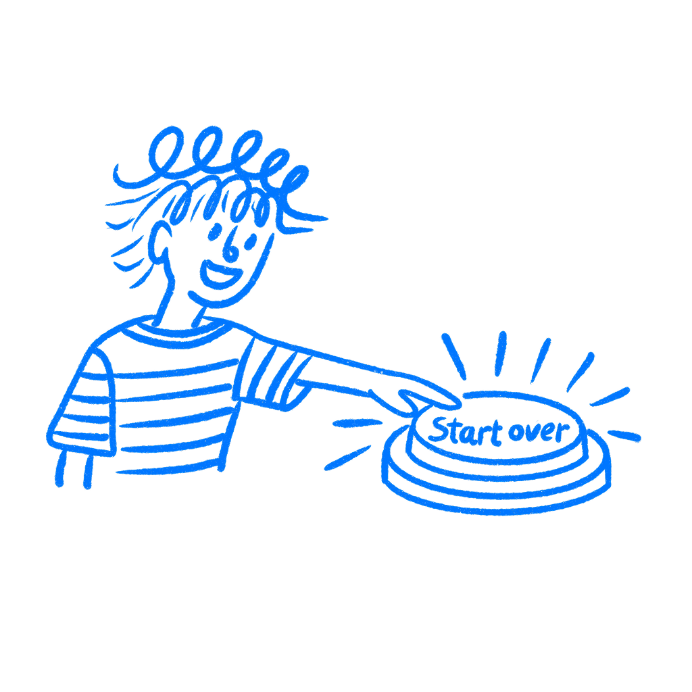

## Chapter 33 · A Redesign Won't Save You

*Why a redesign is usually the wrong answer*

This is what a redesign pitch sounds like. A product has gotten messy. The flows feel bolted together. The codebase is a nightmare. A proper redesign would clean it up in one go, with a fresh start and the right architecture from the beginning. It sounds decisive. It sounds like the kind of call a serious designer makes when things have gotten bad enough. I have heard this pitch many times.

That is almost never the right call. And the reason you reach for it anyway has more to do with your own psychology than with the state of the product.

### How products get messy

Products do not get messy because a team set out to make them messy. Nobody sits down and plans a confusing checkout route or a settings screen that takes four taps to find. It happens in layers. A button gets added because a stakeholder asked for it. A modal appears because someone needed to surface an edge case. A new feature lands on a screen that was never meant to hold it. Then someone says the whole thing looks dated and starts dreaming about a clean slate.

Each decision was small. Each one felt reasonable at the time. And nobody was really stepping back to ask what all those small decisions were adding up to.

[C. Northcote Parkinson](https://en.wikipedia.org/wiki/Law_of_triviality) described this in 1958: teams spend two hours arguing about a button label while nobody questions the architecture that button sits on. The small stuff gets debated because it is easy to see and easy to have opinions about. The big stuff grows in the background because no single person can hold all of it in their head at once.

This is UX debt. Not one dramatic failure you can point to, but the accumulated cost of a thousand small shortcuts. The [Nielsen Norman Group](https://www.nngroup.com/articles/ux-debt/) has described this pattern across product teams: the longer you wait to address it, the harder and more expensive it gets. Most teams know this and still hope the bill stays small.

### Starting over feels easier

When things reach a certain level of mess, designers start thinking about escape. The pitch writes itself: the problems are too tangled to fix one by one, a real redesign would let the team do it right for once, and staying in the old system is just digging the hole deeper. What the pitch leaves out is the planning fallacy.

[Daniel Kahneman and Amos Tversky](https://web.mit.edu/curhan/www/docs/Articles/15341_Readings/Behavioral_Decision_Theory/Kahneman_Tversky_1979_Prospect_theory.pdf) identified the planning fallacy in 1979, and [Buehler, Griffin, and Ross](https://psycnet.apa.org/record/1994-43945-001) confirmed it in 1994: people consistently underestimate how long their own future projects will take, even knowing their past projects ran over. A redesign looks clean in the planning stage because nothing in it has hit reality yet.

The current product is real, with real constraints and oddball cases you have already mapped. The replacement exists only as a concept. The comparison is never fair.

There is also the Not-Invented-Here problem. [Ralph Katz and Thomas Allen](https://www.semanticscholar.org/paper/Investigating-the-Not-Invented-Here-(NIH)-syndrome%3A-Katz-Allen/b0186c15cc7e24b4b23fceb86b7b1b765b1c58f4) documented this in research on engineering teams: groups rated internally developed solutions as superior to outside alternatives, not because they were. Redesign conversations often start here.

The existing system was built by the previous team, and somewhere in the background there is an instinct that says you would not have built it this way. I know how tempting that thought is.

### Digg broke the thing people knew

In 2010, [Digg launched version 4](https://en.wikipedia.org/wiki/Digg). The company was struggling, growth was flat, and the team had real architectural problems to fix. They decided a complete overhaul was the answer. New features, new interface, new publisher partnerships, shipped simultaneously.

The people who used Digg had spent years building habits around it. They knew where things were. They had learned the system. Version 4 replaced all of that with an interface that prioritized publisher content over user-submitted links, moved navigation people had memorized, and launched with enough bugs to make basic functions unreliable.

Users did not wait around to see if it would improve. They left.

Traffic dropped 26 percent the month after launch. Many users moved to Reddit and stayed there. Digg sold in 2012 for $500,000. The company had been valued at $200 million at its peak.

Nobody at Digg wanted to destroy their product. They were trying to fix it. But they tried to fix everything at once, in one public launch, with no ability to roll back to something users already trusted. The scale of the redesign was the mistake, not the intention behind it.

### Name five real problems first

Before any rebuild conversation gets traction, there is one thing worth doing. Write down five concrete problems the redesign is meant to solve. Not general frustrations. Named problems. “Users abandon the checkout flow at the confirmation step at a rate of 38 percent” is one. “This feels dated” is not. If you can list five grounded problems with evidence behind them, and you can show that they share the same deeper cause that cannot be fixed without rebuilding, then the discussion is worth having. If you cannot get to five, you probably do not have a redesign problem. You have frustration, inherited mess, or a system that feels uglier than it is broken.

The alternative is less exciting to present in a meeting. Pick the worst problem on your list. Fix it. Measure whether it improved. Pick the next one. This is slower, it never feels like enough, and it does not make for a good stakeholder slide. But redesigns nearly always turn out larger than the room pretended they would be.

The instinct to redesign is not irrational. When the system has been getting messier for two years, the desire to fix it for real is not wrong. What breaks down is the assumption that a clean start is available. Many of the constraints that pushed the current product toward complexity will still be there when you start again.

Stakeholders will ask for the same things. Weird cases will still exist. The timeline will still compress.

Starting over does not remove the hard parts. It usually just asks you to meet them again from the beginning.

### References & Sources

- **Buehler, R., Griffin, D., & Ross, M. (1994). Exploring the "planning fallacy": Why people underestimate their task completion times.** Journal of Personality and Social Psychology, 67(3), 366–381. [https://doi.org/10.1037/0022-3514.67.3.366](https://doi.org/10.1037/0022-3514.67.3.366)
- **Parkinson, C. N. (1958). Parkinson's Law and Other Studies in Administration.** Houghton Mifflin. [https://en.wikipedia.org/wiki/Law_of_triviality](https://en.wikipedia.org/wiki/Law_of_triviality)
- **Katz, R., & Allen, T. J. (1982). Investigating the not invented here (NIH) syndrome.** R&D Management, 12(1), 7–19. [https://www.semanticscholar.org/paper/Investigating-the-Not-Invented-Here-(NIH)-syndrome%3A-Katz-Allen/b0186c15cc7e24b4b23fceb86b7b1b765b1c58f4](https://www.semanticscholar.org/paper/Investigating-the-Not-Invented-Here-%28NIH%29-syndrome%3A-Katz-Allen/b0186c15cc7e24b4b23fceb86b7b1b765b1c58f4)
- **Wikipedia: Planning fallacy.** [https://en.wikipedia.org/wiki/Planning_fallacy](https://en.wikipedia.org/wiki/Planning_fallacy)
- **Nielsen Norman Group: UX Debt: When Shortcuts Accumulate.** [https://www.nngroup.com/articles/ux-debt/](https://www.nngroup.com/articles/ux-debt/)
- **Wikipedia: Digg.** [https://en.wikipedia.org/wiki/Digg](https://en.wikipedia.org/wiki/Digg)
