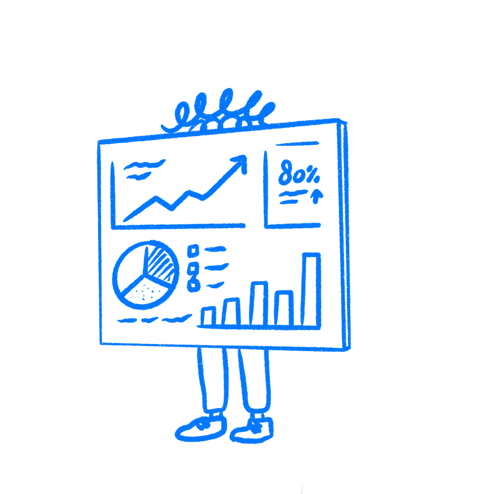

## Chapter 34 · The Metric Is Not the User

*Why optimizing for the metric stops you seeing the user*

At some point your team decided a metric would tell you if the product was working. Maybe it was daily active users. Maybe retention, NPS, session length, or some engagement score. The choice made sense. The number seemed close enough to something you cared about. Then it became the target. People started working toward it. I have seen this happen in calm, sensible meetings, which is part of the problem.

And somewhere in that process, without anyone announcing it, the number stopped being a signal and started driving the work.

There is no clean failure point you can circle later. It happens in sprint reviews, roadmap calls, and A/B test readouts. Nobody says they want to stop caring about users. The measure slowly becomes the thing, and the people behind it start fading out of the conversation. The dashboard looks healthy. The product may not be.

### The number stops showing the user

Economics has a clean name for this. When a measure becomes a target, it stops being a good measure. The economist [Charles Goodhart](https://en.wikipedia.org/wiki/Goodhart%27s_law) identified this in 1975 while studying monetary policy. Once a measure gets used to steer decisions, people start working the measure itself. They stop working the thing it used to point at. The link loosens, then breaks.

The social scientist [Donald Campbell](https://doi.org/10.1016/0149-7189(79)90048-X) made it sharper:

> *The more any quantitative social indicator is used for social decision-making, the more subject it will be to corruption pressures.*
> — Donald T. Campbell

Campbell was writing about government programs and education policy. It also describes plenty of quarterly reviews.

The pattern is older than software. When British colonial authorities in India offered a bounty for dead cobras to reduce the snake population, local entrepreneurs began breeding cobras to collect the reward. When the government discovered this and canceled the program, the breeders released their now-worthless snakes. The cobra population ended up larger than before. The metric had been optimized perfectly. The goal got worse.

This drift does not need cheating. It runs on normal work. Designers push screens toward clicks because clicks get tracked. Engineers ship things that stretch session length because that line is on the dashboard. Product managers push down work that helps people but does not move the target, because the target is how progress gets judged. Everyone is doing the job in front of them. A few sprints later the person using the product is barely in the conversation, and the dashboard is still green.

Jerry Muller spent a whole book on this. [The Tyranny of Metrics](https://press.princeton.edu/books/hardcover/9780691174952/the-tyranny-of-metrics) documents the same pattern across hospitals, schools, police departments, and universities. The number stands in for the thing it used to track. Most people do not notice until the gap gets too wide to hide.

### Facebook found this too

In 2018, Facebook’s internal research team built a presentation warning that the News Feed algorithm was exploiting what they called the human brain’s attraction to divisiveness.

Facebook had been optimizing for engagement: reactions, comments, reshares. That was the target. It worked. Engagement went up. Angry content went up too, because anger drives reactions fast. Misinformation spread for the same reason. The research team proposed fixes. The company did not adopt the changes in a way that solved the underlying problem, while engagement remained central to how the business was run.

This came out in 2021 when [Frances Haugen](https://en.wikipedia.org/wiki/Frances_Haugen) [shared the internal documents](https://www.wsj.com/articles/the-facebook-files-11631713039) with the Wall Street Journal. Those files showed that Facebook’s researchers understood the problem and wrote it down in plain language. The metric kept winning anyway.

Goodhart’s Law does not just distort the metric. It can also distort the judgment of people who have spent long enough treating it as proof that things are working.

### Ask the worst-case question

Metrics are useful. Trouble starts when the team treats them like the user.

Before any metric goes on a dashboard as a target, ask one question: what is the worst way someone could hit this number? What could push it up while making the product worse for anyone who is not staring at the chart?

If you can answer that question, you have found the failure mode waiting for you. It will show up sooner or later if the team keeps chasing the number. This is about seeing the gap early, while you can still do something about it. I like this question because it makes teams say the ugly version out loud before they ship it.

### The metric is not the user

Metrics drift from reality faster when teams stop talking to users. When the numbers look good, people feel less pressure to go check. The dashboard creates a quiet kind of confidence. Things look fine, so people assume they are fine.

Meanwhile people are adapting. They build workarounds. They put up with friction nobody fixed. Some are already close to leaving. A chart can look healthy while support tickets keep filling with the same complaint. You do not see that on the chart until the drop shows up too late to help.

Teams that avoid this do not have magic metrics. They run usability sessions when the numbers look good. They read support tickets when retention looks healthy. Not because they hate data. Because they know the numbers and the lived experience can drift apart for a long time. I trust teams more when they keep looking after the dashboard tells them to relax.

The metric started as a signal. Then it took the user’s place.

### References & Sources

- **Goodhart, C. A. E. (1975). Problems of monetary management: The U.** K. experience. [https://en.wikipedia.org/wiki/Goodhart%27s_law](https://en.wikipedia.org/wiki/Goodhart%27s_law)
- **Campbell, D. T. (1979). Assessing the impact of planned social change.** Evaluation and Program Planning, 2(1), 67–90. [https://en.wikipedia.org/wiki/Campbell%27s_law](https://en.wikipedia.org/wiki/Campbell%27s_law)
- **Muller, J. Z. (2018). The Tyranny of Metrics.** Princeton University Press. [https://press.princeton.edu/books/hardcover/9780691174952/the-tyranny-of-metrics](https://press.princeton.edu/books/hardcover/9780691174952/the-tyranny-of-metrics)
- **Harris, M., & Tayler, B. (2019). Don't let metrics undermine your business.** Harvard Business Review. [https://hbr.org/2019/09/dont-let-metrics-undermine-your-business](https://hbr.org/2019/09/dont-let-metrics-undermine-your-business)
- **Horwitz, J. (2021). The Facebook Files.** Wall Street Journal. [https://www.wsj.com/articles/the-facebook-files-11631713039](https://www.wsj.com/articles/the-facebook-files-11631713039)
- **Wikipedia: Cobra effect.** [https://en.wikipedia.org/wiki/Cobra_effect](https://en.wikipedia.org/wiki/Cobra_effect)
