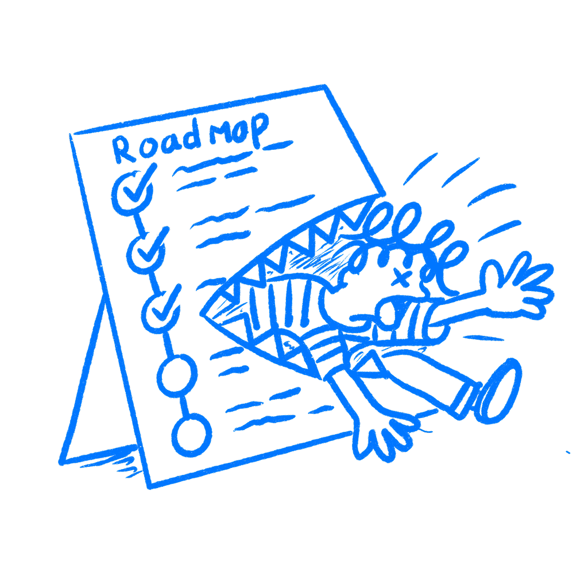

## Chapter 35 · The Roadmap Ate the User

*Why teams keep building things they know aren't working*

The roadmap stopped being a plan and became the thing you were serving.

That switch is easy to miss. It sounds responsible while it is happening. The team stops asking what the user needs and starts asking how to honor what got promised three planning meetings ago.

This is about commitment to the plan itself: dates, scope, milestones, promises already made. The roadmap starts carrying more weight in the room than the user evidence that came in later.

### The commitment starts doing the thinking

[Barry Staw](https://strategy.sjsu.edu/www.stable/B290/reading/Staw,%20B%20M,%201976,%20Organizational%20Behavior%20and%20Human%20Performance.%2016%20pp%2027-44.pdf) described escalation of commitment in 1976. People who felt responsible for an earlier decision put even more resources into it after things went bad. He wrote that “Persons committed the greatest amount of resources to a previously chosen course of action when they were personally responsible for negative consequences.”

That is what a roadmap can become inside a company. It stops feeling like a rough guess and starts feeling like a chain of public commitments. Once that happens, changing course no longer feels like product learning. It feels like failure.

[Kahneman](https://us.macmillan.com/books/9780374275631/thinkingfastandslow) and the planning fallacy matter here because plans always arrive with false confidence. Teams picture how the work should go. They do not judge it against how work like this usually goes. The roadmap starts overconfident and then gets defended as if it were reality.

That is why roadmap language gets dangerous so fast. Once dates and milestones are written down, they stop sounding provisional. They start sounding earned. The team forgets that the plan was a guess made under earlier conditions and starts treating it like something the future is now obliged to respect.

### The FBI kept serving the project

The FBI spent five years and $170 million on the [Virtual Case File](https://en.wikipedia.org/wiki/Virtual_Case_File) project. Engineers warned about problems. External reviewers warned about problems. The evidence kept coming in. The project kept moving anyway. In April 2005, the FBI abandoned it without deploying it.

This is why the case matters. The project did not keep moving because the value had suddenly become clearer. It kept moving with a plan, money, political weight, and organizational identity already tied up in seeing it through.

A roadmap can keep turning old promises into new pressure.

Most product teams will never run a project that large. The mechanism is the same in smaller rooms. A feature gets announced in planning. Sales hears about it. Marketing puts it in a deck. Leadership repeats the date in a review. Then new user evidence arrives and nobody wants to be the person who says the commitment should come back off the table.

That is when the feature stops being a response to a problem and becomes a promise the team feels tied to. Once that switch happens, changing course starts sounding disloyal instead of sensible.

### What disappears when the plan hardens

Once the roadmap hardens, the user problem starts fading out of the conversation.

You stop asking “should we still build this?” and start asking “how do we land this in Q3?” You stop asking whether the feature is the right answer and start asking which version of the feature is feasible before the date. The inside view takes over. The team knows the plan in detail, so the plan starts feeling more real than the user signal that came in later.

I have seen this on teams where everyone in the room knew a feature was weak and still talked about it only in terms of delivery risk. That is when the roadmap has already won.

This is also where language gives the game away. People start saying things like “we need to honor the commitment” or “we are too far in to reopen scope.” That sounds disciplined. Sometimes it is just a plan being defended after the facts changed.

### What to reopen

Put one meeting on the calendar that is not about status. Use it to ask the problem again.

The question should be simple: if we were starting today, knowing what we know now, would this still be on the roadmap? Not “are we on track?” That question only measures loyalty to the plan. Ask whether the commitment still deserves to exist.

If the answer is no, change the roadmap. That is not drift. That is the job.

And if the answer is maybe, force the maybe into the open. Too many roadmap reviews skip straight from status to reassurance. The useful meeting is the one that makes uncertainty visible before more work hardens around it.

If you cannot say “we are less sure than we were two weeks ago” without the room getting tense, the roadmap is already far too powerful. I have been in those meetings. You can feel the room tighten before anyone even finishes the sentence.

Users do not care what quarter the promise was made in. They only meet what shipped.

### References & Sources

- **Staw, B. M. (1976). Knee-deep in the Big Muddy: A study of escalating commitment to a chosen course of action.** Organizational Behavior and Human Performance, 16(1), 27–44. [https://strategy.sjsu.edu/www.stable/B290/reading/Staw,%20B%20M,%201976,%20Organizational%20Behavior%20and%20Human%20Performance.%2016%20pp%2027-44.pdf](https://strategy.sjsu.edu/www.stable/B290/reading/Staw,%20B%20M,%201976,%20Organizational%20Behavior%20and%20Human%20Performance.%2016%20pp%2027-44.pdf)
- **Buehler, R., Griffin, D., & Ross, M. (1994). Exploring the "planning fallacy": Why people underestimate their task completion times.** Journal of Personality and Social Psychology, 67(3), 366–381. [https://doi.org/10.1037/0022-3514.67.3.366](https://doi.org/10.1037/0022-3514.67.3.366)
- **Kahneman, D. (2011). Thinking, Fast and Slow.** Farrar, Straus and Giroux. [https://us.macmillan.com/books/9780374275631/thinkingfastandslow](https://us.macmillan.com/books/9780374275631/thinkingfastandslow)
- **Wikipedia: Escalation of commitment.** [https://en.wikipedia.org/wiki/Escalation_of_commitment](https://en.wikipedia.org/wiki/Escalation_of_commitment)
- **Wikipedia: Planning fallacy.** [https://en.wikipedia.org/wiki/Planning_fallacy](https://en.wikipedia.org/wiki/Planning_fallacy)
- **Wikipedia: Virtual Case File.** [https://en.wikipedia.org/wiki/Virtual_Case_File](https://en.wikipedia.org/wiki/Virtual_Case_File)
- **The Decision Lab: Escalation of Commitment.** [https://thedecisionlab.com/biases/escalation-of-commitment](https://thedecisionlab.com/biases/escalation-of-commitment)
