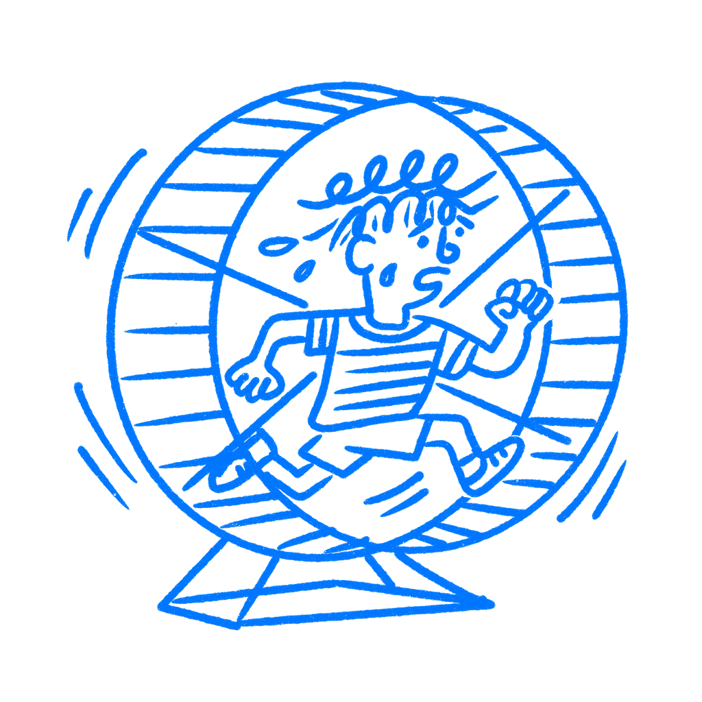

## Chapter 37 · You Design the Same Mistakes

*Why teams keep making the same mistakes*

Somewhere right now, a design team is arguing about whether navigation belongs in a sidebar or across the top. The same company had this exact argument three years ago. Someone ran the research, made the call, shipped it, and watched it underperform. The decision got reversed. Notes got written. Then the people who remembered the details started leaving. A new designer joined from a company that loved sidebars. Now the debate is back, as if none of it happened, burning another two weeks and landing in the same place.

This happens because teams forget. Smart teams do it too.

### Knowledge leaves with people

Every organization runs on two kinds of knowledge. One lives in documents: specs, postmortems, design files, meeting notes. The other lives in people’s heads: the context behind decisions, the parts that never made it into the writeup, the memory of why something got tried and killed. Psychologist [Daniel Wegner](https://link.springer.com/book/10.1007/978-1-4612-4634-3) called this transactive memory, knowledge stored across the group instead of inside one person, with each person knowing who tends to know what.

The system works as long as the people stay. Wegner’s research showed that groups with stable membership did better on recall tasks than groups where people had changed, because they had built an internal map of expertise. One person knows the user research history. Another remembers what happened in the last nav redesign. Someone else was in the room when the CEO killed the modal pattern. As long as those people are still there, the team has working memory.

Then one person leaves. Then another. The knowledge does not move cleanly into documents, because much of it was never written down in a useful way. What made that sidebar fail may have been a mix of the user segment at the time, the technical constraints of the build, and a product strategy that has since changed. None of that shows up in the changelog. [Barbara Levitt and James March](https://web.mit.edu/curhan/www/docs/Articles/15341_Readings/Organizational_Learning_and_Change/Levitt_March_Org_Learning.pdf) described organizational learning as

> *encoding inferences from history into routines that guide behavior.*
> — Levitt & March

That process breaks when the people doing the encoding leave. What remains in the documents is often the outcome without the reasoning.

### The team forgets and starts over

[James Walsh and Gerardo Ungson](https://doi.org/10.2307/258607) studied what happens to knowledge inside organizations when people leave. Of all the places organizations try to store what they know, individual members carry the most nuanced version of it. They also disappear the fastest.

Organizations almost never call this forgetting. Nobody says we lost the institutional memory on this. They say let’s take a fresh look. They run another workshop. They build another prototype. They call it iteration. From the outside it looks like progress. Often it is the company paying to learn the same lesson again. The same bad modal comes back with a cleaner visual treatment.

### MySpace repeated the same lesson

When News Corporation acquired [MySpace](https://en.wikipedia.org/wiki/Myspace) in 2005 for $580 million, it inherited a platform with real problems: slow load times, an ad-heavy layout, and weak mobile performance. Those were not hidden problems. They were visible product problems on a huge platform.

What followed was years of trying to improve the business without really escaping those core issues. The site stayed cluttered. The ad load remained part of the experience. Mobile did not become a strength in time. That does not prove every problem came from lost organizational memory. But it does show what happens when a company keeps carrying old product debt without a clear shared memory of how it got there or what trade-offs kept it in place. MySpace was sold in 2011 for $35 million.

### Ask this before you start again

The fix starts with a habit. Before you reopen a decision, stop and ask whether this has already been tried. Most teams do not need more documents. They need the instinct to check what the company already learned before starting from zero again.

Be specific. Ask who ran the usability tests on the sidebar layout. Ask what happened the last time onboarding changed. Ask what came out of the tooltip launch in 2022. Somewhere, those answers exist. They may be sitting in someone’s head, buried in a Notion page nobody has opened in eighteen months, or half-remembered by a contractor who worked there three summers ago and is still in Slack.

Design systems are one partial answer. [Nielsen Norman Group](https://www.nngroup.com/articles/design-systems-101/) describes a design system as a shared language that reduces the need to relitigate choices across teams and time. But a design system captures craft decisions more easily than research decisions. It does not tell you why a pattern failed last time, what users struggled with, or which trade-off forced the team to back away from it.

For that, someone needs to remember. And for someone to remember, the team has to treat memory as an asset, not as friction in the way of fresh thinking. I have seen teams act like history is baggage right before they repeat it. The people who have been there longest often hold more of the real product memory than any system does.

The most expensive thing your team does is learn the same lesson twice.

### References & Sources

- **Wegner, D. M. (1987). Transactive memory: A contemporary analysis of the group mind.** In B. Mullen & G. R. Goethals (Eds.), Theories of Group Behavior (pp. 185–208). Springer. [https://link.springer.com/book/10.1007/978-1-4612-4634-3](https://link.springer.com/book/10.1007/978-1-4612-4634-3)
- **Walsh, J. P., & Ungson, G. R. (1991). Organizational memory.** Academy of Management Review, 16(1), 57–91. [https://doi.org/10.2307/258607](https://doi.org/10.2307/258607)
- **Levitt, B., & March, J. G. (1988). Organizational learning.** Annual Review of Sociology, 14, 319–340. [https://web.mit.edu/curhan/www/docs/Articles/15341_Readings/Organizational_Learning_and_Change/Levitt_March_Org_Learning.pdf](https://web.mit.edu/curhan/www/docs/Articles/15341_Readings/Organizational_Learning_and_Change/Levitt_March_Org_Learning.pdf)
- **Wikipedia: Organizational memory.** [https://en.wikipedia.org/wiki/Organizational_memory](https://en.wikipedia.org/wiki/Organizational_memory)
- **Wikipedia: Transactive memory.** [https://en.wikipedia.org/wiki/Transactive_memory](https://en.wikipedia.org/wiki/Transactive_memory)
- **Wikipedia: Myspace.** [https://en.wikipedia.org/wiki/Myspace](https://en.wikipedia.org/wiki/Myspace)
- **Nielsen Norman Group: Design Systems 101.** [https://www.nngroup.com/articles/design-systems-101/](https://www.nngroup.com/articles/design-systems-101/)
