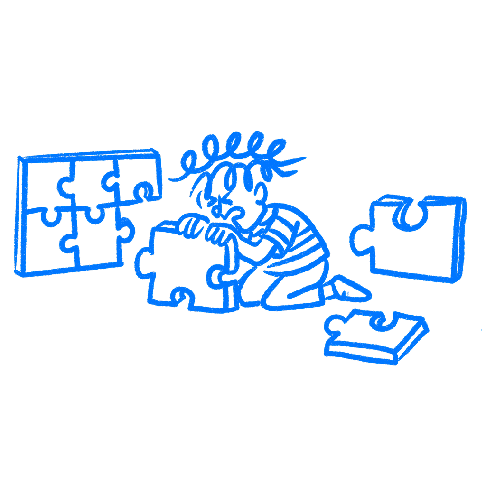

## Chapter 38 · You Solved the Wrong Problem

*How problem framing decides what gets solved*

The brief lands on your desk. Someone has already named the problem. You read it, nod, open your tool, and start designing. The mistake often happens before any wireframe or copy draft exists. It happens in the few seconds where you accept someone else’s definition without checking it.

Designers are trained to solve. School, portfolios, and job interviews usually reward answers more than reframing. The question of whether the answer fits the actual problem gets much less attention. So you get good at solving, and without noticing, you stop asking what you are solving for.

### The frame shapes the answer

In 1983, [Donald Schön](https://www.basicbooks.com/titles/donald-a-schon/the-reflective-practitioner/9780465068784/) wrote something that should have changed how design education works but mostly didn’t. He made a distinction between problem solving and what he called problem setting. Problem setting is the act of deciding which things to treat as problematic in the first place: naming the situation, framing it, deciding what counts as a relevant fact.

The way a problem gets framed shapes what you end up designing. Frame the problem as “users can’t find the checkout button” and you look at the button. Frame it as “users don’t trust this store enough to complete a purchase” and you look at a completely different set of things. The behavior is the same, but the work changes. The frame starts narrowing the answer before a single line gets drawn.

[Kees Dorst](https://doi.org/10.1016/j.destud.2011.07.006), who spent years studying how expert designers actually think, found that framing plays a central role in the work. Experienced designers do not rush toward answers. They stay with the problem longer. They resist the first frame they are handed. They try other ways of looking at it before they commit to a path.

### Some problems change as you work on them

[Horst Rittel and Melvin Webber](https://urbanpolicy.net/wp-content/uploads/2015/06/Rittel-Webber_1973_DilemmasInAGeneralTheoryOfPlanning.pdf) named a category of problem in 1973 that most designers are dealing with every day without a word for it. Unlike tame problems, which have clear endpoints and correct solutions, these problems shift when you touch them. Solving one aspect changes the conditions of all the others.

> *Social problems are never solved. At best they are only re-solved, over and over again.*
> — Rittel & Webber

Many design problems work like this. You design the onboarding flow to reduce drop-off. Reducing drop-off means more users reach the core product, which strains support. Solving churn reveals a retention problem you had not seen. The system moves when you push it.

Rittel and Webber’s point was not that these problems are hopeless. It is that they punish anyone who looks for one clean answer. The system keeps moving under your feet.

The reason this matters for designers is that narrow framing is the default. You get a brief, you accept the frame in the brief, and you move. The brief says “simplify the settings page” and you simplify the settings page. But maybe the real problem is that users are reaching settings because they cannot find what they need in the main flow. Or maybe support asked for a nicer filter panel when the real issue was that search results were garbage. The settings page was a symptom, not the cause. You just made the symptom easier to live with.

### Segway solved the wrong thing

Dean Kamen’s team built the [Segway](https://en.wikipedia.org/wiki/Segway). The self-balancing system was a genuine feat of engineering. They had a clear problem statement: urban personal mobility is inefficient, and we can build something better than walking for short distances between buildings.

The device worked as designed. It moved people, balanced itself, and required almost no training. Kamen predicted cities would be redesigned around it. Only 140,000 units sold across the entire lifetime of the product. Production ended in 2020.

The team framed the problem as a device problem: build a better way to move between buildings. But the real problem was bigger than the device.

Cities had sidewalks not designed for vehicles. Regulations prohibited Segways from bike lanes and roads in most places. The $5,000 price tag put it beyond the reach of many people who might have used it for practical commuting. The social fit was shaky too.

None of that appeared in the original problem frame. The frame asked: can we build a better short-distance vehicle? It did not ask: will cities, regulators, employers, and social norms accommodate it? The team built the machine and misread the setting it had to live in.

### Stay with the problem longer

One thing that often separates less experienced designers from stronger ones is how long they stay with the problem before they start making things.

A less experienced designer is more likely to hear the brief, think it sounds clear enough, and get to work. A stronger designer slows down first. They ask what they are really solving, why it matters, and whether this is the right problem in the first place. To other people, this can look like delay. Usually it is the part that matters most. I have seen teams save weeks just by asking the plain question early enough. I have also seen teams skip that pause and spend a month polishing the wrong thing.

A lot of bad work starts with a brief that sounds reasonable but points at the wrong thing, or only part of the thing. Once the team starts designing, it gets harder to question that starting point. That is why stronger designers spend more time on the problem before they spend time on the solution.

They ask plain questions that are easy to skip. Why are we doing this? Why now? What is actually going wrong here? Are we fixing the real problem or just building someone’s suggested solution? Those questions are not glamorous, but they save a lot of wasted work.

Strong design aimed at the wrong problem still fails.

### References & Sources

- **Schön, D. A. (1983). The Reflective Practitioner: How Professionals Think in Action.** Basic Books. [https://www.basicbooks.com/titles/donald-a-schon/the-reflective-practitioner/9780465068784/](https://www.basicbooks.com/titles/donald-a-schon/the-reflective-practitioner/9780465068784/)
- **Rittel, H. W. J., & Webber, M. M. (1973). Dilemmas in a general theory of planning.** Policy Sciences, 4(2), 155–169. [https://urbanpolicy.net/wp-content/uploads/2015/06/Rittel-Webber_1973_DilemmasInAGeneralTheoryOfPlanning.pdf](https://urbanpolicy.net/wp-content/uploads/2015/06/Rittel-Webber_1973_DilemmasInAGeneralTheoryOfPlanning.pdf)
- **Dorst, K. (2011). The core of "design thinking" and its application.** Design Studies, 32(6), 521–532. [https://doi.org/10.1016/j.destud.2011.07.006](https://doi.org/10.1016/j.destud.2011.07.006)
- **Wikipedia: Wicked problem.** [https://en.wikipedia.org/wiki/Wicked_problem](https://en.wikipedia.org/wiki/Wicked_problem)
- **Nielsen Norman Group: Problem Statements in UX Discovery.** [https://www.nngroup.com/articles/problem-statements/](https://www.nngroup.com/articles/problem-statements/)
- **Interaction Design Foundation: Problem Framing.** [https://www.interaction-design.org/literature/topics/problem-framing](https://www.interaction-design.org/literature/topics/problem-framing)
- **Wikipedia: Segway.** [https://en.wikipedia.org/wiki/Segway](https://en.wikipedia.org/wiki/Segway)
