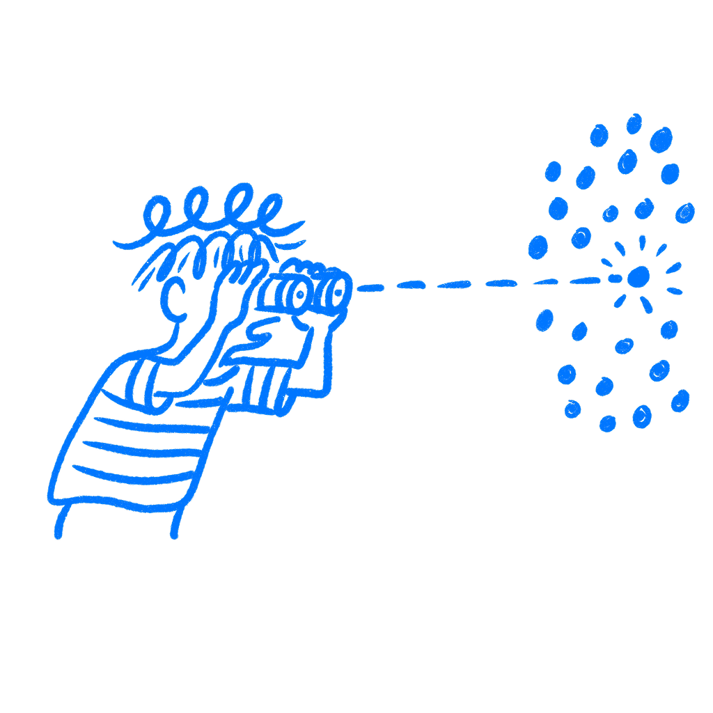

## Chapter 39 · Research as Alibi

*How teams use research to back up what they already believe*

You tell yourself you run research to find out what users want. That is not always what is happening. Sometimes the question is already answered before the study starts, and the research is there to give that answer enough weight that nobody pushes back in the meeting. The screener filters out the wrong respondents. The interview questions lean toward the preferred finding. The synthesis groups the data until the story holds. Nobody has to lie. People just stop looking once they have enough support for the answer they wanted.

This is a common bias. It shows up in decent teams with decent intentions.

### Confirmation bias protects the story

The mechanism has a name: motivated reasoning. Psychologist [Dan Kahan](https://ndg.asc.upenn.edu/wp-content/uploads/2017/08/Ideology-motivated-reasoning.pdf), whose research at Yale Law School studied how smart people arrive at wrong conclusions on matters of fact, defines it in plain terms. Motivated reasoning is

> *The tendency to conform assessments of information to some goal extrinsic to accuracy.*
> — Dan Kahan

The goal extrinsic to accuracy, in design, is usually the product you have already built or the direction your team has already committed to. The conclusion comes first. The research follows until something confirms it.

[Raymond Nickerson](https://pages.ucsd.edu/~mckenzie/nickersonConfirmationBias.pdf)’s sweeping 1998 review of confirmation bias across dozens of fields shows that the problem is not stupidity or dishonesty. The brain filters information early. Evidence that supports a held belief gets accepted faster. Evidence that threatens it gets questioned harder and longer. In one experiment by Peter Ditto and David Lopez, participants asked to evaluate an unfavorable medical test result demanded more evidence before accepting it than participants who received a favorable result. The data did not change. Their willingness to believe it did. The asymmetry is automatic, not deliberate.

You do not need to want a particular research outcome to corrupt the process. You just need to care about the thing you are researching.

### What biased research looks like

It does not look like fraud. It looks like reasonable choices made one at a time.

You recruit users who are “engaged with the product category,” meaning users already interested in products like yours. You write interview questions that ask about pain points in existing solutions, because your product solves those pain points. You run usability tests with participants who represent your imagined customer, not the full market. In the debrief, you note three quotes that validate the direction and file the two contradictory ones under “edge cases.” Every decision sounds professional. None of those decisions is neutral.

The [Dan Lovallo and Daniel Kahneman](https://hbr.org/2003/07/delusions-of-success-how-optimism-undermines-executives-decisions) HBR analysis of executive optimism in project planning shows the same pattern inside organizations. Leaders commission research, but frame it around the question “how do we execute this?” rather than “should we execute this?” The research turns into support for delivery, not a check on whether the thing deserves to be built.

### Google+ is the example

Google launched [Google+](https://en.wikipedia.org/wiki/Google%2B) in June 2011 on the back of internal research. Users wanted more control over how they shared content online. That part was real. But Google+ answered that need with a new social network built around “Circles,” in direct competition with Facebook. The research supported the problem. It did not prove that people wanted a new Google social network badly enough to adopt it.

The result was a product that addressed a real finding on paper but missed the behavior that mattered. People didn’t just want better privacy controls. They also needed a reason to leave Facebook, build a second social graph from scratch, and learn a new system. ComScore estimated that in January 2012, the average Google+ user spent about 3.3 minutes on the platform per month. Facebook users averaged over seven hours. Google+ was shut down for consumers in April 2019.

### Ask this before you trust the research

A simple check is this: before you run a study, write down what findings would cause you to cancel the project or change direction. Be specific. Not “significant usability issues,” which is vague enough to explain away. Something concrete: “If fewer than 60% of users can complete the core task without help, we rethink the flow.” Or: “If users don’t identify this problem as meaningful in their lives, we stop.”

If you cannot write that sentence, the study is probably there to document a decision, not test one.

This matters because writing down what would prove you wrong forces a hard look at what the research is actually for. Most teams skip this step not from dishonesty but because nobody asks the question out loud. The study gets designed around execution assumptions without ever specifying what outcome would change the course of the project. That is where the alibi gets built.

Research as alibi does not just waste time and money. It protects bad decisions from correction. The people in the room who had doubts see the research slide and go quiet. The stakeholder who was not sure gets outvoted by data. The designer who spotted the real problem three weeks ago never gets the opening to name it, because the research has already spoken. I have seen studies used that way when the room really just wanted cover. The alibi protects the idea and narrows the conversation that might have corrected it.

Good research is supposed to be uncomfortable. It is supposed to find things you did not already know. If your research never surprises you, it is serving the project in some other way. Research should unsettle the plan sometimes. That is part of the job.

### References & Sources

- **Kahan, D. M. (2013). Ideology, motivated reasoning, and cognitive reflection.** Judgment and Decision Making, 8(4), 407–424. [https://ndg.asc.upenn.edu/wp-content/uploads/2017/08/Ideology-motivated-reasoning.pdf](https://ndg.asc.upenn.edu/wp-content/uploads/2017/08/Ideology-motivated-reasoning.pdf)
- **Nickerson, R. S. (1998). Confirmation bias: A ubiquitous phenomenon in many guises.** Review of General Psychology, 2(2), 175–220. [https://pages.ucsd.edu/~mckenzie/nickersonConfirmationBias.pdf](https://pages.ucsd.edu/~mckenzie/nickersonConfirmationBias.pdf)
- **Ditto, P. H., & Lopez, D. F. (1992). Motivated skepticism: Use of differential decision criteria for preferred and nonpreferred conclusions.** Journal of Personality and Social Psychology, 63(4), 568–584. [https://fbaum.unc.edu/teaching/articles/jpsp-1992-Ditto.pdf](https://fbaum.unc.edu/teaching/articles/jpsp-1992-Ditto.pdf)
- **Lovallo, D., & Kahneman, D. (2003). Delusions of success: How optimism undermines executives' decisions.** Harvard Business Review, 81(7), 56–63. [https://hbr.org/2003/07/delusions-of-success-how-optimism-undermines-executives-decisions](https://hbr.org/2003/07/delusions-of-success-how-optimism-undermines-executives-decisions)
- **Nielsen Norman Group: Confirmation Bias in UX.** [https://www.nngroup.com/articles/confirmation-bias-ux/](https://www.nngroup.com/articles/confirmation-bias-ux/)
- **Wikipedia: Google+.** [https://en.wikipedia.org/wiki/Google%2B](https://en.wikipedia.org/wiki/Google%2B)
- **Wikipedia: Motivated reasoning.** [https://en.wikipedia.org/wiki/Motivated_reasoning](https://en.wikipedia.org/wiki/Motivated_reasoning)
